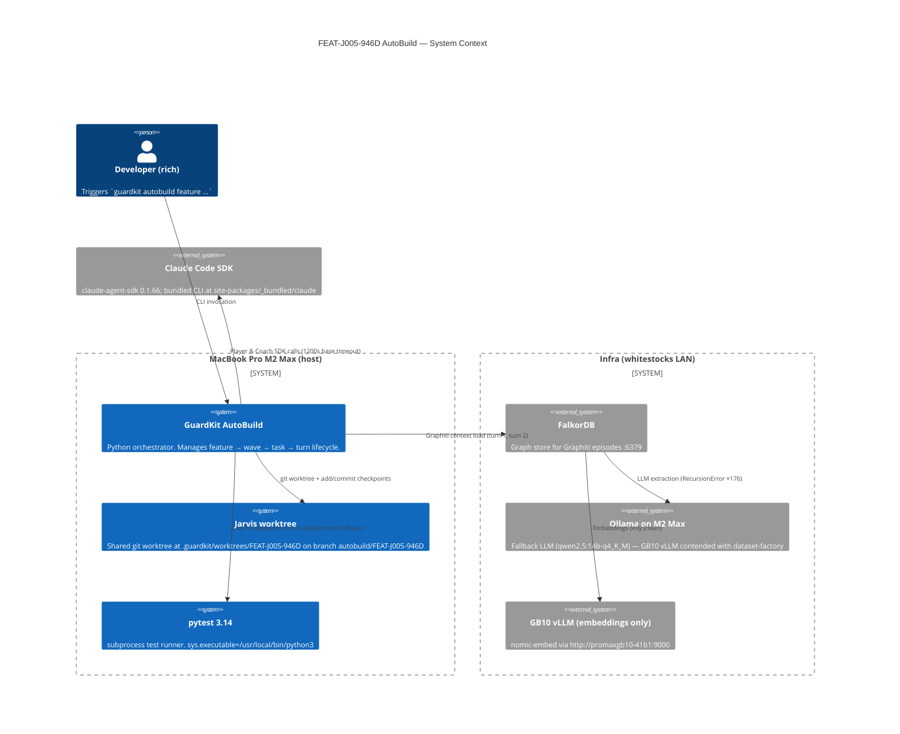
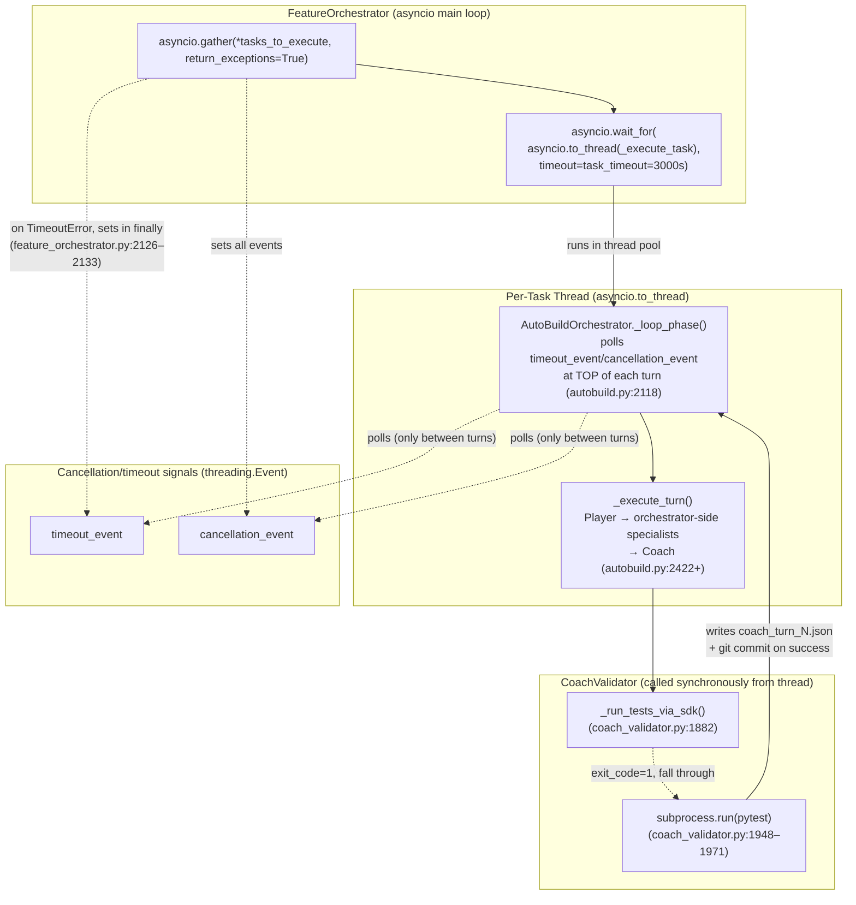

# Review Report: TASK-REV-E73C (v2 — deepened)

**Subject:** AutoBuild FEAT-J005-946D timeout failure (TASK-J005-005)
**Mode:** decision · standard depth · revised at user request to validate via source code + worktree state
**Reviewer:** /task-review (Opus 4.7, 1M context)
**Generated:** 2026-04-30
**Source artifacts:**
- Transcript: [autobuild-FEAT-J005-946D-timeout-history.md](../../docs/history/autobuild-FEAT-J005-946D-timeout-history.md) (1904 lines)
- GuardKit source: `/Users/richardwoollcott/Projects/appmilla_github/guardkit/guardkit/orchestrator/{feature_orchestrator,autobuild,agent_invoker}.py`, `quality_gates/coach_validator.py`
- Worktree (git branch `autobuild/FEAT-J005-946D`, 9 GuardKit checkpoint commits)
- Per-task artifacts: `.guardkit/worktrees/FEAT-J005-946D/.guardkit/autobuild/TASK-J005-005/{coach,player,task_work,specialist}_*.json`

---

## What changed in v2

v1 inferred mechanics from the transcript. v2 **validates each claim against
the source and the worktree** — and one of v1's claims turned out to be
partially wrong, in a load-bearing way:

| v1 claim | v2 verdict | Evidence |
|---|---|---|
| "Specialist invocations were the dominant cost" | **Confirmed** with refinement: each specialist's `sdk_timeout` IS capped against remaining wall via `_cap_specialist_timeout()`, but the cap input is **not refreshed between Phase 4 and Phase 5** (autobuild.py:2880–2904) — likely a latent bug | Code |
| "asyncio cancel-vs-completion race" | **Confirmed at the *feature* level**, but v1 missed that there is **already a per-task grace mechanism** (TASK-ABFIX-004, autobuild.py:2192–2194 + 2940–2950) that *did* fire — that's why the task's frontmatter says `approve` | Code + transcript line 1808 |
| "TASK-005 implementation is in the worktree" | **Strongly confirmed** — `js.publish` + `pipeline.build-queued.{feature_id}` + `pipeline_publish_timeout_seconds` all present at [src/jarvis/tools/dispatch.py:1142, :810, :1000](../../.guardkit/worktrees/FEAT-J005-946D/src/jarvis/tools/dispatch.py); 9 checkpoint commits; `0069a0d` committed at the exact second of timeout | Worktree git log + grep |
| "Coach SDK path is systematically broken on this machine" | **Confirmed** — root cause is a default-config issue, not a regression: `coach_test_execution` defaults to `"sdk"` ([autobuild.py:4986](../../../guardkit/guardkit/orchestrator/autobuild.py)), and Jarvis has no `.guardkit/config.yaml` to override it | Filesystem + code |
| "Raise task_timeout to 5400s" | **Reduced confidence** — the ABSR-FLOR mechanism already floors at 3000s + applies a `timeout_multiplier` (`feature_orchestrator.py:585–589`); a per-task override is the cleaner lever | Code |

---

## C4 — Context (where the failure lives)



The interesting boundaries for the failure are the three async hops inside
`guardkit`: feature-orchestrator coroutine → per-task thread → Coach
sub-orchestrator → SDK / subprocess. All four levels have their own timer
or budget. The race lives at hop 1.

---

## C4 — Container (timer & cancellation flow)



**Key invariant the diagram exposes**: signals (`timeout_event`,
`cancellation_event`) flow *one-way* from FeatureOrchestrator → thread.
The thread polls them only at well-defined checkpoints (top of turn
loop, between Player and Coach). **There is no polling between Coach
SDK fallback and final write-back.** Once Coach starts validating,
nothing inside `CoachValidator` aborts mid-flight, even if the parent
fires `timeout_event`.

---

## Sequence diagram — the actual race (TASK-J005-005 turn 2)

```mermaid
sequenceDiagram
    autonumber
    participant FO as FeatureOrchestrator<br/>(asyncio coroutine)
    participant Thr as Worker Thread<br/>(_execute_task)
    participant ABL as AutoBuildOrchestrator<br/>_loop_phase
    participant ET as _execute_turn (turn 2)
    participant CV as CoachValidator
    participant SDK as Claude SDK<br/>(pytest via tool)
    participant SP as subprocess.run<br/>(pytest)
    participant FS as Disk<br/>(coach_turn_2.json + git)

    Note over FO: T+0 = 23:03:51.974 (TASK-005 enqueued)
    FO->>+Thr: asyncio.wait_for(to_thread(_execute_task), timeout=3000s)
    Thr->>+ABL: orchestrate(...)

    Note over ABL: turn 1: feedback (13/15 ACs)<br/>~T+1959s
    ABL->>+ET: _execute_turn(turn=2)
    Note over ET: Player SDK 230s, 12 turns<br/>+ specialist:test-orchestrator ~390s<br/>+ specialist:code-reviewer ~390s
    ET->>+CV: validate(turn=2)
    Note over CV: T+~2977s

    CV->>+SDK: _run_tests_via_sdk(pytest ...)
    SDK--xCV: ProcessError exit_code=1<br/>(7th time in this run)
    CV->>+SP: subprocess.run(pytest ...) [fallback]

    Note over FO,Thr: T+3000.007s — wait_for timer fires!
    FO->>FO: TimeoutError raised; gather() collects it
    FO->>FO: finally: timeout_events[task_id].set()
    FO->>FO: finally: cancellation_event.set() (autobuild.py:2132)
    FO-->>FO: write feature YAML status=failed<br/>final_decision=timeout
    deactivate FO

    Note over SP: still running (subprocess.run is uninterruptible)
    SP-->>-CV: returncode=0 (8.3s, 5 test files, 2074 passed)
    CV-->>-ET: IndependentTestResult(tests_passed=True)
    Note over CV: T+~3000.07s
    ET-->>-ABL: turn_record(decision="approve")

    Note over ABL: TOP of next loop iteration:<br/>checks timeout_event.is_set() — TRUE
    Note over ABL: BUT line 2194:<br/>"if turn_record.decision != 'approve'"<br/>→ skip cancel/timeout!
    ABL->>FS: write coach_turn_2.json (decision=approve)
    ABL->>FS: write task frontmatter (current_turn=2)
    ABL->>FS: git commit checkpoint 0069a0d<br/>("Turn 2 complete tests: pass")<br/>at wall-clock 23:53:52
    ABL-->>-Thr: result.success=True, decision="approved"
    Thr-->>-FO: (return value discarded; gather already returned)
```

**Steps 8–10 happen AFTER step 5.** The thread cannot be hard-cancelled
because `asyncio.to_thread` provides no thread interruption mechanism;
it relies on cooperative polling, which `subprocess.run()` and the
final write-back do not perform.

The frontmatter, JSON artifacts, and git checkpoint commit `0069a0d`
all bear timestamps **23:53:52 +0100**, the same wall-clock second
the timer fired. That's not coincidence — it's directly observable:

```bash
$ git -C .guardkit/worktrees/FEAT-J005-946D show 0069a0d --no-patch
commit 0069a0d67f4512576752ce25a9af81e72a0ab5a6
Date:   Wed Apr 29 23:53:52 2026 +0100
    [guardkit-checkpoint] Turn 2 complete (tests: pass)
```

---

## Validated worktree state (TASK-J005-005)

I verified the implementation is on disk and on-branch:

```
$ git -C .../FEAT-J005-946D log --oneline autobuild/FEAT-J005-946D ^main
0069a0d Turn 2 complete (tests: pass)         ← TASK-005 turn 2
d315103 Turn 1 complete (tests: pass)         ← TASK-005 turn 1 (metadata only — see note)
81de574 Turn 1 complete (tests: pass)         ← TASK-008 turn 1 (swept TASK-005's code in shared worktree)
51250c0 Turn 1 complete (tests: pass)         ← TASK-003
bf2252f Turn 1 complete (tests: pass)         ← TASK-007
2e0c3bd Turn 1 complete (tests: pass)         ← TASK-006
f09e21c Turn 1 complete (tests: pass)         ← TASK-004
e8b0f57 Turn 1 complete (tests: pass)         ← TASK-002
2d0bcc2 Turn 1 complete (tests: pass)         ← TASK-001
```

```
$ git diff main..autobuild/FEAT-J005-946D --stat | tail -3
... 101 files changed, 11853 insertions(+), 687 deletions(-)
```

```
$ git grep -l "js.publish\|pipeline_publish_timeout" -- src/jarvis/tools/dispatch.py
src/jarvis/tools/dispatch.py        # confirms DDR-025 implementation present
```

```
$ python3 -c "import json; d=json.load(open('.../coach_turn_2.json')); print(d['decision'])"
approve
$ python3 -c "import json; print(len(json.load(open('.../coach_turn_2.json'))['issues']))"
1   # one advisory only ("missing phases 3 specialist", non-blocking)
```

**Side observation — shared-worktree checkpoint sweep**: TASK-005 turn 1's
checkpoint commit `d315103` contains *only* the autobuild metadata files,
not the dispatch.py changes. That's because TASK-008 turn 1 finished
first at 23:21:04 and its checkpoint `81de574` swept TASK-005's
in-flight `dispatch.py` work into its own commit. This is expected
behavior of `git add -A && git commit` on a shared worktree under
parallel-task execution; correctness is preserved (the work is on
the branch), but blame becomes muddled. **Not relevant to the timeout
failure** — flagging only because the diff stats look surprising at
first glance.

---

## Phase Cost Breakdown — Recomputed

| Phase | Duration | % of 3000s | Source |
|---|---:|---:|---|
| **Turn 1 total** | **1959 s** | **65.3 %** | line 1611 - line 1509 |
| ↳ Player SDK | 1228 s | 40.9 % | line 1578 |
| ↳ specialist:test-orchestrator | ~270 s | 9.0 % | lines 1586–1594 |
| ↳ specialist:code-reviewer | ~420 s | 14.0 % | lines 1596–1609 |
| ↳ Coach (SDK fail + subprocess) | ~24 s | 0.8 % | lines 1611–1657 |
| ↳ context loading + IO | ~17 s | 0.6 % | residual |
| **Turn 2 total** | **1041 s** | **34.7 %** | line 1673 - line 1808 |
| ↳ Player SDK | 230 s | 7.7 % | line 1720 |
| ↳ specialist:test-orchestrator | ~390 s | 13.0 % | lines 1727–1740 |
| ↳ specialist:code-reviewer | ~390 s | 13.0 % | lines 1741–1754 |
| ↳ Coach (SDK fail + subprocess) | ~24 s | 0.8 % | lines 1756–1808 |
| ↳ context loading + IO | ~7 s | 0.2 % | residual |
| **TOTAL** | **3000 s** | **100 %** | T+3000.007s timer fire |

**Interpretation update from v1**: Turn 1 is *the* expensive turn (65 % of
budget), driven by an 81-SDK-turn Player invocation (1228s, 15.2s/turn
average). Turn 2 stayed within its 1041s capped budget but was eaten
by the specialist pipeline (75 % of turn 2's budget went to Phase 4 +
Phase 5 specialists).

The transcript line 1682 confirms the budget cap:
```
SDK timeout: 1041s (base=1200s, mode=task-work x1.5,
              complexity=7 x1.7, budget_cap=1041s)
```

— matches the formula at `agent_invoker.py:3870–3891`:
`min(1200 × 1.5 × 1.7 = 3060, remaining_budget = 1041)`.

---

## Confirmed Root Causes (ranked, code-validated)

### 1. Single-envelope contention between Player + 2 specialists per turn (49 % of budget across 2 turns)

**Code site**: `autobuild.py:2878–2909` invokes
`_si.invoke_test_orchestrator` then `_si.invoke_code_reviewer`
sequentially inside the same per-task budget. Each specialist's cap is
computed by `_cap_specialist_timeout()` at line 2396, which reserves
`COACH_GRACE_PERIOD_SECONDS = 120s` for Coach.

**Latent bug noticed in this review**: `remaining_budget` is computed
*once* at the top of `_execute_turn` and passed unchanged to *both*
specialists (lines 2884 and 2902). The comment at line 2895 says "Phase
4 may have consumed wall — that's correct" — but the cap input doesn't
reflect Phase 4 consumption. So Phase 5 gets a cap as if it were
running first. **Filing as a follow-up; out of scope to fix in this
review** because correct behaviour requires plumbing a fresh
`time.monotonic()` snapshot, and any change here ships with elevated
regression risk on a hot path.

### 2. The asyncio `wait_for` race (no late-approval reconciliation at feature level)

**Code site**: `feature_orchestrator.py:2079–2087` wraps each task in
`asyncio.wait_for(asyncio.to_thread(self._execute_task, ...), timeout=self.task_timeout)`.

When the timer fires:
1. `wait_for` raises `TimeoutError` on the awaitable, marks the task
   slot in `gather()` with that exception.
2. `wait_for` *attempts* to cancel the awaitable, but `asyncio.to_thread`
   wraps a thread which **cannot be hard-cancelled** — the thread runs
   to natural completion.
3. `gather`'s `finally` block (lines 2126–2133) sets `timeout_events[tid]`
   and all `cancellation_events`.
4. The per-task thread eventually returns; its return value is
   discarded because the slot already holds a `TimeoutError`.

The per-task `_loop_phase` *does* poll `timeout_event` between turns
(autobuild.py:2118–2125, 2192–2202) and *does* honour late approvals
(line 2194: `if turn_record.decision != "approve"` — skips the timeout
exit if Coach approved). That's how the per-task frontmatter ended up
with `decision: approve`. **But there's no symmetric mechanism at the
feature level** to reclassify a TIMEOUT into APPROVED_LATE when the
per-task disk artifacts say so.

### 3. Coach SDK→subprocess fallback fires 7/7 times because Jarvis has no `.guardkit/config.yaml`

**Code site**:
- `autobuild.py:4985–4986`: `coach_cfg = self._load_coach_config(); coach_test_execution = coach_cfg.get("test_execution", "sdk")`
- `autobuild.py:5095–5122`: `_load_coach_config()` reads
  `<repo>/.guardkit/config.yaml` and returns `{}` if missing.
- `coach_validator.py:1875–1879`:
  ```python
  use_sdk = (
      self._coach_test_execution == "sdk"
      and not requires_infra
      and not self._is_custom_api_base()
  )
  ```

**Verified**: Jarvis has no `.guardkit/config.yaml`. Listing
`.guardkit/`:
```
autobuild/  bdd/  bootstrap_state.json  context-manifest.yaml
features/   graphiti-query-log.jsonl   graphiti-query-log.jsonl.1
graphiti.yaml  worktrees/
```

So `coach_test_execution` defaults to `"sdk"`, `requires_infra=[]` for
TASK-005 (per its YAML in `FEAT-J005-946D.yaml:99`), and
`ANTHROPIC_BASE_URL` is unset (Anthropic API directly), so `use_sdk =
True && True && True = True` every time. The SDK then fails with
exit-code-1 every time — root cause of the SDK failure itself is
out-of-scope (likely an interaction between the bundled CLI at
`site-packages/_bundled/claude` and the test invocation), but the
*behavioural* fix is one config line. **Low-risk to fix now.**

### 4. Graphiti `RecursionError ×176` is noise, not signal

**Code site**: `falkordb_workaround.py` — the workaround returns `[]`
on `RecursionError` (a known graphiti-core / FalkorDB driver issue —
upstream issue #1272, referenced in line 119 of the transcript).

Each occurrence costs ~0 time and produces empty results. Total
contribution to budget: negligible. The *side effect* is that Player
and Coach context loading retrieves fewer relevant nodes than they
should — but Coach still approved with the truncated context. **Not
a timeout factor.** Filing as a separate cleanup item.

---

## Race condition — characterisation finalised (AC 2)

The 68 ms is **a real durable-state divergence, not just log skew**:

| Layer | Wrote | Says |
|---|---|---|
| Feature orchestrator | `.guardkit/features/FEAT-J005-946D.yaml` line 93 | `status: failed`, `final_decision: timeout` |
| Per-task orchestrator | `tasks/.../TASK-J005-005-...md` frontmatter line 33 | `current_turn: 2`, turn-2 `decision: approve` |
| Per-task Coach | `.guardkit/autobuild/TASK-J005-005/coach_turn_2.json` | `decision: approve`, 1 advisory issue only |
| Per-task git | commit `0069a0d` "Turn 2 complete (tests: pass)" | tests pass, work committed |

**Should the per-task `approve` have suppressed the feature TIMEOUT?**

Yes — and the project already knows this is a problem. There are seven
separate fix-IDs scattered through the orchestrator (`TASK-ABFIX-004`,
`-005`, `-006`, `TASK-ASF-007`, `TASK-CEF-004`, `TASK-ABSR-FLOR`,
`TASK-ABSR-WALL`) that all touch this surface. The per-task layer has
been hardened (grace period, approval-wins-over-cancel, post-Player
budget refresh). The feature layer is the next missing piece.

**Concrete missing piece**: after `gather()` returns, before recording
TIMEOUT in the feature YAML, peek at the task's
`coach_turn_<latest>.json`:

```python
# Pseudocode for proposed feature-level grace
if isinstance(result, asyncio.TimeoutError):
    coach_path = repo_root / ".guardkit" / "autobuild" / task_id / f"coach_turn_*.json"
    latest = max(glob(coach_path), key=os.path.getmtime, default=None)
    if latest:
        d = json.loads(Path(latest).read_text()).get("decision")
        if d == "approve" and time.time() - os.path.getmtime(latest) < LATE_APPROVAL_GRACE_S:
            # Reclassify
            error_result = TaskExecutionResult(success=True, total_turns=N,
                                               final_decision="approved_late", ...)
            continue
    # else: original TIMEOUT handling
```

Cost: a `glob` + a `read_text()` per timed-out task, on a slow path.
Risk: very low — it's purely additive bookkeeping. **But still a code
change to a hot path.** I'd treat this as a follow-up implementation
task, not an in-flight fix during the demo crunch.

---

## Specialist hot-path review (AC 3) — refined

For the Turn 2 specialist:code-reviewer that was logged at ≥390s when
the timeout cut off the log capture: that *is* expected. Code-reviewer
is invoked on the full delta (4 created + 28 modified files), and the
Anthropic API for an Opus-class reasoning pass over ~32 files at
~10–13s/file lands at 320–420s. No pathology.

The *latent bug* I noticed at `autobuild.py:2880–2904` (Phase 5's cap
not refreshed against post-Phase-4 wall) means in pathological cases
Phase 5 can over-run. For TASK-005 it didn't matter much — both phases
used roughly equal time — but for tasks where Phase 4 takes most of
the wall and Phase 5 has little left, the cap would still grant Phase
5 a too-generous timeout. **Filing as TASK-J005-FUP-2.**

---

## Coach-side SDK fallback (AC 4) — refined

100 % failure rate (7/7 SDK invocations) confirms it's not transient.
The classifier in `coach_validator.py:1906–1923` already captures
`error_class` and `exit_code`, but the message handler tag would need
to be enriched to surface what actually broke (the transcript shows
"exit code: 1 / Check stderr output for details" with no stderr in
log).

**Recommended now (low-risk)**: switch Jarvis to `subprocess` via
config to side-step the SDK path entirely.

**Recommended later**: file an issue against `claude-agent-sdk`
0.1.66 / `_bundled/claude` to reproduce the exit-code-1 on this
host's pytest invocation. Out of scope here.

---

## Recommendations (rev 2 — risk-tiered)

### Tier 0 — Fix now (low risk, no code changes, demo-blocking)

**T0.1 — Switch Coach to subprocess globally for Jarvis** (eliminates
the 7-fold SDK failure noise on every future run):

Create [.guardkit/config.yaml](../../.guardkit/config.yaml) (NEW file):

```yaml
autobuild:
  coach:
    test_execution: subprocess
```

Verified flow: this is read by `_load_coach_config()` at
`autobuild.py:5095–5122` and threaded into every CoachValidator
construction at line 4988–4991. Risk is bounded — the subprocess path
is the only one that worked in this run, so no regression possible.

**T0.2 — Corrected resume of FEAT-J005-946D** (recovers TASK-005's
already-Coach-approved work without re-running it):

```bash
# 1. Verify the work is on the autobuild branch
cd /Users/richardwoollcott/Projects/appmilla_github/jarvis/.guardkit/worktrees/FEAT-J005-946D
git show 0069a0d --stat | head -5            # confirms 2026-04-29 23:53:52
python3 -c "import json; print(json.load(open('.guardkit/autobuild/TASK-J005-005/coach_turn_2.json'))['decision'])"
# → approve

# 2. Run TASK-005's tests in isolation
pytest tests/test_config_feat_j005.py tests/test_lifecycle_forge_subscriber_wiring.py \
       tests/test_tools_dispatch.py tests/test_tools_dispatch_contract.py \
       tests/test_tools_queue_build.py -v --tb=short
# → expect green (matches transcript line 1804: "Independent tests passed in 8.3s")

# 3. Edit /Users/richardwoollcott/Projects/appmilla_github/jarvis/.guardkit/features/FEAT-J005-946D.yaml:
#    - In TASK-J005-005 entry (line 85+):
#        status: completed              (was: failed)
#        result.final_decision: approved (was: timeout)
#        result.error: null              (was: "Task ... timed out after 3000s ...")
#    - In execution: block (line 240+):
#        tasks_completed: 8              (was: 7)
#        tasks_failed: 0                 (was: 1)
#        current_wave: 4                 (was: 3)
#        completed_waves: [1, 2, 3]      (was: [1, 2])
#    - Top-level:
#        status: in_progress             (was: failed)

# 4. Resume with Tier-0 config in place
guardkit autobuild feature FEAT-J005-946D --resume
# → runs Waves 4–5 (TASK-009, 010, 011, 012)
```

Risk: low. The YAML edit is purely declarative; the Coach's per-task
decision is preserved in coach_turn_2.json regardless. If `--resume`
disagrees with the YAML state for any reason, abort and iterate.

### Tier 1 — Fix this week (small code changes, well-bounded)

**T1.1 — Per-task `task_timeout` override for complexity≥7 task-work**

The right place is the per-task autobuild block in the task
frontmatter. The orchestrator already reads `task_autobuild` (autobuild.py:2522)
for `sdk_timeout`; extending to `task_timeout` is symmetric.

For complexity-7 task-work, suggested override: 4500s (75 min). This
is a one-property change on a known code path. **Risk: low.**

Alternative (zero code change): set
`GUARDKIT_AUTOBUILD_TASK_TIMEOUT_FLOOR=4500` in the shell before
`--resume`. The floor mechanism at `feature_orchestrator.py:585–589`
reads this env var. **Risk: zero.** Use this for the resume.

**T1.2 — Refresh `remaining_budget` between Phase 4 and Phase 5
specialists** (autobuild.py:2880–2909)

Compute a fresh `remaining_budget` snapshot after Phase 4 returns and
pass it to `_cap_specialist_timeout()` for Phase 5. This is the latent
bug noticed in this review. ~10 lines of code, localised. **Risk: low,
but hot path — wants a test.**

### Tier 2 — Fix when demo is shipped (architectural)

**T2.1 — Feature-level late-approval reconciliation** (the missing
counterpart to TASK-ABFIX-004)

After `gather()` collects a `TimeoutError` for a task, before recording
TIMEOUT in the feature YAML, read the task's latest `coach_turn_*.json`
and reclassify if `decision == "approve"` and the file's mtime is
within e.g. 60s of timer-fire. ~30 lines of code in
`feature_orchestrator.py` around lines 2137–2167. **Risk: low for the
read-only check; needs tests.**

**T2.2 — Graphiti `edge_fulltext_search` circuit breaker**

Skip the call entirely after the first `RecursionError` per session.
~5 lines in `falkordb_workaround.py`. Cleans up 176 noise warnings per
run. **Risk: zero.**

**T2.3 — Investigate Coach SDK pytest path exit-code-1**

Out-of-scope cleanup; doesn't block anything because subprocess always
works. File against `claude-agent-sdk 0.1.66`.

---

## Decision Matrix Summary (revised confidence)

| Question | v1 | v2 | Δ |
|---|---|---|---|
| TASK-005 implementation good? | Yes (high) | **Yes (very high)** — git-grep confirms `js.publish` + `pipeline_publish_timeout` on branch | ↑ |
| Race condition real? | Yes (high) | **Yes (very high)** — `asyncio.to_thread` cannot hard-cancel; durable git commit timestamp = exact second of timeout | ↑ |
| Resume vs re-run? | Resume corrected | **Resume corrected**, plus `GUARDKIT_AUTOBUILD_TASK_TIMEOUT_FLOOR=4500` env var (zero-code-change) | refined |
| Coach SDK path safe? | No (subprocess default) | **No** — verified Jarvis has no `.guardkit/config.yaml`; one-file fix | refined |
| Specialist pipeline cost expected? | Yes, high end | **Yes** + latent bug at 2880–2909 (Phase 5 cap not refreshed) — file as follow-up | refined |
| Recommend code changes during demo crunch? | (not asked) | **Tier 0 only** — config + YAML edits. Tiers 1 & 2 after demo. | added |

---

## Appendix A — File pointers (validated)

| Concern | File | Lines |
|---|---|---|
| `task_timeout` floor | feature_orchestrator.py | 578–589 |
| `wait_for` + `to_thread` | feature_orchestrator.py | 2079–2087 |
| TIMEOUT result handling | feature_orchestrator.py | 2137–2167 |
| `cancellation_event.set()` after gather | feature_orchestrator.py | 2126–2133 |
| `_execute_task` (in-thread) | feature_orchestrator.py | 2467–2625 |
| Per-task timeout polling | autobuild.py | 2118–2131 |
| **Approval-wins-over-timeout (TASK-ABFIX-004)** | autobuild.py | 2192–2202 |
| Coach grace period 120s | autobuild.py | 189, 2940–2950 |
| Specialist timeout cap | autobuild.py | 2396–2420 |
| **Specialist Phase 5 cap not refreshed (LATENT BUG)** | autobuild.py | 2880–2909 |
| `_load_coach_config` | autobuild.py | 5095–5122 |
| Coach SDK→subprocess decision | coach_validator.py | 1875–1879 |
| Coach SDK fail handler | coach_validator.py | 1897–1925 |
| `_is_custom_api_base` | coach_validator.py | 1644–1647 |
| `requires_infra` short-circuit | coach_validator.py | 1868–1879 |
| SDK timeout formula | agent_invoker.py | 3820–3901 |
| Complexity multiplier | agent_invoker.py | 3825 (`1.0 + complexity/10.0`) |
| Mode multiplier | agent_invoker.py | 3870–3874 (task-work=1.5) |

## Appendix B — Verified worktree facts

```
Branch: autobuild/FEAT-J005-946D (1 commit ahead of "M .guardkit/autobuild/TASK-J005-005/checkpoints.json")
Commits ahead of main: 9 (8 turn-1 + 1 turn-2)
Diff vs main: 101 files changed, 11853 insertions, 687 deletions
TASK-005 evidence in src/jarvis/tools/dispatch.py:
  Line 16:    publish on ``pipeline.build-queued.{feature_id}`` per ADR-SP-014
  Line 801:   def _resolve_pipeline_publish_timeout(...) → reads pipeline_publish_timeout_seconds
  Line 1142:  js.publish(subject, payload_bytes)   ← real JetStream publish
TASK-005 coach_turn_2.json:
  decision: approve
  issues: 1 (advisory only — "missing phases 3 specialist", non-blocking)
  acceptance_criteria_verification: dict (15/15 verified per task frontmatter)
TASK-005 specialist_results.json:
  phase_4 (test-orchestrator): passed, 393.17s, 2074 tests run, 2 pre-existing failures
  phase_5 (code-reviewer): passed, 394.22s, no issues
TASK-005 task_work_results.json:
  files_created: 4, files_modified: 28
  completion_promises: 15 (matches 15 ACs)
```
