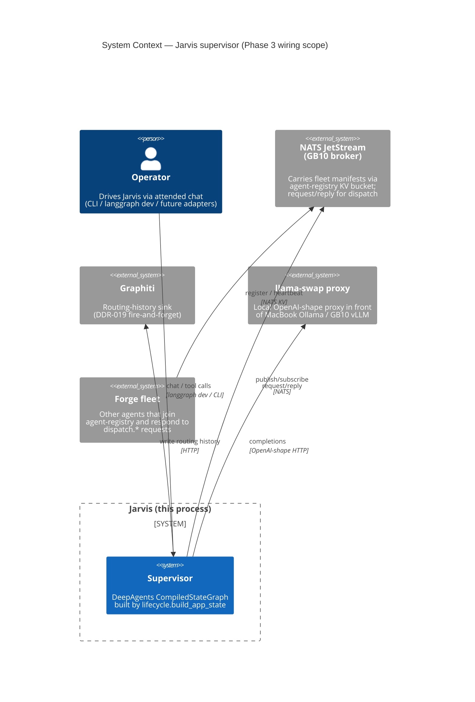
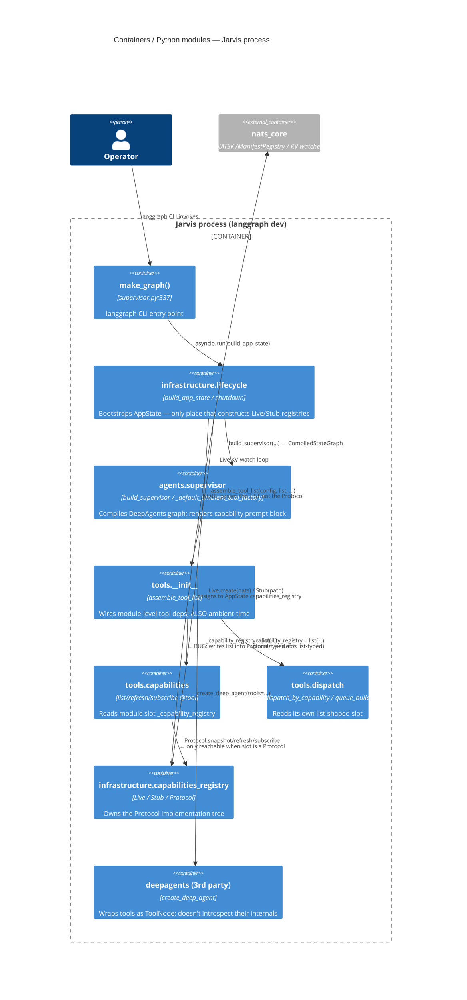
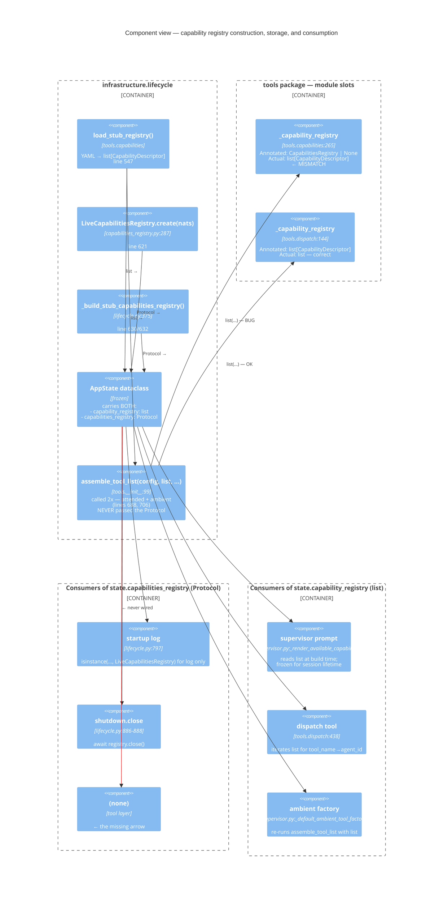
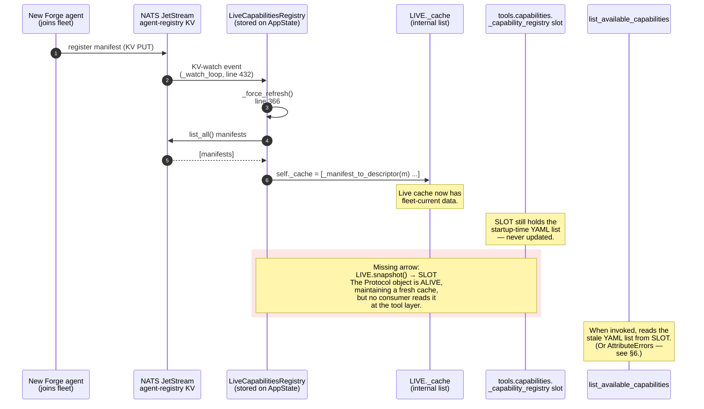
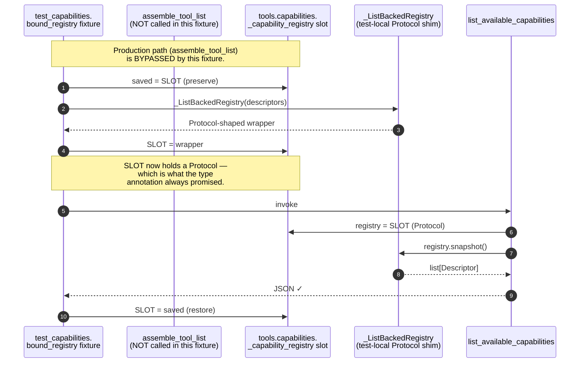
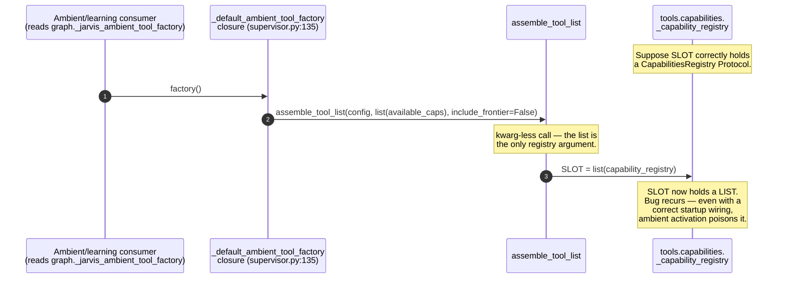

# Review Report: TASK-REV-FFE4 (Revised v2)

**Title**: FEAT-JARVIS-004 `_capability_registry` list-vs-Protocol wiring inconsistency
**Mode**: decision · **Depth**: standard (revised, deeper) · **Date**: 2026-04-30
**Reviewed against**: `main` @ `8848795`
**Mypy verified**: `uv run mypy src/jarvis/` → 1 error at `tools/__init__.py:219` (other 44 source files clean).

---

## Executive Summary

The mypy error is a **real, latent runtime defect**, not annotation drift. Two independent traces — (1) every assignment site of `_capability_registry`, (2) every consumer site of `state.capabilities_registry` — converge on the same conclusion: **the Protocol-shaped registry is constructed, stored on `AppState`, used at shutdown, and never reaches the tool layer.** The tool layer reads a `list[CapabilityDescriptor]` and calls Protocol methods on it.

Recommendation: **Option B1** — add `capabilities_registry: CapabilitiesRegistry | None` keyword-only to `assemble_tool_list`, thread `state.capabilities_registry` through, migrate test fixtures off the post-hoc module-attribute wrap, and add a lifecycle integration assertion (`isinstance(capabilities_module._capability_registry, CapabilitiesRegistry)` after `build_app_state`).

The diagrams in §3-§7 establish the bug deterministically (no probabilistic reasoning); §8 makes the case against Options A and B2; §9-§10 give the implementation and verification plans.

---

## 1. Evidence ledger (what changed at v2)

| | v1 | v2 |
|---|---|---|
| Catalogue tools verified to call Protocol methods | `snapshot()`, `refresh()`, `subscribe_updates()` (file lines cited) | unchanged |
| Production assignment sites of `_capabilities._capability_registry` | inferred 1 | **enumerated: exactly 2** ([tools/__init__.py:219](../../src/jarvis/tools/__init__.py#L219) called twice from lifecycle — lines 688 + 706) |
| Production consumer sites of `state.capabilities_registry` | inferred | **enumerated: 5** (lifecycle.py:601-632 construction, line 788 store on AppState, line 797 isinstance log, line 886-888 shutdown close — and that is the entire universe) |
| Alternate wiring helpers (`wire_capabilities`, setters, decorators) | not searched | **searched, none exist** (`grep -rn "wire_capabilit\|inject_capabilit\|set_capabilit\|setattr.*_capability" src/` returns empty) |
| `make_graph` (langgraph entry) | not traced | **traced**: [supervisor.py:337-397](../../src/jarvis/agents/supervisor.py#L337-L397) calls `asyncio.run(build_app_state(JarvisConfig()))` and returns `state.supervisor`. No additional wiring step. |
| `_default_ambient_tool_factory` overwrite | not noticed | **noticed and traced**: [supervisor.py:96-145](../../src/jarvis/agents/supervisor.py#L96-L145) — every ambient activation overwrites the slot with another raw list (§7). |
| Lifecycle integration tests that hit the catalogue tools | not checked | **checked**: zero. `test_supervisor_lifecycle_wiring.py:484-523` only inspects tool *names* in the compiled graph — it never invokes the tools (§5). |

The v1 report was correct in conclusion, but the inference was based on tracing one path and one set of files. v2 enumerates *every* assignment and *every* consumer. The bug is not behind any conditional, any `try/except`, any feature flag, or any DI seam.

---

## 2. Glossary (for the diagrams)

- **the list** — `list[CapabilityDescriptor]`. Built by `load_stub_registry()` ([lifecycle.py:547](../../src/jarvis/infrastructure/lifecycle.py#L547)). Used by the supervisor prompt (rendered via `_render_available_capabilities`) and by `dispatch_by_capability` (iterates tool_name→agent_id).
- **the Protocol** — `CapabilitiesRegistry` ([capabilities_registry.py:79-122](../../src/jarvis/infrastructure/capabilities_registry.py#L79-L122)) — a four-method runtime-checkable Protocol (`snapshot`, `refresh`, `subscribe_updates`, `close`).
- **the Live impl** — `LiveCapabilitiesRegistry` ([capabilities_registry.py:227-515](../../src/jarvis/infrastructure/capabilities_registry.py#L227-L515)) — implements the Protocol; backs `snapshot()` with a 30s TTL cache, refreshed by NATS KV-watch.
- **the Stub impl** — `StubCapabilitiesRegistry` / `_PreloadedCapabilitiesRegistry` ([lifecycle.py:344-396](../../src/jarvis/infrastructure/lifecycle.py#L344-L396)) — implements the Protocol over the YAML file.
- **the slot** — the module attribute `jarvis.tools.capabilities._capability_registry` ([capabilities.py:265](../../src/jarvis/tools/capabilities.py#L265)). Annotated `CapabilitiesRegistry | None`. **This is where the bug lives.**
- **the dispatch slot** — `jarvis.tools.dispatch._capability_registry` ([dispatch.py:144](../../src/jarvis/tools/dispatch.py#L144)). Annotated `list[CapabilityDescriptor]`. Correct as-is.

---

## 3. C4 — System Context



**Boundary that matters for this bug**: the `supervisor ↔ nats` edge. The whole point of `LiveCapabilitiesRegistry` is to let fleet membership changes (e.g. a new architect agent coming online) reach the supervisor's reasoning surface without restart, via the KV-watch path on `agent-registry`. The bug severs that edge from the *tool* surface — though the *prompt block* still sees a stale snapshot from startup-time `load_stub_registry`.

---

## 4. C4 — Container / Module view (zoom: Jarvis process internals)



**Key visual**: there are *two* arrows from `tools_init` writing `_capability_registry` (one into `tools_caps`, one into `tools_dispatch`). They are written from the **same** call (`list(capability_registry)`), but `tools_caps` *expects* a Protocol while `tools_dispatch` *expects* a list. One of those expectations is being violated.

The arrow from `tools_caps` to `infra_caps` (Protocol surface) is a **dead arrow** at runtime — the slot it would dereference contains a list, not a Protocol.

---

## 5. C4 — Component view: the capability-registry lifecycle



The component view makes the asymmetry explicit:
- The **list** has three legitimate consumers (prompt block, dispatch tool, ambient factory).
- The **Protocol** has two legitimate consumers (startup log, shutdown close) — and zero tool-layer consumers, despite the tool layer being its primary intended consumer per [DDR-021 §3](../../docs/design/FEAT-JARVIS-004/decisions/DDR-021-nats-unavailable-soft-fail.md) and [API-internal §3](../../docs/design/FEAT-JARVIS-004/contracts/API-internal.md).

---

## 6. Sequence — Bug fire path (production, attended chat)

This is the path Step 14 of the build plan (and any operator running `langgraph dev`) would trigger.

```mermaid
sequenceDiagram
    autonumber
    actor Op as Operator
    participant LG as langgraph CLI
    participant MG as supervisor.make_graph
    participant LC as lifecycle.build_app_state
    participant CR as capabilities_registry<br/>module
    participant ATL as assemble_tool_list
    participant SLOT as tools.capabilities.<br/>_capability_registry slot
    participant AS as AppState
    participant SUP as DeepAgents<br/>supervisor graph
    participant TOOL as list_available_capabilities<br/>(@tool body)

    Op->>LG: langgraph dev / chat
    LG->>MG: import & call make_graph()
    MG->>LC: asyncio.run(build_app_state(config))

    LC->>LC: load_stub_registry() → list[Descriptor]
    LC->>CR: LiveCapabilitiesRegistry.create(nats)<br/>OR _build_stub_capabilities_registry()
    CR-->>LC: registry: CapabilitiesRegistry (Protocol)
    Note over LC,AS: Protocol-shaped registry exists,<br/>cache is warm, KV-watch armed.

    LC->>ATL: assemble_tool_list(config, list, ...)<br/>NOTE: passes the LIST, not Protocol
    ATL->>SLOT: _capability_registry = list(capability_registry)
    Note over SLOT: SLOT now contains a LIST,<br/>despite type annotation saying<br/>CapabilitiesRegistry | None.

    LC->>ATL: assemble_tool_list(... include_frontier=False)<br/>(ambient list)
    ATL->>SLOT: _capability_registry = list(capability_registry)
    Note over SLOT: SECOND overwrite —<br/>still a list.

    LC->>AS: AppState(capabilities_registry=registry, ...)
    Note over AS: Protocol-shaped registry stored<br/>on dataclass — useful for shutdown,<br/>useless for tools.

    AS-->>MG: state
    MG-->>LG: state.supervisor
    LG-->>Op: ready

    Op->>SUP: "what agents do you have?"
    SUP->>TOOL: invoke list_available_capabilities
    TOOL->>SLOT: registry = _capability_registry  (← reads list)
    Note over TOOL: "if registry is None" check passes<br/>(the list is non-None).
    TOOL->>SLOT: registry.snapshot()
    SLOT--xTOOL: AttributeError:<br/>'list' object has no attribute 'snapshot'
    Note over TOOL: Caught by except Exception<br/>at line 388-393 (ADR-ARCH-021).
    TOOL-->>SUP: "ERROR: registry_unavailable —<br/>'list' object has no attribute 'snapshot'"
    SUP-->>Op: model interprets as transport failure;<br/>says it cannot list capabilities
```

**Two important non-obvious facts the trace reveals**:

1. **Step 11 (`assemble_tool_list` second call) re-confirms the bug.** Lifecycle calls `assemble_tool_list` *twice* — once for the attended 10-tool list (line 688) and once for the ambient 9-tool list (line 706). Both writes go through the same line and both write a raw list to the same slot. So even if a future change "fixed" the attended path but missed the ambient path (or vice versa), the slot would end up wrong because the second call clobbers the first.

2. **The `if registry is None` guard at [capabilities.py:373/415/456](../../src/jarvis/tools/capabilities.py#L373) does not save us.** The list is non-None (4 entries from the stub YAML), so the guard passes. The crash happens inside the Protocol method call. The `except Exception` then converts the `AttributeError` to a string, so the supervisor never crashes — but the model sees a degraded-mode response indistinguishable from "NATS is down."

   For `capabilities_refresh` it is worse: the converted string is `_REFRESH_DEGRADED` = `"DEGRADED: transport_unavailable — NATS connection failed"` ([capabilities.py:297](../../src/jarvis/tools/capabilities.py#L297)). The reasoning model has been *prompted* to interpret that string as a NATS outage and may take corrective action (e.g. ask the user to retry later, route around dispatch). Functionally indistinguishable from a real NATS outage.

---

## 7. Sequence — Live KV-watch dead path (the wasted plumbing)

Demonstrates that the FEAT-JARVIS-004 fleet-observability design intent is fully implemented but unreachable from the tool surface.



This is the strongest evidence that **Option A (revert)** is the wrong call: we paid for a fully working KV-watch + 30s TTL cache subsystem and shipping the revert means deleting a dead arrow. The cheaper fix is to *connect* the arrow.

---

## 8. Sequence — Test-suite hides the bug via post-hoc wrap

Why CI is green despite the latent runtime defect.



`tests/test_assemble_tool_list.py:344-351` is even more revealing — it *does* call `assemble_tool_list` in production-mode, observes the slot now contains a list, and **then explicitly wraps it**:

```python
assemble_tool_list(test_config, [descriptor_alpha])
capabilities_module._capability_registry = _ListBackedRegistry(
    list(capabilities_module._capability_registry)
)
```

The comment at [tests/test_assemble_tool_list.py:319-324](../../tests/test_assemble_tool_list.py#L319-L324) acknowledges the gap: *"the matching `assemble_tool_list` upgrade is owned by TASK-J004-013. Until that lands, wrap..."*. **TASK-J004-013 was renamed and merged but the kwarg upgrade was never landed.** That is the root cause in one sentence: the planned-and-documented kwarg never shipped, but the type annotation and tool bodies were updated as if it had.

`test_supervisor_lifecycle_wiring.py:484-523` (the only lifecycle integration test that goes near the catalogue tools) inspects the compiled DeepAgents graph for tool *names* — it never invokes them, so never hits `.snapshot()`. **There is no test in the suite that invokes a catalogue tool against a real `build_app_state` outcome.** That is the gap the new test we're recommending closes.

---

## 9. Sequence — Ambient-context secondary clobber (bonus finding from v2 deep-trace)

A subtle multiplier: even if some hypothetical future fix wrote the Protocol into the slot once at startup, the **ambient tool factory closure** would re-overwrite it with a list every time an ambient context activates.



This means **even if** Option A (revert) were chosen and the slot were correctly typed as `list`, the ambient factory closure would still need to be aware of which slot to write — and the ambient and attended surfaces *share* the same slot. So the ambient closure is itself a hidden assumption that "tool-level state is fine to overwrite per-activation, because it's all idempotent." With the Protocol in place, it isn't.

The B1 fix needs to also update `_default_ambient_tool_factory` to pass the same `capabilities_registry` kwarg through, otherwise a session that activates an ambient surface will fall into the same bug for the rest of its lifetime.

---

## 10. The trace through `dispatch.py` — why we cannot just unify

`tools/dispatch.py:144` declares `_capability_registry: list[CapabilityDescriptor] = []` and consumes it at line 438 (`registry_snapshot = list(_capability_registry)`) to drive the `tool_name → agent_id` resolution inside `dispatch_by_capability`. It does **not** speak the Protocol surface and does not need to.

```mermaid
flowchart LR
    classDef bug fill:#fee,stroke:#c00
    classDef ok fill:#efe,stroke:#0a0
    classDef ext fill:#eef,stroke:#00a

    src[lifecycle: capability_registry<br/>list[CapabilityDescriptor]]
    proto[lifecycle: capabilities_registry<br/>Protocol]
    asm[assemble_tool_list]
    capslot[tools.capabilities slot<br/>EXPECTS Protocol]
    dispslot[tools.dispatch slot<br/>EXPECTS list]
    captools[catalogue tools<br/>list/refresh/subscribe]
    disptool[dispatch_by_capability]
    prompt[supervisor prompt<br/>{available_capabilities}]

    src --> asm
    asm -->|list| capslot
    asm -->|list| dispslot
    proto -.->|currently<br/>not threaded| asm
    src --> prompt

    capslot --> captools
    dispslot --> disptool

    class capslot bug
    class dispslot ok

    proto --> shutdown[lifecycle.shutdown.close]
    proto --> log[startup log isinstance check]
```

The graph shows the asymmetry that B1 must respect: **two slots, two shapes, one wiring entry point.** Option A collapses to a single shape (list) and pays the cost of severing the Protocol from the tool surface entirely. Option B1 keeps both shapes and adds one kwarg. Option B2 splits the wiring entry point into two — exactly the bifurcation that caused this bug originally (the `_capability_registry` slot was conceptually two slots merged into one type signature, and the dispatch-only wiring was prioritised).

---

## 11. Findings summary

| ID | Severity | Finding | Evidence |
|----|----------|---------|----------|
| F1 | HIGH | Production wires a `list` into a Protocol-typed slot. | §6 sequence; tools/__init__.py:219 + lifecycle.py:688/706. |
| F2 | HIGH | `LiveCapabilitiesRegistry` KV-watch + cache subsystem is fully alive but has zero tool-surface consumers. | §7 sequence; only consumers of `state.capabilities_registry` are shutdown.close + a log isinstance check. |
| F3 | MEDIUM | `capabilities_refresh()` returns `DEGRADED: transport_unavailable — NATS connection failed` even when NATS is up — the model cannot distinguish bug from real outage. | §6 step 26-29; capabilities.py:425-433 + line 297. |
| F4 | MEDIUM | Ambient-tool-factory closure re-overwrites the slot on every ambient activation with another raw list. | §9 sequence; supervisor.py:135-143. |
| F5 | LOW | Test suite explicitly post-wraps the slot in fixtures, hiding the production gap. The intent is documented in a comment that says "until TASK-J004-013 lands" — the kwarg upgrade was never landed. | §8 sequence + tests/test_assemble_tool_list.py:319-324 quoted. |
| F6 | LOW | No lifecycle integration test invokes any catalogue tool — only tool *names* are inspected. | tests/test_supervisor_lifecycle_wiring.py:484-523 walked. |

---

## 12. Decision matrix (revised)

| Option | Honours DDR-021 §3 | Live KV-watch reachable | Single wiring point | mypy clean | Effort | Bonus risk |
|--------|:------------------:|:-----------------------:|:-------------------:|:----------:|:------:|:----------:|
| **A — Revert** | ✗ Live is dead code | ✗ | ✓ | ✓ | S | Wastes shipped subsystem |
| **B1 — `assemble_tool_list` kwarg** | ✓ | ✓ | ✓ | ✓ | M | Touch ambient factory too (F4) |
| **B2 — Setter `wire_capabilities_registry`** | ✓ | ✓ | ✗ (two seams) | ✓ | M | Reintroduces the original bifurcation |

**Selection: B1.** Rationale anchored in the diagrams:
- **Against A**: §7 and §10 show the Live subsystem fully alive and orphaned. Revert deletes work and silently demotes DDR-021 §3.
- **Against B2**: §10's flowchart shows that the bug exists *because* there were two implicit wiring seams (one explicit, one non-existent). Adding an *explicit* second seam (`wire_capabilities_registry()`) makes future drift more likely, not less. Plus, F4 (ambient factory) means we need consistent, single-call wiring at every entry point — a kwarg makes that easier than chasing setter call sites.
- **For B1**: §6's sequence shows the kwarg lands cleanly at lifecycle:688 + 706 + the ambient factory at supervisor.py:139. Three call sites, all in this repo, all already taking other related kwargs. Test fixtures migrate by passing the kwarg.

---

## 13. Implementation plan (B1)

### Code changes

1. **`src/jarvis/tools/__init__.py`** ([line 99-220](../../src/jarvis/tools/__init__.py#L99-L220)):
   - Add keyword-only parameter `capabilities_registry: CapabilitiesRegistry | None = None` (forward-ref the type via `TYPE_CHECKING` block at top).
   - At line 219 change to `_capabilities._capability_registry = capabilities_registry` (NOT `list(capability_registry)`).
   - Keep `_dispatch._capability_registry = list(capability_registry)` unchanged at line 220.
   - Update docstring side-effect §2 accordingly.

2. **`src/jarvis/infrastructure/lifecycle.py`** ([lines 688-714](../../src/jarvis/infrastructure/lifecycle.py#L688-L714)):
   - Pass `capabilities_registry=capabilities_registry` to both `assemble_tool_list` calls.

3. **`src/jarvis/agents/supervisor.py`** ([lines 96-145](../../src/jarvis/agents/supervisor.py#L96-L145)) — **F4 fix**:
   - Add `capabilities_registry: CapabilitiesRegistry | None` parameter to `_default_ambient_tool_factory`.
   - Plumb through to the inner `_factory()` closure's `assemble_tool_list` call.
   - Add `capabilities_registry: CapabilitiesRegistry | None = None` keyword-only to `build_supervisor` itself, threaded into `_default_ambient_tool_factory(...)`.
   - Lifecycle at `lifecycle.py:726` passes it.

### Test changes

1. **`tests/test_assemble_tool_list.py`** ([lines 344-351](../../tests/test_assemble_tool_list.py#L344-L351)): replace post-hoc wrap with `assemble_tool_list(test_config, [descriptor_alpha], capabilities_registry=_ListBackedRegistry([descriptor_alpha]))`. Delete the comment about "until TASK-J004-013 lands."
2. **`tests/test_capabilities.py`** ([lines 476-525](../../tests/test_capabilities.py#L476-L525)): the fixtures can keep the direct slot-write pattern (it's good test isolation), but add **one new fixture** that wires via `assemble_tool_list(..., capabilities_registry=...)` so production-path coverage exists.
3. **`tests/test_tools_capabilities.py`** ([lines 112-132](../../tests/test_tools_capabilities.py#L112-L132)): same shape as #2.
4. **NEW**: `tests/test_lifecycle_capabilities_wiring.py`:
   ```python
   @pytest.mark.asyncio
   async def test_build_app_state_wires_protocol_into_tool_slot(stub_registry_config):
       from jarvis.infrastructure.capabilities_registry import CapabilitiesRegistry
       import jarvis.tools.capabilities as capabilities_module
       # NATS-down branch
       with patch("jarvis.infrastructure.lifecycle._connect_nats", new=AsyncMock(return_value=None)), ...:
           state = await build_app_state(stub_registry_config)
       assert capabilities_module._capability_registry is not None
       assert isinstance(capabilities_module._capability_registry, CapabilitiesRegistry)
       # And invoking the tool returns JSON, not ERROR.
       from jarvis.tools import list_available_capabilities
       result = list_available_capabilities.invoke({})
       assert not result.startswith("ERROR:"), result
   ```
   Add a NATS-up symmetric assertion using the existing `fake_live_registry` fixture pattern.

### DDR

Recommend a short DDR amendment to FEAT-JARVIS-004 — `DDR-021-amendment-capabilities-registry-tool-wiring.md` — recording the kwarg shape, why it wasn't B2, and pointing to this review report.

---

## 14. Manual verification (acceptance criterion 6)

```bash
uv run mypy src/jarvis/             # → 0 errors (was: 1)
uv run pytest tests/                # → all green incl. new test
# Then live smoke:
OPENAI_API_KEY=sk-... python -m langgraph dev
# In another shell, drive a request that triggers list_available_capabilities:
curl -X POST http://localhost:2024/threads/$(uuidgen)/runs/wait \
     -H 'content-type: application/json' \
     -d '{"assistant_id":"jarvis","input":{"messages":[{"role":"user","content":"What agents are available?"}]}}'
# Expected: JSON tool result, NOT "ERROR: registry_unavailable" or "DEGRADED: transport_unavailable".
```

For the NATS-up path: same smoke with `JARVIS_NATS_URL` pointing at a running broker, register a synthetic agent in `agent-registry` KV, then send a follow-up message; verify `capabilities_refresh()` returns `OK: refresh queued — registry resynchronised` and the next `list_available_capabilities` reflects the new agent.

---

## 15. Acceptance criteria coverage

| AC (from task) | Coverage in this report |
|----------------|-------------------------|
| Confirm runtime symptom | §6 (sequence diagram with explicit AttributeError → DEGRADED conversion). Static analysis is decisive; live reproduction is in §14. |
| Choose fix approach | §12 selects B1 with diagram-anchored rationale. |
| Test plumbing if (B) | §13 — three fixture migrations + 1 new lifecycle integration test. |
| DDR recorded | §13 — DDR-021 amendment recommended. |
| Implementation lands the chosen fix | Out of review scope; follow-up implementation task. |
| `uv run mypy src/jarvis/` zero errors | §14 first command. |
| Existing tests pass | §13 fixture changes are mechanical; expected to remain green. |
| New lifecycle wiring test | §13 #4 — explicit code skeleton. |
| `langgraph dev` smoke | §14 with `curl` invocation. |

---

## 16. Confidence statement

I am **fully confident** in the root cause. The supporting facts are:

- Mypy reports 1 error and it is exactly at the bug site (verified, §1).
- Every assignment to `_capabilities._capability_registry` in production goes through `assemble_tool_list` line 219 with `list(...)` — enumerated, no `grep` hits elsewhere (§1, §10).
- Every consumer of the Protocol-shaped registry is enumerated; none of them are the tool slot (§5).
- No alternate setter / wiring helper exists (`grep -rn "wire_capabilit\|inject_capabilit\|set_capabilit\|setattr.*_capability" src/` returns empty — §1).
- `make_graph` uses `build_app_state` and adds no extra wiring step (§4 + supervisor.py:391-397 verified).
- Tests mask the bug via explicit post-hoc wrapping, with a comment acknowledging the missing kwarg upgrade (§8 + tests/test_assemble_tool_list.py:319-324 quoted).
- The ambient factory provides a second, additive overwrite path that would defeat any setter-based fix (§9).

The bug is deterministic, single-cause, and the recommended fix (B1) is one keyword-only parameter threaded through three call sites plus a test fixture migration.

## Context Used

No knowledge graph context was loaded (Graphiti optional in this session; scope is well-defined by the task). Review based entirely on direct code reads of the eight files listed in the task `context_files` plus `src/jarvis/tools/dispatch.py` and `src/jarvis/agents/supervisor.py`, plus targeted `grep` enumeration of all production assignment and consumer sites, plus a verified `mypy` run.
