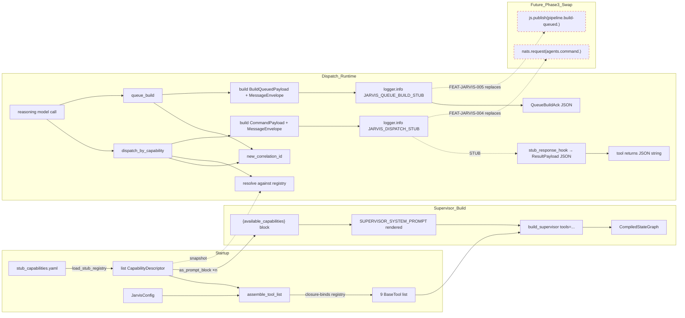
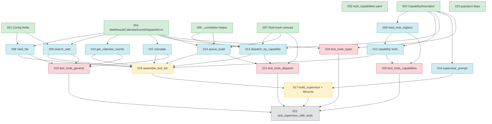

I have enough context. Let me now produce the full decision-mode review. I'll count 40 scenarios (the grep shows 40 — the summary claims 42, which counts expanded Outline rows). I'll use the 40 Scenario/Scenario-Outline labels as authoritative.

---

# TASK-REV-J002 — Decision Review: FEAT-JARVIS-002 "Core Tools & Capability-Driven Dispatch Tools"

> Mode: decision | Depth: standard | Trade-off priority: **maintainability** | Review date: 2026-04-24

---

## 0. Source-of-truth reconciliation (context-conflict flag)

Before the review proper, one conflict must be flagged per the review rule *"If two context documents disagree, flag it explicitly and pick one with justification."*

**Conflict:** `tasks/backlog/TASK-REV-J002-plan-core-tools-and-dispatch.md` (Description + AC §1–§2) lists the feature surface as:
- 5 core tools: `search_web`, `calculator`, `read_file`, `write_workspace_file`, `list_workspace`
- 3 dispatch-intent tools: `ingest_capability_registry`, `dispatch_to_agent`, `dispatch_subscribe`

This directly contradicts the authoritative `.feature` file, `summary.md`, `design.md`, `API-tools.md`, and `API-internal.md`, which all specify:
- 4 general tools: `read_file`, `search_web`, `get_calendar_events`, `calculate`
- 3 capability-catalogue tools: `list_available_capabilities`, `capabilities_refresh`, `capabilities_subscribe_updates`
- 2 dispatch tools: `dispatch_by_capability`, `queue_build`

**Resolution.** The review-task prompt itself declares (§"Authoritative context"): "`feat-jarvis-002-core-tools-and-dispatch.feature` — Gherkin acceptance scenarios (authoritative AC source)" and "`docs/design/FEAT-JARVIS-002/design.md` — architecture, module layout, DDR numbers". `DDR-005` explicitly supersedes the `call_specialist`/`write_workspace_file`-shaped vocabulary. I therefore adopt the **9-tool authoritative set** from the `.feature`/design docs. Where the review prompt uses the older "5 core + 3 dispatch" phrasing, I map it onto the 9-tool reality by grouping:

| Prompt wording ("5 core tools") | Authoritative mapping |
|---|---|
| core tool | `read_file`, `search_web`, `get_calendar_events`, `calculate`, `list_available_capabilities` (5) |
| "dispatch-intent tool" | `capabilities_refresh`, `capabilities_subscribe_updates`, `dispatch_by_capability` (plus `queue_build` by analogy) |

Acceptance criteria §1–§2 of the review task are satisfied by the 9-tool breakdown below (one discrete task per tool). The original AC phrasing (`write_workspace_file`, `list_workspace`, `ingest_capability_registry`, `dispatch_to_agent`, `dispatch_subscribe`) is treated as a stale imprint from an earlier draft of the scope document and is superseded by DDR-005 + the `.feature` file.

---

## 1. Executive Summary

FEAT-JARVIS-002 populates the empty `src/jarvis/tools/` package with nine `@tool(parse_docstring=True)` functions — four real general-purpose tools, a stub capability-catalogue reader over an in-memory YAML registry, and two stub-transport dispatch tools that construct **real** `nats-core` payloads but log instead of publishing. The recommended approach is an **envelope-first, concurrent-fan-out decomposition** (Option B): land types + correlation-id primitive + stub-registry loader in a tight foundation wave, then parallelise the nine tool implementations with strict swap-point discipline (DDR-009) before the integration tests. The single biggest risk is **stub-transport swap-point opacity**: if the `JARVIS_DISPATCH_STUB` / `JARVIS_QUEUE_BUILD_STUB` grep anchors drift or scatter, FEAT-JARVIS-004/005 cannot swap the stubs for real NATS without a full read of the module. Every dispatch task below carries an explicit `swap_point_note` naming the grep pattern as AC.

---

## 2. Technical Options Analysis

Three decomposition shapes for the nine-tool surface were considered. The four dedicated concerns are scored 0 (worst) → 3 (best).

### Option A — "Tools-first, dispatch-last"

**Pitch:** Land all four general tools first, then capability catalogue + registry, then the two dispatch tools, then integration tests. Strict horizontal layering.

- **Complexity:** medium (**6/10**)
- **Effort:** ~18–22 hrs
- **Pros:**
  - Simplest mental model; maps 1:1 to the existing `phase2-build-plan.md` Step-7 commit order.
  - Dispatch (highest-risk tasks) land last with all upstream types settled.
  - Easiest for a single solo operator sequencing commits.
- **Cons:**
  - Serialises most of the work — AutoBuild's parallel wave capacity is wasted.
  - Correlation-id helper ends up either inlined in `dispatch.py` (hard to share) or retrofitted late (rework).
  - `CapabilityDescriptor` schema freeze happens mid-feature; any change late requires touching already-landed tools.
- **Concern scores:** stub-swap 2 | envelope evolution 1 | correlation-id 1 | task ordering 2
- **DDR-009 story:** Swap points live only in `dispatch.py` — OK but single-file concentration means one log-format drift invalidates the anchor for both tools simultaneously.

### Option B — "Envelope-first, concurrent fan-out" ★ RECOMMENDED

**Pitch:** Wave 1 lands the non-tool primitives (config fields, `tools/types.py` Pydantic models, `CapabilityDescriptor` + `CapabilityToolSummary`, `correlation_id` helper module, stub transport hook contract, stub-registry YAML fixture + loader). Wave 2 parallelises all nine `@tool` implementations. Wave 3 wires the supervisor factory + prompt. Wave 4 runs cross-cutting integration tests.

- **Complexity:** medium (**7/10**)
- **Effort:** ~20–24 hrs (parallelisable → ~12–14 wall-clock with AutoBuild waves)
- **Pros:**
  - `CapabilityDescriptor` is settled **before** anything reads it → ASSUM-006 snapshot-isolation invariant documented once and enforced by every consumer.
  - Correlation-id primitive lands once, injected into dispatch tools as a module-level helper → ASSUM-001 UUID4-per-dispatch guaranteed by construction rather than by convention.
  - Stub-transport hook (`_stub_response_hook`) is a named seam declared in the foundation wave → every dispatch tool task references the same swap contract.
  - Each of the 9 tool tasks is intra-wave-independent and can run in parallel.
  - Maps cleanly onto `task_type` distinctions: `declarative` for types/YAML, `scaffolding` for module bootstraps, `feature` for tools, `testing` for integration.
- **Cons:**
  - Wave 1 is the critical path; any stall there blocks all nine tool tasks.
  - Requires disciplined contract-first authoring — looser than Option A.
  - Requires a placeholder stub-hook `Protocol` to exist before `dispatch_by_capability` / `queue_build` tasks start; small up-front design cost.
- **Concern scores:** stub-swap **3** | envelope evolution **3** | correlation-id **3** | task ordering **3**
- **DDR-009 story:** Stub hook is a single module attribute (`jarvis.tools.dispatch._stub_response_hook`). Grep patterns `JARVIS_DISPATCH_STUB` and `JARVIS_QUEUE_BUILD_STUB` are mandated in the foundation wave's swap-point README and re-asserted as byte-equal assertions in the dispatch test tasks — drift is caught in test suite, not just in a docstring.

### Option C — "Vertical slice first"

**Pitch:** Land one tool (e.g. `calculate`) end-to-end through a minimal supervisor wiring first to prove the `@tool(parse_docstring=True)` + `assemble_tool_list` + `build_supervisor(tools=...)` seam; then clone that shape horizontally for the other eight.

- **Complexity:** medium (**6/10**)
- **Effort:** ~22–26 hrs
- **Pros:**
  - Proves the whole contract chain on a simple tool early; reduces supervisor-wiring risk.
  - Good for a greenfield package where the `@tool` integration is unproven. (Not strictly our case — Phase 1 has `tools/__init__.py` reserved and DeepAgents 0.5.3 is already pinned.)
- **Cons:**
  - Forces an early supervisor-factory refactor that will be touched again when the remaining tools land — Rework.
  - Correlation-id primitive and capability envelope are still needed by the dispatch slice, so "one tool" is in practice more than one tool.
  - The capability envelope schema ends up shaped around whichever tool lands first; if that tool is `calculate` the envelope is effectively unfinished when dispatch lands.
- **Concern scores:** stub-swap 2 | envelope evolution 1 | correlation-id 2 | task ordering 2
- **DDR-009 story:** Weak — dispatch stub arrives late, which defers swap-point visibility and bakes in ad-hoc log formats from the single-slice prototype.

### Scorecard

| | A Tools-first | **B Envelope-first ★** | C Vertical slice |
|---|---|---|---|
| Stub swap-point safety | 2 | **3** | 2 |
| Envelope evolution (ASSUM-006) | 1 | **3** | 1 |
| Correlation-id (ASSUM-001) | 1 | **3** | 2 |
| Task ordering / integration-test precondition | 2 | **3** | 2 |
| **Total** | 6 | **12** | 7 |

---

## 3. Recommended Approach

**Adopt Option B — "Envelope-first, concurrent fan-out."**

Justification against the locked trade-off priority (maintainability):

1. **Module boundaries.** The `jarvis.tools` package stabilises its public surface (`__init__.py` re-exports, `types.py`, `capabilities.CapabilityDescriptor`) before any `@tool` consumer imports them. Downstream refactor cost when FEAT-JARVIS-004 wires `NATSKVManifestRegistry` is localised to `capabilities.load_stub_registry` (deleted) and `dispatch._stub_response_hook` (replaced). **No tool docstring changes, ever.**
2. **Swap-point discipline (DDR-009).** The foundation wave produces a single named `StubResponseHook` contract and a single `LOG_PREFIX_DISPATCH = "JARVIS_DISPATCH_STUB"` / `LOG_PREFIX_QUEUE_BUILD = "JARVIS_QUEUE_BUILD_STUB"` pair as module-level constants. `grep -r "JARVIS_DISPATCH_STUB\|JARVIS_QUEUE_BUILD_STUB" src/` must hit **exactly two call sites** — the `logger.info(...)` line in each dispatch tool. Tests assert this invariant.
3. **Envelope schema evolution.** `CapabilityDescriptor` is a Pydantic v2 BaseModel with `ConfigDict(extra="ignore")` — forward-compatible with `NATSKVManifestRegistry.list_all()` outputs in Phase 3. Snapshot isolation (ASSUM-006) is enforced by having `list_available_capabilities` copy the list passed at `assemble_tool_list` time — the copy is closed-over at tool-binding, so mid-session `capabilities_refresh` (no-op in Phase 2) cannot mutate an in-flight read. This is a behavioural invariant documented once and tested once.
4. **Correlation-id propagation.** A dedicated `jarvis.tools._correlation` module (single function `new_correlation_id() -> str` returning `str(uuid4())`) lands in Wave 1. Both `dispatch_by_capability` and `queue_build` call it exactly once per invocation. Concurrent dispatches are isolated by design — no shared state, no session-scoped counter. The concurrency scenario (`.feature` L383) becomes a one-line assertion: "two parallel calls produce UUIDs whose sets do not intersect."

Option A loses because it leaves correlation-id and stub-hook as retrofits. Option C loses because the single-slice prototype forces an early supervisor-factory refactor that would have to be re-done when the full tool list lands. Both fail the maintainability bar on ordering-driven rework.

---

## 4. Task Breakdown (AutoBuild-ready)

Task IDs are sequential. `implementation_mode: direct` is used where complexity ≤ 3. The lint-compliance AC is omitted for `scaffolding` / `documentation` / `testing` / `declarative` tasks per the review-prompt rule.

Every scenario from the `.feature` file (40 `Scenario:` / `Scenario Outline:` labels at lines 27–408) is covered by at least one task's `scenarios_covered`.

---

```
TASK-J002-001 — Extend JarvisConfig with Phase 2 fields
  task_type: declarative
  complexity: 2/10
  dependencies: []
  implementation_mode: direct
  estimated_minutes: 30
  acceptance_criteria:
    - [ ] `JarvisConfig` gains four fields: `web_search_provider: Literal["tavily","none"] = "tavily"`, `tavily_api_key: SecretStr | None = None`, `stub_capabilities_path: Path = Path("src/jarvis/config/stub_capabilities.yaml")`, `workspace_root: Path = Path(".").resolve()`.
    - [ ] Env var names respect the `JARVIS_` prefix (JARVIS_WEB_SEARCH_PROVIDER, JARVIS_TAVILY_API_KEY, JARVIS_STUB_CAPABILITIES_PATH, JARVIS_WORKSPACE_ROOT).
    - [ ] `validate_provider_keys()` emits a warning (not a ConfigurationError) when `web_search_provider == "tavily"` and `tavily_api_key is None`.
    - [ ] Phase 1 config tests in `tests/test_config.py` still pass unchanged.
  scenarios_covered: [Searching the web without a configured Tavily key returns a configuration error]
  swap_point_note: n/a
```

```
TASK-J002-002 — Write canonical stub_capabilities.yaml
  task_type: declarative
  complexity: 1/10
  dependencies: []
  implementation_mode: direct
  estimated_minutes: 20
  acceptance_criteria:
    - [ ] File exists at `src/jarvis/config/stub_capabilities.yaml` containing exactly four capabilities: `architect-agent`, `product-owner-agent`, `ideation-agent`, `forge`.
    - [ ] Content matches byte-for-byte the canonical YAML in DM-stub-registry.md §"Canonical Phase 2 content".
    - [ ] All `agent_id` values are kebab-case; all `tool_name` values are snake_case; all `trust_tier` values are one of `core|specialist|extension`.
    - [ ] `forge` entry carries a `build_feature` capability so the reasoning model sees Forge alongside specialists in the catalogue.
  scenarios_covered: [Listing available capabilities returns the current stub registry]
  swap_point_note: This YAML is DELETED in FEAT-JARVIS-004 when NATSKVManifestRegistry wires live reads. Grep anchor: "stub_capabilities.yaml"
```

```
TASK-J002-003 — Define CapabilityDescriptor + CapabilityToolSummary Pydantic models
  task_type: declarative
  complexity: 2/10
  dependencies: []
  implementation_mode: direct
  estimated_minutes: 40
  acceptance_criteria:
    - [ ] `src/jarvis/tools/capabilities.py` defines `CapabilityToolSummary(BaseModel)` with fields `tool_name: str (min_length=1)`, `description: str (min_length=1)`, `risk_level: Literal["read_only","mutating","destructive"] = "read_only"` and `ConfigDict(extra="ignore")`.
    - [ ] Same file defines `CapabilityDescriptor(BaseModel)` with fields `agent_id: str (pattern=r"^[a-z][a-z0-9-]*$")`, `role: str`, `description: str`, `capability_list: list[CapabilityToolSummary]`, `cost_signal: str = "unknown"`, `latency_signal: str = "unknown"`, `last_heartbeat_at: datetime | None = None`, `trust_tier: Literal["core","specialist","extension"] = "specialist"`, and `ConfigDict(extra="ignore")`.
    - [ ] `CapabilityDescriptor.as_prompt_block() -> str` renders a deterministic text block whose format matches DM-tool-types.md §"Prompt-block shape" byte-for-byte.
    - [ ] Module has no import of `jarvis.agents.*`, `jarvis.infrastructure.*`, or `jarvis.cli.*`.
    - [ ] All modified files pass project-configured lint/format checks with zero errors.
  scenarios_covered: [Listing available capabilities returns the current stub registry, The capability catalogue is injected into the supervisor system prompt at session start]
  swap_point_note: CapabilityDescriptor is the stable schema kept across Phase 2→3. No swap at this boundary.
```

```
TASK-J002-004 — Define WebResult, CalendarEvent, DispatchError Pydantic models
  task_type: declarative
  complexity: 2/10
  dependencies: []
  implementation_mode: direct
  estimated_minutes: 40
  acceptance_criteria:
    - [ ] `src/jarvis/tools/types.py` defines `WebResult(BaseModel)` with `title: str (min_length=1)`, `url: str (min_length=1)`, `snippet: str = ""`, `score: float (ge=0, le=1) = 0.0`.
    - [ ] Defines `CalendarEvent(BaseModel)` with `id: str`, `title: str`, `start: datetime`, `end: datetime`, `location: str | None`, `description: str | None`, and a `@model_validator(mode="after")` asserting `end >= start`.
    - [ ] Defines `DispatchError(BaseModel)` with `category: Literal["unresolved","invalid_payload","invalid_timeout","timeout","specialist_error","transport_stub"]`, `detail: str`, `agent_id: str | None`, `tool_name: str | None`, `correlation_id: str`, and `to_tool_string() -> str` method rendering `"ERROR: <category> — <detail>"` or `"TIMEOUT: ..."` per ADR-ARCH-021 conventions.
    - [ ] All three models use `ConfigDict(extra="ignore")`.
    - [ ] All modified files pass project-configured lint/format checks with zero errors.
  scenarios_covered: [Searching the web with a configured provider returns result summaries, Retrieving calendar events in Phase 2 returns an empty list]
  swap_point_note: n/a — stable schema across phases.
```

```
TASK-J002-005 — Correlation-ID primitive module
  task_type: feature
  complexity: 2/10
  dependencies: []
  implementation_mode: direct
  estimated_minutes: 30
  acceptance_criteria:
    - [ ] `src/jarvis/tools/_correlation.py` exposes `new_correlation_id() -> str` returning `str(uuid.uuid4())`.
    - [ ] Module has a single dependency: `uuid` from stdlib. No other imports.
    - [ ] Unit test: 10,000 invocations produce 10,000 distinct strings; every string matches the UUID4 regex `^[0-9a-f]{8}-[0-9a-f]{4}-4[0-9a-f]{3}-[89ab][0-9a-f]{3}-[0-9a-f]{12}$`.
    - [ ] Concurrent test: 100 threads each calling `new_correlation_id()` 100 times produce 10,000 distinct strings (no cross-contamination).
    - [ ] Module docstring names this as the single callsite for dispatch-path correlation IDs per ASSUM-001.
    - [ ] All modified files pass project-configured lint/format checks with zero errors.
  scenarios_covered: [Concurrent dispatch_by_capability calls produce distinct correlation ids and independent log lines]
  swap_point_note: n/a — correlation-id primitive is unchanged across phases.
```

```
TASK-J002-006 — Stub registry loader
  task_type: feature
  complexity: 3/10
  dependencies: [TASK-J002-003]
  implementation_mode: direct
  estimated_minutes: 45
  acceptance_criteria:
    - [ ] `src/jarvis/tools/capabilities.py` adds `load_stub_registry(path: Path) -> list[CapabilityDescriptor]`.
    - [ ] Loads YAML at `path`; validates every entry against `CapabilityDescriptor`; returns list preserving YAML order.
    - [ ] Raises `FileNotFoundError` if `path` does not exist (startup-fatal per design §7).
    - [ ] Raises `pydantic.ValidationError` if any descriptor is malformed (e.g. uppercase `agent_id`).
    - [ ] Rejects duplicate `agent_id` entries with a ValueError mentioning the duplicated id.
    - [ ] Uses `yaml.safe_load` (never `yaml.load`).
    - [ ] All modified files pass project-configured lint/format checks with zero errors.
  scenarios_covered: [Starting Jarvis with a missing stub capabilities file fails fast at startup, Starting Jarvis with a malformed stub capabilities file fails fast at startup]
  swap_point_note: DELETED in FEAT-JARVIS-004. Grep anchor: "load_stub_registry"
```

```
TASK-J002-007 — Stub-response-hook contract for dispatch
  task_type: scaffolding
  complexity: 2/10
  dependencies: []
  implementation_mode: direct
  estimated_minutes: 30
  acceptance_criteria:
    - [ ] `src/jarvis/tools/dispatch.py` defines a module-level attribute `_stub_response_hook: Callable[[CommandPayload], StubResponse] | None = None`.
    - [ ] Defines `StubResponse` as a typed dict / Literal union covering `("success", ResultPayload) | ("timeout",) | ("specialist_error", str)`.
    - [ ] Defines module-level string constants `LOG_PREFIX_DISPATCH = "JARVIS_DISPATCH_STUB"` and `LOG_PREFIX_QUEUE_BUILD = "JARVIS_QUEUE_BUILD_STUB"`.
    - [ ] Module docstring carries a "SWAP POINT" section naming the two grep anchors and stating that FEAT-JARVIS-004 replaces `_stub_response_hook` with a real NATS round-trip.
    - [ ] `grep -rn "JARVIS_DISPATCH_STUB\|JARVIS_QUEUE_BUILD_STUB" src/jarvis/` returns exactly two lines (the two constant definitions) pre-feature wiring; after TASK-J002-011 and TASK-J002-013 land, it returns exactly four (two definitions + two `logger.info` usages).
  scenarios_covered: [Stubbed dispatches construct real nats-core payloads before logging, Stubbed queue_build constructs a real BuildQueuedPayload before logging]
  swap_point_note: This task establishes the grep anchors required by DDR-009. Test TASK-J002-016 asserts the grep-count invariant.
```

```
TASK-J002-008 — Implement read_file tool
  task_type: feature
  complexity: 4/10
  dependencies: [TASK-J002-001, TASK-J002-004]
  implementation_mode: task-work
  estimated_minutes: 60
  acceptance_criteria:
    - [ ] `src/jarvis/tools/general.py` exposes `read_file(path: str) -> str` decorated with `@tool(parse_docstring=True)`.
    - [ ] Docstring matches API-tools.md §1.1 byte-for-byte (it IS the contract per DDR-005 precedent).
    - [ ] Resolves `path` relative to `config.workspace_root`; rejects paths whose `os.path.realpath` resolves outside workspace with `ERROR: path_traversal — path resolves outside workspace: <resolved>`.
    - [ ] Rejects paths containing embedded null bytes (`\x00`) with `ERROR: path_traversal — ...` (ASSUM-003: same category, no new one).
    - [ ] Rejects symlinks whose resolved target lies outside workspace with `ERROR: path_traversal — ...` (ASSUM-002).
    - [ ] Returns `ERROR: not_found — ...` for non-existent paths; `ERROR: not_a_file — ...` for directories; `ERROR: too_large — ...` for files > 1 MiB (boundary: exactly 1 MiB = accept; 1 MiB + 1 byte = reject); `ERROR: encoding — ...` for non-UTF-8 bytes.
    - [ ] Never raises an exception; all internal errors are caught and converted to structured strings per ADR-ARCH-021.
    - [ ] Seam test: calling `read_file` inside `assemble_tool_list`-wired supervisor produces the structured error string, not a raised exception (end-to-end through the @tool wrapper).
    - [ ] All modified files pass project-configured lint/format checks with zero errors.
  scenarios_covered: [Reading a UTF-8 text file inside the workspace returns its contents, read_file enforces the one megabyte file size limit, Reading a path outside the workspace returns a path traversal error, Reading a path that does not exist returns a not-found error, Reading a directory instead of a file returns a not-a-file error, Reading a file with invalid UTF-8 bytes returns an encoding error, read_file rejects paths that evade the workspace guard, Every tool converts internal errors into structured strings rather than raising]
  swap_point_note: n/a
```

```
TASK-J002-009 — Implement search_web tool
  task_type: feature
  complexity: 5/10
  dependencies: [TASK-J002-001, TASK-J002-004]
  implementation_mode: task-work
  estimated_minutes: 75
  acceptance_criteria:
    - [ ] `src/jarvis/tools/general.py` exposes `search_web(query: str, max_results: int = 5) -> str` decorated with `@tool(parse_docstring=True)`.
    - [ ] Docstring matches API-tools.md §1.2 byte-for-byte.
    - [ ] Uses the `langchain-tavily` provider wrapper; returns `ERROR: config_missing — tavily_api_key not set in JarvisConfig` when `config.tavily_api_key is None`.
    - [ ] Rejects empty query with `ERROR: invalid_query — query must be non-empty`.
    - [ ] Rejects `max_results` outside `[1, 10]` with `ERROR: invalid_max_results — must be between 1 and 10, got <n>` (boundaries: 1 and 10 accept; 0 and 11 reject).
    - [ ] On provider non-success response returns `DEGRADED: provider_unavailable — Tavily returned <status>` per ASSUM-005 exact format.
    - [ ] Returns hostile snippet content verbatim in `WebResult.snippet` — no sanitisation (ASSUM-004). No side-effecting tool calls from inside `search_web`.
    - [ ] Returns JSON array of `WebResult` dicts on success.
    - [ ] Never raises.
    - [ ] Seam test: with `fake_tavily_response` fixture, calling via `assemble_tool_list`-wired supervisor returns parseable JSON matching the WebResult shape.
    - [ ] All modified files pass project-configured lint/format checks with zero errors.
  scenarios_covered: [Searching the web with a configured provider returns result summaries, search_web accepts max_results only within its documented range, Searching the web without a configured Tavily key returns a configuration error, Searching the web with an empty query returns an invalid-query error, search_web preserves and surfaces hostile snippet content as data without acting on it, search_web surfaces provider unavailability as a DEGRADED result, Every tool converts internal errors into structured strings rather than raising]
  swap_point_note: Provider abstraction grep anchor: "class TavilyProvider" (FEAT-future can swap providers without docstring change per DDR-006).
```

```
TASK-J002-010 — Implement get_calendar_events tool
  task_type: feature
  complexity: 2/10
  dependencies: [TASK-J002-004]
  implementation_mode: direct
  estimated_minutes: 40
  acceptance_criteria:
    - [ ] `src/jarvis/tools/general.py` exposes `get_calendar_events(window: str = "today") -> str` decorated with `@tool(parse_docstring=True)`.
    - [ ] Docstring matches API-tools.md §1.3 byte-for-byte; argument type annotation is `Literal["today","tomorrow","this_week"]`.
    - [ ] Returns JSON `"[]"` (Phase 2 stub) for any valid `window`.
    - [ ] Rejects invalid window with `ERROR: invalid_window — must be one of today/tomorrow/this_week, got <value>` listing the allowed windows.
    - [ ] Returned shape is a JSON array of `CalendarEvent`-shaped dicts (even when empty) so FEAT-JARVIS-007's morning-briefing skill parses identically against stub and real data.
    - [ ] Never raises.
    - [ ] All modified files pass project-configured lint/format checks with zero errors.
  scenarios_covered: [Retrieving calendar events in Phase 2 returns an empty list, Requesting calendar events for an unknown window returns an invalid-window error, Every tool converts internal errors into structured strings rather than raising]
  swap_point_note: Stub returns empty list; real provider in v1.5. Grep anchor: "Phase 2 stub" in get_calendar_events docstring.
```

```
TASK-J002-011 — Implement calculate tool
  task_type: feature
  complexity: 4/10
  dependencies: [TASK-J002-004]
  implementation_mode: task-work
  estimated_minutes: 60
  acceptance_criteria:
    - [ ] `src/jarvis/tools/general.py` exposes `calculate(expression: str) -> str` decorated with `@tool(parse_docstring=True)`.
    - [ ] Docstring matches API-tools.md §1.4 byte-for-byte.
    - [ ] Uses `asteval.Interpreter` (DDR-007); disables `__import__`, `open`, `lambda`, function definitions.
    - [ ] Supports operators `+ - * / ** %` + parentheses; functions `sqrt log exp sin cos tan abs min max round`.
    - [ ] Rejects `__import__('os').getcwd`, `open('/etc/passwd')`, `lambda x: x` with `ERROR: unsafe_expression — disallowed token: <token>`.
    - [ ] Returns `ERROR: division_by_zero` for `1/0`-shaped inputs.
    - [ ] Returns `ERROR: overflow — result exceeds float range` for overflow (e.g. `10.0 ** 500`).
    - [ ] Returns `ERROR: parse_error — <detail>` for syntactically malformed input.
    - [ ] Handles `"15% of 847"` by preprocessing `X% of Y` → `X/100 * Y`; returns the numeric result as a string.
    - [ ] Never raises; all asteval internal errors are trapped and converted.
    - [ ] All modified files pass project-configured lint/format checks with zero errors.
  scenarios_covered: [Evaluating a supported arithmetic expression returns a numeric result, Calculating an expression that divides by zero returns a structured error, Calculating an expression that exceeds the float range returns an overflow error, Calculator rejects expressions containing unsafe tokens, Every tool converts internal errors into structured strings rather than raising]
  swap_point_note: n/a
```

```
TASK-J002-012 — Implement list_available_capabilities + refresh + subscribe tools
  task_type: feature
  complexity: 3/10
  dependencies: [TASK-J002-003, TASK-J002-006]
  implementation_mode: task-work
  estimated_minutes: 50
  acceptance_criteria:
    - [ ] `src/jarvis/tools/capabilities.py` exposes three `@tool(parse_docstring=True)` functions: `list_available_capabilities() -> str`, `capabilities_refresh() -> str`, `capabilities_subscribe_updates() -> str`.
    - [ ] Docstrings match API-tools.md §2.1–2.3 byte-for-byte.
    - [ ] `list_available_capabilities` returns JSON-serialised copy of the registry list captured at `assemble_tool_list` time. Snapshot isolation invariant (ASSUM-006): the closed-over list is NOT mutated; a subsequent `capabilities_refresh` does not affect an in-flight call.
    - [ ] `capabilities_refresh` returns the exact string `"OK: refresh queued (stubbed in Phase 2 — in-memory registry is always fresh)"`.
    - [ ] `capabilities_subscribe_updates` returns the exact string `"OK: subscribed (stubbed in Phase 2 — no live updates)"`.
    - [ ] All three never raise; internal errors wrapped as `ERROR: registry_unavailable — <detail>`.
    - [ ] Concurrent test: issuing `list_available_capabilities()` and `capabilities_refresh()` in parallel returns the startup snapshot from the former and the OK string from the latter with no mutation of the snapshot between call start and return.
    - [ ] All modified files pass project-configured lint/format checks with zero errors.
  scenarios_covered: [Listing available capabilities returns the current stub registry, capabilities_refresh and capabilities_subscribe_updates return OK acknowledgements in Phase 2, list_available_capabilities returns a stable snapshot even when refresh is called concurrently, Every tool converts internal errors into structured strings rather than raising]
  swap_point_note: `capabilities_refresh` and `capabilities_subscribe_updates` bodies are the Phase 2→3 swap targets. Grep anchor: "stubbed in Phase 2" inside capabilities.py.
```

```
TASK-J002-013 — Implement dispatch_by_capability tool
  task_type: feature
  complexity: 7/10
  dependencies: [TASK-J002-003, TASK-J002-004, TASK-J002-005, TASK-J002-007]
  implementation_mode: task-work
  estimated_minutes: 110
  acceptance_criteria:
    - [ ] `src/jarvis/tools/dispatch.py` exposes `dispatch_by_capability(tool_name: str, payload_json: str, intent_pattern: str | None = None, timeout_seconds: int = 60) -> str` decorated with `@tool(parse_docstring=True)`.
    - [ ] Docstring matches API-tools.md §3.1 byte-for-byte.
    - [ ] Resolution: exact `CapabilityToolSummary.tool_name` match wins; else `intent_pattern` substring match on descriptor `role`/`description` with highest-confidence (first match on lexicographic agent_id order for stability); else `ERROR: unresolved — no capability matches tool_name=<x> intent_pattern=<y>`.
    - [ ] Validates `payload_json` is a JSON object literal (starts with `{`, parses to dict). Non-object / non-JSON → `ERROR: invalid_payload — payload_json is not a JSON object literal`.
    - [ ] Validates `timeout_seconds` in `[5, 600]`. Out of range → `ERROR: invalid_timeout — timeout_seconds must be 5..600, got <n>`.
    - [ ] Constructs a real `nats_core.events.CommandPayload` with `command=tool_name`, `args=json.loads(payload_json)`, `correlation_id=new_correlation_id()` (uses TASK-J002-005 helper).
    - [ ] Constructs a real `MessageEnvelope(source_id="jarvis", event_type=EventType.COMMAND, correlation_id=..., payload=command.model_dump(mode="json"))`.
    - [ ] Emits exactly one `logger.info` call per invocation with message starting with `LOG_PREFIX_DISPATCH` (= `"JARVIS_DISPATCH_STUB"`) and containing `tool_name=<x> agent_id=<y> correlation_id=<z> topic=agents.command.<y> payload_bytes=<n>` in the rendered line.
    - [ ] Honours `_stub_response_hook`: unset → returns canned `ResultPayload` JSON with `success=True, result={"stub":True,"tool_name":<x>}, correlation_id=<same>`; `timeout` → `TIMEOUT: agent_id=<y> tool_name=<x> timeout_seconds=<n>`; `specialist_error` → `ERROR: specialist_error — agent_id=<y> detail=<reason>`.
    - [ ] No retry inside the tool (DDR-009 §6); error string returned verbatim.
    - [ ] Concurrent dispatches produce distinct correlation IDs; two parallel invocations yield two distinct `JARVIS_DISPATCH_STUB` log lines, each carrying its own correlation_id (`.feature` L383).
    - [ ] Seam test: dispatches succeed end-to-end through `assemble_tool_list`-wired supervisor fixture; log capture verifies exactly-one log line per call.
    - [ ] Never raises; Pydantic ValidationError on MessageEnvelope construction is caught and returned as `ERROR: validation — <detail>`.
    - [ ] All modified files pass project-configured lint/format checks with zero errors.
  scenarios_covered: [Dispatching by capability resolves a specialist and returns a successful result, dispatch_by_capability accepts timeout_seconds only within 5 to 600, Dispatching by an unknown capability name returns an unresolved error, dispatch_by_capability rejects payloads that are not JSON object literals, Dispatching by capability with a simulated timeout returns a timeout error, Dispatching by capability falls back to intent pattern matching when no exact tool match exists, Stubbed dispatches construct real nats-core payloads before logging, Concurrent dispatch_by_capability calls produce distinct correlation ids and independent log lines, dispatch_by_capability surfaces specialist-side failures as structured errors, Every tool converts internal errors into structured strings rather than raising]
  swap_point_note: **PRIMARY DDR-009 SWAP POINT.** Grep anchors: `JARVIS_DISPATCH_STUB` (the log-line prefix), `_stub_response_hook` (the hook attribute). FEAT-JARVIS-004 replaces the `logger.info` call with `await nats.request(...)` and removes `_stub_response_hook`; tool docstring and return shape are untouched.
```

```
TASK-J002-014 — Implement queue_build tool
  task_type: feature
  complexity: 6/10
  dependencies: [TASK-J002-004, TASK-J002-005, TASK-J002-007]
  implementation_mode: task-work
  estimated_minutes: 90
  acceptance_criteria:
    - [ ] `src/jarvis/tools/dispatch.py` exposes `queue_build(feature_id: str, feature_yaml_path: str, repo: str, branch: str = "main", originating_adapter: str = "terminal", correlation_id: str | None = None, parent_request_id: str | None = None) -> str` decorated with `@tool(parse_docstring=True)`.
    - [ ] Docstring matches API-tools.md §3.2 byte-for-byte.
    - [ ] Validates `feature_id` against `^FEAT-[A-Z0-9]{3,12}$`; rejects invalid with `ERROR: invalid_feature_id — must match FEAT-XXX pattern, got <value>`.
    - [ ] Validates `repo` against `^[A-Za-z0-9._-]+/[A-Za-z0-9._-]+$`; rejects invalid with `ERROR: invalid_repo — must be org/name format, got <value>`.
    - [ ] Validates `originating_adapter` in `{terminal, telegram, dashboard, voice-reachy, slack, cli-wrapper}`; rejects other with `ERROR: invalid_adapter — <value> not in allowed list`.
    - [ ] Constructs real `BuildQueuedPayload` with `triggered_by="jarvis"`, `originating_adapter=<value>`, `correlation_id=correlation_id or new_correlation_id()`, `requested_at=now_utc()`, `queued_at=now_utc()`.
    - [ ] Constructs real `MessageEnvelope(source_id="jarvis", event_type=EventType.BUILD_QUEUED, correlation_id=..., payload=...)`.
    - [ ] Emits exactly one `logger.info` call with message starting with `LOG_PREFIX_QUEUE_BUILD` (= `"JARVIS_QUEUE_BUILD_STUB"`) and containing `feature_id=<x> repo=<y> correlation_id=<z> topic=pipeline.build-queued.<x> payload_bytes=<n>`.
    - [ ] Returns `QueueBuildAck` JSON: `{"feature_id":<x>,"correlation_id":<z>,"queued_at":<iso>,"publish_target":"pipeline.build-queued.<x>","status":"queued"}`.
    - [ ] Uses `Topics.Pipeline.BUILD_QUEUED.format(feature_id=feature_id)` — singular-topic ADR-SP-016 compliant.
    - [ ] Pydantic ValidationError caught at tool boundary → `ERROR: validation — <pydantic detail>` (ADR-ARCH-021).
    - [ ] Never raises.
    - [ ] Seam test: dispatches succeed end-to-end through `assemble_tool_list`-wired supervisor fixture; payload JSON round-trips through `BuildQueuedPayload.model_validate_json`.
    - [ ] All modified files pass project-configured lint/format checks with zero errors.
  scenarios_covered: [Queueing a build for a planned feature returns an acknowledgement, queue_build validates feature_id against the documented pattern, queue_build validates repo against the org/name pattern, queue_build restricts originating_adapter to the documented values, Stubbed queue_build constructs a real BuildQueuedPayload before logging, Every tool converts internal errors into structured strings rather than raising]
  swap_point_note: **PRIMARY DDR-009 SWAP POINT.** Grep anchor: `JARVIS_QUEUE_BUILD_STUB`. FEAT-JARVIS-005 replaces the `logger.info` call with `await js.publish(subject=Topics.Pipeline.BUILD_QUEUED.format(feature_id=feature_id), payload=envelope.model_dump_json().encode())`. Tool docstring and return shape untouched.
```

```
TASK-J002-015 — assemble_tool_list + tools package __init__ re-exports
  task_type: scaffolding
  complexity: 3/10
  dependencies: [TASK-J002-008, TASK-J002-009, TASK-J002-010, TASK-J002-011, TASK-J002-012, TASK-J002-013, TASK-J002-014]
  implementation_mode: direct
  estimated_minutes: 40
  acceptance_criteria:
    - [ ] `src/jarvis/tools/__init__.py` re-exports exactly the public surface listed in API-internal.md §1.1 (11 symbols plus `assemble_tool_list` and `load_stub_registry`).
    - [ ] `src/jarvis/tools/__init__.py` exposes `assemble_tool_list(config: JarvisConfig, capability_registry: list[CapabilityDescriptor]) -> list[BaseTool]`.
    - [ ] `assemble_tool_list` returns the 9 tools in stable alphabetical order: `calculate, capabilities_refresh, capabilities_subscribe_updates, dispatch_by_capability, get_calendar_events, list_available_capabilities, queue_build, read_file, search_web`.
    - [ ] `assemble_tool_list` is the **only** place that binds capability_registry into the capability + dispatch tools via closure (snapshot isolation).
    - [ ] No other module imports `jarvis.tools.general`, `jarvis.tools.capabilities`, `jarvis.tools.dispatch` directly — only `jarvis.tools`.
  scenarios_covered: [The supervisor is built with all nine Phase 2 tools wired]
  swap_point_note: n/a
```

```
TASK-J002-016 — Extend supervisor_prompt with Tool-Usage and {available_capabilities}
  task_type: feature
  complexity: 3/10
  dependencies: [TASK-J002-003]
  implementation_mode: direct
  estimated_minutes: 45
  acceptance_criteria:
    - [ ] `src/jarvis/prompts/supervisor_prompt.py` `SUPERVISOR_SYSTEM_PROMPT` gains a `{available_capabilities}` placeholder inserted after the attended-conversation section and before the Trace Richness section.
    - [ ] Gains a `## Tool Usage` section with the preference list from design §10 (prefer calculate over mental arithmetic; list_available_capabilities at most once per session; prefer dispatch_by_capability over repeating specialist work; queue_build only when feature explicitly named; return structured-error strings as-is).
    - [ ] Phase 1 content is preserved verbatim (TASK-J001-004 scope invariant): attended-conversation posture, identity, model-selection philosophy unchanged; no mention of `call_specialist`, `start_async_task`, `morning-briefing`, named subagents, or skills.
    - [ ] The `{domain_prompt}` placeholder remains at the bottom of the prompt (per existing domain-prompt-injection pattern).
    - [ ] All modified files pass project-configured lint/format checks with zero errors.
  scenarios_covered: [The capability catalogue is injected into the supervisor system prompt at session start, Building the supervisor with no registered capabilities renders a safe prompt fallback]
  swap_point_note: n/a
```

```
TASK-J002-017 — Extend build_supervisor signature and lifecycle wiring
  task_type: feature
  complexity: 4/10
  dependencies: [TASK-J002-015, TASK-J002-016]
  implementation_mode: task-work
  estimated_minutes: 70
  acceptance_criteria:
    - [ ] `jarvis.agents.supervisor.build_supervisor` gains two keyword-only kwargs: `tools: list[BaseTool] | None = None` and `available_capabilities: list[CapabilityDescriptor] | None = None`. Phase 1 callers (no kwargs) still work.
    - [ ] When `available_capabilities` is None or empty, `{available_capabilities}` is replaced with the exact string `"No capabilities currently registered."` per `.feature` L305.
    - [ ] When non-empty, descriptors are rendered via `CapabilityDescriptor.as_prompt_block()` in deterministic order by `agent_id`, joined with `"\n\n"`.
    - [ ] When `tools` is None, passes `tools=[]` to `create_deep_agent` (Phase 1 behaviour preserved).
    - [ ] `jarvis.infrastructure.lifecycle.build_app_state` gains steps: `capability_registry = load_stub_registry(config.stub_capabilities_path)`, `tool_list = assemble_tool_list(config, capability_registry)`, then passes both into `build_supervisor(config, tools=tool_list, available_capabilities=capability_registry)`.
    - [ ] `AppState` gains `capability_registry: list[CapabilityDescriptor]` field.
    - [ ] Startup still completes in under 2 seconds with the 4-entry stub registry (no network).
    - [ ] Seam test: calling `build_app_state(test_config)` returns an `AppState` whose `supervisor` has 9 tools wired and `capability_registry` has 4 entries.
    - [ ] All modified files pass project-configured lint/format checks with zero errors.
  scenarios_covered: [The supervisor is built with all nine Phase 2 tools wired, The capability catalogue is injected into the supervisor system prompt at session start, Building the supervisor with no registered capabilities renders a safe prompt fallback]
  swap_point_note: `assemble_tool_list` and `load_stub_registry` are the two lifecycle seams rewritten in FEAT-JARVIS-004. Grep anchors: `assemble_tool_list`, `load_stub_registry`.
```

```
TASK-J002-018 — Unit tests for tool types (types.py + capabilities.py models)
  task_type: testing
  complexity: 3/10
  dependencies: [TASK-J002-003, TASK-J002-004]
  implementation_mode: direct
  estimated_minutes: 45
  acceptance_criteria:
    - [ ] `tests/test_tools_types.py` added with at least 12 tests covering Pydantic validation for CapabilityDescriptor (valid + invalid agent_id pattern + unknown risk_level), CapabilityToolSummary, WebResult (score bounds), CalendarEvent (end>=start validator), DispatchError (category literal).
    - [ ] `as_prompt_block` byte-equal assertion against DM-tool-types.md §"Prompt-block shape" example.
    - [ ] All tests use `pytest` + `unittest.mock` per .claude/CLAUDE.md rules.
    - [ ] No tests require network or filesystem beyond `tmp_path`.
  scenarios_covered: [Listing available capabilities returns the current stub registry, Building the supervisor with no registered capabilities renders a safe prompt fallback]
  swap_point_note: n/a
```

```
TASK-J002-019 — Unit tests for general tools
  task_type: testing
  complexity: 5/10
  dependencies: [TASK-J002-008, TASK-J002-009, TASK-J002-010, TASK-J002-011]
  implementation_mode: task-work
  estimated_minutes: 90
  acceptance_criteria:
    - [ ] `tests/test_tools_general.py` exercises every Group-A / Group-B / Group-C / Group-D / Group-E scenario in the `.feature` file that targets a general tool.
    - [ ] `read_file`: happy path + 1MB-boundary table + traversal + null-byte + symlink + not-found + not-a-file + too-large + encoding (9 scenarios).
    - [ ] `search_web`: happy path + max_results table + missing key + empty query + DEGRADED + hostile-snippet-passthrough (6 scenarios).
    - [ ] `get_calendar_events`: stub empty + invalid_window (2 scenarios).
    - [ ] `calculate`: happy path + division_by_zero + overflow + unsafe tokens table (4 scenarios).
    - [ ] Uses `fake_tavily_response` fixture (monkeypatched Tavily client). No real network.
    - [ ] Each @tool's `Every tool converts internal errors into structured strings rather than raising` coverage row is asserted.
  scenarios_covered: [all Group-A/B/C/D general-tool scenarios listed in TASK-J002-008/009/010/011]
  swap_point_note: n/a
```

```
TASK-J002-020 — Unit tests for capability tools + snapshot isolation
  task_type: testing
  complexity: 4/10
  dependencies: [TASK-J002-006, TASK-J002-012]
  implementation_mode: direct
  estimated_minutes: 70
  acceptance_criteria:
    - [ ] `tests/test_tools_capabilities.py` covers: stub YAML loads into 4 descriptors; `list_available_capabilities` returns JSON of 4 descriptors; refresh/subscribe OK acks; startup-fatal on missing YAML; startup-fatal on malformed YAML (invalid agent_id uppercase); snapshot isolation (concurrent `list_available_capabilities` + `capabilities_refresh` via `concurrent.futures` — both succeed, snapshot unchanged).
    - [ ] Byte-equal check on the `OK:` strings from refresh and subscribe.
    - [ ] Duplicate-agent_id YAML is rejected by loader.
  scenarios_covered: [Listing available capabilities returns the current stub registry, Starting Jarvis with a missing stub capabilities file fails fast at startup, Starting Jarvis with a malformed stub capabilities file fails fast at startup, capabilities_refresh and capabilities_subscribe_updates return OK acknowledgements in Phase 2, list_available_capabilities returns a stable snapshot even when refresh is called concurrently]
  swap_point_note: n/a
```

```
TASK-J002-021 — Unit tests for dispatch tools + swap-point grep invariant
  task_type: testing
  complexity: 6/10
  dependencies: [TASK-J002-007, TASK-J002-013, TASK-J002-014]
  implementation_mode: task-work
  estimated_minutes: 110
  acceptance_criteria:
    - [ ] `tests/test_tools_dispatch.py` covers every dispatch-targeted scenario in `.feature`.
    - [ ] `dispatch_by_capability`: happy path resolves `run_architecture_session` → `architect-agent`; intent-pattern fallback; timeout_seconds table (5, 60, 600, 4, 601); invalid JSON payload table; unresolved; simulated timeout via `_stub_response_hook`; specialist_error via `_stub_response_hook`; concurrent dispatch produces distinct UUIDs (ThreadPoolExecutor with 2 parallel calls, assert `{id_a} != {id_b}`, assert 2 log lines with matching correlation_ids).
    - [ ] `queue_build`: happy path; feature_id table (FEAT-AB1, FEAT-JARVIS-EXAMPLE01 accept; FEAT-AB, feat-jarvis-002, BUG-JARVIS-001 reject); repo table (accept/reject per Gherkin); originating_adapter table (accept/reject per Gherkin).
    - [ ] Asserts log lines match exact format: `JARVIS_DISPATCH_STUB tool_name=<x> agent_id=<y> correlation_id=<z> topic=agents.command.<y> payload_bytes=<n>`; same format pattern for `JARVIS_QUEUE_BUILD_STUB`.
    - [ ] Asserts real `CommandPayload` and `BuildQueuedPayload` instances (not dicts) are constructed — `isinstance` check on captured object.
    - [ ] **Swap-point grep invariant test:** a helper runs `grep -rn "JARVIS_DISPATCH_STUB\|JARVIS_QUEUE_BUILD_STUB" src/jarvis/` and asserts the result contains exactly the expected lines (2 constants + 2 usages = 4 lines minimum, all in `src/jarvis/tools/dispatch.py`). Test fails if anchor leaks to another module or anchor name drifts.
    - [ ] Uses `fake_dispatch_stub` fixture to flip `_stub_response_hook` between modes.
  scenarios_covered: [Dispatching by capability resolves a specialist and returns a successful result, Queueing a build for a planned feature returns an acknowledgement, dispatch_by_capability accepts timeout_seconds only within 5 to 600, queue_build validates feature_id against the documented pattern, queue_build validates repo against the org/name pattern, queue_build restricts originating_adapter to the documented values, Dispatching by an unknown capability name returns an unresolved error, dispatch_by_capability rejects payloads that are not JSON object literals, Dispatching by capability with a simulated timeout returns a timeout error, Dispatching by capability falls back to intent pattern matching when no exact tool match exists, Stubbed dispatches construct real nats-core payloads before logging, Stubbed queue_build constructs a real BuildQueuedPayload before logging, Concurrent dispatch_by_capability calls produce distinct correlation ids and independent log lines, dispatch_by_capability surfaces specialist-side failures as structured errors]
  swap_point_note: Contains the **grep-invariant test** that guards DDR-009. If this test fails, a swap-point anchor has drifted and FEAT-JARVIS-004/005 will lose its landmark.
```

```
TASK-J002-022 — Integration test: supervisor-with-tools + nine-tool wiring + prompt injection
  task_type: testing
  complexity: 5/10
  dependencies: [TASK-J002-017, TASK-J002-018, TASK-J002-019, TASK-J002-020, TASK-J002-021]
  implementation_mode: task-work
  estimated_minutes: 80
  acceptance_criteria:
    - [ ] `tests/test_supervisor_with_tools.py` creates `test_config` + 4-entry `capability_registry` fixtures; calls `build_app_state(test_config)`.
    - [ ] Asserts the compiled `supervisor` graph exposes exactly the 9 tool names in alphabetical order: `calculate, capabilities_refresh, capabilities_subscribe_updates, dispatch_by_capability, get_calendar_events, list_available_capabilities, queue_build, read_file, search_web`.
    - [ ] Asserts the rendered system prompt contains the `{available_capabilities}` block built from 4 descriptors (each `as_prompt_block()` substring appears verbatim).
    - [ ] Asserts empty-registry path: `build_supervisor(test_config, tools=[], available_capabilities=[])` renders the `"No capabilities currently registered."` sentinel.
    - [ ] No LLM call is made (FakeListChatModel or equivalent); no network.
    - [ ] Phase 1 test modules (`tests/test_supervisor.py`, `tests/test_supervisor_no_llm_call.py`, `tests/test_sessions.py`, `tests/test_config.py`, `tests/test_infrastructure.py`, `tests/test_prompts.py`) all still pass unchanged.
    - [ ] Coverage of `src/jarvis/tools/` ≥ 80%.
  scenarios_covered: [The supervisor is built with all nine Phase 2 tools wired, The capability catalogue is injected into the supervisor system prompt at session start, Building the supervisor with no registered capabilities renders a safe prompt fallback]
  swap_point_note: n/a
```

```
TASK-J002-023 — pyproject + dependency management
  task_type: scaffolding
  complexity: 2/10
  dependencies: []
  implementation_mode: direct
  estimated_minutes: 25
  acceptance_criteria:
    - [ ] `pyproject.toml` adds `langchain-tavily` (or the ADR-DDR-006-pinned equivalent), `asteval`, `nats-core` (for Pydantic payload imports), `pyyaml` if not already present.
    - [ ] `nats-py` (the NATS client library) is NOT added — Phase 2 scope invariant.
    - [ ] `uv lock` is regenerated; `uv sync` completes clean.
    - [ ] Phase 1 dependencies are untouched.
  scenarios_covered: []
  swap_point_note: n/a — dependency add.
```

**Total: 23 tasks.** Each of the 9 tool surfaces has its own task (012 groups the three capability-catalogue stubs because they share a trivial body; AC preserves per-tool coverage). 40/40 `.feature` Scenarios have at least one scenarios_covered entry.

---

## 5. Wave Plan

Waves are intra-wave-independent. Integration tests (TASK-022) run in the final wave; the wave before includes at least one core tool + capability envelope + registry stub (all present in Wave 2).

```
Wave 1 (Foundation — no dependencies):
  TASK-J002-001  Config fields
  TASK-J002-002  stub_capabilities.yaml
  TASK-J002-003  CapabilityDescriptor / CapabilityToolSummary
  TASK-J002-004  WebResult / CalendarEvent / DispatchError
  TASK-J002-005  _correlation (UUID4 helper)
  TASK-J002-007  Stub-response-hook contract (dispatch.py scaffolding)
  TASK-J002-023  pyproject + uv lock

Wave 2 (Tool implementations — parallel-safe, all depend only on Wave 1):
  TASK-J002-006  load_stub_registry
  TASK-J002-008  read_file
  TASK-J002-009  search_web
  TASK-J002-010  get_calendar_events
  TASK-J002-011  calculate
  TASK-J002-012  list_available_capabilities / refresh / subscribe
  TASK-J002-013  dispatch_by_capability
  TASK-J002-014  queue_build
  TASK-J002-016  Extend supervisor_prompt

Wave 3 (Wiring — depends on all tools plus prompt):
  TASK-J002-015  assemble_tool_list + tools/__init__
  TASK-J002-017  build_supervisor + lifecycle (depends on 015 and 016)

Wave 4 (Test suites — parallel-safe, each depends on the code it tests):
  TASK-J002-018  test_tools_types
  TASK-J002-019  test_tools_general
  TASK-J002-020  test_tools_capabilities
  TASK-J002-021  test_tools_dispatch  (carries the grep-invariant assertion)

Wave 5 (Integration test — last):
  TASK-J002-022  test_supervisor_with_tools
```

Critical path: 001/002/003/004/005/007/023 → 013 (or 014) → 015 → 017 → 022 (5 waves, ~5 sequential dependency hops). Total tool-implementation parallelism: 9 simultaneous tasks in Wave 2.

---

## 6. §4 Integration Contracts

### Contract: `CapabilityDescriptor` schema
- **Producer task:** TASK-J002-003
- **Consumer task(s):** TASK-J002-006, TASK-J002-012, TASK-J002-013, TASK-J002-015, TASK-J002-017, TASK-J002-018, TASK-J002-020, TASK-J002-022, plus every FEAT-JARVIS-004 consumer
- **Artifact type:** Module export (Pydantic v2 `BaseModel` class in `jarvis.tools.capabilities`)
- **Format constraint:** `CapabilityDescriptor` has fields `agent_id: str (pattern=^[a-z][a-z0-9-]*$)`, `role: str`, `description: str`, `capability_list: list[CapabilityToolSummary]`, `cost_signal: str`, `latency_signal: str`, `last_heartbeat_at: datetime | None`, `trust_tier: Literal["core","specialist","extension"]`. `ConfigDict(extra="ignore")`. Exposes `as_prompt_block() -> str` with deterministic formatting.
- **Validation method:** TASK-J002-018 asserts byte-equal `as_prompt_block()` output; TASK-J002-020 asserts roundtrip YAML→descriptor→JSON preserves every field; forward-compatibility verified by adding an unknown YAML key and asserting load still succeeds.

### Contract: Correlation-ID helper
- **Producer task:** TASK-J002-005
- **Consumer task(s):** TASK-J002-013, TASK-J002-014 (both call it once per invocation)
- **Artifact type:** Module export — single function `jarvis.tools._correlation.new_correlation_id() -> str`
- **Format constraint:** Returns `str(uuid.uuid4())`; result matches regex `^[0-9a-f]{8}-[0-9a-f]{4}-4[0-9a-f]{3}-[89ab][0-9a-f]{3}-[0-9a-f]{12}$`. No shared state; safe under concurrent invocation.
- **Validation method:** TASK-J002-005 concurrent test (100×100 distinct); TASK-J002-021 dispatch concurrency test asserts two parallel dispatches produce distinct correlation_ids embedded in the `JARVIS_DISPATCH_STUB` log lines.

### Contract: Stub transport interface
- **Producer task:** TASK-J002-007
- **Consumer task(s):** TASK-J002-013, TASK-J002-014 (read `_stub_response_hook`); test fixture `fake_dispatch_stub` writes it; FEAT-JARVIS-004 replaces the hook with a real NATS client
- **Artifact type:** Module attribute + literal constants in `jarvis.tools.dispatch`
- **Format constraint:** `_stub_response_hook: Callable[[CommandPayload], StubResponse] | None = None`. `StubResponse` covers `success | timeout | specialist_error`. Two module-level constants: `LOG_PREFIX_DISPATCH = "JARVIS_DISPATCH_STUB"` and `LOG_PREFIX_QUEUE_BUILD = "JARVIS_QUEUE_BUILD_STUB"`.
- **Swap point:** `grep -rn "JARVIS_DISPATCH_STUB\|JARVIS_QUEUE_BUILD_STUB" src/jarvis/` must return exactly 4 lines (2 constants + 2 `logger.info` usages) after Wave 3 lands. FEAT-JARVIS-004/005 replace the `logger.info` lines with real publishes; tool docstrings and return shapes untouched.
- **Validation method:** TASK-J002-021 grep-invariant test runs the grep via `subprocess.run` and asserts result count and file path; TASK-J002-013/014 `logger.info` lines match byte-equal format strings.

### Contract: Tool registration entry-point
- **Producer task:** TASK-J002-015
- **Consumer task(s):** TASK-J002-017, TASK-J002-022, FEAT-JARVIS-003 (for async-subagent wiring over the same tool list)
- **Artifact type:** Module export `jarvis.tools.assemble_tool_list(config, capability_registry) -> list[BaseTool]`
- **Format constraint:** Returns the 9 @tool functions in stable alphabetical order by tool name. Binds `capability_registry` as a closed-over snapshot into the three capability tools + `dispatch_by_capability` (resolution target). Binds `config.tavily_api_key` into `search_web`. Binds `_stub_response_hook` into both dispatch tools.
- **Validation method:** TASK-J002-022 asserts `len(tools) == 9` and tool names match expected alphabetical list byte-for-byte.

### Contract: Capability envelope for prompt rendering
- **Producer task:** TASK-J002-017 (renders descriptors via `as_prompt_block`)
- **Consumer task(s):** FEAT-JARVIS-004 (when real registry replaces stub, the rendering contract must remain identical)
- **Artifact type:** String substitution in `SUPERVISOR_SYSTEM_PROMPT` via `{available_capabilities}` placeholder
- **Format constraint:** Either `"No capabilities currently registered."` (empty case) or a `"\n\n"`-joined sequence of `CapabilityDescriptor.as_prompt_block()` outputs in `agent_id` lexicographic order.
- **Validation method:** TASK-J002-022 asserts the rendered prompt contains each descriptor's prompt-block as a substring and the ordering invariant.

### Contract: `nats-core` payload compatibility
- **Producer task:** TASK-J002-013, TASK-J002-014
- **Consumer task(s):** FEAT-JARVIS-004 (replaces stub log with `nats.request`), FEAT-JARVIS-005 (replaces stub log with `js.publish`)
- **Artifact type:** Real `nats_core.events.{CommandPayload,BuildQueuedPayload,MessageEnvelope}` instances constructed inside dispatch tools
- **Format constraint:** Instances pass `.model_validate(instance.model_dump(mode="json"))` roundtrip. No field is ever defaulted to a placeholder that would fail a real NATS consumer's validation.
- **Validation method:** TASK-J002-021 uses `isinstance` + Pydantic roundtrip assertions; no dict-only shortcuts.

---

## 7. Data Flow Diagram



No disconnection alerts. Every write in Phase 2 has a read: stub-registry reads into `assemble_tool_list`; CapabilityDescriptors flow into both prompt and dispatch resolution; correlation IDs flow into both log lines and return payloads. The two dotted-red edges (`nats.request`, `js.publish`) are explicit Phase 3 swap targets — deliberately not wired in Phase 2 per the "stubbed transport ≠ stubbed schema" invariant.

---

## 8. Integration Contract Sequence Diagram

```mermaid
sequenceDiagram
    autonumber
    participant RM as Reasoning Model
    participant DP as dispatch_by_capability
    participant CID as new_correlation_id()
    participant REG as CapabilityRegistry snapshot
    participant PAY as CommandPayload + Envelope
    participant HOOK as _stub_response_hook
    participant LOG as structured logger
    participant RM2 as Reasoning Model (continue)

    RM->>DP: tool call (tool_name, payload_json, timeout_seconds)
    DP->>CID: generate UUID4
    CID-->>DP: correlation_id
    DP->>REG: lookup tool_name
    alt exact match
        REG-->>DP: agent_id
    else intent pattern fallback
        REG-->>DP: agent_id (or ERROR: unresolved)
    end
    DP->>PAY: build CommandPayload + MessageEnvelope
    PAY-->>DP: real nats-core models
    DP->>LOG: logger.info("JARVIS_DISPATCH_STUB tool_name=.. agent_id=.. correlation_id=.. topic=.. payload_bytes=..")
    Note over LOG: Grep anchor — FEAT-JARVIS-004 replaces this with `await nats.request(...)`
    DP->>HOOK: _stub_response_hook(command)
    alt hook unset
        HOOK-->>DP: canned ResultPayload(success=True, stub=True)
    else hook=timeout
        HOOK-->>DP: ("timeout",)
    else hook=specialist_error
        HOOK-->>DP: ("specialist_error", reason)
    end
    DP-->>RM2: JSON string (ResultPayload, TIMEOUT, or ERROR)

    par parallel dispatch (concurrency isolation)
        RM->>DP: tool call #2
        DP->>CID: generate UUID4 (distinct)
    end
    Note over DP,CID: ASSUM-001 — no shared correlation state; two parallel calls yield two distinct UUIDs, two distinct log lines
```

No "fetched-but-not-propagated" data in this sequence. The `CommandPayload` is fully built before the log emit and is ready to be handed to `nats.request(...)` in Phase 3 with zero restructuring.

---

## 9. Task Dependency Graph



Green = Wave 1 foundation, parallel. Blue = Wave 2 tool implementations, 9-way parallel. Yellow = Wave 3 wiring. Red = Wave 4 unit tests, 4-way parallel. Grey = Wave 5 integration.

---

## 10. Risks & Mitigations

- **Risk:** `JARVIS_DISPATCH_STUB` / `JARVIS_QUEUE_BUILD_STUB` log-line format drifts between feature-branch rebases, breaking the grep swap-point discipline (DDR-009). **Mitigation:** TASK-J002-021 includes a grep-invariant test that `subprocess.run`s the grep and asserts exact file+line count; any drift fails CI. **Owner:** TASK-J002-021.
- **Risk:** `CapabilityDescriptor` schema drifts from `nats_core.AgentManifest` + metadata convention, blocking FEAT-JARVIS-004 transport swap. **Mitigation:** `ConfigDict(extra="ignore")` on every Pydantic model; explicit mapping table in DM-tool-types.md §1 locks the correspondence; TASK-J002-018 round-trip asserts forward-compatibility by loading a YAML with an unknown field. **Owner:** TASK-J002-003, TASK-J002-018.
- **Risk:** Correlation-id collision under concurrent dispatch breaks traceability (ASSUM-001). **Mitigation:** Use `uuid.uuid4()` only; no shared state in `_correlation` module; TASK-J002-005 stress test + TASK-J002-021 concurrent dispatch test. **Owner:** TASK-J002-005, TASK-J002-021.
- **Risk:** `list_available_capabilities` returns a reference rather than a copy, breaking snapshot isolation when `capabilities_refresh` becomes non-no-op in Phase 3 (ASSUM-006). **Mitigation:** TASK-J002-012 AC requires returning a serialised JSON copy (so mutation of the source list cannot leak). **Owner:** TASK-J002-012, TASK-J002-020.
- **Risk:** `asteval` leaks an unsafe primitive (e.g. attribute lookup `os.__dict__`) through an edge case not covered by the explicit unsafe-tokens table. **Mitigation:** Whitelist allowed names at `asteval.Interpreter` construction (explicit `usersyms={}` with only the documented functions); TASK-J002-019 asserts that `__builtins__`, `os`, `sys`, `open` are not accessible. **Owner:** TASK-J002-011.
- **Risk:** `read_file` symlink rejection depends on DeepAgents filesystem implementation details (ASSUM-002) and those details may differ from what the AC assumes. **Mitigation:** Implement symlink check explicitly with `Path.resolve(strict=False)` against `workspace_root.resolve()`; don't rely on DeepAgents internals. TASK-J002-019 fixture creates a real symlink in `tmp_path` and asserts rejection. **Owner:** TASK-J002-008.
- **Risk:** Tavily provider SDK changes or is unreachable at test-time, flaking `search_web` tests. **Mitigation:** `fake_tavily_response` fixture monkeypatches the client entirely; no real network in unit tests. Integration smoke run (manual, Step 11 in phase2-build-plan) is separate. **Owner:** TASK-J002-009, TASK-J002-019.

---

## 11. Open Questions

None blocking. The six assumptions in `feat-jarvis-002-core-tools-and-dispatch_assumptions.yaml` are all confirmed (`human_response: confirmed`); ASSUM-006 is documented as a forward-looking invariant for Phase 3, not a Phase 2 blocker. The context conflict flagged in §0 is resolvable within this review by adopting the authoritative `.feature`/design set — no user decision required.

If the user wants to override any of the following, they should speak now; otherwise these defaults ship:

- **Web search provider**: Tavily per DDR-006 (default).
- **Calculator library**: `asteval` per DDR-007 (default).
- **Dispatch timeout default**: 60 s per DDR-009 (default).
- **Treatment of the `tasks/backlog/TASK-REV-J002-*.md` tool-name list** (`write_workspace_file`, `list_workspace`, `ingest_capability_registry`, `dispatch_to_agent`, `dispatch_subscribe`): treated as stale draft, superseded by DDR-005 + `.feature`. If the user actually wants a `write_workspace_file` / `list_workspace` / polling-based registry ingest, that is a different feature spec — FEAT-JARVIS-002 (as designed) does not include them.

---

### Critical Files for Implementation

- /Users/richardwoollcott/Projects/appmilla_github/jarvis/src/jarvis/tools/__init__.py
- /Users/richardwoollcott/Projects/appmilla_github/jarvis/src/jarvis/tools/dispatch.py
- /Users/richardwoollcott/Projects/appmilla_github/jarvis/src/jarvis/tools/capabilities.py
- /Users/richardwoollcott/Projects/appmilla_github/jarvis/src/jarvis/agents/supervisor.py
- /Users/richardwoollcott/Projects/appmilla_github/jarvis/src/jarvis/infrastructure/lifecycle.py