# Jarvis — C4 Level 2: Container Diagram

> **Version:** 1.0
> **Generated:** 2026-04-20 via `/system-arch`

---

## Container Diagram

```mermaid
C4Container
    title Jarvis Container Diagram (v1 — local-first)

    Person(rich, "Rich", "Voice/text/UI/CLI")

    System_Ext(nats, "NATS JetStream", "FLEET / AGENTS / PIPELINE / JARVIS / NOTIFICATIONS streams + agent-registry KV")
    System_Ext(graphiti, "Graphiti / FalkorDB", "jarvis_routing_history + jarvis_ambient_history + general knowledge")
    System_Ext(extapis, "External APIs", "Calendar / weather / email / HA / web search")
    System_Ext(cloud, "Cloud Frontier (Gemini 3.1 Pro / Opus 4.7)", "ATTENDED-ONLY escape hatch")

    Container_Boundary(gb10, "GB10 — single host") {
        Container(adapter_telegram, "Telegram Adapter", "nats-asyncio-service (Python)", "Telegram Bot API <-> NATS")
        Container(adapter_cli, "CLI Adapter", "nats-asyncio-service (Python)", "stdin/stdout <-> NATS; operator controls")
        Container(adapter_dashboard, "Dashboard Adapter", "nats-asyncio-service (Python) + React", "WebSocket <-> NATS; read-only live trace")
        Container(adapter_reachy, "Reachy Mini Adapter", "nats-asyncio-service (Python) + Whisper + TTS", "Voice <-> NATS")

        Container_Boundary(jarvis_container, "Jarvis Supervisor container") {
            Container(supervisor, "Supervisor", "DeepAgents >=0.5.3,<0.6 / LangGraph CompiledStateGraph", "Reasoning loop; thread-per-session; Memory Store")
            Container(subagent, "jarvis-reasoner async subagent", "AsyncSubAgent -> llama-swap gpt-oss-120b alias", "Long-running reasoning; specialist roles via prompt modes (critic/researcher/planner)")
            Container(dispatch, "Dispatch tools", "@tool(parse_docstring=True)", "dispatch_by_capability, queue_build, start_async_task, start_watcher, escalate_to_frontier (attended-gated)")
            Container(graphiti_tools, "Graphiti tools", "@tool", "record_routing_decision, record_ambient_event, query_knowledge")
            Container(external_tools, "External-API tools (ACL)", "@tool", "calendar / weather / email / HA / web")
            Container(skills, "Skills", "DeepAgents Skills", "morning-briefing / talk-prep / project-status")
            Container(watchers, "Ambient watchers", "Pattern B AsyncSubAgents", "<=10 concurrent; retry-3x-then-notify")
            Container(learning, "jarvis.learning", "Pure domain module", "Pattern detection -> CalibrationAdjustment proposals")
            Container(memory, "Memory Store + Thread state", "LangGraph primitives", "Cross-session recall; per-session context; summary-bridge")
        }

        Container(adapter_nats, "Jarvis NATS adapter", "Python asyncio / nats-core", "Consume jarvis.command.*, publish notifications/dispatches, fleet.register, KV watch")
        Container(adapter_graphiti, "Jarvis Graphiti adapter", "Python / graphiti client", "Typed reads/writes on jarvis_routing_history + jarvis_ambient_history")

        Container(llamaswap, "llama-swap :9000", "Go binary", "Unified /v1 front door; builders group swap:true,exclusive:true; forever group for Graphiti+embeddings")
        Container(vllm_graphiti, "vLLM :8000", "Python / vLLM", "Qwen2.5-14B-Instruct-FP8 for Graphiti entity extraction (forever)")
        Container(vllm_embed, "vLLM :8001", "Python / vLLM", "nomic-embed-text-v1.5 (forever)")
        Container(llamacpp_gptoss, "llama.cpp (gpt-oss-120b-q4_mxfp4)", "llama.cpp SM121", "jarvis-reasoner / architect / coach (builders group — swap)")
        Container(llamacpp_coder, "llama.cpp (qwen3-coder-next FP8)", "llama.cpp SM121", "autobuild-player (builders group — swap)")

        Container(forge_ext, "Forge container (neighbour)", "DeepAgents", "Sequential build orchestrator; shares llama-swap")
        Container(specialists_ext, "Specialist-agent container (neighbour)", "DeepAgents role binary", "architect / product-owner / ideation / ux-designer; shares llama-swap")
    }

    Rel(rich, adapter_telegram, "Text")
    Rel(rich, adapter_cli, "Terminal")
    Rel(rich, adapter_dashboard, "UI")
    Rel(rich, adapter_reachy, "Voice")

    Rel(adapter_telegram, nats, "jarvis.command.telegram / notifications.telegram")
    Rel(adapter_cli, nats, "jarvis.command.cli / notifications.cli")
    Rel(adapter_dashboard, nats, "jarvis.command.dashboard / notifications.dashboard + read-only subscribe to trace streams")
    Rel(adapter_reachy, nats, "jarvis.command.reachy / notifications.reachy")

    Rel(supervisor, adapter_nats, "Consume commands; publish dispatches/notifications")
    Rel(adapter_nats, nats, "Wire")
    Rel(supervisor, subagent, "AsyncSubAgent dispatch via task()")
    Rel(supervisor, dispatch, "Invoke dispatch tools")
    Rel(supervisor, skills, "Invoke named skills")
    Rel(supervisor, watchers, "Spawn Pattern B watchers (start_watcher)")
    Rel(supervisor, memory, "Read/write thread state + Memory Store")
    Rel(learning, adapter_graphiti, "Read routing/ambient history; write CalibrationAdjustment proposals")
    Rel(adapter_graphiti, graphiti, "Typed read/write")
    Rel(graphiti_tools, adapter_graphiti, "Use")
    Rel(external_tools, extapis, "Tool calls")

    Rel(supervisor, llamaswap, "/v1 inference (OpenAI format) via init_chat_model")
    Rel(subagent, llamaswap, "/v1/messages (Anthropic format) via jarvis-reasoner alias")
    Rel(watchers, llamaswap, "/v1 inference")
    Rel(dispatch, nats, "agents.command.{agent_id} / pipeline.build-queued.{feature_id}")
    Rel(dispatch, cloud, "escalate_to_frontier — ATTENDED sessions only; constitutional rule blocks ambient callers")

    Rel(llamaswap, vllm_graphiti, "proxy: — delegated lifecycle (forever)")
    Rel(llamaswap, vllm_embed, "proxy: — delegated lifecycle (forever)")
    Rel(llamaswap, llamacpp_gptoss, "cmd: lifecycle-managed (builders, swap)")
    Rel(llamaswap, llamacpp_coder, "cmd: lifecycle-managed (builders, swap)")

    Rel(forge_ext, llamaswap, "Shared inference — qwen-coder-next alias for Player")
    Rel(specialists_ext, llamaswap, "Shared inference — gpt-oss-120b alias for reasoning")
    Rel(forge_ext, nats, "pipeline.build-queued consumer")
    Rel(specialists_ext, nats, "agents.command.{agent_id} consumers")

    UpdateElementStyle(llamaswap, $bgColor="#1e88e5", $fontColor="#fff")
    UpdateElementStyle(cloud, $bgColor="#ff8f00", $fontColor="#fff")
    UpdateElementStyle(subagent, $bgColor="#43a047", $fontColor="#fff")
```

**Look for:**
- **One subagent box (green)**, not four — specialist roles live as prompts inside `jarvis-reasoner`.
- **llama-swap (blue) is the only inference hub** — every inference arrow from Jarvis/Forge/specialists terminates there.
- **`escalate_to_frontier` (orange cloud arrow)** originates only from the `dispatch` container, which is constitutionally gated — the ambient watchers container has no arrow to cloud.
- The `forever` group (Graphiti + embedder) never unloads; `builders` group hot-swaps `gpt-oss-120b` ↔ `qwen-coder-next` as needed.
- Forge and specialist-agent are **neighbour containers on the same GB10** — they do not pass through Jarvis for their inference.

---

## Container Responsibilities

### Jarvis Supervisor container

Composed via `create_deep_agent(...)` into a single `CompiledStateGraph` exported by `langgraph.json`. One graph, multiple internal boundaries enforced by module structure (pure domain vs adapter vs tool layer).

### Adapter services (four separate containers)

Each built from the `nats-asyncio-service` template. Stateless translators. Deployment via `docker compose up` on GB10.

### Jarvis NATS + Graphiti adapters

Live inside the Jarvis Supervisor container but enforce the hexagonal boundary at code level — pure domain modules import these via DI, never directly.

### llama-swap + backing model servers

Shared fleet infrastructure. Not a Jarvis container — a neighbour service that Jarvis (and Forge, and specialists) integrate with via HTTP. Lifecycle managed by llama-swap itself (for llama.cpp members) or delegated to existing `vllm-graphiti.sh` / `vllm-embed.sh` scripts (for forever-group members).

See [../../guardkit/docs/research/dgx-spark/llama-swap-setup.md](../../guardkit/docs/research/dgx-spark/llama-swap-setup.md) for llama-swap config.
