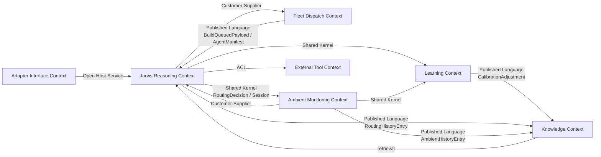

# Jarvis — Domain Model

> **Version:** 1.0
> **Generated:** 2026-04-20 via `/system-arch`
> **Pattern:** Clean/Hexagonal with DDD elements (bounded contexts, context map, published language) applied within the shell.

---

## 1. Bounded Contexts

Seven bounded contexts organise Jarvis's domain.

### 1.1 Adapter Interface Context

**Purpose:** Stateless translation between modality-native protocols (voice, Telegram Bot API, WebSocket, stdin/stdout) and NATS.

**Responsibilities:**
- Encode/decode adapter-native messages to/from `jarvis.command.{adapter}` and `notifications.{adapter}` NATS subjects
- Preserve `correlation_id` end-to-end so responses route back to the originating session
- Minimal logic — no domain decisions, no state beyond session-scoped correlation

**Aggregate roots:** none (stateless translators).

**Ships with four adapter services** (separate containers): Telegram, CLI, Dashboard, Reachy Mini.

---

### 1.2 Jarvis Reasoning Context

**Purpose:** The DeepAgents supervisor — reasoning loop, thread-per-session, tool invocation, skill composition.

**Responsibilities:**
- Consume `jarvis.command.*`, produce responses + dispatches + notifications
- Maintain per-session thread state (ephemeral)
- Share Memory Store across sessions for durable recall ("last week we…")
- Invoke skills (`morning-briefing`, `talk-prep`, `project-status`)
- Make routing decisions (which role / specialist / build / cloud-escape)

**Aggregate root:** `Session`
- Identity: (`adapter_id`, `session_id`)
- Holds: thread state, active tool calls, last correlation_id

**Related entities:**
- `RoutingDecision` — value object recorded in `jarvis_routing_history`
- `SkillInvocation` — value object for audit trail

---

### 1.3 Fleet Dispatch Context

**Purpose:** Three-target dispatch — async subagents (same process), NATS specialists (different process), Forge (JetStream build queue).

**Responsibilities:**
- Resolve registered capabilities at decision time (from static subagent declarations + live NATS fleet registry)
- Construct payloads (`dispatch_by_capability`, `queue_build`, `start_async_task`, `escalate_to_frontier`)
- Publish/receive across the appropriate NATS subject + correlation

**Aggregate root:** `DispatchDecision`
- Identity: `correlation_id`
- Holds: target, chosen capability, reasoning, alternatives considered, outcome reference

**Customer-Supplier** with Jarvis Reasoning (Jarvis Reasoning is the customer).

**Published Language** (with Forge): `BuildQueuedPayload` on `pipeline.build-queued.{feature_id}` (ADR-SP-014 Pattern A).

**Published Language** (with specialists): `AgentManifest`, `ToolCapability`, `IntentCapability` from `nats-core`.

---

### 1.4 Ambient Monitoring Context

**Purpose:** Pattern B triggered watchers — async subagents monitoring a condition, emitting a notification when fired. Pattern C opt-in skill seed (`morning-briefing`).

**Responsibilities:**
- Accept watcher specs ("monitor X, notify when Y")
- Manage lifecycle (PROPOSED → RUNNING → FIRED | DISMISSED | DEAD)
- Enforce resource ceiling (≤10 concurrent)
- Retry on error with backoff (15s, 60s, 5m); notify + DEAD on persistent failure
- Non-durable across supervisor restart in v1 (specs optionally persisted to Graphiti for respawn)

**Aggregate root:** `Watcher`
- Identity: `watcher_id` (uuid)
- Holds: spec, condition, lifecycle state, retry count, originating session

**Shared Kernel** with Jarvis Reasoning (shared `RoutingDecision` + `Session` types that spawn watchers).

---

### 1.5 Learning Context

**Purpose:** Pattern detection over routing + ambient history; propose `CalibrationAdjustment` entities to Graphiti; Rich confirms via CLI.

**Responsibilities:**
- Read `jarvis_routing_history` + `jarvis_ambient_history` via Graphiti adapter
- Detect patterns (redirect rate, dismiss rate, retry rate, cost-adjusted satisfaction)
- Propose adjustments (e.g. "bump cost-tolerance for architecture-review topics"); never edit YAML
- Await Rich-confirmation via operator CLI approval round-trip
- On confirm: write final `CalibrationAdjustment` entity — retrieved in future session prompts

**Aggregate root:** `CalibrationAdjustment`
- Identity: `adjustment_id`
- Lifecycle: PROPOSED → (CONFIRMED | REJECTED | EXPIRED)

**Shared Kernel** with Jarvis Reasoning + Ambient Monitoring (shares decision/event types).

**Published Language** with Knowledge Context (writes adjustments as Graphiti entities).

---

### 1.6 Knowledge Context

**Purpose:** Durable store for routing priors, ambient history, general knowledge. Backed by Graphiti / FalkorDB.

**Responsibilities:**
- Persist trace-rich `RoutingHistoryEntry` records (decisions + alternatives + reasoning + cost + outcome)
- Persist `AmbientHistoryEntry` records (watcher firings + outcomes + Rich responses)
- Serve retrieval queries at decision time (similar-prior lookup, user-preference priors)
- Archive to Synology NAS per ADR-FLEET-001 retention policy

**Aggregate roots:** none at Jarvis layer — Graphiti owns the entity model. Jarvis treats it as a typed read/write surface via the adapter.

---

### 1.7 External Tool / API Context

**Purpose:** Third-party integrations — calendar, weather, email (read-only v1), Home Assistant, web search.

**Responsibilities:**
- ACL (Anti-Corruption Layer) — translate external aggregates into Jarvis domain types
- Enforce auth per service (env-only tokens, Google OAuth refresh, HA long-lived, etc.)
- Return structured errors on upstream failure; never raise

**Aggregate roots:** none (Jarvis owns nothing here — it's outbound).

**ACL** relationship with Jarvis Reasoning — external shapes never leak through the tool-layer boundary.

---

## 2. Context Map

---

## 3. Aggregate Roots

| Aggregate | Context | Identity | Lifecycle |
|---|---|---|---|
| `Session` | Jarvis Reasoning | (`adapter_id`, `session_id`) | Created on first command; ephemeral (thread state); Memory Store persists cross-session recall |
| `DispatchDecision` | Fleet Dispatch | `correlation_id` | Created at dispatch; closed on result received or timeout; recorded to `jarvis_routing_history` |
| `Watcher` | Ambient Monitoring | `watcher_id` (uuid) | PROPOSED → RUNNING → (FIRED \| DISMISSED \| DEAD); non-durable across restart in v1 |
| `CalibrationAdjustment` | Learning | `adjustment_id` | PROPOSED → (CONFIRMED \| REJECTED \| EXPIRED); durable in Graphiti once CONFIRMED |

---

## 4. Domain Events

| Event | Source context | Subscribers | Persisted? |
|---|---|---|---|
| `SessionStarted` | Jarvis Reasoning | — | trace log |
| `SessionEnded` | Jarvis Reasoning | Learning (closure triggers aggregation) | trace log |
| `RoutingDecisionMade` | Jarvis Reasoning | Learning; Knowledge (`jarvis_routing_history`) | Graphiti |
| `UserRedirected` | Jarvis Reasoning | Learning (first-order correction signal) | Graphiti |
| `DispatchRequested` | Fleet Dispatch | — | trace log |
| `DispatchResultReceived` | Fleet Dispatch | Jarvis Reasoning; Learning | Graphiti |
| `BuildQueued` | Fleet Dispatch | Forge (external consumer via `pipeline.build-queued.*`) | JetStream |
| `WatcherProposed` | Ambient Monitoring | — | optional Graphiti |
| `WatcherFired` | Ambient Monitoring | Jarvis Reasoning; Knowledge (`jarvis_ambient_history`) | Graphiti |
| `WatcherDismissed` | Ambient Monitoring | Learning; Knowledge | Graphiti |
| `NotificationEmitted` | Jarvis Reasoning | Adapter Interface | trace log |
| `CalibrationAdjustmentProposed` | Learning | Operator CLI (approval queue) | Graphiti (PROPOSED) |
| `CalibrationAdjustmentConfirmed` | Learning | Jarvis Reasoning (retrieval at next session) | Graphiti (CONFIRMED) |

---

## 5. Published Language (with fleet peers)

All cross-agent types come from `nats-core` — no Jarvis-specific duplicates.

| Type | Used for |
|---|---|
| `AgentManifest` | Jarvis publishes its own to `fleet.register`; reads others' from `agent-registry` KV |
| `ToolCapability`, `IntentCapability` | Capability description inputs into Jarvis's routing decision |
| `BuildQueuedPayload` | Jarvis → Forge trigger (Pattern A) |
| `ApprovalRequestPayload` | Jarvis → Rich approval round-trip (CalibrationAdjustment, future interrupt-based gates) |
| `NotificationPayload` | Jarvis → Adapter Interface outbound |
| `ResultPayload` | Specialist → Jarvis dispatch result |

---

## 6. Shared Kernels

`jarvis.learning` has a shared kernel with `jarvis.routing` + `jarvis.watchers` — learning must understand the same `RoutingDecision`, `DispatchDecision`, and `Watcher` types those contexts produce. This is deliberate — learning is a **module inside the Jarvis supervisor**, not a separate agent (per fleet v3 D45, ADR-ARCH-005).

---

*"Seven contexts, one supervisor, one local reasoner."*
