# Jarvis — C4 Level 1: System Context

> **Version:** 1.0
> **Generated:** 2026-04-20 via `/system-arch`

---

## System Context Diagram

```mermaid
C4Context
    title Jarvis System Context (v1 — local-first via llama-swap)

    Person(rich, "Rich", "Single operator; primary user across all adapter surfaces")

    System_Boundary(surfaces, "Attended adapter surfaces") {
        System_Ext(telegram, "Telegram Adapter", "Priority 1 — messaging")
        System_Ext(cli, "CLI Adapter", "Priority 2 — terminal + operator controls")
        System_Ext(dashboard, "Dashboard Adapter", "Priority 3 — WebSocket + React live trace view")
        System_Ext(reachy, "Reachy Mini Adapter", "Priority 4 — voice (arrives with hardware)")
    }

    System(jarvis, "Jarvis", "General Purpose DeepAgent with dispatch tools — attended surface of the three-surface fleet")

    System(forge, "Forge", "Pipeline orchestrator — sequential builds")
    System(specialists, "Specialist Agents", "architect / product-owner / ideation / ux-designer (one binary, roles)")
    System(tutor, "Study Tutor", "Conversational teaching agent (future cross-surface coordination)")

    System_Ext(llamaswap, "llama-swap on GB10", "Unified /v1 inference front door — ALL unattended inference routes here")
    System_Ext(nats, "NATS JetStream", "Fleet event bus + KV registry (agent-registry)")
    System_Ext(graphiti, "Graphiti / FalkorDB", "Knowledge + jarvis_routing_history + jarvis_ambient_history")
    System_Ext(extapis, "External APIs (ACL)", "Calendar / weather / email / Home Assistant / web search / Telegram Bot API")
    System_Ext(cloud_frontier, "Cloud Frontier Models", "Gemini 3.1 Pro / Opus 4.7 — ATTENDED escape hatch only; never ambient")

    Rel(rich, telegram, "Text")
    Rel(rich, cli, "Terminal")
    Rel(rich, dashboard, "UI + live trace")
    Rel(rich, reachy, "Voice")

    Rel(telegram, nats, "jarvis.command.telegram / notifications.telegram")
    Rel(cli, nats, "jarvis.command.cli / notifications.cli")
    Rel(dashboard, nats, "jarvis.command.dashboard / notifications.dashboard + read-only subscribe")
    Rel(reachy, nats, "jarvis.command.reachy / notifications.reachy")

    Rel(jarvis, nats, "Consumes jarvis.command.*; publishes dispatches + notifications; registers via fleet.register")
    Rel(forge, nats, "Consumes pipeline.build-queued; registers on fleet.register")
    Rel(specialists, nats, "Registers; consumes agents.command.{agent_id}")
    Rel(tutor, nats, "Registers; cross-surface coordination")

    Rel(jarvis, llamaswap, "ALL supervisor + subagent inference — jarvis-reasoner alias")
    Rel(forge, llamaswap, "AutoBuild Player via qwen-coder-next alias")
    Rel(specialists, llamaswap, "Role inference via gpt-oss-120b / fine-tuned aliases")
    Rel(jarvis, graphiti, "Reads/writes jarvis_routing_history, jarvis_ambient_history; queries general knowledge")
    Rel(jarvis, extapis, "Tool calls via jarvis.tools.external ACL")
    Rel(jarvis, cloud_frontier, "escalate_to_frontier tool — ATTENDED sessions only; constitutional rule blocks ambient paths")

    UpdateRelStyle(jarvis, cloud_frontier, $lineColor="orange", $offsetY="-10")
    UpdateElementStyle(llamaswap, $bgColor="#1e88e5", $fontColor="#fff")
    UpdateElementStyle(cloud_frontier, $bgColor="#ff8f00", $fontColor="#fff")
```

**Look for:** the **blue llama-swap box is the single inference boundary** — every unattended inference arrow terminates there. The **orange cloud-frontier arrow** is the only exception and is constitutionally gated to attended paths (`escalate_to_frontier` tool, never in ambient/learning/Pattern-B watcher tool sets). Other fleet members (Forge, specialists) share the same llama-swap instance — Jarvis is not special. NATS is the control-plane bus; llama-swap is the data-plane inference front door.

---

## Actors

| Actor | Role |
|---|---|
| **Rich** | Single operator. Interacts via four adapter surfaces (Telegram, CLI, Dashboard, Reachy). Sole user of Jarvis in v1. |
| **Other fleet agents (future)** | May delegate GPA-level tasks to Jarvis via `agents.command.jarvis` once Jarvis's `fleet.register` publication is active. |

## External Systems

| System | Relationship to Jarvis |
|---|---|
| **llama-swap on GB10** | Unified `/v1` inference front door (`http://promaxgb10-41b1:9000`). Jarvis supervisor + `jarvis-reasoner` subagent + Pattern B watchers + learning all route through llama-swap. Never bypassed on unattended paths (ADR-ARCH-001). |
| **NATS JetStream** | Fleet control-plane bus. Streams: `FLEET`, `AGENTS`, `PIPELINE`, `JARVIS`, `NOTIFICATIONS`. KV bucket: `agent-registry`. |
| **Graphiti / FalkorDB** | Durable learning store. Groups: `jarvis_routing_history`, `jarvis_ambient_history`, plus shared general-knowledge. |
| **External APIs** | Calendar (CalDAV/Google), weather (Open-Meteo), email (read-only IMAP v1), Home Assistant (long-lived token), web search. All wrapped in `jarvis.tools.external` ACL. |
| **Cloud Frontier Models** | Gemini 3.1 Pro / Opus 4.7. Invoked only via `escalate_to_frontier` tool on attended sessions. Constitutional rule blocks ambient/learning/Pattern-C paths from calling this tool. |
| **Forge, Specialist Agents, Study Tutor** | Fleet peers. Jarvis dispatches to specialists via `agents.command.*`; triggers Forge builds via `pipeline.build-queued.*`; coordinates with Study Tutor via future cross-surface primitives. |
