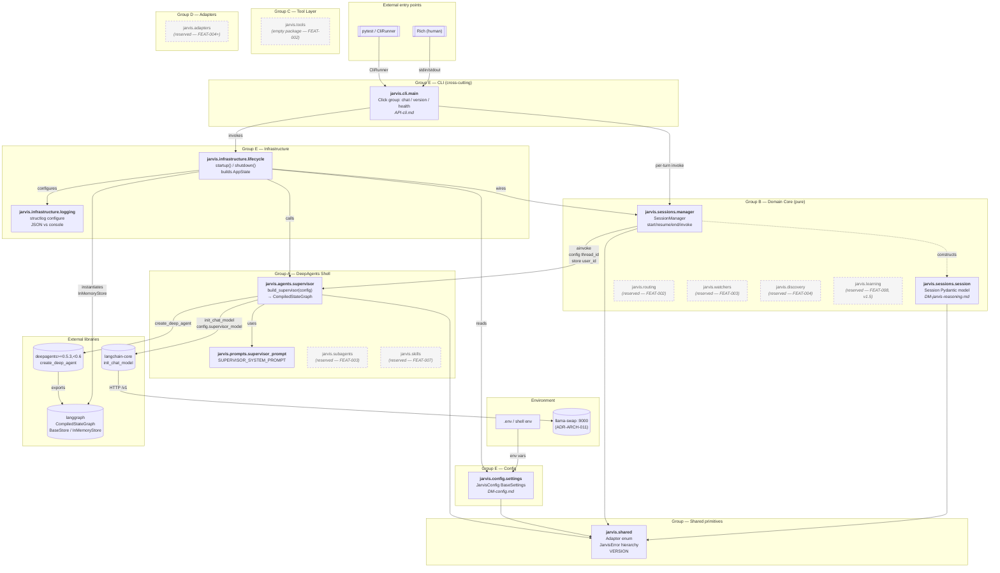

# C4 Level 3 — Jarvis Supervisor container (Phase 1 slice)

**Feature:** FEAT-JARVIS-001
**Container:** Jarvis Supervisor (per [container.md §Jarvis Supervisor container](../../../architecture/container.md))
**Scope:** Phase 1 only — modules and wiring that ship with FEAT-JARVIS-001. Reserved-but-empty modules are shown as dashed boxes; future-feature modules are omitted.
**Status:** Proposed — requires approval gate (see Phase 3.5 of `/system-design`).

---

## Component diagram

---

## Component inventory (Phase 1)

| Component | Group | Module path | Role | Ships in |
|---|---|---|---|---|
| **CLI** | E | `jarvis.cli.main` | Click group — `chat` / `version` / `health` | FEAT-JARVIS-001 |
| **Lifecycle** | E | `jarvis.infrastructure.lifecycle` | Startup/shutdown; constructs `AppState` | FEAT-JARVIS-001 |
| **Logging** | E | `jarvis.infrastructure.logging` | structlog configuration | FEAT-JARVIS-001 |
| **Config** | E | `jarvis.config.settings` | `JarvisConfig` BaseSettings | FEAT-JARVIS-001 |
| **Supervisor factory** | A | `jarvis.agents.supervisor` | `build_supervisor(config)` → `CompiledStateGraph` | FEAT-JARVIS-001 |
| **Supervisor prompt** | A | `jarvis.prompts.supervisor_prompt` | `SUPERVISOR_SYSTEM_PROMPT` constant | FEAT-JARVIS-001 |
| **Session model** | B | `jarvis.sessions.session` | `Session` Pydantic model | FEAT-JARVIS-001 |
| **Session manager** | B | `jarvis.sessions.manager` | `SessionManager` lifecycle + invoke | FEAT-JARVIS-001 |
| **Shared primitives** | — | `jarvis.shared` | `Adapter` enum, `JarvisError` hierarchy, `VERSION` | FEAT-JARVIS-001 |
| `jarvis.subagents` | A | `jarvis/subagents/` | Reserved package (empty `__init__`) | FEAT-JARVIS-003 |
| `jarvis.skills` | A | `jarvis/skills/` | Reserved package | FEAT-JARVIS-007 |
| `jarvis.routing` | B | `jarvis/routing/` | Reserved package | FEAT-JARVIS-002 |
| `jarvis.watchers` | B | `jarvis/watchers/` | Reserved package | FEAT-JARVIS-003 |
| `jarvis.discovery` | B | `jarvis/discovery/` | Reserved package | FEAT-JARVIS-004 |
| `jarvis.learning` | B | `jarvis/learning/` | Reserved package | FEAT-JARVIS-008 (v1.5) |
| `jarvis.tools` | C | `jarvis/tools/` | Reserved empty package | FEAT-JARVIS-002 |
| `jarvis.adapters` | D | `jarvis/adapters/` | Reserved package | FEAT-JARVIS-004 onwards |

**Active modules:** 8. **Reserved empty packages:** 8. Total Phase 1 package count: 16 top-level Python packages.

---

## Key edges worth calling out

- **Single inference path.** `langchain.init_chat_model` → `llama-swap :9000` is the only path from Jarvis to model inference. Matches [ADR-ARCH-001](../../../architecture/decisions/ADR-ARCH-001-local-first-inference-via-llama-swap.md) — local-first, no cloud fallback on unattended paths. Phase 1's `chat` is an *attended* session, so `JARVIS_SUPERVISOR_MODEL=anthropic:...` override works for developer-machine testing, but the default targets llama-swap.

- **Supervisor factory is pure.** `agents.supervisor.build_supervisor(config)` has no hidden state and no I/O beyond the model-client construction done inside `init_chat_model`. Calling it twice produces two independent graphs. This is what makes `tests/test_supervisor.py` viable without LLM mocking.

- **SessionManager is the only caller of `supervisor.ainvoke`.** No other module invokes the compiled graph directly — this is the Clean/Hexagonal boundary enforced at the component level. `cli.main` goes through `SessionManager`, `tests/` go through `SessionManager`, and FEAT-JARVIS-006 Telegram will go through `SessionManager`.

- **`tools/` is a deliberate empty package.** Creating `src/jarvis/tools/__init__.py` in Phase 1 reserves the import path so FEAT-JARVIS-002 can land its tools without directory setup (per [phase1-build-plan.md §11 change 9](../../../research/ideas/phase1-build-plan.md)).

- **Domain modules (`sessions`) do not import from adapters or tools.** Enforced by the empty state of those modules in Phase 1 — there is nothing importable. FEAT-JARVIS-004's adapter landings will maintain this via ruff boundary rules.

---

## What to look for in the approval review

- **Does any active module span more than one ADR-ARCH-006 group?** (It should not. Each is uniquely placed.)
- **Does the edge list match `API-internal.md`?** Specifically, `sessions_mgr → agents` is the only edge from B → A; `cli_main → sessions_mgr` is the only domain entry from E.
- **Is anything missing for Phase 1?** Specifically: Memory Store instantiation is owned by `lifecycle`, not by `sessions_mgr` — confirm this matches the intent.
- **Are the reserved stubs useful or noise?** They document the future shape and prevent namespace collisions; if you prefer a cleaner diagram we can drop them and reintroduce per-feature.

---

## Review gate

Per Phase 3.5 of `/system-design`, this diagram requires explicit approval before proceeding. Options:
- **[A]pprove** — diagram goes into the design output as-is.
- **[R]evise** — specify changes (add/remove components, re-route edges).
- **[R]eject** — diagram excluded from output; Phase 1 ships without a C4 L3 diagram.

*Approval status: pending user review.*
