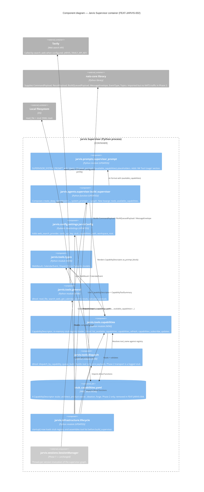

# C4 Level 3 — Fleet Dispatch Components inside the Jarvis Supervisor Container

> **Bounded context:** Fleet Dispatch Context (+ External Tool Context)
> **Container:** Jarvis Supervisor (single Python process built around `create_deep_agent(...)`)
> **Scope:** Components added or touched by FEAT-JARVIS-002. Phase 1 components (sessions, CLI, lifecycle, config) are shown in `system=boundary` grey for orientation but are not modified here.
> **Review gate:** this diagram must be approved per `/system-design` Phase 3.5 before Graphiti seeding. See [§ Review gate](#review-gate) below.

---

## Why this diagram exists

FEAT-JARVIS-002 introduces 4 new modules with 9 `@tool` functions, one YAML data file, and updates two Phase 1 modules. That's 7 collaborating components inside the Jarvis Supervisor container — above the 3-internal-component threshold that triggers the mandatory C4 L3 gate.

## Diagram

---

## Trace through the diagram

**Startup**
1. `lifecycle.startup()` reads `JarvisConfig` (Phase 1 code path, extended with the new keys).
2. `lifecycle` calls `load_stub_registry(config.stub_capabilities_path)` → `caps` parses the YAML into `list[CapabilityDescriptor]`.
3. `lifecycle` assembles the 9 `@tool` functions via `assemble_tool_list(config, capability_registry)`.
4. `lifecycle` calls `build_supervisor(config, tools=..., available_capabilities=...)` → `factory`.
5. `factory` renders each `CapabilityDescriptor.as_prompt_block()`, joins with double newlines, substitutes into `{available_capabilities}` in `SUPERVISOR_SYSTEM_PROMPT`, and passes everything to `create_deep_agent(...)`.

**Turn**
6. `sessions.SessionManager.invoke()` drives the compiled graph (Phase 1 code path).
7. The reasoning model reads the prompt (including `## Available Capabilities`) and chooses a tool.
8. `read_file` touches `fs`; `search_web` touches `tavily`; `calculate` runs in-process via `asteval`; `get_calendar_events` returns `[]` (stub).
9. `list_available_capabilities` returns the same list that was injected.
10. `dispatch_by_capability` resolves `tool_name` against the registry, builds a real `CommandPayload` + `MessageEnvelope` via `natscore`, logs the `JARVIS_DISPATCH_STUB` line, returns the stub response.
11. `queue_build` builds a real `BuildQueuedPayload` + `MessageEnvelope`, logs `JARVIS_QUEUE_BUILD_STUB`, returns the `QueueBuildAck` JSON.

---

## What the diagram does NOT show

- **FEAT-JARVIS-003 additions** — `AsyncSubAgentMiddleware` and the four subagent graphs. Subject to `/system-design FEAT-JARVIS-003`.
- **Graphiti tools** (`record_routing_decision`, etc.) — FEAT-JARVIS-004.
- **NATS adapter** (`jarvis.adapters.nats`) — FEAT-JARVIS-004. Phase 2 uses `nats-core` only as a Pydantic-model library.
- **Notifications adapter** — FEAT-JARVIS-006 / 004.
- **Skills** (`morning-briefing`, etc.) — FEAT-JARVIS-007.
- **`escalate_to_frontier`** — reserved future slot in `jarvis.tools.dispatch`; not in Phase 2.

---

## Review gate

> Per `/system-design` Phase 3.5: this diagram must be explicitly approved before seeding to Graphiti.
>
> **Look for:**
> - Components with too many dependencies (cyclic imports, leaking state).
> - Missing persistence layers — Phase 2 has none (in-memory stub + no NATS); is that acceptable? *Yes, per Phase 2 scope.*
> - Unclear separation of concerns — does `jarvis.tools.dispatch` correctly depend on `jarvis.tools.capabilities` but not the other way?
> - Circular wiring between `factory` and `caps`. (The diagram shows only `factory → caps` for rendering; tests will assert `caps` does not import `factory`.)

**[A]pprove | [R]evise | [R]eject**

Awaiting explicit approval by Rich before `/system-design` proceeds to Phase 4 (OpenAPI validation — skipped here, no REST surface) and Phase 5 (Graphiti seeding).
