# C4 L3 — Jarvis Supervisor Container (post-FEAT-JARVIS-003)

> **Feature:** FEAT-JARVIS-003
> **Level:** C4 Level 3 — Components
> **Container:** Jarvis DeepAgent (single container per ADR-ARCH-014 / ADR-ARCH-026)
> **Supersedes:** [FEAT-JARVIS-001 `supervisor-container-l3.md`](../../FEAT-JARVIS-001/diagrams/supervisor-container-l3.md) (scope) + [FEAT-JARVIS-002 `fleet-dispatch-l3.md`](../../FEAT-JARVIS-002/diagrams/fleet-dispatch-l3.md) (scope). This diagram is the composite view post-FEAT-JARVIS-003.
> **Review gate:** Mandatory per `/system-design` Phase 3.5 — 10 internal components exceed the 3-component threshold.
> **Generated:** 2026-04-23

---

## Diagram

```mermaid
C4Component
    title Jarvis Supervisor — Component Diagram after FEAT-JARVIS-003

    Person(rich, "Rich (Operator)", "Attended — voice/text/CLI")

    Container_Boundary(jarvis_container, "Jarvis Container — single process per ADR-ARCH-026") {

        Component(supervisor, "Supervisor Graph", "DeepAgents 0.5.3 create_deep_agent", "Reasoning loop; routes between tools, subagent, capability dispatch, frontier escape")

        Component(jarvis_reasoner, "jarvis-reasoner Subagent Graph", "DeepAgents AsyncSubAgent (ASGI, co-deployed)", "Role-dispatched reasoning on gpt-oss-120b — critic/researcher/planner")

        Component(role_prompts, "Role Prompts Registry", "Python constants", "ROLE_PROMPTS map: critic/researcher/planner → system prompt")

        Component(subagent_registry, "Subagent Registry", "Python factory", "build_async_subagents(config) → [AsyncSubAgent]")

        Component(general_tools, "General Tools", "4 @tool functions (FEAT-JARVIS-002)", "read_file / search_web / get_calendar_events / calculate")

        Component(capability_tools, "Capability Tools", "3 @tool + stub registry (FEAT-JARVIS-002)", "list_available_capabilities / refresh / subscribe")

        Component(dispatch_tools, "Dispatch Tools", "3 @tool functions", "dispatch_by_capability, queue_build (FEAT-002) + escalate_to_frontier (FEAT-003)")

        Component(llamaswap_adapter, "LlamaSwap Adapter", "Group D adapter (Phase 2 stub)", "current_status(wanted_alias) → SwapStatus")

        Component(lifecycle, "Lifecycle / AppState", "jarvis.infrastructure.lifecycle", "assemble_tool_list(include_frontier=…) — attended vs ambient")

        Component(session_manager, "Session Manager", "Phase 1", "Thread-per-session, Adapter identity, correlation_id")
    }

    System_Ext(llamaswap, "llama-swap on GB10", "http://promaxgb10-41b1:9000")
    System_Ext(nats, "NATS (stubbed Phase 2)", "agents.command.*, pipeline.build-queued.*")
    System_Ext(google, "Google GenAI", "google_genai:gemini-3.1-pro (attended only)")
    System_Ext(anthropic, "Anthropic", "anthropic:claude-opus-4-7 (attended only)")

    Rel(rich, supervisor, "Reactive conversation via CLI adapter (Phase 1)")

    Rel(supervisor, general_tools, "Tool calls")
    Rel(supervisor, capability_tools, "Tool calls")
    Rel(supervisor, dispatch_tools, "Tool calls")
    Rel(supervisor, jarvis_reasoner, "start_async_task(name='jarvis-reasoner', input={'role': …, 'prompt': …})")

    Rel(supervisor, session_manager, "Reads session.adapter, session.correlation_id")
    Rel(supervisor, llamaswap_adapter, "Pre-dispatch check — voice path swap-ack (ADR-ARCH-012)")

    Rel(lifecycle, subagent_registry, "build_async_subagents(config)")
    Rel(lifecycle, dispatch_tools, "assemble_tool_list(include_frontier=True) — attended")
    Rel(lifecycle, dispatch_tools, "assemble_tool_list(include_frontier=False) — ambient")
    Rel(lifecycle, supervisor, "build_supervisor(async_subagents=…, ambient_tool_factory=…)")
    Rel(lifecycle, llamaswap_adapter, "Instantiates at startup")
    Rel(subagent_registry, jarvis_reasoner, "References graph_id='jarvis_reasoner'")

    Rel(jarvis_reasoner, role_prompts, "Reads ROLE_PROMPTS[RoleName(input['role'])] at node 0")
    Rel(jarvis_reasoner, llamaswap, "init_chat_model('openai:jarvis-reasoner') → OPENAI_BASE_URL")

    Rel(llamaswap_adapter, llamaswap, "GET /running, /log (stubbed Phase 2; live FEAT-JARVIS-004)")

    Rel(dispatch_tools, nats, "dispatch_by_capability (stub), queue_build (stub)")
    Rel(dispatch_tools, google, "escalate_to_frontier(target=GEMINI_3_1_PRO) — attended only, belt+braces")
    Rel(dispatch_tools, anthropic, "escalate_to_frontier(target=OPUS_4_7) — attended only, belt+braces")
```

---

## Components — 10 total

| # | Component | Feature | Notes |
|---|---|---|---|
| 1 | Supervisor Graph | Phase 1 / extended 002 / extended 003 | Central reasoning loop. |
| 2 | `jarvis-reasoner` Subagent Graph | **FEAT-JARVIS-003** | Role-dispatched; ASGI co-deployed. |
| 3 | Role Prompts Registry | **FEAT-JARVIS-003** | `ROLE_PROMPTS` dict + `RoleName` enum. |
| 4 | Subagent Registry | **FEAT-JARVIS-003** | `build_async_subagents(config)` factory. |
| 5 | General Tools | FEAT-JARVIS-002 | Unchanged. |
| 6 | Capability Tools | FEAT-JARVIS-002 | Unchanged. |
| 7 | Dispatch Tools | FEAT-JARVIS-002 + **FEAT-003 extension** | `escalate_to_frontier` joins here. |
| 8 | LlamaSwap Adapter | **FEAT-JARVIS-003** | First Group-D adapter populated; Phase 2 stubbed. |
| 9 | Lifecycle / AppState | Phase 1 / extended | `assemble_tool_list(include_frontier=…)` factory. |
| 10 | Session Manager | Phase 1 | Reads by `escalate_to_frontier`'s executor assertion. |

Exceeds the 3-component threshold → **C4 L3 review gate is mandatory** per `/system-design` Phase 3.5.

---

## Key flows

### Flow A — Role-dispatch to `jarvis-reasoner`

1. Rich asks Jarvis for a critique. Supervisor reasoning chooses the subagent.
2. Supervisor emits `start_async_task(name="jarvis-reasoner", input={"role": "critic", "prompt": "<…>", "correlation_id": "<uuid>"})`.
3. `AsyncSubAgentMiddleware` routes the call to the co-deployed `jarvis_reasoner` graph via ASGI.
4. `jarvis_reasoner` node 0 reads `input["role"]`, resolves `ROLE_PROMPTS[RoleName.CRITIC]`, runs the DeepAgents loop against `gpt-oss-120b` via llama-swap.
5. Supervisor reads result via `check_async_task(task_id)` when it needs it. On voice-reactive adapter, supervisor may first query `llamaswap_adapter.current_status(wanted_alias="jarvis-reasoner")`; if `eta_seconds > 30`, emits TTS ack per ADR-ARCH-012 before the `start_async_task` call.

### Flow B — Attended frontier escape

1. Rich on CLI asks "ask Gemini about this design." Supervisor reasoning chooses `escalate_to_frontier`.
2. Tool's executor assertion reads the active session; `session.adapter == Adapter.CLI ∈ ATTENDED_ADAPTERS` → passes Layer 2.
3. Tool calls `init_chat_model("google_genai:gemini-3.1-pro")` and invokes with `instruction`; returns the frontier response as a string.
4. Logged at INFO with `JARVIS_FRONTIER_ESCALATION` prefix; reads `session.correlation_id` for trace continuity.

### Flow C — Ambient invocation of frontier tool is impossible

1. (Hypothetical) Pattern B watcher (FEAT-JARVIS-003 does not build Pattern B watchers — this is a forward-looking check).
2. Watcher's tool list comes from `ambient_tool_factory()` which calls `assemble_tool_list(..., include_frontier=False)`.
3. `escalate_to_frontier` is simply not in the tool catalogue. Watcher's reasoning model cannot emit a tool call to a tool it cannot see. Layer 3 wins before Layer 2 or Layer 1 would fire.

---

## Review gate

_Look for: components with too many dependencies, missing persistence layers, unclear separation of concerns, subagent-coupling anti-patterns, adapter-in-wrong-group._

### Self-review — findings

- **Separation of concerns is clean.** Group A (supervisor + subagents + prompts), Group C (tools), Group D (llamaswap adapter), Group E (lifecycle, sessions) all in their right places per ADR-ARCH-006.
- **Subagent Registry is a thin factory (no I/O), Subagent Graph is compiled at import time (DDR-012), and Supervisor consumes both via DeepAgents middleware.** No circular imports; `jarvis.agents.subagent_registry` imports from `deepagents`, `jarvis.config`; `jarvis.agents.subagents.jarvis_reasoner` imports from `deepagents`, `langchain`, `jarvis.agents.subagents.prompts`. Unidirectional.
- **No persistence layer in the diagram.** Intentional — FEAT-JARVIS-003 writes no durable state. `jarvis_routing_history` writes land with FEAT-JARVIS-004.
- **Dispatch tools cluster has three targets (fleet/build/frontier).** Logical co-location per DDR-014 and consistent with FEAT-JARVIS-002 DDR-005's reservation. If the cluster grows beyond ~5 tools, split recommendation is to promote `jarvis.tools.frontier` as a new module.
- **Session Manager is read-only from the dispatch tools' perspective.** `escalate_to_frontier` reads `session.adapter` for the executor assertion but does not write — consistent with ADR-ARCH-023 (permissions are constitutional; the tool cannot mutate session identity to bypass its own check).
- **Trust-boundary annotation.** Cloud systems (Google, Anthropic) are outside the Jarvis container; the attended-only gate on `dispatch_tools → google / anthropic` is the trust boundary.

### Approval options

**`[A]`** Approve the diagram as shown.

**`[R]`** Revise — specific component addition/removal/relabelling.

**`[J]`** Reject — the diagram materially misrepresents the design and should be excluded from output.

Default on user non-response: reject-soft (diagram stays in design output as "proposed; not yet approved" but the approval-required annotation remains).

---

## Traceability

- **ADR-ARCH-002** — clean/hexagonal inside DeepAgents shell
- **ADR-ARCH-006** — five-group module layout
- **ADR-ARCH-011** — single subagent with role modes (central component #2 + #3)
- **ADR-ARCH-012** — swap-aware voice latency (dashed line from supervisor to llamaswap_adapter)
- **ADR-ARCH-014** — single container (all 10 components inside the boundary)
- **ADR-ARCH-026** — single instance, no horizontal scaling
- **ADR-ARCH-027** — attended-only frontier (three external systems highlighted as attended only)
- **ADR-ARCH-031 (Forge)** — AsyncSubAgent pattern source (ASGI co-deployed)
- **DDR-010 / 011 / 012 / 013 / 014 / 015** — FEAT-JARVIS-003 decisions visible in the diagram
