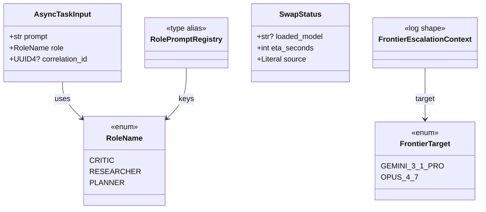

# Data Model — Subagent & Escalation Types

> **Feature:** FEAT-JARVIS-003
> **Bounded context:** Fleet Dispatch Context (primary), Jarvis Reasoning Context (consumer)
> **Generated:** 2026-04-23

---

## 1. `RoleName`

Closed enum of roles the `jarvis-reasoner` subagent accepts per [DDR-011](../decisions/DDR-011-role-enum-closed-v1.md).

```python
from enum import Enum


class RoleName(str, Enum):
    """Role modes for the jarvis-reasoner AsyncSubAgent.

    Membership is closed for v1 per DDR-011. Additions are allowed
    (non-breaking) with commit-message justification; removals/renames
    require a new DDR.
    """
    CRITIC = "critic"
    RESEARCHER = "researcher"
    PLANNER = "planner"
```

### Role postures

| Member | Value | Prompt posture |
|---|---|---|
| `CRITIC` | `"critic"` | Adversarial evaluation; Coach-style flaw detection; calibrated scoring; "what would fail this" framing |
| `RESEARCHER` | `"researcher"` | Open-ended research; multi-source synthesis; no hard latency budget; delegates web lookups via `search_web` if granted |
| `PLANNER` | `"planner"` | Multi-step planning; sequential-task decomposition; gate identification |

### Invariants

- **Exhaustiveness**: `ROLE_PROMPTS` must define a prompt for every member. Asserted in `tests/test_subagent_prompts.py`.
- **String inheritance**: `str, Enum` so `RoleName.CRITIC.value == "critic"` and `RoleName("critic") is RoleName.CRITIC`. Eases JSON (de)serialisation in `input` payloads.
- **Stability**: `.value` strings are the on-the-wire form and must not change silently.

---

## 2. `AsyncTaskInput`

Schema for the `input` argument to `start_async_task(name="jarvis-reasoner", input=...)`.

```python
from pydantic import BaseModel, Field, UUID4


class AsyncTaskInput(BaseModel):
    """Input payload for the jarvis-reasoner subagent.

    Serialised to the DeepAgents AsyncSubAgentMiddleware `input` dict.
    """
    prompt: str = Field(
        ...,
        min_length=1,
        description="Full instruction for the subagent; context-bearing",
    )
    role: RoleName = Field(
        ...,
        description="Role mode selecting the subagent's system prompt",
    )
    correlation_id: UUID4 | None = Field(
        None,
        description="UUID from the originating session; subagent generates one if absent",
    )
```

### Invariants

- `prompt` is always a non-empty string.
- `role` deserialises via `RoleName(value)` and raises if the value is not an enum member — the subagent graph catches the raise and returns the structured `ERROR: unknown_role — …` string per ADR-ARCH-021.
- `correlation_id` is optional at the input boundary but always present in the subagent's internal state (the graph fills it from `uuid4()` if absent). Flows to `jarvis_routing_history` writes in FEAT-JARVIS-004.

Phase 2 serialises this model to a plain `dict` before handing off to `start_async_task` so `AsyncSubAgentMiddleware` (which expects a dict, per the DeepAgents 0.5.3 contract) receives the raw shape.

---

## 3. `RolePromptRegistry` (type alias)

```python
from collections.abc import Mapping

RolePromptRegistry = Mapping[RoleName, str]
```

Used to type `ROLE_PROMPTS` and any future role-prompt injection points (e.g. a v1.5 learning-flywheel priors overlay). v1 has a single compile-time-constant registry:

```python
# src/jarvis/agents/subagents/prompts.py
ROLE_PROMPTS: RolePromptRegistry = {
    RoleName.CRITIC: CRITIC_PROMPT,          # str constants above
    RoleName.RESEARCHER: RESEARCHER_PROMPT,
    RoleName.PLANNER: PLANNER_PROMPT,
}
```

---

## 4. `SwapStatus`

llama-swap builders-group state snapshot per [DDR-015](../decisions/DDR-015-llamaswap-adapter-with-stubbed-health.md).

```python
from typing import Literal
from pydantic import BaseModel, Field


class SwapStatus(BaseModel):
    """Snapshot of llama-swap builders-group state for a requested alias."""
    loaded_model: str | None = Field(
        ...,
        description="llama-swap alias currently loaded, or None if no model is loaded",
    )
    eta_seconds: int = Field(
        ...,
        ge=0,
        description="Estimated seconds until the requested alias is ready (0 = already loaded)",
    )
    source: Literal["live", "stub"] = Field(
        "stub",
        description="'live' when read from llama-swap HTTP; 'stub' in Phase 2 and in tests",
    )
```

### Invariants

- `eta_seconds >= 0`.
- `source="live"` is the production default post-FEAT-JARVIS-004; `source="stub"` is Phase 2 default and test fixture default.
- `loaded_model == wanted_alias and eta_seconds == 0` means the model is ready for immediate dispatch; supervisor skips the voice ack per ADR-ARCH-012.
- `eta_seconds > 30` on a voice-reactive adapter (`Adapter.REACHY`) triggers the supervisor's TTS ack branch.

---

## 5. `FrontierTarget`

Closed enum of cloud frontier targets for `escalate_to_frontier` per [DDR-014](../decisions/DDR-014-escalate-to-frontier-in-dispatch-tool-module.md).

```python
from enum import Enum


class FrontierTarget(str, Enum):
    """Cloud frontier model targets for escalate_to_frontier.

    Values are provider-prefixed model aliases suitable for init_chat_model().
    Additions require a DDR (each new target expands the £20–£50/month budget
    surface per ADR-ARCH-030 and should be justified at design time).
    """
    GEMINI_3_1_PRO = "google_genai:gemini-3.1-pro"
    OPUS_4_7 = "anthropic:claude-opus-4-7"
```

### Invariants

- Values are `<provider>:<model>` strings that `init_chat_model()` accepts directly.
- Members' order matches preference: `GEMINI_3_1_PRO` is default target (breadth, 1M context, most cost-effective frontier); `OPUS_4_7` is the adversarial-critique preference.

---

## 6. `FrontierEscalationContext`

Structured logging shape for `JARVIS_FRONTIER_ESCALATION` log entries. Not a Python class — used as a documentation anchor for what the tool logs. Phase 2 emits via `structlog` with these fields; FEAT-JARVIS-004 maps them into `jarvis_routing_history` rows.

```yaml
event: JARVIS_FRONTIER_ESCALATION
level: INFO
fields:
  target: str                 # FrontierTarget.value — e.g. "google_genai:gemini-3.1-pro"
  session_id: UUID4
  correlation_id: UUID4
  adapter: str                # Adapter.value — e.g. "cli"
  instruction_length: int     # char count of the instruction (not the body; redaction-safe)
  outcome: str                # "success" | "error:<category>" | "degraded:<category>"
  latency_ms: int | null      # populated on success
  cost_usd: float | null      # populated if the provider SDK surfaces cost; else null
```

### Invariants

- `instruction_length` is the *length*, never the body (ADR-ARCH-029 personal-use compliance posture still favours redaction-by-default even for self-hosted logs).
- `outcome` prefixes match the tool's return-value prefix families (`error:<category>` mirrors `ERROR: <category>` returns).

---

## 7. Relationships



---

## 8. Reused from elsewhere (no redefinition)

| Type | Source | Purpose |
|---|---|---|
| `AsyncSubAgent` (TypedDict) | `deepagents` SDK | Subagent registry entry shape |
| `CompiledStateGraph` | `langgraph.graph.state` | Compiled graph type for subagent module exports |
| `Session` | `jarvis.sessions.session` (Phase 1) | Session identity carried through `_current_session()` |
| `Adapter` (enum) | `jarvis.shared.constants` (Phase 1) | Adapter identity for `ATTENDED_ADAPTERS` check |
| `CapabilityDescriptor` | `jarvis.tools.capabilities` (FEAT-JARVIS-002) | Not extended; unchanged |

---

## 9. Traceability

- **ADR-ARCH-011** — single-subagent + role-mode pattern
- **ADR-ARCH-012** — swap-aware voice-latency policy drives `SwapStatus`
- **ADR-ARCH-021** — structured-error-string return discipline
- **ADR-ARCH-027** — attended-only escape shape drives `FrontierTarget` + `FrontierEscalationContext`
- **ADR-ARCH-030** — budget envelope drives `FrontierEscalationContext.cost_usd`
- **DDR-011** — role enum closure
- **DDR-014** — `escalate_to_frontier` design
- **DDR-015** — `SwapStatus` stub/live split
