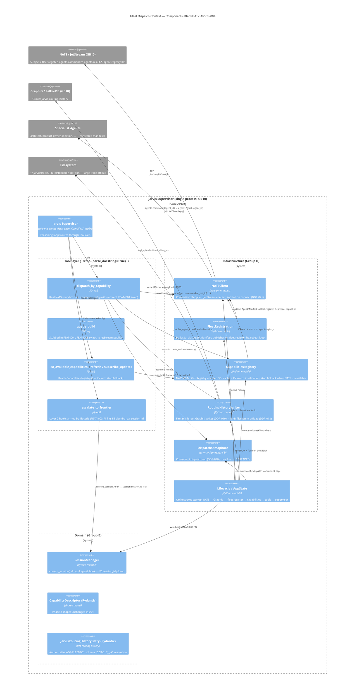

# C4 L3 — Fleet Dispatch Container (post-FEAT-JARVIS-004)

> **Owner:** [FEAT-JARVIS-004 design §6](../design.md)
> **Mandatory review gate:** This diagram triggers `/system-design` Phase 3.5. The Fleet Dispatch Context container exceeds the 3-internal-component threshold (12 components participate after this feature lands). **Explicit approval required** before the design is finalised.

---

## Component diagram

---

## Components — narrative

**Tool layer (Group C — all 4 @tool functions live in `src/jarvis/tools/`):**

1. **dispatch_by_capability** — Phase 2 stub body retired; real NATS round-trip with `asyncio.wait_for(...)`, retry-with-redirect (max 1, DDR-017), trace write at every boundary. **Tool docstring + return shape unchanged** so the reasoning model sees no transition.
2. **queue_build** — Phase 2 stub remains until FEAT-JARVIS-005 swaps it. Documented here so the diagram reflects the post-FEAT-J004 state including the not-yet-swapped tool.
3. **list_available_capabilities / capabilities_refresh / capabilities_subscribe_updates** — bodies updated to read from `CapabilitiesRegistry` (live KV) instead of the in-memory `_capability_registry` snapshot. Stub-fallback when NATS is `None`.
4. **escalate_to_frontier** — Layer 2 hooks were armed in the FEAT-J003-FIX-001 wave; FEAT-J004 plumbs real `session_id` (review F5) and reads `frontier_default_target` from config (review F6).

**Infrastructure layer (Group D — Phase 1 reserved, populated here):**

5. **NATSClient** — async wrapper around `nats-py`; connect on startup, drain on shutdown; exposes `client` + `js` (JetStream) properties; soft-fail returns `None` per DDR-021.
6. **FleetRegistration** — `build_jarvis_manifest(config) → AgentManifest`; `register_on_fleet(client, manifest)` publishes to `fleet.register`; `heartbeat_loop(client, manifest, config)` is the asyncio task launched by lifecycle.
7. **CapabilitiesRegistry** — wraps `NATSKVManifestRegistry` from `nats-core` (or vendor-stamps the KV-watch shape per ASSUM-NATS-KV-WATCH); 30s cache; `subscribe_updates()` attaches a watcher; `StubCapabilitiesRegistry` is the soft-fail fallback so `list_available_capabilities` still serves the stub list.
8. **RoutingHistoryWriter** — Graphiti client lifecycle; `write_specialist_dispatch(entry)` and (FEAT-J005) `write_build_queue_dispatch(entry)` + `append_build_queue_event(correlation_id, event)`; redaction processor at the write boundary; large-trace filesystem offload per DDR-018.
9. **DispatchSemaphore** — `asyncio.Semaphore(8)`; `acquire_nowait()` returns immediately on overflow so the tool emits `DEGRADED: dispatch_overloaded — wait and retry`.
10. **Lifecycle / AppState** — orchestrates startup ordering and stores all the new substrate references on `AppState` (`nats_client`, `graphiti_client`, `routing_history_writer`, `fleet_heartbeat_task`).

**Domain (Group B — pure types, no I/O):**

11. **SessionManager** — already present from Phase 1; `current_session()` returns the active `Session` so the dispatch tool can read `session.session_id` for trace records (F5).
12. **JarvisRoutingHistoryEntry** — full Pydantic shape per [DM-routing-history.md](../models/DM-routing-history.md).

---

## Review gate

_Look for:_

- **Components with too many dependencies.** `Lifecycle` legitimately has many — that's its job (orchestration). `dispatch_by_capability` reaches semaphore + capabilities + nats_client + rh_writer; that's the dispatch sequence and is documented in `design.md §8`.
- **Missing persistence layers.** Graphiti + filesystem are both shown. No SQLite per ADR-ARCH-008 — JarvisRoutingHistoryEntry is the substitute for Forge's SQLite-backed pipeline state.
- **Unclear separation of concerns.** Group B (domain, pure) / Group C (tools) / Group D (infrastructure) is the ADR-ARCH-006 five-group layout. The diagram's boundaries reflect that grouping.
- **God modules.** No single module owns more than one cross-cutting concern. NATS is split across `nats_client.py` (transport), `fleet_registration.py` (lifecycle), `capabilities_registry.py` (KV reads). Graphiti is split between `routing_history.py` (writes) and the future `infrastructure/graphiti_client.py` (connection — minimal in v1).
- **Cyclic dependencies.** None. `tools/` imports from `infrastructure/` (one direction); `infrastructure/` imports from `config/`, `sessions/`, `shared/` (one direction).

[A]pprove | [R]evise | [R]eject

> Reviewer: please indicate approval before this design is seeded to Graphiti and `/feature-spec FEAT-JARVIS-004` is invoked.

---

*"Twelve components — registered, dispatched, traced. The fleet contract is symmetric."* — [phase3-fleet-integration-scope.md](../../../research/ideas/phase3-fleet-integration-scope.md)
