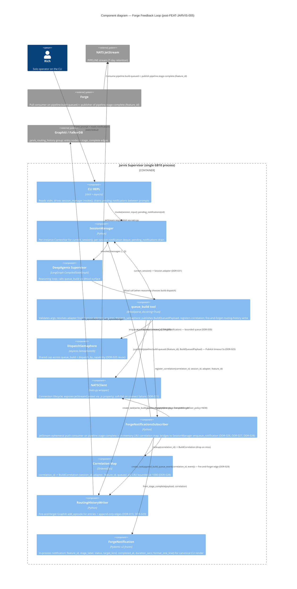

# C4 Level 3 — Forge Feedback Loop (post-FEAT-JARVIS-005)

> **Owner:** [FEAT-JARVIS-005 design §6](../design.md)
> **Container in focus:** Jarvis Supervisor (Fleet Dispatch + Adapter Interface contexts)
> **Required by:** Phase 3.5 mandatory review gate (component count > 3)

This is the C4 Level 3 view of the **Forge Feedback Loop** as it stands after FEAT-JARVIS-005 lands. It zooms inside the Jarvis Supervisor container and shows the components that participate in (a) the outbound `queue_build` publish path and (b) the inbound `pipeline.stage-complete.>` subscription path that bridges back to Rich's CLI between prompts.

The Fleet Dispatch container exceeds the 3-internal-component threshold (10 components participate after this feature lands), so per `/system-design` Phase 3.5 the diagram **requires explicit operator approval** before the design output is finalised.

---

## Diagram

---

## Component count + threshold

10 internal components participate in this diagram:

1. CLI REPL
2. SessionManager
3. DeepAgents Supervisor
4. `queue_build` tool
5. DispatchSemaphore
6. NATSClient
7. ForgeNotificationsSubscriber
8. Correlation Map
9. RoutingHistoryWriter
10. ForgeNotification

10 > 3 → C4 L3 review gate is mandatory.

---

## What to look for in review

Per the `/system-design` Phase 3.5 review prompt, examine:

- **Components with too many dependencies.** `queue_build` connects to 5 internal collaborators (SessionManager, DispatchSemaphore, NATSClient, ForgeNotificationsSubscriber, RoutingHistoryWriter). Is that reasonable, or does it suggest extracting an intermediate `BuildQueuePublisher` class? **Assessment:** the five connections each have a distinct concern (adapter resolution, capacity guard, transport, correlation tracking, trace persistence); a `BuildQueuePublisher` wrapper would just thread the same five through one extra layer without removing coupling. Keep `queue_build` as the seam.
- **Missing persistence layers.** The Correlation Map is in-memory (DDR-028) — is that durability sufficient for the use case? **Assessment:** yes, per DDR-027 (ephemeral consumer) + DDR-028 (in-memory bounded). The bridge is in-process, not durable.
- **Unclear separation of concerns.** Subscriber + Correlation Map are tightly coupled (the map lives inside the subscriber). They're modelled separately on the diagram for clarity, but the colocation is intentional — separating them across modules would force an awkward ownership question.
- **Forge boundary clarity.** Forge is shown as `System_Ext` (external system) — Jarvis only interacts with it via NATS subjects, never directly. The arrows make the publish/subscribe directionality explicit.
- **Cross-cutting: routing-history writer.** Both `queue_build` and the subscriber call into the writer (via `create_task`). The writer is a single shared component, not duplicated — matches the FEAT-J004 design.

---

## Approval

**Per `/system-design` Phase 3.5 — this diagram requires explicit approval before design output is finalised.**

Options:

- `[A]pprove` — diagram lands as drawn; design output proceeds.
- `[R]evise` — request changes; diagram is re-rendered before approval.
- `[R]eject` — diagram is excluded from output; design lands without a C4 L3.

(See the `/system-design` Phase 3.5 prompt at the end of this run.)

---

*"Zoom in on the seam where the reasoning model touches the wire — and the bridge that brings progress back."* — [FEAT-JARVIS-005 design §6](../design.md)
