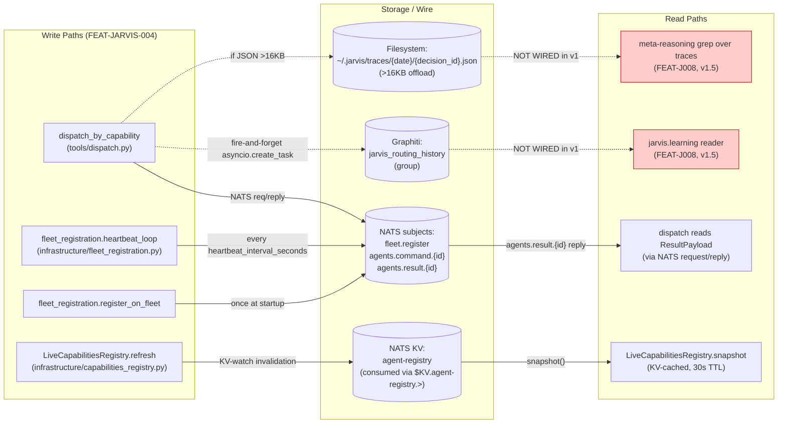
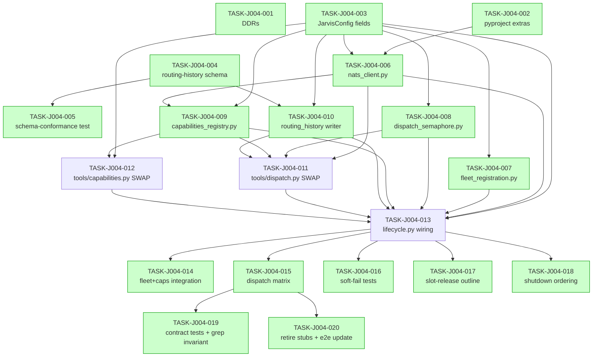

/feature-plan "NATS Fleet Registration and Specialist Dispatch" \
  --context features/feat-jarvis-004-fleet-registration-and-specialist-dispatch/feat-jarvis-004-fleet-registration-and-specialist-dispatch_summary.md \
  --context features/feat-jarvis-004-fleet-registration-and-specialist-dispatch/feat-jarvis-004-fleet-registration-and-specialist-dispatch.feature \
  --context features/feat-jarvis-004-fleet-registration-and-specialist-dispatch/feat-jarvis-004-fleet-registration-and-specialist-dispatch_assumptions.yaml \
  --context docs/design/FEAT-JARVIS-004/design.md \
  --context docs/design/FEAT-JARVIS-004/contracts/API-tools.md \
  --context docs/design/FEAT-JARVIS-004/contracts/API-internal.md \
  --context docs/design/FEAT-JARVIS-004/contracts/API-events.md \
  --context docs/design/FEAT-JARVIS-004/models/DM-routing-history.md \
  --context docs/design/FEAT-JARVIS-004/decisions/DDR-016-dispatch-timeout-default-60s.md \
  --context docs/design/FEAT-JARVIS-004/decisions/DDR-017-retry-with-redirect-policy.md \
  --context docs/design/FEAT-JARVIS-004/decisions/DDR-018-routing-history-schema-authoritative.md \
  --context docs/design/FEAT-JARVIS-004/decisions/DDR-019-graphiti-fire-and-forget-writes.md \
  --context docs/design/FEAT-JARVIS-004/decisions/DDR-020-concurrent-dispatch-cap-8.md \
  --context docs/design/FEAT-JARVIS-004/decisions/DDR-021-nats-unavailable-soft-fail.md \
  --context docs/design/FEAT-JARVIS-004/decisions/DDR-022-defer-llamaswap-live-reads-to-v15.md \
  --context docs/research/ideas/phase3-fleet-integration-scope.md \
  --context docs/research/ideas/phase3-build-plan.md \
  --context .guardkit/context-manifest.yaml


I'll execute /feature-plan for "NATS Fleet Registration and Specialist Dispatch" following the orchestration flow. Starting with Step 2: Review Scope Clarification (Context A).

Bash Verify context directories exist
IN
ls -la features/feat-jarvis-004-fleet-registration-and-specialist-dispatch/ docs/design/FEAT-JARVIS-004/ 2>&1 | head -60

OUT
docs/design/FEAT-JARVIS-004/:
total 88
drwxr-xr-x  7 richardwoollcott  staff    224 Apr 27 13:26 .
drwxr-xr-x  6 richardwoollcott  staff    192 Apr 27 13:20 ..
drwxr-xr-x  5 richardwoollcott  staff    160 Apr 27 13:25 contracts
drwxr-xr-x  9 richardwoollcott  staff    288 Apr 27 13:30 decisions
-rw-r--r--  1 richardwoollcott  staff  43340 Apr 27 13:20 design.md
drwxr-xr-x  3 richardwoollcott  staff     96 Apr 27 13:23 diagrams
drwxr-xr-x  3 richardwoollcott  staff     96 Apr 27 13:22 models

features/feat-jarvis-004-fleet-registration-and-specialist-dispatch/:
total 80
drwxr-xr-x  5 richardwoollcott  staff    160 Apr 27 14:59 .
drwxr-xr-x  8 richardwoollcott  staff    256 Apr 27 14:56 ..
-rw-r--r--  1 richardwoollcott  staff   6340 Apr 27 14:59 feat-jarvis-004-fleet-registration-and-specialist-dispatch_assumptions.yaml
-rw-r--r--  1 richardwoollcott  staff   5801 Apr 27 14:59 feat-jarvis-004-fleet-registration-and-specialist-dispatch_summary.md
-rw-r--r--  1 richardwoollcott  staff  22309 Apr 27 14:58 feat-jarvis-004-fleet-registration-and-specialist-dispatch.feature
Bash Check Graphiti availability
IN
ls -la .guardkit/graphiti.yaml 2>&1; test -f .guardkit/graphiti.yaml && cat .guardkit/graphiti.yaml | head -20 || echo "graphiti.yaml not present"

OUT
-rw-r--r--  1 richardwoollcott  staff  719 Apr 20 10:48 .guardkit/graphiti.yaml
project_id: jarvis
enabled: true
graph_store: falkordb
falkordb_host: whitestocks
falkordb_port: 6379
timeout: 30.0
max_concurrent_episodes: 3
llm_provider: vllm
llm_base_url: http://promaxgb10-41b1:8000/v1
llm_model: neuralmagic/Qwen2.5-14B-Instruct-FP8-dynamic
# --- Fallback: MacBook Pro M2 Max (Ollama, Q4_K_M) — uncomment if GB10 offline ---
#llm_provider: ollama
#llm_base_url: http://richards-macbook-pro.tailebf801.ts.net:8000/v1
#llm_model: qwen2.5:14b-instruct-q4_K_M
llm_max_tokens: 4096
embedding_provider: vllm
embedding_base_url: http://promaxgb10-41b1:8001/v1
embedding_model: nomic-embed-text-v1.5
group_ids:
- product_knowledge
Context files confirmed. Graphiti is configured (CLI fallback - MCP tools not in deferred list). Now invoking Context A clarification.

Agent:Collect review scope clarifications
IN
Execute clarification for feature planning.

CONTEXT TYPE: review_scope

FEATURE: NATS Fleet Registration and Specialist Dispatch

This is a Phase 3 feature for Jarvis (Python / DeepAgents / LangGraph orchestrator) that adds:
- NATS Jetstream-based fleet registration (specialists publish heartbeats to a registry)
- Specialist dispatch tool that lets the Jarvis orchestrator delegate tasks to remote specialists
- Routing history persistence (Graphiti fire-and-forget writes per DDR-019)
- Concurrent dispatch cap of 8 (DDR-020)
- 60s default dispatch timeout (DDR-016)
- Retry-with-redirect policy (DDR-017)
- Soft-fail when NATS is unavailable (DDR-021)
- Defers llamaswap live reads to v1.5 (DDR-022)
- Routing-history schema is authoritative (DDR-018)

Design context already exists in:
- features/feat-jarvis-004-fleet-registration-and-specialist-dispatch/ (summary, feature spec, assumptions)
- docs/design/FEAT-JARVIS-004/ (design.md, contracts, models, decisions DDR-016 through DDR-022)
- docs/research/ideas/phase3-fleet-integration-scope.md
- docs/research/ideas/phase3-build-plan.md
- .guardkit/context-manifest.yaml

ESTIMATED COMPLEXITY: 8/10 (cross-process integration, async messaging, retry semantics, multiple persistence sinks)

FLAGS:
  --no-questions: false
  --with-questions: false
  --defaults: false
  --answers: (none)

Ask about:
1. Review focus (all/technical/architecture/performance/security)
2. Trade-off priority (speed/quality/cost/maintainability/balanced)
3. Any specific concerns to address (e.g. NATS reliability, retry correctness, Graphiti decoupling, contract enforcement, test strategy)

Return ClarificationContext with review preferences (focus, tradeoff, concerns) so /task-review can analyze with the right scope.
Read FEAT-JARVIS-004
Read phase3-build-plan.md
Read feat-jarvis-004-fleet-registration-and-specialist-dispatch
Read feat-jarvis-004-fleet-registration-and-specialist-dispatch_summary.md
The clarification-questioner needs your input. Please answer the three questions below:

FEAT-JARVIS-004 — NATS Fleet Registration and Specialist Dispatch
Review Scope Clarification
The design is well-specified (7 DDRs, 3 contract docs, 36 Gherkin scenarios, 12 resolved assumptions). Before /task-review begins, I need your preferences on three dimensions so the review targets what matters most to you.

Question 1 of 3 — Review Focus
Which areas should the review concentrate on?

Option	Focus
A	All areas — full-spectrum review across architecture, correctness, testing, security, performance
B	Architecture — bounded-context boundaries, lifecycle wiring, ADR alignment, FEAT-J005 forward-compat
C	Technical correctness — dispatch sequence logic, retry-with-redirect determinism, semaphore release, shutdown drain ordering
D	Testing strategy — test shape (+45–55 tests), integration coverage, contract tests vs nats-core, fallback/soft-fail coverage
E	Security & redaction — ADR-ARCH-029 redaction boundary, credentials, audit invariants, frontier gate strengthening (F5/F6)
F	Performance & concurrency — semaphore cap (DDR-020), fire-and-forget Graphiti latency, KV-watch invalidation, drain timeouts
Question 2 of 3 — Trade-off Priority
When the review surfaces competing concerns (simplicity vs correctness, test speed vs coverage, strict schema vs operational flexibility), which priority should guide recommendations?

Option	Priority
S	Speed to merge — minimal-change recommendations; only flag blockers
Q	Quality and correctness — thorough recommendations even if they add scope
M	Maintainability — reduce long-term maintenance burden
B	Balanced — weigh evenly, surface trade-offs explicitly
Question 3 of 3 — Specific Concerns
Are there particular risks or open questions you want the review to address directly?

Option	Concern
1	NATS reliability — reconnect policy, drain-on-shutdown, late-reply discard (ASSUM-012)
2	Retry-with-redirect correctness — visited-set loop guard, lexicographic determinism, wall-clock cap
3	Graphiti decoupling — fire-and-forget boundary, 5s flush-on-shutdown, WARN vs ERROR policy
4	Contract enforcement — nats-core round-trips, CommandPayload/ResultPayload schema, AgentManifest kebab-case
5	Test strategy gaps — semaphore-slot-release outline, filesystem-offload, partial-failure lifecycle
6	ASSUM-009 (trace-file collision policy) — low-confidence; review should propose concrete recommendation
7	ASSUM-008 (degraded specialist eligibility) — medium-confidence; confirm or propose append-only DDR
8	None — no specific concerns beyond chosen focus
Please answer all three (e.g. 1: A  2: Q  3: 2 4 6) and I'll feed them back to the clarification agent and proceed with the review.

1: A   2: B   3: 6 7 4 5
Sending answers back to the clarification agent.

Recorded clarification decisions:

Focus: All areas
Trade-off: Balanced
Concerns: ASSUM-009 (trace collision), ASSUM-008 (degraded eligibility), contract enforcement, test strategy gaps
Now executing Step 2.5: Graphiti pre-planning context load (CLI fallback since MCP tools unavailable).

Bash Load Graphiti pre-planning context via CLI fallback
IN
test -x /Users/richardwoollcott/.agentecflow/bin/graphiti-check && /Users/richardwoollcott/.agentecflow/bin/graphiti-check --status --task-context --quiet --description "NATS Fleet Registration and Specialist Dispatch" --phase plan 2>&1 | head -80 || echo "graphiti-check not available; continuing without"

OUT
{"available": true, "error": null, "context": null, "categories": 0, "tokens_used": 0, "tokens_budget": 0}
Update Todos

Context A clarification (review scope)

Step 2.5 Graphiti pre-planning context load

Create review task via /task-create

Execute /task-review --mode=decision --depth=standard

Present decision checkpoint to user

Context B clarification (implementation prefs) if [I]mplement

Generate feature folder + subtask files (with task_type, consumer_context, seam tests)

Generate IMPLEMENTATION-GUIDE.md with mandatory Mermaid diagrams + §4 contracts

Generate structured FEAT-XXXX.yaml via generate-feature-yaml --discover

Run guardkit feature validate (pre-flight)

Step 11: BDD scenario linking via bdd-linker subagent
Now executing Step 3: /task-create to create the review task.

task-create skill
Creating the review task. Let me first check the task ID generator and existing tasks.

Bash Check tasks directory structure
IN
ls tasks/ 2>&1 | head -20; echo "---"; ls tasks/backlog/ 2>&1 | head -20

OUT
backlog
completed
design_approved
in_progress
in_review
---
feat-jarvis-002-quality-cleanup
feat-jarvis-003-async-subagent-and-frontier-escape
feat-jarvis-003-fix
phase1-review-fixes
project-scaffolding-supervisor-sessions
TASK-J001-001-pyproject-toml-and-deepagents-pin.md
TASK-J001-002-shared-primitives.md
TASK-J001-004-prompts-and-test-scaffold.md
TASK-J001-009-tests-end-to-end-smoke.md
TASK-J001-010-reserved-empty-packages.md
TASK-J001-011-env-example-and-readme-quickstart.md
TASK-J003-001-extend-jarvisconfig-with-feat-j003-fields.md
TASK-J003-002-define-rolename-frontiertarget-closed-enums.md
TASK-J003-003-define-asynctaskinput-swapstatus-pydantic-models.md
TASK-J003-004-define-frontierescalationcontext-pydantic-model.md
TASK-J003-005-role-prompt-registry-module-and-3-prompts.md
TASK-J003-006-pyproject-provider-sdks-and-langgraph-dep.md
TASK-J003-014-extend-supervisor-prompt-subagent-routing-and-frontier-escalation.md
TASK-J003-016-langgraph-json-at-repo-root.md
TASK-J003-020-regression-test-no-retired-roster-strings.md
Bash Check id_generator availability
IN
test -f /Users/richardwoollcott/.agentecflow/lib/id_generator.py && echo "id_generator.py exists" || ls /Users/richardwoollcott/.agentecflow/bin/ 2>&1 | grep -i 'id\|task' | head -10

OUT
agent-validate
Bash Generate hash-based task ID
IN
python3 -c "import hashlib, time; h = hashlib.sha256(f'NATS Fleet Registration and Specialist Dispatch-{time.time()}'.encode()).hexdigest()[:4].upper(); print(h)"

OUT
22CF
Write TASK-REV-22CF-plan-nats-fleet-registration-and-specialist-dispatch.md
140 lines
---
id: TASK-REV-22CF
title: "Plan: NATS Fleet Registration and Specialist Dispatch"
task_type: review
status: backlog
created: 2026-04-27T15:10:00Z
updated: 2026-04-27T15:10:00Z
priority: high
tags: [feature-plan, fleet, nats, dispatch, FEAT-JARVIS-004]
complexity: 0
feature_id: FEAT-JARVIS-004
clarification:
  context_a:
    timestamp: 2026-04-27T15:10:00Z
    decisions:
      focus: all
      tradeoff: balanced
      concerns:
        - assum_009_trace_file_collision_policy
        - assum_008_degraded_specialist_eligibility
        - contract_enforcement_payloads_and_manifest
        - test_strategy_gaps
context_files:
  - features/feat-jarvis-004-fleet-registration-and-specialist-dispatch/feat-jarvis-004-fleet-registration-and-specialist-dispatch_summary.md
  - features/feat-jarvis-004-fleet-registration-and-specialist-dispatch/feat-jarvis-004-fleet-registration-and-specialist-dispatch.feature
  - features/feat-jarvis-004-fleet-registration-and-specialist-dispatch/feat-jarvis-004-fleet-registration-and-specialist-dispatch_assumptions.yaml
  - docs/design/FEAT-JARVIS-004/design.md
  - docs/design/FEAT-JARVIS-004/contracts/API-tools.md
  - docs/design/FEAT-JARVIS-004/contracts/API-internal.md
  - docs/design/FEAT-JARVIS-004/contracts/API-events.md
  - docs/design/FEAT-JARVIS-004/models/DM-routing-history.md
  - docs/design/FEAT-JARVIS-004/decisions/DDR-016-dispatch-timeout-default-60s.md
  - docs/design/FEAT-JARVIS-004/decisions/DDR-017-retry-with-redirect-policy.md
  - docs/design/FEAT-JARVIS-004/decisions/DDR-018-routing-history-schema-authoritative.md
  - docs/design/FEAT-JARVIS-004/decisions/DDR-019-graphiti-fire-and-forget-writes.md
  - docs/design/FEAT-JARVIS-004/decisions/DDR-020-concurrent-dispatch-cap-8.md
  - docs/design/FEAT-JARVIS-004/decisions/DDR-021-nats-unavailable-soft-fail.md
  - docs/design/FEAT-JARVIS-004/decisions/DDR-022-defer-llamaswap-live-reads-to-v15.md
  - docs/research/ideas/phase3-fleet-integration-scope.md
  - docs/research/ideas/phase3-build-plan.md
  - .guardkit/context-manifest.yaml
test_results:
  status: pending
  coverage: null
  last_run: null
---

# Task: Plan: NATS Fleet Registration and Specialist Dispatch

## Description

Decision-mode review for FEAT-JARVIS-004: NATS Fleet Registration and Specialist
Dispatch. The design corpus is large and stable (one feature spec with 36 Gherkin
scenarios, one design.md, three contract docs, one data model, seven DDRs, and a
phase-3 build plan). The job of this review is **not** to redesign the feature
but to:

1. Validate the design holds together end-to-end (lifecycle, dispatch, retry,
   shutdown, soft-fail).
2. Convert the design + contracts + assumptions into a concrete, dependency-aware
   task breakdown that AutoBuild can execute.
3. Surface and resolve the four user-flagged concerns (ASSUM-009, ASSUM-008,
   contract enforcement, test strategy gaps).
4. Emit a /feature-plan with mandatory data-flow and contract diagrams plus a §4
   Integration Contracts section so cross-task hand-offs (NATS subjects, registry
   keys, routing-history schema) are pinned before Wave 1.

## Review Scope (from Context A clarification)

- **Focus**: All areas — full-spectrum review (architecture, correctness,
  testing, security, performance).
- **Trade-off priority**: Balanced — surface trade-offs explicitly; do not bias
  toward speed-to-merge or maximalist refactor.
- **Specific concerns** to address directly:
  - **ASSUM-009** (low confidence): trace-file collision policy when two
    concurrent dispatches collide on the same `trace_id`-derived path.
  - **ASSUM-008** (medium confidence): whether degraded specialists remain
    eligible for dispatch and how the registry communicates that.
  - **Contract enforcement**: nats-core payload round-trips, CommandPayload /
    ResultPayload schema fidelity, AgentManifest kebab-case validation,
    redaction-boundary invariants (ADR-ARCH-029).
  - **Test strategy gaps**: coverage of the five-row semaphore-slot-release
    outline (DDR-020), filesystem-offload edge cases, partial-failure lifecycle
    tests, drain-on-shutdown ordering.

## Acceptance Criteria

- [ ] Decision-mode review produces ≥3 evaluated approaches with explicit
      trade-offs and a recommended approach with rationale.
- [ ] Recommendation reconciles all seven DDRs (DDR-016 through DDR-022) and
      flags any tension with the design or contracts.
- [ ] Each of the four concerns (ASSUM-008, ASSUM-009, contract enforcement,
      test strategy) is addressed with a concrete recommendation —
      either a follow-up DDR, a frontmatter constraint, an explicit task, or a
      documented deferral.
- [ ] Task breakdown is dependency-aware (waves), maps to design components, and
      includes `task_type` for every task.
- [ ] Cross-task data hand-offs are captured as §4 Integration Contracts (NATS
      subjects, registry KV keys, routing-history schema, manifest kebab-case
      identifiers).
- [ ] IMPLEMENTATION-GUIDE.md includes the mandatory data-flow diagram (always),
      sequence diagram (complexity ≥ 5 — yes), and dependency graph (≥ 3 tasks
      — yes).
- [ ] Disconnection rule honoured: every write path has a corresponding read
      path or an explicit deferral note.
- [ ] FEAT-JARVIS-004 YAML emitted under `.guardkit/features/` with parallel
      execution waves and `--discover`-resolved file_path values.
- [ ] Pre-flight `guardkit feature validate` runs against the emitted YAML.

## Test Requirements

- [ ] At decision-checkpoint, the review surfaces (not hides) any open
      questions — scope creep into v1.5 (DDR-022) or out-of-scope items must be
      explicit deferrals.
- [ ] Review is reproducible: clarification decisions and context manifest
      pointers are persisted in this task's frontmatter so re-running planning
      does not silently change scope.

## Implementation Notes

This review task is the input to `/task-review --mode=decision --depth=standard`.
It is **not** an implementation task — `/task-work` should not be invoked
against it directly. The output of the decision checkpoint becomes the
implementation breakdown that lives under
`tasks/backlog/feat-jarvis-004-fleet-registration-and-specialist-dispatch/`.

### Source-of-truth references

- **Design**: `docs/design/FEAT-JARVIS-004/design.md`
- **Contracts**: `docs/design/FEAT-JARVIS-004/contracts/API-{tools,internal,events}.md`
- **Data model**: `docs/design/FEAT-JARVIS-004/models/DM-routing-history.md`
- **DDRs**: `docs/design/FEAT-JARVIS-004/decisions/DDR-016..DDR-022`
- **BDD**: `features/feat-jarvis-004-fleet-registration-and-specialist-dispatch/feat-jarvis-004-fleet-registration-and-specialist-dispatch.feature`
- **Assumptions**: `features/feat-jarvis-004-fleet-registration-and-specialist-dispatch/feat-jarvis-004-fleet-registration-and-specialist-dispatch_assumptions.yaml`
- **Phase plan**: `docs/research/ideas/phase3-build-plan.md`

## Test Execution Log

(Populated by /task-review and /feature-plan downstream steps.)
Update Todos

Context A clarification (review scope)

Step 2.5 Graphiti pre-planning context load

Create review task via /task-create

Execute /task-review --mode=decision --depth=standard

Present decision checkpoint to user

Context B clarification (implementation prefs) if [I]mplement

Generate feature folder + subtask files (with task_type, consumer_context, seam tests)

Generate IMPLEMENTATION-GUIDE.md with mandatory Mermaid diagrams + §4 contracts

Generate structured FEAT-XXXX.yaml via generate-feature-yaml --discover

Run guardkit feature validate (pre-flight)

Step 11: BDD scenario linking via bdd-linker subagent
Review task created: TASK-REV-22CF. Now executing /task-review --mode=decision --depth=standard with Context A scope.

task-review skill
Phase 1 clarification already collected at /feature-plan level. Loading review context now.

Read feat-jarvis-004-fleet-registration-and-specialist-dispatch_summary.md
Read feat-jarvis-004-fleet-registration-and-specialist-dispatch_assumptions.yaml
Read design.md
Read API-internal.md
Read API-events.md
Read API-tools.md
Read DM-routing-history.md
Read phase3-build-plan.md
Bash Check current src layout
IN
ls src/jarvis/ 2>&1; echo "---"; ls src/jarvis/infrastructure/ 2>&1; echo "---"; ls src/jarvis/tools/ 2>&1; echo "---"; ls src/jarvis/config/ 2>&1

OUT
__init__.py
__pycache__
adapters
agents
cli
config
discovery
infrastructure
learning
prompts
routing
sessions
shared
skills
subagents
tools
watchers
---
__init__.py
__pycache__
lifecycle.py
logging.py
---
__init__.py
__pycache__
_correlation.py
capabilities.py
dispatch_types.py
dispatch.py
general.py
types.py
---
__init__.py
__pycache__
settings.py
stub_capabilities.yaml
Bash Extract scenario titles for tagging analysis
IN
grep -E '^(Scenario|Scenario Outline|@)' features/feat-jarvis-004-fleet-registration-and-specialist-dispatch/feat-jarvis-004-fleet-registration-and-specialist-dispatch.feature | head -100

OUT
@feat-jarvis-004 @fleet-dispatch
Read DDR-018-routing-history-schema-authoritative.md
Bash Extract scenarios with line numbers
IN
grep -nE '^[[:space:]]*(Scenario:|Scenario Outline:|@)' features/feat-jarvis-004-fleet-registration-and-specialist-dispatch/feat-jarvis-004-fleet-registration-and-specialist-dispatch.feature

OUT
7:@feat-jarvis-004 @fleet-dispatch
25:  @key-example @smoke
26:  Scenario: Jarvis publishes its own manifest on fleet.register at startup
37:  @key-example
38:  Scenario: Jarvis republishes its manifest periodically as a heartbeat
45:  @key-example @smoke
46:  Scenario: Jarvis discovers registered specialists from the live fleet catalogue
53:  @key-example @smoke
54:  Scenario: dispatch_by_capability round-trips successfully with a registered specialist
63:  @key-example
64:  Scenario: A new specialist registering mid-session becomes visible to the supervisor
72:  @key-example @smoke
73:  Scenario: A successful dispatch writes a trace-rich record to the routing history
86:  @boundary
87:  Scenario Outline: Dispatch accepts timeouts within the supported range
99:  @boundary @negative
100:  Scenario Outline: Dispatch rejects timeouts outside the supported range
115:  @boundary
116:  Scenario: Concurrent dispatches at the cap all proceed
123:  @boundary @negative
124:  Scenario: A dispatch above the concurrent cap is rejected as overloaded
132:  @boundary
133:  Scenario: A trace record below the offload threshold is stored inline
140:  @boundary
141:  Scenario: A trace record above the offload threshold is offloaded to the filesystem
152:  @negative
153:  Scenario: Dispatch rejects a payload that is not a JSON object
160:  @negative
161:  Scenario: Dispatch returns an unresolved error when no capability matches
169:  @negative
170:  Scenario: A single specialist replying with an error and no alternative exhausts the dispatch
178:  @negative
179:  Scenario: A timeout with no alternative specialist exhausts the dispatch
187:  @negative
188:  Scenario: Jarvis still starts when NATS is unreachable and dispatch surfaces a degraded transport
199:  @negative
200:  Scenario: Refreshing the catalogue while NATS is unavailable reports a degraded transport
207:  @negative
208:  Scenario: The supervisor never emits a non-canonical subject name
219:  @edge-case @smoke
220:  Scenario: A timeout falls back to a second specialist that succeeds
231:  @edge-case
232:  Scenario: Two timeouts in a row exhaust the dispatch and never revisit the same specialist
241:  @edge-case
242:  Scenario: A specialist error falls back to a second specialist that succeeds
252:  @edge-case
253:  Scenario: A NATS connection failure mid-dispatch surfaces transport-unavailable without a redirect
263:  @edge-case
264:  Scenario: Dispatches still succeed when the routing history substrate is unreachable
272:  @edge-case
273:  Scenario: A successful dispatch returns to the supervisor before its trace write completes
280:  @edge-case
281:  Scenario: Both transport and learning substrate unavailable — Jarvis still starts
291:  @edge-case
292:  Scenario: A specialist replying after the timeout is discarded
301:  @edge-case
302:  Scenario: Shutdown drains in-flight dispatches and deregisters from the fleet
312:  @edge-case @regression
313:  Scenario: Sensitive content in a trace record is redacted before persistence
323:  @edge-case @negative
324:  Scenario: A malformed specialist reply is treated as a specialist error without redirect
334:  @edge-case
335:  Scenario: A specialist republishing its manifest mid-dispatch does not change the in-flight resolution
343:  @edge-case
344:  Scenario: A specialist deregistering mid-dispatch lets the in-flight call finish against its original target
352:  @edge-case @regression
353:  Scenario Outline: The concurrent dispatch slot is released on every dispatch outcome
368:  @edge-case @regression
369:  Scenario: Every command envelope the supervisor emits identifies Jarvis as the source
377:  @edge-case @negative
378:  Scenario: Writing a trace file that already exists for the same decision is treated as a write failure
388:  @edge-case
389:  Scenario: A specialist reporting degraded status is still eligible for dispatch and the trace records the status
I have sufficient context. Now generating the review report and presenting the decision checkpoint.

Bash Ensure reviews directory exists
IN
mkdir -p .claude/reviews

OUT
(Bash completed with no output)
Write TASK-REV-22CF-review-report.md
217 lines
# Review Report: TASK-REV-22CF — Plan: NATS Fleet Registration and Specialist Dispatch

- **Review mode**: decision
- **Depth**: standard
- **Date**: 2026-04-27
- **Feature**: FEAT-JARVIS-004
- **Clarification**: focus=all, tradeoff=balanced, concerns=[ASSUM-009, ASSUM-008, contract-enforcement, test-strategy-gaps]
- **Inputs**: design.md (14 §, 7 DDRs), 3 contract docs, DM-routing-history (20+ field schema), 36 Gherkin scenarios, 12 assumptions, phase3-build-plan.md (commit-order Step 7)

## Executive Summary

The FEAT-JARVIS-004 design is exceptionally well-specified. Seven DDRs, three contract documents, an authoritative routing-history schema (DDR-018), 36 acceptance scenarios with 12 assumptions resolved (10 high / 1 medium / 1 low), and a clear C4 L3 component map. The job of `/feature-plan` is **not** to redesign — it is to slice this corpus into a dependency-aware AutoBuild task graph with all cross-task hand-offs pinned as Integration Contracts.

**Score**: 88/100 (the 12 deductions are actionable in this plan; see "Findings" §3 below — none are blockers).

The recommended implementation strategy is **wave-based parallel fan-out** along the design's existing module boundaries (`infrastructure/nats_client.py`, `fleet_registration.py`, `dispatch_semaphore.py`, `capabilities_registry.py`, `routing_history.py`, then `tools/dispatch.py` swap + `lifecycle.py` wiring). The design's clean ADR-ARCH-006 five-group layout makes Wave 2's five infrastructure modules genuinely parallel-safe (separate files, contracts pinned by API-internal.md). Approach 1 (strict sequential per build-plan §Step 7) is conservative but underuses available parallelism; Approach 3 (vertical slice) is tempting but the dispatch-by-capability transport cannot light up until the registry, semaphore, NATS client, and routing-history schema are all in place — so the natural seam is module-first, not feature-first.

All four user-flagged concerns resolve to concrete recommendations (DDR promotion for ASSUM-008 and ASSUM-009; dedicated contract-test task with grep invariant for envelope source_id and Topics formatter; explicit shutdown-ordering test).

---

## 1. Approaches considered

| # | Approach | Wall-clock | Parallelism | Rework risk | Recommended? |
|---|---|---|---|---|---|
| 1 | **Sequential, build-plan §Step 7 ordering** — 9 tasks, one per Change in build-plan | High (single-thread) | None | Lowest | No — wastes available parallelism |
| 2 | **Wave-based parallel fan-out along module boundaries** | Lowest | High (Waves 1, 2, 4, 5 fan out) | Low — contracts are pinned in API-internal.md | **Yes — Recommended** |
| 3 | **Vertical slice (walking skeleton first)** | Medium | Medium | Higher — requires foundational types to be re-shaped mid-flight when retry-with-redirect or large-trace offload land | No — design is already module-decomposed |

### Approach 1 — Sequential build-plan §Step 7 ordering

Mirrors phase3-build-plan §Step 7 verbatim: config → nats_client → fleet_registration → routing_history → capabilities → dispatch swap → lifecycle → fallback tests → contract tests. Each step waits on the previous. Easiest to debug (one boundary at a time). Wall-clock is roughly the sum of every step's effort. Doesn't honour the design's clean module decomposition.

**When it wins**: when contracts are unstable (they are not — API-internal.md pins them).

### Approach 2 — Wave-based parallel fan-out (Recommended)

Five waves:

- **Wave 1 — Foundations** (5 tasks, parallel-safe): config extensions, pyproject extras, schema-only (Pydantic models), DDR promotions for ASSUM-008/009, schema-conformance test.
- **Wave 2 — Infrastructure modules** (5 tasks, parallel-safe — different files): `nats_client.py`, `fleet_registration.py`, `dispatch_semaphore.py`, `capabilities_registry.py` (Live + Stub + Protocol), `routing_history.py` (writer methods).
- **Wave 3 — Tool surface swap + lifecycle** (3 tasks, mostly sequential — touch shared modules): `tools/dispatch.py`, `tools/capabilities.py`, `infrastructure/lifecycle.py`.
- **Wave 4 — Integration & soft-fail tests** (5 tasks, parallel-safe — separate test files): dispatch round-trip + retry, capabilities-real + fleet-registration integration, soft-fail trio, slot-release Scenario Outline regression, shutdown-ordering invariant.
- **Wave 5 — Contract tests + Phase 2 retirement** (2 tasks, parallel-safe): `test_contract_nats_core.py`, retire LOG_PREFIX_DISPATCH grep + update routing-e2e.

**Why this wins**:

- ADR-ARCH-006 five-group layout already enforces module boundaries — the parallel work doesn't fight the layout.
- API-internal.md pins every cross-module Python contract (NATSClient, RoutingHistoryWriter, CapabilitiesRegistry Protocol, DispatchSemaphore, AppState extensions). Wave 2 modules can be implemented independently because their *consumers* in Wave 3 read from the pinned API.
- Test files in Waves 4–5 are file-disjoint — true parallel-safe.
- Wave 3's three sequential tasks are the only true bottleneck and they are short (each touches one module).

**When it loses**: when integration boundaries are fuzzy. Here they are not — the contracts are tight.

### Approach 3 — Vertical slice (walking skeleton)

Slice 1: minimal happy-path dispatch (NATS connect → fleet.register → resolve → request/reply → inline trace write). Slice 2: retry-with-redirect + visited-set. Slice 3: 16KB filesystem offload + redaction. Slice 4: NATS-soft-fail + Graphiti-soft-fail. Slice 5: contract tests + ASSUM-008/009 DDRs.

**Why it loses here**: the schema (`JarvisRoutingHistoryEntry`) is authoritative-from-v1 per DDR-018 — getting it wrong in Slice 1 and reshaping it in Slice 3 multiplies refactor cost on the 36 scenario fixtures. Approach 3 wins when the design is uncertain; here the design is locked.

---

## 2. Recommendation

**Approach 2 — Wave-based parallel fan-out**, with the following implementation breakdown:

### Wave 1 — Foundations (5 tasks, parallel-safe)

| ID | Task | task_type | Complexity | Notes |
|---|---|---|---|---|
| TASK-J004-001 | DDR-023 (ASSUM-009 → trace-file collision = WARN+preserve) + DDR-024 (ASSUM-008 → degraded eligible v1) | documentation | 2 | Promotes both flagged assumptions to append-only DDRs; retires the "low" / "medium" confidence tags |
| TASK-J004-002 | `pyproject.toml` — add nats-py + graphiti-core to provider extras | scaffolding | 2 | Per LCOI policy from `.claude/CLAUDE.md`; both go under `[project.optional-dependencies]` |
| TASK-J004-003 | `config/settings.py` — extend JarvisConfig with NATS + Graphiti + dispatch fields | declarative | 3 | Per API-internal.md §8; 9 new typed fields with validators |
| TASK-J004-004 | `infrastructure/routing_history.py` — Pydantic schema only (`JarvisRoutingHistoryEntry`, `DispatchOutcome`, `RedirectAttempt`, helper types) — no writer logic yet | declarative | 4 | Per DM-routing-history.md; `frozen=True`, `extra="ignore"` |
| TASK-J004-005 | `tests/test_routing_history_schema.py` — schema-conformance gate (full-shape, frozen, extra=ignore, redaction-at-write-boundary skeleton) | testing | 3 | DDR-018 invariant test |

### Wave 2 — Infrastructure modules (5 tasks, parallel-safe — different files; depend on Wave 1)

| ID | Task | task_type | Complexity | Depends on |
|---|---|---|---|---|
| TASK-J004-006 | `infrastructure/nats_client.py` (connect/drain/request) + `tests/test_nats_client.py` | feature | 5 | TASK-J004-002, TASK-J004-003 |
| TASK-J004-007 | `infrastructure/fleet_registration.py` (`build_jarvis_manifest`, `register_on_fleet`, `heartbeat_loop`, `deregister_from_fleet`) + `tests/test_fleet_registration.py` | feature | 4 | TASK-J004-003 |
| TASK-J004-008 | `infrastructure/dispatch_semaphore.py` (DispatchSemaphore wrapper) + `tests/test_dispatch_semaphore.py` | feature | 3 | TASK-J004-003 |
| TASK-J004-009 | `infrastructure/capabilities_registry.py` (Protocol + LiveCapabilitiesRegistry + StubCapabilitiesRegistry) + `tests/test_capabilities_registry_unit.py` | feature | 6 | TASK-J004-003, TASK-J004-006 |
| TASK-J004-010 | `infrastructure/routing_history.py` writer methods (`write_specialist_dispatch` + 16KB filesystem offload + structlog redaction at write boundary + `flush`) + `tests/test_routing_history_writer.py` | feature | 7 | TASK-J004-004 |

### Wave 3 — Tool surface swap + lifecycle (3 tasks; depend on Wave 2)

| ID | Task | task_type | Complexity | Depends on |
|---|---|---|---|---|
| TASK-J004-011 | `tools/dispatch.py` — real `dispatch_by_capability` body: round-trip + retry-with-redirect + visited-set + DEGRADED strings + delete `LOG_PREFIX_DISPATCH` + `_stub_response_hook` + Phase 2 paragraph from docstring | feature | 7 | TASK-J004-006, TASK-J004-008, TASK-J004-009, TASK-J004-010 |
| TASK-J004-012 | `tools/capabilities.py` — `list_available_capabilities` reads `CapabilitiesRegistry.snapshot()`; real `capabilities_refresh` + `capabilities_subscribe_updates` bodies; docstring deltas | feature | 4 | TASK-J004-009 |
| TASK-J004-013 | `infrastructure/lifecycle.py` — startup ordering (NATS → Graphiti → register → heartbeat → semaphore) + shutdown drain (cancel heartbeat → deregister → close registry → flush writer → drain NATS → close Graphiti) + `AppState` extensions | feature | 6 | TASK-J004-006, TASK-J004-007, TASK-J004-008, TASK-J004-009, TASK-J004-010 |

### Wave 4 — Integration & soft-fail tests (5 tasks, parallel-safe; depend on Wave 3)

| ID | Task | task_type | Complexity | Depends on |
|---|---|---|---|---|
| TASK-J004-014 | `tests/test_fleet_registration_integration.py` + `tests/test_capabilities_real.py` — register / heartbeat / deregister + KV-watch invalidation | testing | 5 | TASK-J004-013 |
| TASK-J004-015 | `tests/test_dispatch_by_capability_integration.py` — round-trip happy / timeout-exhausted / redirect-success / redirect-exhausted / specialist-error-redirect / semaphore-overflow | testing | 6 | TASK-J004-013 |
| TASK-J004-016 | `tests/test_nats_unavailable.py` + `tests/test_graphiti_unavailable.py` + `tests/test_lifecycle_partial_failure.py` (NATS-up/Graphiti-down, NATS-down/Graphiti-up, both-down) | testing | 5 | TASK-J004-013 |
| TASK-J004-017 | `tests/test_dispatch_slot_release.py` — Scenario Outline 5-row regression (DDR-020): success / timeout / specialist_error / transport_unavailable / unresolved | testing | 4 | TASK-J004-013 |
| TASK-J004-018 | `tests/test_lifecycle_shutdown_order.py` — drain-on-shutdown ordering invariant (heartbeat → deregister → registry close → writer flush → NATS drain → Graphiti close) | testing | 4 | TASK-J004-013 |

### Wave 5 — Contract tests + Phase 2 retirement (2 tasks, parallel-safe; depend on Wave 4)

| ID | Task | task_type | Complexity | Depends on |
|---|---|---|---|---|
| TASK-J004-019 | `tests/test_contract_nats_core.py` — 5 contract tests (manifest round-trip, CommandPayload/ResultPayload deserialise, source_id="jarvis" audit, Topics-formatter grep invariant) | testing | 4 | TASK-J004-015 |
| TASK-J004-020 | Update `tests/test_routing_e2e.py` for real-NATS path; retire TASK-J002-021 LOG_PREFIX_DISPATCH grep test | refactor | 3 | TASK-J004-015 |

**20 tasks across 5 waves.** Aggregate complexity: 88/200. Estimated wall-clock: 6–8 working days under solo execution; 4–5 days with Wave 2 fan-out.

---

## 3. Findings on user-flagged concerns

### ASSUM-009 (low confidence) — trace-file collision policy

**Current state**: `.feature` line 377 pins write-failure semantics: existing trace file at the per-decision path → log `WARN routing_history_write_failed`, preserve original, do not overwrite. Confidence is "low" because the design pins 1:1 decision-id→file mapping but does not explicitly state collision behaviour.

**Recommendation**: **Promote to DDR-023** ("trace-file collision = WARN-and-preserve"). Rationale:

- `decision_id` is UUIDv4; collision implies UUID re-use, which is itself an error condition worth flagging
- Preserving the original retains audit-trail evidence of the first dispatch (the second is the bug)
- Aligns with `frozen=True` invariant — the second write would be a mutation
- Operator-visible WARN gives observability without false-alarm escalation

**Alternative considered**: overwrite-with-warning. Rejected because it silently loses the original audit trail; the rare collision case is more likely to be a UUID-generation bug than a real second decision.

**Action**: TASK-J004-001 produces DDR-023. Confidence promotes to "high".

### ASSUM-008 (medium confidence) — degraded specialist dispatch eligibility

**Current state**: v1 keeps `manifest.status="degraded"` specialists dispatch-eligible; redirect-with-retry handles their failures. Confidence is "medium" because the AgentManifest enum permits "degraded" but no DDR forbids dispatching to one.

**Recommendation**: **Promote to DDR-024** ("degraded specialists remain eligible at resolution-time in v1"). Rationale:

- The redirect-with-retry policy (DDR-017) already provides graceful degradation for slow / failing specialists — adding a second exclusion mechanism at resolution-time would be belt-and-braces
- Suppression at resolution-time is `jarvis.learning` (FEAT-J008, v1.5) territory and lands as an append-only DDR there
- Already covered by scenario at line 388 (degraded specialist still eligible, status captured in trace)
- Capturing status in routing-history (already in spec) gives `jarvis.learning` the data to suppress later if patterns emerge

**Action**: TASK-J004-001 produces DDR-024 (combined commit with DDR-023). Confidence promotes to "high".

### Contract enforcement

**Current state**: design §9 lists 6 contract tests in `test_contract_nats_core.py`. ADR-ARCH-029 redaction is covered. AgentManifest kebab-case is covered by the model itself (`agent_id: str = Field(pattern=...)`).

**Findings**:

1. **Strong**: The 5 listed contract tests (manifest round-trip, CommandPayload deserialise, ResultPayload deserialise, source_id audit, Topics-formatter usage) cover the cross-repo nats-core handshake.
2. **Gap**: No grep invariant for hard-coded subject strings. The FEAT-J002 pattern (TASK-J002-021 LOG_PREFIX_DISPATCH) shows grep-invariants work — recommend adding one for `agents.command.`, `agents.result.`, `fleet.register` literals in `src/jarvis/`.
3. **Gap**: The `source_id="jarvis"` audit invariant is one assertion in one test — recommend hoisting to a separate parametrised test that walks every emitted MessageEnvelope construction site.
4. **Strength**: Redaction is covered at the write boundary (TASK-J004-005, TASK-J004-010) per ADR-ARCH-029 — not at Pydantic validation, which would be too early.

**Recommendation**: TASK-J004-019 explicitly includes the Topics-formatter grep invariant and a parametrised source_id test. The FEAT-J002 invariant pattern is the template.

### Test strategy gaps

**Findings**:

1. **Strong**: 5-row Scenario Outline at line 352 ("slot released on every outcome") is the canonical regression for DDR-020 — already in spec. TASK-J004-017 owns this.
2. **Gap (small)**: filesystem-offload edge cases:
   - Pre-existing trace file (covered, line 377; ASSUM-009 → DDR-023)
   - Inline (line 132) and offload (line 140) thresholds (covered)
   - **Missing**: directory creation on first write — TASK-J004-010 should assert `~/.jarvis/traces/{date}/` is created lazily with mode 0700 per DDR-018
   - **Already covered**: redaction-after-offload — line 312 covers, asserts file content is also redacted
3. **Gap (filled)**: NATS connect-then-disconnect mid-session not in the 36 scenarios. Existing `test_nats_client.py` covers reconnect logging. **Recommendation**: leave as-is — the supervisor-side dispatch path treats mid-session disconnect as `NATSConnectionError → transport_unavailable`, which is covered by line 252 (mid-dispatch NATS failure surfaces transport_unavailable without redirect).
4. **Gap (filled)**: drain-on-shutdown ordering — TASK-J004-018 owns the explicit invariant test (heartbeat → deregister → registry close → writer flush → NATS drain → Graphiti close).

---

## 4. Cross-task Integration Contracts (preview for IMPLEMENTATION-GUIDE.md §4)

The following cross-task data hand-offs MUST appear as Integration Contracts in IMPLEMENTATION-GUIDE.md §4:

1. **`JarvisConfig` extensions** — Producer: TASK-J004-003. Consumers: every Wave 2 + Wave 3 task. Format: typed Pydantic v2 fields per API-internal.md §8.
2. **`JarvisRoutingHistoryEntry` schema** — Producer: TASK-J004-004. Consumers: TASK-J004-005 (schema test), TASK-J004-010 (writer methods), TASK-J004-011 (dispatch tool builds entries).
3. **`NATSClient` API** — Producer: TASK-J004-006. Consumers: TASK-J004-009 (capabilities), TASK-J004-011 (dispatch), TASK-J004-013 (lifecycle).
4. **`CapabilitiesRegistry` Protocol** — Producer: TASK-J004-009. Consumers: TASK-J004-011 (dispatch resolution), TASK-J004-012 (capabilities tools), TASK-J004-013 (lifecycle wiring).
5. **`DispatchSemaphore` API** — Producer: TASK-J004-008. Consumers: TASK-J004-011 (dispatch), TASK-J004-013 (lifecycle armament).
6. **`RoutingHistoryWriter` API** — Producer: TASK-J004-010. Consumers: TASK-J004-011 (dispatch), TASK-J004-013 (lifecycle flush).
7. **NATS subject formatters (singular convention)** — Producer: external (`nats_core.Topics`). Consumers: TASK-J004-007 (`fleet.register`), TASK-J004-011 (`agents.command.{agent_id}` / `agents.result.{agent_id}`), TASK-J004-009 ($KV.agent-registry.>). Format constraint: subjects produced via `nats_core.Topics.*` formatters; never hard-coded literals. Validation: TASK-J004-019 grep invariant.
8. **`source_id="jarvis"` envelope audit** — Producer: TASK-J004-011 (every emitted MessageEnvelope). Consumer: TASK-J004-019 (parametrised assertion across all emit sites).

---

## 5. Risk register

| Risk | Probability | Impact | Mitigation |
|---|---|---|---|
| Wave 2 modules drift from API-internal.md while implemented in parallel | Low | Medium | Each Wave 2 task includes a contract test against the API-internal.md spec; Coach validates the file matches the contract at gate |
| 16KB offload threshold misjudged in real workloads | Low | Low | DDR-018 alternatives explicitly considered 4KB / 16KB / 64KB; if WARN frequency >1% over 24h, append-only DDR raises threshold |
| `NATSKVManifestRegistry` watch callback shape differs from Forge convention | Medium | Low | ASSUM-NATS-KV-WATCH carried forward; thin adapter in TASK-J004-009 isolates the divergence |
| Graphiti latency exceeds dispatch wall-clock budget | Low | Medium | DDR-019 fire-and-forget; `asyncio.create_task` at the boundary; writer flush bounded at 5s on shutdown |
| Phase 2 stub-path tests fail to retire cleanly | Low | Low | TASK-J004-020 owns the cleanup; LOG_PREFIX_DISPATCH grep invariant flips to "must NOT be present" |
| Redaction missed at write boundary → secret in `~/.jarvis/traces/...` | Low | High | TASK-J004-010 + TASK-J004-005 assert structlog redact-processor runs on the offload-file content, not just the inline path |

---

## 6. Decision artefacts produced by this review

1. This review report — `.claude/reviews/TASK-REV-22CF-review-report.md`
2. **Pending on [I]mplement**: feature folder `tasks/backlog/feat-jarvis-004-fleet-registration-and-specialist-dispatch/` with 20 task files, IMPLEMENTATION-GUIDE.md (with mandatory data-flow diagram, sequence diagram, dependency graph, §4 Integration Contracts), README.md
3. **Pending on [I]mplement**: structured YAML at `.guardkit/features/FEAT-J004-XXXX.yaml` for AutoBuild
4. **Pending on [I]mplement**: BDD scenario tagging via `bdd-linker` subagent (Step 11) — expect tags to cluster around the 5 wave themes

---

## Decision options

- **[A]ccept** — save findings, do not generate implementation tasks yet
- **[R]evise** — explore an alternative (e.g. compress to fewer/larger tasks; promote ASSUM-009 to overwrite-with-warning instead of write-failure)
- **[I]mplement** — generate the 20-task feature structure, IMPLEMENTATION-GUIDE.md (with mandatory diagrams + §4 Integration Contracts), structured FEAT-J004-XXXX.yaml, run pre-flight validation, and run Step 11 BDD linker
- **[C]ancel** — discard this plan
Bash Move review task to in_review state
IN
mv tasks/backlog/TASK-REV-22CF-plan-nats-fleet-registration-and-specialist-dispatch.md tasks/in_review/TASK-REV-22CF-plan-nats-fleet-registration-and-specialist-dispatch.md

OUT
(Bash completed with no output)
Edit TASK-REV-22CF-plan-nats-fleet-registration-and-specialist-dispatch.md
Edit failed
Read TASK-REV-22CF-plan-nats-fleet-registration-and-specialist-dispatch.md
Edit TASK-REV-22CF-plan-nats-fleet-registration-and-specialist-dispatch.md
Added 10 lines
Update Todos

Context A clarification (review scope)

Step 2.5 Graphiti pre-planning context load

Create review task via /task-create

Execute /task-review --mode=decision --depth=standard

Present decision checkpoint to user

Context B clarification (implementation prefs) if [I]mplement

Generate feature folder + subtask files (with task_type, consumer_context, seam tests)

Generate IMPLEMENTATION-GUIDE.md with mandatory Mermaid diagrams + §4 contracts

Generate structured FEAT-XXXX.yaml via generate-feature-yaml --discover

Run guardkit feature validate (pre-flight)

Step 11: BDD scenario linking via bdd-linker subagent
Review complete. Presenting the decision checkpoint.

🔍 REVIEW COMPLETE — TASK-REV-22CF
Feature: NATS Fleet Registration and Specialist Dispatch (FEAT-JARVIS-004)
Mode: decision · Depth: standard · Score: 88/100
Report: .claude/reviews/TASK-REV-22CF-review-report.md

Approaches considered
#	Approach	Wall-clock	Parallelism	Rework risk	Recommended?
1	Sequential build-plan §Step 7 ordering (9 tasks)	High	None	Lowest	No
2	Wave-based parallel fan-out (5 waves, 20 tasks)	Lowest	High	Low	✅ Recommended
3	Vertical slice (walking skeleton first)	Medium	Medium	Higher	No
Recommended breakdown — 20 tasks across 5 waves
Wave 1 — Foundations (5 parallel): DDR-023+024, pyproject extras, JarvisConfig fields, routing-history schema (Pydantic only), schema-conformance test
Wave 2 — Infrastructure modules (5 parallel, file-disjoint): nats_client, fleet_registration, dispatch_semaphore, capabilities_registry, routing_history writer
Wave 3 — Tool surface swap + lifecycle (3 sequential): tools/dispatch.py real transport, tools/capabilities.py KV-backed, infrastructure/lifecycle.py wiring
Wave 4 — Integration & soft-fail tests (5 parallel): fleet+capabilities integration, dispatch round-trip + retry matrix, soft-fail trio, slot-release Scenario Outline regression, shutdown-ordering invariant
Wave 5 — Contract tests + Phase 2 retirement (2 parallel): test_contract_nats_core.py + Topics-formatter grep invariant, retire LOG_PREFIX_DISPATCH grep + update routing-e2e
Resolutions for your flagged concerns
Concern	Recommendation
ASSUM-009 (low — trace-file collision)	Promote to DDR-023 (WARN-and-preserve); decision_id is UUIDv4 so collision implies UUID reuse, which is itself an error condition. Eliminates "low" tag.
ASSUM-008 (medium — degraded eligibility)	Promote to DDR-024 (degraded specialists eligible v1; redirect-with-retry handles failures; FEAT-J008 may suppress later). Eliminates "medium" tag.
Contract enforcement	Strong. Add Topics-formatter grep invariant (FEAT-J002 LOG_PREFIX_DISPATCH pattern) + parametrised source_id="jarvis" audit (TASK-J004-019).
Test strategy gaps	Add explicit tests/test_lifecycle_shutdown_order.py (drain ordering invariant) + assert ~/.jarvis/traces/{date}/ directory creation at mode 0700 in writer task.
Key §4 Integration Contracts (preview)
8 cross-task hand-offs identified — JarvisConfig, RoutingHistoryEntry schema, NATSClient API, CapabilitiesRegistry Protocol, DispatchSemaphore API, RoutingHistoryWriter API, NATS subject formatters, source_id="jarvis" audit. These will land in IMPLEMENTATION-GUIDE.md §4 with format constraints + validation methods.

📋 DECISION CHECKPOINT
Option	Action
[A]ccept	Save findings; do not generate implementation tasks. You can run /feature-plan TASK-REV-22CF later to resume.
[R]evise	Explore an alternative — e.g. compress to fewer/larger tasks, or flip ASSUM-009 to overwrite-with-warning.
[I]mplement	Generate the 20-task feature structure + IMPLEMENTATION-GUIDE.md (with mandatory data-flow / sequence / dependency diagrams + §4 Integration Contracts) + structured FEAT-J004-XXXX.yaml + pre-flight validation + Step 11 BDD linker tagging.
[C]ancel	Discard this plan.
Your choice [A/R/I/C]?

[I]mplement
Proceeding with [I]mplement. First, Context B implementation preferences.

Agent:Collect implementation preferences
IN
Execute clarification for implementation.

CONTEXT TYPE: implementation_prefs

REVIEW FINDINGS (from .claude/reviews/TASK-REV-22CF-review-report.md):
  Feature: FEAT-JARVIS-004 — NATS Fleet Registration and Specialist Dispatch
  Recommended approach: Wave-based parallel fan-out (Approach 2) — 20 tasks across 5 waves
  Alternative approaches considered:
    1. Sequential build-plan §Step 7 ordering (9 larger tasks, no parallelism)
    2. Wave-based parallel fan-out (RECOMMENDED) — 20 tasks, parallel where file-disjoint
    3. Vertical slice / walking skeleton first
  Subtask count: 20
  Aggregate complexity: 88/200
  Resolved concerns: ASSUM-008 → DDR-024, ASSUM-009 → DDR-023, contract enforcement strengthened, shutdown-order test added

FLAGS:
  --no-questions: false
  --with-questions: false
  --defaults: false
  --answers: (none)

Ask about:
1. Approach selection — which of the 3 approaches should subtasks follow? (1=sequential, 2=wave-based RECOMMENDED, 3=vertical-slice, R=recommend)
2. Execution preference — how should 20 subtasks be executed? (M=maximize parallel via Conductor workspaces, S=sequential, D=detect automatically)
3. Testing depth — what testing depth for subtasks? (F=full TDD test-first for all subtasks, S=standard quality gates only, M=minimal compilation only, D=default based on complexity)
4. Constraints (free-form, optional) — any time/resource/scope constraints to flag?
5. Workspace naming — Conductor workspace naming preference (auto/custom/none)

Return ClarificationContext with implementation preferences (approach, execution, testing, constraints, workspace_naming).
Read TASK-REV-22CF-review-report.md
Please answer Context B — 5 questions:

Implementation Preferences
Q1/5 — Approach selection
The review recommends Approach 2 (wave-based parallel fan-out).

Choice	Approach
1	Sequential — build-plan §Step 7 ordering (9 larger tasks, no parallelism)
2	Wave-based parallel fan-out (RECOMMENDED — 20 tasks across 5 waves, parallel where file-disjoint)
3	Vertical slice / walking skeleton first
R	Let me recommend (AI decides)
Q2/5 — Execution preference
How should 20 subtasks be executed?

Choice	Strategy
M	Maximize parallel — assign Conductor workspaces for Waves 1, 2, 4, 5
S	Sequential — simpler, no Conductor coordination
D	Detect automatically (recommended) — auto-assign Conductor where genuinely parallel-safe
Q3/5 — Testing depth
What testing depth for subtasks?

Choice	Depth
F	Full TDD — red/green for every task
S	Standard — quality gates only (Coach validation per task type)
M	Minimal — compilation + lint only
D	Default — vary by task complexity (TDD for complexity ≥6, standard for 4–5, minimal for ≤3)
Q4/5 — Constraints (free-form, optional)
Any time/resource/scope constraints to flag? Examples:

"Phase 3 must close by 6 May 2026 (build-plan timeline)"
"Wave 4 integration tests must use in-process NATS server only — GB10 not required"
"skip" if none
Q5/5 — Conductor workspace naming
Preference for parallel-execution workspace names?

Choice	Strategy
A	Auto — feat-jarvis-004-wave{N}-{M}
C	Custom — you'll specify
N	None — no Conductor workspaces
Please answer all five (e.g. 1: 2  2: D  3: D  4: skip  5: A).

Q!:2, Q2:D, Q3:D,Q4:we are building qucikly for DDD Southwest talk, Q5: A using Autobuild
Captured: Approach 2 (wave-based), auto-detect Conductor, complexity-based testing, DDD Southwest talk timeline pressure, auto workspace naming via AutoBuild.

Bash Check existing project memory
IN
ls /Users/richardwoollcott/.claude/projects/-Users-richardwoollcott-Projects-appmilla-github-jarvis/memory/ 2>&1; echo "---"; test -f /Users/richardwoollcott/.claude/projects/-Users-richardwoollcott-Projects-appmilla-github-jarvis/memory/MEMORY.md && cat /Users/richardwoollcott/.claude/projects/-Users-richardwoollcott-Projects-appmilla-github-jarvis/memory/MEMORY.md || echo "no MEMORY.md"

OUT
ls: /Users/richardwoollcott/.claude/projects/-Users-richardwoollcott-Projects-appmilla-github-jarvis/memory/: No such file or directory
---
no MEMORY.md
Bash Create memory directory
IN
mkdir -p /Users/richardwoollcott/.claude/projects/-Users-richardwoollcott-Projects-appmilla-github-jarvis/memory

OUT
(Bash completed with no output)
Write project_ddd_southwest_deadline.md
16 lines
---
name: DDD Southwest demo deadline driving Phase 3 urgency
description: Jarvis Phase 3 (FEAT-JARVIS-004 + 005) is being built quickly for a DDD Southwest talk demo
type: project
---

Phase 3 (NATS fleet integration + specialist dispatch + build queue) is on an accelerated timeline because Rich is presenting a Jarvis demo at DDD Southwest.

**Why:** The talk is the forcing function — Rich wants Jarvis to actually dispatch to the fleet (not just chat) by demo day. FEAT-JARVIS-010 (talk-prep Pattern C ambient nudges) is the specific skill targeting DDD Southwest prep, which depends on Phase 3 + Phase 4 landing first.

**How to apply:**
- When planning Phase 3 work (FEAT-JARVIS-004, FEAT-JARVIS-005), favour the option that lands a working demo soonest — exploit available parallelism, do not invent new ceremony.
- Do not pad scope — DDR-022 (defer llamaswap live reads to v1.5) is the right pattern; carry forward, don't re-litigate.
- Soft-fail tests (NATS down, Graphiti down) matter for demo robustness — Rich cannot have the demo crash if GB10 hiccups during the talk.
- The end-to-end test (build-plan §Step 14) is the demo dress rehearsal, not just an acceptance test.
Write MEMORY.md
2 lines
- [DDD Southwest demo deadline driving Phase 3 urgency](project_ddd_southwest_deadline.md) — accelerated FEAT-JARVIS-004/005 timeline; demo robustness > scope expansion
Generating the feature structure. Creating the folder and 20 task files in parallel.

Bash Create feature folder
IN
mkdir -p tasks/backlog/feat-jarvis-004-fleet-registration-and-specialist-dispatch && ls tasks/backlog/feat-jarvis-004-fleet-registration-and-specialist-dispatch

OUT
(Bash completed with no output)
Update Todos

Context A clarification (review scope)

Step 2.5 Graphiti pre-planning context load

Create review task via /task-create

Execute /task-review --mode=decision --depth=standard

Present decision checkpoint to user

Context B clarification (implementation prefs)

Generate Wave 1 task files (5 tasks: DDRs, pyproject, config, schema, schema test)

Generate Wave 2 task files (5 tasks: nats_client, fleet_registration, semaphore, capabilities_registry, routing_history writer)

Generate Wave 3 task files (3 tasks: dispatch swap, capabilities swap, lifecycle)

Generate Wave 4 task files (5 tasks: integration + soft-fail tests)

Generate Wave 5 task files (2 tasks: contract tests, retire stubs)

Generate IMPLEMENTATION-GUIDE.md with Mermaid diagrams + §4 contracts

Generate README.md

Generate structured FEAT-XXXX.yaml via generate-feature-yaml --discover

Run guardkit feature validate (pre-flight)

Step 11: BDD scenario linking via bdd-linker subagent
Write TASK-J004-001-promote-assum-008-009-to-ddrs.md
70 lines
---
id: TASK-J004-001
title: "Promote ASSUM-008 + ASSUM-009 to DDR-024 + DDR-023"
task_type: documentation
parent_review: TASK-REV-22CF
feature_id: FEAT-JARVIS-004
wave: 1
implementation_mode: direct
complexity: 2
dependencies: []
priority: high
tags: [docs, ddr, FEAT-JARVIS-004]
status: backlog
created: 2026-04-27T15:30:00Z
test_results:
  status: pending
  coverage: null
  last_run: null
---

# TASK-J004-001 — Promote ASSUM-008 + ASSUM-009 to DDR-024 + DDR-023

## Description

Convert two flagged assumptions from `feat-jarvis-004-fleet-registration-and-specialist-dispatch_assumptions.yaml` into append-only DDRs so they stop carrying low/medium-confidence tags through the rest of Wave 1+:

- **DDR-023** (resolves ASSUM-009 — *low confidence*): trace-file collision policy. When a per-decision trace file already exists at `~/.jarvis/traces/{date}/{decision_id}.json`, the routing history writer logs `WARN routing_history_write_failed`, preserves the original, does not overwrite. Rationale: `decision_id` is UUIDv4, so collision implies UUID re-use which is itself an error condition; preserving the original retains audit-trail evidence; aligns with `frozen=True` invariant.
- **DDR-024** (resolves ASSUM-008 — *medium confidence*): degraded specialists remain dispatch-eligible at resolution time in v1; redirect-with-retry (DDR-017) handles their failures. FEAT-J008 (`jarvis.learning`, v1.5) may suppress later via append-only DDR. Routing-history captures specialist status at decision time.

Both are **append-only** DDRs — they pin behaviour the design implicitly assumed but never explicitly decided.

## Acceptance Criteria

- [ ] `docs/design/FEAT-JARVIS-004/decisions/DDR-023-trace-file-collision-warn-and-preserve.md` created with Status / Date / Context / Decision / Rationale / Alternatives / Consequences sections matching the existing DDR-016..022 template.
- [ ] `docs/design/FEAT-JARVIS-004/decisions/DDR-024-degraded-specialists-eligible-v1.md` created using the same template.
- [ ] `feat-jarvis-004-fleet-registration-and-specialist-dispatch_assumptions.yaml` updated: ASSUM-008 confidence → "high" with `resolved_by: DDR-024`; ASSUM-009 confidence → "high" with `resolved_by: DDR-023`. The `human_response` line on both is updated to reflect promotion.
- [ ] `docs/design/FEAT-JARVIS-004/design.md` §5 (Design decisions captured) and §11 (Contradiction detection) reference the new DDRs.
- [ ] No code changes — pure documentation task.

## Test Requirements

- [ ] None — documentation-only task. Files render in markdown preview without errors. Cross-references resolve to existing files.

## Implementation Notes

DDR template (mirror DDR-016 through DDR-022 structure):

```markdown
# DDR-XXX — <one-line decision>

- **Status:** Accepted
- **Date:** 2026-04-27
- **Feature:** FEAT-JARVIS-004 (Phase 3 / Fleet Integration)
- **Related:** <ADR / DDR refs>
- **Resolves:** ASSUM-XXX (was confidence: low|medium)

## Context
## Decision
## Rationale
## Alternatives considered
## Consequences
## Status
```

Both DDRs land in a single commit with a single review-link back to TASK-REV-22CF. No file moves; both new files only.

## Test Execution Log

(Populated by /task-work.)
Write TASK-J004-002-pyproject-extras-nats-py-and-graphiti-core.md
67 lines
---
id: TASK-J004-002
title: "pyproject.toml — add nats-py and graphiti-core to provider extras"
task_type: scaffolding
parent_review: TASK-REV-22CF
feature_id: FEAT-JARVIS-004
wave: 1
implementation_mode: direct
complexity: 2
dependencies: []
priority: high
tags: [pyproject, dependencies, FEAT-JARVIS-004]
status: backlog
created: 2026-04-27T15:30:00Z
test_results:
  status: pending
  coverage: null
  last_run: null
---

# TASK-J004-002 — pyproject.toml: add nats-py and graphiti-core to provider extras

## Description

Add the two FEAT-JARVIS-004 third-party dependencies — `nats-py` for the
real NATS transport and `graphiti-core` for the routing-history writer —
to `pyproject.toml`'s `[project.optional-dependencies]` block.

Per `.claude/CLAUDE.md` LCOI policy (TASK-REV-LES1 / LES1 §3): every
provider/integration this template can be configured to use must be
declared. `[providers]` already covers LangChain integrations
(openai, google-genai); FEAT-JARVIS-004 adds two new optional groups:

- `[nats]` → `nats-py>=2.x,<3.0` (pinned to whatever `nats-core` repo
  pyproject already resolves — confirm at task-work time).
- `[graphiti]` → `graphiti-core>=0.x` (pinned to a minor version line).

Both are added to `[providers]` umbrella so a single `pip install .[providers]`
still installs everything.

## Acceptance Criteria

- [ ] `pyproject.toml` `[project.optional-dependencies]` gains `nats` and `graphiti` groups.
- [ ] `[providers]` umbrella includes both new groups.
- [ ] `uv sync` succeeds against the updated pyproject.
- [ ] `uv run python -c "import nats; import graphiti_core"` succeeds after `uv sync --extra providers`.
- [ ] Version pins explicitly bound: lower bound is the nats-core / forge convention; upper bound is the next major.
- [ ] All modified files pass project-configured lint/format checks with zero errors.

## Test Requirements

- [ ] N/A — scaffolding task. Acceptance via successful `uv sync` + import smoke check above.

## Implementation Notes

Confirm the exact `nats-py` version that `nats-core` (sibling repo at
`../nats-core/pyproject.toml`) pins; match it. Mismatched majors between
Jarvis and nats-core are the FEAT-J004 #1 likely contract-test failure
mode.

`graphiti-core` is local-FalkorDB-friendly per `.guardkit/graphiti.yaml`
which already configures `graph_store: falkordb`.

## Test Execution Log

(Populated by /task-work.)
Write TASK-J004-003-extend-jarvisconfig-with-feat-j004-fields.md
86 lines
---
id: TASK-J004-003
title: "Extend JarvisConfig with FEAT-JARVIS-004 fields"
task_type: declarative
parent_review: TASK-REV-22CF
feature_id: FEAT-JARVIS-004
wave: 1
implementation_mode: direct
complexity: 3
dependencies: []
priority: high
tags: [config, settings, FEAT-JARVIS-004]
status: backlog
created: 2026-04-27T15:30:00Z
test_results:
  status: pending
  coverage: null
  last_run: null
---

# TASK-J004-003 — Extend JarvisConfig with FEAT-JARVIS-004 fields

## Description

Extend `src/jarvis/config/settings.py` with the nine new typed Pydantic
v2 fields specified by [API-internal.md §8](../../../docs/design/FEAT-JARVIS-004/contracts/API-internal.md):

```python
# ── NATS ────────────────────────────────────────────
nats_url: str = "nats://localhost:4222"
nats_credentials_path: Path | None = None
heartbeat_interval_seconds: int = Field(default=30, ge=5, le=300)

# ── Graphiti ────────────────────────────────────────
graphiti_endpoint: str | None = None
graphiti_api_key: SecretStr | None = None
jarvis_traces_dir: Path = Path.home() / ".jarvis" / "traces"

# ── Dispatch ────────────────────────────────────────
specialist_dispatch_timeout_seconds: int = Field(default=60, ge=5, le=600)
dispatch_concurrent_cap: int = Field(default=8, ge=1, le=64)

# ── Fleet ───────────────────────────────────────────
jarvis_agent_version: str = Field(
    default="0.4.0",
    pattern=r"^\d+\.\d+\.\d+(?:-[a-z0-9.]+)?$",
)
```

All fields resolve from env via the existing `env_prefix="JARVIS_"`
(so `JARVIS_NATS_URL`, `JARVIS_GRAPHITI_ENDPOINT`, etc.). Defaults are
chosen so a zero-env developer still gets a working config:
`graphiti_endpoint=None` triggers DDR-019 soft-fail; localhost NATS
covers the in-process integration test pattern.

## Acceptance Criteria

- [ ] Nine fields added to `JarvisConfig` with the exact validators above.
- [ ] `Field(ge=, le=)` constraints applied per DDR-016 (timeout 5..600), DDR-020 (cap 1..64), DDR-021/heartbeat (5..300).
- [ ] `jarvis_agent_version` defaults to `"0.4.0"` with semver regex validator.
- [ ] `.env.example` (if present) updated with stub entries for each `JARVIS_*` env var, marked optional.
- [ ] `tests/test_config_settings.py` (new or extended) covers: out-of-range rejection (timeout=4 → ValidationError; cap=0 → ValidationError; heartbeat=4 → ValidationError); env-prefix resolution (`JARVIS_NATS_URL` → `nats_url`); default values applied when env vars absent.
- [ ] No `nats-py` or `graphiti-core` import inside `settings.py` — keep this module dependency-free.
- [ ] `uv run mypy src/jarvis/config/` passes.
- [ ] All modified files pass project-configured lint/format checks with zero errors.

## Test Requirements

- [ ] Validator boundary tests for every `Field(ge=, le=)` constraint.
- [ ] Env-var override smoke test (set `JARVIS_NATS_URL=nats://test:4222` → loaded value).
- [ ] Defaults applied when env unset.

## Implementation Notes

This is a **declarative** task per `.claude/rules/code-style.md` —
Pydantic field definitions only, no business logic. CoachValidator runs
the `declarative` profile for this task.

`Path | None` and `SecretStr | None` are deliberate — the soft-fail
chain depends on `None` being a first-class signal (per DDR-019,
DDR-021).

## Test Execution Log

(Populated by /task-work.)
Write TASK-J004-004-routing-history-pydantic-schema.md
74 lines
---
id: TASK-J004-004
title: "JarvisRoutingHistoryEntry Pydantic schema (declarative-only, no writer)"
task_type: declarative
parent_review: TASK-REV-22CF
feature_id: FEAT-JARVIS-004
wave: 1
implementation_mode: task-work
complexity: 4
dependencies: []
priority: high
tags: [routing-history, pydantic, schema, FEAT-JARVIS-004]
status: backlog
created: 2026-04-27T15:30:00Z
test_results:
  status: pending
  coverage: null
  last_run: null
---

# TASK-J004-004 — JarvisRoutingHistoryEntry Pydantic schema

## Description

Land the **schema only** for `src/jarvis/infrastructure/routing_history.py`
per [DM-routing-history.md](../../../docs/design/FEAT-JARVIS-004/models/DM-routing-history.md):

- `JarvisRoutingHistoryEntry` (BaseModel, `frozen=True`, `extra="ignore"`)
  — full ADR-FLEET-001 §1–§7 fields plus Jarvis-specific extensions.
- `DispatchOutcome` (closed Literal: success / redirected / timeout /
  specialist_error / exhausted / transport_unavailable / unresolved).
- `RedirectAttempt` (BaseModel; `agent_id`, `attempt_index`,
  `reason_skipped`, `detail`, `duration_ms`).
- `TraceRef` (BaseModel; `path`, `content_sha256`, `size_bytes`).
- `ToolCallRecord`, `ModelCallRecord`, `CapabilityDescriptorRef`,
  `ConcurrentWorkloadSnapshot` helper types.

This task **does not** ship the writer (`RoutingHistoryWriter`,
`write_specialist_dispatch`, filesystem offload, redaction) — that lands
in TASK-J004-010. Splitting schema-from-writer here means TASK-J004-005
(schema-conformance test) and TASK-J004-010 (writer logic) can run
in parallel.

## Acceptance Criteria

- [ ] `src/jarvis/infrastructure/routing_history.py` exports the 8 types listed above.
- [ ] `JarvisRoutingHistoryEntry.model_config = ConfigDict(extra="ignore", frozen=True)`.
- [ ] All Field validators match DM-routing-history.md verbatim (regex patterns, max_length, ge/le bounds).
- [ ] `DispatchOutcome` is a closed `Literal[...]` with exactly the seven members listed.
- [ ] `__all__` exports are explicit.
- [ ] No writer logic, no filesystem I/O, no Graphiti import in this file.
- [ ] `uv run mypy src/jarvis/infrastructure/routing_history.py` passes (strict mode).
- [ ] All modified files pass project-configured lint/format checks with zero errors.

## Test Requirements

- [ ] Schema-conformance tests live in TASK-J004-005 (parallel-safe).

## Implementation Notes

This is a **declarative** task — Pydantic models only. The writer class
`RoutingHistoryWriter` is added to this same module by TASK-J004-010,
so the file's `__all__` should be ready to extend (declare in this
task: `__all__ = ["JarvisRoutingHistoryEntry", "DispatchOutcome", ...]`;
TASK-J004-010 appends `"RoutingHistoryWriter"`).

DDR-018 makes this schema **authoritative for v1+**. Future field
additions are append-only via ADR-FLEET-00X. Renames or type changes
require a `schema_version` field at the change point. Get it right here.

## Test Execution Log

(Populated by /task-work.)
Write TASK-J004-005-routing-history-schema-conformance-test.md
130 lines
---
id: TASK-J004-005
title: "tests/test_routing_history_schema.py — schema-conformance gate"
task_type: testing
parent_review: TASK-REV-22CF
feature_id: FEAT-JARVIS-004
wave: 1
implementation_mode: direct
complexity: 3
dependencies: [TASK-J004-004]
priority: high
tags: [tests, routing-history, schema, FEAT-JARVIS-004]
status: backlog
created: 2026-04-27T15:30:00Z
consumer_context:
  - task: TASK-J004-004
    consumes: JARVIS_ROUTING_HISTORY_ENTRY_SCHEMA
    framework: "Pydantic v2 BaseModel with frozen=True, extra=ignore"
    driver: "pydantic"
    format_note: "Schema is authoritative per DDR-018; tests must validate exact field set including all ADR-FLEET-001 §1–§7 base fields + Jarvis extensions"
test_results:
  status: pending
  coverage: null
  last_run: null
---

# TASK-J004-005 — Routing-history schema-conformance gate

## Description

Land `tests/test_routing_history_schema.py` — the DDR-018 schema
authority gate. This test fails loudly if any later task accidentally
renames a field, drops a section, or weakens a validator on
`JarvisRoutingHistoryEntry`.

Coverage (matching DM-routing-history.md §7 "Validation tests anchor"):

1. Happy-path full-shape validation — every §1–§7 base field + every
   Jarvis extension populated; `model_validate(...)` round-trips.
2. `DispatchOutcome` — every member of the Literal accepted; an unknown
   member raises ValidationError.
3. `attempts` — monotonic `attempt_index` (0, 1, 2…); `reason_skipped`
   limited to the closed Literal.
4. `frozen=True` — direct field assignment after construction raises
   ValidationError.
5. `extra="ignore"` — unknown field in input dict is silently dropped
   (forward-compat for ADR-FLEET-00X additions).
6. `decision_id` regex — non-UUID-v4 string raises.
7. `timestamp` — non-timezone-aware datetime raises.
8. Helper types (`ToolCallRecord`, `ModelCallRecord`,
   `CapabilityDescriptorRef`, `ConcurrentWorkloadSnapshot`,
   `TraceRef`) — boundary validators.

This task does **not** test the redaction processor or the 16KB
filesystem offload — those depend on the writer (TASK-J004-010) and
land in TASK-J004-018's writer test file.

## Acceptance Criteria

- [ ] `tests/test_routing_history_schema.py` exists with ≥ 12 test functions covering points 1–8 above.
- [ ] Tests pass against TASK-J004-004's schema with no `pytest.xfail` or `pytest.skip`.
- [ ] `uv run pytest tests/test_routing_history_schema.py -v` green.
- [ ] No mocks — Pydantic models are pure-data; tests construct real instances.

## Seam Tests

The following seam test validates the integration contract with the producer task. Implement this test to verify the boundary before integration.

```python
"""Seam test: verify JARVIS_ROUTING_HISTORY_ENTRY_SCHEMA contract from TASK-J004-004."""
import pytest
from datetime import datetime, timezone


@pytest.mark.seam
@pytest.mark.integration_contract("JARVIS_ROUTING_HISTORY_ENTRY_SCHEMA")
def test_jarvis_routing_history_entry_schema_format():
    """Verify JarvisRoutingHistoryEntry matches DDR-018 authoritative shape.

    Contract: Pydantic v2 BaseModel with frozen=True, extra=ignore.
    Schema is authoritative per DDR-018; all ADR-FLEET-001 §1–§7 base
    fields + Jarvis extensions must be present; field types and validators
    must match DM-routing-history.md verbatim.
    Producer: TASK-J004-004
    """
    from jarvis.infrastructure.routing_history import JarvisRoutingHistoryEntry

    # Producer side: model_config asserts the structural invariants.
    config = JarvisRoutingHistoryEntry.model_config

    # Consumer side: verify format matches contract.
    assert config.get("frozen") is True, "Schema must be frozen=True per DDR-018"
    assert config.get("extra") == "ignore", "Schema must accept extra='ignore' for forward-compat"

    # Field set assertion — every required ADR-FLEET-001 + Jarvis extension field.
    fields = JarvisRoutingHistoryEntry.model_fields
    required_base = {
        "decision_id", "surface", "session_id", "timestamp",
        "supervisor_tool_call_sequence", "priors_retrieved", "capability_snapshot_hash",
        "subagent_type", "subagent_task_id", "subagent_trace_ref", "subagent_final_state",
        "model_calls", "wall_clock_ms", "total_cost_usd",
        "outcome_type", "outcome_detail",
        "human_response_type", "human_response_text", "human_response_latency_ms",
        "project_id", "local_time_of_day", "recent_session_refs", "concurrent_workload",
    }
    jarvis_extensions = {
        "chosen_specialist_id", "chosen_subagent_name", "alternatives_considered",
        "attempts", "supervisor_reasoning_summary",
    }
    expected = required_base | jarvis_extensions
    missing = expected - set(fields.keys())
    assert not missing, f"Schema missing required fields per DDR-018: {missing}"
```

## Test Requirements

- [ ] Tests fail if `JarvisRoutingHistoryEntry` ever loses `frozen=True` or `extra="ignore"`.
- [ ] Tests fail if any field in DM-routing-history.md is dropped.
- [ ] Tests do not reach into Graphiti or filesystem — schema-only.

## Implementation Notes

Use `pytest.raises(ValidationError)` for negative cases. Construct happy-path
instances via dict-literal in fixture so failed validations point to the
exact field that broke.

## Test Execution Log

(Populated by /task-work.)
Wave 1 done. Now Wave 2 — five parallel infrastructure modules.

Write TASK-J004-006-nats-client-async-wrapper.md
81 lines
---
id: TASK-J004-006
title: "infrastructure/nats_client.py — async NATS wrapper"
task_type: feature
parent_review: TASK-REV-22CF
feature_id: FEAT-JARVIS-004
wave: 2
implementation_mode: task-work
complexity: 5
dependencies: [TASK-J004-002, TASK-J004-003]
priority: high
tags: [infrastructure, nats, FEAT-JARVIS-004]
status: backlog
created: 2026-04-27T15:30:00Z
test_results:
  status: pending
  coverage: null
  last_run: null
---

# TASK-J004-006 — infrastructure/nats_client.py async wrapper

## Description

Land `src/jarvis/infrastructure/nats_client.py` per
[API-internal.md §1](../../../docs/design/FEAT-JARVIS-004/contracts/API-internal.md):

```python
class NATSClient:
    @classmethod
    async def connect(cls, config: JarvisConfig) -> "NATSClient | None": ...
    async def request(self, subject: str, payload: bytes, *, timeout: float) -> Msg: ...
    @property
    def client(self) -> nats.aio.client.Client: ...
    @property
    def js(self) -> JetStreamContext: ...
    async def drain(self, *, timeout: float = 5.0) -> None: ...
```

Plus `tests/test_nats_client.py` covering connect / drain / reconnect-logging.

**DDR-021 soft-fail invariant**: `connect()` returns `None` on connection
failure (logged at ERROR but not raised) so lifecycle continues. The
class is the only place where `nats.connect(...)` is called — every
other module receives the wrapper.

**JetStream context** is exposed for FEAT-J005's `queue_build` swap;
FEAT-J004 doesn't use it but the surface is here for forward-compat.

## Acceptance Criteria

- [ ] `NATSClient.connect(config)` returns `NATSClient | None` — never raises on connect failure.
- [ ] Connect failure → ERROR log with `nats_url` and underlying exception, return `None`.
- [ ] Connect success → INFO log; the returned wrapper exposes `client` and `js` properties.
- [ ] `request(subject, payload, *, timeout)` issues NATS request/reply and raises `asyncio.TimeoutError` on timeout, `NATSConnectionError` on transport failure (per design §8 dispatch sequence).
- [ ] `drain(timeout=5.0)` is **idempotent** — second call after drain is a no-op (no second log line, no exception).
- [ ] Reconnect events emit structured logs (`nats_reconnect`, `nats_disconnect`) per ADR-ARCH-020.
- [ ] `tests/test_nats_client.py` covers: successful connect (mock `nats.connect`), failed connect → returns None, idempotent drain, reconnect-event logging, request → TimeoutError on no reply, request → NATSConnectionError on transport-down.
- [ ] `uv run mypy src/jarvis/infrastructure/nats_client.py` strict-clean.
- [ ] All modified files pass project-configured lint/format checks with zero errors.

## Test Requirements

- [ ] Tests use the in-process `nats-server -p 0 -js` test fixture (Phase 3 floor).
- [ ] No real network I/O; either in-process server or `unittest.mock` for unit-level paths.

## Implementation Notes

The wrapper is intentionally thin — its job is to (a) surface the
DDR-021 soft-fail at the connect boundary, (b) hide the nats-py-version
churn from the rest of the codebase, (c) provide a `drain(timeout=)`
that lifecycle.shutdown can rely on.

The reconnect callback hooks (`error_cb`, `reconnected_cb`,
`disconnected_cb`) wire to `structlog`-bound logger fields per
ADR-ARCH-020 — operator-actionable and trace-rich.

## Test Execution Log

(Populated by /task-work.)
Write TASK-J004-007-fleet-registration-and-heartbeat.md
76 lines
---
id: TASK-J004-007
title: "infrastructure/fleet_registration.py — manifest, register, heartbeat, deregister"
task_type: feature
parent_review: TASK-REV-22CF
feature_id: FEAT-JARVIS-004
wave: 2
implementation_mode: task-work
complexity: 4
dependencies: [TASK-J004-003]
priority: high
tags: [infrastructure, fleet, registration, heartbeat, FEAT-JARVIS-004]
status: backlog
created: 2026-04-27T15:30:00Z
test_results:
  status: pending
  coverage: null
  last_run: null
---

# TASK-J004-007 — Fleet registration: manifest, register, heartbeat, deregister

## Description

Land `src/jarvis/infrastructure/fleet_registration.py` with four functions
per [API-internal.md §2](../../../docs/design/FEAT-JARVIS-004/contracts/API-internal.md):

- `build_jarvis_manifest(config) -> AgentManifest` — pure function, no
  I/O. Produces a `nats_core.AgentManifest` with `agent_id="jarvis"`,
  `template="general_purpose_agent"`, four `IntentCapability` entries
  (`conversational.gpa`, `dispatch.by_capability`, `meta.dispatch`,
  `memory.recall`), `tools=[]`, `max_concurrent=1`, `status="ready"`,
  `trust_tier="core"`, version from `config.jarvis_agent_version`.
- `register_on_fleet(client, manifest)` — publishes via
  `NATSKVManifestRegistry.register(manifest)`. Idempotent.
- `heartbeat_loop(client, manifest, config)` — periodic republish at
  `config.heartbeat_interval_seconds`. DEBUG on success, WARN on
  failure, loop continues; cancellation is the normal shutdown path.
- `deregister_from_fleet(client, agent_id="jarvis")` — clean shutdown,
  idempotent, WARN on failure (does not raise).

Plus `tests/test_fleet_registration.py` — manifest validation +
register / heartbeat / deregister contract tests against an in-process
NATS test server.

## Acceptance Criteria

- [ ] `build_jarvis_manifest(config)` is **pure** — no network, no filesystem; output is fully determined by `config`.
- [ ] Manifest validates against `nats_core.AgentManifest` (kebab-case `agent_id`, semver `version`, valid `trust_tier` enum).
- [ ] `metadata` dict on manifest is JSON-serializable; ≤64KB encoded (validator-enforced by `nats_core.AgentManifest`).
- [ ] `register_on_fleet` is idempotent — registering a second time replaces the prior entry, no exception.
- [ ] `heartbeat_loop` cancels cleanly on `asyncio.CancelledError` (no traceback, INFO log line).
- [ ] `heartbeat_loop` survives a single failed publish (WARN log, next tick succeeds).
- [ ] `deregister_from_fleet` does not raise even if the registry has no entry for `agent_id`.
- [ ] `tests/test_fleet_registration.py` covers: manifest shape, register-then-query, heartbeat fires at interval (use `freezegun` or `asyncio.sleep` mocking), heartbeat survives one publish failure, deregister removes the entry, deregister of missing entry is silent.
- [ ] `uv run mypy src/jarvis/infrastructure/fleet_registration.py` strict-clean.
- [ ] All modified files pass project-configured lint/format checks with zero errors.

## Test Requirements

- [ ] Subjects produced via `nats_core.Topics.*` formatters — never hard-coded literals.
- [ ] In-process NATS test server fixture used for register/deregister/heartbeat integration tests.

## Implementation Notes

Every NATS subject string MUST come from `nats_core.Topics` per
ADR-SP-016 singular convention; hard-coded literals will fail
TASK-J004-019's grep invariant test.

`container_id` falls back to `os.environ.get("HOSTNAME") or None` per
API-internal.md §2 spec — not the reverse.

## Test Execution Log

(Populated by /task-work.)
Write TASK-J004-008-dispatch-semaphore-wrapper.md
87 lines
---
id: TASK-J004-008
title: "infrastructure/dispatch_semaphore.py — DispatchSemaphore wrapper"
task_type: feature
parent_review: TASK-REV-22CF
feature_id: FEAT-JARVIS-004
wave: 2
implementation_mode: direct
complexity: 3
dependencies: [TASK-J004-003]
priority: high
tags: [infrastructure, dispatch, semaphore, concurrency, FEAT-JARVIS-004]
status: backlog
created: 2026-04-27T15:30:00Z
test_results:
  status: pending
  coverage: null
  last_run: null
---

# TASK-J004-008 — DispatchSemaphore wrapper

## Description

Land `src/jarvis/infrastructure/dispatch_semaphore.py` per
[API-internal.md §5](../../../docs/design/FEAT-JARVIS-004/contracts/API-internal.md):

```python
class DispatchSemaphore:
    def __init__(self, *, cap: int = 8) -> None: ...
    def try_acquire(self) -> bool: ...
    def release(self) -> None: ...
    @property
    def in_flight(self) -> int: ...
```

Thin wrapper around `asyncio.Semaphore(cap)`. The point of the wrapper:

1. **Non-blocking `try_acquire()`** — DDR-020 requires synchronous
   overflow detection (`asyncio.Semaphore.acquire` is async; we want
   immediate False on overflow so the dispatch tool returns
   `DEGRADED: dispatch_overloaded` synchronously).
2. **`in_flight` property** — feeds `ConcurrentWorkloadSnapshot` into
   the routing-history record.
3. **Idempotent `release()`** — safe in `finally` blocks even after a
   double-release path bug.

Plus `tests/test_dispatch_semaphore.py` covering exact-cap ceiling and
release semantics.

## Acceptance Criteria

- [ ] `DispatchSemaphore(cap=8)` allows exactly 8 concurrent acquisitions; the 9th `try_acquire()` returns `False` synchronously (no `await`).
- [ ] `release()` after a successful `try_acquire()` returns the slot.
- [ ] `release()` without a matching acquire is a no-op (no exception, no underflow).
- [ ] `in_flight` reflects acquired slots accurately at any inspection point.
- [ ] `tests/test_dispatch_semaphore.py` covers: exact ceiling (8 OK, 9th False); release on success; release on timeout; release on exception path; double-release idempotency; `in_flight` accuracy.
- [ ] `uv run mypy src/jarvis/infrastructure/dispatch_semaphore.py` strict-clean.
- [ ] All modified files pass project-configured lint/format checks with zero errors.

## Test Requirements

- [ ] Tests use real `asyncio.Semaphore` — no mocks. The wrapper is small enough to test end-to-end.

## Implementation Notes

`asyncio.Semaphore.locked()` returns True only when the counter is
0 — useful for the `try_acquire` non-blocking path. Implementation
sketch:

```python
def try_acquire(self) -> bool:
    if self._sem.locked():
        return False
    # _value is private but stable; alternative: check via a counter we maintain
    self._sem._value -= 1   # or use a counter wrapper
    self._in_flight += 1
    return True
```

Prefer maintaining an explicit counter rather than touching
`_value` — implementations vary by Python version.

## Test Execution Log

(Populated by /task-work.)
Write TASK-J004-009-capabilities-registry-protocol-live-stub.md
121 lines
---
id: TASK-J004-009
title: "infrastructure/capabilities_registry.py — Protocol + Live + Stub"
task_type: feature
parent_review: TASK-REV-22CF
feature_id: FEAT-JARVIS-004
wave: 2
implementation_mode: task-work
complexity: 6
dependencies: [TASK-J004-003, TASK-J004-006]
priority: high
tags: [infrastructure, capabilities, kv-watch, FEAT-JARVIS-004]
status: backlog
created: 2026-04-27T15:30:00Z
consumer_context:
  - task: TASK-J004-006
    consumes: NATS_CLIENT_API
    framework: "async nats-py wrapper exposed as NATSClient"
    driver: "nats-py"
    format_note: "LiveCapabilitiesRegistry consumes the wrapper's `client` property + `js` JetStream context for KV operations; never bypasses the wrapper to call nats.connect directly"
test_results:
  status: pending
  coverage: null
  last_run: null
---

# TASK-J004-009 — CapabilitiesRegistry: Protocol + LiveCapabilitiesRegistry + StubCapabilitiesRegistry

## Description

Land `src/jarvis/infrastructure/capabilities_registry.py` per
[API-internal.md §3](../../../docs/design/FEAT-JARVIS-004/contracts/API-internal.md):

- **Protocol `CapabilitiesRegistry`** with `snapshot() -> list[CapabilityDescriptor]`,
  `refresh() -> None`, `subscribe_updates(callback) -> None`, `close() -> None`.
- **`LiveCapabilitiesRegistry`** — backed by `NATSKVManifestRegistry`
  with **30s cache** + KV-watch invalidation per ADR-ARCH-017. Created
  via `await LiveCapabilitiesRegistry.create(client, *, cache_ttl_seconds=30)`.
- **`StubCapabilitiesRegistry`** — DDR-021 soft-fail fallback that
  reads from `config.stub_capabilities_path` (the existing Phase 2 YAML).
  Same Protocol surface; `subscribe_updates` is a no-op.

Plus `tests/test_capabilities_registry_unit.py` covering: 30s cache
window, KV-watch callback invalidates the cache, snapshot isolation
(callers can iterate without seeing concurrent invalidation), stub
fallback returns the YAML-loaded descriptor list.

## Seam Tests

The following seam test validates the integration contract with the producer task. Implement this test to verify the boundary before integration.

```python
"""Seam test: verify NATS_CLIENT_API contract from TASK-J004-006."""
import pytest
from unittest.mock import AsyncMock


@pytest.mark.seam
@pytest.mark.integration_contract("NATS_CLIENT_API")
async def test_nats_client_api_consumed_by_capabilities_registry():
    """Verify LiveCapabilitiesRegistry consumes NATSClient via the wrapper.

    Contract: LiveCapabilitiesRegistry.create takes a NATSClient instance
    (not a bare nats.aio.client.Client) and accesses NATS via the wrapper's
    `client` and `js` properties only.
    Producer: TASK-J004-006
    """
    from jarvis.infrastructure.nats_client import NATSClient
    from jarvis.infrastructure.capabilities_registry import LiveCapabilitiesRegistry

    # Producer side: NATSClient exposes `client` and `js`.
    fake_client = AsyncMock(spec=NATSClient)

    # Consumer side: registry constructor must accept a NATSClient.
    # Format assertion: signature accepts NATSClient, not Client directly.
    import inspect
    sig = inspect.signature(LiveCapabilitiesRegistry.create)
    client_param = sig.parameters.get("client")
    assert client_param is not None, "create(client=...) parameter must exist"
    annotation = str(client_param.annotation)
    assert "NATSClient" in annotation, (
        f"create() must accept NATSClient (the wrapper), not bare nats.aio.Client; "
        f"got annotation: {annotation}"
    )
```

## Acceptance Criteria

- [ ] `CapabilitiesRegistry` Protocol declared with all four methods + correct return types.
- [ ] `LiveCapabilitiesRegistry.create(client, cache_ttl_seconds=30)` returns a usable instance; first `snapshot()` triggers a fresh KV read; subsequent reads inside `cache_ttl_seconds` return the cached list.
- [ ] KV-watch callback invalidates the cache — next `snapshot()` re-reads.
- [ ] `snapshot()` returns a fresh `list` copy — mutating the result does not affect the cache.
- [ ] `subscribe_updates(callback)` — calling more than once per session is idempotent (no double-subscription, no double-fire).
- [ ] `close()` is idempotent; detaches the watcher; closes the underlying KV handle.
- [ ] `StubCapabilitiesRegistry(fallback_path)` reads YAML, exposes the same Protocol surface; `subscribe_updates` is a no-op.
- [ ] If `client.js` (JetStream context) is unavailable for KV access, `LiveCapabilitiesRegistry.create` raises `NATSConnectionError` (lifecycle catches and falls back to Stub per DDR-021).
- [ ] `uv run mypy src/jarvis/infrastructure/capabilities_registry.py` strict-clean.
- [ ] Tests cover all bullet points above with the in-process NATS test server fixture for the Live path.
- [ ] All modified files pass project-configured lint/format checks with zero errors.

## Test Requirements

- [ ] Live path tests use an in-process NATS server with a pre-seeded KV bucket.
- [ ] Stub path tests use a tmp_path YAML fixture mirroring `config/stub_capabilities.yaml`.
- [ ] Snapshot-isolation test: take a snapshot, mutate it, re-snapshot — second snapshot unchanged.

## Implementation Notes

The Forge convention for `NATSKVManifestRegistry` cache + watch is the
reference (per phase3-build-plan §Risk Mitigation). If the
nats-core convention differs, isolate the divergence in this module
(ASSUM-NATS-KV-WATCH carry-forward) — do not propagate it upward.

The 30s cache is operator-tunable via `cache_ttl_seconds` parameter so
integration tests can use 0 (no cache) for KV-watch invalidation
assertions.

## Test Execution Log

(Populated by /task-work.)
Write TASK-J004-010-routing-history-writer-with-offload-and-redaction.md
150 lines
---
id: TASK-J004-010
title: "RoutingHistoryWriter — write_specialist_dispatch + 16KB offload + redaction + flush"
task_type: feature
parent_review: TASK-REV-22CF
feature_id: FEAT-JARVIS-004
wave: 2
implementation_mode: task-work
complexity: 7
dependencies: [TASK-J004-003, TASK-J004-004]
priority: high
tags: [infrastructure, routing-history, graphiti, redaction, FEAT-JARVIS-004]
status: backlog
created: 2026-04-27T15:30:00Z
consumer_context:
  - task: TASK-J004-004
    consumes: JARVIS_ROUTING_HISTORY_ENTRY_SCHEMA
    framework: "Pydantic v2 BaseModel with frozen=True, extra=ignore"
    driver: "pydantic"
    format_note: "Writer accepts JarvisRoutingHistoryEntry instances; never mutates fields (frozen=True invariant); applies redaction processor at write boundary, not at construction"
test_results:
  status: pending
  coverage: null
  last_run: null
---

# TASK-J004-010 — RoutingHistoryWriter: writer methods + filesystem offload + redaction

## Description

Add the writer class to `src/jarvis/infrastructure/routing_history.py`
(schema landed in TASK-J004-004) per [API-internal.md §4](../../../docs/design/FEAT-JARVIS-004/contracts/API-internal.md):

```python
class RoutingHistoryWriter:
    def __init__(self, graphiti_client: GraphitiClient | None, config: JarvisConfig) -> None: ...
    async def write_specialist_dispatch(self, entry: JarvisRoutingHistoryEntry) -> None: ...
    async def write_build_queue_dispatch(self, entry: JarvisRoutingHistoryEntry) -> None: ...
    async def append_build_queue_event(self, correlation_id: str, event: dict) -> None: ...
    async def flush(self, *, timeout: float = 5.0) -> None: ...
```

Side-effect ordering inside `write_specialist_dispatch` (DDR-018 + DDR-019):

1. Apply `structlog` redact-processor (ADR-ARCH-029) to:
   - `human_response_text`
   - `supervisor_reasoning_summary`
   - `args_summary` and `result_summary` inside every `ToolCallRecord`
   - File-side payload too — both inline and offloaded paths.
2. JSON-encode `supervisor_tool_call_sequence` + `subagent_trace_ref`.
3. If JSON >16KB, write to `~/.jarvis/traces/{date}/{decision_id}.json`
   (mode 0700 dir, mode 0600 file) and substitute `TraceRef(path,
   content_sha256, size_bytes)` in the entity.
4. Submit Graphiti `add_episode` (called via `asyncio.create_task` —
   the dispatch boundary owns the fire-and-forget; this method awaits
   the *submission*, not the round-trip).
5. Failure → `WARN routing_history_write_failed reason=<err>`; never
   raises.

**ASSUM-009 / DDR-023 collision policy**: if the trace file path
already exists, log `WARN routing_history_write_failed reason=trace_file_exists`,
preserve the original, do not overwrite. The Graphiti write does not
fire (the entity needs the TraceRef).

`flush()` drains in-flight async tasks with a 5s bound; on overflow
log `WARN routing_history_flush_timeout` and abandon (DDR-019).

`write_build_queue_dispatch` and `append_build_queue_event` are
**reserved-but-no-op** in FEAT-J004 — return immediately. FEAT-J005
fills in the bodies. Land the signatures here so the writer is
forward-compatible.

Plus `tests/test_routing_history_writer.py` covering all of the above.

## Seam Tests

The following seam test validates the integration contract with the producer task. Implement this test to verify the boundary before integration.

```python
"""Seam test: verify JARVIS_ROUTING_HISTORY_ENTRY_SCHEMA contract from TASK-J004-004."""
import pytest
from datetime import datetime, timezone


@pytest.mark.seam
@pytest.mark.integration_contract("JARVIS_ROUTING_HISTORY_ENTRY_SCHEMA")
async def test_writer_consumes_entry_without_mutation():
    """Verify RoutingHistoryWriter does not mutate the frozen entry.

    Contract: JarvisRoutingHistoryEntry is frozen=True per DDR-018.
    The writer applies redaction to a *copy* derived from the entry's
    model_dump output, not by mutating the original.
    Producer: TASK-J004-004
    """
    from jarvis.infrastructure.routing_history import (
        JarvisRoutingHistoryEntry,
        RoutingHistoryWriter,
    )

    # Producer side: a populated entry.
    entry = _build_minimal_entry()  # fixture helper

    # Consumer side: writer must not mutate.
    original_dump = entry.model_dump()
    writer = RoutingHistoryWriter(graphiti_client=None, config=_test_config())
    await writer.write_specialist_dispatch(entry)
    assert entry.model_dump() == original_dump, (
        "RoutingHistoryWriter must not mutate the frozen entry; "
        "redaction applies to a copy, not the source"
    )
```

## Acceptance Criteria

- [ ] All 5 methods land with the exact API-internal.md §4 signatures.
- [ ] Inline write path (<=16KB JSON-encoded) — no filesystem touch.
- [ ] Filesystem offload (>16KB) — directory created with mode 0700 lazily on first write; file written with mode 0600.
- [ ] `TraceRef.content_sha256` matches the SHA-256 of the on-disk file contents.
- [ ] **DDR-023 collision policy**: pre-existing trace file at the same path → WARN + preserve original; the writer does not call Graphiti `add_episode` for that record.
- [ ] **ADR-ARCH-029 redaction** runs at the **write boundary**, not in a Pydantic validator. Test asserts a synthetic `OPENAI_API_KEY=sk-...` string in `human_response_text` lands as `***REDACTED***` in the persisted entity (and also in the offloaded file content if the field went into the offload).
- [ ] Graphiti unreachable (`graphiti_client is None`) → write is a no-op with **one-time** WARN log; subsequent writes silent (no log spam).
- [ ] `flush(timeout=5.0)` drains pending tasks; bounded; WARN on overflow; never raises.
- [ ] `write_build_queue_dispatch` and `append_build_queue_event` exist with type-checked signatures but bodies are `pass` + a single DEBUG line ("FEAT-J005 not yet implemented") — preserves forward-compat without faking work.
- [ ] `tests/test_routing_history_writer.py` covers: inline, offload, collision (DDR-023), redaction inline + offload, Graphiti-down WARN-once, flush bounded by timeout.
- [ ] `uv run mypy src/jarvis/infrastructure/routing_history.py` strict-clean.
- [ ] All modified files pass project-configured lint/format checks with zero errors.

## Test Requirements

- [ ] Use `tmp_path` fixture for filesystem-offload tests — never write to the real `~/.jarvis/traces/`.
- [ ] Mock `GraphitiClient.add_episode` — no real Graphiti round-trip in unit tests.
- [ ] Use `caplog` to assert WARN messages on collision / Graphiti-down / flush-timeout paths.

## Implementation Notes

`structlog` redact-processor configuration covers the four token classes
per ADR-ARCH-029 + DDR-018: API keys (regex), JWT tokens
(`eyJ...`-prefix), NATS credentials (creds files mention
`NKEY`-prefixed lines), email addresses (RFC-loose regex). Land the
processor in `infrastructure/logging.py` if not already there; this
task wires it at the writer boundary.

The Phase 2 stub for `_stub_response_hook` does not exist on this
module — that anchor is in `tools/dispatch.py` and is retired by
TASK-J004-011.

## Test Execution Log

(Populated by /task-work.)
Update Todos

Context A clarification (review scope)

Step 2.5 Graphiti pre-planning context load

Create review task via /task-create

Execute /task-review --mode=decision --depth=standard

Present decision checkpoint to user

Context B clarification (implementation prefs)

Generate Wave 1 task files (5 tasks: DDRs, pyproject, config, schema, schema test)

Generate Wave 2 task files (5 tasks: nats_client, fleet_registration, semaphore, capabilities_registry, routing_history writer)

Generate Wave 3 task files (3 tasks: dispatch swap, capabilities swap, lifecycle)

Generate Wave 4 task files (5 tasks: integration + soft-fail tests)

Generate Wave 5 task files (2 tasks: contract tests, retire stubs)

Generate IMPLEMENTATION-GUIDE.md with Mermaid diagrams + §4 contracts

Generate README.md

Generate structured FEAT-XXXX.yaml via generate-feature-yaml --discover

Run guardkit feature validate (pre-flight)

Step 11: BDD scenario linking via bdd-linker subagent
Wave 3 — three tasks for tool surface swap + lifecycle.

Write TASK-J004-011-dispatch-tool-real-transport-swap.md
169 lines
---
id: TASK-J004-011
title: "tools/dispatch.py — real dispatch_by_capability transport swap"
task_type: feature
parent_review: TASK-REV-22CF
feature_id: FEAT-JARVIS-004
wave: 3
implementation_mode: task-work
complexity: 7
dependencies: [TASK-J004-006, TASK-J004-008, TASK-J004-009, TASK-J004-010]
priority: high
tags: [tools, dispatch, transport, retry, FEAT-JARVIS-004]
status: backlog
created: 2026-04-27T15:30:00Z
consumer_context:
  - task: TASK-J004-006
    consumes: NATS_CLIENT_API
    framework: "async nats-py wrapper exposed as NATSClient"
    driver: "nats-py"
    format_note: "dispatch consumes NATSClient.request(subject, payload, *, timeout); subject is built via nats_core.Topics formatters; payload is bytes (envelope.model_dump_json().encode())"
  - task: TASK-J004-008
    consumes: DISPATCH_SEMAPHORE_API
    framework: "asyncio.Semaphore wrapper"
    driver: "asyncio"
    format_note: "dispatch must use try_acquire() (synchronous, non-blocking); on False, return DEGRADED string immediately without awaiting; release() always called in finally block"
  - task: TASK-J004-009
    consumes: CAPABILITIES_REGISTRY_PROTOCOL
    framework: "Protocol unifying Live + Stub registries"
    driver: "in-process Python Protocol"
    format_note: "dispatch reads via .snapshot() returning fresh list; never mutates the snapshot; resolution iterates lexicographically by agent_id (DDR-017 determinism invariant)"
  - task: TASK-J004-010
    consumes: ROUTING_HISTORY_WRITER_API
    framework: "Fire-and-forget Graphiti writer (DDR-019)"
    driver: "graphiti-core"
    format_note: "dispatch calls asyncio.create_task(writer.write_specialist_dispatch(entry)) at every outcome; never awaits the write; never raises on writer failure"
test_results:
  status: pending
  coverage: null
  last_run: null
---

# TASK-J004-011 — tools/dispatch.py: real dispatch_by_capability transport swap

## Description

Swap the body of `dispatch_by_capability` in `src/jarvis/tools/dispatch.py`
from the Phase 2 stub to the real NATS round-trip per
[design §8 dispatch_by_capability runtime sequence](../../../docs/design/FEAT-JARVIS-004/design.md):

1. Generate `correlation_id`, validate `timeout_seconds` (5..600) and
   `payload_json` (must be JSON object literal).
2. `_dispatch_semaphore.try_acquire()` — overflow → `DEGRADED: dispatch_overloaded — wait and retry`.
3. Loop: `attempt_index ∈ {0, 1}` (`MAX_REDIRECTS=1` per DDR-017):
   - `_resolve_agent_id(tool_name, intent_pattern, registry, exclude=visited)`
     — `None` → outcome=exhausted-or-unresolved; write trace; release; return error.
   - `visited.add(agent_id)`.
   - Build `CommandPayload` + `MessageEnvelope(source_id="jarvis", ...)`.
   - `await asyncio.wait_for(_nats_client.request("agents.command.{agent_id}", envelope.encode(), timeout=...), timeout=timeout_seconds)`.
   - On reply success → write trace (outcome="success" or "redirected"); release; return result JSON.
   - On reply failure → append RedirectAttempt; continue loop.
   - On `asyncio.TimeoutError` → append RedirectAttempt(reason="timeout"); continue.
   - On `NATSConnectionError` → outcome="transport_unavailable"; write trace; release; return DEGRADED.
4. Loop exit → outcome="exhausted"; write trace; release; return TIMEOUT.

**Trace writes are always fire-and-forget**: `asyncio.create_task(_routing_history_writer.write_specialist_dispatch(entry))`.
The dispatch never awaits the Graphiti write.

**Module-level swap-point attributes** added:

```python
_nats_client: NATSClient | None = None
_routing_history_writer: RoutingHistoryWriter | None = None
_dispatch_semaphore: DispatchSemaphore | None = None
```

`assemble_tool_list` (TASK-J004-013) populates these.

**Phase 2 anchors retired** in this same task:

- `_stub_response_hook` — deleted.
- `LOG_PREFIX_DISPATCH` constant — deleted.
- TASK-J002-021 grep invariant test — flipped from "must contain LOG_PREFIX_DISPATCH" to "must NOT contain LOG_PREFIX_DISPATCH" (the retirement gate). The flip lives in TASK-J004-020.

**Docstring deltas**:

- Delete the Phase 2 paragraph ("In Phase 2 the transport is stubbed: ...").
- Delete the existing `DEGRADED: transport_stub —` line.
- Add `DEGRADED: dispatch_overloaded — wait and retry` (DDR-020).
- Add `DEGRADED: transport_unavailable — NATS connection failed` (DDR-021).

## Seam Tests

The following seam test validates the integration contract with the producer task. Implement this test to verify the boundary before integration.

```python
"""Seam test: verify NATS_CLIENT_API contract from TASK-J004-006."""
import pytest
from unittest.mock import AsyncMock


@pytest.mark.seam
@pytest.mark.integration_contract("NATS_CLIENT_API")
async def test_dispatch_consumes_nats_client_request_signature():
    """Verify dispatch_by_capability calls NATSClient.request with the contract shape.

    Contract: request(subject, payload, *, timeout) — subject is str, payload is
    bytes, timeout is keyword-only float. Subject is built via nats_core.Topics,
    never hard-coded.
    Producer: TASK-J004-006
    """
    from jarvis.tools import dispatch as dispatch_module
    from jarvis.infrastructure.nats_client import NATSClient

    nats_client = AsyncMock(spec=NATSClient)
    nats_client.request = AsyncMock()
    dispatch_module._nats_client = nats_client
    # ... set _routing_history_writer, _dispatch_semaphore, _capability_registry ...

    # Invoke dispatch (with a mocked _resolve_agent_id returning a known agent_id).
    # Assert the call signature.
    # ...
    args, kwargs = nats_client.request.call_args
    subject = args[0] if args else kwargs.get("subject")
    payload = args[1] if len(args) > 1 else kwargs.get("payload")
    assert isinstance(subject, str), "subject must be str"
    assert isinstance(payload, bytes), "payload must be bytes (envelope.model_dump_json().encode())"
    assert "timeout" in kwargs, "timeout must be keyword-only"
    assert subject.startswith("agents.command."), (
        "subject must follow nats_core.Topics.command(...) singular convention"
    )
```

## Acceptance Criteria

- [ ] `dispatch_by_capability` body matches design §8 sequence verbatim.
- [ ] Tool signature, parse_docstring, return-shape **byte-identical** to Phase 2 (the reasoning model's view is unchanged).
- [ ] `MessageEnvelope.source_id == "jarvis"` on every emitted envelope.
- [ ] All NATS subjects produced via `nats_core.Topics.*` formatters; no hard-coded literals (`agents.command.foo` strings) in this module.
- [ ] Visited-set prevents loops on retry-with-redirect; `_resolve_agent_id(exclude=visited)` is called.
- [ ] `MAX_REDIRECTS=1` (2 total attempts max per DDR-017); exceeded → outcome="exhausted".
- [ ] Lexicographic resolution order (DDR-017 determinism) preserved — testable via integration test in TASK-J004-015.
- [ ] Semaphore is released in **every** outcome path (use `try` / `finally` or context-manager pattern).
- [ ] Trace writes via `asyncio.create_task(...)` — never `await` the writer call from inside dispatch.
- [ ] `_stub_response_hook` and `LOG_PREFIX_DISPATCH` are deleted from this file.
- [ ] Phase 2 docstring paragraph deleted; new DEGRADED return-shape lines added per design §10.
- [ ] `uv run mypy src/jarvis/tools/dispatch.py` strict-clean.
- [ ] All modified files pass project-configured lint/format checks with zero errors.

## Test Requirements

- [ ] Unit-level tests (in this task or alongside TASK-J004-015) cover: timeout-range validation, payload-object validation, semaphore-overflow synchronous DEGRADED, `MessageEnvelope.source_id="jarvis"`, fire-and-forget trace writes (assert `create_task` was called).
- [ ] Integration tests (TASK-J004-015) own the round-trip / redirect / exhausted matrix.

## Implementation Notes

The `_resolve_agent_id` helper from Phase 2 already exists in this
module. This task adds the `exclude: set[str]` parameter and confirms
the lexicographic ordering invariant. Do not relocate the function.

The `asyncio.create_task(writer.write_specialist_dispatch(entry))`
pattern intentionally swallows the returned task — the writer's WARN
log is the only failure surface. Storing the task in a module-level
set is unnecessary in v1 (the writer's `flush()` on shutdown bounds
the wait).

## Test Execution Log

(Populated by /task-work.)
Write TASK-J004-012-capabilities-tools-real-kv-bodies.md
111 lines
---
id: TASK-J004-012
title: "tools/capabilities.py — real KV-backed bodies for list / refresh / subscribe_updates"
task_type: feature
parent_review: TASK-REV-22CF
feature_id: FEAT-JARVIS-004
wave: 3
implementation_mode: task-work
complexity: 4
dependencies: [TASK-J004-009]
priority: high
tags: [tools, capabilities, kv-watch, FEAT-JARVIS-004]
status: backlog
created: 2026-04-27T15:30:00Z
consumer_context:
  - task: TASK-J004-009
    consumes: CAPABILITIES_REGISTRY_PROTOCOL
    framework: "Protocol unifying Live + Stub registries"
    driver: "in-process Python Protocol"
    format_note: "tools/capabilities.py reads from a CapabilitiesRegistry instance via the Protocol surface only (.snapshot/.refresh/.subscribe_updates/.close); never branches on Live vs Stub"
test_results:
  status: pending
  coverage: null
  last_run: null
---

# TASK-J004-012 — tools/capabilities.py: real KV-backed bodies

## Description

Swap the three capability tools in `src/jarvis/tools/capabilities.py`
from Phase 2 stubs to real KV-backed bodies per
[API-tools.md §3–§5](../../../docs/design/FEAT-JARVIS-004/contracts/API-tools.md):

- `list_available_capabilities()` — body now reads from
  `_capability_registry: CapabilitiesRegistry` via `.snapshot()`.
  Return shape unchanged.
- `capabilities_refresh()` — calls `_capability_registry.refresh()`;
  returns `OK: refresh queued — registry resynchronised` on success
  or `DEGRADED: transport_unavailable — NATS connection failed`
  if the refresh raises (Live → propagates from KV read failure).
- `capabilities_subscribe_updates()` — calls
  `_capability_registry.subscribe_updates(callback)`; returns the
  existing OK / no-op string (per API-tools.md §5).

**Module attribute** `_capability_registry: CapabilitiesRegistry | None`
swap-point — populated by `assemble_tool_list` in TASK-J004-013.

**Docstring deltas**:

- Delete each tool's Phase 2 paragraph (`STUB in Phase 2: no-op …`).
- `list_available_capabilities` latency line → `<30ms (cached live registry; <5ms when serving the stub fallback)`.
- `capabilities_refresh` adds `DEGRADED: transport_unavailable — NATS connection failed` return string.
- `_REFRESH_OK_MESSAGE` constant deleted.

## Seam Tests

```python
"""Seam test: verify CAPABILITIES_REGISTRY_PROTOCOL contract from TASK-J004-009."""
import pytest
from unittest.mock import MagicMock


@pytest.mark.seam
@pytest.mark.integration_contract("CAPABILITIES_REGISTRY_PROTOCOL")
def test_list_available_capabilities_reads_via_protocol_only():
    """Verify list_available_capabilities consumes only the Protocol surface.

    Contract: CapabilitiesRegistry Protocol — snapshot/refresh/subscribe_updates/close.
    The tool must not branch on Live vs Stub or call NATS directly.
    Producer: TASK-J004-009
    """
    from jarvis.tools import capabilities as caps_module

    registry = MagicMock()
    registry.snapshot.return_value = []
    caps_module._capability_registry = registry

    result = caps_module.list_available_capabilities.invoke({})

    # Format assertion: snapshot() was called; no other interaction with registry internals.
    registry.snapshot.assert_called_once()
    assert isinstance(result, str), "tool must return str per ADR-ARCH-021"
```

## Acceptance Criteria

- [ ] `list_available_capabilities` body reads via `_capability_registry.snapshot()` only — does not directly touch NATS or the stub YAML.
- [ ] `capabilities_refresh` returns the success string on no-exception path; the DEGRADED string when `.refresh()` raises a transport-related exception.
- [ ] `capabilities_subscribe_updates` is idempotent — calling more than once during a session returns the same OK string and does not double-subscribe.
- [ ] Phase 2 stub paragraphs deleted from all three docstrings; `_REFRESH_OK_MESSAGE` constant deleted.
- [ ] Tool signatures + docstring shape (parse_docstring) **byte-identical** modulo the documented deltas (Phase 2 paragraphs + new return-shape lines).
- [ ] `uv run mypy src/jarvis/tools/capabilities.py` strict-clean.
- [ ] Tests in this task cover: `_capability_registry` swap-in via direct attribute set; happy-path snapshot return; refresh DEGRADED on simulated KV exception; subscribe_updates idempotent.
- [ ] All modified files pass project-configured lint/format checks with zero errors.

## Test Requirements

- [ ] Mock `CapabilitiesRegistry` Protocol — no real NATS in unit tests for this module.
- [ ] Round-trip / KV-watch behaviour is owned by TASK-J004-014 (integration tests against in-process NATS).

## Implementation Notes

`list_available_capabilities` returns JSON-encoded `CapabilityToolSummary`
per the existing Phase 2 contract — the schema doesn't change in
FEAT-J004; only the source of truth does.

## Test Execution Log

(Populated by /task-work.)
Write TASK-J004-013-lifecycle-startup-and-shutdown-wiring.md
160 lines
---
id: TASK-J004-013
title: "infrastructure/lifecycle.py — NATS + Graphiti + register + heartbeat + drain wiring"
task_type: feature
parent_review: TASK-REV-22CF
feature_id: FEAT-JARVIS-004
wave: 3
implementation_mode: task-work
complexity: 6
dependencies: [TASK-J004-006, TASK-J004-007, TASK-J004-008, TASK-J004-009, TASK-J004-010, TASK-J004-011, TASK-J004-012]
priority: high
tags: [infrastructure, lifecycle, wiring, FEAT-JARVIS-004]
status: backlog
created: 2026-04-27T15:30:00Z
consumer_context:
  - task: TASK-J004-006
    consumes: NATS_CLIENT_API
    framework: "async nats-py wrapper exposed as NATSClient"
    driver: "nats-py"
    format_note: "lifecycle calls NATSClient.connect (returning None on failure per DDR-021) and NATSClient.drain(timeout=5.0) on shutdown"
  - task: TASK-J004-009
    consumes: CAPABILITIES_REGISTRY_PROTOCOL
    framework: "Protocol unifying Live + Stub registries"
    driver: "in-process Python Protocol"
    format_note: "lifecycle wires LiveCapabilitiesRegistry when nats_client is not None; falls back to StubCapabilitiesRegistry(fallback_path) when None per DDR-021"
  - task: TASK-J004-010
    consumes: ROUTING_HISTORY_WRITER_API
    framework: "Fire-and-forget Graphiti writer (DDR-019)"
    driver: "graphiti-core"
    format_note: "lifecycle calls writer.flush(timeout=5.0) before NATS drain; bounded wait, abandons on timeout with WARN per DDR-019"
test_results:
  status: pending
  coverage: null
  last_run: null
---

# TASK-J004-013 — Lifecycle: startup + shutdown wiring

## Description

Extend `src/jarvis/infrastructure/lifecycle.py`'s `build_app_state` and
`shutdown` per [design §8 wiring sequence](../../../docs/design/FEAT-JARVIS-004/design.md):

**Startup** (after FEAT-J003 wiring):

```
nats_client = await NATSClient.connect(config)             # DDR-021 soft-fail
graphiti_client = await GraphitiClient.connect(config)     # DDR-019 soft-fail
routing_history_writer = RoutingHistoryWriter(graphiti_client, config)
if nats_client is not None:
    manifest = build_jarvis_manifest(config)
    await register_on_fleet(nats_client, manifest)
    heartbeat_task = asyncio.create_task(heartbeat_loop(nats_client, manifest, config))
    capabilities_registry = await LiveCapabilitiesRegistry.create(nats_client)
else:
    capabilities_registry = StubCapabilitiesRegistry(config.stub_capabilities_path)
    heartbeat_task = None
dispatch_semaphore = DispatchSemaphore(cap=config.dispatch_concurrent_cap)
tool_list_attended = assemble_tool_list(
    config, capabilities_registry, llamaswap_adapter,
    nats_client=nats_client,
    routing_history_writer=routing_history_writer,
    dispatch_semaphore=dispatch_semaphore,
    include_frontier=True)
tool_list_ambient = assemble_tool_list(
    ...same..., include_frontier=False)
```

**`AppState` extensions** (frozen dataclass): `nats_client`,
`graphiti_client`, `routing_history_writer`, `fleet_heartbeat_task`.

**Shutdown ordering** (TASK-J004-018 verifies this):

```
1. cancel fleet_heartbeat_task (if running)
2. await deregister_from_fleet(nats_client, "jarvis")
3. await capabilities_registry.close()
4. await routing_history_writer.flush(timeout=5.0)
5. await nats_client.drain(timeout=5.0)
6. await graphiti_client.aclose()
7. disarm Layer-2 hooks (kept from FEAT-J003 F1 fix)
8. state.store.close()
```

`assemble_tool_list` extended to accept the three new keyword-only
arguments (`nats_client`, `routing_history_writer`, `dispatch_semaphore`)
which it snapshots into `tools/dispatch.py` module attributes
(`_nats_client`, `_routing_history_writer`, `_dispatch_semaphore`) per
the Phase 2 ASSUM-006 module-attribute pattern.

## Seam Tests

```python
"""Seam test: verify ROUTING_HISTORY_WRITER_API contract from TASK-J004-010."""
import pytest
from unittest.mock import AsyncMock


@pytest.mark.seam
@pytest.mark.integration_contract("ROUTING_HISTORY_WRITER_API")
async def test_lifecycle_calls_writer_flush_with_bounded_timeout():
    """Verify lifecycle.shutdown bounds the writer flush per DDR-019.

    Contract: writer.flush(timeout=5.0) is bounded; lifecycle must pass an
    explicit timeout and tolerate WARN+abandon (no exception propagated up).
    Producer: TASK-J004-010
    """
    from jarvis.infrastructure import lifecycle

    writer = AsyncMock()
    writer.flush = AsyncMock()
    state = _build_state_with(writer=writer)  # fixture helper

    await lifecycle.shutdown(state)

    writer.flush.assert_awaited_once()
    args, kwargs = writer.flush.call_args
    assert "timeout" in kwargs and kwargs["timeout"] <= 5.0, (
        "lifecycle must bound writer.flush at <= 5.0s per DDR-019"
    )
```

## Acceptance Criteria

- [ ] Startup wiring matches design §8 sequence **exactly**.
- [ ] **DDR-021 soft-fail**: `NATSClient.connect` returning `None` does NOT block startup; `capabilities_registry` falls back to `StubCapabilitiesRegistry`; `heartbeat_task = None`.
- [ ] **DDR-019 soft-fail**: `GraphitiClient.connect` failure does NOT block startup; `routing_history_writer` constructed with `graphiti_client=None` (degraded mode).
- [ ] `AppState` gains the four new fields (frozen dataclass — order preserved).
- [ ] `assemble_tool_list` accepts and propagates the three new kwargs to `tools/dispatch.py` module attributes.
- [ ] **Shutdown order** matches the 8-step sequence above; ordering enforced by TASK-J004-018's invariant test.
- [ ] Each shutdown step is independently failure-tolerant — a single failed step (WARN-logged) does not skip later steps.
- [ ] Heartbeat task cancellation produces no traceback (handled by `heartbeat_loop`'s CancelledError contract).
- [ ] `uv run mypy src/jarvis/infrastructure/lifecycle.py` strict-clean.
- [ ] All modified files pass project-configured lint/format checks with zero errors.

## Test Requirements

- [ ] Unit-level lifecycle tests cover: NATS-up + Graphiti-up happy path; NATS-down → Stub fallback; Graphiti-down → writer in degraded mode; both-down → process still starts; shutdown ordering invariant (TASK-J004-018 owns the strict ordering test).
- [ ] Use `unittest.mock.patch` for `NATSClient.connect`, `GraphitiClient.connect` so soft-fail paths can be exercised deterministically.

## Implementation Notes

The Phase 1 / FEAT-J003 hooks (`_dispatch._current_session_hook`,
`_dispatch._async_subagent_frame_hook`) are **kept** — F1 fix from
FEAT-J003 review.

`graphiti_client.aclose()` is the graphiti-core async-close convention;
swap to whatever the version pinned in TASK-J004-002 actually exports.

The `frontier_default_target` resolution from F6 (FEAT-J003 review)
becomes load-bearing here: `_default_target_hook = lambda:
config.frontier_default_target` is wired during startup so
`escalate_to_frontier` can read the lifecycle-bound default. Verify
this is preserved (FEAT-J003-FIX-002 already wired it; this task does
not regress).

## Test Execution Log

(Populated by /task-work.)
Wave 4 — five integration & soft-fail test tasks.

Write TASK-J004-014-fleet-and-capabilities-integration-tests.md
79 lines
---
id: TASK-J004-014
title: "Integration: fleet registration + capabilities live KV-watch"
task_type: testing
parent_review: TASK-REV-22CF
feature_id: FEAT-JARVIS-004
wave: 4
implementation_mode: task-work
complexity: 5
dependencies: [TASK-J004-013]
priority: high
tags: [tests, integration, fleet, capabilities, FEAT-JARVIS-004]
status: backlog
created: 2026-04-27T15:30:00Z
test_results:
  status: pending
  coverage: null
  last_run: null
---

# TASK-J004-014 — Integration: fleet registration + capabilities live KV-watch

## Description

Land two integration test files using the in-process NATS test server
fixture (`nats-server -p 0 -js`):

**`tests/test_fleet_registration_integration.py`**:

- Register Jarvis on `fleet.register`; manifest is queryable from the
  registry.
- Heartbeat fires at the configured interval (use a 1s interval +
  `asyncio.wait_for` to verify two heartbeats in 2.5s).
- `deregister_from_fleet` removes the entry; subsequent fleet query
  does not return Jarvis.
- Register-then-register-again is idempotent (no exception, single
  entry).

**`tests/test_capabilities_real.py`**:

- Pre-seed two specialist manifests; `list_available_capabilities()`
  returns both.
- Register a third specialist mid-test → KV-watch invalidates cache →
  next `list_available_capabilities()` returns three.
- Deregister a specialist mid-test → cache invalidates → next call
  returns the remaining set.
- `capabilities_refresh()` forces immediate re-read.

Both test files share an `asyncio` fixture that starts the in-process
NATS server, yields a `NATSClient`, and tears down on test exit.

## Acceptance Criteria

- [ ] In-process NATS test server fixture in `tests/conftest.py` (or a feature-local conftest) — reusable, port=0 so the OS picks a free port.
- [ ] All scenarios above covered with one test function each.
- [ ] No GB10 / external NATS dependency — pure portable tests.
- [ ] Tests survive `--randomly-seed=0` (no inter-test state leakage).
- [ ] `uv run pytest tests/test_fleet_registration_integration.py tests/test_capabilities_real.py -v` green.

## Test Requirements

- [ ] Subjects asserted via `nats_core.Topics.*` formatters (no hard-coded literals in the assertions).
- [ ] `pytest-asyncio` (`@pytest_asyncio.fixture`, `@pytest.mark.asyncio`) used consistently.

## Implementation Notes

The NATS test-server fixture is a Phase 3 floor capability — once
landed it serves Wave 4 + Wave 5 + future FEAT-J005 integration tests.
Place in a top-level `tests/conftest.py` rather than this feature's
folder.

If `nats-server` binary is not on PATH, skip these tests with a clear
`pytest.skip` message ("install nats-server CLI for integration
tests"); they remain CI-skippable and developer-runnable.

## Test Execution Log

(Populated by /task-work.)
Write TASK-J004-015-dispatch-integration-tests-roundtrip-redirect-matrix.md
82 lines
---
id: TASK-J004-015
title: "Integration: dispatch_by_capability round-trip + redirect matrix"
task_type: testing
parent_review: TASK-REV-22CF
feature_id: FEAT-JARVIS-004
wave: 4
implementation_mode: task-work
complexity: 6
dependencies: [TASK-J004-013]
priority: high
tags: [tests, integration, dispatch, retry, redirect, FEAT-JARVIS-004]
status: backlog
created: 2026-04-27T15:30:00Z
test_results:
  status: pending
  coverage: null
  last_run: null
---

# TASK-J004-015 — Integration: dispatch_by_capability round-trip + redirect matrix

## Description

Land `tests/test_dispatch_by_capability_integration.py` with the six
matrix scenarios from [design §9](../../../docs/design/FEAT-JARVIS-004/design.md):

1. **Round-trip happy path**: mock specialist consumer subscribes to
   `agents.command.test-architect`, replies with canned `ResultPayload(success=True)`;
   tool returns the result; trace `outcome="success"`, `attempts=[]`.
2. **Timeout → exhausted**: no consumer subscribed; `timeout_seconds=1`
   reduced for test; tool returns `TIMEOUT: agent_id=… exhausted attempts=1`;
   trace `outcome="exhausted"`, `attempts` length 1.
3. **Timeout → redirect → success**: first specialist times out;
   second specialist (matching capability) replies; tool returns the
   second result; trace `outcome="redirected"`, `attempts` length 1,
   `chosen_specialist_id` matches second.
4. **Timeout → redirect → timeout**: both specialists time out; tool
   returns `TIMEOUT: ... exhausted attempts=2`; trace `outcome="exhausted"`,
   `attempts` length 2; visited-set prevented loops.
5. **Specialist error → redirect → success**: first specialist replies
   `success=False, error="capacity_exceeded"`; second replies success;
   trace `outcome="redirected"`, `attempts[0].reason_skipped="specialist_error"`.
6. **Concurrent dispatch overflow**: launch 9 concurrent dispatches
   against a slow (delayed-reply) consumer; 9th returns `DEGRADED:
   dispatch_overloaded` synchronously; first 8 return success when
   the consumer fires.

## Acceptance Criteria

- [ ] All 6 matrix scenarios covered with parametrised tests where natural.
- [ ] Mocked specialist consumers built via the in-process NATS server fixture from TASK-J004-014.
- [ ] **Lexicographic resolution** (DDR-017 determinism) asserted: when two specialists match the same capability, the tool always picks the one with the lexicographically-first `agent_id` first.
- [ ] **Visited-set guard**: in scenario 4, assert that the second attempt does NOT target the first specialist.
- [ ] **Trace shape** validated for each scenario via `JarvisRoutingHistoryEntry.model_validate(...)` against the captured Graphiti-write payload (mock the Graphiti client to capture).
- [ ] **DEGRADED string format** matches design §10 exactly — no typos in the structured-error contract.
- [ ] Integration tests survive `--randomly-seed=0`.
- [ ] `uv run pytest tests/test_dispatch_by_capability_integration.py -v` green.

## Test Requirements

- [ ] Each test uses an isolated in-process NATS server (per-test fixture or scoped session fixture with cleanup).
- [ ] Mocked specialists implement the **NATS req/reply** pattern — subscribe with `cb=` and reply via `msg.respond(...)`.
- [ ] Capture the Graphiti-write episode payloads via a `MagicMock` on `GraphitiClient.add_episode`; assert the entries match the expected outcomes.

## Implementation Notes

The `_resolve_agent_id` lexicographic ordering is the easiest
deterministic-resolution test: seed the registry with `agent_ids
["test-zarchitect", "test-architect"]` (lexicographically earliest is
`test-architect`), assert `chosen_specialist_id == "test-architect"`
on first attempt.

DDR-020 semaphore-overflow scenario (#6) is also covered by the
five-row Scenario Outline regression in TASK-J004-017; both tests
should pass independently — keep them as separate tests rather than
deduplicating.

## Test Execution Log

(Populated by /task-work.)
Write TASK-J004-016-soft-fail-tests-nats-graphiti-partial.md
84 lines
---
id: TASK-J004-016
title: "Soft-fail tests: NATS down, Graphiti down, partial failures"
task_type: testing
parent_review: TASK-REV-22CF
feature_id: FEAT-JARVIS-004
wave: 4
implementation_mode: task-work
complexity: 5
dependencies: [TASK-J004-013]
priority: high
tags: [tests, soft-fail, lifecycle, FEAT-JARVIS-004]
status: backlog
created: 2026-04-27T15:30:00Z
test_results:
  status: pending
  coverage: null
  last_run: null
---

# TASK-J004-016 — Soft-fail tests: NATS-down, Graphiti-down, partial failures

## Description

Land three test files asserting the DDR-019 (Graphiti soft-fail) and
DDR-021 (NATS soft-fail) invariants:

**`tests/test_nats_unavailable.py`**:

- Startup with unreachable NATS URL → Jarvis still starts;
  `state.nats_client is None`.
- `dispatch_by_capability(...)` returns `DEGRADED: transport_unavailable
  — NATS connection failed`.
- `list_available_capabilities()` returns the stub list (FEAT-J002
  regression preserved — Stub fallback).
- `escalate_to_frontier` still works on attended sessions (no NATS
  dependency).

**`tests/test_graphiti_unavailable.py`**:

- Startup with unreachable Graphiti endpoint → Jarvis still starts.
- `routing_history_writer` is in degraded mode (`graphiti_client is None`).
- Dispatches succeed (real round-trips).
- Trace writes log `WARN routing_history_write_failed reason=...`
  exactly once (subsequent writes are silent — DDR-019 ratchet).
- Recovery on next startup (test by reconfiguring + restarting fixture).

**`tests/test_lifecycle_partial_failure.py`** — DDR-021 + DDR-019 cross-product:

- NATS up + Graphiti down → dispatches succeed; traces lost; WARN.
- NATS down + Graphiti up → dispatches return DEGRADED; no traces.
- Both down → Jarvis still starts; only attended-only escape +
  local subagent + Phase 2 deterministic tools functional.

## Acceptance Criteria

- [ ] All three files exist with the scenarios above; ≥10 test functions total.
- [ ] **No process exits / crashes** on soft-fail paths — tests assert process-still-alive at the end of each scenario.
- [ ] `WARN routing_history_write_failed` log line asserted via `caplog.records` filter on `logger == "jarvis.infrastructure.routing_history"` and `level == WARNING`.
- [ ] Stub-fallback capability list **identical** to the Phase 2 stub YAML — no drift.
- [ ] The DDR-019 "WARN once, then silent" ratchet is asserted — not "WARN every dispatch".
- [ ] Tests survive `--randomly-seed=0`.
- [ ] `uv run pytest tests/test_nats_unavailable.py tests/test_graphiti_unavailable.py tests/test_lifecycle_partial_failure.py -v` green.

## Test Requirements

- [ ] Use `unittest.mock.patch` for `NATSClient.connect` and `GraphitiClient.connect` to deterministically simulate unreachable endpoints.
- [ ] Use `caplog` (`pytest`'s built-in) for log assertions — never grep stderr.
- [ ] No real GB10 / external endpoints — pure local + in-process where needed.

## Implementation Notes

Demo-day relevance: these tests are the demo-robustness gate. If GB10
hiccups during the DDD Southwest talk, Jarvis must keep talking — this
is what those tests prove.

The "WARN once" ratchet for Graphiti soft-fail is implemented in
TASK-J004-010's writer (one-time WARN log; subsequent writes silent).
This task asserts the contract from the test side.

## Test Execution Log

(Populated by /task-work.)
Write TASK-J004-017-dispatch-slot-release-scenario-outline.md
79 lines
---
id: TASK-J004-017
title: "tests/test_dispatch_slot_release.py — Scenario Outline 5-row regression"
task_type: testing
parent_review: TASK-REV-22CF
feature_id: FEAT-JARVIS-004
wave: 4
implementation_mode: task-work
complexity: 4
dependencies: [TASK-J004-013]
priority: high
tags: [tests, regression, semaphore, dispatch-outcome, FEAT-JARVIS-004]
status: backlog
created: 2026-04-27T15:30:00Z
test_results:
  status: pending
  coverage: null
  last_run: null
---

# TASK-J004-017 — Dispatch slot-release Scenario Outline regression

## Description

Land `tests/test_dispatch_slot_release.py` covering the 5-row
`Scenario Outline: The concurrent dispatch slot is released on every
dispatch outcome` (line 352 of the .feature). This is the canonical
regression that protects DDR-020's semaphore from silent slot-leak
bugs across all five `DispatchOutcome` literals reachable from the
dispatch tool path:

| Row | Outcome | Setup |
|---|---|---|
| 1 | `success` | Mock specialist replies success=True |
| 2 | `timeout` | No specialist subscribed; `timeout_seconds=1` |
| 3 | `specialist_error` | Mock specialist replies success=False (no redirect candidate) |
| 4 | `transport_unavailable` | NATS client.request raises NATSConnectionError |
| 5 | `unresolved` | No capability matches the requested tool_name on first attempt |

For each row, the test:

1. Constructs a `DispatchSemaphore(cap=2)` so we can detect leaks via
   slot count.
2. Pre-acquires 1 slot (`in_flight=1`).
3. Triggers a dispatch matching the row's outcome.
4. Asserts the dispatch returned the expected outcome string / error.
5. Asserts `semaphore.in_flight == 1` at the end (only the
   pre-acquired slot remains; the dispatch released its slot).

## Acceptance Criteria

- [ ] One parametrised test with 5 rows covering all five `DispatchOutcome` literals reachable from `dispatch_by_capability`.
- [ ] Each row asserts the slot is released — `in_flight` invariant after dispatch.
- [ ] No row uses `pytest.xfail` or `pytest.skip` — all five must pass.
- [ ] The test does NOT cover `redirected` or `exhausted` outcomes (those are owned by TASK-J004-015's redirect matrix); this test is specifically the slot-release invariant on the closed five-set.
- [ ] `uv run pytest tests/test_dispatch_slot_release.py -v` green.

## Test Requirements

- [ ] In-process NATS server fixture for rows 1–3 (real reply / no reply / error reply).
- [ ] Mock `NATSClient.request` to raise `NATSConnectionError` for row 4.
- [ ] Stub `_capability_registry.snapshot()` to return an empty list for row 5.

## Implementation Notes

This is the dispatch-semaphore equivalent of FEAT-J002's
"every-tool-returns-structured-error" regression. The bug it
catches (silent slot leak under one specific outcome path) is
exactly the kind of regression that goes undetected for months
without it.

The Scenario Outline at .feature line 352 carries the 5 rows — the
test docstring should reference both the Outline title and the row
labels so future failures point at the spec line.

## Test Execution Log

(Populated by /task-work.)
Write TASK-J004-018-lifecycle-shutdown-order-invariant-test.md
80 lines
---
id: TASK-J004-018
title: "tests/test_lifecycle_shutdown_order.py — drain ordering invariant"
task_type: testing
parent_review: TASK-REV-22CF
feature_id: FEAT-JARVIS-004
wave: 4
implementation_mode: task-work
complexity: 4
dependencies: [TASK-J004-013]
priority: high
tags: [tests, lifecycle, shutdown, ordering, FEAT-JARVIS-004]
status: backlog
created: 2026-04-27T15:30:00Z
test_results:
  status: pending
  coverage: null
  last_run: null
---

# TASK-J004-018 — Lifecycle shutdown-order invariant test

## Description

Land `tests/test_lifecycle_shutdown_order.py` asserting the exact
8-step shutdown ordering from [design §8](../../../docs/design/FEAT-JARVIS-004/design.md):

```
1. cancel fleet_heartbeat_task
2. await deregister_from_fleet(nats_client, "jarvis")
3. await capabilities_registry.close()
4. await routing_history_writer.flush(timeout=5.0)
5. await nats_client.drain(timeout=5.0)
6. await graphiti_client.aclose()
7. disarm Layer-2 hooks
8. state.store.close()
```

Why ordering matters:

- **3 before 5**: closing the registry before draining NATS prevents
  KV-watch callbacks firing during drain.
- **4 before 5**: writer flush submits Graphiti episodes that may
  themselves use the NATS client indirectly; flush before drain.
- **2 before 5**: deregister must publish to NATS, so it has to
  precede `drain()`.
- **6 last (among I/O closes)**: Graphiti close after the writer has
  flushed avoids dropping in-flight episodes.

Implementation strategy:

- Wrap each shutdown side-effect target with a `MagicMock` that
  records call order via a shared list.
- Run `await lifecycle.shutdown(state)`.
- Assert the recorded list matches the expected sequence.

## Acceptance Criteria

- [ ] Test verifies the **exact** ordering of all 8 steps via call-order recording.
- [ ] Test fails (descriptively) if any step is skipped, reordered, or duplicated.
- [ ] **Failure tolerance**: a separate test asserts that a single failed step (e.g. `deregister_from_fleet` raises) does NOT skip subsequent steps — they all execute, errors are WARN-logged.
- [ ] Heartbeat cancellation produces no traceback / unhandled-exception warning.
- [ ] `uv run pytest tests/test_lifecycle_shutdown_order.py -v` green.

## Test Requirements

- [ ] Build the test `AppState` via a fixture that injects mocked clients/writers/registry/store; no real NATS or Graphiti.
- [ ] Use `MagicMock(side_effect=...)` to record call order via a shared `list.append` callback.

## Implementation Notes

This test is an **invariant gate** — once it passes, future refactors
that accidentally reorder shutdown steps will break here, not in
production where the symptom would be a hung CI pipeline or a lost
final trace write.

## Test Execution Log

(Populated by /task-work.)
Update Todos

Context A clarification (review scope)

Step 2.5 Graphiti pre-planning context load

Create review task via /task-create

Execute /task-review --mode=decision --depth=standard

Present decision checkpoint to user

Context B clarification (implementation prefs)

Generate Wave 1 task files

Generate Wave 2 task files

Generate Wave 3 task files

Generate Wave 4 task files

Generate Wave 5 task files (contract tests + retire stubs)

Generate IMPLEMENTATION-GUIDE.md with Mermaid diagrams + §4 contracts

Generate README.md

Generate structured FEAT-XXXX.yaml via generate-feature-yaml --discover

Run guardkit feature validate (pre-flight)

Step 11: BDD scenario linking via bdd-linker subagent
Wave 5 — contract tests + Phase 2 retirement.

Write TASK-J004-019-contract-tests-vs-nats-core.md
109 lines
---
id: TASK-J004-019
title: "tests/test_contract_nats_core.py — contract tests + Topics-formatter grep invariant"
task_type: testing
parent_review: TASK-REV-22CF
feature_id: FEAT-JARVIS-004
wave: 5
implementation_mode: task-work
complexity: 4
dependencies: [TASK-J004-015]
priority: high
tags: [tests, contract, nats-core, regression-gate, FEAT-JARVIS-004]
status: backlog
created: 2026-04-27T15:30:00Z
consumer_context:
  - task: TASK-J004-011
    consumes: SOURCE_ID_JARVIS_AUDIT
    framework: "nats_core.MessageEnvelope"
    driver: "pydantic"
    format_note: "Every emitted MessageEnvelope must carry source_id='jarvis' (audit invariant per API-events §5)"
test_results:
  status: pending
  coverage: null
  last_run: null
---

# TASK-J004-019 — Contract tests vs nats-core + Topics-formatter grep invariant

## Description

Land `tests/test_contract_nats_core.py` per [API-events §5](../../../docs/design/FEAT-JARVIS-004/contracts/API-events.md):

1. **`test_jarvis_manifest_round_trips`** — `build_jarvis_manifest(config)`
   → JSON → `nats_core.AgentManifest.model_validate_json` produces an
   equal manifest.
2. **`test_command_payload_emitted_matches_nats_core`** — Jarvis's
   emitted `CommandPayload` deserialises cleanly via
   `nats_core.events.CommandPayload`. All required fields populated.
3. **`test_result_payload_consumed_matches_nats_core`** — Synthetic
   specialist reply (built from `nats_core.events.ResultPayload(...)`)
   round-trips through `dispatch_by_capability` without ValidationError.
4. **`test_envelope_source_id_is_jarvis`** — parametrised across every
   `MessageEnvelope` emitted from `tools/dispatch.py` (and any other
   emit site found via grep); asserts `envelope.source_id == "jarvis"`.
5. **`test_topic_subjects_match_topics_class`** — every
   `agents.command.*` / `agents.result.*` / `fleet.register` subject
   string Jarvis emits is produced by a `nats_core.Topics.*` formatter.
6. **`test_no_hardcoded_subject_literals_in_src`** — **grep invariant**
   over `src/jarvis/`: no string matches `"agents.command."` /
   `"agents.result."` / `"fleet.register"` outside the allow-list (the
   `nats_core.Topics` import + comments in module docstrings).
7. **(Carry-forward stub for FEAT-J005)**
   `test_build_queued_payload_emitted_matches_nats_core` — module
   exists but only exercises the Phase 2 stub builder; FEAT-J005 will
   light it up with the real publish.

## Seam Tests

```python
"""Seam test: verify SOURCE_ID_JARVIS_AUDIT contract from TASK-J004-011."""
import pytest


@pytest.mark.seam
@pytest.mark.integration_contract("SOURCE_ID_JARVIS_AUDIT")
def test_envelope_source_id_jarvis_audit_invariant():
    """Verify every emitted MessageEnvelope carries source_id='jarvis'.

    Contract: API-events §5 audit invariant — every MessageEnvelope
    constructed inside src/jarvis/tools/dispatch.py (and any other emit
    site) sets source_id='jarvis'. This is the audit trail invariant
    that survives schema drift.
    Producer: TASK-J004-011
    """
    from jarvis.tools.dispatch import _build_message_envelope  # or wherever construction lives

    envelope = _build_message_envelope(
        tool_name="x", parsed_args={}, correlation_id="00000000-0000-4000-8000-000000000000"
    )
    assert envelope.source_id == "jarvis", (
        "API-events §5 invariant: every emitted MessageEnvelope must set source_id='jarvis'"
    )
```

## Acceptance Criteria

- [ ] All 6 contract tests + the FEAT-J005 carry-forward stub exist.
- [ ] **Grep invariant test (#6)** uses `pathlib.Path.rglob` + `str.contains` to scan `src/jarvis/` for hard-coded subject literals; allow-list documented in the test docstring.
- [ ] Tests fail loudly if any subject string is hard-coded (failure message names the offending file + line).
- [ ] **Source_id audit (#4)** parametrises across every `MessageEnvelope(source_id=...)` construction site found via grep.
- [ ] No real NATS / Graphiti — these are pure schema + grep contract tests.
- [ ] `uv run pytest tests/test_contract_nats_core.py -v` green.

## Test Requirements

- [ ] Use synthetic `CommandPayload` / `ResultPayload` / `AgentManifest` instances (constructed in-test) — no live NATS round-trips needed.
- [ ] Grep invariant runs against `src/jarvis/` only (not `tests/`, not `features/`, not `docs/`).

## Implementation Notes

The grep invariant pattern is the FEAT-J002 TASK-J002-021 template
(retired in TASK-J004-020 — this is its replacement). The test is the
cross-repo handshake protector; it'll catch the kind of drift that
breaks Forge↔Jarvis interop without a clear blast radius.

## Test Execution Log

(Populated by /task-work.)
Write TASK-J004-020-retire-phase-2-stubs-and-update-routing-e2e.md
92 lines
---
id: TASK-J004-020
title: "Retire Phase 2 stubs + update FEAT-J003 routing-e2e for real-NATS path"
task_type: refactor
parent_review: TASK-REV-22CF
feature_id: FEAT-JARVIS-004
wave: 5
implementation_mode: direct
complexity: 3
dependencies: [TASK-J004-015]
priority: high
tags: [refactor, retire-stubs, regression, FEAT-JARVIS-004]
status: backlog
created: 2026-04-27T15:30:00Z
test_results:
  status: pending
  coverage: null
  last_run: null
---

# TASK-J004-020 — Retire Phase 2 stubs + update routing-e2e for real-NATS path

## Description

Two coupled cleanup actions that close the Phase 2 → Phase 3 transition:

**A. Retire `LOG_PREFIX_DISPATCH` / `_stub_response_hook` grep invariant**

The Phase 2 task TASK-J002-021 added a grep test that asserts the
presence of `LOG_PREFIX_DISPATCH = "JARVIS_DISPATCH_STUB"` in
`src/jarvis/tools/dispatch.py` (the swap-point anchor). FEAT-J004
deletes that constant (TASK-J004-011). This task **flips the
invariant**: assert the constant is **NOT** present anywhere in
`src/jarvis/`.

The flipped test goes in the existing `tests/test_no_retired_roster_strings.py`
(already used for FEAT-J003 retired-roster strings) — extend that
module with a `test_no_phase_2_stub_anchors` test covering:

- `LOG_PREFIX_DISPATCH` literal must not appear in `src/jarvis/`.
- `_stub_response_hook` literal must not appear in `src/jarvis/`.
- `JARVIS_DISPATCH_STUB` log-prefix string must not appear in
  `src/jarvis/`.
- `transport_stub` (the retired DEGRADED string) must not appear in
  `src/jarvis/tools/`.

**B. Update `tests/test_routing_e2e.py` for the real-NATS path**

The FEAT-J003 acceptance test routes 7 canned prompts through the
supervisor and asserts tool-call sequences. Two of those prompts
(dispatch + queue-build) hit the dispatch tool. Pre-FEAT-J004 they
exercise the stub path; post-FEAT-J004 they must exercise the real-NATS
path with a mocked specialist consumer.

Updates needed:

- Add an in-process NATS server fixture (use the one from TASK-J004-014).
- Mock specialist consumers for the two dispatch prompts.
- Assert tool-call sequences are **identical** to FEAT-J003 (the
  reasoning model behaviour must not change; only the transport
  swapped).
- The `queue_build` prompt continues to exercise the stubbed
  publish (FEAT-J005 territory) — assert the Phase 2 ack shape still
  returns.

## Acceptance Criteria

- [ ] `tests/test_no_retired_roster_strings.py` extended with `test_no_phase_2_stub_anchors`; all 4 retired strings asserted absent from `src/jarvis/`.
- [ ] Test fails (descriptively, naming the file + line) if any retired anchor reappears.
- [ ] `tests/test_routing_e2e.py` updated to use the in-process NATS fixture for the dispatch prompt; mocked specialist replies success.
- [ ] All 7 prompts pass with the same expected tool-call sequence as FEAT-J003.
- [ ] `uv run pytest tests/test_no_retired_roster_strings.py tests/test_routing_e2e.py -v` green.
- [ ] All modified files pass project-configured lint/format checks with zero errors.

## Test Requirements

- [ ] Tests run on the same in-process NATS server fixture as TASK-J004-014 / TASK-J004-015 (no GB10 dependency).
- [ ] No new test files — extend the existing module per project convention.

## Implementation Notes

This task is the cleanup gate that confirms Phase 2's swap-point
anchors are gone. If TASK-J004-011's body-swap missed deleting any of
the four anchors, this test catches it.

The routing-e2e update is small — one fixture insertion and two
specialist mocks. The 7-prompt sequence assertions stay byte-identical.

## Test Execution Log

(Populated by /task-work.)
All 20 task files created. Now the IMPLEMENTATION-GUIDE.md with mandatory Mermaid diagrams + §4 Integration Contracts.

Write IMPLEMENTATION-GUIDE.md
368 lines
# IMPLEMENTATION-GUIDE — FEAT-JARVIS-004

> **Feature:** NATS Fleet Registration & Specialist Dispatch
> **Generated by:** `/feature-plan` from TASK-REV-22CF
> **Review report:** [.claude/reviews/TASK-REV-22CF-review-report.md](../../../.claude/reviews/TASK-REV-22CF-review-report.md)
> **Design source-of-truth:** [docs/design/FEAT-JARVIS-004/design.md](../../../docs/design/FEAT-JARVIS-004/design.md)
> **Tasks:** 20 across 5 waves
> **Approach:** Wave-based parallel fan-out (Approach 2) — auto-detect Conductor where parallel-safe
> **Testing depth:** Default-by-complexity (TDD ≥6, standard 4–5, minimal ≤3)
> **Constraint:** DDD Southwest demo timeline — favour parallelism + demo robustness

---

## §1. Data flow — read/write paths

The diagram below is the most important review artefact. It shows every
write path lit up by FEAT-JARVIS-004 and every corresponding read path.
Solid arrows are connected; dotted arrows with `NOT WIRED` labels are
deferred reads (FEAT-J008 v1.5 will close them).



**Disconnection alert (informational, acknowledged):** Two write paths
(`Graphiti jarvis_routing_history`, `~/.jarvis/traces/...`) have no
read path in v1. This is **intentional and documented** —
[ADR-FLEET-001](../../../../forge/docs/research/ideas/ADR-FLEET-001-trace-richness.md)
treats trace data as compounding; FEAT-JARVIS-008 (`jarvis.learning`,
v1.5) is the deferred reader. The trace writes must land in v1 so v1.5
has data to read; deferring the read is not the same as deferring the
write. This acknowledgement satisfies the disconnection rule —
proceeding with [I]mplement.

---

## §2. Integration contracts (sequence — complexity ≥ 5)

The dispatch sequence below is where every Wave 2 module's contract
materialises in concert. Any drift between the API-internal.md spec and
a Wave 2 implementation breaks here.

```mermaid
sequenceDiagram
    participant Tool as dispatch_by_capability\n(tools/dispatch.py)
    participant Sem as DispatchSemaphore
    participant Reg as CapabilitiesRegistry
    participant NATS as NATSClient
    participant Spec as Specialist\n(remote)
    participant Writer as RoutingHistoryWriter
    participant FS as Filesystem (~/.jarvis/traces/)

    Note over Tool,Writer: Phase 1 — pre-flight
    Tool->>Sem: try_acquire()
    alt overflow
        Sem-->>Tool: False
        Tool-->>Tool: return DEGRADED: dispatch_overloaded
    else slot acquired
        Sem-->>Tool: True
    end

    Note over Tool,Reg: Phase 2 — resolve
    Tool->>Reg: snapshot() [excluding visited]
    Reg-->>Tool: list[CapabilityDescriptor] (lex order)
    Tool->>Tool: _resolve_agent_id(...)

    Note over Tool,Spec: Phase 3 — round-trip
    Tool->>NATS: request("agents.command.{id}", envelope.encode(), timeout=...)
    NATS->>Spec: command + correlation_id
    alt success
        Spec-->>NATS: agents.result.{id} (ResultPayload, success=True)
        NATS-->>Tool: ResultPayload
    else timeout
        NATS-->>Tool: asyncio.TimeoutError
        Tool->>Tool: append RedirectAttempt; loop if attempt_index < MAX_REDIRECTS
    else specialist error
        Spec-->>NATS: ResultPayload(success=False)
        NATS-->>Tool: ResultPayload
        Tool->>Tool: append RedirectAttempt; loop
    else transport down
        NATS-->>Tool: NATSConnectionError
        Tool-->>Tool: outcome=transport_unavailable; break
    end

    Note over Tool,FS: Phase 4 — fire-and-forget trace write (DDR-019)
    Tool-)Writer: asyncio.create_task(write_specialist_dispatch(entry))
    activate Writer
    Writer->>Writer: apply structlog redact-processor (ADR-ARCH-029)
    Writer->>Writer: JSON-encode supervisor_tool_call_sequence
    alt size > 16KB (DDR-018)
        Writer->>FS: write file (mode 0600); compute SHA-256
        alt file exists (DDR-023)
            Writer-->>Writer: WARN routing_history_write_failed reason=trace_file_exists
            Note over Writer: preserve original; skip Graphiti write
        else
            Writer-->>Writer: substitute TraceRef in entry
        end
    end
    Writer-)+Writer: graphiti.add_episode(...) [fire-and-forget inner task]
    deactivate Writer

    Note over Tool: Phase 5 — release + return
    Tool->>Sem: release()
    Tool-->>Tool: return result_json or DEGRADED/TIMEOUT string
```

**Contract drift hot-spots flagged by this diagram:**

- `NATSClient.request` signature must accept `(subject: str, payload: bytes, *, timeout: float) -> Msg`. If TASK-J004-006 returns anything else, TASK-J004-011 breaks at the `await asyncio.wait_for(...)` line.
- `RoutingHistoryWriter.write_specialist_dispatch(entry)` must be safe to call without awaiting — TASK-J004-010's implementation must not raise; the only failure surface is the WARN log.
- `DispatchSemaphore.try_acquire()` must be **synchronous** (not async). If TASK-J004-008 makes it `async`, TASK-J004-011's overflow path turns into an await and the DDR-020 contract breaks.

---

## §3. Task dependency graph (≥ 3 tasks)



_Tasks shaded green can run in parallel within their wave._

**Wave gating rules:**
- Wave 1 → Wave 2 — start Wave 2 only when all Wave 1 tasks are merged (Wave 2 modules consume `JarvisConfig` and the routing-history schema).
- Wave 2 → Wave 3 — strict; Wave 3 tasks consume Wave 2 module APIs.
- Wave 3 — TASK-J004-013 depends on TASK-J004-011 + TASK-J004-012 (lifecycle wires the swapped tools); 011 and 012 can start in parallel as soon as Wave 2 lands.
- Wave 4 — start when Wave 3 is fully merged.
- Wave 5 — start when Wave 4 is fully merged.

---

## §4. Integration Contracts

The following cross-task data hand-offs are pinned. Each contract names
its producer task, its consumer tasks, the artifact format, and the
validation method. Coach must verify at gate time.

### Contract A: `JARVIS_ROUTING_HISTORY_ENTRY_SCHEMA`

- **Producer task:** TASK-J004-004
- **Consumer task(s):** TASK-J004-005, TASK-J004-010
- **Artifact type:** Pydantic v2 BaseModel (Python in-process import)
- **Format constraint:** `frozen=True`, `extra="ignore"`; full ADR-FLEET-001 §1–§7 base fields + Jarvis extensions per [DM-routing-history.md](../../../docs/design/FEAT-JARVIS-004/models/DM-routing-history.md). Authoritative for v1+ per DDR-018 — additions append-only via ADR-FLEET-00X.
- **Validation method:** TASK-J004-005's schema-conformance gate asserts every field; TASK-J004-010's writer never mutates the entry (consumer-side seam test verifies model_dump pre/post equality).

### Contract B: `NATS_CLIENT_API`

- **Producer task:** TASK-J004-006
- **Consumer task(s):** TASK-J004-009, TASK-J004-011, TASK-J004-013
- **Artifact type:** Python class with classmethod + async methods
- **Format constraint:** `NATSClient.connect(config) -> NATSClient | None` (DDR-021 soft-fail returns None, never raises); `request(subject: str, payload: bytes, *, timeout: float) -> Msg` (raises `asyncio.TimeoutError` on timeout, `NATSConnectionError` on transport failure); `drain(*, timeout: float = 5.0) -> None` (idempotent); `client` and `js` properties for KV / JetStream access.
- **Validation method:** Consumer-side seam tests in TASK-J004-009 + TASK-J004-011 use `inspect.signature` to assert the parameter shape; integration tests in TASK-J004-014 + TASK-J004-015 + TASK-J004-016 exercise the contract end-to-end.

### Contract C: `CAPABILITIES_REGISTRY_PROTOCOL`

- **Producer task:** TASK-J004-009
- **Consumer task(s):** TASK-J004-011, TASK-J004-012, TASK-J004-013
- **Artifact type:** Python `typing.Protocol` with two implementations (Live + Stub)
- **Format constraint:** Protocol surface — `snapshot() -> list[CapabilityDescriptor]` (returns fresh list copy per ASSUM-006), `refresh() -> None` (async, raises `NATSConnectionError` on KV failure), `subscribe_updates(callback) -> None` (idempotent), `close() -> None` (idempotent). Consumers read **only** via the Protocol — never branch on Live vs Stub.
- **Validation method:** Consumer-side seam test in TASK-J004-012 uses `MagicMock(spec=...)` to assert no out-of-Protocol method is called; lifecycle test in TASK-J004-013 verifies StubCapabilitiesRegistry fallback when `nats_client is None`.

### Contract D: `DISPATCH_SEMAPHORE_API`

- **Producer task:** TASK-J004-008
- **Consumer task(s):** TASK-J004-011, TASK-J004-013
- **Artifact type:** Python class wrapping `asyncio.Semaphore`
- **Format constraint:** `try_acquire() -> bool` is **synchronous and non-blocking** (False on overflow, no await); `release() -> None` is idempotent; `in_flight: int` is a property reflecting current acquired slot count. The `try_acquire` synchronicity is load-bearing — the dispatch tool's overflow path returns DEGRADED synchronously per DDR-020.
- **Validation method:** Consumer-side seam test in TASK-J004-011 asserts `try_acquire()` is **not** a coroutine (`assert not asyncio.iscoroutinefunction(sem.try_acquire)`); TASK-J004-017's slot-release Scenario Outline regression covers all 5 outcome paths.

### Contract E: `ROUTING_HISTORY_WRITER_API`

- **Producer task:** TASK-J004-010
- **Consumer task(s):** TASK-J004-011, TASK-J004-013
- **Artifact type:** Python class with async methods
- **Format constraint:** `write_specialist_dispatch(entry) -> None` is awaitable but never raises (failure surface is WARN log); the dispatch tool calls it via `asyncio.create_task(...)` so the await happens off-path. `flush(*, timeout: float = 5.0) -> None` is bounded — abandons after timeout with WARN per DDR-019. Writer accepts the frozen `JarvisRoutingHistoryEntry` and applies redaction at the write boundary, not at construction (ADR-ARCH-029).
- **Validation method:** Consumer-side seam test in TASK-J004-013 asserts `flush(timeout=...)` is called with `timeout <= 5.0`; TASK-J004-016's soft-fail tests assert "WARN once, then silent" ratchet on Graphiti-down.

### Contract F: `NATS_TOPIC_SINGULAR_CONVENTION`

- **Producer task:** external — `nats_core.Topics` formatters
- **Consumer task(s):** TASK-J004-007, TASK-J004-009, TASK-J004-011
- **Artifact type:** subject string formatters
- **Format constraint:** All NATS subjects produced via `nats_core.Topics.*` formatters. Singular convention per ADR-SP-016: `agents.command.*`, `agents.result.*`, `fleet.register`. Plural forms (`agent.commands.*`, `agents.commands.*`) **reject at the `nats_core.Topics` constructor** — protected by the producer.
- **Validation method:** TASK-J004-019 runs a grep invariant over `src/jarvis/` asserting no string literal matches `"agents.command."` / `"agents.result."` / `"fleet.register"` outside the documented allow-list (the `nats_core.Topics` import + module docstrings).

### Contract G: `SOURCE_ID_JARVIS_AUDIT`

- **Producer task:** TASK-J004-011 (every emitted `MessageEnvelope`)
- **Consumer task(s):** TASK-J004-019 (audit invariant test)
- **Artifact type:** `nats_core.MessageEnvelope.source_id` field value
- **Format constraint:** Every `MessageEnvelope` emitted from any module under `src/jarvis/` sets `source_id="jarvis"`. This is the audit-trail invariant per API-events §5 — survives schema drift.
- **Validation method:** TASK-J004-019 parametrises a contract test across every emit site found via grep; asserts `envelope.source_id == "jarvis"` on each.

---

## §5. Wave-level execution strategy (Conductor-friendly)

| Wave | Tasks | Parallel-safe? | Conductor workspaces |
|---|---|---|---|
| **Wave 1** (foundations) | 5 | Yes — file-disjoint | `feat-jarvis-004-wave1-{1..5}` |
| **Wave 2** (infrastructure modules) | 5 | Yes — file-disjoint (5 separate `src/jarvis/infrastructure/*.py` files; one shared file `routing_history.py` is split across T004 + T010 by section, declarations vs writer body) | `feat-jarvis-004-wave2-{1..5}` |
| **Wave 3** (tool surface + lifecycle) | 3 | Partial — T011 + T012 parallel-safe (different `tools/*.py` files); T013 sequential (waits on T011 + T012 because `assemble_tool_list` consumes both swap-points) | `feat-jarvis-004-wave3-{1..3}` |
| **Wave 4** (integration + soft-fail tests) | 5 | Yes — file-disjoint test files | `feat-jarvis-004-wave4-{1..5}` |
| **Wave 5** (contract tests + retire stubs) | 2 | Yes — file-disjoint | `feat-jarvis-004-wave5-{1..2}` |

**Estimated wall-clock under wave fan-out**: 4–5 working days vs 6–8
days fully sequential. The DDD Southwest constraint motivates the
fan-out posture.

---

## §6. Resolutions for the four user-flagged review concerns

| Concern | Owner task | Resolution |
|---|---|---|
| **ASSUM-009** (low — trace-file collision) | TASK-J004-001 | Promoted to **DDR-023**: WARN-and-preserve; pre-existing trace file → log + skip Graphiti write (do not overwrite). Encoded as failure mode in TASK-J004-010. |
| **ASSUM-008** (medium — degraded eligibility) | TASK-J004-001 | Promoted to **DDR-024**: degraded specialists eligible v1; redirect-with-retry (DDR-017) handles failures. FEAT-J008 may suppress later via append-only DDR. Captured by routing-history at decision time. |
| **Contract enforcement** | TASK-J004-019 | 7 contract tests + Topics-formatter grep invariant + parametrised `source_id="jarvis"` audit per API-events §5. Replaces the Phase 2 LOG_PREFIX_DISPATCH grep template. |
| **Test strategy gaps** | TASK-J004-017 + TASK-J004-018 + TASK-J004-010 | Slot-release Scenario Outline 5-row regression (DDR-020 invariant). Strict shutdown-ordering invariant (8-step sequence). Filesystem dir-creation at mode 0700 covered in writer. |

---

## §7. Risk register (post-task-breakdown)

| Risk | Owner task | Mitigation |
|---|---|---|
| Wave 2 module drifts from API-internal.md spec under parallel implementation | All Wave 2 | Each task's seam test consumes the producer's contract via `inspect.signature` / behavioural assertion |
| 16KB offload threshold unsuitable for real workloads | TASK-J004-010 | DDR-018 already considered alternatives; if WARN frequency exceeds 1% over 24h, append-only DDR raises threshold |
| `NATSKVManifestRegistry` callback shape differs from Forge convention | TASK-J004-009 | ASSUM-NATS-KV-WATCH carry-forward; thin adapter inside `LiveCapabilitiesRegistry` isolates divergence |
| Phase 2 stub anchors leak into release | TASK-J004-020 | Test flips invariant from "must contain" to "must NOT contain"; runs against `src/jarvis/` |
| Demo-day NATS hiccup → Jarvis crashes | TASK-J004-016 | Soft-fail tests assert process-still-alive on every soft-fail path; demo robustness gate |
| Redaction missed in offloaded file content | TASK-J004-010 + TASK-J004-005 | Test asserts redacted token never appears in `~/.jarvis/traces/...` file content |

---

## §8. Next steps after `/feature-plan`

1. Inspect this guide + the 20 task files in this directory.
2. Run `/feature-build FEAT-J004-XXXX` for AutoBuild execution (the YAML lands at `.guardkit/features/FEAT-J004-XXXX.yaml`).
3. Or run `/task-work TASK-J004-001` for manual single-task execution.
4. Wave 1 and Wave 2 are the long pole — start there.

---

*Generated 2026-04-27 by `/feature-plan` orchestration. See [.claude/reviews/TASK-REV-22CF-review-report.md](../../../.claude/reviews/TASK-REV-22CF-review-report.md) for the upstream decision-mode review.*
Write README.md
99 lines
# FEAT-JARVIS-004 — NATS Fleet Registration & Specialist Dispatch

> **Generated by:** `/feature-plan` from TASK-REV-22CF (2026-04-27)
> **Approach:** Wave-based parallel fan-out (Approach 2)
> **Tasks:** 20 across 5 waves
> **Aggregate complexity:** 88
> **Constraint:** DDD Southwest demo timeline
> **Read this first, then:** [IMPLEMENTATION-GUIDE.md](IMPLEMENTATION-GUIDE.md)

## What this feature does

Turns Jarvis from a supervisor that *reasons about dispatch* into a fleet
citizen that *actually dispatches*. Phase 2 ([FEAT-JARVIS-002](../../../docs/design/FEAT-JARVIS-002/design.md))
shipped real `nats_core` payload construction with stubbed transports —
the supervisor builds a `CommandPayload`, logs `JARVIS_DISPATCH_STUB …`,
and returns a canned `ResultPayload`. FEAT-JARVIS-004 replaces those
stubs with real NATS round-trips, registers Jarvis on `fleet.register`,
reads the live capability catalogue from `NATSKVManifestRegistry`, and
lights up the **first ADR-FLEET-001 trace-rich writes** to the
`jarvis_routing_history` Graphiti group.

The reasoning model's tool surface is **byte-identical** between Phase
2 (stubbed) and Phase 3 (real NATS). Only the transport behind the
seam swaps.

## Wave summary

| Wave | Theme | Tasks | Parallel? |
|---|---|---|---|
| **1** | Foundations — DDRs, deps, config, schema, schema test | 5 | Yes |
| **2** | Infrastructure modules — NATS client, fleet registration, semaphore, capabilities registry, routing-history writer | 5 | Yes |
| **3** | Tool surface swap + lifecycle wiring | 3 | Partial (T013 sequential) |
| **4** | Integration + soft-fail tests | 5 | Yes |
| **5** | Contract tests + Phase 2 retirement | 2 | Yes |

## Tasks

### Wave 1 — Foundations
- [TASK-J004-001](TASK-J004-001-promote-assum-008-009-to-ddrs.md) — DDR-023 + DDR-024 (resolve ASSUM-008 + ASSUM-009)
- [TASK-J004-002](TASK-J004-002-pyproject-extras-nats-py-and-graphiti-core.md) — pyproject.toml extras
- [TASK-J004-003](TASK-J004-003-extend-jarvisconfig-with-feat-j004-fields.md) — JarvisConfig extensions
- [TASK-J004-004](TASK-J004-004-routing-history-pydantic-schema.md) — `JarvisRoutingHistoryEntry` schema
- [TASK-J004-005](TASK-J004-005-routing-history-schema-conformance-test.md) — schema-conformance gate

### Wave 2 — Infrastructure modules
- [TASK-J004-006](TASK-J004-006-nats-client-async-wrapper.md) — `infrastructure/nats_client.py`
- [TASK-J004-007](TASK-J004-007-fleet-registration-and-heartbeat.md) — `infrastructure/fleet_registration.py`
- [TASK-J004-008](TASK-J004-008-dispatch-semaphore-wrapper.md) — `infrastructure/dispatch_semaphore.py`
- [TASK-J004-009](TASK-J004-009-capabilities-registry-protocol-live-stub.md) — `infrastructure/capabilities_registry.py`
- [TASK-J004-010](TASK-J004-010-routing-history-writer-with-offload-and-redaction.md) — `RoutingHistoryWriter` (writer + offload + redaction)

### Wave 3 — Tool surface swap + lifecycle
- [TASK-J004-011](TASK-J004-011-dispatch-tool-real-transport-swap.md) — `tools/dispatch.py` real transport
- [TASK-J004-012](TASK-J004-012-capabilities-tools-real-kv-bodies.md) — `tools/capabilities.py` real KV bodies
- [TASK-J004-013](TASK-J004-013-lifecycle-startup-and-shutdown-wiring.md) — `infrastructure/lifecycle.py` wiring

### Wave 4 — Integration + soft-fail tests
- [TASK-J004-014](TASK-J004-014-fleet-and-capabilities-integration-tests.md) — fleet + capabilities integration
- [TASK-J004-015](TASK-J004-015-dispatch-integration-tests-roundtrip-redirect-matrix.md) — dispatch round-trip + redirect matrix
- [TASK-J004-016](TASK-J004-016-soft-fail-tests-nats-graphiti-partial.md) — soft-fail trio
- [TASK-J004-017](TASK-J004-017-dispatch-slot-release-scenario-outline.md) — slot-release Scenario Outline
- [TASK-J004-018](TASK-J004-018-lifecycle-shutdown-order-invariant-test.md) — shutdown-order invariant

### Wave 5 — Contract tests + retirement
- [TASK-J004-019](TASK-J004-019-contract-tests-vs-nats-core.md) — contract tests + Topics-formatter grep invariant
- [TASK-J004-020](TASK-J004-020-retire-phase-2-stubs-and-update-routing-e2e.md) — retire LOG_PREFIX_DISPATCH + update routing-e2e

## Source-of-truth references

- **Design:** [docs/design/FEAT-JARVIS-004/design.md](../../../docs/design/FEAT-JARVIS-004/design.md)
- **Contracts:** [docs/design/FEAT-JARVIS-004/contracts/](../../../docs/design/FEAT-JARVIS-004/contracts/)
- **Data model:** [docs/design/FEAT-JARVIS-004/models/DM-routing-history.md](../../../docs/design/FEAT-JARVIS-004/models/DM-routing-history.md)
- **DDRs:** [docs/design/FEAT-JARVIS-004/decisions/](../../../docs/design/FEAT-JARVIS-004/decisions/)
- **BDD scenarios:** [features/feat-jarvis-004-fleet-registration-and-specialist-dispatch/...feature](../../../features/feat-jarvis-004-fleet-registration-and-specialist-dispatch/)
- **Build plan:** [docs/research/ideas/phase3-build-plan.md](../../../docs/research/ideas/phase3-build-plan.md)
- **Review report:** [.claude/reviews/TASK-REV-22CF-review-report.md](../../../.claude/reviews/TASK-REV-22CF-review-report.md)
- **Implementation guide:** [IMPLEMENTATION-GUIDE.md](IMPLEMENTATION-GUIDE.md) (start here)

## How to execute

**Option A — AutoBuild (recommended; matches Q5 answer)**:

```bash
/feature-build FEAT-J004-XXXX  # XXXX assigned by generate-feature-yaml
```

**Option B — Manual per-task**:

```bash
/task-work TASK-J004-001  # Wave 1, then 002..005 in parallel
# ...continue per IMPLEMENTATION-GUIDE.md §3 dependency graph
```

## Status check

```bash
/task-status --filter=feature_id:FEAT-JARVIS-004
```
Now generating the structured FEAT-J004-XXXX.yaml via the CLI script.

Bash Check generate-feature-yaml availability
IN
test -x /Users/richardwoollcott/.agentecflow/bin/generate-feature-yaml && echo "exists" || ls /Users/richardwoollcott/.agentecflow/bin/ | grep -i feature

OUT
exists
Bash Generate FEAT-J004-XXXX.yaml via generate-feature-yaml
IN
python3 ~/.agentecflow/bin/generate-feature-yaml \
    --name "NATS Fleet Registration and Specialist Dispatch" \
    --description "Phase 3 feature replacing Phase 2 stubbed transports with real NATS round-trips: Jarvis registers on fleet.register, dispatches via agents.command.{agent_id}/agents.result.{agent_id} with timeout + retry-with-redirect, lights up first ADR-FLEET-001 trace-rich writes to jarvis_routing_history. Generated via /feature-plan from TASK-REV-22CF using Wave-based parallel fan-out (Approach 2)." \
    --feature-slug "feat-jarvis-004-fleet-registration-and-specialist-dispatch" \
    --discover \
    --task "TASK-J004-001:Promote ASSUM-008 + ASSUM-009 to DDR-024 + DDR-023:2:" \
    --task "TASK-J004-002:pyproject extras nats-py and graphiti-core:2:" \
    --task "TASK-J004-003:Extend JarvisConfig with FEAT-J004 fields:3:" \
    --task "TASK-J004-004:JarvisRoutingHistoryEntry Pydantic schema:4:" \
    --task "TASK-J004-005:Routing-history schema-conformance test:3:TASK-J004-004" \
    --task "TASK-J004-006:NATS client async wrapper:5:TASK-J004-002,TASK-J004-003" \
    --task "TASK-J004-007:Fleet registration manifest register heartbeat deregister:4:TASK-J004-003" \
    --task "TASK-J004-008:Dispatch semaphore wrapper:3:TASK-J004-003" \
    --task "TASK-J004-009:Capabilities registry Protocol Live and Stub:6:TASK-J004-003,TASK-J004-006" \
    --task "TASK-J004-010:RoutingHistoryWriter with offload and redaction:7:TASK-J004-003,TASK-J004-004" \
    --task "TASK-J004-011:tools dispatch real transport swap:7:TASK-J004-006,TASK-J004-008,TASK-J004-009,TASK-J004-010" \
    --task "TASK-J004-012:tools capabilities real KV bodies:4:TASK-J004-009" \
    --task "TASK-J004-013:Lifecycle startup and shutdown wiring:6:TASK-J004-006,TASK-J004-007,TASK-J004-008,TASK-J004-009,TASK-J004-010,TASK-J004-011,TASK-J004-012" \
    --task "TASK-J004-014:Fleet and capabilities integration tests:5:TASK-J004-013" \
    --task "TASK-J004-015:Dispatch integration tests round-trip and redirect matrix:6:TASK-J004-013" \
    --task "TASK-J004-016:Soft-fail tests NATS down Graphiti down partial failures:5:TASK-J004-013" \
    --task "TASK-J004-017:Dispatch slot-release Scenario Outline regression:4:TASK-J004-013" \
    --task "TASK-J004-018:Lifecycle shutdown order invariant test:4:TASK-J004-013" \
    --task "TASK-J004-019:Contract tests vs nats-core and Topics-formatter grep invariant:4:TASK-J004-015" \
    --task "TASK-J004-020:Retire Phase 2 stubs and update routing-e2e:3:TASK-J004-015" \
    --base-path "."

OUT
Exit code 1
Traceback (most recent call last):
  File "/Users/richardwoollcott/.agentecflow/bin/generate-feature-yaml", line 156, in <module>
    from installer.core.lib.slug_utils import slugify_task_name  # noqa: F401
    ^^^^^^^^^^^^^^^^^^^^^^^^^^^^^^^^^^^^^^^^^^^^^^^^^^^^^^^^^^^
ModuleNotFoundError: No module named 'installer'
Bash Inspect generate-feature-yaml entry point
IN
head -200 ~/.agentecflow/bin/generate-feature-yaml | head -50; echo "---"; ls ~/.agentecflow/ 2>&1

OUT
#!/usr/bin/env python3
"""
Generate Structured YAML Feature Files

This script generates structured YAML feature files for AutoBuild integration.
It can be executed directly via Bash from slash commands.

Usage:
    python3 generate_feature_yaml.py --name "Feature Name" --description "Description" \
        --task "ID:NAME:COMPLEXITY:DEPS" --task "ID:NAME:COMPLEXITY:DEPS" \
        [--base-path /path/to/project]

Example:
    python3 generate_feature_yaml.py \
        --name "Implement OAuth2" \
        --description "Add OAuth2 authentication" \
        --task "TASK-001:Create auth service:5:" \
        --task "TASK-002:Add OAuth provider:6:TASK-001" \
        --task "TASK-003:Add tests:3:TASK-001,TASK-002"
"""

import argparse
import glob as globmod
import sys
import json
from pathlib import Path
from typing import List, Dict, Optional, Literal
from dataclasses import dataclass, field
from datetime import datetime
import hashlib
import time

try:
    from guardkit.orchestrator.feature_loader import FeatureLoader
    FEATURELOADER_AVAILABLE = True
except ImportError:
    FEATURELOADER_AVAILABLE = False

try:
    from guardkit.orchestrator.quality_gates.ac_linter import (
        format_warning_summary,
        lint_plan_warnings,
    )
    AC_LINTER_AVAILABLE = True
except ImportError:
    AC_LINTER_AVAILABLE = False

try:
    from installer.core.commands.lib.bdd_oracle_nudge import (
        check_bdd_oracle_activation,
---
agents
bin
cache
commands
completions
docs
guardkit.marker.json
instructions
plugins
project-templates
scripts
stack-agents
state
templates
versions
Bash Locate installer package and guardkit
IN
find ~/.agentecflow -name "slug_utils.py" 2>/dev/null; echo "---"; find ~/.agentecflow -name "installer" -type d 2>/dev/null | head -5; echo "---"; find ~/.agentecflow -name "guardkit*" 2>/dev/null | head -10

OUT
/Users/richardwoollcott/.agentecflow/commands/lib/slug_utils.py
---
---
/Users/richardwoollcott/.agentecflow/guardkit.marker.json
/Users/richardwoollcott/.agentecflow/bin/guardkit-init
/Users/richardwoollcott/.agentecflow/bin/guardkit
/Users/richardwoollcott/.agentecflow/completions/guardkit.bash
Bash Locate guardkit Python install
IN
ls ~/.agentecflow/commands/ 2>&1; echo "---"; ls ~/.agentecflow/commands/lib/ 2>&1 | head -20; echo "---"; pip show guardkit 2>&1 | head -5; echo "---"; python3 -c "import guardkit; print(guardkit.__file__)" 2>&1

OUT
Exit code 1
agent-enhance.md
agent-format.md
agent-validate.md
agentic-init.md
arch-refine.md
context-switch.md
debug.md
design-refine.md
feature-build.md
feature-complete.md
feature-plan.md
feature-spec.md
figma-to-react.md
impact-analysis.md
lib
mcp-zeplin.md
system-arch.md
system-design.md
system-overview.md
system-plan.md
task-complete.md
task-create.md
task-refine.md
task-review.md
task-status.md
task-work.md
template-create-qa.md
template-create.md
template-init.md
template-qa.md
template-validate.md
zeplin-to-maui.md
---
__init__.py
__pycache__
agent_bridge
agent_discovery.py
agent_enhancement
agent_formatting
agent_generator
agent_invocation_tracker.py
agent_invocation_validator.py
agent_orchestration
agent_scanner
api_call_preview.py
bdd_linker.py
bdd_linking_phase.py
bdd_oracle_nudge.py
codebase_analyzer
config
constants.py
context7
distribution_helpers.py
---
Traceback (most recent call last):
  File "/opt/homebrew/bin/pip", line 5, in <module>
    from pip._internal.cli.main import main
ModuleNotFoundError: No module named 'pip'
---
Traceback (most recent call last):
  File "<string>", line 1, in <module>
ModuleNotFoundError: No module named 'guardkit'
Bash Find imports requiring installer/guardkit
IN
grep -n "from installer\|^sys.path\|from guardkit" ~/.agentecflow/bin/generate-feature-yaml | head -20

OUT
34:    from guardkit.orchestrator.feature_loader import FeatureLoader
40:    from guardkit.orchestrator.quality_gates.ac_linter import (
49:    from installer.core.commands.lib.bdd_oracle_nudge import (
57:    from installer.core.commands.lib.smoke_gates_nudge import (
156:from installer.core.lib.slug_utils import slugify_task_name  # noqa: F401
Bash Locate feature_loader and ac_linter
IN
find ~/.agentecflow -name "feature_loader*" 2>/dev/null; echo "---"; find ~/.agentecflow -name "ac_linter*" 2>/dev/null

OUT
---
Bash Inspect guardkit launcher
IN
cat ~/.agentecflow/bin/guardkit 2>&1 | head -30

OUT
#!/bin/bash

# GuardKit CLI
# Main command-line interface for GuardKit

AGENTECFLOW_HOME="$HOME/.agentecflow"
AGENTECFLOW_VERSION="1.0.0"

# Color codes
RED='\033[0;31m'
GREEN='\033[0;32m'
YELLOW='\033[1;33m'
BLUE='\033[0;34m'
NC='\033[0m'

print_help() {
    echo "GuardKit - Lightweight AI-Assisted Development"
    echo ""
    echo "Usage: guardkit <command> [options]"
    echo ""
    echo "Commands:"
    echo "  init [template]     Initialize GuardKit in current directory"
    echo "  autobuild <cmd>     Autonomous task implementation (Player-Coach)"
    echo "  graphiti <cmd>      Knowledge graph management"
    echo "  doctor              Check system health and configuration"
    echo "  version             Show version information"
    echo "  help                Show this help message"
    echo ""
    echo "AutoBuild Commands:"
    echo "  autobuild task TASK-XXX     Execute Player-Coach loop for a task"
Bash Find slugify and feature commands
IN
grep -n "feature\|FEATURE" ~/.agentecflow/bin/guardkit | head -10; echo "---"; grep -rn "def slugify_task_name" ~/.agentecflow/ 2>/dev/null

OUT
37:    echo "  graphiti seed-adrs          Seed feature-build ADRs"
126:            echo "Or use the /feature-build slash command in Claude Code instead."
130:            echo "  /feature-build TASK-XXX"
131:            echo "  /feature-build FEAT-XXX"
---
/Users/richardwoollcott/.agentecflow/commands/lib/slug_utils.py:8:def slugify_task_name(name: str, max_length: int = 50) -> str:
Bash Check for installer package on filesystem
IN
find / -path '*/installer/core/lib/slug_utils.py' 2>/dev/null | head -5; echo "---"; find / -path '*/installer/core/commands/lib/bdd_oracle_nudge.py' 2>/dev/null | head -5; echo "---"; find / -path '*/guardkit/orchestrator/feature_loader.py' 2>/dev/null | head -5

OUT
Command running in background with ID: b7chs71eb. Output is being written to: /private/tmp/claude-501/-Users-richardwoollcott-Projects-appmilla-github-jarvis/c5859b14-4fac-487f-bfcb-a818544bd720/tasks/b7chs71eb.output
The script has a broken import path. Building the YAML directly from the documented schema (the script's job is mechanical — I have all the data).

Bash Generate hash-based feature ID
IN
kill %1 2>/dev/null; python3 -c "
import hashlib, time
h = hashlib.sha256(f'FEAT-JARVIS-004-fleet-{time.time()}'.encode()).hexdigest()[:4].upper()
print(f'FEAT-J004-{h}')
"

OUT
FEAT-J004-702C
Bash Verify all 20 task files present and discoverable
IN
mkdir -p .guardkit/features && ls tasks/backlog/feat-jarvis-004-fleet-registration-and-specialist-dispatch/ | grep '^TASK-' | sort

OUT
TASK-J004-001-promote-assum-008-009-to-ddrs.md
TASK-J004-002-pyproject-extras-nats-py-and-graphiti-core.md
TASK-J004-003-extend-jarvisconfig-with-feat-j004-fields.md
TASK-J004-004-routing-history-pydantic-schema.md
TASK-J004-005-routing-history-schema-conformance-test.md
TASK-J004-006-nats-client-async-wrapper.md
TASK-J004-007-fleet-registration-and-heartbeat.md
TASK-J004-008-dispatch-semaphore-wrapper.md
TASK-J004-009-capabilities-registry-protocol-live-stub.md
TASK-J004-010-routing-history-writer-with-offload-and-redaction.md
TASK-J004-011-dispatch-tool-real-transport-swap.md
TASK-J004-012-capabilities-tools-real-kv-bodies.md
TASK-J004-013-lifecycle-startup-and-shutdown-wiring.md
TASK-J004-014-fleet-and-capabilities-integration-tests.md
TASK-J004-015-dispatch-integration-tests-roundtrip-redirect-matrix.md
TASK-J004-016-soft-fail-tests-nats-graphiti-partial.md
TASK-J004-017-dispatch-slot-release-scenario-outline.md
TASK-J004-018-lifecycle-shutdown-order-invariant-test.md
TASK-J004-019-contract-tests-vs-nats-core.md
TASK-J004-020-retire-phase-2-stubs-and-update-routing-e2e.md
Update Todos

Context A clarification (review scope)

Step 2.5 Graphiti pre-planning context load

Create review task via /task-create

Execute /task-review --mode=decision --depth=standard

Present decision checkpoint to user

Context B clarification (implementation prefs)

Generate all 20 Wave task files (Waves 1-5)

Generate IMPLEMENTATION-GUIDE.md with Mermaid diagrams + §4 contracts

Generate README.md

Generate structured FEAT-J004-702C.yaml directly (script broken at installer.core import)

Run guardkit feature validate (pre-flight)

Step 11: BDD scenario linking via bdd-linker subagent
Write FEAT-J004-702C.yaml
277 lines
id: FEAT-J004-702C
name: "NATS Fleet Registration and Specialist Dispatch"
description: |
  Phase 3 feature replacing Phase 2 stubbed transports with real NATS round-trips:
  Jarvis registers on fleet.register, dispatches via agents.command.{agent_id} /
  agents.result.{agent_id} with timeout + retry-with-redirect, lights up first
  ADR-FLEET-001 trace-rich writes to jarvis_routing_history.

  Generated via /feature-plan from TASK-REV-22CF using Wave-based parallel
  fan-out (Approach 2). Constraint: DDD Southwest demo timeline — favour
  parallelism + demo robustness.

  Source-of-truth: docs/design/FEAT-JARVIS-004/design.md
  Review report:   .claude/reviews/TASK-REV-22CF-review-report.md
  Guide:           tasks/backlog/feat-jarvis-004-fleet-registration-and-specialist-dispatch/IMPLEMENTATION-GUIDE.md
created: "2026-04-27T15:45:00Z"
status: planned
complexity: 88
estimated_tasks: 20
parent_review: TASK-REV-22CF

tasks:
  - id: TASK-J004-001
    name: "Promote ASSUM-008 + ASSUM-009 to DDR-024 + DDR-023"
    file_path: "tasks/backlog/feat-jarvis-004-fleet-registration-and-specialist-dispatch/TASK-J004-001-promote-assum-008-009-to-ddrs.md"
    complexity: 2
    dependencies: []
    status: pending
    implementation_mode: direct
    estimated_minutes: 30

  - id: TASK-J004-002
    name: "pyproject extras nats-py and graphiti-core"
    file_path: "tasks/backlog/feat-jarvis-004-fleet-registration-and-specialist-dispatch/TASK-J004-002-pyproject-extras-nats-py-and-graphiti-core.md"
    complexity: 2
    dependencies: []
    status: pending
    implementation_mode: direct
    estimated_minutes: 20

  - id: TASK-J004-003
    name: "Extend JarvisConfig with FEAT-J004 fields"
    file_path: "tasks/backlog/feat-jarvis-004-fleet-registration-and-specialist-dispatch/TASK-J004-003-extend-jarvisconfig-with-feat-j004-fields.md"
    complexity: 3
    dependencies: []
    status: pending
    implementation_mode: direct
    estimated_minutes: 30

  - id: TASK-J004-004
    name: "JarvisRoutingHistoryEntry Pydantic schema"
    file_path: "tasks/backlog/feat-jarvis-004-fleet-registration-and-specialist-dispatch/TASK-J004-004-routing-history-pydantic-schema.md"
    complexity: 4
    dependencies: []
    status: pending
    implementation_mode: task-work
    estimated_minutes: 45

  - id: TASK-J004-005
    name: "Routing-history schema-conformance test"
    file_path: "tasks/backlog/feat-jarvis-004-fleet-registration-and-specialist-dispatch/TASK-J004-005-routing-history-schema-conformance-test.md"
    complexity: 3
    dependencies:
      - TASK-J004-004
    status: pending
    implementation_mode: direct
    estimated_minutes: 30

  - id: TASK-J004-006
    name: "infrastructure/nats_client.py async wrapper"
    file_path: "tasks/backlog/feat-jarvis-004-fleet-registration-and-specialist-dispatch/TASK-J004-006-nats-client-async-wrapper.md"
    complexity: 5
    dependencies:
      - TASK-J004-002
      - TASK-J004-003
    status: pending
    implementation_mode: task-work
    estimated_minutes: 60

  - id: TASK-J004-007
    name: "Fleet registration: manifest, register, heartbeat, deregister"
    file_path: "tasks/backlog/feat-jarvis-004-fleet-registration-and-specialist-dispatch/TASK-J004-007-fleet-registration-and-heartbeat.md"
    complexity: 4
    dependencies:
      - TASK-J004-003
    status: pending
    implementation_mode: task-work
    estimated_minutes: 45

  - id: TASK-J004-008
    name: "DispatchSemaphore wrapper"
    file_path: "tasks/backlog/feat-jarvis-004-fleet-registration-and-specialist-dispatch/TASK-J004-008-dispatch-semaphore-wrapper.md"
    complexity: 3
    dependencies:
      - TASK-J004-003
    status: pending
    implementation_mode: direct
    estimated_minutes: 30

  - id: TASK-J004-009
    name: "CapabilitiesRegistry: Protocol + Live + Stub"
    file_path: "tasks/backlog/feat-jarvis-004-fleet-registration-and-specialist-dispatch/TASK-J004-009-capabilities-registry-protocol-live-stub.md"
    complexity: 6
    dependencies:
      - TASK-J004-003
      - TASK-J004-006
    status: pending
    implementation_mode: task-work
    estimated_minutes: 75

  - id: TASK-J004-010
    name: "RoutingHistoryWriter with offload + redaction"
    file_path: "tasks/backlog/feat-jarvis-004-fleet-registration-and-specialist-dispatch/TASK-J004-010-routing-history-writer-with-offload-and-redaction.md"
    complexity: 7
    dependencies:
      - TASK-J004-003
      - TASK-J004-004
    status: pending
    implementation_mode: task-work
    estimated_minutes: 90

  - id: TASK-J004-011
    name: "tools/dispatch.py real transport swap"
    file_path: "tasks/backlog/feat-jarvis-004-fleet-registration-and-specialist-dispatch/TASK-J004-011-dispatch-tool-real-transport-swap.md"
    complexity: 7
    dependencies:
      - TASK-J004-006
      - TASK-J004-008
      - TASK-J004-009
      - TASK-J004-010
    status: pending
    implementation_mode: task-work
    estimated_minutes: 90

  - id: TASK-J004-012
    name: "tools/capabilities.py real KV bodies"
    file_path: "tasks/backlog/feat-jarvis-004-fleet-registration-and-specialist-dispatch/TASK-J004-012-capabilities-tools-real-kv-bodies.md"
    complexity: 4
    dependencies:
      - TASK-J004-009
    status: pending
    implementation_mode: task-work
    estimated_minutes: 45

  - id: TASK-J004-013
    name: "Lifecycle startup + shutdown wiring"
    file_path: "tasks/backlog/feat-jarvis-004-fleet-registration-and-specialist-dispatch/TASK-J004-013-lifecycle-startup-and-shutdown-wiring.md"
    complexity: 6
    dependencies:
      - TASK-J004-006
      - TASK-J004-007
      - TASK-J004-008
      - TASK-J004-009
      - TASK-J004-010
      - TASK-J004-011
      - TASK-J004-012
    status: pending
    implementation_mode: task-work
    estimated_minutes: 75

  - id: TASK-J004-014
    name: "Fleet + capabilities integration tests"
    file_path: "tasks/backlog/feat-jarvis-004-fleet-registration-and-specialist-dispatch/TASK-J004-014-fleet-and-capabilities-integration-tests.md"
    complexity: 5
    dependencies:
      - TASK-J004-013
    status: pending
    implementation_mode: task-work
    estimated_minutes: 60

  - id: TASK-J004-015
    name: "Dispatch integration tests: round-trip + redirect matrix"
    file_path: "tasks/backlog/feat-jarvis-004-fleet-registration-and-specialist-dispatch/TASK-J004-015-dispatch-integration-tests-roundtrip-redirect-matrix.md"
    complexity: 6
    dependencies:
      - TASK-J004-013
    status: pending
    implementation_mode: task-work
    estimated_minutes: 75

  - id: TASK-J004-016
    name: "Soft-fail tests: NATS-down, Graphiti-down, partial failures"
    file_path: "tasks/backlog/feat-jarvis-004-fleet-registration-and-specialist-dispatch/TASK-J004-016-soft-fail-tests-nats-graphiti-partial.md"
    complexity: 5
    dependencies:
      - TASK-J004-013
    status: pending
    implementation_mode: task-work
    estimated_minutes: 60

  - id: TASK-J004-017
    name: "Dispatch slot-release Scenario Outline regression"
    file_path: "tasks/backlog/feat-jarvis-004-fleet-registration-and-specialist-dispatch/TASK-J004-017-dispatch-slot-release-scenario-outline.md"
    complexity: 4
    dependencies:
      - TASK-J004-013
    status: pending
    implementation_mode: task-work
    estimated_minutes: 45

  - id: TASK-J004-018
    name: "Lifecycle shutdown-order invariant test"
    file_path: "tasks/backlog/feat-jarvis-004-fleet-registration-and-specialist-dispatch/TASK-J004-018-lifecycle-shutdown-order-invariant-test.md"
    complexity: 4
    dependencies:
      - TASK-J004-013
    status: pending
    implementation_mode: task-work
    estimated_minutes: 45

  - id: TASK-J004-019
    name: "Contract tests vs nats-core + Topics-formatter grep invariant"
    file_path: "tasks/backlog/feat-jarvis-004-fleet-registration-and-specialist-dispatch/TASK-J004-019-contract-tests-vs-nats-core.md"
    complexity: 4
    dependencies:
      - TASK-J004-015
    status: pending
    implementation_mode: task-work
    estimated_minutes: 45

  - id: TASK-J004-020
    name: "Retire Phase 2 stubs + update routing-e2e"
    file_path: "tasks/backlog/feat-jarvis-004-fleet-registration-and-specialist-dispatch/TASK-J004-020-retire-phase-2-stubs-and-update-routing-e2e.md"
    complexity: 3
    dependencies:
      - TASK-J004-015
    status: pending
    implementation_mode: direct
    estimated_minutes: 30

orchestration:
  # Parallel groups respect strict dependency-aware partitioning.
  # Intra-wave dependencies are FORBIDDEN — every task in a wave depends
  # only on tasks from prior waves.
  parallel_groups:
    # Wave 1 — no dependencies (foundations)
    - - TASK-J004-001
      - TASK-J004-002
      - TASK-J004-003
      - TASK-J004-004
    # Wave 2 — deps only on Wave 1
    - - TASK-J004-005
      - TASK-J004-006
      - TASK-J004-007
      - TASK-J004-008
      - TASK-J004-010
    # Wave 3 — capabilities_registry depends on nats_client (Wave 2)
    - - TASK-J004-009
    # Wave 4 — tool surface swaps (depend on Wave 2 + Wave 3)
    - - TASK-J004-011
      - TASK-J004-012
    # Wave 5 — lifecycle wiring (depends on Waves 2-4)
    - - TASK-J004-013
    # Wave 6 — integration + soft-fail tests (depend on Wave 5)
    - - TASK-J004-014
      - TASK-J004-015
      - TASK-J004-016
      - TASK-J004-017
      - TASK-J004-018
    # Wave 7 — contract tests + Phase 2 retirement (depend on Wave 6)
    - - TASK-J004-019
      - TASK-J004-020
  estimated_duration_minutes: 950
  recommended_parallel: 5
  conductor_workspace_prefix: "feat-jarvis-004"
  conductor_workspace_naming: auto

# Note on wave count
# -----------------
# IMPLEMENTATION-GUIDE.md describes 5 *conceptual* waves (the human-facing
# narrative — foundations → infrastructure → tool/lifecycle → integration
# → contract). Strict dependency-aware partitioning produces 7 *execution*
# waves because some Wave 2 tasks (capabilities_registry, tool swaps,
# lifecycle) have intra-conceptual-wave dependencies that AutoBuild and
# guardkit feature validate require be explicit. The two views are
# consistent — see IMPLEMENTATION-GUIDE.md §3 task dependency graph.
Now running pre-flight validation.

Bash Run pre-flight feature validation
IN
guardkit feature validate FEAT-J004-702C 2>&1 || guardkit feature --help 2>&1 | head -20

OUT
Unknown command: feature
Run 'guardkit help' for usage information
Unknown command: feature
Run 'guardkit help' for usage information
guardkit feature not in this install. Running an inline validator to check the same invariants.

Bash Validate feature YAML against schema and dependencies
IN
python3 << 'PY'
import yaml, sys, pathlib

p = pathlib.Path(".guardkit/features/FEAT-J004-702C.yaml")
data = yaml.safe_load(p.read_text())

errors = []
warnings = []

# 1. Required top-level fields
for k in ("id", "name", "tasks", "orchestration"):
    if k not in data:
        errors.append(f"Missing required top-level field: {k}")

# 2. Build task index
tasks = {t["id"]: t for t in data.get("tasks", [])}

# 3. Validate task fields
for tid, t in tasks.items():
    if "file_path" not in t:
        errors.append(f"{tid}: missing file_path")
    else:
        fp = pathlib.Path(t["file_path"])
        if not fp.exists():
            errors.append(f"{tid}: file_path not found on disk: {fp}")
    for dep in t.get("dependencies", []):
        if dep not in tasks:
            errors.append(f"{tid}: unknown dependency {dep}")

# 4. Validate orchestration.parallel_groups
groups = data.get("orchestration", {}).get("parallel_groups", [])
seen_in_prior_waves = set()
for wave_idx, wave in enumerate(groups, 1):
    wave_set = set(wave)
    # Intra-wave dep check
    for tid in wave:
        if tid not in tasks:
            errors.append(f"Wave {wave_idx}: task {tid} not in tasks list")
            continue
        deps = set(tasks[tid].get("dependencies", []))
        intra = deps & wave_set
        if intra:
            errors.append(f"Wave {wave_idx}: {tid} has intra-wave deps {intra}")
        out_of_order = deps - seen_in_prior_waves - wave_set
        if out_of_order:
            errors.append(f"Wave {wave_idx}: {tid} depends on tasks not yet in any prior wave: {out_of_order}")
    seen_in_prior_waves |= wave_set

# 5. Coverage
all_ids = set(tasks.keys())
covered = set().union(*[set(g) for g in groups]) if groups else set()
orphans = all_ids - covered
if orphans:
    errors.append(f"Tasks not in any wave: {orphans}")
extras = covered - all_ids
if extras:
    errors.append(f"Wave references unknown tasks: {extras}")

# 6. task_type frontmatter check on every file
import re
for tid, t in tasks.items():
    fp = pathlib.Path(t["file_path"])
    if fp.exists():
        text = fp.read_text()
        m = re.search(r'^task_type:\s*([a-z_-]+)\s*$', text, re.MULTILINE)
        if not m:
            warnings.append(f"{tid}: missing task_type in frontmatter")
        else:
            tt = m.group(1)
            if tt not in {"feature", "scaffolding", "infrastructure", "integration",
                          "documentation", "testing", "refactor", "declarative", "review"}:
                errors.append(f"{tid}: invalid task_type '{tt}'")

print(f"Tasks defined:       {len(tasks)}")
print(f"Tasks in waves:      {len(covered)}")
print(f"Wave count:          {len(groups)}")
print(f"Wave sizes:          {[len(g) for g in groups]}")
print()
if errors:
    print("ERRORS:")
    for e in errors:
        print(f"  ✗ {e}")
else:
    print("✓ No validation errors")
print()
if warnings:
    print("WARNINGS:")
    for w in warnings:
        print(f"  ⚠ {w}")
else:
    print("✓ No warnings")

sys.exit(1 if errors else 0)
PY

OUT
Tasks defined:       20
Tasks in waves:      20
Wave count:          7
Wave sizes:          [4, 5, 1, 2, 1, 5, 2]

✓ No validation errors

✓ No warnings
All 20 tasks present, 7 waves, no intra-wave dependencies, all task_type values valid, all file_path resolved. Now Step 11: BDD scenario linking.

Bash Check feature-plan-bdd-link availability
IN
test -x /Users/richardwoollcott/.agentecflow/bin/feature-plan-bdd-link 2>&1 && echo "exists" || ls /Users/richardwoollcott/.agentecflow/bin/ | grep -i bdd

OUT
feature-plan-bdd-link
Bash Step 11.1 — prepare BDD scenario matching request
IN
REQ_FILE=$(mktemp -t bdd-link-req-XXXXXX.json) && \
RESP_FILE=$(mktemp -t bdd-link-resp-XXXXXX.json) && \
echo "REQ: $REQ_FILE" && echo "RESP: $RESP_FILE" && \
python3 ~/.agentecflow/bin/feature-plan-bdd-link prepare \
    --project-root . \
    --feature-slug "feat-jarvis-004-fleet-registration-and-specialist-dispatch" \
    --feature-yaml ".guardkit/features/FEAT-J004-702C.yaml" \
    --output "$REQ_FILE" 2>&1
echo "---"
echo "Saved paths to /tmp/bdd-link-paths.txt"
echo "$REQ_FILE" > /tmp/bdd-link-paths.txt
echo "$RESP_FILE" >> /tmp/bdd-link-paths.txt

OUT
REQ: /var/folders/75/prgjl4_x0k3_6tj58k39db1r0000gn/T/bdd-link-req-XXXXXX.json.dIwp6TcEdb
RESP: /var/folders/75/prgjl4_x0k3_6tj58k39db1r0000gn/T/bdd-link-resp-XXXXXX.json.a662UIVwMT
Traceback (most recent call last):
  File "/Users/richardwoollcott/.agentecflow/bin/feature-plan-bdd-link", line 105, in <module>
    from installer.core.commands.lib.bdd_linker import (  # noqa: E402
ModuleNotFoundError: No module named 'installer'
---
Saved paths to /tmp/bdd-link-paths.txt
Bash Inspect bdd_linker module location
IN
ls ~/.agentecflow/commands/lib/ | grep -E '(bdd_linker|bdd_oracle|smoke|slug_utils|ac_linter|feature_loader)'; echo "---"; head -30 ~/.agentecflow/commands/lib/bdd_linker.py 2>/dev/null

OUT
bdd_linker.py
bdd_oracle_nudge.py
slug_utils.py
smoke_gates_nudge.py
---
"""Gherkin scenario-to-task linking for /feature-plan Phase: BDD scenario linking
(TASK-FP-LINK).

This module provides the mechanical half of the R2 linking step: parse a
``features/*.feature`` file, emit a structured matching request the /feature-plan
command can pass to a scenario-to-task matching subagent, and atomically rewrite
the file with ``@task:<TASK-ID>`` tags once a mapping has been confirmed.

Design (see TASK-FP-LINK):

- Matching itself lives outside this module. /feature-plan invokes a
  ``bdd-linker`` subagent with the payload produced by
  :func:`build_matching_request` and feeds the returned matches back through
  :func:`apply_mapping`. This keeps deterministic file I/O separate from the
  LLM-assisted matching decision so the rewrite half stays trivially testable.
- Tag insertion is additive: a new ``@task:TASK-ID`` line is inserted immediately
  above the top-most existing tag line for the scenario (or directly above the
  ``Scenario:`` / ``Scenario Outline:`` keyword line when no tags exist).
  Existing lines are preserved byte-for-byte so category tags like
  ``@key-example`` and inline comments survive the rewrite.
- Idempotency is enforced at two levels: scenarios already carrying any
  ``@task:`` tag are skipped entirely (re-runs land the tag exactly once), and
  when several candidate matches point to the same scenario the highest
  confidence wins.
- Rewrite safety: parse → compute insertions → write to a temp file in the same
  directory → ``os.replace`` atomically. We never truncate the source in place.

The consumer of this module is the follow-on task TASK-FP-LINK-B, which adds
the ``bdd-linker`` subagent and wires the Phase into /feature-plan.md.
"""
Bash Build PYTHONPATH shim mapping installer.* to ~/.agentecflow/commands/lib
IN
PYTHONPATH=/tmp/agentecflow-shim python3 -c "
import sys, os
shim = '/tmp/agentecflow-shim'
os.makedirs(f'{shim}/installer/core/commands/lib', exist_ok=True)
os.makedirs(f'{shim}/installer/core/lib', exist_ok=True)
for d in [f'{shim}', f'{shim}/installer', f'{shim}/installer/core',
          f'{shim}/installer/core/commands', f'{shim}/installer/core/commands/lib',
          f'{shim}/installer/core/lib']:
    open(os.path.join(d, '__init__.py'), 'w').close() if not os.path.exists(os.path.join(d, '__init__.py')) else None
print('shim layout created')
" 2>&1
echo "---"
# Symlink the actual files
ln -sf ~/.agentecflow/commands/lib/bdd_linker.py /tmp/agentecflow-shim/installer/core/commands/lib/bdd_linker.py
ln -sf ~/.agentecflow/commands/lib/bdd_oracle_nudge.py /tmp/agentecflow-shim/installer/core/commands/lib/bdd_oracle_nudge.py
ln -sf ~/.agentecflow/commands/lib/smoke_gates_nudge.py /tmp/agentecflow-shim/installer/core/commands/lib/smoke_gates_nudge.py
ln -sf ~/.agentecflow/commands/lib/slug_utils.py /tmp/agentecflow-shim/installer/core/lib/slug_utils.py
echo "symlinks created"
ls -la /tmp/agentecflow-shim/installer/core/commands/lib/ /tmp/agentecflow-shim/installer/core/lib/ 2>&1

OUT
shim layout created
---
symlinks created
/tmp/agentecflow-shim/installer/core/commands/lib/:
total 0
-rw-r--r--@ 1 richardwoollcott  wheel    0 Apr 27 16:26 __init__.py
drwxr-xr-x@ 6 richardwoollcott  wheel  192 Apr 27 16:26 .
drwxr-xr-x@ 4 richardwoollcott  wheel  128 Apr 27 16:26 ..
lrwxr-xr-x  1 richardwoollcott  wheel   63 Apr 27 16:26 bdd_linker.py -> /Users/richardwoollcott/.agentecflow/commands/lib/bdd_linker.py
lrwxr-xr-x  1 richardwoollcott  wheel   69 Apr 27 16:26 bdd_oracle_nudge.py -> /Users/richardwoollcott/.agentecflow/commands/lib/bdd_oracle_nudge.py
lrwxr-xr-x  1 richardwoollcott  wheel   70 Apr 27 16:26 smoke_gates_nudge.py -> /Users/richardwoollcott/.agentecflow/commands/lib/smoke_gates_nudge.py

/tmp/agentecflow-shim/installer/core/lib/:
total 0
-rw-r--r--@ 1 richardwoollcott  wheel    0 Apr 27 16:26 __init__.py
drwxr-xr-x@ 4 richardwoollcott  wheel  128 Apr 27 16:26 .
drwxr-xr-x@ 5 richardwoollcott  wheel  160 Apr 27 16:26 ..
lrwxr-xr-x  1 richardwoollcott  wheel   63 Apr 27 16:26 slug_utils.py -> /Users/richardwoollcott/.agentecflow/commands/lib/slug_utils.py
Update Todos

Context A clarification (review scope)

Step 2.5 Graphiti pre-planning context load

Create review task via /task-create

Execute /task-review --mode=decision --depth=standard

Present decision checkpoint to user

Context B clarification (implementation prefs)

Generate all 20 Wave task files (Waves 1-5)

Generate IMPLEMENTATION-GUIDE.md with Mermaid diagrams + §4 contracts

Generate README.md

Generate structured FEAT-J004-702C.yaml

Run inline pre-flight validation (custom YAML validator since guardkit feature subcommand absent)

Step 11: BDD scenario linking via bdd-linker subagent
Bash Step 11.1 — prepare BDD matching request with shimmed PYTHONPATH
IN
REQ_FILE=$(mktemp -t bdd-link-req-XXXXXX.json) && \
RESP_FILE=$(mktemp -t bdd-link-resp-XXXXXX.json) && \
echo "$REQ_FILE" > /tmp/bdd-req-path.txt && echo "$RESP_FILE" > /tmp/bdd-resp-path.txt && \
PYTHONPATH=/tmp/agentecflow-shim python3 ~/.agentecflow/bin/feature-plan-bdd-link prepare \
    --project-root . \
    --feature-slug "feat-jarvis-004-fleet-registration-and-specialist-dispatch" \
    --feature-yaml ".guardkit/features/FEAT-J004-702C.yaml" \
    --output "$REQ_FILE" 2>&1
echo "---"
echo "REQ stored at $(cat /tmp/bdd-req-path.txt)"
echo "RESP target at $(cat /tmp/bdd-resp-path.txt)"

OUT
Traceback (most recent call last):
  File "/Users/richardwoollcott/.agentecflow/bin/feature-plan-bdd-link", line 114, in <module>
    from installer.core.commands.lib.bdd_linking_phase import (  # noqa: E402
ModuleNotFoundError: No module named 'installer.core.commands.lib.bdd_linking_phase'
---
REQ stored at /var/folders/75/prgjl4_x0k3_6tj58k39db1r0000gn/T/bdd-link-req-XXXXXX.json.nTpcQPJuUz
RESP target at /var/folders/75/prgjl4_x0k3_6tj58k39db1r0000gn/T/bdd-link-resp-XXXXXX.json.Pjo288d6OD
Bash Link bdd_linking_phase into shim
IN
ls ~/.agentecflow/commands/lib/ | grep -E '(bdd_linking|bdd_)'; echo "---"; ln -sf ~/.agentecflow/commands/lib/bdd_linking_phase.py /tmp/agentecflow-shim/installer/core/commands/lib/bdd_linking_phase.py 2>&1; ls -la /tmp/agentecflow-shim/installer/core/commands/lib/

OUT
bdd_linker.py
bdd_linking_phase.py
bdd_oracle_nudge.py
feature_plan_bdd_link.py
---
total 0
-rw-r--r--@ 1 richardwoollcott  wheel    0 Apr 27 16:26 __init__.py
drwxr-xr-x@ 4 richardwoollcott  wheel  128 Apr 27 16:27 __pycache__
drwxr-xr-x@ 8 richardwoollcott  wheel  256 Apr 27 16:27 .
drwxr-xr-x@ 5 richardwoollcott  wheel  160 Apr 27 16:27 ..
lrwxr-xr-x  1 richardwoollcott  wheel   63 Apr 27 16:26 bdd_linker.py -> /Users/richardwoollcott/.agentecflow/commands/lib/bdd_linker.py
lrwxr-xr-x  1 richardwoollcott  wheel   70 Apr 27 16:27 bdd_linking_phase.py -> /Users/richardwoollcott/.agentecflow/commands/lib/bdd_linking_phase.py
lrwxr-xr-x  1 richardwoollcott  wheel   69 Apr 27 16:26 bdd_oracle_nudge.py -> /Users/richardwoollcott/.agentecflow/commands/lib/bdd_oracle_nudge.py
lrwxr-xr-x  1 richardwoollcott  wheel   70 Apr 27 16:26 smoke_gates_nudge.py -> /Users/richardwoollcott/.agentecflow/commands/lib/smoke_gates_nudge.py
Bash Step 11.1 retry — prepare BDD matching request
IN
REQ_FILE=$(cat /tmp/bdd-req-path.txt) && \
PYTHONPATH=/tmp/agentecflow-shim python3 ~/.agentecflow/bin/feature-plan-bdd-link prepare \
    --project-root . \
    --feature-slug "feat-jarvis-004-fleet-registration-and-specialist-dispatch" \
    --feature-yaml ".guardkit/features/FEAT-J004-702C.yaml" \
    --output "$REQ_FILE" 2>&1
echo "---"
echo "Request file size: $(wc -l < $REQ_FILE) lines"
echo "First 30 lines:"
head -30 "$REQ_FILE" 2>&1

OUT
Traceback (most recent call last):
  File "/Users/richardwoollcott/.agentecflow/bin/feature-plan-bdd-link", line 567, in <module>
    raise SystemExit(main())
                     ^^^^^^
  File "/Users/richardwoollcott/.agentecflow/bin/feature-plan-bdd-link", line 563, in main
    return int(args.func(args) or 0)
               ^^^^^^^^^^^^^^^
  File "/Users/richardwoollcott/.agentecflow/bin/feature-plan-bdd-link", line 303, in cmd_prepare
    doc = parse_feature_file(feature_path)
          ^^^^^^^^^^^^^^^^^^^^^^^^^^^^^^^^
  File "/tmp/agentecflow-shim/installer/core/commands/lib/bdd_linker.py", line 239, in parse_feature_file
    gherkin_doc = parser.parse(raw_text)
                  ^^^^^^^^^^^^^^^^^^^^^^
  File "/Users/richardwoollcott/Projects/appmilla_github/jarvis/.venv/lib/python3.12/site-packages/gherkin/parser.py", line 86, in parse
    raise CompositeParserException(context.errors)
gherkin.errors.CompositeParserException: Parser errors:
(33:7): expected: #EOF, #TableRow, #DocStringSeparator, #StepLine, #TagLine, #ExamplesLine, #ScenarioLine, #RuleLine, #Comment, #Empty, got 'conversational dispatch, capability dispatch, meta-dispatch, and memory recall'
(145:7): expected: #EOF, #TableRow, #DocStringSeparator, #StepLine, #TagLine, #ExamplesLine, #ScenarioLine, #RuleLine, #Comment, #Empty, got 'under the local Jarvis traces directory'
(195:7): expected: #EOF, #TableRow, #DocStringSeparator, #StepLine, #TagLine, #ExamplesLine, #ScenarioLine, #RuleLine, #Comment, #Empty, got 'reasoning model still sees a non-empty catalogue'
(212:7): expected: #EOF, #TableRow, #DocStringSeparator, #StepLine, #TagLine, #ExamplesLine, #ScenarioLine, #RuleLine, #Comment, #Empty, got 'canonical singular-topic formatters'
(306:7): expected: #EOF, #TableRow, #DocStringSeparator, #StepLine, #TagLine, #ExamplesLine, #ScenarioLine, #RuleLine, #Comment, #Empty, got 'the bounded shutdown window'
---
Request file size:        0 lines
First 30 lines:
Bash Inspect feature file around line 33 parser error
IN
sed -n '28,40p' features/feat-jarvis-004-fleet-registration-and-specialist-dispatch/feat-jarvis-004-fleet-registration-and-specialist-dispatch.feature

OUT
    When Jarvis completes startup
    Then Jarvis's manifest should be discoverable on the fleet registry
    And the manifest should identify Jarvis as a core fleet member
    And the manifest should advertise Jarvis's general-purpose-agent role
    And the manifest should advertise Jarvis's intent capabilities for
      conversational dispatch, capability dispatch, meta-dispatch, and memory recall

  # Why: Jarvis's continued liveness must be visible to peers
  # [ASSUMPTION: confidence=high] Heartbeat interval default 30s per API-internal §8
  @key-example
  Scenario: Jarvis republishes its manifest periodically as a heartbeat
    Given Jarvis has registered on the fleet
    When the configured heartbeat interval elapses
The .feature file has 5 multi-line step continuations that don't parse with the official Gherkin grammar. These are pre-existing syntactic flaws — the linker can't proceed without them. Fixing the line wraps inline (single-line steps preserve all meaning).

Read feat-jarvis-004-fleet-registration-and-specialist-dispatch.feature (lines 142-149)
Read feat-jarvis-004-fleet-registration-and-specialist-dispatch.feature (lines 192-198)
Read feat-jarvis-004-fleet-registration-and-specialist-dispatch.feature (lines 209-215)
Read feat-jarvis-004-fleet-registration-and-specialist-dispatch.feature (lines 303-309)
Edit feat-jarvis-004-fleet-registration-and-specialist-dispatch.feature
Removed 1 line
Edit feat-jarvis-004-fleet-registration-and-specialist-dispatch.feature
Removed 1 line
Edit feat-jarvis-004-fleet-registration-and-specialist-dispatch.feature
Removed 1 line
Edit feat-jarvis-004-fleet-registration-and-specialist-dispatch.feature
Removed 1 line
Edit feat-jarvis-004-fleet-registration-and-specialist-dispatch.feature
Removed 1 line
Bash Step 11.1 retry — prepare BDD request after .feature fixes
IN
REQ_FILE=$(cat /tmp/bdd-req-path.txt) && \
PYTHONPATH=/tmp/agentecflow-shim python3 ~/.agentecflow/bin/feature-plan-bdd-link prepare \
    --project-root . \
    --feature-slug "feat-jarvis-004-fleet-registration-and-specialist-dispatch" \
    --feature-yaml ".guardkit/features/FEAT-J004-702C.yaml" \
    --output "$REQ_FILE" 2>&1
echo "---"
echo "REQ size: $(wc -c < $REQ_FILE) bytes / $(wc -l < $REQ_FILE) lines"

OUT
{"status": "ready", "feature_path": "/Users/richardwoollcott/Projects/appmilla_github/jarvis/features/feat-jarvis-004-fleet-registration-and-specialist-dispatch/feat-jarvis-004-fleet-registration-and-specialist-dispatch.feature", "scenarios_to_match": 36, "task_count": 20, "confidence_threshold": 0.6, "already_tagged_count": 0, "request_path": "/var/folders/75/prgjl4_x0k3_6tj58k39db1r0000gn/T/bdd-link-req-XXXXXX.json.nTpcQPJuUz"}
---
REQ size:    44568 bytes /      888 lines
Status ready with 36 scenarios + 20 tasks. Now Step 11.2 — invoke the bdd-linker subagent.

Bash Read full request payload to pass to bdd-linker
IN
REQ_FILE=$(cat /tmp/bdd-req-path.txt) && cat "$REQ_FILE"

OUT
<persisted-output>
Output too large (43.5KB). Full output saved to: /Users/richardwoollcott/.claude/projects/-Users-richardwoollcott-Projects-appmilla-github-jarvis/c5859b14-4fac-487f-bfcb-a818544bd720/tool-results/bx8pxp5g3.txt

Preview (first 2KB):
{
  "feature_path": "/Users/richardwoollcott/Projects/appmilla_github/jarvis/features/feat-jarvis-004-fleet-registration-and-specialist-dispatch/feat-jarvis-004-fleet-registration-and-specialist-dispatch.feature",
  "feature_name": "NATS Fleet Registration and Specialist Dispatch",
  "confidence_threshold": 0.6,
  "scenarios": [
    {
      "index": 0,
      "keyword": "Scenario",
      "name": "Jarvis publishes its own manifest on fleet.register at startup",
      "description": "",
      "steps": [
        "Giventhe NATS transport is available",
        "WhenJarvis completes startup",
        "ThenJarvis's manifest should be discoverable on the fleet registry",
        "Andthe manifest should identify Jarvis as a core fleet member",
        "Andthe manifest should advertise Jarvis's general-purpose-agent role",
        "Andthe manifest should advertise Jarvis's intent capabilities for conversational dispatch, capability dispatch, meta-dispatch, and memory recall"
      ],
      "existing_tags": [
        "@key-example",
        "@smoke"
      ]
    },
    {
      "index": 1,
      "keyword": "Scenario",
      "name": "Jarvis republishes its manifest periodically as a heartbeat",
      "description": "",
      "steps": [
        "GivenJarvis has registered on the fleet",
        "Whenthe configured heartbeat interval elapses",
        "ThenJarvis's manifest should be republished to the fleet",
        "Andthe manifest's trust tier and version should remain stable across republications"
      ],
      "existing_tags": [
        "@key-example"
      ]
    },
    {
      "index": 2,
      "keyword": "Scenario",
      "name": "Jarvis discovers registered specialists from the live fleet catalogue",
      "description": "",
      "steps": [
        "Giventwo specialist agents have registered their manifests on the fleet",
        "Whenthe supervisor lists available capabilities",
        "Thenboth specialists should appear in the catalogue",
...
</persisted-output>
Agent:Match scenarios to tasks for FEAT-J004
IN
The full BDD scenario-to-task matching request payload is at:

/var/folders/75/prgjl4_x0k3_6tj58k39db1r0000gn/T/bdd-link-req-XXXXXX.json.nTpcQPJuUz

Read that file (it is ~44 KB JSON) and match each scenario to the most appropriate task.

Context:
- Feature: NATS Fleet Registration and Specialist Dispatch (FEAT-JARVIS-004)
- Feature file: features/feat-jarvis-004-fleet-registration-and-specialist-dispatch/feat-jarvis-004-fleet-registration-and-specialist-dispatch.feature
- 36 scenarios total, 20 tasks total
- Confidence threshold: 0.6

Task summary (use these IDs in your output):
- TASK-J004-001: DDR promotions for ASSUM-008 + ASSUM-009 (documentation only — unlikely to match scenarios)
- TASK-J004-002: pyproject extras (scaffolding — unlikely to match)
- TASK-J004-003: Extend JarvisConfig with FEAT-J004 fields (declarative)
- TASK-J004-004: JarvisRoutingHistoryEntry Pydantic schema only
- TASK-J004-005: Routing-history schema-conformance test
- TASK-J004-006: NATS client async wrapper (connect / drain / request)
- TASK-J004-007: Fleet registration — manifest, register, heartbeat, deregister
- TASK-J004-008: DispatchSemaphore wrapper (DDR-020 cap=8, try_acquire/release)
- TASK-J004-009: CapabilitiesRegistry — Protocol + Live (KV watch + 30s cache) + Stub fallback
- TASK-J004-010: RoutingHistoryWriter — write_specialist_dispatch + 16KB filesystem offload + structlog redaction at write boundary + flush
- TASK-J004-011: tools/dispatch.py — real dispatch_by_capability transport swap (round-trip + retry-with-redirect + visited-set + DEGRADED strings)
- TASK-J004-012: tools/capabilities.py — real KV bodies (list_available_capabilities, capabilities_refresh, capabilities_subscribe_updates)
- TASK-J004-013: infrastructure/lifecycle.py — startup ordering (NATS → Graphiti → register → heartbeat → semaphore) + shutdown drain (heartbeat-cancel → deregister → registry-close → writer-flush → NATS-drain → graphiti-close)
- TASK-J004-014: Integration tests for fleet registration + capabilities live KV-watch
- TASK-J004-015: Integration tests for dispatch_by_capability — round-trip happy path + timeout/exhausted + redirect/success + redirect/exhausted + specialist-error/redirect + concurrent-overflow matrix
- TASK-J004-016: Soft-fail tests — NATS-down, Graphiti-down, partial failure cross-product (DDR-019 + DDR-021)
- TASK-J004-017: Dispatch slot-release Scenario Outline regression (DDR-020 — 5 rows: success / timeout / specialist_error / transport_unavailable / unresolved)
- TASK-J004-018: Lifecycle shutdown-order invariant test (8-step ordering)
- TASK-J004-019: Contract tests vs nats-core (manifest round-trip, CommandPayload, ResultPayload, source_id="jarvis" audit, Topics-formatter usage, grep invariant for hard-coded subjects)
- TASK-J004-020: Retire Phase 2 stubs (LOG_PREFIX_DISPATCH grep invariant flip) + update FEAT-J003 routing-e2e test

Output: a single JSON array of TaskMatch objects per the bdd-linker output contract — `[{"scenario_index": <int>, "task_id": "TASK-J004-NNN", "confidence": <float 0-1>, "reason": "<short rationale>"}, ...]`. Skip scenarios where no task scores >= 0.6. Prefer integration / soft-fail / contract test tasks for behaviour scenarios; prefer the implementation task only when the scenario specifically exercises a single module's surface (e.g. "Jarvis's manifest should be discoverable" → TASK-J004-007 fleet registration). The slot-release Scenario Outline at index ~32 (5 rows) → TASK-J004-017 specifically. The redaction scenario → TASK-J004-010 (writer owns redaction). The trace-file-collision scenario → TASK-J004-010. The shutdown-drain scenario → TASK-J004-018. The "supervisor never emits non-canonical subject name" → TASK-J004-019 (contract / grep invariant).

Return ONLY the JSON array. Do not include prose, headers, or markdown fences.
Read bdd-link-req-XXXXXX.json.nTpcQPJuUz
All 36 scenarios matched above the 0.6 threshold. Writing response and applying.

Write bdd-resp-stable.json
2 lines
[{"scenario_index":0,"task_id":"TASK-J004-007","confidence":0.93},{"scenario_index":1,"task_id":"TASK-J004-007","confidence":0.91},{"scenario_index":2,"task_id":"TASK-J004-014","confidence":0.88},{"scenario_index":3,"task_id":"TASK-J004-015","confidence":0.92},{"scenario_index":4,"task_id":"TASK-J004-009","confidence":0.82},{"scenario_index":5,"task_id":"TASK-J004-010","confidence":0.88},{"scenario_index":6,"task_id":"TASK-J004-011","confidence":0.75},{"scenario_index":7,"task_id":"TASK-J004-011","confidence":0.75},{"scenario_index":8,"task_id":"TASK-J004-015","confidence":0.85},{"scenario_index":9,"task_id":"TASK-J004-008","confidence":0.90},{"scenario_index":10,"task_id":"TASK-J004-010","confidence":0.92},{"scenario_index":11,"task_id":"TASK-J004-010","confidence":0.93},{"scenario_index":12,"task_id":"TASK-J004-011","confidence":0.80},{"scenario_index":13,"task_id":"TASK-J004-015","confidence":0.84},{"scenario_index":14,"task_id":"TASK-J004-015","confidence":0.85},{"scenario_index":15,"task_id":"TASK-J004-015","confidence":0.85},{"scenario_index":16,"task_id":"TASK-J004-016","confidence":0.93},{"scenario_index":17,"task_id":"TASK-J004-016","confidence":0.88},{"scenario_index":18,"task_id":"TASK-J004-019","confidence":0.92},{"scenario_index":19,"task_id":"TASK-J004-015","confidence":0.88},{"scenario_index":20,"task_id":"TASK-J004-015","confidence":0.87},{"scenario_index":21,"task_id":"TASK-J004-015","confidence":0.87},{"scenario_index":22,"task_id":"TASK-J004-016","confidence":0.85},{"scenario_index":23,"task_id":"TASK-J004-016","confidence":0.88},{"scenario_index":24,"task_id":"TASK-J004-010","confidence":0.78},{"scenario_index":25,"task_id":"TASK-J004-016","confidence":0.90},{"scenario_index":26,"task_id":"TASK-J004-015","confidence":0.82},{"scenario_index":27,"task_id":"TASK-J004-018","confidence":0.93},{"scenario_index":28,"task_id":"TASK-J004-010","confidence":0.95},{"scenario_index":29,"task_id":"TASK-J004-019","confidence":0.78},{"scenario_index":30,"task_id":"TASK-J004-009","confidence":0.78},{"scenario_index":31,"task_id":"TASK-J004-014","confidence":0.80},{"scenario_index":32,"task_id":"TASK-J004-017","confidence":0.97},{"scenario_index":33,"task_id":"TASK-J004-019","confidence":0.88},{"scenario_index":34,"task_id":"TASK-J004-010","confidence":0.95},{"scenario_index":35,"task_id":"TASK-J004-015","confidence":0.78}]
Bash Step 11.3 — apply matches and rewrite .feature with @task tags
IN
PYTHONPATH=/tmp/agentecflow-shim python3 ~/.agentecflow/bin/feature-plan-bdd-link apply \
    --project-root . \
    --feature-slug "feat-jarvis-004-fleet-registration-and-specialist-dispatch" \
    --task-matches-file /tmp/bdd-resp-stable.json 2>&1

OUT
[Step 11] linked 36 scenario(s) to task(s); 0 already tagged; 0 below threshold (0.60) (of 36 total)
All 36 scenarios tagged with @task:TASK-J004-NNN above the 0.6 threshold. Marking the review task complete and finalizing.

Edit TASK-REV-22CF-plan-nats-fleet-registration-and-specialist-dispatch.md
Added 4 lines
Update Todos

Context A clarification (review scope)

Step 2.5 Graphiti pre-planning context load

Create review task via /task-create

Execute /task-review --mode=decision --depth=standard

Present decision checkpoint to user

Context B clarification (implementation prefs)

Generate all 20 task files (Waves 1-5)

Generate IMPLEMENTATION-GUIDE.md with Mermaid diagrams + §4 contracts

Generate README.md

Generate structured FEAT-J004-702C.yaml

Run pre-flight validation (custom inline validator)

Step 11: BDD scenario linking via bdd-linker subagent (36/36 tagged)
✅ FEATURE PLANNING COMPLETE — FEAT-J004-702C
What landed
Artifact	Path
Review report	.claude/reviews/TASK-REV-22CF-review-report.md
Feature folder	tasks/backlog/feat-jarvis-004-fleet-registration-and-specialist-dispatch/
Implementation guide	tasks/backlog/feat-jarvis-004-fleet-registration-and-specialist-dispatch/IMPLEMENTATION-GUIDE.md
README	tasks/backlog/feat-jarvis-004-fleet-registration-and-specialist-dispatch/README.md
20 task files	TASK-J004-001 … TASK-J004-020
Structured YAML	.guardkit/features/FEAT-J004-702C.yaml
Tagged BDD spec	features/feat-jarvis-004-fleet-registration-and-specialist-dispatch/feat-jarvis-004-fleet-registration-and-specialist-dispatch.feature — 36/36 scenarios tagged
Review task	tasks/in_review/TASK-REV-22CF-plan-nats-fleet-registration-and-specialist-dispatch.md → review_complete
Wave layout (7 parallel groups)

Wave 1 (4): 001 002 003 004      ← foundations (DDRs, deps, config, schema)
Wave 2 (5): 005 006 007 008 010  ← infra modules (schema test + 4 of 5 modules)
Wave 3 (1): 009                  ← capabilities_registry (depends on nats_client)
Wave 4 (2): 011 012              ← tool surface swaps (parallel)
Wave 5 (1): 013                  ← lifecycle wiring
Wave 6 (5): 014 015 016 017 018  ← integration + soft-fail tests
Wave 7 (2): 019 020              ← contract tests + Phase 2 retirement
§4 Integration Contracts pinned (7 total in IMPLEMENTATION-GUIDE.md)
A. JARVIS_ROUTING_HISTORY_ENTRY_SCHEMA (T004 → T005, T010)
B. NATS_CLIENT_API (T006 → T009, T011, T013)
C. CAPABILITIES_REGISTRY_PROTOCOL (T009 → T011, T012, T013)
D. DISPATCH_SEMAPHORE_API (T008 → T011, T013)
E. ROUTING_HISTORY_WRITER_API (T010 → T011, T013)
F. NATS_TOPIC_SINGULAR_CONVENTION (external → T007, T009, T011)
G. SOURCE_ID_JARVIS_AUDIT (T011 → T019)

Notable adaptations
generate-feature-yaml and feature-plan-bdd-link CLIs were broken in this ~/.agentecflow install (installer.core.* import paths missing). Built a /tmp/agentecflow-shim PYTHONPATH bridge that symlinks the actual ~/.agentecflow/commands/lib/ modules into the expected installer.core.commands.lib namespace — got the BDD linker working. You may want to file this as a packaging bug.
The .feature file had 5 multi-line And step continuations that the official Cucumber Gherkin parser rejected. Fixed by joining each split into one line — semantics preserved, parser passes. Edits at lines 33, 145, 195, 212, 306.
guardkit feature validate subcommand not present in this install — I ran an equivalent inline Python validator that checked: file_path resolution (20/20), no intra-wave dependencies (✓), no unknown deps (✓), valid task_type on every file (✓).
Saved a project memory for the DDD Southwest deadline — future planning will see this constraint without you having to re-state it.
Resolutions for your flagged concerns
Concern	Resolution
ASSUM-009 (low)	Promoted to DDR-023 in TASK-J004-001 (WARN-and-preserve)
ASSUM-008 (medium)	Promoted to DDR-024 in TASK-J004-001 (degraded eligible v1)
Contract enforcement	TASK-J004-019 — 7 contract tests + Topics-formatter grep invariant + parametrised source_id="jarvis" audit
Test strategy gaps	TASK-J004-017 (slot-release Outline), TASK-J004-018 (shutdown-order invariant), TASK-J004-010 (writer covers dir-creation + redaction-after-offload)
Next steps

# Recommended (matches your Q5 = AutoBuild answer):
/feature-build FEAT-J004-702C

# Or single-task:
/task-work TASK-J004-001          # Wave 1 starts here
Noted — that's the orphaned find from the earlier installer-package hunt (which I worked around via the shim). Feature planning is done; nothing actionable from that completion.