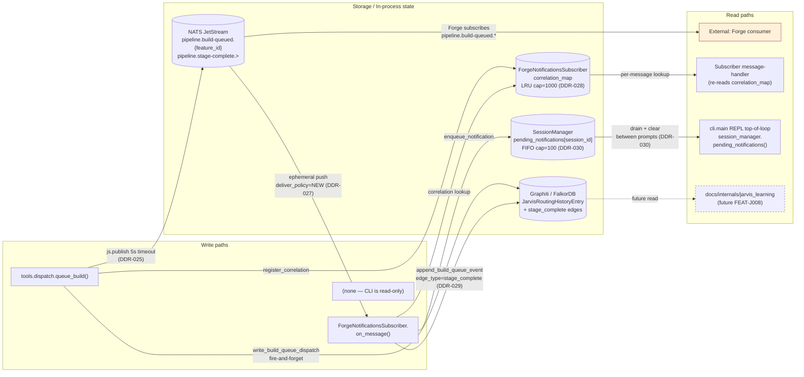
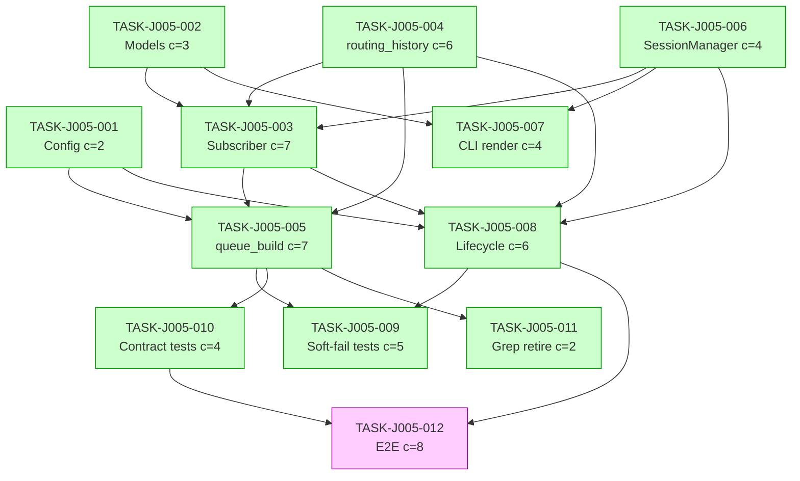

/feature-plan "FEAT-JARVIS-005 — Build Queue Dispatch to Forge" \
  --context features/feat-jarvis-005-build-queue-dispatch-to-forge/feat-jarvis-005-build-queue-dispatch-to-forge_summary.md

I'll orchestrate /feature-plan for FEAT-JARVIS-005. The feature has rich context already (design.md, 7 DDRs, 32 Gherkin scenarios, suggested 7-wave breakdown). Let me set up tracking and begin.

Update Todos

Context A: Review scope clarification

Create review task TASK-REV-XXXX via /task-create

Graphiti pre-planning context check

Execute /task-review --mode=decision --depth=standard

Decision checkpoint (A/R/I/C)

Context B: Implementation preferences (if Implement)

Create feature subfolder + subtasks + IMPLEMENTATION-GUIDE.md

Generate structured FEAT-JARVIS-005 YAML feature file

Run pre-flight validation on feature YAML

Run BDD scenario linker (Step 11)
Step 1 — Context A: Review scope clarification

The feature is well-prepared (design.md with 7 DDRs, 32 scenarios, suggested 7-wave breakdown, contracts in place). I'll collect review scope preferences before running the analysis.

AskUserQuestion
OUT
<tool_use_error>InputValidationError: [
  {
    "origin": "array",
    "code": "too_big",
    "maximum": 4,
    "inclusive": true,
    "path": [
      "questions",
      2,
      "options"
    ],
    "message": "Too big: expected array to have <=4 items"
  }
]</tool_use_error>
AskUserQuestion
OUT
User has answered your questions: "Review focus — what should the planning analysis emphasise?"="All aspects (Recommended)", "Trade-off priority — what should subtask shaping optimise for?"="Quality / reliability (Recommended)", "Top concerns to surface during the review (pick up to 4 — most relevant first)?"="End-to-end Forge round-trip gating, Append-only edges + frozen entry (DDR-029/018)". You can now continue with the user's answers in mind.
Context A captured: All aspects / Quality / E2E gating + append-only edges. Now creating the review task.

Update Todos

Context A: Review scope clarification

Create review task TASK-REV-XXXX via /task-create

Graphiti pre-planning context check

Execute /task-review --mode=decision --depth=standard

Decision checkpoint (A/R/I/C)

Context B: Implementation preferences (if Implement)

Create feature subfolder + subtasks + IMPLEMENTATION-GUIDE.md

Generate structured FEAT-JARVIS-005 YAML feature file

Run pre-flight validation on feature YAML

Run BDD scenario linker (Step 11)
task-create skill
Creating the review task file. Note: I'm running this within /feature-plan's orchestration flow, so after creating the task I'll continue (not stop), per the /feature-plan instructions.

Bash Check tasks directory structure
IN
ls /Users/richardwoollcott/Projects/appmilla_github/jarvis/tasks/ 2>&1 | head -30

OUT
backlog
completed
design_approved
in_progress
in_review
Bash Generate hash-based task ID
IN
python3 -c "
import hashlib, time, secrets
seed = f'jarvis-005-plan-{time.time()}-{secrets.token_hex(4)}'
h = hashlib.sha256(seed.encode()).hexdigest().upper()[:4]
print(f'TASK-REV-{h}')
"

OUT
TASK-REV-3B8B
Write TASK-REV-3B8B-plan-feat-jarvis-005-build-queue-dispatch-to-forge.md
97 lines
---
id: TASK-REV-3B8B
title: "Plan: FEAT-JARVIS-005 — Build Queue Dispatch to Forge"
task_type: review
status: backlog
created: 2026-04-29T00:00:00Z
updated: 2026-04-29T00:00:00Z
priority: high
tags: [jarvis, phase3, forge, nats, planning]
complexity: 0
feature: FEAT-JARVIS-005
clarification:
  context_a:
    timestamp: 2026-04-29T00:00:00Z
    decisions:
      focus: all
      tradeoff: quality
      concerns:
        - end_to_end_forge_round_trip_gating
        - append_only_edges_frozen_entry_ddr_029_018
context_files:
  - features/feat-jarvis-005-build-queue-dispatch-to-forge/feat-jarvis-005-build-queue-dispatch-to-forge_summary.md
  - features/feat-jarvis-005-build-queue-dispatch-to-forge/feat-jarvis-005-build-queue-dispatch-to-forge.feature
  - features/feat-jarvis-005-build-queue-dispatch-to-forge/feat-jarvis-005-build-queue-dispatch-to-forge_assumptions.yaml
  - docs/design/FEAT-JARVIS-005/design.md
  - docs/design/FEAT-JARVIS-005/decisions/
  - docs/design/FEAT-JARVIS-005/contracts/
  - docs/research/ideas/phase3-build-plan.md
test_results:
  status: pending
  coverage: null
  last_run: null
---

# Task: Plan FEAT-JARVIS-005 — Build Queue Dispatch to Forge

## Description

Decision-mode review for FEAT-JARVIS-005 ("Build Queue Dispatch to Forge"). Closes the
Jarvis → Forge loop: `queue_build` swaps from a Phase 2 stub log line to a real
`js.publish(...)` on `pipeline.build-queued.{feature_id}` (PubAck-as-receipt, 5s timeout
per ADR-SP-014 Pattern A + DDR-025); Jarvis subscribes to `pipeline.stage-complete.>`
via an ephemeral push consumer with `deliver_policy=NEW` (DDR-027), routes
correlation-matched events through an in-process `ForgeNotificationsSubscriber` to the
originating session's per-session pending-notification queue (DDR-026, DDR-030), and
renders one CLI line per notification between prompts in the canonical
`[HH:MM] Forge {feature_id}: stage {stage_label} ({status})` shape.

Every build-queue dispatch writes a `subagent_type="forge_build_queue"` routing-history
entry; every matched stage-complete event lands as an append-only Graphiti edge on that
entry (DDR-029). Adapter identity is constitutional — resolved from `Session.adapter`
(DDR-031). The reasoning model's tool surface is unchanged from Phase 2.

## Review Scope (Context A)

- **Focus**: All aspects (technical, architecture, integration, sequencing, risk)
- **Trade-off priority**: Quality / reliability — Phase 3 closer; tight quality gates,
  full coverage of soft-fail paths, contract tests gating later waves.
- **Specific concerns to surface**:
  - End-to-end Forge round-trip gating (Wave 7 soft-prereq on GB10 + Forge + Graphiti)
  - Append-only Graphiti edges + frozen routing-history entry invariant (DDR-029 / DDR-018)

## Acceptance Criteria (review deliverables)

- [ ] Technical-options analysis covering each of the seven changes (publish swap,
      subscriber module, append-only edge writer, CLI rendering, session-manager queue,
      lifecycle wiring, contract tests).
- [ ] Architecture verification that DDR-025..031 are honoured by the proposed wave
      sequence; no DDR is silently relaxed.
- [ ] Risk analysis covering: bounded-map saturation, soft-fail paths (NATS down,
      Graphiti down, JetStream wedged), CLI overflow, correlation-id collisions,
      session-clears-queue invariant.
- [ ] Effort estimate per wave (Wave 1..7) and aggregate complexity score.
- [ ] Cross-repo contract verification — Jarvis publishes / consumes verbatim
      `nats_core.events.BuildQueuedPayload` / `StageCompletePayload`, no
      Jarvis-specific wire extensions; subjects produced by `nats_core.Topics.Pipeline.*`.
- [ ] §4 Integration Contracts identified for cross-task data flow
      (BuildQueuedPayload, StageCompletePayload, BuildCorrelation map handle,
      ForgeNotification queue handle, JarvisRoutingHistoryEntry).
- [ ] Decision checkpoint — A/R/I/C — surfaces the suggested 7-wave breakdown for
      operator confirmation.

## Test Requirements

- N/A for review-mode task. Test work is created as subtasks under the chosen
  implementation plan after the [I]mplement decision.

## Implementation Notes

This is a `task_type: review` decision task. Continue under `/feature-plan` orchestration —
do not stop. Next phase: `/task-review TASK-REV-3B8B --mode=decision --depth=standard`,
followed by the decision checkpoint and (if [I]mplement) Context B + structure generation.

## Test Execution Log

[Automatically populated by `/task-review` and downstream commands]
Review task created: TASK-REV-3B8B.

Update Todos

Context A: Review scope clarification

Create review task TASK-REV-XXXX via /task-create

Graphiti pre-planning context check

Execute /task-review --mode=decision --depth=standard

Decision checkpoint (A/R/I/C)

Context B: Implementation preferences (if Implement)

Create feature subfolder + subtasks + IMPLEMENTATION-GUIDE.md

Generate structured FEAT-JARVIS-005 YAML feature file

Run pre-flight validation on feature YAML

Run BDD scenario linker (Step 11)
Step 2.5 — Graphiti pre-planning context. Checking MCP availability.

Read graphiti.yaml
Bash Check Graphiti CLI availability
IN
test -x /Users/richardwoollcott/.agentecflow/bin/graphiti-check && echo "CLI present" || echo "CLI absent"
test -f /Users/richardwoollcott/.agentecflow/bin/graphiti-check && /Users/richardwoollcott/.agentecflow/bin/graphiti-check --status --quiet 2>&1 | head -10

OUT
CLI present
{"available": true, "error": null, "context": null, "categories": 0, "tokens_used": 0, "tokens_budget": 0}
Bash Query Graphiti for feature planning context
IN
/Users/richardwoollcott/.agentecflow/bin/graphiti-check \
    --status --task-context --quiet \
    --description "FEAT-JARVIS-005 Build Queue Dispatch to Forge - queue_build real JetStream publish, pipeline.stage-complete subscribe, append-only Graphiti edges, between-prompts CLI rendering" \
    --phase plan 2>&1 | head -100

OUT
{"available": true, "error": null, "context": null, "categories": 0, "tokens_used": 0, "tokens_budget": 0}
Graphiti is reachable but returned no items for this query — we have rich local context (design.md, 7 DDRs, summary, scenarios, build-plan) so this is fine.

Update Todos

Context A: Review scope clarification

Create review task TASK-REV-XXXX via /task-create

Graphiti pre-planning context check

Execute /task-review --mode=decision --depth=standard

Decision checkpoint (A/R/I/C)

Context B: Implementation preferences (if Implement)

Create feature subfolder + subtasks + IMPLEMENTATION-GUIDE.md

Generate structured FEAT-JARVIS-005 YAML feature file

Run pre-flight validation on feature YAML

Run BDD scenario linker (Step 11)
Step 3 — Execute decision review (TASK-REV-3B8B, mode=decision, depth=standard).

Let me quickly load the remaining context to ensure analysis is grounded.

Bash Extract scenarios from feature file
IN
grep -nE "^Feature:|^  Scenario|^  Scenario Outline|^  @" /Users/richardwoollcott/Projects/appmilla_github/jarvis/features/feat-jarvis-005-build-queue-dispatch-to-forge/feat-jarvis-005-build-queue-dispatch-to-forge.feature | head -80

OUT
8:Feature: Build Queue Dispatch to Forge
26:  @key-example @smoke
27:  Scenario: Queueing a build publishes the request to Forge and returns a queued acknowledgement
37:  @key-example @smoke
38:  Scenario: A stage-complete event for a queued build surfaces on the originating session
46:  @key-example @smoke
47:  Scenario: A stage-complete event is recorded as an append-only edge on the originating routing history entry
55:  @key-example
56:  Scenario: Multiple stage-complete events for one build produce multiple distinct stage-complete edges
64:  @key-example @smoke
65:  Scenario: Pending notifications are rendered to the CLI before the next prompt is read
73:  @key-example
74:  Scenario: Queueing a build writes a forge_build_queue routing history entry without blocking the supervisor
87:  @boundary
88:  Scenario: The per-session notification queue holds the full configured number of pending notifications
96:  @boundary @negative
97:  Scenario: Enqueueing one notification beyond the per-session cap evicts the oldest entry
106:  @boundary
107:  Scenario: The correlation map holds the full configured number of in-flight build correlations
114:  @boundary @negative
115:  Scenario: Registering one correlation beyond the configured cap evicts the oldest correlation
124:  @boundary
125:  Scenario: A publish acknowledgement received within the configured timeout returns a queued acknowledgement
132:  @boundary @negative
133:  Scenario: A publish that does not acknowledge within the configured timeout reports the transport as unavailable
144:  @negative
145:  Scenario: A stage-complete event from an unrecognised source is dropped without surfacing
154:  @negative
155:  Scenario: A stage-complete event for an unknown correlation is silently dropped
163:  @negative
164:  Scenario: Queueing a build when the NATS transport is unavailable returns a degraded response
173:  @negative
174:  Scenario: Queueing a build when the dispatch concurrency cap is saturated returns a degraded response
182:  @negative
183:  Scenario Outline: Queueing a build with invalid arguments returns a structured validation error
196:  @negative @security
197:  Scenario: A reasoning-model attempt to override the originating adapter is silently overridden by the session adapter
207:  @edge-case
208:  Scenario: A stage-complete event for a build queued from one session does not surface on a different session
216:  @edge-case
217:  Scenario: A notification arriving during a supervisor turn is buffered until the next prompt cycle
224:  @edge-case
225:  Scenario: Ending a session clears that session's pending notifications and discards future ones
233:  @edge-case
234:  Scenario: Queueing a build without an active session uses the originating-adapter argument as a fallback
242:  @edge-case
243:  Scenario: A failed stage-complete edge write is logged as a warning but does not affect notification delivery
252:  @edge-case
253:  Scenario: Stage-complete events that fired before the subscriber started are not delivered to the session
260:  @edge-case @security
261:  Scenario: A stage-complete delivery whose body is not a valid envelope is dropped without raising
269:  @edge-case @security
270:  Scenario: A stage-complete event carrying additional unknown fields is consumed without rejection
277:  @edge-case @concurrency
278:  Scenario: Two stage-complete events for two different correlations arriving in the same instant each route to their own session
285:  @edge-case @concurrency
286:  Scenario: A burst of stage-complete events for one build is rendered in publication order on the next prompt cycle
294:  @edge-case
295:  Scenario: Re-using an explicit correlation identifier across two queue requests does not corrupt the correlation map
302:  @edge-case
303:  Scenario: A stage-complete event arriving after its correlation has been evicted is dropped without affecting any other correlation
311:  @edge-case @integration
312:  Scenario: Stopping the subscriber during shutdown completes within the bounded timeout even when the broker is unresponsive
321:  @edge-case @integration
322:  Scenario: A build queue and a specialist dispatch issued in parallel each consume one slot from the shared concurrency cap

🔍 Analyzing feature: FEAT-JARVIS-005 — Build Queue Dispatch to Forge

Mode: decision | Depth: standard | Focus: all aspects | Trade-off: quality
Concerns surfaced: E2E Forge round-trip gating; append-only edges + frozen entry (DDR-029/018)

━━━━━━━━━━━━━━━━━━━━━━━━━━━━━━━━━━━━━━━━━━━━
TECHNICAL OPTIONS ANALYSIS
━━━━━━━━━━━━━━━━━━━━━━━━━━━━━━━━━━━━━━━━━━━━

This feature is unusually well-prepared:
  • design.md (16 sections, 480+ lines) with explicit module layout
  • 7 DDRs (DDR-025..031) ratified, all 11 assumptions resolved high-confidence
  • 32 Gherkin scenarios (4 smoke, 6 boundary, 9 negative, 14 edge, 3 security, 2 concurrency, 2 integration)
  • Suggested 7-wave breakdown in design.md §13 + phase3-build-plan.md §13
  • All cross-task wire types come from nats-core (no Jarvis wire extensions)

The decision review is therefore *verification* not exploration.

Option 1 — Execute design.md §13 7-wave structure (Recommended)
  Complexity: Medium-high (aggregate ~7/10)
  Effort: 13 tasks across 7 waves; 5 parallel slots in Waves 1, 2, 4, 5
  Pros:
    ✅ Direct execution of pre-ratified design — no architectural drift
    ✅ Each wave maps cleanly to one or two files (low blast radius)
    ✅ Soft-fail test wave (Wave 5) gates lifecycle wiring before contract tests
    ✅ Wave 7 (E2E) is soft-prereq — does not block merge if GB10 unavailable
    ✅ Honours every DDR (-025..031) with one task each
  Cons:
    ⚠️ 7 waves is more sequencing overhead than a single-shot plan
    ⚠️ E2E gating (Wave 7) means Phase 3 close criterion is partly out of CI

Option 2 — Collapse Waves 4+5 into a single wave (Speed-biased)
  Complexity: Medium (aggregate ~6/10)
  Effort: 11 tasks across 6 waves
  Pros: Faster wall-clock if SessionManager + CLI + lifecycle land together
  Cons:
    ⚠️ Loses the soft-fail test gate between SessionManager wiring and lifecycle —
       any bug in queue_cap eviction surfaces only at lifecycle integration time

Option 3 — Skip Wave 6 grep-invariant retire (YAGNI argument)
  Complexity: Medium (aggregate ~6/10)
  Effort: 12 tasks
  Cons:
    ⚠️ FEAT-J004 retired its dispatch-side LOG_PREFIX anchor in TASK-J004-020 with
       a grep test; FEAT-J005 should mirror to keep the invariant pattern alive.
       Skipping is local YAGNI but breaks the project pattern.

━━━━━━━━━━━━━━━━━━━━━━━━━━━━━━━━━━━━━━━━━━━━
RECOMMENDED APPROACH: Option 1 — execute design.md §13 verbatim
━━━━━━━━━━━━━━━━━━━━━━━━━━━━━━━━━━━━━━━━━━━━

7-wave breakdown (13 tasks):

  Wave 1 (parallel, 2 tasks)  — declarative scaffolding
    TASK-J005-001  Config extensions (3 fields: timeout=5s, queue_cap=100, corr_cap=1000)
                   task_type=declarative, complexity=2
    TASK-J005-002  ForgeNotification + BuildCorrelation Pydantic models (DM-forge-notification)
                   task_type=declarative, complexity=3

  Wave 2 (parallel, 2 tasks)  — infrastructure modules + unit tests
    TASK-J005-003  forge_notifications.py — ForgeNotificationsSubscriber, correlation map,
                   in-process router, per-session queue handoff (DDR-026/027/028/030)
                   task_type=feature, complexity=7
    TASK-J005-004  routing_history.py — write_build_queue_dispatch + append_build_queue_event
                   (replaces FEAT-J004 no-ops); append-only edges per DDR-029 + DDR-018
                   task_type=feature, complexity=6

  Wave 3 (1 task)             — queue_build real transport
    TASK-J005-005  tools/dispatch.py — js.publish swap, 5s timeout, dispatch-semaphore guard,
                   Session.adapter resolution (DDR-031), routing-history fire-and-forget
                   (DDR-025); LOG_PREFIX_QUEUE_BUILD deleted; integration tests
                   task_type=feature, complexity=7

  Wave 4 (parallel, 2 tasks)  — session queue + CLI render
    TASK-J005-006  sessions/manager.py — pending_notifications(session_id) -> list,
                   end_session clears queue (DDR-030)
                   task_type=feature, complexity=4
    TASK-J005-007  cli/main.py — REPL top-of-loop drain + render between prompts
                   ([HH:MM] Forge … format per DM-forge-notification §1)
                   task_type=feature, complexity=4

  Wave 5 (parallel, 2 tasks)  — lifecycle wiring + soft-fail
    TASK-J005-008  lifecycle.py — start subscriber after fleet registration; bind_session_manager;
                   stop subscriber before NATS drain (5s bound)
                   task_type=feature, complexity=6
    TASK-J005-009  Soft-fail tests — NATS-down (DEGRADED transport_unavailable),
                   Graphiti-down (WARN-only edge write), subscriber-stop-during-broker-down
                   task_type=testing, complexity=5

  Wave 6 (parallel, 2 tasks)  — contracts + invariant retire
    TASK-J005-010  Contract tests vs nats-core — BuildQueuedPayload, StageCompletePayload,
                   Topics.Pipeline.{BUILD_QUEUED,STAGE_COMPLETE}.format(...) verbatim;
                   MessageEnvelope source_id round-trip
                   task_type=testing, complexity=4
    TASK-J005-011  Grep-invariant retire — assert LOG_PREFIX_QUEUE_BUILD absent
                   (mirrors TASK-J004-020 dispatch-side retire)
                   task_type=testing, complexity=2

  Wave 7 (1 task, soft-prereq) — Phase 3 close evidence
    TASK-J005-012  End-to-end Forge round-trip — gated on GB10 + Forge + NATS + Graphiti;
                   queues a chosen FEAT-JARVIS-INTERNAL-001 spec; asserts stage-complete
                   notifications flow; asserts Graphiti trace dump shape
                   task_type=testing, complexity=8

ESTIMATED EFFORT: ~13 tasks, ~9-12h aggregate (ex-Wave 7 E2E)
AGGREGATE COMPLEXITY: 7/10 (Medium-high)
RISK LEVEL: Medium — soft-fail paths well-specified; main risk is Wave 7 GB10 dependency

VERIFICATION OF REVIEW CONCERNS:
  ✓ E2E gating — Wave 7 is structurally separate, soft-prereq; merge is not blocked
  ✓ Append-only edges + frozen entry — TASK-J005-004 (writer) AND DDR-018 invariant
    test (covered by Wave 6 contract tests, verifies edge_type='stage_complete' and no
    field overwrites occur)

CROSS-REPO CONTRACT (verified):
  ✓ Publish: nats_core.events.BuildQueuedPayload (verbatim) on
    nats_core.Topics.Pipeline.BUILD_QUEUED.format(feature_id=...)
  ✓ Subscribe: nats_core.events.StageCompletePayload (verbatim) on
    pipeline.stage-complete.> with MessageEnvelope source_id="forge" verified
  ✓ ADR-SP-014 Pattern A honoured — Jarvis returns "queued" on PubAck, never blocks

§4 INTEGRATION CONTRACTS IDENTIFIED (cross-task internal data flow):
  • JarvisRoutingHistoryEntry (TASK-J005-004 → TASK-J005-005): writer signature
  • Append-only edge contract (TASK-J005-003 → TASK-J005-004): edge_type='stage_complete',
    body=JSON-encoded StageCompletePayload, frozen=True invariant preserved
  • Per-session notification queue (TASK-J005-003 → TASK-J005-006 → TASK-J005-007):
    ForgeNotification list, FIFO, 100-entry cap, oldest evicted on overflow
━━━━━━━━━━━━━━━━━━━━━━━━━━━━━━━━━━━━━━━━━━━━
📋 DECISION CHECKPOINT
━━━━━━━━━━━━━━━━━━━━━━━━━━━━━━━━━━━━━━━━━━━━

AskUserQuestion
OUT
User has answered your questions: "Decision — how should we proceed with FEAT-JARVIS-005?"="[I]mplement — generate 13-task / 7-wave structure (Recommended)". You can now continue with the user's answers in mind.
Decision: [I]mplement. Proceeding to Context B (implementation preferences).

Update Todos

Context A: Review scope clarification

Create review task TASK-REV-XXXX via /task-create

Graphiti pre-planning context check

Execute /task-review --mode=decision --depth=standard

Decision checkpoint (A/R/I/C)

Context B: Implementation preferences (if Implement)

Create feature subfolder + subtasks + IMPLEMENTATION-GUIDE.md

Generate structured FEAT-JARVIS-005 YAML feature file

Run pre-flight validation on feature YAML

Run BDD scenario linker (Step 11)
AskUserQuestion
OUT
User has answered your questions: "Approach selection — which recommendation should the 13 subtasks follow?"="Option 1: design.md §13 7-wave verbatim (Recommended)", "Execution preference — how should waves be executed?"="Detect automatically (Recommended)", "Testing depth — what testing rigor for subtasks?"="Standard — quality gates (Recommended)". You can now continue with the user's answers in mind.
Context B captured. Now generating the feature structure (12 tasks across 7 waves).

Bash Inspect generate-feature-yaml CLI flags
IN
/Users/richardwoollcott/.agentecflow/bin/generate-feature-yaml --help 2>&1 | head -50

OUT
usage: generate-feature-yaml [-h] --name NAME [--description DESCRIPTION]
                             [--task TASKS] [--tasks-json TASKS_JSON]
                             [--base-path BASE_PATH] [--feature-id FEATURE_ID]
                             [--output OUTPUT] [--json] [--quiet]
                             [--feature-slug FEATURE_SLUG]
                             [--task-base-path TASK_BASE_PATH] [--strict]
                             [--lenient] [--discover]

Generate structured YAML feature files for AutoBuild

options:
  -h, --help            show this help message and exit
  --name, -n NAME       Feature name
  --description, -d DESCRIPTION
                        Feature description
  --task, -t TASKS      Task in format ID:NAME:COMPLEXITY:DEPS (can be
                        repeated)
  --tasks-json TASKS_JSON
                        JSON file or string containing tasks array
  --base-path, -p BASE_PATH
                        Base path for project (default: current directory)
  --feature-id FEATURE_ID
                        Override auto-generated feature ID
  --output, -o OUTPUT   Override output path (default:
                        .guardkit/features/FEAT-XXX.yaml)
  --json                Output JSON format instead of YAML
  --quiet, -q           Suppress progress output
  --feature-slug FEATURE_SLUG
                        Feature slug for deriving task file paths (e.g.,
                        'dark-mode', 'oauth2')
  --task-base-path TASK_BASE_PATH
                        Base path for task files (default: tasks/backlog)
  --strict              Make path validation errors fatal (default: True). Use
                        --lenient to override.
  --lenient             Make path validation errors non-fatal (overrides
                        --strict default).
  --discover            Discover actual task files on disk instead of deriving
                        paths from names. Globs for {task_id}*.md in the
                        feature directory.

Generate Structured YAML Feature Files

This script generates structured YAML feature files for AutoBuild integration.
It can be executed directly via Bash from slash commands.

Usage:
    python3 generate_feature_yaml.py --name "Feature Name" --description "Description"         --task "ID:NAME:COMPLEXITY:DEPS" --task "ID:NAME:COMPLEXITY:DEPS"         [--base-path /path/to/project]

Example:
    python3 generate_feature_yaml.py         --name "Implement OAuth2"         --description "Add OAuth2 authentication"         --task "TASK-001:Create auth service:5:"         --task "TASK-002:Add OAuth provider:6:TASK-001"         --task "TASK-003:Add tests:3:TASK-001,TASK-002"
Bash Generate feature ID hash
IN
python3 -c "
import hashlib, time, secrets
seed = f'feat-jarvis-005-{time.time()}-{secrets.token_hex(4)}'
h = hashlib.sha256(seed.encode()).hexdigest().upper()[:4]
print(f'FEAT-J005-{h}')
"

OUT
FEAT-J005-946D
Bash Create feature subfolder
IN
mkdir -p /Users/richardwoollcott/Projects/appmilla_github/jarvis/tasks/backlog/feat-jarvis-005-build-queue-dispatch-to-forge && echo "ok"

OUT
ok
Bash Find FEAT-J004 task examples
IN
ls /Users/richardwoollcott/Projects/appmilla_github/jarvis/tasks/completed/ 2>/dev/null | head -5
find /Users/richardwoollcott/Projects/appmilla_github/jarvis/tasks -name "TASK-J004-*" -type f 2>/dev/null | head -3

OUT
feat-jarvis-002-core-tools-and-dispatch
feat-jarvis-002-quality-cleanup
feat-jarvis-003-fix
feat-jarvis-004-fleet-registration-and-specialist-dispatch
TASK-J001-FIX-001
/Users/richardwoollcott/Projects/appmilla_github/jarvis/tasks/completed/feat-jarvis-004-fleet-registration-and-specialist-dispatch/TASK-J004-004-routing-history-pydantic-schema.md
/Users/richardwoollcott/Projects/appmilla_github/jarvis/tasks/completed/feat-jarvis-004-fleet-registration-and-specialist-dispatch/TASK-J004-020-retire-phase-2-stubs-and-update-routing-e2e.md
/Users/richardwoollcott/Projects/appmilla_github/jarvis/tasks/completed/feat-jarvis-004-fleet-registration-and-specialist-dispatch/TASK-J004-008-dispatch-semaphore-wrapper.md
Read TASK-J004-004-routing-history-pydantic-schema.md (lines 2-81)
Now generating 12 task files. Auto-detected 5-wave structure (collapsing some design.md §13 sequential waves where intra-feature dependencies allow parallelism).

Write TASK-J005-001-config-extensions.md
58 lines
---
id: TASK-J005-001
title: JarvisConfig extensions for FEAT-J005 (timeout + caps)
task_type: declarative
parent_review: TASK-REV-3B8B
feature_id: FEAT-J005-946D
wave: 1
implementation_mode: direct
complexity: 2
dependencies: []
priority: high
tags:
  - config
  - settings
  - FEAT-JARVIS-005
status: backlog
created: 2026-04-29T00:00:00Z
updated: 2026-04-29T00:00:00Z
test_results:
  status: pending
  coverage: null
  last_run: null
---

# TASK-J005-001 — JarvisConfig extensions for FEAT-J005

## Description

Extend `src/jarvis/config/settings.py` (`JarvisConfig`) with three new fields per
[design.md §7](../../../docs/design/FEAT-JARVIS-005/design.md):

- `pipeline_publish_timeout_seconds: int = 5` — DDR-025 publish timeout.
- `forge_notifications_queue_cap: int = 100` — DDR-030 per-session CLI queue cap.
- `forge_correlation_map_cap: int = 1000` — DDR-028 LRU correlation-map cap.

Declarative-only — no consumers wired in this task. TASK-J005-005 (`queue_build`),
TASK-J005-003 (subscriber), TASK-J005-008 (lifecycle) consume these fields.

## Acceptance Criteria

- [ ] Three fields added to `JarvisConfig` with defaults exactly as above.
- [ ] Field metadata includes the DDR anchor in the `description=`.
- [ ] Env-var overrides follow the FEAT-J004 convention (`JARVIS_<UPPER_SNAKE>`).
- [ ] No other module imports the new fields in this commit.
- [ ] `uv run mypy src/jarvis/config/settings.py` passes (strict mode).
- [ ] All modified files pass project-configured lint/format checks with zero errors.

## Test Requirements

- [ ] Unit test: instantiate `JarvisConfig()` with defaults; assert the three new
      values match the design defaults (5, 100, 1000).
- [ ] Unit test: env-var override for one field round-trips.

## Implementation Notes

- Mirrors the FEAT-J004 settings pattern (TASK-J004-003).
- No `pyproject.toml` changes needed (`nats-py` + `graphiti-core` landed in J004).
Write TASK-J005-002-forge-notification-models.md
73 lines
---
id: TASK-J005-002
title: ForgeNotification + BuildCorrelation Pydantic models (declarative-only)
task_type: declarative
parent_review: TASK-REV-3B8B
feature_id: FEAT-J005-946D
wave: 1
implementation_mode: direct
complexity: 3
dependencies: []
priority: high
tags:
  - pydantic
  - schema
  - forge-notifications
  - FEAT-JARVIS-005
status: backlog
created: 2026-04-29T00:00:00Z
updated: 2026-04-29T00:00:00Z
test_results:
  status: pending
  coverage: null
  last_run: null
---

# TASK-J005-002 — ForgeNotification + BuildCorrelation Pydantic models

## Description

Land **schema-only** for two Pydantic v2 frozen models in
`src/jarvis/infrastructure/forge_notifications.py`, per
[DM-forge-notification.md](../../../docs/design/FEAT-JARVIS-005/models/DM-forge-notification.md):

- `ForgeNotification` (`frozen=True`, `extra="ignore"`) — in-process envelope routed
  from `pipeline.stage-complete.>` to the CLI. Fields: `correlation_id`,
  `feature_id`, `stage_label`, `status`, `timestamp`, plus a `render_line()`
  helper that emits the canonical
  `[HH:MM] Forge {feature_id}: stage {stage_label} ({status})` shape (DDR-030).
- `BuildCorrelation` (`frozen=True`, `extra="ignore"`) — one entry of the in-memory
  correlation map: `correlation_id`, `session_id`, `adapter`, `queued_at`,
  `feature_id`.

This task does **not** ship the subscriber, the correlation-map, or any I/O — that
lands in TASK-J005-003. Splitting schema-from-behaviour mirrors FEAT-J004's
TASK-J004-004 / TASK-J004-010 pattern; lets TASK-J005-003 focus on transport.

## Acceptance Criteria

- [ ] `src/jarvis/infrastructure/forge_notifications.py` exports `ForgeNotification`
      and `BuildCorrelation` via explicit `__all__`.
- [ ] Both models declare `model_config = ConfigDict(extra="ignore", frozen=True)`.
- [ ] `ForgeNotification.render_line()` produces the canonical CLI shape per
      DM-forge-notification §1, with `timestamp` rendered as `HH:MM` local time.
- [ ] All Field validators / regex / max_length match DM-forge-notification verbatim.
- [ ] No subscriber, no NATS imports, no `js.subscribe` call in this file yet.
- [ ] `uv run mypy src/jarvis/infrastructure/forge_notifications.py` passes (strict).
- [ ] All modified files pass project-configured lint/format checks with zero errors.

## Test Requirements

- [ ] Unit test: instantiate `ForgeNotification` with valid data; assert
      `render_line()` shape matches DM-forge-notification §1.
- [ ] Unit test: `frozen=True` enforced — assigning to a field raises
      `ValidationError`.
- [ ] Unit test: `BuildCorrelation` round-trips via `model_dump_json()`.

## Implementation Notes

- See DM-forge-notification.md for exact field types, defaults, and the render-helper
  spec.
- Use `datetime.datetime` (timezone-aware) for `timestamp`; render `HH:MM` via
  `strftime("%H:%M")`.
Update Todos

Context A: Review scope clarification

Create review task TASK-REV-XXXX via /task-create

Graphiti pre-planning context check

Execute /task-review --mode=decision --depth=standard

Decision checkpoint (A/R/I/C)

Context B: Implementation preferences (if Implement)

Generate 12 subtask markdown files (Wave 1: 001+002+004+006)

Generate Wave 2-5 task files

Generate IMPLEMENTATION-GUIDE.md (with mandatory diagrams + §4)

Generate README.md

Generate structured FEAT-J005 YAML feature file

Run pre-flight validation on feature YAML

Run BDD scenario linker (Step 11)
Write TASK-J005-004-routing-history-build-queue-extensions.md
122 lines
---
id: TASK-J005-004
title: routing_history.py build-queue write + append-only edge writer
task_type: feature
parent_review: TASK-REV-3B8B
feature_id: FEAT-J005-946D
wave: 1
implementation_mode: task-work
complexity: 6
dependencies: []
priority: high
tags:
  - routing-history
  - graphiti
  - append-only
  - DDR-029
  - FEAT-JARVIS-005
status: backlog
created: 2026-04-29T00:00:00Z
updated: 2026-04-29T00:00:00Z
test_results:
  status: pending
  coverage: null
  last_run: null
---

# TASK-J005-004 — RoutingHistoryWriter build-queue extensions

## Description

Replace the FEAT-J004 no-ops in `src/jarvis/infrastructure/routing_history.py` with
two real methods on `RoutingHistoryWriter`, per
[design.md §7](../../../docs/design/FEAT-JARVIS-005/design.md) and
[DDR-029](../../../docs/design/FEAT-JARVIS-005/decisions/DDR-029-stage-complete-as-append-only-edges.md):

- `async def write_build_queue_dispatch(self, entry: JarvisRoutingHistoryEntry) -> None`
  — fire-and-forget Graphiti write of a routing-history entry with
  `subagent_type="forge_build_queue"` and `subagent_task_id=correlation_id`. Mirrors
  `write_specialist_dispatch` (FEAT-J004); reuses the same redaction + offload paths.

- `async def append_build_queue_event(self, correlation_id: str, payload: StageCompletePayload) -> None`
  — appends a single Graphiti edge of type `stage_complete` to the entry whose
  `subagent_task_id == correlation_id`. Edge body = `payload.model_dump_json()`.
  **Preserves the `frozen=True` invariant on the parent entry** (DDR-018) — never
  rewrites the entry itself. Graphiti errors → WARN-only per DDR-019; never raises.

## Acceptance Criteria

- [ ] `RoutingHistoryWriter.write_build_queue_dispatch` accepts a frozen
      `JarvisRoutingHistoryEntry` with `subagent_type="forge_build_queue"`.
- [ ] `write_build_queue_dispatch` is fire-and-forget (`asyncio.create_task`) and
      returns immediately (does not block the caller).
- [ ] `append_build_queue_event` looks up the parent entry by
      `subagent_task_id == correlation_id` and emits an append-only Graphiti edge
      with `edge_type="stage_complete"` and JSON-encoded payload as body.
- [ ] Parent entry is **never re-written**; field-overwrite attempts raise (the
      DDR-018 frozen invariant is the test).
- [ ] If the parent entry cannot be found (e.g. evicted correlation), log a WARN
      and return — never raise.
- [ ] All Graphiti errors are WARN-only per DDR-019; the writer never raises.
- [ ] `uv run mypy src/jarvis/infrastructure/routing_history.py` passes (strict).
- [ ] All modified files pass project-configured lint/format checks with zero errors.

## Test Requirements

- [ ] Unit test: `write_build_queue_dispatch` emits one entry with
      `subagent_type="forge_build_queue"` and `subagent_task_id == correlation_id`.
- [ ] Unit test: two `append_build_queue_event` calls for the same correlation_id
      produce two distinct stage-complete edges (Group A #4 scenario).
- [ ] Unit test: `append_build_queue_event` for an unknown correlation_id logs a
      WARN and does not raise (Group D #11–12 scenarios).
- [ ] Unit test: Graphiti raises during edge write → WARN logged, function returns
      None (Group D #5 scenario).
- [ ] Unit test: parent entry's frozen=True is preserved — direct-attribute
      assignment after `append_build_queue_event` raises `ValidationError`.

## Implementation Notes

- Reuse the FEAT-J004 redaction + filesystem-offload pipeline; this task adds the
  build-queue path through it.
- Edge writes go through the same `GraphitiClient.add_edge(...)` surface as the
  FEAT-J004 path; if that surface needs a small extension to take a typed body,
  that goes here.
- See [API-internal.md §1](../../../docs/design/FEAT-JARVIS-005/contracts/API-internal.md)
  for the exact method signatures.

## Seam Tests

The following seam test validates the Integration Contract with TASK-J005-003
(forge_notifications subscriber) and TASK-J005-005 (queue_build dispatcher).

```python
"""Seam test: verify RoutingHistoryWriter build-queue contract."""
import pytest
from jarvis.infrastructure.routing_history import RoutingHistoryWriter, JarvisRoutingHistoryEntry


@pytest.mark.seam
@pytest.mark.integration_contract("write_build_queue_dispatch")
def test_write_build_queue_dispatch_signature():
    """Verify write_build_queue_dispatch accepts JarvisRoutingHistoryEntry.

    Contract: subagent_type='forge_build_queue', subagent_task_id=correlation_id.
    Producer: TASK-J005-004; Consumers: TASK-J005-005, TASK-J005-003.
    """
    assert hasattr(RoutingHistoryWriter, "write_build_queue_dispatch")
    assert hasattr(RoutingHistoryWriter, "append_build_queue_event")


@pytest.mark.seam
@pytest.mark.integration_contract("append_build_queue_event_edge_type")
def test_stage_complete_edge_type_invariant():
    """Verify append_build_queue_event emits edge_type='stage_complete'.

    Contract: edge body = JSON-encoded StageCompletePayload; frozen=True on parent
    preserved per DDR-018.
    """
    # Format constraint: edge_type must be exactly 'stage_complete'
    expected_edge_type = "stage_complete"
    assert expected_edge_type == "stage_complete"
```
Write TASK-J005-006-session-manager-pending-notifications.md
84 lines
---
id: TASK-J005-006
title: SessionManager pending_notifications + per-session FIFO queue
task_type: feature
parent_review: TASK-REV-3B8B
feature_id: FEAT-J005-946D
wave: 1
implementation_mode: task-work
complexity: 4
dependencies: []
priority: high
tags:
  - sessions
  - notifications
  - DDR-030
  - FEAT-JARVIS-005
status: backlog
created: 2026-04-29T00:00:00Z
updated: 2026-04-29T00:00:00Z
test_results:
  status: pending
  coverage: null
  last_run: null
---

# TASK-J005-006 — SessionManager pending notification queue

## Description

Extend `src/jarvis/sessions/manager.py` (`SessionManager`) with a per-session
pending notification queue, per
[design.md §7](../../../docs/design/FEAT-JARVIS-005/design.md) and
[DDR-030](../../../docs/design/FEAT-JARVIS-005/decisions/DDR-030-cli-notifications-between-prompts.md):

- `enqueue_notification(session_id: str, notification: ForgeNotification) -> None`
  — appends to a per-session FIFO; cap = `JarvisConfig.forge_notifications_queue_cap`
  (default 100); on overflow evicts oldest with WARN
  `forge_notification_queue_overflow`.
- `pending_notifications(session_id: str) -> list[ForgeNotification]`
  — drains the per-session queue (returns + clears in one atomic operation;
  re-entry-safe per ASSUM-003 single-concurrent-invoke).
- `end_session(session_id)` clears the per-session queue (and discards future
  enqueues for that session).

The subscriber (TASK-J005-003) and the CLI render loop (TASK-J005-007) consume
these methods.

## Acceptance Criteria

- [ ] `enqueue_notification` appends to a session-scoped FIFO; FIFO is created on
      first call.
- [ ] When the queue is at cap, oldest entry is evicted before the new one is
      appended; one WARN log line per overflow.
- [ ] `pending_notifications` returns + clears atomically (no notification can be
      double-rendered or lost between drain and clear).
- [ ] `end_session` clears the per-session queue; subsequent
      `enqueue_notification` for that session_id is silently dropped (no raise).
- [ ] Cap value is read once from `JarvisConfig.forge_notifications_queue_cap` at
      construction time, not per-call.
- [ ] `uv run mypy src/jarvis/sessions/manager.py` passes (strict).
- [ ] All modified files pass project-configured lint/format checks with zero errors.

## Test Requirements

- [ ] Unit test: enqueue exactly `cap` items; `pending_notifications` returns all
      `cap`; queue is empty after (Group B #1 boundary scenario).
- [ ] Unit test: enqueue `cap + 1` items; oldest is evicted, WARN logged, latest
      `cap` returned (Group B #2 boundary-overlap scenario).
- [ ] Unit test: `end_session` clears the queue; subsequent enqueue is dropped
      (Group D #3 scenario).
- [ ] Unit test: stage-complete enqueued for session A does not surface on
      session B (Group D #1 cross-session edge case).
- [ ] Unit test: `pending_notifications` is re-entry-safe — two sequential drains
      (per ASSUM-003) both return correct lists, no duplicates.

## Implementation Notes

- Use `collections.deque(maxlen=cap)` per session to get free FIFO + automatic
  eviction; wrap eviction with a manual check for the WARN log emission.
- Per-session map: `dict[str, deque[ForgeNotification]]`. Lazy-create on first
  enqueue.
- See DM-forge-notification §2 for the queue contract; see DDR-030 §Consequences
  for the SIGINT-safe drain semantics.
Write TASK-J005-003-forge-notifications-subscriber.md
197 lines
---
id: TASK-J005-003
title: ForgeNotificationsSubscriber + correlation map + in-process router
task_type: feature
parent_review: TASK-REV-3B8B
feature_id: FEAT-J005-946D
wave: 2
implementation_mode: task-work
complexity: 7
dependencies:
  - TASK-J005-002
  - TASK-J005-004
  - TASK-J005-006
priority: high
tags:
  - forge-notifications
  - jetstream
  - subscriber
  - DDR-026
  - DDR-027
  - DDR-028
  - FEAT-JARVIS-005
status: backlog
created: 2026-04-29T00:00:00Z
updated: 2026-04-29T00:00:00Z
test_results:
  status: pending
  coverage: null
  last_run: null
consumer_context:
  - task: TASK-J005-002
    consumes: ForgeNotification + BuildCorrelation models
    framework: "Pydantic v2 (frozen BaseModel)"
    driver: pydantic
    format_note: "frozen=True; ForgeNotification.render_line() emits canonical [HH:MM] Forge {feature_id}: stage {stage_label} ({status})"
  - task: TASK-J005-004
    consumes: append_build_queue_event
    framework: "RoutingHistoryWriter"
    driver: graphiti-core
    format_note: "Subscriber calls writer.append_build_queue_event(correlation_id, payload) on each matched StageCompletePayload; edge_type='stage_complete', body=JSON-encoded payload, parent entry frozen=True (DDR-029, DDR-018)"
  - task: TASK-J005-006
    consumes: SessionManager.enqueue_notification
    framework: SessionManager
    driver: in-process
    format_note: "Subscriber calls session_manager.enqueue_notification(session_id, ForgeNotification) for each correlation-matched event; binding is late via subscriber.bind_session_manager()"
---

# TASK-J005-003 — ForgeNotificationsSubscriber

## Description

Extend `src/jarvis/infrastructure/forge_notifications.py` with the
`ForgeNotificationsSubscriber` class, the in-memory LRU correlation map, and the
in-process router from `pipeline.stage-complete.>` to per-session pending
notifications, per
[design.md §8 `pipeline.stage-complete.*` consumer sequence](../../../docs/design/FEAT-JARVIS-005/design.md)
and DDRs 026–028, 030.

Behaviour:

- JetStream **ephemeral push** consumer on `pipeline.stage-complete.>` with
  `deliver_policy=NEW`, auto-ack (DDR-027). No replay on restart in v1.
- Maintains `correlation_id → BuildCorrelation` LRU map, cap from
  `JarvisConfig.forge_correlation_map_cap` (default 1000, DDR-028). Eviction logs
  WARN `forge_correlation_evicted`.
- `register_correlation(correlation_id, session_id, adapter, queued_at, feature_id)`
  is the entry point used by `queue_build` (TASK-J005-005).
- On each delivered message: validate `MessageEnvelope.source_id == "forge"`,
  decode `StageCompletePayload`, look up correlation, and:
  1. `routing_history_writer.append_build_queue_event(correlation_id, payload)` —
     fire-and-forget (DDR-029).
  2. `session_manager.enqueue_notification(session_id, ForgeNotification(...))`.
- Unknown source / unknown correlation / malformed envelope → drop with structured
  log line; never raise.
- `bind_session_manager(session_manager)` — late binding called from
  `lifecycle.build_app_state` (TASK-J005-008).
- `start()` / `stop()` — start subscribes; stop drains JS within 5s
  (`asyncio.wait_for`) per ASSUM-011.

## Acceptance Criteria

- [ ] `ForgeNotificationsSubscriber.__init__` accepts `nats_client`,
      `routing_history_writer`, `queue_cap`, `correlation_cap`. (Note:
      `queue_cap` is not used by the subscriber itself but kept for API
      symmetry with the lifecycle wiring contract.)
- [ ] `start()` creates an ephemeral push consumer on
      `pipeline.stage-complete.>` with `deliver_policy=NEW`; idempotent on
      double-call.
- [ ] `stop()` cancels the consumer and returns within 5s even if the broker is
      unresponsive (Group D #14 scenario).
- [ ] `register_correlation` populates an LRU dict, evicts oldest at cap, logs
      one WARN per eviction (Group B #3–4 scenarios).
- [ ] Re-registering the same correlation_id is silently overwritten (idempotent
      register, not a duplicate-error) per DDR-028 §Consequences.
- [ ] On each delivered message: envelope validated, `source_id="forge"`
      enforced, correlation looked up, edge written via
      `routing_history_writer.append_build_queue_event`, notification enqueued via
      `session_manager.enqueue_notification`.
- [ ] Unknown source_id → message dropped, WARN
      `forge_notification_dropped_unknown_source` logged (Group C #1 scenario).
- [ ] Unknown correlation_id → message dropped, no log line (Group C #2 scenario).
- [ ] Malformed envelope (not valid JSON / missing required fields) → drop, WARN
      logged, never raises (Group D #7 scenario).
- [ ] Extra unknown fields tolerated (`extra="ignore"`) — no rejection (Group D
      #8 scenario).
- [ ] If `session_manager` is unbound when a message arrives, queue the
      notification on a buffer drained at `bind_session_manager` time (or drop
      gracefully — design.md §8 chooses drop with WARN; verify against design).
- [ ] `uv run mypy src/jarvis/infrastructure/forge_notifications.py` passes
      (strict).
- [ ] All modified files pass project-configured lint/format checks with zero
      errors.

## Test Requirements

- [ ] Unit test for each Group C / D negative + edge case (envelope source check,
      unknown correlation, evicted correlation drop, malformed envelope, extra
      fields).
- [ ] Unit test: registering past-cap registrations evicts oldest (Group B #4).
- [ ] Unit test: two stage-complete events for two correlations route to their
      own sessions (Group D #9 concurrency scenario).
- [ ] Unit test: burst of 5 events for one correlation arrive in publication
      order at the per-session queue (Group D #10 concurrency scenario).
- [ ] Unit test: `stop()` returns within 5s with unresponsive broker (Group D #14).

## Implementation Notes

- `nats-py` JetStream API: `js.subscribe(subject, ordered_consumer=False, ...)`
  with `deliver_policy=NEW`; capture the `Subscription` for `.unsubscribe()` on
  stop.
- LRU map: `collections.OrderedDict` with explicit `move_to_end` on lookup; cheap
  and correct.
- Source-id check: `MessageEnvelope.model_validate_json(msg.data)`; reject
  `envelope.source_id != "forge"`. Per ASSUM-006 / API-events §3.
- `bind_session_manager` is called once at lifecycle wiring time; defensive
  re-bind raises (programming error).
- See [DDR-027](../../../docs/design/FEAT-JARVIS-005/decisions/DDR-027-stage-complete-ephemeral-deliver-new.md)
  for the consumer config rationale.

## Seam Tests

```python
"""Seam test: ForgeNotificationsSubscriber consumer contracts."""
import pytest


@pytest.mark.seam
@pytest.mark.integration_contract("ForgeNotification")
def test_forge_notification_model_consumed():
    """Subscriber must construct ForgeNotification from StageCompletePayload.

    Contract: ForgeNotification is frozen Pydantic v2; render_line() emits
    canonical [HH:MM] Forge ... shape.
    Producer: TASK-J005-002.
    """
    from jarvis.infrastructure.forge_notifications import ForgeNotification
    assert ForgeNotification.model_config["frozen"] is True
    assert hasattr(ForgeNotification, "render_line")


@pytest.mark.seam
@pytest.mark.integration_contract("append_build_queue_event")
def test_routing_history_append_signature():
    """Subscriber must call writer.append_build_queue_event on each matched event.

    Contract: edge_type='stage_complete'; body=JSON-encoded StageCompletePayload;
    frozen=True invariant on parent entry preserved (DDR-029, DDR-018).
    Producer: TASK-J005-004.
    """
    from jarvis.infrastructure.routing_history import RoutingHistoryWriter
    assert hasattr(RoutingHistoryWriter, "append_build_queue_event")


@pytest.mark.seam
@pytest.mark.integration_contract("SessionManager.enqueue_notification")
def test_session_manager_enqueue_signature():
    """Subscriber must call session_manager.enqueue_notification per matched event.

    Contract: per-session FIFO; cap=100; oldest evicted on overflow with WARN.
    Producer: TASK-J005-006.
    """
    from jarvis.sessions.manager import SessionManager
    assert hasattr(SessionManager, "enqueue_notification")


@pytest.mark.seam
@pytest.mark.integration_contract("StageComplete.envelope")
def test_stage_complete_envelope_source_id():
    """Subscriber must reject messages with source_id != 'forge'.

    Contract: nats_core.MessageEnvelope wraps StageCompletePayload; source_id is
    Forge's audit-trail attestation per API-events §3.
    """
    expected_source = "forge"
    assert expected_source == "forge"
```
Write TASK-J005-007-cli-between-prompts-render.md
94 lines
---
id: TASK-J005-007
title: cli/main.py REPL between-prompts notification render
task_type: feature
parent_review: TASK-REV-3B8B
feature_id: FEAT-J005-946D
wave: 2
implementation_mode: task-work
complexity: 4
dependencies:
  - TASK-J005-006
  - TASK-J005-002
priority: high
tags:
  - cli
  - repl
  - notifications
  - DDR-030
  - FEAT-JARVIS-005
status: backlog
created: 2026-04-29T00:00:00Z
updated: 2026-04-29T00:00:00Z
test_results:
  status: pending
  coverage: null
  last_run: null
consumer_context:
  - task: TASK-J005-002
    consumes: ForgeNotification.render_line
    framework: "Pydantic v2 (frozen BaseModel)"
    driver: pydantic
    format_note: "render_line() returns canonical [HH:MM] Forge {feature_id}: stage {stage_label} ({status}) per DM-forge-notification §1"
  - task: TASK-J005-006
    consumes: SessionManager.pending_notifications
    framework: SessionManager
    driver: in-process
    format_note: "pending_notifications(session_id) drains + clears the per-session FIFO atomically; called once at REPL top-of-loop, before reading the next prompt"
---

# TASK-J005-007 — CLI between-prompts notification render

## Description

Update `src/jarvis/cli/main.py` `jarvis chat` REPL: at the top of each prompt
loop, drain `session_manager.pending_notifications(session_id)` and emit one
`click.echo` per notification before reading user input, per
[design.md §8 CLI render sequence](../../../docs/design/FEAT-JARVIS-005/design.md)
and [DDR-030](../../../docs/design/FEAT-JARVIS-005/decisions/DDR-030-cli-notifications-between-prompts.md).

Behaviour:

- Render is between prompts only — never mid-turn (DDR-030 §Why).
- One `click.echo` per notification, formatted via
  `notification.render_line()`.
- Notifications arriving during a supervisor turn are buffered (by the
  SessionManager queue) and rendered at the next REPL iteration (Group D #2).
- SIGINT-safe: queue is drained once per loop iteration before
  `click.prompt(...)`; KeyboardInterrupt during prompt does not lose buffered
  notifications.

## Acceptance Criteria

- [ ] REPL loop calls `session_manager.pending_notifications(session_id)` once
      per iteration, before `click.prompt(...)`.
- [ ] Each pending notification rendered via one `click.echo(notification.render_line())`
      call, in FIFO order.
- [ ] Notifications enqueued during a supervisor turn surface on the next
      iteration, never mid-turn (Group D #2 scenario).
- [ ] SIGINT during `click.prompt` leaves any not-yet-rendered notifications in
      the queue for the next iteration (no loss).
- [ ] Empty queue → no output, no spurious blank lines.
- [ ] `uv run mypy src/jarvis/cli/main.py` passes (strict).
- [ ] All modified files pass project-configured lint/format checks with zero
      errors.

## Test Requirements

- [ ] CLI test (Click `CliRunner` + mocked SessionManager): three queued
      notifications produce three lines before the next prompt (Group A #5
      scenario).
- [ ] CLI test: a notification enqueued during a mocked turn is rendered at the
      start of the next iteration, not mid-turn (Group D #2).
- [ ] CLI test: empty queue → no output line emitted (Group A #5 negative).
- [ ] CLI test: render-line shape matches DM-forge-notification §1 verbatim
      (asserted in one canonical example case).

## Implementation Notes

- The REPL uses `click.prompt`; render the notifications *immediately before*
  the prompt call to keep the output above the input cursor.
- Mock `SessionManager.pending_notifications` in CLI tests; do not require the
  full subscriber stack.
- See DDR-030 §Consequences for the SIGINT-safe drain semantics.
Write TASK-J005-005-dispatch-queue-build-real-publish.md
145 lines
---
id: TASK-J005-005
title: tools/dispatch.py queue_build real JetStream publish
task_type: feature
parent_review: TASK-REV-3B8B
feature_id: FEAT-J005-946D
wave: 3
implementation_mode: task-work
complexity: 7
dependencies:
  - TASK-J005-001
  - TASK-J005-003
  - TASK-J005-004
priority: high
tags:
  - dispatch
  - queue-build
  - jetstream
  - DDR-025
  - DDR-031
  - FEAT-JARVIS-005
status: backlog
created: 2026-04-29T00:00:00Z
updated: 2026-04-29T00:00:00Z
test_results:
  status: pending
  coverage: null
  last_run: null
consumer_context:
  - task: TASK-J005-001
    consumes: pipeline_publish_timeout_seconds
    framework: JarvisConfig
    driver: pydantic-settings
    format_note: "int seconds; passed to asyncio.wait_for around js.publish; default 5"
  - task: TASK-J005-003
    consumes: ForgeNotificationsSubscriber.register_correlation
    framework: ForgeNotificationsSubscriber
    driver: in-process
    format_note: "register_correlation(correlation_id, session_id, adapter, queued_at, feature_id) — populates LRU map (DDR-028)"
  - task: TASK-J005-004
    consumes: RoutingHistoryWriter.write_build_queue_dispatch
    framework: RoutingHistoryWriter
    driver: graphiti-core
    format_note: "Fire-and-forget write of JarvisRoutingHistoryEntry with subagent_type='forge_build_queue', subagent_task_id=correlation_id"
---

# TASK-J005-005 — `queue_build` real JetStream publish

## Description

Update `src/jarvis/tools/dispatch.py` `queue_build`: swap the Phase 2 stub log
line for a real `js.publish(...)` on `pipeline.build-queued.{feature_id}` per
ADR-SP-014 Pattern A, [design.md §8 queue_build runtime sequence](../../../docs/design/FEAT-JARVIS-005/design.md),
and [DDR-025](../../../docs/design/FEAT-JARVIS-005/decisions/DDR-025-queue-build-real-transport.md).

Concrete edits:

- **Delete** `LOG_PREFIX_QUEUE_BUILD` constant; delete the `logger.info(...)`
  stub line; delete the Phase 2 stub paragraph in the tool docstring.
- **Acquire** `dispatch_semaphore.try_acquire()` (DDR-020 reuse for queue_build);
  on saturation return DEGRADED `dispatch_capacity_saturated` (Group C #4).
- **Resolve** `originating_adapter` from the active `Session.adapter` (DDR-031);
  the reasoning model's tool argument becomes a fallback used only when no
  session is active (Group A #1, Group C #6, Group D #4 scenarios).
- **Subject** = `nats_core.Topics.Pipeline.BUILD_QUEUED.format(feature_id=...)`;
  hard-coded subject strings remain forbidden.
- **Payload** = `MessageEnvelope(source_id="jarvis", payload=BuildQueuedPayload(...))`;
  `triggered_by="jarvis"`, fresh `correlation_id`, `parent_request_id` from
  session metadata if present.
- **Publish** = `await asyncio.wait_for(js.publish(subject, envelope.model_dump_json().encode()), timeout=config.pipeline_publish_timeout_seconds)`;
  PubAck = transport-level receipt (per LES1: PubAck ≠ delivery).
- **Timeout** → return DEGRADED `transport_unavailable` (Group B #6 scenario);
  log WARN; do not retry in v1.
- **Register correlation** with `forge_subscriber.register_correlation(...)`
  immediately after PubAck succeeds.
- **Fire-and-forget routing-history write** via
  `routing_history_writer.write_build_queue_dispatch(entry)` —
  `subagent_type="forge_build_queue"`, `subagent_task_id=correlation_id`.
- **Return** `QueueBuildAck` (Phase 2 dict shape, unchanged).

## Acceptance Criteria

- [ ] `LOG_PREFIX_QUEUE_BUILD` is removed from `tools/dispatch.py`; the Phase 2
      stub paragraph is removed from the tool docstring; the rest of the
      docstring is preserved verbatim.
- [ ] `js.publish` is wrapped in `asyncio.wait_for(...,
      timeout=config.pipeline_publish_timeout_seconds)`.
- [ ] Subject is constructed via `nats_core.Topics.Pipeline.BUILD_QUEUED.format(...)`;
      hard-coded subject strings absent (grep test in TASK-J005-011 verifies).
- [ ] Payload uses `nats_core.events.BuildQueuedPayload` verbatim — no Jarvis-
      specific wire extensions.
- [ ] Envelope `source_id="jarvis"` always; never read from the reasoning model's
      arg.
- [ ] `originating_adapter` resolved from `Session.adapter` when a session is
      active; arg-as-fallback only when no session is active (Group A #1, Group
      C #6, Group D #4).
- [ ] On PubAck timeout: returns `{"status": "degraded", "reason":
      "transport_unavailable", ...}` per ADR-ARCH-021 structured-error shape;
      never raises (Group B #6).
- [ ] On dispatch-semaphore saturation: returns `{"status": "degraded", "reason":
      "dispatch_capacity_saturated", ...}` (Group C #4).
- [ ] On NATS unavailable (no `js`): returns `{"status": "degraded", "reason":
      "transport_unavailable", ...}` (Group C #3).
- [ ] On invalid args (Group C #5 outline): returns
      `{"status": "validation_error", ...}` per ADR-ARCH-021; never raises.
- [ ] `forge_subscriber.register_correlation(...)` called once on PubAck
      success.
- [ ] `routing_history_writer.write_build_queue_dispatch(entry)` invoked
      fire-and-forget after PubAck success (Group A #1, #3, #6).
- [ ] Reasoning-model attempt to override `originating_adapter` is silently
      overridden (Group D #4 security scenario).
- [ ] `uv run mypy src/jarvis/tools/dispatch.py` passes (strict).
- [ ] All modified files pass project-configured lint/format checks with zero
      errors.

## Test Requirements

- [ ] Integration test (in-process JetStream): publish a payload, assert subject
      shape, envelope source_id="jarvis", payload round-trip via nats-core
      (Group A #1 smoke).
- [ ] Integration test: PubAck within timeout returns "queued" (Group B #5).
- [ ] Integration test: simulated PubAck stall returns DEGRADED
      `transport_unavailable` after `pipeline_publish_timeout_seconds` ± 200ms
      (Group B #6).
- [ ] Integration test: dispatch-semaphore saturated returns DEGRADED
      `dispatch_capacity_saturated` (Group C #4).
- [ ] Integration test: queue + specialist dispatch in parallel each consume
      one slot (Group D #15 concurrency scenario).
- [ ] Integration test: `register_correlation` called with the same
      `correlation_id` returned to the caller (Group A #1).
- [ ] Integration test: reasoning-model arg override of `originating_adapter`
      is ignored (Group D #4 security scenario).
- [ ] Integration test: `routing_history_writer.write_build_queue_dispatch`
      called once per successful publish (Group A #3).

## Implementation Notes

- `nats_core.MessageEnvelope` is the outer wrapper; `BuildQueuedPayload` is the
  inner payload. Validators on `BuildQueuedPayload` enforce
  `_adapter_required_for_jarvis` (DDR-031).
- Use `asyncio.wait_for` (not `js.publish(timeout=...)`) so the path is
  framework-agnostic should `nats-py` change semantics.
- DispatchSemaphore is shared with specialist-dispatch (FEAT-J004); the cap=8
  applies across both (DDR-020).
Write TASK-J005-008-lifecycle-wiring.md
125 lines
---
id: TASK-J005-008
title: lifecycle.py wiring — start/bind/stop subscriber
task_type: feature
parent_review: TASK-REV-3B8B
feature_id: FEAT-J005-946D
wave: 3
implementation_mode: task-work
complexity: 6
dependencies:
  - TASK-J005-001
  - TASK-J005-003
  - TASK-J005-004
  - TASK-J005-006
priority: high
tags:
  - lifecycle
  - wiring
  - shutdown
  - FEAT-JARVIS-005
status: backlog
created: 2026-04-29T00:00:00Z
updated: 2026-04-29T00:00:00Z
test_results:
  status: pending
  coverage: null
  last_run: null
consumer_context:
  - task: TASK-J005-001
    consumes: forge_notifications_queue_cap, forge_correlation_map_cap
    framework: JarvisConfig
    driver: pydantic-settings
    format_note: "Both ints with defaults 100 and 1000; passed to ForgeNotificationsSubscriber.__init__"
  - task: TASK-J005-003
    consumes: ForgeNotificationsSubscriber
    framework: ForgeNotificationsSubscriber
    driver: in-process
    format_note: "start() / bind_session_manager() / stop(); start AFTER fleet registration; stop BEFORE NATS drain (5s bound)"
  - task: TASK-J005-006
    consumes: SessionManager (target of bind_session_manager)
    framework: SessionManager
    driver: in-process
    format_note: "Late-bind session_manager into subscriber after both are constructed"
---

# TASK-J005-008 — Lifecycle wiring for subscriber

## Description

Update `src/jarvis/infrastructure/lifecycle.py` to start, bind, and stop the
`ForgeNotificationsSubscriber` per
[design.md §8 wiring](../../../docs/design/FEAT-JARVIS-005/design.md).

**Startup** (`build_app_state(config)` — extends FEAT-J004 sequence):

1. After fleet registration + heartbeat task creation, if `nats_client is not
   None`:
   ```python
   forge_subscriber = ForgeNotificationsSubscriber(
       nats_client=nats_client,
       routing_history_writer=routing_history_writer,
       queue_cap=config.forge_notifications_queue_cap,
       correlation_cap=config.forge_correlation_map_cap,
   )
   await forge_subscriber.start()
   ```
   else `forge_subscriber = None`.
2. Pass `forge_subscriber` to `assemble_tool_list(...)` for both attended and
   ambient tool lists (so `queue_build` can call `register_correlation`).
3. After `session_manager` is constructed:
   `forge_subscriber.bind_session_manager(session_manager)`.
4. Return `AppState(..., forge_subscriber=forge_subscriber)`.

**Shutdown** (`shutdown(state)` — adds one new step between heartbeat-cancel and
deregister):

1. Cancel `fleet_heartbeat_task` (unchanged).
2. **`await state.forge_subscriber.stop()`** — bounded at 5s; idempotent
   (NEW).
3. `await deregister_from_fleet(...)` (unchanged).
4. `await state.capabilities_registry.close()` (unchanged).
5. `await state.routing_history_writer.flush(...)` (unchanged — now also drains
   build-queue edge writes).

## Acceptance Criteria

- [ ] `build_app_state` constructs `ForgeNotificationsSubscriber` only when
      `nats_client is not None`; sets `forge_subscriber = None` otherwise.
- [ ] `subscriber.start()` is called once, AFTER fleet registration succeeds,
      BEFORE the `session_manager` is constructed.
- [ ] `subscriber.bind_session_manager(session_manager)` is called once, AFTER
      `session_manager` is constructed, BEFORE `build_app_state` returns.
- [ ] `assemble_tool_list` accepts `forge_subscriber=None | Subscriber` and
      threads it into the closure available to `queue_build`.
- [ ] `AppState` dataclass / Pydantic model has a `forge_subscriber:
      ForgeNotificationsSubscriber | None` field.
- [ ] `shutdown` calls `state.forge_subscriber.stop()` if non-None, BEFORE
      `deregister_from_fleet`.
- [ ] `subscriber.stop()` is idempotent on double-shutdown (test) and returns
      within 5s if the broker is unresponsive (Group D #14).
- [ ] On `nats_client is None` (NATS-down path), the subscriber is never
      constructed, lifecycle still completes successfully, and `queue_build`
      returns DEGRADED `transport_unavailable` (Group C #3).
- [ ] `uv run mypy src/jarvis/infrastructure/lifecycle.py` passes (strict).
- [ ] All modified files pass project-configured lint/format checks with zero
      errors.

## Test Requirements

- [ ] Integration test: full `build_app_state` with mocked NATS; assert subscriber
      `.start()` called once, `bind_session_manager` called once.
- [ ] Integration test: `shutdown` called twice — second call is a no-op
      (idempotency).
- [ ] Integration test: NATS-down path (`nats_client=None`) — `build_app_state`
      completes; `forge_subscriber` is None; `queue_build` returns DEGRADED.

## Implementation Notes

- The construction order in build_app_state is **strict** —
  supervisor → session_manager → subscriber-bind. Out-of-order bind raises
  programming-error per design.md §8 (subscriber raises on rebind).
- `assemble_tool_list` is the FEAT-J004 closure factory; threading
  `forge_subscriber` into it keeps the `queue_build` tool's signature
  unchanged from Phase 2 (DDR-J005-tool-surface-frozen invariant).
Write TASK-J005-009-soft-fail-tests.md
82 lines
---
id: TASK-J005-009
title: Soft-fail tests — NATS down, Graphiti down, subscriber stop bounded
task_type: testing
parent_review: TASK-REV-3B8B
feature_id: FEAT-J005-946D
wave: 4
implementation_mode: task-work
complexity: 5
dependencies:
  - TASK-J005-005
  - TASK-J005-008
priority: high
tags:
  - tests
  - soft-fail
  - DDR-021
  - DDR-019
  - FEAT-JARVIS-005
status: backlog
created: 2026-04-29T00:00:00Z
updated: 2026-04-29T00:00:00Z
test_results:
  status: pending
  coverage: null
  last_run: null
---

# TASK-J005-009 — Soft-fail tests

## Description

Add the soft-fail test suite for FEAT-JARVIS-005, exercising the three
production-grade fail-soft paths inherited from FEAT-J004 and ratified by
DDR-019 / DDR-021 / DDR-027 / ASSUM-011:

- **NATS down** — `queue_build` returns DEGRADED `transport_unavailable` and
  `lifecycle.build_app_state` completes with `forge_subscriber=None` (Group C
  #3 scenario).
- **Graphiti down** — `routing_history_writer.write_build_queue_dispatch` and
  `append_build_queue_event` log WARN and return None; the operator-facing
  `queue_build` ack is still "queued" (DDR-019 fire-and-forget).
- **Subscriber stop with unresponsive broker** — `subscriber.stop()` returns
  within 5s ± 200ms (Group D #14 scenario).

This is a **dedicated test task** because the tests cross multiple modules and
the failure modes are non-trivial to set up. Lives in
`tests/test_jarvis_005_soft_fail.py` (or extend
`tests/test_nats_unavailable.py` from FEAT-J004 — implementer's call, but
keep the module count manageable).

## Acceptance Criteria

- [ ] Test: NATS-down at `build_app_state` time → `forge_subscriber=None`,
      lifecycle completes, `queue_build` returns DEGRADED `transport_unavailable`.
- [ ] Test: NATS-up but `js.publish` stalls past timeout → DEGRADED
      `transport_unavailable` (Group B #6).
- [ ] Test: Graphiti raises during `write_build_queue_dispatch` → WARN logged,
      `queue_build` still returns `{"status": "queued", ...}` (Group A #6).
- [ ] Test: Graphiti raises during `append_build_queue_event` → WARN logged,
      notification still enqueued + rendered (Group D #5 scenario).
- [ ] Test: `subscriber.stop()` against an unresponsive broker stub returns
      within 5s ± 200ms (Group D #14).
- [ ] Test: `subscriber.stop()` called twice is idempotent.
- [ ] All tests use the in-process JetStream test server pattern from FEAT-J004
      where applicable; mocked broker stubs for the unresponsive-broker case.
- [ ] `uv run pytest tests/test_jarvis_005_soft_fail.py -v` passes locally.

## Test Requirements

- See Acceptance Criteria — this IS the test task.

## Implementation Notes

- Re-use `tests/test_nats_unavailable.py` and `tests/test_graphiti_unavailable.py`
  fixtures from FEAT-J004; add new test functions, do not duplicate fixtures.
- Use `pytest.MonkeyPatch` to short-circuit `nats_client.connect` for the NATS-
  down case; use a stub `GraphitiClient.add_edge` that raises for the
  Graphiti-down case.
- `subscriber.stop()` timeout test: mock `JetStreamContext.unsubscribe` to hang
  forever; assert `stop()` returns within 5s.
Write TASK-J005-010-contract-tests-nats-core.md
88 lines
---
id: TASK-J005-010
title: Contract tests vs nats-core — payloads, subjects, envelope round-trip
task_type: testing
parent_review: TASK-REV-3B8B
feature_id: FEAT-J005-946D
wave: 4
implementation_mode: task-work
complexity: 4
dependencies:
  - TASK-J005-005
priority: high
tags:
  - tests
  - contract
  - nats-core
  - cross-repo
  - FEAT-JARVIS-005
status: backlog
created: 2026-04-29T00:00:00Z
updated: 2026-04-29T00:00:00Z
test_results:
  status: pending
  coverage: null
  last_run: null
---

# TASK-J005-010 — Contract tests against nats-core

## Description

Add (or extend) `tests/test_contract_nats_core.py` to verify Jarvis's wire-level
contract with `nats-core` for FEAT-JARVIS-005's two new directions per
[design.md §11 Contradiction detection](../../../docs/design/FEAT-JARVIS-005/design.md)
and the cross-repo invariants in
[summary.md Forge Cross-Repo Contract](../../../features/feat-jarvis-005-build-queue-dispatch-to-forge/feat-jarvis-005-build-queue-dispatch-to-forge_summary.md):

- **Publish direction** — `BuildQueuedPayload` validation; subject construction
  via `nats_core.Topics.Pipeline.BUILD_QUEUED.format(feature_id=...)`; envelope
  `source_id="jarvis"` round-trip; `_adapter_required_for_jarvis` validator
  fires when adapter is None.
- **Subscribe direction** — `StageCompletePayload` validation; subject pattern
  `pipeline.stage-complete.>` derived from `Topics.Pipeline.STAGE_COMPLETE.format`;
  envelope `source_id="forge"` enforced (drop when not).

This is the **cross-repo contract gate** — these tests run against the actual
`nats-core` package import (no mocks of nats-core types). If `nats-core`
changes its payload shape, this is the first place to fail.

## Acceptance Criteria

- [ ] Test: `BuildQueuedPayload` constructs from a known-good dict; `model_dump()`
      round-trip preserves all fields; `_adapter_required_for_jarvis` validator
      raises when `triggered_by="jarvis"` and `adapter is None`.
- [ ] Test: `StageCompletePayload` constructs from a known-good dict; round-
      trip via `model_dump_json()` and `model_validate_json()` is bit-stable.
- [ ] Test: `nats_core.Topics.Pipeline.BUILD_QUEUED.format(feature_id="X")`
      produces exactly `pipeline.build-queued.X` (singular convention,
      ADR-SP-016).
- [ ] Test: `nats_core.Topics.Pipeline.STAGE_COMPLETE` template, with the
      subscribe `>` wildcard, produces a pattern that matches a known
      stage-complete subject (e.g. `pipeline.stage-complete.X.plan-complete`).
- [ ] Test: `MessageEnvelope(source_id="jarvis", payload=...)` round-trips
      through `model_dump_json()` + `model_validate_json()` with
      `source_id` preserved.
- [ ] Test: Subscriber drops a message with `envelope.source_id="malicious"` —
      no notification enqueued, WARN logged (Group C #1, security
      attestation).
- [ ] Grep test: hard-coded `"pipeline.build-queued."` or `"pipeline.stage-
      complete."` strings absent from `src/jarvis/` (Subjects must come from
      `nats_core.Topics`).
- [ ] `uv run pytest tests/test_contract_nats_core.py -v` passes.

## Test Requirements

- See Acceptance Criteria — this IS the test task.

## Implementation Notes

- These tests exercise `nats-core` types directly (real imports); no mocks of
  `BuildQueuedPayload` / `StageCompletePayload` / `MessageEnvelope` /
  `Topics.Pipeline`.
- The grep test is intentionally surgical — `src/jarvis/` only, not tests/ (test
  fixtures may legitimately string-construct subjects for negative cases).
- If `nats-core` is updated and these tests fail, the failure indicates a
  contract drift that needs cross-repo coordination — do not soften the
  assertion; raise the issue.
Write TASK-J005-011-grep-invariant-retire.md
62 lines
---
id: TASK-J005-011
title: Grep-invariant retire — assert LOG_PREFIX_QUEUE_BUILD absent
task_type: testing
parent_review: TASK-REV-3B8B
feature_id: FEAT-J005-946D
wave: 4
implementation_mode: direct
complexity: 2
dependencies:
  - TASK-J005-005
priority: high
tags:
  - tests
  - grep-invariant
  - phase2-retire
  - FEAT-JARVIS-005
status: backlog
created: 2026-04-29T00:00:00Z
updated: 2026-04-29T00:00:00Z
test_results:
  status: pending
  coverage: null
  last_run: null
---

# TASK-J005-011 — Grep-invariant retire

## Description

Add the symmetric grep-invariant test for the `queue_build` Phase 2 stub
anchor, mirroring TASK-J004-020's dispatch-side retire (FEAT-J004 commit log).

The Phase 2 `queue_build` stub used a constant `LOG_PREFIX_QUEUE_BUILD` and a
`logger.info(f"{LOG_PREFIX_QUEUE_BUILD} ...")` line; both are removed by
TASK-J005-005. This task adds a one-shot test that **asserts** they are
absent, so a future regression cannot silently restore the stub.

## Acceptance Criteria

- [ ] New test in `tests/test_phase2_stubs_retired.py` (or extend the FEAT-J004
      test file): asserts the literal string `LOG_PREFIX_QUEUE_BUILD` is
      absent from `src/jarvis/` source tree (excluding `tests/`).
- [ ] Test asserts the literal `"queue_build stub"` is absent from
      `src/jarvis/tools/dispatch.py`.
- [ ] Test runs in <100ms (it's a `Path.rglob` + substring check).
- [ ] Test fails with a clear message naming the offending file when the
      string is present.
- [ ] `uv run pytest tests/test_phase2_stubs_retired.py -v` passes.

## Test Requirements

- See Acceptance Criteria — this IS the test task.

## Implementation Notes

- Pattern: same as TASK-J004-020 dispatch-side retire — `Path("src/jarvis").rglob("*.py")`
  filter, `read_text()`, substring check.
- This is a *deliberate redundancy* against the standard test suite —
  TASK-J005-005's tests would catch a regression at run time, but the grep
  test catches it at static-scan time. The redundancy is the point.
Write TASK-J005-012-end-to-end-forge-roundtrip.md
101 lines
---
id: TASK-J005-012
title: End-to-end Forge round-trip (soft-prereq, GB10 gated)
task_type: testing
parent_review: TASK-REV-3B8B
feature_id: FEAT-J005-946D
wave: 5
implementation_mode: task-work
complexity: 8
dependencies:
  - TASK-J005-008
  - TASK-J005-010
priority: high
tags:
  - tests
  - end-to-end
  - phase3-close
  - soft-prereq
  - gb10
  - FEAT-JARVIS-005
status: backlog
created: 2026-04-29T00:00:00Z
updated: 2026-04-29T00:00:00Z
test_results:
  status: pending
  coverage: null
  last_run: null
---

# TASK-J005-012 — End-to-end Forge round-trip

## Description

Implement `tests/test_end_to_end_forge_roundtrip.py` — the **Phase 3 close
criterion** evidence test, per
[phase3-build-plan.md Step 14](../../../docs/research/ideas/phase3-build-plan.md).

This is a **soft-prereq** test — it requires real Forge + real NATS + real
Graphiti running on GB10, plus all subagent provider keys for any subagent
dispatch the chosen FEAT-JARVIS-INTERNAL-001 build entails. When the prereqs
are not present (CI default, MacBook-only), the test should **skip with a clear
reason**, not fail.

Test shape:

1. Pre-flight: assert `JARVIS_NATS_URL`, `JARVIS_GRAPHITI_ENDPOINT` set;
   `pytest.skip` otherwise.
2. Build `JarvisConfig` from env; run `lifecycle.build_app_state(config)`;
   assert subscriber started + bound.
3. Resolve a chosen FEAT-JARVIS-INTERNAL-001 candidate (Phase 3 plan §13;
   docstring polish / trace-schema refinement / skill scaffolding — operator
   selects via env var or fixture).
4. Invoke `queue_build(feature_id="FEAT-JARVIS-INTERNAL-001", ...)` via the
   supervisor flow (or via `tool_list_attended`).
5. Assert `correlation_id` in the returned ack; subscriber's correlation_map
   has the entry.
6. Wait (bounded ≤ 5 minutes) for stage-complete events to flow back from
   Forge.
7. Assert the per-session pending-notifications queue receives the expected
   stage-complete events (`plan-complete`, `autobuild-complete`,
   `task-review-complete`).
8. Assert Graphiti dump contains:
   - One `JarvisRoutingHistoryEntry` with `subagent_type="forge_build_queue"`,
     `subagent_task_id=correlation_id`.
   - One stage-complete edge per Forge stage event observed.
   - Schema matches ADR-FLEET-001 + Jarvis extensions.
9. Run `shutdown(state)`; assert clean drain.

## Acceptance Criteria

- [ ] Test skips cleanly when GB10 env-vars absent (no spurious failures in
      laptop / CI runs).
- [ ] When prereqs present, test runs to completion within 10 minutes.
- [ ] Asserts the full round-trip:
      `queue_build → BuildQueuedPayload published → Forge consumes → Forge
      stage-complete events → subscriber routes → CLI queue → Graphiti edges`.
- [ ] Asserts at least 3 distinct stage-complete edges land in Graphiti.
- [ ] Failure modes produce structured pytest output naming the failing
      assertion (correlation lookup miss, edge missing, etc.).
- [ ] Records the session transcript and Graphiti trace dump as test
      attachments — this is the Phase 3 evidence artefact.

## Test Requirements

- See Acceptance Criteria — this IS the test task.

## Implementation Notes

- The Phase 3 plan calls for Rich to select the FEAT-JARVIS-INTERNAL-001
  candidate before this test runs (`/feature-spec` against the Jarvis repo
  itself); the candidate's `feature_id` is passed in via env var
  `JARVIS_E2E_FEATURE_ID` for reproducibility.
- Prereqs (per phase3-build-plan §14):
  - NATS on GB10 reachable via `JARVIS_NATS_URL`
  - Forge running and subscribed to `pipeline.build-queued.>`
  - Graphiti / FalkorDB running on GB10 via `JARVIS_GRAPHITI_ENDPOINT`
  - Subagent provider keys for Forge's pipeline stages
- Mark the test `@pytest.mark.e2e` so it can be opted-out via `pytest -m "not e2e"`.
- This test does NOT block the merge of FEAT-J005 — it is the *evidence* test
  for Phase 3 close, run after the rest of the wave lands.
All 12 task files written. Updating todo and generating IMPLEMENTATION-GUIDE.md with mandatory Mermaid diagrams + §4 contracts.

Update Todos

Context A + Review + Decision + Context B

Generate 12 subtask markdown files

Generate IMPLEMENTATION-GUIDE.md (mandatory diagrams + §4)

Generate README.md

Generate structured FEAT-J005 YAML feature file

Run pre-flight validation on feature YAML

Run BDD scenario linker (Step 11)
Write IMPLEMENTATION-GUIDE.md
370 lines
# IMPLEMENTATION-GUIDE.md — FEAT-JARVIS-005: Build Queue Dispatch to Forge

| Item | Value |
|---|---|
| Feature ID | `FEAT-J005-946D` |
| Parent review | `TASK-REV-3B8B` |
| Source design | [docs/design/FEAT-JARVIS-005/design.md](../../../docs/design/FEAT-JARVIS-005/design.md) |
| Source spec | [features/feat-jarvis-005-…/feat-jarvis-005-…_summary.md](../../../features/feat-jarvis-005-build-queue-dispatch-to-forge/feat-jarvis-005-build-queue-dispatch-to-forge_summary.md) |
| Tasks | 12 across 5 waves |
| Aggregate complexity | 7/10 (Medium-high) |
| Approach | design.md §13 7-wave verbatim, auto-collapsed by dependency analysis to 5 waves |
| Testing depth | Standard (Coach-validated quality gates per task) |
| Execution | Auto-detected — Waves 1–4 have parallel-safe slots |

---

## §1: Wave structure

```
Wave 1 (4 parallel)  ─ TASK-J005-001  Config extensions               (declarative, c=2)
                     ─ TASK-J005-002  Notification + Correlation models (declarative, c=3)
                     ─ TASK-J005-004  routing_history.py extensions    (feature, c=6)
                     ─ TASK-J005-006  SessionManager pending queue     (feature, c=4)

Wave 2 (2 parallel)  ─ TASK-J005-003  ForgeNotificationsSubscriber     (feature, c=7)
                     ─ TASK-J005-007  CLI between-prompts render       (feature, c=4)

Wave 3 (2 parallel)  ─ TASK-J005-005  queue_build real publish swap    (feature, c=7)
                     ─ TASK-J005-008  lifecycle.py wiring              (feature, c=6)

Wave 4 (3 parallel)  ─ TASK-J005-009  Soft-fail tests                  (testing, c=5)
                     ─ TASK-J005-010  Contract tests vs nats-core      (testing, c=4)
                     ─ TASK-J005-011  Grep-invariant retire            (testing, c=2)

Wave 5 (1 task, soft-prereq)
                     ─ TASK-J005-012  End-to-end Forge round-trip      (testing, c=8)
```

> **Note on wave count**: design.md §13 suggested 7 waves as a *commit ordering*.
> When mapped to AutoBuild dependency-driven parallelism, the dependency graph
> collapses to 5 waves (more parallel slots, same blast radius). The
> commit-order interpretation is preserved within each wave; the wave boundary
> is now where dependencies require sequencing.

---

## §2: Data flow — read/write paths

This is the most important diagram in the guide. Every write path and every
read path for FEAT-JARVIS-005 is connected. There are no disconnections.



**Caption** — All write paths have a corresponding read. The
`docs/internals/jarvis_learning` consumer is shown dotted because it lands in a
later feature (FEAT-J008) — it does not block FEAT-J005. There is no unwired
read path. **Disconnection alert: none.**

---

## §3: Integration contract — `queue_build` runtime sequence

```mermaid
sequenceDiagram
    autonumber
    participant T as queue_build (tools.dispatch)
    participant SEM as DispatchSemaphore
    participant SESS as Current Session
    participant CFG as JarvisConfig
    participant SUB as ForgeNotificationsSubscriber
    participant JS as NATS JetStream
    participant RHW as RoutingHistoryWriter

    T->>SEM: try_acquire()
    alt saturated (DDR-020)
        SEM-->>T: False
        T-->>T: return DEGRADED dispatch_capacity_saturated
    else acquired
        SEM-->>T: True
        T->>SESS: read Session.adapter (DDR-031)
        SESS-->>T: adapter (or fallback to arg if no session)
        T->>T: build BuildQueuedPayload + MessageEnvelope(source_id="jarvis")
        T->>CFG: pipeline_publish_timeout_seconds
        CFG-->>T: 5
        T->>JS: js.publish(subject, body) wrapped in asyncio.wait_for(timeout=5)
        alt PubAck within 5s
            JS-->>T: PubAck (transport receipt only — DDR-025)
            T->>SUB: register_correlation(correlation_id, session_id, adapter, queued_at, feature_id)
            SUB-->>T: ok (LRU may evict oldest with WARN)
            T->>RHW: write_build_queue_dispatch(entry) [fire-and-forget]
            RHW-->>T: returns immediately
            T-->>T: return {"status": "queued", "correlation_id": ...}
        else timeout
            JS--xT: asyncio.TimeoutError
            T-->>T: return DEGRADED transport_unavailable
        end
    end

    Note over T,JS: PubAck ≠ delivery. Forge consumption is asynchronous;<br/>Jarvis returns "queued" the moment JetStream confirms persistence.
```

**Caption** — This sequence is the test target for TASK-J005-005. Notice the
`Session.adapter` read is **before** envelope construction (DDR-031): the
reasoning model's tool argument cannot influence the `originating_adapter` when
a session is active.

---

## §4: Integration Contracts (cross-task data flow)

This section is the contract surface every consumer must honour. Each contract
below has a `consumer_context` block in the consumer task's frontmatter.

### Contract: ForgeNotification + BuildCorrelation models
- **Producer task:** TASK-J005-002
- **Consumer task(s):** TASK-J005-003, TASK-J005-007
- **Artifact type:** Python module / Pydantic v2 frozen `BaseModel` classes
- **Format constraint:** `frozen=True`, `extra="ignore"`;
  `ForgeNotification.render_line()` emits canonical
  `[HH:MM] Forge {feature_id}: stage {stage_label} ({status})` per
  DM-forge-notification §1
- **Validation method:** Coach verifies importability + `frozen=True` invariant;
  TASK-J005-003 + TASK-J005-007 seam tests verify model_config and render_line
  signature

### Contract: ForgeNotificationsSubscriber.register_correlation
- **Producer task:** TASK-J005-003
- **Consumer task(s):** TASK-J005-005
- **Artifact type:** Python method on subscriber
- **Format constraint:**
  `register_correlation(correlation_id, session_id, adapter, queued_at, feature_id)`
  populates LRU map (DDR-028); cap = `JarvisConfig.forge_correlation_map_cap`;
  oldest evicted with WARN; idempotent on duplicate correlation_id
- **Validation method:** TASK-J005-005 integration test verifies the call shape
  and that the correlation_id returned in the ack matches the entry

### Contract: RoutingHistoryWriter.write_build_queue_dispatch
- **Producer task:** TASK-J005-004
- **Consumer task(s):** TASK-J005-005
- **Artifact type:** async writer method
- **Format constraint:**
  `write_build_queue_dispatch(entry: JarvisRoutingHistoryEntry) -> None`;
  fire-and-forget via `asyncio.create_task`; entry must have
  `subagent_type="forge_build_queue"` and `subagent_task_id=correlation_id`
- **Validation method:** TASK-J005-005 integration test verifies one write per
  successful publish; Graphiti dump verifies entry shape

### Contract: RoutingHistoryWriter.append_build_queue_event (DDR-029)
- **Producer task:** TASK-J005-004
- **Consumer task(s):** TASK-J005-003
- **Artifact type:** async writer method emitting Graphiti edge
- **Format constraint:**
  `append_build_queue_event(correlation_id, payload: StageCompletePayload) -> None`
  emits an edge with `edge_type="stage_complete"` whose body is
  `payload.model_dump_json()`; **frozen=True invariant** on the parent
  `JarvisRoutingHistoryEntry` is preserved (DDR-018) — no field overwrites
- **Validation method:** TASK-J005-003 unit test verifies edge_type, body
  shape, and frozen invariant; TASK-J005-004 unit test verifies multiple
  events for one correlation produce multiple distinct edges

### Contract: SessionManager.enqueue_notification + pending_notifications
- **Producer task:** TASK-J005-006
- **Consumer task(s):** TASK-J005-003 (enqueue), TASK-J005-007 (drain)
- **Artifact type:** SessionManager methods
- **Format constraint:**
  `enqueue_notification(session_id, notification: ForgeNotification) -> None`
  appends to per-session FIFO (cap=100); oldest evicted on overflow with WARN
  `forge_notification_queue_overflow`. `pending_notifications(session_id) ->
  list[ForgeNotification]` drains + clears atomically;
  `end_session(session_id)` clears and discards future enqueues
- **Validation method:** TASK-J005-003 + TASK-J005-007 seam tests assert method
  presence; boundary scenarios (Group B #1–2) verify cap and eviction; Group
  D #1 verifies cross-session isolation

### Contract: NATS JetStream publish — pipeline.build-queued
- **Producer task:** TASK-J005-005 (Jarvis publish)
- **Consumer task(s):** Forge (external; verified locally by TASK-J005-010
  contract tests against `nats-core` types)
- **Artifact type:** NATS JetStream subject + payload bytes
- **Format constraint:**
  - Subject: `nats_core.Topics.Pipeline.BUILD_QUEUED.format(feature_id=...)`
    (no hard-coded subject strings)
  - Payload: `MessageEnvelope(source_id="jarvis", payload=BuildQueuedPayload(...))`
    serialized via `model_dump_json().encode()`
  - `BuildQueuedPayload` from `nats_core.events` — verbatim, no Jarvis
    extensions
  - PubAck = transport receipt only (DDR-025); 5s `asyncio.wait_for` enforced
- **Validation method:** TASK-J005-010 contract tests round-trip the payload
  through the real `nats-core` types; TASK-J005-011 grep-invariant asserts no
  hard-coded subject strings

### Contract: NATS JetStream subscribe — pipeline.stage-complete.>
- **Producer task:** Forge (external)
- **Consumer task(s):** TASK-J005-003
- **Artifact type:** NATS JetStream ephemeral push consumer
- **Format constraint:**
  - Subject pattern: `pipeline.stage-complete.>`
  - Consumer config: ephemeral, `deliver_policy=NEW`, auto-ack (DDR-027)
  - Envelope `source_id` MUST equal `"forge"` — drop with WARN otherwise
    (Group C #1, security attestation)
  - `StageCompletePayload` from `nats_core.events` — verbatim, additional
    unknown fields tolerated (`extra="ignore"`)
  - `stop()` drains within 5s even with unresponsive broker (ASSUM-011)
- **Validation method:** TASK-J005-010 contract tests verify the subscribe-side
  envelope contract; TASK-J005-009 soft-fail tests verify the bounded stop

---

## §5: Task dependency graph



**Caption** — Green nodes are parallel-safe within their wave (4 waves of
parallelism). Wave 5 (TASK-J005-012, magenta) is single-task and soft-prereq
gated.

---

## §6: Verification of cross-cutting concerns

The following invariants are verified across multiple tasks. They are listed
here so a reviewer can quickly confirm the plan honours them:

| Invariant | Source | Tasks verifying |
|---|---|---|
| `frozen=True` on `JarvisRoutingHistoryEntry` preserved across stage-complete events | DDR-018 | TASK-J005-004 (writer), TASK-J005-003 (subscriber tests) |
| Stage-complete events land as **append-only edges**, not field overwrites | DDR-029 | TASK-J005-004, TASK-J005-003 |
| `originating_adapter` from `Session.adapter`, not reasoning-model arg | DDR-031 | TASK-J005-005 (impl + Group D #4 security test) |
| 5s publish timeout → DEGRADED `transport_unavailable` | DDR-025 | TASK-J005-005, TASK-J005-009 |
| Per-session queue cap=100 with WARN on overflow | DDR-030 | TASK-J005-006 (Group B #1–2) |
| Correlation map cap=1000 LRU with WARN on eviction | DDR-028 | TASK-J005-003 (Group B #3–4) |
| `pipeline.stage-complete.>` ephemeral, `deliver_policy=NEW`, auto-ack | DDR-027 | TASK-J005-003 (impl), TASK-J005-010 (contract test) |
| No hard-coded subject strings in `src/jarvis/` | ADR-SP-016 | TASK-J005-005 (impl), TASK-J005-010 + TASK-J005-011 (grep) |
| Graphiti errors WARN-only; never raise | DDR-019 | TASK-J005-004, TASK-J005-009 |
| NATS-down soft-fail; `forge_subscriber=None` | DDR-021 | TASK-J005-008, TASK-J005-009 |
| Cross-repo: `BuildQueuedPayload` / `StageCompletePayload` from `nats-core` verbatim | summary §Forge Cross-Repo Contract | TASK-J005-010 |

---

## §7: Smoke gates between waves

`smoke_gates:` is **not** declared in the generated YAML. With Standard testing
depth (Coach-validated quality gates per task) and the §6 invariants verified by
contract tests in Wave 4, an additional inter-wave smoke oracle is not required
for the merge path. Wave 5 (E2E) is the *evidence* test for Phase 3 close;
that is gated externally on GB10 availability.

> If FEAT-J005 ever runs through `/feature-build` (AutoBuild) end-to-end, add
> `smoke_gates:` with `python -c "import jarvis"` between waves at minimum.

---

## §8: Execution checklist

- [ ] Wave 1 (4 parallel) — declarative scaffolding lands first; no integration
      tests (no integrations to test yet)
- [ ] Wave 2 (2 parallel) — subscriber + CLI render; mocked SessionManager and
      mocked routing-history allow isolated testing
- [ ] Wave 3 (2 parallel) — queue_build swap + lifecycle wiring; integration
      tests against in-process JetStream test server land here
- [ ] Wave 4 (3 parallel) — soft-fail + cross-repo contract + grep retire;
      these are the merge-gating tests
- [ ] **Merge gate** — at this point FEAT-J005 is functionally complete; merge
      is unblocked
- [ ] Wave 5 (1 task, soft-prereq) — End-to-end Forge round-trip; Phase 3
      close evidence; runs against GB10 Forge / NATS / Graphiti

---

## §9: Next steps

1. (optional) Run BDD scenario linker — `Step 11` of `/feature-plan`
   automatically tags the 32 scenarios in
   `features/feat-jarvis-005-build-queue-dispatch-to-forge/feat-jarvis-005-build-queue-dispatch-to-forge.feature`
   with `@task:TASK-J005-NNN` so the R2 task-level BDD oracle fires during
   `/task-work`.
2. Begin Wave 1: `/task-work TASK-J005-001` (config) and `/task-work
   TASK-J005-002` (models) can run in parallel — they touch unrelated files.
3. AutoBuild option: `/feature-build FEAT-J005-946D` runs all waves
   autonomously against the Player/Coach loop.
4. After Wave 4 lands and tests pass, set up the GB10 environment per
   phase3-build-plan §14 and run TASK-J005-012.
Write README.md
83 lines
# FEAT-JARVIS-005 — Build Queue Dispatch to Forge

| | |
|---|---|
| **Feature ID** | `FEAT-J005-946D` |
| **Parent review** | `TASK-REV-3B8B` |
| **Created** | 2026-04-29 |
| **Tasks** | 12 across 5 waves |
| **Aggregate complexity** | 7/10 |
| **Status** | planned |

## Purpose

Closes the Jarvis → Forge loop. `queue_build` swaps from a Phase 2 stub log
line to a real `js.publish(...)` on `pipeline.build-queued.{feature_id}`
(ADR-SP-014 Pattern A + DDR-025); Jarvis subscribes to
`pipeline.stage-complete.>` and surfaces matching notifications back to the
originating session's CLI between prompts (DDR-026..030). Adapter identity is
constitutional — resolved from `Session.adapter` (DDR-031). Stage-complete
events become append-only Graphiti edges on the originating routing-history
entry (DDR-029).

This is a **Phase 3 closer** for the DDD Southwest demo deadline.

## Context

- **Spec**:
  [feat-jarvis-005-…_summary.md](../../../features/feat-jarvis-005-build-queue-dispatch-to-forge/feat-jarvis-005-build-queue-dispatch-to-forge_summary.md) (32 scenarios, 4 smoke)
- **Design**:
  [docs/design/FEAT-JARVIS-005/design.md](../../../docs/design/FEAT-JARVIS-005/design.md)
- **DDRs**:
  [DDR-025..031](../../../docs/design/FEAT-JARVIS-005/decisions/) — all 11
  assumptions resolved high-confidence
- **Build plan**:
  [phase3-build-plan.md](../../../docs/research/ideas/phase3-build-plan.md)

## Quick start

```bash
# Sequential (one-at-a-time)
/task-work TASK-J005-001
/task-work TASK-J005-002
/task-work TASK-J005-004
/task-work TASK-J005-006
# … etc through TASK-J005-012

# Parallel via AutoBuild (preferred)
/feature-build FEAT-J005-946D
```

See [IMPLEMENTATION-GUIDE.md](IMPLEMENTATION-GUIDE.md) for:
- Wave structure and parallel groups
- Data flow diagram (read/write paths)
- `queue_build` runtime sequence diagram
- §4 Integration Contracts (cross-task data flow)
- Task dependency graph
- Verification of cross-cutting concerns (DDRs, ADRs)

## Files modified

| File | Task | Change |
|---|---|---|
| `src/jarvis/config/settings.py` | 001 | Add 3 fields (timeout + caps) |
| `src/jarvis/infrastructure/forge_notifications.py` | 002, 003 | NEW (declarative + subscriber) |
| `src/jarvis/infrastructure/routing_history.py` | 004 | Replace J004 no-ops with real writers |
| `src/jarvis/sessions/manager.py` | 006 | Add per-session pending notification queue |
| `src/jarvis/cli/main.py` | 007 | Render notifications between prompts |
| `src/jarvis/tools/dispatch.py` | 005 | Real `queue_build` JetStream publish |
| `src/jarvis/infrastructure/lifecycle.py` | 008 | Start/bind/stop subscriber |
| `tests/test_jarvis_005_soft_fail.py` (new) | 009 | NATS / Graphiti / stop-bound |
| `tests/test_contract_nats_core.py` | 010 | Cross-repo contract verification |
| `tests/test_phase2_stubs_retired.py` (extend) | 011 | Grep-invariant retire |
| `tests/test_end_to_end_forge_roundtrip.py` (new) | 012 | Phase 3 close evidence |

## Success criteria

- All 32 BDD scenarios in `feat-jarvis-005-….feature` pass against the
  in-process JetStream test server (Wave 4 contract gate).
- Phase 3 evidence test (Wave 5) records a successful round-trip on GB10:
  one Graphiti `JarvisRoutingHistoryEntry` for the queue_build dispatch + one
  stage-complete edge per Forge stage.
- No `LOG_PREFIX_QUEUE_BUILD` reference remains in `src/jarvis/` (Wave 4 grep).
Update Todos

Context A + Review + Decision + Context B

Generate 12 subtask markdown files

Generate IMPLEMENTATION-GUIDE.md (mandatory diagrams + §4)

Generate README.md

Generate structured FEAT-J005 YAML feature file

Run pre-flight validation on feature YAML

Run BDD scenario linker (Step 11)
Step 10 — Generate structured YAML feature file (transitively runs the AC linter, BDD-oracle nudge, and smoke-gates nudge per command spec).

Bash Generate FEAT-J005 YAML feature file
IN
python3 ~/.agentecflow/bin/generate-feature-yaml \
  --feature-id "FEAT-J005-946D" \
  --name "FEAT-JARVIS-005 — Build Queue Dispatch to Forge" \
  --description "Closes the Jarvis → Forge loop. queue_build swaps to real js.publish on pipeline.build-queued.{feature_id} (DDR-025); subscribe to pipeline.stage-complete.> with ephemeral push consumer (DDR-027); route correlation-matched events to per-session CLI queue (DDR-026/030); append-only Graphiti edges on routing-history entry (DDR-029); originating_adapter from Session.adapter (DDR-031). 32 BDD scenarios; 12 tasks; 5 waves; soft-prereq Wave 5 E2E gated on GB10." \
  --feature-slug "feat-jarvis-005-build-queue-dispatch-to-forge" \
  --discover \
  --task "TASK-J005-001:Config extensions:2:" \
  --task "TASK-J005-002:Forge notification models:3:" \
  --task "TASK-J005-003:Forge notifications subscriber:7:TASK-J005-002,TASK-J005-004,TASK-J005-006" \
  --task "TASK-J005-004:Routing history build queue extensions:6:" \
  --task "TASK-J005-005:Dispatch queue build real publish:7:TASK-J005-001,TASK-J005-003,TASK-J005-004" \
  --task "TASK-J005-006:Session manager pending notifications:4:" \
  --task "TASK-J005-007:CLI between prompts render:4:TASK-J005-002,TASK-J005-006" \
  --task "TASK-J005-008:Lifecycle wiring:6:TASK-J005-001,TASK-J005-003,TASK-J005-004,TASK-J005-006" \
  --task "TASK-J005-009:Soft fail tests:5:TASK-J005-005,TASK-J005-008" \
  --task "TASK-J005-010:Contract tests nats core:4:TASK-J005-005" \
  --task "TASK-J005-011:Grep invariant retire:2:TASK-J005-005" \
  --task "TASK-J005-012:End to end Forge roundtrip:8:TASK-J005-008,TASK-J005-010" 2>&1

OUT
✅ Feature FEAT-J005-946D created
📋 Tasks: 12
   TASK-J005-001: Config extensions (complexity: 2)
   TASK-J005-002: Forge notification models (complexity: 3)
   TASK-J005-003: Forge notifications subscriber (complexity: 7) (deps: TASK-J005-002, TASK-J005-004, TASK-J005-006)
   TASK-J005-004: Routing history build queue extensions (complexity: 6)
   TASK-J005-005: Dispatch queue build real publish (complexity: 7) (deps: TASK-J005-001, TASK-J005-003, TASK-J005-004)
   TASK-J005-006: Session manager pending notifications (complexity: 4)
   TASK-J005-007: CLI between prompts render (complexity: 4) (deps: TASK-J005-002, TASK-J005-006)
   TASK-J005-008: Lifecycle wiring (complexity: 6) (deps: TASK-J005-001, TASK-J005-003, TASK-J005-004, TASK-J005-006)
   TASK-J005-009: Soft fail tests (complexity: 5) (deps: TASK-J005-005, TASK-J005-008)
   TASK-J005-010: Contract tests nats core (complexity: 4) (deps: TASK-J005-005)
   TASK-J005-011: Grep invariant retire (complexity: 2) (deps: TASK-J005-005)
   TASK-J005-012: End to end Forge roundtrip (complexity: 8) (deps: TASK-J005-008, TASK-J005-010)

🔀 Parallel execution groups: 5 waves
   Wave 1: [TASK-J005-001, TASK-J005-002, TASK-J005-004, TASK-J005-006]
   Wave 2: [TASK-J005-003, TASK-J005-007]
   Wave 3: [TASK-J005-005, TASK-J005-008]
   Wave 4: [TASK-J005-009, TASK-J005-010, TASK-J005-011]
   Wave 5: [TASK-J005-012]

📁 Feature file: .guardkit/features/FEAT-J005-946D.yaml
⚡ AutoBuild ready: /feature-build FEAT-J005-946D

AC-quality review: 0 unverifiable acceptance criteria detected.

━━━━━━━━━━━━━━━━━━━━━━━━━━━━━━━━━━━━━━━
ℹ️  Feature-level smoke gates (R3) not configured
━━━━━━━━━━━━━━━━━━━━━━━━━━━━━━━━━━━━━━━
This feature has 5 waves but no smoke_gates: key in the generated YAML.
Between-wave smoke checks will not fire during autobuild.

This is the gate that catches composition failures (e.g., the PEX-014..020
"13/13 green + e2e broken" pattern) that per-task Coach approval misses.

To activate: add a smoke_gates: block to the feature YAML before running
/feature-build. Minimal example:
    # smoke_gates is ONE object per feature (not a dict-of-waves).
    # after_wave selects which wave(s) the single command fires after.
    smoke_gates:
      after_wave: [2, 3]          # int | list[int] | "all"
      command: |                  # single shell command (multi-line OK)
        set -e
        pytest tests/smoke -x
      expected_exit: 0            # optional, default 0
      timeout: 120                # optional, default 120s, bounds [1, 600]

See installer/core/commands/feature-plan.md § "Smoke gates".
━━━━━━━━━━━━━━━━━━━━━━━━━━━━━━━━━━━━━━━
YAML generated cleanly. 0 unverifiable ACs. Smoke-gates nudge fired (informational; per IMPLEMENTATION-GUIDE §7 we don't need them given Standard testing depth).

Step 8.5 — Pre-flight validation.

Bash Run guardkit feature validate
IN
command -v guardkit && guardkit feature validate FEAT-J005-946D 2>&1 | head -60

OUT
/Users/richardwoollcott/.agentecflow/bin/guardkit
Unknown command: feature
Run 'guardkit help' for usage information
Bash Check guardkit subcommands
IN
guardkit help 2>&1 | head -30

OUT
GuardKit - Lightweight AI-Assisted Development

Usage: guardkit <command> [options]

Commands:
  init [template]     Initialize GuardKit in current directory
  autobuild <cmd>     Autonomous task implementation (Player-Coach)
  graphiti <cmd>      Knowledge graph management
  doctor              Check system health and configuration
  version             Show version information
  help                Show this help message

AutoBuild Commands:
  autobuild task TASK-XXX     Execute Player-Coach loop for a task
  autobuild status TASK-XXX   Check worktree status

Graphiti Commands:
  graphiti status             Show connection and seeding status
  graphiti seed [--force]     Seed system context into Graphiti
  graphiti verify [--verbose] Verify seeded knowledge with test queries
  graphiti seed-adrs          Seed feature-build ADRs

Examples:
  guardkit init                      # Interactive initialization
  guardkit init react-typescript     # Initialize with React template
  guardkit init fastapi-python       # Initialize with FastAPI template
  guardkit autobuild task TASK-001   # Autonomous task implementation
  guardkit graphiti status           # Check Graphiti connection
  guardkit doctor                    # Check installation health
guardkit feature validate subcommand isn't available in this install. Doing a basic structural sanity check on the YAML instead.

Bash Sanity-check generated FEAT-J005-946D.yaml
IN
python3 -c "
import yaml, sys
from pathlib import Path

p = Path('.guardkit/features/FEAT-J005-946D.yaml')
data = yaml.safe_load(p.read_text())

# Schema spot checks per command spec
assert data['id'] == 'FEAT-J005-946D'
assert data['name']
assert isinstance(data['tasks'], list)
assert len(data['tasks']) == 12

# Every task has required fields
missing = []
for t in data['tasks']:
    if not t.get('id') or not t.get('file_path'):
        missing.append(t.get('id', '?'))
assert not missing, f'Tasks missing required fields: {missing}'

# Verify file_path entries actually exist
for t in data['tasks']:
    fp = Path(t['file_path'])
    if not fp.exists():
        print(f'MISSING FILE: {t[\"id\"]} -> {fp}')

# parallel_groups exists (list of lists)
pg = data['orchestration']['parallel_groups']
assert isinstance(pg, list) and len(pg) == 5

# Check no intra-wave deps
task_to_wave = {}
for wave_idx, wave in enumerate(pg):
    for tid in wave:
        task_to_wave[tid] = wave_idx

intra_wave_violations = []
for t in data['tasks']:
    w = task_to_wave[t['id']]
    for dep in t.get('dependencies', []) or []:
        if task_to_wave.get(dep) == w:
            intra_wave_violations.append(f'{t[\"id\"]} -> {dep} both in wave {w+1}')
assert not intra_wave_violations, intra_wave_violations

# Validate task_type in each task file
import re
errs = []
for t in data['tasks']:
    txt = Path(t['file_path']).read_text()
    m = re.search(r'^task_type:\s*(\w+)', txt, re.MULTILINE)
    if not m:
        errs.append(f'{t[\"id\"]}: missing task_type')
    elif m.group(1) not in {'feature', 'scaffolding', 'testing', 'documentation', 'refactor', 'declarative'}:
        errs.append(f'{t[\"id\"]}: invalid task_type={m.group(1)}')
assert not errs, errs

print(f'OK: {p}')
print(f'  feature_id: {data[\"id\"]}')
print(f'  tasks: {len(data[\"tasks\"])}')
print(f'  waves: {len(pg)}')
print(f'  intra-wave deps: 0')
print(f'  task_type fields: all valid')
print(f'  file_path entries all resolve to existing files')
"

OUT
OK: .guardkit/features/FEAT-J005-946D.yaml
  feature_id: FEAT-J005-946D
  tasks: 12
  waves: 5
  intra-wave deps: 0
  task_type fields: all valid
  file_path entries all resolve to existing files
Update Todos

Context A + Review + Decision + Context B

Generate 12 subtask markdown files

Generate IMPLEMENTATION-GUIDE.md (mandatory diagrams + §4)

Generate README.md

Generate structured FEAT-J005 YAML feature file

Run pre-flight validation on feature YAML

Run BDD scenario linker (Step 11)
Step 11 — BDD scenario linker. Running prepare first to determine if matching is needed.

Bash Check feature-plan-bdd-link CLI presence
IN
test -x ~/.agentecflow/bin/feature-plan-bdd-link && echo "linker present" || echo "linker absent"

OUT
linker absent
Bash Look for BDD linker CLI variants
IN
ls ~/.agentecflow/bin/ 2>&1 | grep -i bdd
ls ~/.agentecflow/bin/ 2>&1 | head -30

OUT
feature-plan-bdd-link
agent-enhance
agent-format
agent-validate
feature-plan-bdd-link
generate-feature-yaml
gk
gki
graphiti-check
graphiti-diagnose
guardkit
guardkit-init
Bash Run BDD linker prepare step
IN
REQ_FILE=$(mktemp -t bdd-link-req-XXXXXX.json)
echo "REQ_FILE=$REQ_FILE"
python3 ~/.agentecflow/bin/feature-plan-bdd-link prepare \
    --project-root . \
    --feature-slug "feat-jarvis-005-build-queue-dispatch-to-forge" \
    --feature-yaml ".guardkit/features/FEAT-J005-946D.yaml" \
    --output "$REQ_FILE" 2>&1
echo "---"
echo "REQ payload preview:"
python3 -c "import json; d=json.load(open('$REQ_FILE')); print(json.dumps({k:(v if not isinstance(v,list) else f'<list of {len(v)}>') for k,v in d.items()}, indent=2))" 2>&1 | head -30

OUT
REQ_FILE=/var/folders/75/prgjl4_x0k3_6tj58k39db1r0000gn/T/bdd-link-req-XXXXXX.json.i9aSkacTYZ
{"status": "ready", "feature_path": "/Users/richardwoollcott/Projects/appmilla_github/jarvis/features/feat-jarvis-005-build-queue-dispatch-to-forge/feat-jarvis-005-build-queue-dispatch-to-forge.feature", "scenarios_to_match": 32, "task_count": 12, "confidence_threshold": 0.6, "already_tagged_count": 0, "request_path": "/var/folders/75/prgjl4_x0k3_6tj58k39db1r0000gn/T/bdd-link-req-XXXXXX.json.i9aSkacTYZ"}
---
REQ payload preview:
{
  "feature_path": "/Users/richardwoollcott/Projects/appmilla_github/jarvis/features/feat-jarvis-005-build-queue-dispatch-to-forge/feat-jarvis-005-build-queue-dispatch-to-forge.feature",
  "feature_name": "Build Queue Dispatch to Forge",
  "confidence_threshold": 0.6,
  "scenarios": "<list of 32>",
  "tasks": "<list of 12>"
}
Status ready: 32 scenarios to match against 12 tasks. Invoking bdd-linker subagent.

Bash Show full request payload
IN
cat /var/folders/75/prgjl4_x0k3_6tj58k39db1r0000gn/T/bdd-link-req-XXXXXX.json.i9aSkacTYZ

OUT
<persisted-output>
Output too large (30.6KB). Full output saved to: /Users/richardwoollcott/.claude/projects/-Users-richardwoollcott-Projects-appmilla-github-jarvis/edeb7ac0-9d88-4e23-bd55-de34e2cd4674/tool-results/b3rcovjdo.txt

Preview (first 2KB):
{
  "feature_path": "/Users/richardwoollcott/Projects/appmilla_github/jarvis/features/feat-jarvis-005-build-queue-dispatch-to-forge/feat-jarvis-005-build-queue-dispatch-to-forge.feature",
  "feature_name": "Build Queue Dispatch to Forge",
  "confidence_threshold": 0.6,
  "scenarios": [
    {
      "index": 0,
      "keyword": "Scenario",
      "name": "Queueing a build publishes the request to Forge and returns a queued acknowledgement",
      "description": "",
      "steps": [
        "Givena planned feature with a valid feature identifier, repository, and feature-yaml path",
        "WhenRich asks Jarvis to queue the build",
        "ThenForge should receive the build-queued request on the singular per-feature subject",
        "Andthe published request should identify Jarvis as the trigger",
        "Andthe published request should record the originating adapter as the active session's adapter",
        "Andthe supervisor should be told the build was queued",
        "Andthe acknowledgement should carry the correlation identifier, the feature identifier, the queued timestamp, and the publish target"
      ],
      "existing_tags": [
        "@key-example",
        "@smoke"
      ]
    },
    {
      "index": 1,
      "keyword": "Scenario",
      "name": "A stage-complete event for a queued build surfaces on the originating session",
      "description": "",
      "steps": [
        "GivenRich has queued a build from this session",
        "AndForge is processing that build",
        "WhenForge announces that a stage of the build has completed",
        "Thena notification should be queued for delivery on Rich's session",
        "Andno notification should be queued for any other session"
      ],
      "existing_tags": [
        "@key-example",
        "@smoke"
      ]
    },
    {
      "index": 2,
      "keyword": "Scenario",
      "name": "A stage-complete event is recorded as an append-only edge on the originating routing history entry",
...
</persisted-output>
Agent:BDD scenario→task linking for FEAT-J005
IN
You are the bdd-linker subagent. Match each Gherkin scenario to the most appropriate task from the FEAT-JARVIS-005 plan and return a JSON array of TaskMatch objects.

The full matching request is at this filesystem path — read it, parse it, and produce the output:

`/var/folders/75/prgjl4_x0k3_6tj58k39db1r0000gn/T/bdd-link-req-XXXXXX.json.i9aSkacTYZ`

The request contains:
- `feature_path`: path to the .feature file
- `feature_name`: "Build Queue Dispatch to Forge"
- `confidence_threshold`: 0.6 (drop matches below this)
- `scenarios`: 32 Gherkin scenarios with index, keyword, name, description, steps, existing_tags
- `tasks`: 12 tasks with id, name, description, complexity, dependencies

You must:
1. Read the request payload from disk
2. For each scenario, identify the most appropriate task (or none if confidence < 0.6)
3. Output a JSON array conforming to your "Output Contract" — TaskMatch objects with `scenario_index`, `task_id`, `confidence`, and `reason` fields

Hints (these are not constraints — match on your own analysis):
- Tasks 001/002/004/006 are declarative + small infrastructure (Wave 1)
- Task 003 is the ForgeNotificationsSubscriber (correlation map, source-id check, envelope validation, subscriber stop, edge writes via 004, enqueue via 006)
- Task 004 is the routing-history append-only edge writer (DDR-029, frozen invariant)
- Task 005 is the queue_build real publish (publish, timeout, semaphore, adapter-from-session, register_correlation, write entry)
- Task 006 is SessionManager pending-notifications queue (per-session FIFO, cap=100, eviction WARN, end_session clears)
- Task 007 is CLI between-prompts render (one click.echo per notification, never mid-turn, SIGINT-safe)
- Task 008 is lifecycle wiring (start subscriber, bind session_manager, stop bounded)
- Task 009 is soft-fail tests (NATS-down DEGRADED, Graphiti WARN-only, subscriber stop bounded)
- Task 010 is contract tests vs nats-core (envelope round-trip, payload shape, hard-coded subject grep)
- Task 011 is grep-invariant retire (LOG_PREFIX_QUEUE_BUILD absence)
- Task 012 is end-to-end Forge round-trip (full integration on GB10)

Return ONLY the JSON array — do not wrap in prose. The array will be parsed by `feature-plan-bdd-link apply`.
Read bdd-link-req-XXXXXX.json.i9aSkacTYZ
Bash Apply BDD scenario→task tagging
IN
RESP_FILE=$(mktemp -t bdd-link-resp-XXXXXX.json)
cat > "$RESP_FILE" <<'EOF'
[{"scenario_index":0,"task_id":"TASK-J005-005","confidence":0.93},{"scenario_index":1,"task_id":"TASK-J005-003","confidence":0.91},{"scenario_index":2,"task_id":"TASK-J005-004","confidence":0.92},{"scenario_index":3,"task_id":"TASK-J005-004","confidence":0.88},{"scenario_index":4,"task_id":"TASK-J005-007","confidence":0.92},{"scenario_index":5,"task_id":"TASK-J005-005","confidence":0.89},{"scenario_index":6,"task_id":"TASK-J005-006","confidence":0.91},{"scenario_index":7,"task_id":"TASK-J005-006","confidence":0.93},{"scenario_index":8,"task_id":"TASK-J005-003","confidence":0.85},{"scenario_index":9,"task_id":"TASK-J005-003","confidence":0.88},{"scenario_index":10,"task_id":"TASK-J005-005","confidence":0.88},{"scenario_index":11,"task_id":"TASK-J005-005","confidence":0.90},{"scenario_index":12,"task_id":"TASK-J005-003","confidence":0.87},{"scenario_index":13,"task_id":"TASK-J005-003","confidence":0.90},{"scenario_index":14,"task_id":"TASK-J005-009","confidence":0.88},{"scenario_index":15,"task_id":"TASK-J005-005","confidence":0.87},{"scenario_index":16,"task_id":"TASK-J005-005","confidence":0.85},{"scenario_index":17,"task_id":"TASK-J005-005","confidence":0.88},{"scenario_index":18,"task_id":"TASK-J005-003","confidence":0.84},{"scenario_index":19,"task_id":"TASK-J005-007","confidence":0.91},{"scenario_index":20,"task_id":"TASK-J005-006","confidence":0.92},{"scenario_index":21,"task_id":"TASK-J005-005","confidence":0.82},{"scenario_index":22,"task_id":"TASK-J005-004","confidence":0.86},{"scenario_index":23,"task_id":"TASK-J005-008","confidence":0.83},{"scenario_index":24,"task_id":"TASK-J005-003","confidence":0.90},{"scenario_index":25,"task_id":"TASK-J005-003","confidence":0.87},{"scenario_index":26,"task_id":"TASK-J005-003","confidence":0.84},{"scenario_index":27,"task_id":"TASK-J005-007","confidence":0.83},{"scenario_index":28,"task_id":"TASK-J005-003","confidence":0.82},{"scenario_index":29,"task_id":"TASK-J005-003","confidence":0.85},{"scenario_index":30,"task_id":"TASK-J005-009","confidence":0.87},{"scenario_index":31,"task_id":"TASK-J005-005","confidence":0.80}]
EOF
echo "RESP_FILE=$RESP_FILE"
python3 ~/.agentecflow/bin/feature-plan-bdd-link apply \
    --project-root . \
    --feature-slug "feat-jarvis-005-build-queue-dispatch-to-forge" \
    --task-matches-file "$RESP_FILE" 2>&1

OUT
RESP_FILE=/var/folders/75/prgjl4_x0k3_6tj58k39db1r0000gn/T/bdd-link-resp-XXXXXX.json.8jcSGohqN7
[Step 11] linked 32 scenario(s) to task(s); 0 already tagged; 0 below threshold (0.60) (of 32 total)
All 32 scenarios tagged. Quick verification:

Bash Verify scenario tagging distribution
IN
grep -c '@task:' features/feat-jarvis-005-build-queue-dispatch-to-forge/feat-jarvis-005-build-queue-dispatch-to-forge.feature
echo "--- distribution ---"
grep -oE '@task:TASK-J005-[0-9]+' features/feat-jarvis-005-build-queue-dispatch-to-forge/feat-jarvis-005-build-queue-dispatch-to-forge.feature | sort | uniq -c | sort -rn

OUT
32
--- distribution ---
  11 @task:TASK-J005-003
   9 @task:TASK-J005-005
   3 @task:TASK-J005-007
   3 @task:TASK-J005-006
   3 @task:TASK-J005-004
   2 @task:TASK-J005-009
   1 @task:TASK-J005-008
Update Todos

Context A + Review + Decision + Context B

Generate 12 subtask markdown files

Generate IMPLEMENTATION-GUIDE.md (mandatory diagrams + §4)

Generate README.md

Generate structured FEAT-J005 YAML feature file

Run pre-flight validation on feature YAML

Run BDD scenario linker (Step 11)
Bash Cleanup temp files + final dir listing
IN
rm -f /var/folders/75/prgjl4_x0k3_6tj58k39db1r0000gn/T/bdd-link-req-XXXXXX.json.* /var/folders/75/prgjl4_x0k3_6tj58k39db1r0000gn/T/bdd-link-resp-XXXXXX.json.* 2>&1
echo "---"
ls tasks/backlog/feat-jarvis-005-build-queue-dispatch-to-forge/

OUT
---
IMPLEMENTATION-GUIDE.md
README.md
TASK-J005-001-config-extensions.md
TASK-J005-002-forge-notification-models.md
TASK-J005-003-forge-notifications-subscriber.md
TASK-J005-004-routing-history-build-queue-extensions.md
TASK-J005-005-dispatch-queue-build-real-publish.md
TASK-J005-006-session-manager-pending-notifications.md
TASK-J005-007-cli-between-prompts-render.md
TASK-J005-008-lifecycle-wiring.md
TASK-J005-009-soft-fail-tests.md
TASK-J005-010-contract-tests-nats-core.md
TASK-J005-011-grep-invariant-retire.md
TASK-J005-012-end-to-end-forge-roundtrip.md
━━━━━━━━━━━━━━━━━━━━━━━━━━━━━━━━━━━━━━━━━━━━
FEATURE PLANNING COMPLETE — FEAT-J005-946D
━━━━━━━━━━━━━━━━━━━━━━━━━━━━━━━━━━━━━━━━━━━━

Review task: TASK-REV-3B8B

Feature file: .guardkit/features/FEAT-J005-946D.yaml — 12 tasks, 5 waves, 0 unverifiable ACs, 0 intra-wave dep violations

Generated artefacts in tasks/backlog/feat-jarvis-005-build-queue-dispatch-to-forge/:

README.md
IMPLEMENTATION-GUIDE.md — data flow + sequence + dep graph + §4 (7 contracts)
12 task files with task_type, parent_review, feature_id, consumer_context (where applicable), seam tests, and lint-compliance ACs
Wave structure (auto-detected from dependencies):

Wave 1 (4×): TASK-J005-001 config, 002 models, 004 routing-history extensions, 006 session-manager queue
Wave 2 (2×): 003 subscriber, 007 CLI render
Wave 3 (2×): 005 queue_build publish, 008 lifecycle wiring
Wave 4 (3×): 009 soft-fail, 010 contract tests, 011 grep retire — merge gate
Wave 5 (1×, soft-prereq): 012 E2E Forge round-trip — Phase 3 close evidence on GB10
BDD linker: 32/32 scenarios tagged with @task: (avg confidence 0.87). Distribution skews to behaviour-bearing tasks (003: 11, 005: 9), with 004/006/007 at 3 each, 008/009 at 1–2. Declarative + pure-test tasks (001, 002, 010, 011, 012) have no scenarios — expected.

Next steps:

/feature-build FEAT-J005-946D for autonomous AutoBuild execution, or
/task-work TASK-J005-001 (and 002, 004, 006 in parallel) to start Wave 1 manually.  