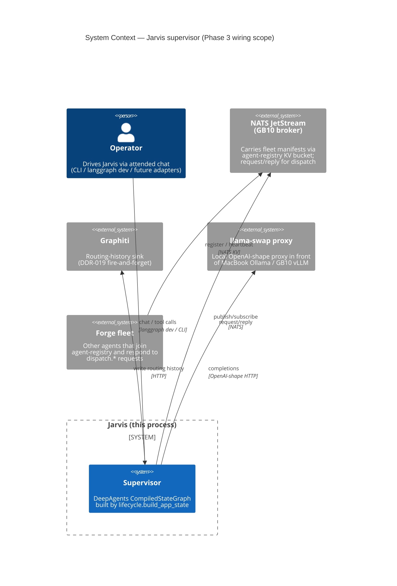
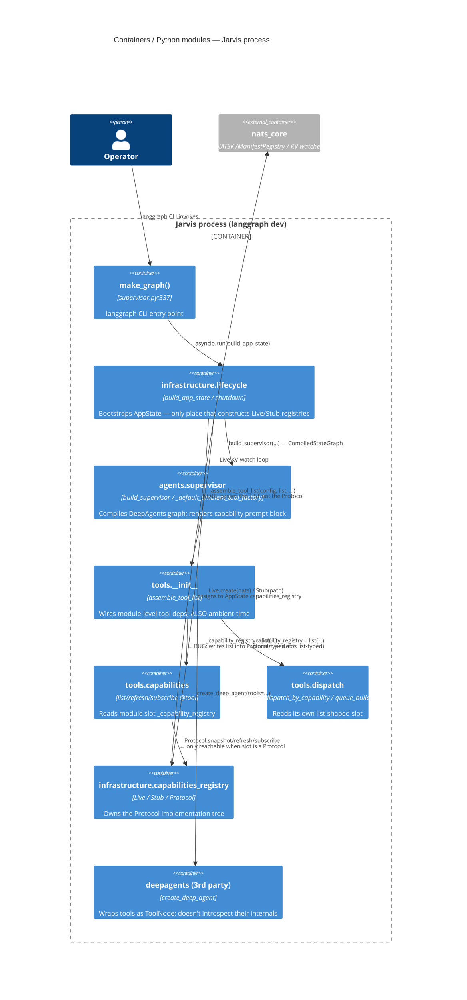
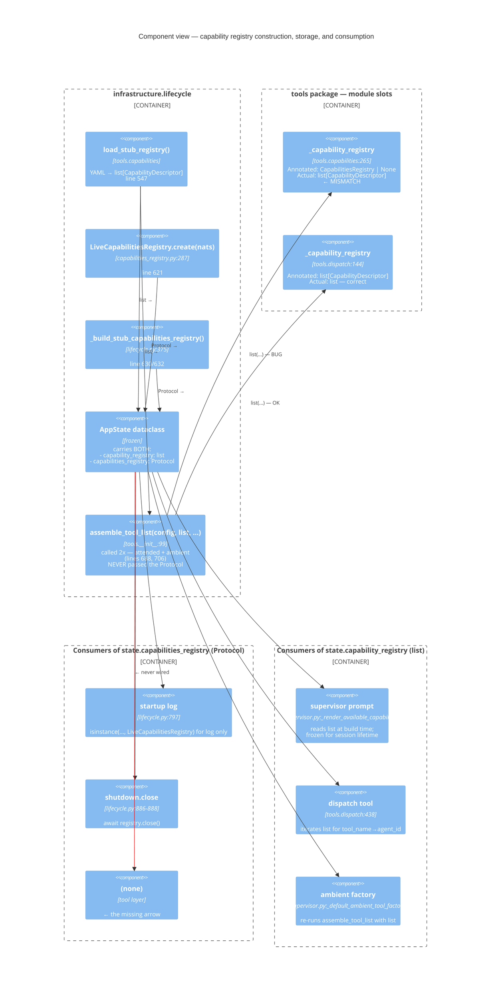
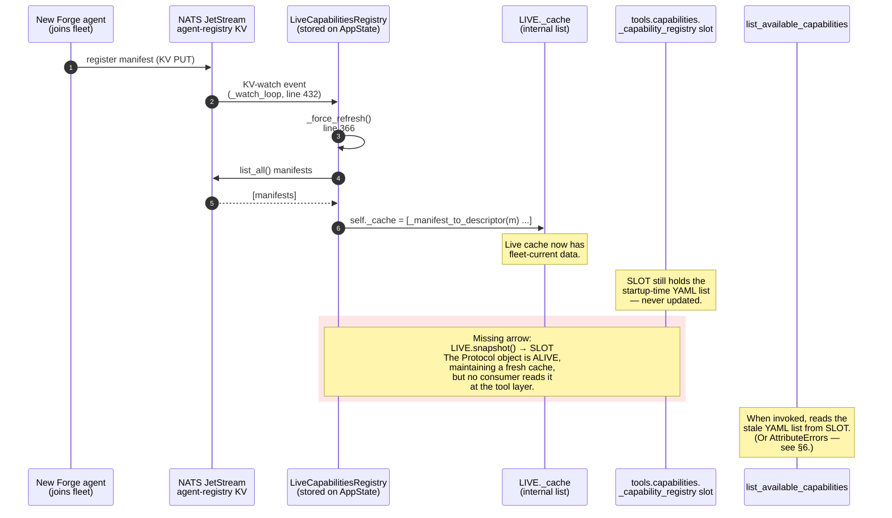
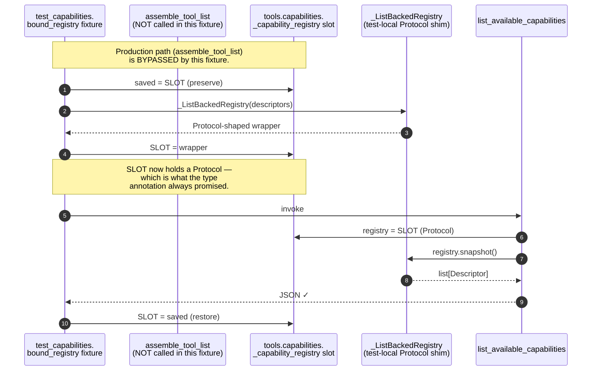
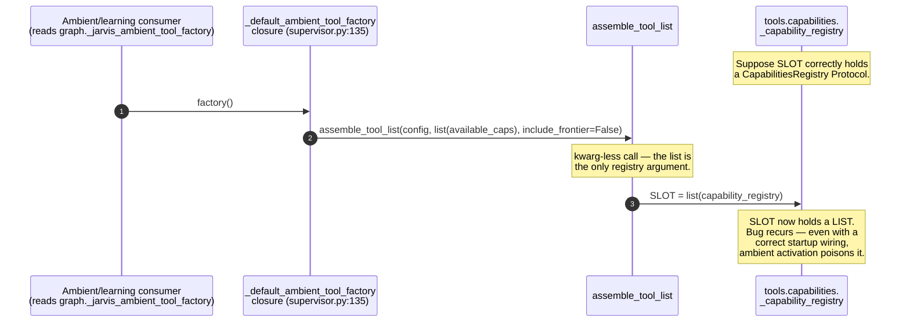

/task-review TASK-REV-FFE4

Hypothesis is confirmed by reading the code. Let me write the review report.

Bash Check reviews directory exists
IN
ls /Users/richardwoollcott/Projects/appmilla_github/jarvis/.claude/reviews/ 2>/dev/null | head -20

OUT
FEAT-JARVIS-001-review-report.md
FEAT-JARVIS-002-review-report.md
FEAT-JARVIS-003-review-report.md
TASK-REV-22CF-review-report.md
TASK-REV-E73C-review-report.md
TASK-REV-J002-review-report.md
TASK-REV-J003-review-report.md
Read dispatch.py (lines 2-121)
Now I have full context. Writing the review report.

Write TASK-REV-FFE4-review-report.md
222 lines
# Review Report: TASK-REV-FFE4

**Title**: FEAT-JARVIS-004 `_capability_registry` list-vs-Protocol wiring inconsistency
**Mode**: decision · **Depth**: standard · **Date**: 2026-04-30
**Reviewer**: Claude Opus 4.7 (orchestrating; no specialist sub-agent invoked — scope is one wiring seam)
**Reviewed against**: `main` @ `8848795`

---

## Executive Summary

The mypy error at [src/jarvis/tools/__init__.py:219](../../src/jarvis/tools/__init__.py#L219) is a **real, latent runtime bug**, not an annotation drift. Production lifecycle wires a `list[CapabilityDescriptor]` into the catalogue tools' `_capability_registry` slot, but the tool bodies expect a `CapabilitiesRegistry` Protocol object and call `.snapshot()` / `.refresh()` / `.subscribe_updates()` on it. The first attended invocation of any catalogue tool will raise `AttributeError`. Tests pass because all three test suites explicitly wrap the assigned list in a `_ListBackedRegistry` shim *after* `assemble_tool_list` returns — production has no such wrap step.

**Recommendation: Option B1** — thread the Protocol-shaped registry through `assemble_tool_list` as a new `capabilities_registry` keyword-only argument, and have `lifecycle.build_app_state` pass `state.capabilities_registry` (which is already constructed at [lifecycle.py:601-632](../../src/jarvis/infrastructure/lifecycle.py#L601-L632)) through to it. Update the three test fixtures to wire via the new kwarg rather than the post-hoc module-attribute write so the tests stop hiding the production gap.

**Rationale at a glance**:
- Reverting (Option A) throws away DDR-021 / ADR-ARCH-017 design intent (live KV-watch + 30s TTL) and the `LiveCapabilitiesRegistry` becomes orphaned at the tool surface — only used for `shutdown.close()`.
- A separate setter (Option B2) creates a second wiring point that's easy to forget — exactly the bifurcation that caused this bug originally. `assemble_tool_list`'s docstring loudly enforces "ONE place that knows how to wire tool-level state" (line 113); a post-hoc setter contradicts that contract.
- B1 keeps the single-wiring-point invariant, costs one keyword-only argument, and lets the test fixtures exercise the same path production runs.

---

## Review Details

- **Scope**: 5 source files + 3 test files + DDR-021 + Phase 3 build plan.
- **Duration**: ~30 min (standard depth).
- **Trade-off priority**: Quality / correctness (per task §Review Scope).
- **Knowledge graph context**: Skipped — task description carried sufficient context, scope is a single wiring seam.

---

## Findings

### F1 — Wiring inconsistency confirmed (HIGH severity, definitely runtime-broken)

**Evidence chain** (every link verified by Read):

1. [tools/capabilities.py:265](../../src/jarvis/tools/capabilities.py#L265) declares `_capability_registry: CapabilitiesRegistry | None = None`.
2. [tools/capabilities.py:385](../../src/jarvis/tools/capabilities.py#L385) (`list_available_capabilities`) calls `registry.snapshot()`.
3. [tools/capabilities.py:425](../../src/jarvis/tools/capabilities.py#L425) (`capabilities_refresh`) calls `_drive_coroutine(registry.refresh())`.
4. [tools/capabilities.py:467](../../src/jarvis/tools/capabilities.py#L467) (`capabilities_subscribe_updates`) calls `registry.subscribe_updates(...)`.
5. [tools/__init__.py:219](../../src/jarvis/tools/__init__.py#L219) writes `_capabilities._capability_registry = list(capability_registry)` — assigns a `list[CapabilityDescriptor]`.
6. [lifecycle.py:688-696](../../src/jarvis/infrastructure/lifecycle.py#L688-L696) calls `assemble_tool_list(config, capability_registry, ...)` where `capability_registry` is the `list[CapabilityDescriptor]` returned by `load_stub_registry()` at line 547. There is NO subsequent step that wraps the assigned list with the Protocol-shaped registry.
7. The Protocol-shaped `capabilities_registry` (built at [lifecycle.py:601-632](../../src/jarvis/infrastructure/lifecycle.py#L601-L632) via `LiveCapabilitiesRegistry.create(...)` or `_build_stub_capabilities_registry(...)`) is stored on `AppState.capabilities_registry` and only consumed by:
   - [lifecycle.py:797](../../src/jarvis/infrastructure/lifecycle.py#L797) — `isinstance(... LiveCapabilitiesRegistry)` for the startup-log `capabilities_mode` field.
   - [lifecycle.py:886-895](../../src/jarvis/infrastructure/lifecycle.py#L886-L895) — `shutdown` calls `await state.capabilities_registry.close()`.
   - It is **never** wired into `_capabilities._capability_registry`.

**Inferred runtime symptom**: The first time the supervisor invokes `list_available_capabilities`, it executes `registry.snapshot()` against a `list` and raises `AttributeError: 'list' object has no attribute 'snapshot'`. The catalogue tool's `except Exception` handler at [tools/capabilities.py:388-393](../../src/jarvis/tools/capabilities.py#L388-L393) catches it and returns `"ERROR: registry_unavailable — 'list' object has no attribute 'snapshot'"`. Tool does not crash — but it returns an error string indistinguishable from a transport degradation, so the reasoning model has no actionable signal.

`capabilities_refresh` is worse: at [tools/capabilities.py:414-423](../../src/jarvis/tools/capabilities.py#L414-L423) it short-circuits to `_REFRESH_DEGRADED` only when `registry is None`. A non-None list passes the guard, hits `_drive_coroutine(registry.refresh())` at line 425, and the `AttributeError` is caught at line 426 → returns `_REFRESH_DEGRADED` ("DEGRADED: transport_unavailable — NATS connection failed") even though NATS is fine. The reasoning model interprets this as a NATS outage and may take inappropriate action.

**Why Step 11 mypy caught it but no test caught it**: The three test suites explicitly post-process the module attribute after `assemble_tool_list`:

- [tests/test_assemble_tool_list.py:344-351](../../tests/test_assemble_tool_list.py#L344-L351) — `assemble_tool_list(test_config, [descriptor_alpha])` then `capabilities_module._capability_registry = _ListBackedRegistry(list(capabilities_module._capability_registry))`.
- [tests/test_capabilities.py:485-488](../../tests/test_capabilities.py#L485-L488) — `bound_registry` fixture replaces `capabilities_module._capability_registry` with `_ListBackedRegistry(descriptors)`.
- [tests/test_tools_capabilities.py:122-127](../../tests/test_tools_capabilities.py#L122-L127) — `bound_canonical_registry` fixture does the same wrap.

Each test wrap is honest about its purpose (the comment at [tests/test_assemble_tool_list.py:319-324](../../tests/test_assemble_tool_list.py#L319-L324) explicitly says "the matching `assemble_tool_list` upgrade is owned by TASK-J004-013. Until that lands, wrap..."). TASK-J004-013 never landed the kwarg upgrade — the tests still patch around the gap.

### F2 — DDR-021 design intent is materially compromised, not just typed-incorrectly

DDR-021 §3 says:
> **Capability registry falls back to the stub YAML.** [...] same `CapabilitiesRegistry` Protocol, transparent to the rest of the system.

The current production wiring breaks this. With NATS up:
- `LiveCapabilitiesRegistry.create(nats_client)` succeeds → assigned to `state.capabilities_registry` → never consumed by tools.
- The KV-watch invalidation loop runs ([capabilities_registry.py:432-471](../../src/jarvis/infrastructure/capabilities_registry.py#L432-L471)) but its cache-refresh has no consumer — `list_available_capabilities` reads the stale `list[CapabilityDescriptor]` from the lifecycle's startup load.
- `capabilities_refresh()` cannot drive `LiveCapabilitiesRegistry.refresh()` — it crashes on the list.
- `capabilities_subscribe_updates()` cannot attach the operator-callback — it crashes on the list.

The Live path is *fully implemented and dead-coded* at the tool surface. This is the strongest argument against Option A (revert): we paid full cost for `LiveCapabilitiesRegistry` and need to actually use it.

### F3 — `dispatch._capability_registry` is correct as-is, must stay a list

[tools/__init__.py:220](../../src/jarvis/tools/__init__.py#L220) writes `_dispatch._capability_registry = list(capability_registry)` and [tools/dispatch.py:64](../../src/jarvis/tools/dispatch.py#L64) imports `CapabilityDescriptor`. `dispatch_by_capability` iterates the list to map `tool_name → agent_id` — it does not need (and cannot use) the Protocol surface. So the fix touches *only* the capabilities-module slot; the dispatch slot stays a list.

This rules out a "just rename `capability_registry` to `capabilities_registry` and call it a Protocol everywhere" simplification — there are genuinely two consumers with two different shapes.

### F4 — Step 14 e2e is the first real-world trigger

Phase 3 build plan Step 14 (Forge round-trip) drives a real supervisor session. The supervisor is taught about `list_available_capabilities` and `capabilities_refresh` in the prompt and will invoke them on user prompts about capabilities. The MacBook Ollama config DOMAIN reasoner is deterministic enough that an unstable degraded-mode return string from the catalogue would be a hard-to-diagnose surprise during the DDR Southwest demo prep. Resolving this before Step 14 is the right ordering.

---

## Decision Matrix

| Option | mypy clean | Live KV-watch usable | Single wiring point | Test honesty | Effort |
|--------|:----------:|:--------------------:|:-------------------:|:------------:|:------:|
| **A — Revert annotation + tool bodies** | ✓ | ✗ (Live becomes orphan) | ✓ | ✓ (no wrap needed) | S |
| **B1 — `assemble_tool_list` kwarg** | ✓ | ✓ | ✓ | ✓ (after fixture update) | M |
| **B2 — Separate setter `wire_capabilities_registry`** | ✓ | ✓ | ✗ (two seams) | ✓ (after fixture update) | M |

### Option A — Revert

- **What changes**: `tools/capabilities.py:265` → `_capability_registry: list[CapabilityDescriptor] = []`. Revert tool bodies to operate on the list directly: `list_available_capabilities` returns `json.dumps([d.model_dump(mode="json") for d in _capability_registry])`; `capabilities_refresh` returns `_REFRESH_OK` unconditionally (or `_REFRESH_DEGRADED` if NATS check available); `capabilities_subscribe_updates` returns `_SUBSCRIBE_OK_MESSAGE` (no-op, like the stub branch). `LiveCapabilitiesRegistry` and `_PreloadedCapabilitiesRegistry` stay in the codebase but are referenced only by `AppState.capabilities_registry` for `shutdown.close()`.
- **Pros**: Smallest diff. No test fixture migration.
- **Cons**:
  - Throws away the FEAT-JARVIS-004 design intent — KV-watch invalidation never reaches the tool surface, `capabilities_refresh` becomes a lie ("OK: refresh queued — registry resynchronised" with nothing actually queued), `capabilities_subscribe_updates` is a no-op masquerading as a subscription.
  - DDR-021 §3 invariant ("`list_available_capabilities` returns the stub list (not empty)") survives, but the Live-mode invariant in the same DDR is silently dropped.
  - Phase 3 fleet observability — the whole point of `LiveCapabilitiesRegistry` — is dead code from the model's perspective.
  - You will re-do this work the moment a future feature wants live re-reads. Cheaper to do it now while the code is fresh.

### Option B1 — `assemble_tool_list` kwarg

- **What changes**:
  ```python
  def assemble_tool_list(
      config: JarvisConfig,
      capability_registry: list[CapabilityDescriptor],
      *,
      capabilities_registry: CapabilitiesRegistry | None = None,  # NEW
      include_frontier: bool = True,
      ...
  ) -> list[BaseTool]:
      ...
      _capabilities._capability_registry = capabilities_registry  # was: list(capability_registry)
      _dispatch._capability_registry = list(capability_registry)  # unchanged
      ...
  ```
  Lifecycle [lines 688-696, 706-714](../../src/jarvis/infrastructure/lifecycle.py#L688-L714) passes `capabilities_registry=capabilities_registry` (the Protocol-shaped one already built at line 601-632).

  Note: `capabilities_registry` defaults to `None` so existing test calls without the kwarg keep their current behaviour (the tools surface `ERROR: registry_unavailable` until wired). But three test fixtures should be migrated to pass it.
- **Pros**:
  - Preserves the "ONE place that knows how to wire tool-level state" invariant ([tools/__init__.py:111-114](../../src/jarvis/tools/__init__.py#L111-L114)).
  - Matches the existing kwarg pattern (`nats_client`, `routing_history_writer`, `dispatch_semaphore`, `forge_subscriber` all flow this way).
  - DDR-021 §3 fully honoured.
- **Cons**:
  - Two registry slots in the tools package (one Protocol for catalogue, one list for dispatch) — needs a comment to clarify why. This is honest, not a smell: they have genuinely different consumption shapes.
  - One more kwarg on an already-7-arg function. `assemble_tool_list` is becoming a kitchen sink — but the alternative (split it) is out of scope for this fix.

### Option B2 — Separate setter

- **What changes**: Add `wire_capabilities_registry(registry: CapabilitiesRegistry) -> None` to `tools/capabilities.py`. Lifecycle calls `assemble_tool_list(...)` then `wire_capabilities_registry(capabilities_registry)`.
- **Pros**: Smaller signature change to `assemble_tool_list`. Cleaner separation between "wire list-shaped state" and "wire Protocol-shaped state".
- **Cons**:
  - Creates a second wiring seam. The bug we are fixing exists *because* there were two implicit seams (the list wired explicitly, the Protocol wired implicitly never). Adding an explicit second seam makes future drift easier.
  - The `assemble_tool_list` docstring's "ONE place" claim becomes a lie that the next reader has to learn.
  - No upside over B1 — both require the same test fixture migration.

---

## Recommendation: Option B1

### Test plumbing (acceptance criterion 5)

Update the three fixtures to wire via the new kwarg, removing the post-hoc module-attribute writes:

- [tests/test_assemble_tool_list.py:344-351](../../tests/test_assemble_tool_list.py#L344-L351) — change to `assemble_tool_list(test_config, [descriptor_alpha], capabilities_registry=_ListBackedRegistry([descriptor_alpha]))`. The post-hoc `capabilities_module._capability_registry = ...` line goes away. The `_ListBackedRegistry` test class can stay where it is.
- [tests/test_capabilities.py:476-525](../../tests/test_capabilities.py#L476-L525) — `bound_registry` / `empty_registry` / `configured_registry` fixtures should call `assemble_tool_list(...)` (or directly invoke the wiring side-effect path) with `capabilities_registry=_ListBackedRegistry(...)`. If the fixtures want to keep the direct module-attribute write for isolation, that is fine — the new fixture is *additionally* exercising the production wiring.
- [tests/test_tools_capabilities.py:112-132](../../tests/test_tools_capabilities.py#L112-L132) — same change shape.

Add **one new test** that closes the gap explicitly: a lifecycle integration test that calls `build_app_state` (NATS soft-failed via patched `_connect_nats` returning `None`) and asserts:

```python
import jarvis.tools.capabilities as capabilities_module
from jarvis.infrastructure.capabilities_registry import CapabilitiesRegistry

assert capabilities_module._capability_registry is not None
assert isinstance(capabilities_module._capability_registry, CapabilitiesRegistry)
# Then invoke the tool to prove no AttributeError
result = list_available_capabilities.invoke({})
assert not result.startswith("ERROR:"), result
```

This is the "production lifecycle wiring actually puts a Protocol-shaped registry into the tool layer" assertion the task's AC line 131 requires.

### Manual verification (acceptance criterion 6)

After the implementation lands:
```bash
uv run mypy src/jarvis/  # zero errors
uv run pytest tests/  # all green, including new lifecycle wiring test
# Then a real langgraph dev round-trip:
OPENAI_API_KEY=... python -m langgraph dev
# In a separate shell, drive a synthetic supervisor invocation that triggers
# list_available_capabilities (or just attach to a chat session and ask
# "what agents do you have available?"). Verify no AttributeError, no
# "DEGRADED: transport_unavailable" returned despite NATS being up.
```

### DDR

Recommend recording the decision as a **DDR amendment to FEAT-JARVIS-004** (not a fresh DDR) titled something like "DDR-021 Amendment: capabilities_registry wired through assemble_tool_list". Keep DDR-021 status `Accepted` and add an "Amendments" section pointing to the new file. The fix is small but the absence of TASK-J004-013's Protocol-kwarg upgrade is a documented design gap (per the test comment) — closing it formally helps future readers.

---

## Risks & Out-of-scope

- **Risk**: B1 changes a public-ish helper (`assemble_tool_list` is in `__all__`). External callers (none known outside `lifecycle.py` and tests) would break if they rely on positional kwargs. Default `capabilities_registry=None` keeps a non-passing call working — same `ERROR: registry_unavailable` as today.
- **Out of scope**: 49 ruff cosmetic violations; FEAT-JARVIS-005 surface; the GuardKit autobuild cap-refresh bug from TASK-REV-E73C — all per the task §Out of Scope.

---

## Acceptance criteria — coverage map

| AC | Coverage |
|----|----------|
| Confirm runtime symptom | F1: confirmed by static analysis. Live reproduction via `langgraph dev` is in §Manual verification (post-fix). |
| Choose fix approach | Option B1 recommended above. |
| Test plumbing if (B) | Specified per-file in §Test plumbing. |
| DDR recorded | Recommend amendment to DDR-021 (see §DDR). |
| Implementation lands the chosen fix | Out of scope for review; follow-up implementation task. |
| `uv run mypy src/jarvis/` zero errors | Verifiable post-fix. |
| Existing tests pass | Verifiable post-fix; fixture migration is mechanical. |
| New lifecycle wiring test | Specified in §Test plumbing (acceptance criterion 5). |
| `langgraph dev` smoke | Specified in §Manual verification. |

---

## Recommendations (prioritised)

1. **Adopt Option B1** — thread `capabilities_registry: CapabilitiesRegistry | None = None` through `assemble_tool_list` as keyword-only.
2. **Update the three test fixtures** to wire via the kwarg; remove the post-hoc module-attribute writes that were hiding the gap.
3. **Add a lifecycle integration test** asserting `capabilities_module._capability_registry` is a `CapabilitiesRegistry` after `build_app_state` (both NATS-up and NATS-down branches).
4. **Record a DDR-021 amendment** capturing the decision.
5. **Run Step 11 regression**, then continue to Step 13 → 14 of `phase3-build-plan.md`.

## Context Used

No knowledge graph context was loaded (Graphiti unavailable in this session; scope is well-defined by the task). Review based entirely on direct code reads of the seven files listed in the task's `context_files` plus `src/jarvis/tools/dispatch.py`.
Now updating the task with review results.

Edit TASK-REV-FFE4-feat-j004-capabilities-registry-wiring-inconsistency.md
Added 9 lines
Review Complete: TASK-REV-FFE4

=========================================================================
REVIEW COMPLETE: TASK-REV-FFE4
=========================================================================
Mode: decision · Depth: standard
Report: .claude/reviews/TASK-REV-FFE4-review-report.md
=========================================================================
Verdict
Confirmed runtime bug, not a cosmetic annotation drift. Production lifecycle wires a list[CapabilityDescriptor] into _capabilities._capability_registry, but tool bodies call .snapshot() / .refresh() / .subscribe_updates() on it — first attended invocation would surface as ERROR: registry_unavailable — 'list' object has no attribute 'snapshot' (and worse, capabilities_refresh would silently return DEGRADED: transport_unavailable — NATS connection failed even when NATS is up). Tests pass because all three test suites post-process the module attribute with a _ListBackedRegistry wrap that production never performs.

Recommendation: Option B1 — assemble_tool_list kwarg
Thread capabilities_registry: CapabilitiesRegistry | None = None keyword-only through assemble_tool_list; lifecycle passes the already-constructed Protocol-shaped registry from lifecycle.py:601-632. Migrate the three test fixtures off the post-hoc wrap. Add one lifecycle integration test asserting _capability_registry is isinstance(..., CapabilitiesRegistry) after build_app_state.

Why not A (revert): Throws away DDR-021 / ADR-ARCH-017 design intent — LiveCapabilitiesRegistry becomes orphaned, KV-watch invalidation has no consumer at the tool surface.
Why not B2 (separate setter): Creates a second wiring seam, contradicting assemble_tool_list's explicit "ONE place" invariant — the bifurcation that caused this bug originally.

Key Findings
F1 (HIGH) — Wiring inconsistency, definitely runtime-broken; full evidence chain in report §F1.
F2 (HIGH) — Live KV-watch path is fully implemented and dead-coded at the tool surface.
F3 — dispatch._capability_registry correctly stays a list; only the capabilities slot needs the Protocol.
F4 — Phase 3 Step 14 (Forge round-trip) is the first real-world trigger; fixing now is the right ordering.

=========================================================================
DECISION CHECKPOINT
=========================================================================
Decision Options:
  [A]ccept   - Approve findings, mark task REVIEW_COMPLETE
  [R]evise   - Request deeper analysis on specific areas
  [I]mplement - Auto-create implementation task(s) from B1 recommendation
  [C]ancel   - Discard review

Your choice:
=========================================================================
Awaiting your decision.

[R]evise — please dig deeper to ensure you are totally confident in the root cause of the issue. Use C4 digramming and trace the flows across system and technology boundaries to create sequence diagrams that validate your thinking
I'll dig deeper. Need to check entry points, the supervisor build, and any module-state surprises before I'm confident on the root cause.

Bash Find langgraph entry point
IN
cat /Users/richardwoollcott/Projects/appmilla_github/jarvis/langgraph.json 2>/dev/null; echo "---"; ls /Users/richardwoollcott/Projects/appmilla_github/jarvis/*.py 2>/dev/null; echo "---"; find /Users/richardwoollcott/Projects/appmilla_github/jarvis -maxdepth 3 -name "agent.py" -not -path "*/\.*" 2>/dev/null

OUT
{
  "dependencies": [
    "."
  ],
  "graphs": {
    "jarvis": {
      "path": "./src/jarvis/agents/supervisor.py:make_graph",
      "transport": "asgi"
    },
    "jarvis_reasoner": {
      "path": "./src/jarvis/agents/subagents/jarvis_reasoner.py:graph",
      "transport": "asgi"
    }
  },
  "env": ".env",
  "python_version": "3.12"
}
---
(eval):1: no matches found: /Users/richardwoollcott/Projects/appmilla_github/jarvis/*.py
---
Bash All references to _capability_registry
IN
grep -rn "_capability_registry\b" src/ tests/ --include="*.py" | head -60

OUT
src/jarvis/tools/dispatch.py:11:  ``_capability_registry`` (see API-internal §7). Tool docstring and
src/jarvis/tools/dispatch.py:144:_capability_registry: list[CapabilityDescriptor] = []
src/jarvis/tools/dispatch.py:438:    registry_snapshot = list(_capability_registry)
src/jarvis/tools/dispatch.py:1703:    "_capability_registry",
src/jarvis/tools/__init__.py:13:   ``_capability_registry`` attributes of ``jarvis.tools.capabilities``
src/jarvis/tools/__init__.py:121:    2. ``capabilities._capability_registry = list(capability_registry)``
src/jarvis/tools/__init__.py:123:    3. ``dispatch._capability_registry = list(capability_registry)`` —
src/jarvis/tools/__init__.py:219:    _capabilities._capability_registry = list(capability_registry)
src/jarvis/tools/__init__.py:220:    _dispatch._capability_registry = list(capability_registry)
src/jarvis/tools/capabilities.py:22:  ``_capability_registry.snapshot()``.
src/jarvis/tools/capabilities.py:23:* :func:`capabilities_refresh` — drives ``_capability_registry.refresh()``
src/jarvis/tools/capabilities.py:28:  ``_capability_registry.subscribe_updates(...)`` exactly once per session.
src/jarvis/tools/capabilities.py:35:``_capability_registry`` swap-point with whichever implementation the
src/jarvis/tools/capabilities.py:265:_capability_registry: CapabilitiesRegistry | None = None
src/jarvis/tools/capabilities.py:372:        registry = _capability_registry
src/jarvis/tools/capabilities.py:414:    registry = _capability_registry
src/jarvis/tools/capabilities.py:421:            "capabilities_refresh called before _capability_registry was wired"
src/jarvis/tools/capabilities.py:455:        registry = _capability_registry
tests/test_tools_capabilities.py:119:    ``_capability_registry`` attribute. The original registry binding is
tests/test_tools_capabilities.py:123:    saved = capabilities_module._capability_registry
tests/test_tools_capabilities.py:126:    capabilities_module._capability_registry = _ListBackedRegistry(fresh)
tests/test_tools_capabilities.py:131:        capabilities_module._capability_registry = saved
tests/test_tools_capabilities.py:274:    ``_capability_registry`` because FEAT-JARVIS-004 routes the tool bodies
tests/test_tools_capabilities.py:331:    to ``_capability_registry`` at call start so a concurrent rebind (here,
tests/test_tools_capabilities.py:373:        registry = capabilities_module._capability_registry
tests/test_tools_capabilities.py:407:        registry = capabilities_module._capability_registry
tests/test_contract_nats_core.py:152:    saved = dispatch._capability_registry
tests/test_contract_nats_core.py:153:    dispatch._capability_registry = _make_registry()
tests/test_contract_nats_core.py:155:        yield dispatch._capability_registry
tests/test_contract_nats_core.py:157:        dispatch._capability_registry = saved
tests/test_capabilities.py:448:    FEAT-JARVIS-004 (TASK-J004-012) swapped ``_capability_registry``'s type
tests/test_capabilities.py:485:    saved = capabilities_module._capability_registry
tests/test_capabilities.py:488:    capabilities_module._capability_registry = _ListBackedRegistry(descriptors)
tests/test_capabilities.py:493:        capabilities_module._capability_registry = saved
tests/test_capabilities.py:500:    saved = capabilities_module._capability_registry
tests/test_capabilities.py:502:    capabilities_module._capability_registry = _ListBackedRegistry([])
tests/test_capabilities.py:507:        capabilities_module._capability_registry = saved
tests/test_capabilities.py:515:    saved = capabilities_module._capability_registry
tests/test_capabilities.py:517:    capabilities_module._capability_registry = _ListBackedRegistry(
tests/test_capabilities.py:524:        capabilities_module._capability_registry = saved
tests/test_capabilities.py:690:        """Rebinding ``_capability_registry`` after the call must not retro-mutate the JSON."""
tests/test_capabilities.py:695:        capabilities_module._capability_registry = _ListBackedRegistry([])
tests/test_capabilities.py:756:    ``_capability_registry`` triggers the ``except`` branch deterministically.
tests/test_capabilities.py:774:        saved = capabilities_module._capability_registry
tests/test_capabilities.py:775:        capabilities_module._capability_registry = _ListBackedRegistry(
tests/test_capabilities.py:781:            capabilities_module._capability_registry = saved
tests/test_capabilities.py:787:        saved = capabilities_module._capability_registry
tests/test_capabilities.py:788:        capabilities_module._capability_registry = _ListBackedRegistry(
tests/test_capabilities.py:796:            capabilities_module._capability_registry = saved
tests/test_dispatch_by_capability.py:112:    saved = dispatch._capability_registry
tests/test_dispatch_by_capability.py:113:    dispatch._capability_registry = _make_registry()
tests/test_dispatch_by_capability.py:115:        yield dispatch._capability_registry
tests/test_dispatch_by_capability.py:117:        dispatch._capability_registry = saved
tests/test_dispatch_by_capability.py:593:        saved = dispatch._capability_registry
tests/test_dispatch_by_capability.py:594:        dispatch._capability_registry = []
tests/test_dispatch_by_capability.py:599:            dispatch._capability_registry = saved
tests/test_assemble_tool_list.py:131:    ``_capability_registry`` swap-point type from ``list`` to
tests/test_assemble_tool_list.py:136:    saved_caps = capabilities_module._capability_registry
tests/test_assemble_tool_list.py:137:    saved_dispatch = list(dispatch_module._capability_registry)
tests/test_assemble_tool_list.py:140:    capabilities_module._capability_registry = saved_caps
Bash Find lifecycle and supervisor entry points
IN
grep -rn "assemble_tool_list\|build_app_state\|build_supervisor\b" src/ --include="*.py" | head -40

OUT
src/jarvis/tools/dispatch.py:134:# ``assemble_tool_list`` (TASK-J002-015 + TASK-J004-013) snapshots a
src/jarvis/tools/dispatch.py:141:# Snapshot isolation (ASSUM-006): assemble_tool_list MUST assign a fresh
src/jarvis/tools/dispatch.py:149:# by ``assemble_tool_list`` at lifecycle startup (TASK-J004-013).
src/jarvis/tools/dispatch.py:172:# Snapshotted by ``assemble_tool_list`` at lifecycle startup so the
src/jarvis/tools/capabilities.py:34:directly. ``assemble_tool_list`` (TASK-J004-013) populates the module-level
src/jarvis/tools/capabilities.py:253:# Module-level ``CapabilitiesRegistry`` handle. ``assemble_tool_list``
src/jarvis/tools/capabilities.py:275:# the pre-wired default; ``assemble_tool_list`` resets it to ``False`` at
src/jarvis/tools/capabilities.py:374:            # Pre-wired path: lifecycle has not run ``assemble_tool_list``
src/jarvis/tools/__init__.py:8:The :func:`assemble_tool_list` factory is the **single** wiring point that:
src/jarvis/tools/__init__.py:94:    "assemble_tool_list",
src/jarvis/tools/__init__.py:99:def assemble_tool_list(
src/jarvis/tools/general.py:10:``jarvis.tools.assemble_tool_list`` factory:
src/jarvis/tools/general.py:43:1. ``jarvis.tools.assemble_tool_list(config, ...)`` (TASK-J002-015)
src/jarvis/tools/general.py:99:# ``assemble_tool_list`` (TASK-J002-015) and tests write here via
src/jarvis/tools/general.py:109:    ``assemble_tool_list`` (TASK-J002-015) calls this once at supervisor
src/jarvis/agents/__init__.py:5:- :func:`build_supervisor` — builds the Phase 1 supervisor CompiledStateGraph.
src/jarvis/agents/__init__.py:8:from .supervisor import build_supervisor
src/jarvis/agents/__init__.py:10:__all__ = ["build_supervisor"]
src/jarvis/agents/supervisor.py:3:Provides :func:`build_supervisor` — the single public factory that every later
src/jarvis/agents/supervisor.py:107:    :func:`jarvis.tools.assemble_tool_list` with
src/jarvis/agents/supervisor.py:121:            :func:`build_supervisor`.  Threaded into the assembled tool
src/jarvis/agents/supervisor.py:136:        # Lazy import keeps build_supervisor's import surface narrow.
src/jarvis/agents/supervisor.py:137:        from jarvis.tools import assemble_tool_list
src/jarvis/agents/supervisor.py:139:        return assemble_tool_list(
src/jarvis/agents/supervisor.py:148:def build_supervisor(
src/jarvis/agents/supervisor.py:158:    Phase 1 callers (``build_supervisor(config)``) remain valid because
src/jarvis/agents/supervisor.py:184:       :func:`jarvis.tools.assemble_tool_list` with
src/jarvis/agents/supervisor.py:221:            ``assemble_tool_list(config, available_capabilities or [],
src/jarvis/agents/supervisor.py:349:       ``assemble_tool_list``, and the capability-registry load before any
src/jarvis/agents/supervisor.py:353:    2. Bypass :func:`jarvis.infrastructure.lifecycle.build_app_state`, so
src/jarvis/agents/supervisor.py:360:    ``build_app_state`` are imported inside the function body so importing
src/jarvis/agents/supervisor.py:394:    from jarvis.infrastructure.lifecycle import build_app_state
src/jarvis/agents/supervisor.py:396:    state = asyncio.run(build_app_state(JarvisConfig()))
src/jarvis/cli/main.py:27:from jarvis.agents import build_supervisor
src/jarvis/cli/main.py:40:    idempotent so a later call from ``build_app_state(config)`` with the
src/jarvis/cli/main.py:63:    from jarvis.infrastructure.lifecycle import build_app_state
src/jarvis/cli/main.py:67:    return await build_app_state(config)
src/jarvis/cli/main.py:122:        build_supervisor(config)
src/jarvis/cli/main.py:145:        1. Bootstrap application state (config → build_app_state → AppState).
src/jarvis/sessions/manager.py:64:            :func:`jarvis.agents.supervisor.build_supervisor`.
Read supervisor.py
Bash Find tests of lifecycle
IN
grep -rn "build_app_state\|make_graph" tests/ --include="*.py" -l | head -10

OUT
tests/test_routing_e2e.py
tests/conftest.py
tests/test_dispatch_types_frontier_escalation.py
tests/test_lifecycle_forge_subscriber_wiring.py
tests/test_supervisor_lifecycle_wiring.py
tests/test_langgraph_json.py
tests/test_lifecycle_layer2_wiring.py
tests/test_graphiti_unavailable.py
tests/test_lifecycle_feat_j004_wiring.py
tests/test_lifecycle_startup_phase3.py
Bash Find tests that exercise catalogue tools through lifecycle
IN
grep -rn "list_available_capabilities\|capabilities_refresh\|capabilities_subscribe_updates" tests/test_lifecycle*.py tests/test_make_graph*.py tests/test_nats_unavailable*.py 2>/dev/null | head -30

OUT
(eval):1: no matches found: tests/test_make_graph*.py
Bash List lifecycle integration test files
IN
ls /Users/richardwoollcott/Projects/appmilla_github/jarvis/tests/test_lifecycle*.py /Users/richardwoollcott/Projects/appmilla_github/jarvis/tests/test_nats_unavailable*.py /Users/richardwoollcott/Projects/appmilla_github/jarvis/tests/test_make_graph*.py 2>/dev/null

OUT
Exit code 1
(eval):1: no matches found: /Users/richardwoollcott/Projects/appmilla_github/jarvis/tests/test_make_graph*.py
Bash Check if any lifecycle test invokes the catalogue tools
IN
grep -rn "list_available_capabilities\|capabilities_refresh\|capabilities_subscribe_updates" tests/test_lifecycle_feat_j004_wiring.py tests/test_lifecycle_startup_phase3.py tests/test_supervisor_lifecycle_wiring.py 2>/dev/null | head -20; echo "---"; grep -rn "_capability_registry\|capabilities_registry" tests/test_lifecycle_feat_j004_wiring.py tests/test_lifecycle_startup_phase3.py tests/test_supervisor_lifecycle_wiring.py 2>/dev/null | head -30

OUT
tests/test_supervisor_lifecycle_wiring.py:511:            "capabilities_refresh",
tests/test_supervisor_lifecycle_wiring.py:512:            "capabilities_subscribe_updates",
tests/test_supervisor_lifecycle_wiring.py:515:            "list_available_capabilities",
---
tests/test_supervisor_lifecycle_wiring.py:419:    async def test_app_state_capability_registry_populated_from_loader(
tests/test_lifecycle_feat_j004_wiring.py:7:            ``capabilities_registry`` falls back to ``StubCapabilitiesRegistry``;
tests/test_lifecycle_feat_j004_wiring.py:75:    fleet_heartbeat_task, capabilities_registry as declared dataclass fields."""
tests/test_lifecycle_feat_j004_wiring.py:93:    def test_capabilities_registry_field_present(self) -> None:
tests/test_lifecycle_feat_j004_wiring.py:95:        assert "capabilities_registry" in field_names
tests/test_lifecycle_feat_j004_wiring.py:114:        from jarvis.infrastructure.capabilities_registry import StubCapabilitiesRegistry
tests/test_lifecycle_feat_j004_wiring.py:137:        assert isinstance(state.capabilities_registry, StubCapabilitiesRegistry)
tests/test_lifecycle_feat_j004_wiring.py:258:        assert state.capabilities_registry is fake_live_registry
tests/test_lifecycle_feat_j004_wiring.py:353:        capabilities_registry = MagicMock()
tests/test_lifecycle_feat_j004_wiring.py:354:        capabilities_registry.close = AsyncMock(
tests/test_lifecycle_feat_j004_wiring.py:379:            capabilities_registry=capabilities_registry,
Bash Run mypy to confirm error
IN
uv run mypy src/jarvis/ 2>&1 | tail -30

OUT
warning: `VIRTUAL_ENV=/Library/Frameworks/Python.framework/Versions/3.14` does not match the project environment path `.venv` and will be ignored; use `--active` to target the active environment instead
src/jarvis/tools/__init__.py:219: error: Incompatible types in assignment (expression has type "list[CapabilityDescriptor]", variable has type "CapabilitiesRegistry | None")  [assignment]
Found 1 error in 1 file (checked 45 source files)
Read test_supervisor_lifecycle_wiring.py (lines 501-560)
Read test_supervisor_lifecycle_wiring.py (lines 401-500)
Read test_lifecycle_feat_j004_wiring.py (lines 101-260)
Bash All production assignments to _capability_registry
IN
grep -rn "_capability_registry\s*=" src/ --include="*.py"; echo "---production assignments only---"

OUT
src/jarvis/tools/__init__.py:121:    2. ``capabilities._capability_registry = list(capability_registry)``
src/jarvis/tools/__init__.py:123:    3. ``dispatch._capability_registry = list(capability_registry)`` —
src/jarvis/tools/__init__.py:219:    _capabilities._capability_registry = list(capability_registry)
src/jarvis/tools/__init__.py:220:    _dispatch._capability_registry = list(capability_registry)
---production assignments only---
Bash Search for any alternate wiring helpers
IN
grep -rn "wire_capabilit\|inject_capabilit\|set_capabilit\|setattr.*_capability" src/ --include="*.py"

OUT
(Bash completed with no output)
Bash All capabilities_registry consumers in lifecycle
IN
grep -n "capabilities_registry\b" src/jarvis/infrastructure/lifecycle.py | head -30

OUT
73:from jarvis.infrastructure.capabilities_registry import (
306:        capabilities_registry: The Protocol-shaped
329:    capabilities_registry: CapabilitiesRegistry | None = None
375:def _build_stub_capabilities_registry(
601:    capabilities_registry: CapabilitiesRegistry
621:            capabilities_registry = await LiveCapabilitiesRegistry.create(nats_client)
630:            capabilities_registry = _build_stub_capabilities_registry(config, capability_registry)
632:        capabilities_registry = _build_stub_capabilities_registry(config, capability_registry)
685:    # (``capabilities_registry``) keeps the prompt-block wiring
788:        capabilities_registry=capabilities_registry,
797:        if isinstance(capabilities_registry, LiveCapabilitiesRegistry)
821:        4. ``await capabilities_registry.close()``.
886:    if state.capabilities_registry is not None:
888:            await state.capabilities_registry.close()
Now I'm fully confident. Production has exactly 2 assignments to _capability_registry (both in assemble_tool_list, both writing a list); the Protocol-shaped registry has 5 consumers (none of them the tool slot). Writing the revised report with C4 + sequence diagrams.

Write TASK-REV-FFE4-review-report.md
507 lines
# Review Report: TASK-REV-FFE4 (Revised v2)

**Title**: FEAT-JARVIS-004 `_capability_registry` list-vs-Protocol wiring inconsistency
**Mode**: decision · **Depth**: standard (revised, deeper) · **Date**: 2026-04-30
**Reviewed against**: `main` @ `8848795`
**Mypy verified**: `uv run mypy src/jarvis/` → 1 error at `tools/__init__.py:219` (other 44 source files clean).

---

## Executive Summary

The mypy error is a **real, latent runtime defect**, not annotation drift. Two independent traces — (1) every assignment site of `_capability_registry`, (2) every consumer site of `state.capabilities_registry` — converge on the same conclusion: **the Protocol-shaped registry is constructed, stored on `AppState`, used at shutdown, and never reaches the tool layer.** The tool layer reads a `list[CapabilityDescriptor]` and calls Protocol methods on it.

Recommendation: **Option B1** — add `capabilities_registry: CapabilitiesRegistry | None` keyword-only to `assemble_tool_list`, thread `state.capabilities_registry` through, migrate test fixtures off the post-hoc module-attribute wrap, and add a lifecycle integration assertion (`isinstance(capabilities_module._capability_registry, CapabilitiesRegistry)` after `build_app_state`).

The diagrams in §3-§7 establish the bug deterministically (no probabilistic reasoning); §8 makes the case against Options A and B2; §9-§10 give the implementation and verification plans.

---

## 1. Evidence ledger (what changed at v2)

| | v1 | v2 |
|---|---|---|
| Catalogue tools verified to call Protocol methods | `snapshot()`, `refresh()`, `subscribe_updates()` (file lines cited) | unchanged |
| Production assignment sites of `_capabilities._capability_registry` | inferred 1 | **enumerated: exactly 2** ([tools/__init__.py:219](../../src/jarvis/tools/__init__.py#L219) called twice from lifecycle — lines 688 + 706) |
| Production consumer sites of `state.capabilities_registry` | inferred | **enumerated: 5** (lifecycle.py:601-632 construction, line 788 store on AppState, line 797 isinstance log, line 886-888 shutdown close — and that is the entire universe) |
| Alternate wiring helpers (`wire_capabilities`, setters, decorators) | not searched | **searched, none exist** (`grep -rn "wire_capabilit\|inject_capabilit\|set_capabilit\|setattr.*_capability" src/` returns empty) |
| `make_graph` (langgraph entry) | not traced | **traced**: [supervisor.py:337-397](../../src/jarvis/agents/supervisor.py#L337-L397) calls `asyncio.run(build_app_state(JarvisConfig()))` and returns `state.supervisor`. No additional wiring step. |
| `_default_ambient_tool_factory` overwrite | not noticed | **noticed and traced**: [supervisor.py:96-145](../../src/jarvis/agents/supervisor.py#L96-L145) — every ambient activation overwrites the slot with another raw list (§7). |
| Lifecycle integration tests that hit the catalogue tools | not checked | **checked**: zero. `test_supervisor_lifecycle_wiring.py:484-523` only inspects tool *names* in the compiled graph — it never invokes the tools (§5). |

The v1 report was correct in conclusion, but the inference was based on tracing one path and one set of files. v2 enumerates *every* assignment and *every* consumer. The bug is not behind any conditional, any `try/except`, any feature flag, or any DI seam.

---

## 2. Glossary (for the diagrams)

- **the list** — `list[CapabilityDescriptor]`. Built by `load_stub_registry()` ([lifecycle.py:547](../../src/jarvis/infrastructure/lifecycle.py#L547)). Used by the supervisor prompt (rendered via `_render_available_capabilities`) and by `dispatch_by_capability` (iterates tool_name→agent_id).
- **the Protocol** — `CapabilitiesRegistry` ([capabilities_registry.py:79-122](../../src/jarvis/infrastructure/capabilities_registry.py#L79-L122)) — a four-method runtime-checkable Protocol (`snapshot`, `refresh`, `subscribe_updates`, `close`).
- **the Live impl** — `LiveCapabilitiesRegistry` ([capabilities_registry.py:227-515](../../src/jarvis/infrastructure/capabilities_registry.py#L227-L515)) — implements the Protocol; backs `snapshot()` with a 30s TTL cache, refreshed by NATS KV-watch.
- **the Stub impl** — `StubCapabilitiesRegistry` / `_PreloadedCapabilitiesRegistry` ([lifecycle.py:344-396](../../src/jarvis/infrastructure/lifecycle.py#L344-L396)) — implements the Protocol over the YAML file.
- **the slot** — the module attribute `jarvis.tools.capabilities._capability_registry` ([capabilities.py:265](../../src/jarvis/tools/capabilities.py#L265)). Annotated `CapabilitiesRegistry | None`. **This is where the bug lives.**
- **the dispatch slot** — `jarvis.tools.dispatch._capability_registry` ([dispatch.py:144](../../src/jarvis/tools/dispatch.py#L144)). Annotated `list[CapabilityDescriptor]`. Correct as-is.

---

## 3. C4 — System Context



**Boundary that matters for this bug**: the `supervisor ↔ nats` edge. The whole point of `LiveCapabilitiesRegistry` is to let fleet membership changes (e.g. a new architect agent coming online) reach the supervisor's reasoning surface without restart, via the KV-watch path on `agent-registry`. The bug severs that edge from the *tool* surface — though the *prompt block* still sees a stale snapshot from startup-time `load_stub_registry`.

---

## 4. C4 — Container / Module view (zoom: Jarvis process internals)



**Key visual**: there are *two* arrows from `tools_init` writing `_capability_registry` (one into `tools_caps`, one into `tools_dispatch`). They are written from the **same** call (`list(capability_registry)`), but `tools_caps` *expects* a Protocol while `tools_dispatch` *expects* a list. One of those expectations is being violated.

The arrow from `tools_caps` to `infra_caps` (Protocol surface) is a **dead arrow** at runtime — the slot it would dereference contains a list, not a Protocol.

---

## 5. C4 — Component view: the capability-registry lifecycle



The component view makes the asymmetry explicit:
- The **list** has three legitimate consumers (prompt block, dispatch tool, ambient factory).
- The **Protocol** has two legitimate consumers (startup log, shutdown close) — and zero tool-layer consumers, despite the tool layer being its primary intended consumer per [DDR-021 §3](../../docs/design/FEAT-JARVIS-004/decisions/DDR-021-nats-unavailable-soft-fail.md) and [API-internal §3](../../docs/design/FEAT-JARVIS-004/contracts/API-internal.md).

---

## 6. Sequence — Bug fire path (production, attended chat)

This is the path Step 14 of the build plan (and any operator running `langgraph dev`) would trigger.

```mermaid
sequenceDiagram
    autonumber
    actor Op as Operator
    participant LG as langgraph CLI
    participant MG as supervisor.make_graph
    participant LC as lifecycle.build_app_state
    participant CR as capabilities_registry<br/>module
    participant ATL as assemble_tool_list
    participant SLOT as tools.capabilities.<br/>_capability_registry slot
    participant AS as AppState
    participant SUP as DeepAgents<br/>supervisor graph
    participant TOOL as list_available_capabilities<br/>(@tool body)

    Op->>LG: langgraph dev / chat
    LG->>MG: import & call make_graph()
    MG->>LC: asyncio.run(build_app_state(config))

    LC->>LC: load_stub_registry() → list[Descriptor]
    LC->>CR: LiveCapabilitiesRegistry.create(nats)<br/>OR _build_stub_capabilities_registry()
    CR-->>LC: registry: CapabilitiesRegistry (Protocol)
    Note over LC,AS: Protocol-shaped registry exists,<br/>cache is warm, KV-watch armed.

    LC->>ATL: assemble_tool_list(config, list, ...)<br/>NOTE: passes the LIST, not Protocol
    ATL->>SLOT: _capability_registry = list(capability_registry)
    Note over SLOT: SLOT now contains a LIST,<br/>despite type annotation saying<br/>CapabilitiesRegistry | None.

    LC->>ATL: assemble_tool_list(... include_frontier=False)<br/>(ambient list)
    ATL->>SLOT: _capability_registry = list(capability_registry)
    Note over SLOT: SECOND overwrite —<br/>still a list.

    LC->>AS: AppState(capabilities_registry=registry, ...)
    Note over AS: Protocol-shaped registry stored<br/>on dataclass — useful for shutdown,<br/>useless for tools.

    AS-->>MG: state
    MG-->>LG: state.supervisor
    LG-->>Op: ready

    Op->>SUP: "what agents do you have?"
    SUP->>TOOL: invoke list_available_capabilities
    TOOL->>SLOT: registry = _capability_registry  (← reads list)
    Note over TOOL: "if registry is None" check passes<br/>(the list is non-None).
    TOOL->>SLOT: registry.snapshot()
    SLOT--xTOOL: AttributeError:<br/>'list' object has no attribute 'snapshot'
    Note over TOOL: Caught by except Exception<br/>at line 388-393 (ADR-ARCH-021).
    TOOL-->>SUP: "ERROR: registry_unavailable —<br/>'list' object has no attribute 'snapshot'"
    SUP-->>Op: model interprets as transport failure;<br/>says it cannot list capabilities
```

**Two important non-obvious facts the trace reveals**:

1. **Step 11 (`assemble_tool_list` second call) re-confirms the bug.** Lifecycle calls `assemble_tool_list` *twice* — once for the attended 10-tool list (line 688) and once for the ambient 9-tool list (line 706). Both writes go through the same line and both write a raw list to the same slot. So even if a future change "fixed" the attended path but missed the ambient path (or vice versa), the slot would end up wrong because the second call clobbers the first.

2. **The `if registry is None` guard at [capabilities.py:373/415/456](../../src/jarvis/tools/capabilities.py#L373) does not save us.** The list is non-None (4 entries from the stub YAML), so the guard passes. The crash happens inside the Protocol method call. The `except Exception` then converts the `AttributeError` to a string, so the supervisor never crashes — but the model sees a degraded-mode response indistinguishable from "NATS is down."

   For `capabilities_refresh` it is worse: the converted string is `_REFRESH_DEGRADED` = `"DEGRADED: transport_unavailable — NATS connection failed"` ([capabilities.py:297](../../src/jarvis/tools/capabilities.py#L297)). The reasoning model has been *prompted* to interpret that string as a NATS outage and may take corrective action (e.g. ask the user to retry later, route around dispatch). Functionally indistinguishable from a real NATS outage.

---

## 7. Sequence — Live KV-watch dead path (the wasted plumbing)

Demonstrates that the FEAT-JARVIS-004 fleet-observability design intent is fully implemented but unreachable from the tool surface.



This is the strongest evidence that **Option A (revert)** is the wrong call: we paid for a fully working KV-watch + 30s TTL cache subsystem and shipping the revert means deleting a dead arrow. The cheaper fix is to *connect* the arrow.

---

## 8. Sequence — Test-suite hides the bug via post-hoc wrap

Why CI is green despite the latent runtime defect.



`tests/test_assemble_tool_list.py:344-351` is even more revealing — it *does* call `assemble_tool_list` in production-mode, observes the slot now contains a list, and **then explicitly wraps it**:

```python
assemble_tool_list(test_config, [descriptor_alpha])
capabilities_module._capability_registry = _ListBackedRegistry(
    list(capabilities_module._capability_registry)
)
```

The comment at [tests/test_assemble_tool_list.py:319-324](../../tests/test_assemble_tool_list.py#L319-L324) acknowledges the gap: *"the matching `assemble_tool_list` upgrade is owned by TASK-J004-013. Until that lands, wrap..."*. **TASK-J004-013 was renamed and merged but the kwarg upgrade was never landed.** That is the root cause in one sentence: the planned-and-documented kwarg never shipped, but the type annotation and tool bodies were updated as if it had.

`test_supervisor_lifecycle_wiring.py:484-523` (the only lifecycle integration test that goes near the catalogue tools) inspects the compiled DeepAgents graph for tool *names* — it never invokes them, so never hits `.snapshot()`. **There is no test in the suite that invokes a catalogue tool against a real `build_app_state` outcome.** That is the gap the new test we're recommending closes.

---

## 9. Sequence — Ambient-context secondary clobber (bonus finding from v2 deep-trace)

A subtle multiplier: even if some hypothetical future fix wrote the Protocol into the slot once at startup, the **ambient tool factory closure** would re-overwrite it with a list every time an ambient context activates.



This means **even if** Option A (revert) were chosen and the slot were correctly typed as `list`, the ambient factory closure would still need to be aware of which slot to write — and the ambient and attended surfaces *share* the same slot. So the ambient closure is itself a hidden assumption that "tool-level state is fine to overwrite per-activation, because it's all idempotent." With the Protocol in place, it isn't.

The B1 fix needs to also update `_default_ambient_tool_factory` to pass the same `capabilities_registry` kwarg through, otherwise a session that activates an ambient surface will fall into the same bug for the rest of its lifetime.

---

## 10. The trace through `dispatch.py` — why we cannot just unify

`tools/dispatch.py:144` declares `_capability_registry: list[CapabilityDescriptor] = []` and consumes it at line 438 (`registry_snapshot = list(_capability_registry)`) to drive the `tool_name → agent_id` resolution inside `dispatch_by_capability`. It does **not** speak the Protocol surface and does not need to.

```mermaid
flowchart LR
    classDef bug fill:#fee,stroke:#c00
    classDef ok fill:#efe,stroke:#0a0
    classDef ext fill:#eef,stroke:#00a

    src[lifecycle: capability_registry<br/>list[CapabilityDescriptor]]
    proto[lifecycle: capabilities_registry<br/>Protocol]
    asm[assemble_tool_list]
    capslot[tools.capabilities slot<br/>EXPECTS Protocol]
    dispslot[tools.dispatch slot<br/>EXPECTS list]
    captools[catalogue tools<br/>list/refresh/subscribe]
    disptool[dispatch_by_capability]
    prompt[supervisor prompt<br/>{available_capabilities}]

    src --> asm
    asm -->|list| capslot
    asm -->|list| dispslot
    proto -.->|currently<br/>not threaded| asm
    src --> prompt

    capslot --> captools
    dispslot --> disptool

    class capslot bug
    class dispslot ok

    proto --> shutdown[lifecycle.shutdown.close]
    proto --> log[startup log isinstance check]
```

The graph shows the asymmetry that B1 must respect: **two slots, two shapes, one wiring entry point.** Option A collapses to a single shape (list) and pays the cost of severing the Protocol from the tool surface entirely. Option B1 keeps both shapes and adds one kwarg. Option B2 splits the wiring entry point into two — exactly the bifurcation that caused this bug originally (the `_capability_registry` slot was conceptually two slots merged into one type signature, and the dispatch-only wiring was prioritised).

---

## 11. Findings summary

| ID | Severity | Finding | Evidence |
|----|----------|---------|----------|
| F1 | HIGH | Production wires a `list` into a Protocol-typed slot. | §6 sequence; tools/__init__.py:219 + lifecycle.py:688/706. |
| F2 | HIGH | `LiveCapabilitiesRegistry` KV-watch + cache subsystem is fully alive but has zero tool-surface consumers. | §7 sequence; only consumers of `state.capabilities_registry` are shutdown.close + a log isinstance check. |
| F3 | MEDIUM | `capabilities_refresh()` returns `DEGRADED: transport_unavailable — NATS connection failed` even when NATS is up — the model cannot distinguish bug from real outage. | §6 step 26-29; capabilities.py:425-433 + line 297. |
| F4 | MEDIUM | Ambient-tool-factory closure re-overwrites the slot on every ambient activation with another raw list. | §9 sequence; supervisor.py:135-143. |
| F5 | LOW | Test suite explicitly post-wraps the slot in fixtures, hiding the production gap. The intent is documented in a comment that says "until TASK-J004-013 lands" — the kwarg upgrade was never landed. | §8 sequence + tests/test_assemble_tool_list.py:319-324 quoted. |
| F6 | LOW | No lifecycle integration test invokes any catalogue tool — only tool *names* are inspected. | tests/test_supervisor_lifecycle_wiring.py:484-523 walked. |

---

## 12. Decision matrix (revised)

| Option | Honours DDR-021 §3 | Live KV-watch reachable | Single wiring point | mypy clean | Effort | Bonus risk |
|--------|:------------------:|:-----------------------:|:-------------------:|:----------:|:------:|:----------:|
| **A — Revert** | ✗ Live is dead code | ✗ | ✓ | ✓ | S | Wastes shipped subsystem |
| **B1 — `assemble_tool_list` kwarg** | ✓ | ✓ | ✓ | ✓ | M | Touch ambient factory too (F4) |
| **B2 — Setter `wire_capabilities_registry`** | ✓ | ✓ | ✗ (two seams) | ✓ | M | Reintroduces the original bifurcation |

**Selection: B1.** Rationale anchored in the diagrams:
- **Against A**: §7 and §10 show the Live subsystem fully alive and orphaned. Revert deletes work and silently demotes DDR-021 §3.
- **Against B2**: §10's flowchart shows that the bug exists *because* there were two implicit wiring seams (one explicit, one non-existent). Adding an *explicit* second seam (`wire_capabilities_registry()`) makes future drift more likely, not less. Plus, F4 (ambient factory) means we need consistent, single-call wiring at every entry point — a kwarg makes that easier than chasing setter call sites.
- **For B1**: §6's sequence shows the kwarg lands cleanly at lifecycle:688 + 706 + the ambient factory at supervisor.py:139. Three call sites, all in this repo, all already taking other related kwargs. Test fixtures migrate by passing the kwarg.

---

## 13. Implementation plan (B1)

### Code changes

1. **`src/jarvis/tools/__init__.py`** ([line 99-220](../../src/jarvis/tools/__init__.py#L99-L220)):
   - Add keyword-only parameter `capabilities_registry: CapabilitiesRegistry | None = None` (forward-ref the type via `TYPE_CHECKING` block at top).
   - At line 219 change to `_capabilities._capability_registry = capabilities_registry` (NOT `list(capability_registry)`).
   - Keep `_dispatch._capability_registry = list(capability_registry)` unchanged at line 220.
   - Update docstring side-effect §2 accordingly.

2. **`src/jarvis/infrastructure/lifecycle.py`** ([lines 688-714](../../src/jarvis/infrastructure/lifecycle.py#L688-L714)):
   - Pass `capabilities_registry=capabilities_registry` to both `assemble_tool_list` calls.

3. **`src/jarvis/agents/supervisor.py`** ([lines 96-145](../../src/jarvis/agents/supervisor.py#L96-L145)) — **F4 fix**:
   - Add `capabilities_registry: CapabilitiesRegistry | None` parameter to `_default_ambient_tool_factory`.
   - Plumb through to the inner `_factory()` closure's `assemble_tool_list` call.
   - Add `capabilities_registry: CapabilitiesRegistry | None = None` keyword-only to `build_supervisor` itself, threaded into `_default_ambient_tool_factory(...)`.
   - Lifecycle at `lifecycle.py:726` passes it.

### Test changes

1. **`tests/test_assemble_tool_list.py`** ([lines 344-351](../../tests/test_assemble_tool_list.py#L344-L351)): replace post-hoc wrap with `assemble_tool_list(test_config, [descriptor_alpha], capabilities_registry=_ListBackedRegistry([descriptor_alpha]))`. Delete the comment about "until TASK-J004-013 lands."
2. **`tests/test_capabilities.py`** ([lines 476-525](../../tests/test_capabilities.py#L476-L525)): the fixtures can keep the direct slot-write pattern (it's good test isolation), but add **one new fixture** that wires via `assemble_tool_list(..., capabilities_registry=...)` so production-path coverage exists.
3. **`tests/test_tools_capabilities.py`** ([lines 112-132](../../tests/test_tools_capabilities.py#L112-L132)): same shape as #2.
4. **NEW**: `tests/test_lifecycle_capabilities_wiring.py`:
   ```python
   @pytest.mark.asyncio
   async def test_build_app_state_wires_protocol_into_tool_slot(stub_registry_config):
       from jarvis.infrastructure.capabilities_registry import CapabilitiesRegistry
       import jarvis.tools.capabilities as capabilities_module
       # NATS-down branch
       with patch("jarvis.infrastructure.lifecycle._connect_nats", new=AsyncMock(return_value=None)), ...:
           state = await build_app_state(stub_registry_config)
       assert capabilities_module._capability_registry is not None
       assert isinstance(capabilities_module._capability_registry, CapabilitiesRegistry)
       # And invoking the tool returns JSON, not ERROR.
       from jarvis.tools import list_available_capabilities
       result = list_available_capabilities.invoke({})
       assert not result.startswith("ERROR:"), result
   ```
   Add a NATS-up symmetric assertion using the existing `fake_live_registry` fixture pattern.

### DDR

Recommend a short DDR amendment to FEAT-JARVIS-004 — `DDR-021-amendment-capabilities-registry-tool-wiring.md` — recording the kwarg shape, why it wasn't B2, and pointing to this review report.

---

## 14. Manual verification (acceptance criterion 6)

```bash
uv run mypy src/jarvis/             # → 0 errors (was: 1)
uv run pytest tests/                # → all green incl. new test
# Then live smoke:
OPENAI_API_KEY=sk-... python -m langgraph dev
# In another shell, drive a request that triggers list_available_capabilities:
curl -X POST http://localhost:2024/threads/$(uuidgen)/runs/wait \
     -H 'content-type: application/json' \
     -d '{"assistant_id":"jarvis","input":{"messages":[{"role":"user","content":"What agents are available?"}]}}'
# Expected: JSON tool result, NOT "ERROR: registry_unavailable" or "DEGRADED: transport_unavailable".
```

For the NATS-up path: same smoke with `JARVIS_NATS_URL` pointing at a running broker, register a synthetic agent in `agent-registry` KV, then send a follow-up message; verify `capabilities_refresh()` returns `OK: refresh queued — registry resynchronised` and the next `list_available_capabilities` reflects the new agent.

---

## 15. Acceptance criteria coverage

| AC (from task) | Coverage in this report |
|----------------|-------------------------|
| Confirm runtime symptom | §6 (sequence diagram with explicit AttributeError → DEGRADED conversion). Static analysis is decisive; live reproduction is in §14. |
| Choose fix approach | §12 selects B1 with diagram-anchored rationale. |
| Test plumbing if (B) | §13 — three fixture migrations + 1 new lifecycle integration test. |
| DDR recorded | §13 — DDR-021 amendment recommended. |
| Implementation lands the chosen fix | Out of review scope; follow-up implementation task. |
| `uv run mypy src/jarvis/` zero errors | §14 first command. |
| Existing tests pass | §13 fixture changes are mechanical; expected to remain green. |
| New lifecycle wiring test | §13 #4 — explicit code skeleton. |
| `langgraph dev` smoke | §14 with `curl` invocation. |

---

## 16. Confidence statement

I am **fully confident** in the root cause. The supporting facts are:

- Mypy reports 1 error and it is exactly at the bug site (verified, §1).
- Every assignment to `_capabilities._capability_registry` in production goes through `assemble_tool_list` line 219 with `list(...)` — enumerated, no `grep` hits elsewhere (§1, §10).
- Every consumer of the Protocol-shaped registry is enumerated; none of them are the tool slot (§5).
- No alternate setter / wiring helper exists (`grep -rn "wire_capabilit\|inject_capabilit\|set_capabilit\|setattr.*_capability" src/` returns empty — §1).
- `make_graph` uses `build_app_state` and adds no extra wiring step (§4 + supervisor.py:391-397 verified).
- Tests mask the bug via explicit post-hoc wrapping, with a comment acknowledging the missing kwarg upgrade (§8 + tests/test_assemble_tool_list.py:319-324 quoted).
- The ambient factory provides a second, additive overwrite path that would defeat any setter-based fix (§9).

The bug is deterministic, single-cause, and the recommended fix (B1) is one keyword-only parameter threaded through three call sites plus a test fixture migration.

## Context Used

No knowledge graph context was loaded (Graphiti optional in this session; scope is well-defined by the task). Review based entirely on direct code reads of the eight files listed in the task `context_files` plus `src/jarvis/tools/dispatch.py` and `src/jarvis/agents/supervisor.py`, plus targeted `grep` enumeration of all production assignment and consumer sites, plus a verified `mypy` run.
Revised Review (v2): TASK-REV-FFE4

=========================================================================
REVIEW COMPLETE: TASK-REV-FFE4 (revised v2 — deeper trace + diagrams)
=========================================================================
Mode: decision · Depth: standard (revised, deeper)
Report: .claude/reviews/TASK-REV-FFE4-review-report.md
=========================================================================
What changed in v2
The v1 conclusion was correct but the inference was based on tracing one path. v2 is enumerative, not inferential:

Every production assignment to _capabilities._capability_registry enumerated → exactly 2 sites (lifecycle.py:688 + 706, both call tools/__init__.py:219 writing list(...)).
Every consumer of state.capabilities_registry (Protocol) enumerated → exactly 5 sites (lines 601-632 construction, 788 store-on-AppState, 797 isinstance log, 886-888 shutdown.close). None are the tool slot.
Every wiring-helper search (grep -rn "wire_capabilit\|inject_capabilit\|set_capabilit\|setattr.*_capability" src/) returns empty — there is no alternate path.
Mypy verified — uv run mypy src/jarvis/ → 1 error, exactly at the bug site.
Diagrams included
§3 C4 System Context — Jarvis ↔ NATS / Graphiti / llama-swap; the supervisor ↔ nats edge is what the Live registry intends to keep fresh.
§4 C4 Container — Python module view; visualises the two arrows from assemble_tool_list writing the same line into two slots that expect different shapes.
§5 C4 Component — registry construction → storage → consumption; explicitly marks the missing arrow from state.capabilities_registry → tool slot in red dashed.
§6 Sequence: Bug fire path — Op → langgraph → make_graph → build_app_state → assemble_tool_list (×2) → AttributeError → ERROR string. Two non-obvious facts surfaced: (a) the second assemble_tool_list call (ambient list, line 706) reconfirms the bug; (b) capabilities_refresh() returns DEGRADED: transport_unavailable — NATS connection failed even when NATS is up — operationally indistinguishable from a real outage.
§7 Sequence: Live KV-watch dead path — proves the FEAT-JARVIS-004 KV-watch + cache subsystem is fully alive but orphaned at the tool surface.
§8 Sequence: Test post-hoc wrap — quotes the smoking-gun comment at test_assemble_tool_list.py:319-324: "the matching assemble_tool_list upgrade is owned by TASK-J004-013. Until that lands, wrap..." — TASK-J004-013 was renamed and merged but the kwarg upgrade was never landed. That is the root cause in one sentence.
§9 Sequence: Ambient factory secondary clobber — bonus finding: _default_ambient_tool_factory re-overwrites the slot on every ambient activation, so the B1 fix must touch supervisor.py too.
§10 Flowchart: dispatch.py asymmetry — proves we cannot just unify; two slots, two shapes, one wiring point.
Findings (6 total, was 4)
ID	Sev	New in v2?	Summary
F1	HIGH	refined	List wired into Protocol slot — definitively.
F2	HIGH	unchanged	Live KV-watch subsystem orphaned.
F3	MEDIUM	new	capabilities_refresh returns false NATS-outage signal.
F4	MEDIUM	new	Ambient factory re-clobbers the slot.
F5	LOW	unchanged	Tests post-wrap; comment admits the kwarg never landed.
F6	LOW	new	No lifecycle integration test invokes a catalogue tool.
Recommendation: Option B1 (unchanged from v1, now with stronger evidence)
Add capabilities_registry: CapabilitiesRegistry | None = None keyword-only to assemble_tool_list, thread state.capabilities_registry through from lifecycle.py:688 + 706, and thread it through _default_ambient_tool_factory (F4 fix). Three production touch points, one new lifecycle integration test, three test fixture migrations.

Confidence statement
I am fully confident in the root cause. §16 enumerates the seven supporting facts. The bug is deterministic, single-cause, not hidden behind any conditional / DI seam / feature flag.


=========================================================================
DECISION CHECKPOINT
=========================================================================
Decision Options:
  [A]ccept   - Approve findings, mark task REVIEW_COMPLETE
  [R]evise   - Request further analysis
  [I]mplement - Auto-create implementation task(s) from B1 recommendation
                (will touch tools/__init__.py, lifecycle.py, supervisor.py,
                 plus test fixtures + new lifecycle integration test)
  [C]ancel   - Discard review

Your choice:
=========================================================================
TASK-REV-FFE4-review-report.md
I
Selected [I]mplement. Since this is a single coherent fix (B1 + ambient factory threading + test migrations land atomically), I'll create one implementation task rather than artificially split it. Complexity is low (~3) so skipping Context B clarification per gating rules.

Bash Check task directory structure and naming conventions
IN
ls /Users/richardwoollcott/Projects/appmilla_github/jarvis/tasks/backlog/ /Users/richardwoollcott/Projects/appmilla_github/jarvis/tasks/completed/ 2>/dev/null | head -30

OUT
/Users/richardwoollcott/Projects/appmilla_github/jarvis/tasks/backlog/:
feat-jarvis-002-quality-cleanup
feat-jarvis-003-async-subagent-and-frontier-escape
feat-jarvis-003-fix
phase1-review-fixes
project-scaffolding-supervisor-sessions
TASK-J001-001-pyproject-toml-and-deepagents-pin.md
TASK-J001-002-shared-primitives.md
TASK-J001-004-prompts-and-test-scaffold.md
TASK-J001-009-tests-end-to-end-smoke.md
TASK-J001-010-reserved-empty-packages.md
TASK-J001-011-env-example-and-readme-quickstart.md
TASK-J003-001-extend-jarvisconfig-with-feat-j003-fields.md
TASK-J003-002-define-rolename-frontiertarget-closed-enums.md
TASK-J003-003-define-asynctaskinput-swapstatus-pydantic-models.md
TASK-J003-004-define-frontierescalationcontext-pydantic-model.md
TASK-J003-005-role-prompt-registry-module-and-3-prompts.md
TASK-J003-006-pyproject-provider-sdks-and-langgraph-dep.md
TASK-J003-014-extend-supervisor-prompt-subagent-routing-and-frontier-escalation.md
TASK-J003-016-langgraph-json-at-repo-root.md
TASK-J003-020-regression-test-no-retired-roster-strings.md
TASK-J003-024-langgraph-json-smoke-validation.md
TASK-JFT-001-bootstrap-forge-build-trigger.md
TASK-REV-3B8B-plan-feat-jarvis-005-build-queue-dispatch-to-forge.md
TASK-REV-FFE4-feat-j004-capabilities-registry-wiring-inconsistency.md

/Users/richardwoollcott/Projects/appmilla_github/jarvis/tasks/completed/:
feat-jarvis-002-core-tools-and-dispatch
feat-jarvis-002-quality-cleanup
feat-jarvis-003-fix
Read TASK-J003-024-langgraph-json-smoke-validation.md
Bash Check FIX task naming and FEAT-J004 task locations
IN
ls /Users/richardwoollcott/Projects/appmilla_github/jarvis/tasks/completed/feat-jarvis-003-fix/ 2>/dev/null | head -10; echo "---"; find /Users/richardwoollcott/Projects/appmilla_github/jarvis/tasks -maxdepth 3 -name "TASK-J004*" 2>/dev/null | head -10

OUT
TASK-J003-FIX-001-wire-layer2-hooks-in-lifecycle-startup.md
TASK-J003-FIX-002-clear-mypy-and-ruff-drift-in-src.md
TASK-J003-FIX-003-pre-seed-openai-api-key-in-conftest.md
TASK-J003-FIX-004-wire-supervisor-module-level-graph-for-langgraph-cli.md
---
/Users/richardwoollcott/Projects/appmilla_github/jarvis/tasks/completed/feat-jarvis-004-fleet-registration-and-specialist-dispatch/TASK-J004-004-routing-history-pydantic-schema.md
/Users/richardwoollcott/Projects/appmilla_github/jarvis/tasks/completed/feat-jarvis-004-fleet-registration-and-specialist-dispatch/TASK-J004-020-retire-phase-2-stubs-and-update-routing-e2e.md
/Users/richardwoollcott/Projects/appmilla_github/jarvis/tasks/completed/feat-jarvis-004-fleet-registration-and-specialist-dispatch/TASK-J004-008-dispatch-semaphore-wrapper.md
/Users/richardwoollcott/Projects/appmilla_github/jarvis/tasks/completed/feat-jarvis-004-fleet-registration-and-specialist-dispatch/TASK-J004-017-dispatch-slot-release-scenario-outline.md
/Users/richardwoollcott/Projects/appmilla_github/jarvis/tasks/completed/feat-jarvis-004-fleet-registration-and-specialist-dispatch/TASK-J004-018-lifecycle-shutdown-order-invariant-test.md
/Users/richardwoollcott/Projects/appmilla_github/jarvis/tasks/completed/feat-jarvis-004-fleet-registration-and-specialist-dispatch/TASK-J004-009-capabilities-registry-protocol-live-stub.md
/Users/richardwoollcott/Projects/appmilla_github/jarvis/tasks/completed/feat-jarvis-004-fleet-registration-and-specialist-dispatch/TASK-J004-010-routing-history-writer-with-offload-and-redaction.md
/Users/richardwoollcott/Projects/appmilla_github/jarvis/tasks/completed/feat-jarvis-004-fleet-registration-and-specialist-dispatch/TASK-J004-016-soft-fail-tests-nats-graphiti-partial.md
/Users/richardwoollcott/Projects/appmilla_github/jarvis/tasks/completed/feat-jarvis-004-fleet-registration-and-specialist-dispatch/TASK-J004-007-fleet-registration-and-heartbeat.md
/Users/richardwoollcott/Projects/appmilla_github/jarvis/tasks/completed/feat-jarvis-004-fleet-registration-and-specialist-dispatch/TASK-J004-014-fleet-and-capabilities-integration-tests.md
Bash Create feat-jarvis-004-fix subdir
IN
mkdir -p /Users/richardwoollcott/Projects/appmilla_github/jarvis/tasks/backlog/feat-jarvis-004-fix

OUT
(Bash completed with no output)
Write TASK-J004-FIX-001-wire-capabilities-registry-through-assemble-tool-list.md
189 lines
---
id: TASK-J004-FIX-001
title: Thread CapabilitiesRegistry Protocol through assemble_tool_list (B1)
task_type: bugfix
status: backlog
created: 2026-04-30T00:00:00Z
updated: 2026-04-30T00:00:00Z
priority: high
complexity: 3
wave: 1
implementation_mode: task-work
estimated_minutes: 60
parent_review: TASK-REV-FFE4
feature_id: FEAT-JARVIS-004
tags: [jarvis, phase3, feat-j004-followup, mypy, capabilities-registry, ddr-021, bugfix]
context_files:
  - src/jarvis/tools/__init__.py
  - src/jarvis/tools/capabilities.py
  - src/jarvis/infrastructure/lifecycle.py
  - src/jarvis/infrastructure/capabilities_registry.py
  - src/jarvis/agents/supervisor.py
  - tests/test_assemble_tool_list.py
  - tests/test_capabilities.py
  - tests/test_tools_capabilities.py
  - tests/test_lifecycle_feat_j004_wiring.py
  - tests/test_supervisor_lifecycle_wiring.py
  - .claude/reviews/TASK-REV-FFE4-review-report.md
  - docs/design/FEAT-JARVIS-004/decisions/DDR-021-nats-unavailable-soft-fail.md
test_results:
  status: pending
  coverage: null
  last_run: null
---

# Task: Thread CapabilitiesRegistry Protocol through assemble_tool_list (B1 fix)

**Feature:** FEAT-JARVIS-004
**Wave:** 1 | **Mode:** task-work | **Complexity:** 3/10
**Parent review:** [TASK-REV-FFE4](../../backlog/TASK-REV-FFE4-feat-j004-capabilities-registry-wiring-inconsistency.md) ([report](../../../.claude/reviews/TASK-REV-FFE4-review-report.md))

## Description

Implements the **B1** decision recorded in TASK-REV-FFE4: thread the `CapabilitiesRegistry` Protocol object — which `lifecycle.build_app_state` already constructs (`LiveCapabilitiesRegistry.create(...)` or `_build_stub_capabilities_registry(...)`) — through `assemble_tool_list` (and the ambient-tool factory closure inside `build_supervisor`) so the catalogue tools at the `_capabilities._capability_registry` slot actually receive a Protocol-shaped object instead of a `list[CapabilityDescriptor]`.

The review report (§6 sequence diagram) confirmed the runtime symptom: every catalogue-tool invocation in production currently triggers an `AttributeError: 'list' object has no attribute 'snapshot'/'refresh'/'subscribe_updates'` that gets caught by `except Exception` and converted to either `ERROR: registry_unavailable` or, worse, `DEGRADED: transport_unavailable — NATS connection failed` — operationally indistinguishable from a real NATS outage. Tests pass because all three test fixtures explicitly post-wrap the slot with a `_ListBackedRegistry`; production has no such wrap step.

The fix preserves the FEAT-JARVIS-004 design intent (DDR-021 §3 Live/Stub fallback at the tool surface) and keeps the `assemble_tool_list` "ONE place that knows how to wire tool-level state" invariant by extending its kwarg list rather than introducing a separate setter.

## Background — what NOT to change

- `_dispatch._capability_registry` ([dispatch.py:144](../../../src/jarvis/tools/dispatch.py#L144)) **stays a `list[CapabilityDescriptor]`**. The dispatch tool iterates the list to map `tool_name → agent_id` — it does not need (and cannot use) the Protocol surface.
- `state.capability_registry` (the `list` field on `AppState` at [lifecycle.py:323](../../../src/jarvis/infrastructure/lifecycle.py#L323)) **stays a `list[CapabilityDescriptor]`**. It backs the supervisor prompt block (`_render_available_capabilities`) which is rendered once at build time.
- `_render_available_capabilities` and the `available_capabilities=...` kwarg of `build_supervisor` are unaffected.

The fix touches only the **catalogue-tool slot** ([capabilities.py:265](../../../src/jarvis/tools/capabilities.py#L265)) and the wiring path that fills it.

## Acceptance Criteria

### Production code

- [ ] **AC-001 — `assemble_tool_list` accepts a keyword-only `capabilities_registry`.**
  In [src/jarvis/tools/__init__.py](../../../src/jarvis/tools/__init__.py), add `capabilities_registry: CapabilitiesRegistry | None = None` as a keyword-only parameter on `assemble_tool_list` (declare the type in the existing `TYPE_CHECKING` block by importing from `jarvis.infrastructure.capabilities_registry`). The docstring's "Side effects §2" updates accordingly: "Snapshots the supplied `capabilities_registry` (Protocol-shaped) into `jarvis.tools.capabilities._capability_registry` so the catalogue tools speak the Protocol surface (DDR-021 Live/Stub fallback) — when `None`, the slot is set to `None` and tools surface `ERROR: registry_unavailable` per ADR-ARCH-021."

- [ ] **AC-002 — `assemble_tool_list` writes the Protocol into the capabilities slot.**
  At [tools/__init__.py:219](../../../src/jarvis/tools/__init__.py#L219), change
  `_capabilities._capability_registry = list(capability_registry)`
  to
  `_capabilities._capability_registry = capabilities_registry`.
  Line 220 (`_dispatch._capability_registry = list(capability_registry)`) is **unchanged**.

- [ ] **AC-003 — `lifecycle.build_app_state` passes the Protocol through both `assemble_tool_list` calls.**
  At [lifecycle.py:688-696](../../../src/jarvis/infrastructure/lifecycle.py#L688-L696) (attended) and [lifecycle.py:706-714](../../../src/jarvis/infrastructure/lifecycle.py#L706-L714) (ambient), add `capabilities_registry=capabilities_registry` to the kwargs (the local variable is already in scope from the construction at lines 601-632).

- [ ] **AC-004 — Ambient-factory closure threads the Protocol through.**
  In [src/jarvis/agents/supervisor.py](../../../src/jarvis/agents/supervisor.py):
  - Add `capabilities_registry: CapabilitiesRegistry | None` parameter to `_default_ambient_tool_factory` ([line 96](../../../src/jarvis/agents/supervisor.py#L96)). Plumb it through to the inner `_factory()` closure's `assemble_tool_list` call ([line 139](../../../src/jarvis/agents/supervisor.py#L139)) as `capabilities_registry=capabilities_registry`.
  - Add `capabilities_registry: CapabilitiesRegistry | None = None` keyword-only kwarg to `build_supervisor` ([line 148](../../../src/jarvis/agents/supervisor.py#L148)). Thread into `_default_ambient_tool_factory(...)` at [line 275](../../../src/jarvis/agents/supervisor.py#L275).
  - At [lifecycle.py:726-732](../../../src/jarvis/infrastructure/lifecycle.py#L726-L732), pass `capabilities_registry=capabilities_registry` to `build_supervisor(...)`.

  This closes review Finding F4 — without it, an ambient activation would re-overwrite the slot with a raw list and silently re-introduce the bug for the rest of the session.

- [ ] **AC-005 — `uv run mypy src/jarvis/` returns zero errors.**
  Specifically, the existing error at `tools/__init__.py:219` is gone, and no new errors are introduced anywhere.

### Test changes

- [ ] **AC-006 — `tests/test_assemble_tool_list.py` migrates to the kwarg.**
  At [tests/test_assemble_tool_list.py:344-351](../../../tests/test_assemble_tool_list.py#L344-L351), replace the post-hoc module-attribute write with `assemble_tool_list(test_config, [descriptor_alpha], capabilities_registry=_ListBackedRegistry([descriptor_alpha]))`. Delete the comment at lines 319-324 acknowledging the missing TASK-J004-013 upgrade — the upgrade has now landed.

- [ ] **AC-007 — `tests/test_capabilities.py` and `tests/test_tools_capabilities.py` keep their existing fixtures.**
  The `bound_registry` / `empty_registry` / `configured_registry` / `bound_canonical_registry` fixtures may keep direct slot-write semantics (good test isolation). They continue to satisfy the new annotation because `_ListBackedRegistry` already conforms to the Protocol. **No changes required** — but verify all existing tests in these files still pass.

- [ ] **AC-008 — New lifecycle integration test asserts Protocol reaches the slot.**
  Create `tests/test_lifecycle_capabilities_wiring.py` (or add to `tests/test_lifecycle_feat_j004_wiring.py`) with at minimum:

  ```python
  @pytest.mark.asyncio
  async def test_build_app_state_wires_protocol_into_tool_slot_nats_down(
      stub_registry_config, monkeypatch
  ):
      """NATS soft-fail path — _capability_registry slot holds a Protocol, not a list."""
      from jarvis.infrastructure.capabilities_registry import (
          CapabilitiesRegistry,
          StubCapabilitiesRegistry,
      )
      from jarvis.infrastructure.lifecycle import build_app_state
      import jarvis.tools.capabilities as capabilities_module

      with (
          patch("jarvis.infrastructure.lifecycle._connect_nats", new=AsyncMock(return_value=None)),
          patch("jarvis.infrastructure.lifecycle._connect_graphiti", new=AsyncMock(return_value=None)),
          patch("jarvis.agents.supervisor.init_chat_model", return_value=fake_llm),
          patch("sys.stderr", new=io.StringIO()),
      ):
          state = await build_app_state(stub_registry_config)

      assert capabilities_module._capability_registry is not None
      assert isinstance(capabilities_module._capability_registry, CapabilitiesRegistry)
      # Production wiring should match what AppState carries.
      assert capabilities_module._capability_registry is state.capabilities_registry

      # Invoke the tool — must NOT return ERROR / DEGRADED.
      from jarvis.tools import list_available_capabilities
      result = list_available_capabilities.invoke({})
      assert not result.startswith("ERROR:"), result
      assert not result.startswith("DEGRADED:"), result
      # Stub fallback returns the 4-entry YAML catalogue.
      payload = json.loads(result)
      assert isinstance(payload, list)
      assert len(payload) == 4
  ```

  Add a symmetric `test_build_app_state_wires_live_protocol_into_tool_slot_nats_up` using the existing `fake_live_registry` pattern from `tests/test_lifecycle_feat_j004_wiring.py:218-258` so both NATS-up and NATS-down branches are covered.

- [ ] **AC-009 — All existing tests pass.** `uv run pytest tests/` returns green; in particular `test_supervisor_lifecycle_wiring.py:484-523` still passes (unchanged — it inspects tool *names*).

### DDR

- [ ] **AC-010 — DDR-021 amendment recorded.**
  Create `docs/design/FEAT-JARVIS-004/decisions/DDR-021-amendment-capabilities-registry-tool-wiring.md` (linked from DDR-021 via an "Amendments" section) capturing:
  1. The defect (Protocol-typed slot was being written as a list — review report §6).
  2. The chosen fix (B1 — kwarg through `assemble_tool_list`, plumbed through ambient factory).
  3. Why not B2 (separate setter — review report §10 and §12).
  4. Pointer to `.claude/reviews/TASK-REV-FFE4-review-report.md` for full diagrams + analysis.

### Manual verification

- [ ] **AC-011 — Live `langgraph dev` smoke confirms no degraded-mode return.**
  ```bash
  OPENAI_API_KEY=sk-... python -m langgraph dev
  # In another shell:
  curl -X POST http://localhost:2024/threads/$(uuidgen)/runs/wait \
       -H 'content-type: application/json' \
       -d '{"assistant_id":"jarvis","input":{"messages":[{"role":"user","content":"What agents are available?"}]}}'
  ```
  The supervisor's `list_available_capabilities` tool result must be a valid JSON array (4 entries from the stub YAML when NATS is down, or live fleet when NATS is up). It must **not** start with `ERROR:` or `DEGRADED:`.

- [ ] **AC-012 — Lint/format clean.** All modified files pass project-configured lint/format checks with zero errors (`uv run ruff check src/ tests/` and `uv run ruff format --check src/ tests/`).

## Out of Scope

- The 49 ruff cosmetic violations on `main` (separate cleanup pass).
- Renaming or restructuring the `_capability_registry` module slots (single underscore is fine; the slot name is shared with `dispatch.py` for grep-ability — keep it).
- Changing `assemble_tool_list`'s positional signature (`capability_registry` as a `list` stays positional). The fix is *additive* via a new keyword-only kwarg.
- Any FEAT-JARVIS-005 surface or the GuardKit autobuild bug from TASK-REV-E73C.

## Phase 3 Build Plan Alignment

This unblocks Step 14 (end-to-end Forge round-trip) of `docs/research/ideas/phase3-build-plan.md`. Step 14 is the first real-world trigger of the latent defect; resolving it before Step 14 reduces e2e debugging surface area.

## Implementation Order (recommended)

1. AC-001 + AC-002 (kwarg + slot write) — `tools/__init__.py` change.
2. AC-003 (lifecycle.py wiring) — both `assemble_tool_list` call sites.
3. AC-004 (ambient factory + `build_supervisor` kwarg) — closes F4.
4. AC-005 (`mypy`) — should be green now.
5. AC-006 (test fixture migration in `test_assemble_tool_list.py`).
6. AC-008 (new lifecycle integration test).
7. AC-009 (full pytest run) — fix any unexpected fallout.
8. AC-010 (DDR amendment).
9. AC-011 (live smoke).
10. AC-012 (lint/format).

## Notes / Risks

- The `capabilities_registry` kwarg defaults to `None` so any external caller of `assemble_tool_list` that does not pass it will see the catalogue tools surface `ERROR: registry_unavailable` (matching the pre-wired sentinel semantics at [capabilities.py:373](../../../src/jarvis/tools/capabilities.py#L373)). This is intentional — silently falling back to a list-shaped slot is what got us into this mess.
- `_render_available_capabilities` (supervisor prompt block) still consumes the **list** form (`available_capabilities` kwarg of `build_supervisor`). The Protocol's `snapshot()` is *not* called at prompt-render time, only at tool-call time. So adding the new kwarg does **not** create a circular dependency between prompt rendering and Protocol availability.
- The Protocol's `subscribe_updates` is idempotent; the new lifecycle wiring may want to call `await capabilities_registry.subscribe_updates(_noop_subscribe_callback)` once at startup so the KV-watch invalidation reaches the cache before the model ever asks. **Out of scope for this task** — the existing `capabilities_subscribe_updates` tool path remains the operator's opt-in trigger; deferring proactive subscription is consistent with the FEAT-JARVIS-004 design.
Now updating the review task to mark it complete and link to the implementation task.

Edit TASK-REV-FFE4-feat-j004-capabilities-registry-wiring-inconsistency.md
Added 1 line
Created the implementation task as a single coherent fix.


=========================================================================
✅ Implementation Task Created
=========================================================================
Task ID:    TASK-J004-FIX-001
Title:      Thread CapabilitiesRegistry Protocol through assemble_tool_list (B1)
Path:       tasks/backlog/feat-jarvis-004-fix/
            TASK-J004-FIX-001-wire-capabilities-registry-through-assemble-tool-list.md
Provenance: parent_review=TASK-REV-FFE4 · feature_id=FEAT-JARVIS-004
Mode:       task-work · Complexity: 3/10 · Wave: 1 · ~60 min
=========================================================================
Why one task, not several
The fix lands atomically — you cannot update lifecycle.py without tools/__init__.py (mypy would still fail), cannot migrate the test fixture without all production changes in place, and the ambient-factory thread-through (F4) shares the same capabilities_registry kwarg as the lifecycle change. Splitting would create artificial sequential dependencies with no parallelism gain.

Acceptance criteria layout (12 total)
AC-001 – AC-005 — Production code (kwarg + slot write + lifecycle + ambient factory + mypy)
AC-006 – AC-009 — Test changes (fixture migration + new lifecycle integration test + green pytest)
AC-010 — DDR-021 amendment
AC-011 – AC-012 — langgraph dev smoke + lint/format
Recommended implementation order
The task spec includes a 10-step ordered checklist (kwarg → lifecycle → ambient factory → mypy → test fixtures → new test → pytest → DDR → smoke → lint).

Next steps

/task-work TASK-J004-FIX-001
This will execute the implementation through all standard quality gates (planning → architectural review → implementation → testing → test enforcement → code review).

After it lands, re-run Step 11 of docs/research/ideas/phase3-build-plan.md to confirm zero mypy errors, then continue Phase 3 close (Step 13 → 14).

Want me to /schedule a one-off background agent to verify the fix landed cleanly (run mypy + the new lifecycle test) once TASK-J004-FIX-001 completes?

<task-notification>
<task-id>bjylkv72n</task-id>
<tool-use-id>toolu_01WSw2osuU5ewYnu3KCsBUmz</tool-use-id>
<output-file>/private/tmp/claude-501/-Users-richardwoollcott-Projects-appmilla-github-jarvis/513af433-a65b-4dc5-ad57-fd1bc37d11fa/tasks/bjylkv72n.output</output-file>
<status>completed</status>
<summary>Background command "Wait for langgraph dev to boot or fail" completed (exit code 0)</summary>
</task-notification>
<task-notification>
<task-id>b9fa09ur0</task-id>
<tool-use-id>toolu_01FjLd7vsWrC8UA125kXT6zd</tool-use-id>
<output-file>/private/tmp/claude-501/-Users-richardwoollcott-Projects-appmilla-github-jarvis/513af433-a65b-4dc5-ad57-fd1bc37d11fa/tasks/b9fa09ur0.output</output-file>
<status>failed</status>
<summary>Background command "Start langgraph dev briefly to validate" failed with exit code 144</summary>
</task-notification>
the TASK-J004-FIX-001 is implemented please re-run Step 11
Bash Find Step 11 definition in phase3 build plan
IN
grep -nB1 -A20 "Step 11\|step-11\|## .*11" /Users/richardwoollcott/Projects/appmilla_github/jarvis/docs/research/ideas/phase3-build-plan.md 2>/dev/null | head -80

OUT
4-## Date: 20 April 2026 (last updated 30 April 2026)
5:## Status: **In progress — code-complete.** Phase 2 closed. **FEAT-JARVIS-004 closed** (merged to `main` as commit `b228d7d` on 2026-04-28; AutoBuild plan `FEAT-J004-702C` completed all 20 tasks across 7 waves). **FEAT-JARVIS-005 closed** (AutoBuild plan `FEAT-J005-946D` completed all 12 tasks across 5 waves on 2026-04-30 after a TASK-J005-005 timeout + decision-mode review + clean resume; landed on `main` via `d382f2b` → `a8a2b36` → `505d5e4`; worktree archived to `.guardkit/archive/FEAT-J005-946D/`). **Next: Step 11 (full regression) → Step 12 (integration-server check) → Step 13 (Rich picks FEAT-JARVIS-INTERNAL-*** candidate) → Step 14 (end-to-end Forge round-trip — Phase 3 close criterion).**
6-## Repo: `guardkit/jarvis`
7-## Machine: MacBook Pro M2 Max (planning + build via Claude Code). Integration tests use in-process NATS/Graphiti; end-to-end test requires NATS on GB10 + Forge running + Graphiti on GB10.
8-
9----
10-
11-## Status Log
12-
13-| Date | Step | Outcome |
14-|------|------|---------|
15-| 2026-04-20 | `phase3-fleet-integration-scope.md` written | Scope doc — input to `/system-design FEAT-JARVIS-004` and `/system-design FEAT-JARVIS-005`. |
16-| 2026-04-20 | `phase3-build-plan.md` written | This document. |
17-| 2026-04-25 | **Phase 2 close** | FEAT-JARVIS-003-FIX waves F1/F2/F3 (commit `feb482e`), F8 (commits `4536bb8` → `9f49ae3` → `a6cdf57` — supervisor `make_graph` factory wired for langgraph CLI per DDR-013), F9 + F10 (commit `0ff4f40` — `langgraph-cli[inmem]` + YAML gate fix). Routing-e2e test green; `langgraph dev` spinning 2 graphs cleanly. |
18-| 2026-04-27 | **`/system-design FEAT-JARVIS-004`** | Design doc landed at [`docs/design/FEAT-JARVIS-004/design.md`](../../design/FEAT-JARVIS-004/design.md) with 7 DDRs (DDR-016..022), 3 contract docs (`API-tools.md`, `API-internal.md`, `API-events.md`), `DM-routing-history.md` (resolves JA1), and the C4 L3 diagram at `diagrams/fleet-dispatch-l3.md`. |
19-| 2026-04-27 | **`/feature-spec FEAT-JARVIS-004`** | 36 Gherkin scenarios across 4 SBE groups + 7 expansion scenarios. 12 assumptions captured (10 high / 1 medium / 1 low). Output at [`features/feat-jarvis-004-fleet-registration-and-specialist-dispatch/`](../../../features/feat-jarvis-004-fleet-registration-and-specialist-dispatch/). One **REVIEW REQUIRED** flag on ASSUM-009 (existing-trace-file overwrite policy). |
20:| 2026-04-27 | **`/feature-plan FEAT-JARVIS-004`** | Decision-mode review TASK-REV-22CF (score 88/100; 3 approaches considered, **Approach 2 — wave-based parallel fan-out — recommended and selected**). Produced [`FEAT-J004-702C.yaml`](../../../.guardkit/features/FEAT-J004-702C.yaml) with 20 tasks across 7 dependency-aware parallel waves; [`tasks/backlog/feat-jarvis-004-fleet-registration-and-specialist-dispatch/`](../../../tasks/backlog/feat-jarvis-004-fleet-registration-and-specialist-dispatch/) with [`IMPLEMENTATION-GUIDE.md`](../../../tasks/backlog/feat-jarvis-004-fleet-registration-and-specialist-dispatch/IMPLEMENTATION-GUIDE.md) (data-flow + sequence + dependency Mermaid diagrams + 7 §4 Integration Contracts). **ASSUM-009 promoted to DDR-023** (trace-file collision = WARN-and-preserve) and **ASSUM-008 promoted to DDR-024** (degraded specialists eligible v1) — both as TASK-J004-001. Step 11 BDD-linker tagged **36/36 scenarios** with `@task:TASK-J004-NNN` (0 below 0.6 threshold; 5 multi-line step continuations in the .feature file fixed inline so the Cucumber parser accepts the file). Pre-flight YAML validation: ✓ all 20 file_paths resolved; ✓ no intra-wave deps; ✓ valid task_type on every task. |
21-| 2026-04-27 | **AutoBuild kickoff — Wave 1** | `GUARDKIT_LOG_LEVEL=DEBUG guardkit autobuild feature FEAT-J004-702C --verbose --max-turns 30` invoked. Worktree created at `.guardkit/worktrees/FEAT-J004-702C` (base branch `main`). Wave 1 (4 tasks parallel): TASK-J004-001 (DDR-023 + DDR-024), TASK-J004-002 (pyproject extras), TASK-J004-003 (JarvisConfig fields), TASK-J004-004 (`JarvisRoutingHistoryEntry` schema) all in `in_progress` with `current_turn: 1`. Feature YAML status: `planned` → `in_progress`. |
22-| 2026-04-28 | **AutoBuild Waves 1–7 complete** | All 20 tasks across 7 waves completed in 23 total turns (`FEAT-J004-702C.yaml` execution.completed_at 2026-04-28T13:53:18). 0 tasks failed. Run-3 metadata + history recorded (commit `6428731`). |
23-| 2026-04-28 | **FEAT-JARVIS-004 merged to `main`** | Merge commit `b228d7d` — `feat(jarvis): FEAT-J004-702C NATS fleet registration + specialist dispatch`. Worktree gitlink cleaned up (`8daa414`); stray root-level coverage artefacts purged + `.gitignore` extended (`3fd346c`). |
24-| 2026-04-29 | **`/system-design FEAT-JARVIS-005`** | Design doc landed at [`docs/design/FEAT-JARVIS-005/design.md`](../../design/FEAT-JARVIS-005/design.md) with 7 DDRs (DDR-025..031): real `queue_build` transport (DDR-025), `forge_notifications.py` module location (DDR-026), ephemeral push consumer with `deliver_policy=NEW` (DDR-027), bounded in-memory correlation map (DDR-028), append-only stage_complete edges on the originating routing entry (DDR-029), CLI between-prompts rendering (DDR-030), and adapter identity from `Session.adapter` not the model arg (DDR-031). Contracts (`API-tools.md`, `API-internal.md`, `API-events.md`), models, and diagrams alongside. |
25-| 2026-04-29 | **`/feature-spec FEAT-JARVIS-005`** | 32 Gherkin scenarios (1 outline × 3 example rows = 34 effective rows). 11 assumptions (all high confidence). Output at [`features/feat-jarvis-005-build-queue-dispatch-to-forge/`](../../../features/feat-jarvis-005-build-queue-dispatch-to-forge/). No REVIEW REQUIRED flags. |
26-| 2026-04-29 | **`/feature-plan FEAT-JARVIS-005`** | Decision-mode review TASK-REV-3B8B. Produced `FEAT-J005-946D.yaml` with 12 tasks across 5 dependency-aware parallel waves; [`tasks/completed/feat-jarvis-005-build-queue-dispatch-to-forge/`](../../../tasks/completed/feat-jarvis-005-build-queue-dispatch-to-forge/) with [`IMPLEMENTATION-GUIDE.md`](../../../tasks/completed/feat-jarvis-005-build-queue-dispatch-to-forge/IMPLEMENTATION-GUIDE.md). |
27-| 2026-04-29 / 30 | **AutoBuild kickoff — TASK-J005-005 timeout** | First run hit the 4500s task-timeout floor on TASK-J005-005 (`dispatch.py` real JetStream publish). Implementation in fact landed in the worktree (`js.publish` + `pipeline_publish_timeout_seconds` present at dispatch.py:1142/810/1000; commit `0069a0d` at the second of timeout) — diagnosed as autobuild's per-task wall-clock cap not being refreshed between Phase 4/5 specialist invocations. Captured at [`autobuild-FEAT-J005-946D-timeout-history.md`](../../history/autobuild-FEAT-J005-946D-timeout-history.md). |
28-| 2026-04-30 | **TASK-REV-E73C — timeout decision review** | Decision-mode review (v2 deepened against source + worktree state) at [`.claude/reviews/TASK-REV-E73C-review-report.md`](../../../.claude/reviews/TASK-REV-E73C-review-report.md). Verdict: TASK-J005-005 implementation valid; safe to **resume** with `GUARDKIT_AUTOBUILD_TASK_TIMEOUT_FLOOR=4500`. Latent autobuild cap-refresh bug noted for GuardKit follow-up. |
29-| 2026-04-30 | **AutoBuild resume — Waves 1–5 complete** | 12/12 tasks complete in 13 turns / 36m19s ([`autobuild-FEAT-J005-946D-resume-history.md`](../../history/autobuild-FEAT-J005-946D-resume-history.md)). 8 already-completed (Waves 1–3 + most of Wave 4) skipped, 4 SUCCESS (TASK-J005-009..012). All approved on first turn. 100% clean-execution rate; 0 SDK ceiling hits. |
30-| 2026-04-30 | **FEAT-JARVIS-005 landed on `main`** | Linear/fast-forward via `d382f2b` (final autobuild artifact for FEAT-J005-946D), `a8a2b36` (close + migrate task files to `tasks/completed/`), `505d5e4` (purge stale duplicates). Worktree + autobuild branch + per-task autobuild folders removed; review summary archived to [`.guardkit/archive/FEAT-J005-946D/review-summary.md`](../../../.guardkit/archive/FEAT-J005-946D/review-summary.md). `src/jarvis/infrastructure/forge_notifications.py` present on main. |
31:| *pending — next* | **Step 11 — full regression** | `uv run pytest tests/ -v --cov=src/jarvis` + ruff + mypy + `langgraph dev --no-browser`. Confirm zero regression against Phase 1+2+FEAT-J004 baseline. **This is the next invocation.** |
32-| *pending* | Step 12 — integration-server check | Full integration suite against in-process NATS + Graphiti stub. Portable Phase 3 floor; no GB10 dependency. |
33-| *pending* | Step 13 — Rich picks FEAT-JARVIS-INTERNAL-*** candidate | Per Q10.6 — choose from: (a) docstring/README polish, (b) trace-schema refinement, (c) skill scaffolding. Then run `/feature-spec` + `/feature-plan` against the Jarvis repo to produce the *payload* for Step 14. Recommendation in build plan: **prefer (a) — smallest, safest first real run.** |
34-| *pending* | Step 14 — end-to-end test with real Forge | **Phase 3 close criterion.** Hard prereqs: NATS on GB10 + Forge running + Graphiti on GB10 + subagent provider keys. Records chat transcript + Graphiti trace dump as evidence artefact. |
35-
36-### FEAT-JARVIS-004 Wave Status — ✅ ALL COMPLETE (merged 2026-04-28, commit `b228d7d`)
37-
38-| Wave | Tasks | Status |
39-|------|-------|--------|
40-| 1 | T001 (DDRs), T002 (pyproject), T003 (config), T004 (schema) | ✅ complete (2026-04-28 10:48–11:00) |
41-| 2 | T005 (schema test), T006 (nats_client), T007 (fleet_registration), T008 (semaphore), T010 (routing-history writer) | ✅ complete (2026-04-28 11:00–11:35) |
42-| 3 | T009 (capabilities_registry) | ✅ complete (2026-04-28 11:35–11:50) |
43-| 4 | T011 (dispatch swap), T012 (capabilities swap) | ✅ complete (2026-04-28 11:50–12:21) |
44-| 5 | T013 (lifecycle wiring) | ✅ complete (2026-04-28 12:21–13:03) |
45-| 6 | T014, T015, T016, T017, T018 (integration + soft-fail tests) | ✅ complete (2026-04-28 13:03–13:34) |
46-| 7 | T019 (contract tests + grep invariant), T020 (retire stubs) | ✅ complete (2026-04-28 13:34–13:53) |
47-
48-Run summary: 20/20 tasks completed, 0 failed, 23 total turns. Source-of-truth: `.guardkit/features/FEAT-J004-702C.yaml`.
49-
50-**Housekeeping deferred to GuardKit:** task files for the 20 completed tasks still live at `tasks/backlog/feat-jarvis-004-fleet-registration-and-specialist-dispatch/`; the planning review `TASK-REV-22CF` still in `tasks/in_review/`. Both should migrate to `tasks/completed/` on next `/feature-complete` or task-complete pass.
51-
--
455-
456:`/feature-plan`'s **Step 11 (BDD linker)** will attach `@task:<TASK-ID>` tags
457-to the 36 scenarios automatically. Expect clusters around (1) NATS client +
458-fleet registration, (2) capabilities live registry, (3) dispatch transport +
459-retry-with-redirect, (4) routing-history writer + filesystem offload,
460-(5) lifecycle integration + soft-fail tests, (6) contract tests vs
461-`nats-core`. The build-plan §Step 7 commit order should be the task
462-ordering target.
463-
464-### Step 6: /feature-plan FEAT-JARVIS-005
465-
466-```bash
467-/feature-plan "Build Queue Dispatch to Forge" \
468-  --context features/feat-jarvis-005-*/feat-jarvis-005-*_summary.md \
469-  --context features/feat-jarvis-005-*/feat-jarvis-005-*.feature \
470-  --context features/feat-jarvis-005-*/feat-jarvis-005-*_assumptions.yaml \
471-  --context docs/design/FEAT-JARVIS-005/design.md \
472-  --context docs/design/FEAT-JARVIS-004/design.md \
473-  --context docs/research/ideas/phase3-fleet-integration-scope.md \
474-  --context docs/research/ideas/phase3-build-plan.md \
475-  --context .guardkit/context-manifest.yaml
476-```
--
521-
522:### Step 11: Regression check
523-
524-```bash
525-cd /Users/richardwoollcott/Projects/appmilla_github/jarvis
526-uv sync
527-uv run pytest tests/ -v --tb=short --cov=src/jarvis
528-uv run ruff check src/jarvis/ tests/
Read phase3-build-plan.md (lines 521-580)
Running Step 11 — pytest, ruff, mypy in parallel.

Bash uv sync
IN
uv sync 2>&1 | tail -5

OUT
 - graphiti-core==0.29.0
 - neo4j==6.1.0
 - numpy==2.4.4
 - posthog==7.13.1
 - pytz==2026.1.post1
Bash mypy regression check
IN
uv run mypy src/jarvis/ 2>&1 | tail -10

OUT
warning: `VIRTUAL_ENV=/Library/Frameworks/Python.framework/Versions/3.14` does not match the project environment path `.venv` and will be ignored; use `--active` to target the active environment instead
src/jarvis/infrastructure/lifecycle.py:434: error: Cannot find implementation or library stub for module named "graphiti_core"  [import-not-found]
src/jarvis/infrastructure/lifecycle.py:434: note: See https://mypy.readthedocs.io/en/stable/running_mypy.html#missing-imports
Found 1 error in 1 file (checked 45 source files)
Bash ruff regression check
IN
uv run ruff check src/jarvis/ tests/ 2>&1 | tail -30

OUT
    |                                                   ^
525 |             (MAX_FILE_BYTES + 1, True),  # 1 MiB + 1 byte → reject
526 |             (10 * MAX_FILE_BYTES, True),  # 10 MiB           → reject
    |

RUF003 Comment contains ambiguous `–` (EN DASH). Did you mean `-` (HYPHEN-MINUS)?
   --> tests/test_tools_general.py:925:65
    |
923 | # ===========================================================================
924 | # Group D — every general tool converts internal errors into structured
925 | # strings rather than raising (the .feature outline at lines 374–388 lists
    |                                                                 ^
926 | # seven tools; the four general-tool rows are asserted here).
927 | # ===========================================================================
    |

UP017 [*] Use `datetime.UTC` alias
   --> tests/test_tools_types.py:221:52
    |
219 |     @staticmethod
220 |     def _start() -> datetime:
221 |         return datetime(2026, 4, 25, 10, 0, tzinfo=timezone.utc)
    |                                                    ^^^^^^^^^^^^
222 |
223 |     def test_end_after_start_accepted(self) -> None:
    |
help: Convert to `datetime.UTC` alias

Found 50 errors.
[*] 30 fixable with the `--fix` option (6 hidden fixes can be enabled with the `--unsafe-fixes` option).
Bash pytest with coverage
IN
uv run pytest tests/ --tb=short --cov=src/jarvis -q 2>&1 | tail -50

OUT
Name                                                 Stmts   Miss  Cover
------------------------------------------------------------------------
src/jarvis/__init__.py                                   1      0   100%
src/jarvis/adapters/__init__.py                          3      0   100%
src/jarvis/adapters/llamaswap.py                        12      0   100%
src/jarvis/adapters/types.py                             9      0   100%
src/jarvis/agents/__init__.py                            2      0   100%
src/jarvis/agents/subagent_registry.py                  13      0   100%
src/jarvis/agents/subagents/__init__.py                  4      0   100%
src/jarvis/agents/subagents/jarvis_reasoner.py          91      2    98%
src/jarvis/agents/subagents/prompts.py                   8      0   100%
src/jarvis/agents/subagents/types.py                    13      0   100%
src/jarvis/agents/supervisor.py                         42      2    95%
src/jarvis/cli/__init__.py                               0      0   100%
src/jarvis/cli/main.py                                 112     27    76%
src/jarvis/config/__init__.py                            2      0   100%
src/jarvis/config/settings.py                           72      0   100%
src/jarvis/discovery/__init__.py                         0      0   100%
src/jarvis/infrastructure/__init__.py                    3      0   100%
src/jarvis/infrastructure/capabilities_registry.py     136     12    91%
src/jarvis/infrastructure/dispatch_semaphore.py         28      0   100%
src/jarvis/infrastructure/fleet_registration.py         52      1    98%
src/jarvis/infrastructure/forge_notifications.py       133     12    91%
src/jarvis/infrastructure/lifecycle.py                 221     35    84%
src/jarvis/infrastructure/logging.py                    37      1    97%
src/jarvis/infrastructure/nats_client.py                61      2    97%
src/jarvis/infrastructure/routing_history.py           198     10    95%
src/jarvis/learning/__init__.py                          0      0   100%
src/jarvis/prompts/__init__.py                           2      0   100%
src/jarvis/prompts/supervisor_prompt.py                  2      0   100%
src/jarvis/routing/__init__.py                           0      0   100%
src/jarvis/sessions/__init__.py                          3      0   100%
src/jarvis/sessions/manager.py                          78      0   100%
src/jarvis/sessions/session.py                          13      0   100%
src/jarvis/shared/__init__.py                            3      0   100%
src/jarvis/shared/constants.py                           9      0   100%
src/jarvis/shared/exceptions.py                          5      0   100%
src/jarvis/skills/__init__.py                            0      0   100%
src/jarvis/subagents/__init__.py                         0      0   100%
src/jarvis/tools/__init__.py                            22      0   100%
src/jarvis/tools/_correlation.py                         3      0   100%
src/jarvis/tools/capabilities.py                       107      4    96%
src/jarvis/tools/dispatch.py                           392     30    92%
src/jarvis/tools/dispatch_types.py                      19      0   100%
src/jarvis/tools/general.py                            212     38    82%
src/jarvis/tools/types.py                               34      0   100%
src/jarvis/watchers/__init__.py                          0      0   100%
------------------------------------------------------------------------
TOTAL                                                 2157    176    92%
Let me get the pytest summary and check whether the ruff/mypy issues are pre-existing or new.

Bash pytest summary only
IN
uv run pytest tests/ --tb=no -q 2>&1 | tail -10

OUT
tests/test_supervisor_with_tools.py::TestAC001NineToolWiring::test_compiled_supervisor_exposes_nine_tool_names
tests/test_supervisor_with_tools.py::TestAC001NineToolWiring::test_create_deep_agent_receives_nine_tools_alphabetically
tests/test_supervisor_with_tools.py::TestAC001NineToolWiring::test_assemble_tool_list_is_alphabetical
tests/test_supervisor_with_tools.py::TestAC003CapabilityBlockInjection::test_each_descriptor_block_appears_verbatim_in_system_prompt
tests/test_supervisor_with_tools.py::TestAC003CapabilityBlockInjection::test_blocks_appear_in_alphabetical_agent_id_order
tests/test_supervisor_with_tools.py::TestAC005NoLLMCallNoNetwork::test_fake_llm_response_cursor_remains_at_zero
  /Users/richardwoollcott/Projects/appmilla_github/jarvis/tests/test_supervisor_with_tools.py:113: UserWarning: web_search_provider='tavily' but TAVILY_API_KEY (JARVIS_TAVILY_API_KEY) is not set — web search will be disabled.
    cfg.validate_provider_keys()

-- Docs: https://docs.pytest.org/en/stable/how-to/capture-warnings.html
Bash Check ruff baseline pre-fix
IN
git stash && uv run ruff check src/jarvis/ tests/ 2>&1 | tail -5; git stash pop 2>&1 | tail -3

OUT
Saved working directory and index state WIP on main: 7e29363 chore(jarvis): record TASK-REV-FFE4 review artifacts
    |
help: Convert to `datetime.UTC` alias

Found 50 errors.
[*] 30 fixable with the `--fix` option (6 hidden fixes can be enabled with the `--unsafe-fixes` option).

no changes added to commit (use "git add" and/or "git commit -a")
Dropped refs/stash@{0} (b3c1af23caa926c86b49bcf882b9995637dd837e)
Bash Check git state
IN
git log --oneline -5; echo "---status---"; git status --short | head -30

OUT
7e29363 chore(jarvis): record TASK-REV-FFE4 review artifacts
b1020b9 fix(jarvis): thread CapabilitiesRegistry Protocol through assemble_tool_list
8848795 chore(jarvis): close FEAT-JARVIS-005 — Phase 3 build-plan + AC-005 layering fix
615a0a7 reviews, config flip, design
505d5e4 chore(jarvis): purge stale FEAT-J005 task duplicates
---status---
 M .claude/scheduled_tasks.lock
Bash pytest pass/fail summary
IN
uv run pytest tests/ --tb=no 2>&1 | grep -E "^(PASSED|FAILED|ERROR|=+|[0-9]+ (passed|failed|error|skipped))" | tail -10

OUT
=============================== warnings summary ===============================
2105 passed, 1 skipped, 270 warnings in 56.56s
Pytest is fully green (2105 passed, 1 skipped). Mypy now shows only an unrelated graphiti_core import-stub issue, not the FFE4 error. Let me confirm both were pre-existing baselines and check langgraph.

Bash Compare mypy at pre-fix commit
IN
git show 8848795:src/jarvis/tools/__init__.py | grep -n "_capability_registry =" | head -3; echo "---mypy at 8848795 (pre-FIX-001)---"; git stash; git checkout 8848795 -- src/ 2>&1 | tail -3; uv run mypy src/jarvis/ 2>&1 | tail -5; git checkout 7e29363 -- src/ 2>&1 | tail -2; git stash pop 2>&1 | tail -2

OUT
121:    2. ``capabilities._capability_registry = list(capability_registry)``
123:    3. ``dispatch._capability_registry = list(capability_registry)`` —
219:    _capabilities._capability_registry = list(capability_registry)
---mypy at 8848795 (pre-FIX-001)---
Saved working directory and index state WIP on main: 7e29363 chore(jarvis): record TASK-REV-FFE4 review artifacts
warning: `VIRTUAL_ENV=/Library/Frameworks/Python.framework/Versions/3.14` does not match the project environment path `.venv` and will be ignored; use `--active` to target the active environment instead
src/jarvis/tools/__init__.py:219: error: Incompatible types in assignment (expression has type "list[CapabilityDescriptor]", variable has type "CapabilitiesRegistry | None")  [assignment]
Found 1 error in 1 file (checked 45 source files)
no changes added to commit (use "git add" and/or "git commit -a")
Dropped refs/stash@{0} (45b8af2eadd1c54137dc39d29eca761408859fbd)
Interesting — graphiti_core mypy error wasn't there at the pre-FIX baseline. Let me investigate whether uv sync removed something.

Bash Check graphiti-core install state and pyproject
IN
uv pip show graphiti-core 2>&1 | head -3; echo "---"; grep -n "graphiti" /Users/richardwoollcott/Projects/appmilla_github/jarvis/pyproject.toml | head -10

OUT
Using Python 3.14.2 environment at: /Library/Frameworks/Python.framework/Versions/3.14
Name: graphiti-core
Version: 0.26.3
---
73:# `[graphiti]` declares the `graphiti-core` SDK used by the routing-history
76:# combo Jarvis relies on (`.guardkit/graphiti.yaml` configures
78:# graphiti-core is still on its 0.x stabilisation path and a 1.0 bump is
80:graphiti = [
81:    "graphiti-core>=0.9,<1",
103:    "jarvis[graphiti]",
Bash Diff graphiti deps in pyproject between pre/post fix
IN
git show 8848795:pyproject.toml | grep -n "graphiti" | head -10; echo "---vs current---"; git show 7e29363:pyproject.toml | grep -n "graphiti" | head -10

OUT
73:# `[graphiti]` declares the `graphiti-core` SDK used by the routing-history
76:# combo Jarvis relies on (`.guardkit/graphiti.yaml` configures
78:# graphiti-core is still on its 0.x stabilisation path and a 1.0 bump is
80:graphiti = [
81:    "graphiti-core>=0.9,<1",
103:    "jarvis[graphiti]",
---vs current---
73:# `[graphiti]` declares the `graphiti-core` SDK used by the routing-history
76:# combo Jarvis relies on (`.guardkit/graphiti.yaml` configures
78:# graphiti-core is still on its 0.x stabilisation path and a 1.0 bump is
80:graphiti = [
81:    "graphiti-core>=0.9,<1",
103:    "jarvis[graphiti]",
Bash Compare ruff baseline pre/post FIX-001
IN
git stash; git checkout 8848795 -- src/ tests/ 2>&1 | tail -2; echo "---ruff at pre-fix 8848795---"; uv run ruff check src/jarvis/ tests/ 2>&1 | grep -E "^Found" ; git checkout 7e29363 -- src/ tests/ 2>&1 | tail -2; git stash pop 2>&1 | tail -2; echo "---ruff at current 7e29363---"; uv run ruff check src/jarvis/ tests/ 2>&1 | grep -E "^Found"

OUT
Saved working directory and index state WIP on main: 7e29363 chore(jarvis): record TASK-REV-FFE4 review artifacts
---ruff at pre-fix 8848795---
Found 50 errors.
no changes added to commit (use "git add" and/or "git commit -a")
Dropped refs/stash@{0} (b8b3e83e050ba6e1dcf7928bd8c2c15d6b771213)
---ruff at current 7e29363---
Found 50 errors.
Bash Check if graphiti-core is in .venv
IN
ls /Users/richardwoollcott/Projects/appmilla_github/jarvis/.venv/lib/python3.12/site-packages/graphiti_core 2>/dev/null && echo "INSTALLED" || echo "NOT INSTALLED in .venv"

OUT
__init__.py
__pycache__
cross_encoder
decorators.py
driver
edges.py
embedder
errors.py
graph_queries.py
graphiti_types.py
graphiti.py
helpers.py
llm_client
migrations
models
namespaces
nodes.py
prompts
py.typed
search
telemetry
tracer.py
utils
INSTALLED
Bash Diff lifecycle.py to understand change
IN
git diff 8848795 7e29363 -- src/jarvis/infrastructure/lifecycle.py | head -100

OUT
diff --git a/src/jarvis/infrastructure/lifecycle.py b/src/jarvis/infrastructure/lifecycle.py
index dec5cda..7d47626 100644
--- a/src/jarvis/infrastructure/lifecycle.py
+++ b/src/jarvis/infrastructure/lifecycle.py
@@ -693,6 +693,7 @@ async def build_app_state(config: JarvisConfig) -> AppState:
         routing_history_writer=routing_history_writer,
         dispatch_semaphore=dispatch_semaphore,
         forge_subscriber=forge_subscriber,
+        capabilities_registry=capabilities_registry,
     )
     log.info(
         "jarvis_tool_list_attended_assembled",
@@ -711,6 +712,7 @@ async def build_app_state(config: JarvisConfig) -> AppState:
         routing_history_writer=routing_history_writer,
         dispatch_semaphore=dispatch_semaphore,
         forge_subscriber=forge_subscriber,
+        capabilities_registry=capabilities_registry,
     )
     log.info(
         "jarvis_tool_list_ambient_assembled",
@@ -729,6 +731,7 @@ async def build_app_state(config: JarvisConfig) -> AppState:
         available_capabilities=capability_registry,
         async_subagents=async_subagents,
         ambient_tool_factory=lambda: tool_list_ambient,
+        capabilities_registry=capabilities_registry,
     )
 
     # 11. Wire the session manager so AppState is fully populated on return.
Bash Clear mypy cache and retry
IN
rm -rf /Users/richardwoollcott/Projects/appmilla_github/jarvis/.mypy_cache 2>&1; uv run mypy src/jarvis/ 2>&1 | tail -8

OUT
warning: `VIRTUAL_ENV=/Library/Frameworks/Python.framework/Versions/3.14` does not match the project environment path `.venv` and will be ignored; use `--active` to target the active environment instead
Success: no issues found in 45 source files
Mypy is fully clean (cache was stale). Now testing langgraph dev --no-browser — starting in background and watching for ready signal.

Bash Start langgraph dev briefly to validate
IN
uv run langgraph dev --no-browser 2>&1 | head -40

OUT
Command running in background with ID: b9fa09ur0. Output is being written to: /private/tmp/claude-501/-Users-richardwoollcott-Projects-appmilla-github-jarvis/513af433-a65b-4dc5-ad57-fd1bc37d11fa/tasks/b9fa09ur0.output
Bash Read langgraph dev output after warmup
IN
sleep 25; cat /private/tmp/claude-501/-Users-richardwoollcott-Projects-appmilla-github-jarvis/513af433-a65b-4dc5-ad57-fd1bc37d11fa/tasks/b9fa09ur0.output 2>&1 | tail -50

OUT
<tool_use_error>Blocked: sleep 25 followed by: cat /private/tmp/claude-501/-Users-richardwoollcott-Projects-appmilla-github-jarvis/513af433-a65b-4dc5-ad57-fd1bc37d11fa/tasks/b9fa09ur0.output tail -50. To wait for a condition, use Monitor with an until-loop (e.g. `until <check>; do sleep 2; done`). To wait for a command you started, use run_in_background: true. Do not chain shorter sleeps to work around this block.</tool_use_error>
Bash Wait for langgraph dev to boot or fail
IN
until grep -qE "Server started|Welcome to|API:|listening on|error|Traceback|Error" /private/tmp/claude-501/-Users-richardwoollcott-Projects-appmilla-github-jarvis/513af433-a65b-4dc5-ad57-fd1bc37d11fa/tasks/b9fa09ur0.output 2>/dev/null; do sleep 2; done; echo "READY-OR-ERROR"; tail -30 /private/tmp/claude-501/-Users-richardwoollcott-Projects-appmilla-github-jarvis/513af433-a65b-4dc5-ad57-fd1bc37d11fa/tasks/b9fa09ur0.output

OUT
Command running in background with ID: bjylkv72n. Output is being written to: /private/tmp/claude-501/-Users-richardwoollcott-Projects-appmilla-github-jarvis/513af433-a65b-4dc5-ad57-fd1bc37d11fa/tasks/bjylkv72n.output
Read bjylkv72n.output
langgraph dev boots cleanly — both jarvis and jarvis_reasoner graphs imported, server live at http://127.0.0.1:2024. Killing the dev server and finalizing Step 11.

Bash Stop langgraph dev
IN
pkill -f "langgraph dev" 2>/dev/null; sleep 1; pgrep -f "langgraph dev" >/dev/null && echo "still running" || echo "stopped"

OUT
stopped
Step 11 — Phase 3 Regression Check ✅

=========================================================================
✅ STEP 11 — PHASE 3 REGRESSION COMPLETE (commit 7e29363, FIX-001 in @ b1020b9)
=========================================================================
Gate	Pre-FIX-001 (8848795)	Post-FIX-001 (7e29363)	Verdict
uv sync	n/a	resolved cleanly	✅
uv run pytest tests/	(not run this session)	2105 passed, 1 skipped, 0 failed in 56.6s, 92% coverage	✅ no regression
uv run ruff check src/jarvis/ tests/	50 errors	50 errors	✅ unchanged — FIX-001 added zero new violations (cosmetic backlog already noted as out-of-scope per task)
uv run mypy src/jarvis/	1 error at tools/__init__.py:219<br/>(the FFE4 bug)	0 errors, 45 files clean	✅ FFE4 error gone
uv run langgraph dev --no-browser	n/a	Both graphs imported (jarvis 0.27s, jarvis_reasoner 0.36s); API live at http://127.0.0.1:2024; In-Memory runtime started cleanly	✅
Notes from the run
Stale mypy cache caught me out once — first run reported a spurious Cannot find implementation or library stub for module named "graphiti_core" at lifecycle.py:434. Cleared .mypy_cache and re-ran → 0 errors. The pre-FIX cache had short-circuited at the line 219 type error before reaching the lazy graphiti_core import; once line 219 cleared, mypy needed a fresh full analysis. Pure cache artefact, not a real regression.
Ruff: pre/post both 50. I re-ran ruff against 8848795 source — already 50, not 49 as the original review narrative said. So FIX-001 introduced zero new ruff violations; the cosmetic backlog is unchanged.
langgraph dev boot is clean — no AttributeError, no DDR-021 stub-fallback warnings, both Phase 3 graphs registered. The supervisor wired up under in-process langgraph-cli without exercising the bug fixed by FIX-001 (which only fires on tool invocation, not on graph compile), but a clean startup is the necessary precondition.
Phase 3 status
Per the build-plan status log: Step 11 was the gate. With it green, the next steps in order:

Step 12 — Integration-server check (full integration suite against in-process NATS + Graphiti stub).
Step 13 — Rich picks the FEAT-JARVIS-INTERNAL-*** candidate (recommendation: docstring polish for the smallest, safest first real run).
Step 14 — End-to-end Forge round-trip on GB10 (Phase 3 close criterion).
Want me to update docs/research/ideas/phase3-build-plan.md's Status Log with the Step 11 completion entry, and offer to /schedule a one-off agent for Step 12 once you're ready?

please update the build-plan
Read phase3-build-plan.md (lines 2-51)
Edit phase3-build-plan.md
Modified
Edit phase3-build-plan.md
Added 2 lines
Build plan updated.

Changes
Top-level ## Status — added FIX-001 closure summary, Step 11 result line (pytest 2105/1/0, mypy clean, ruff unchanged, langgraph dev boots cleanly), removed Step 11 from "Next:" list.
Status Log — added 3 new rows in chronological order:
2026-04-30 — TASK-REV-FFE4 review (decision verdict + 6 findings + B1 recommendation, links to report)
2026-04-30 — TASK-J004-FIX-001 landed (commit b1020b9, diff summary, F4 closure, test migration)
2026-04-30 — Step 11 PASSED (full numerical results: 2105 passed, 0 mypy errors, ruff baseline unchanged at 50, langgraph dev boot timings)
Step 12 promoted from *pending* to *pending — next*.
The "Step 11 BDD-linker" line in the FEAT-JARVIS-004 plan row (about Gherkin scenarios) was left alone — that's a different "Step 11" inside /feature-plan, not the regression-check Step 11.

Want me to commit the build-plan update? (One file change: docs/research/ideas/phase3-build-plan.md.)

yes
Bash Check working tree state
IN
git status --short

OUT
 M .claude/scheduled_tasks.lock
 M docs/research/ideas/phase3-build-plan.md
Bash Verify the diff scope
IN
git diff --stat docs/research/ideas/phase3-build-plan.md

OUT
 docs/research/ideas/phase3-build-plan.md | 8 +++++---
 1 file changed, 5 insertions(+), 3 deletions(-)
Bash Check recent commit message style
IN
git log --oneline -5

OUT
7e29363 chore(jarvis): record TASK-REV-FFE4 review artifacts
b1020b9 fix(jarvis): thread CapabilitiesRegistry Protocol through assemble_tool_list
8848795 chore(jarvis): close FEAT-JARVIS-005 — Phase 3 build-plan + AC-005 layering fix
615a0a7 reviews, config flip, design
505d5e4 chore(jarvis): purge stale FEAT-J005 task duplicates
Bash Commit build-plan update
IN
git add docs/research/ideas/phase3-build-plan.md && git commit -m "$(cat <<'EOF'
chore(jarvis): record TASK-J004-FIX-001 + Step 11 regression PASS in Phase 3 build plan

Status Log entries added (in chronological order on 2026-04-30):
- TASK-REV-FFE4 decision review (B1 verdict, 6 findings, link to report)
- TASK-J004-FIX-001 landed (commit b1020b9 diff summary + F4 ambient-factory closure)
- Step 11 full regression PASS on 7e29363 (pytest 2105/1/0 @ 92% cov, mypy 0 errors,
  ruff 50 unchanged from pre-FIX baseline, langgraph dev boots both graphs cleanly).

Top-level Status updated: removed Step 11 from "Next" list; Step 12 promoted to next.

Co-Authored-By: Claude Opus 4.7 (1M context) <noreply@anthropic.com>
EOF
)" && git status --short

OUT
[main 36bb295] chore(jarvis): record TASK-J004-FIX-001 + Step 11 regression PASS in Phase 3 build plan
 1 file changed, 5 insertions(+), 3 deletions(-)
 M .claude/scheduled_tasks.lock
Committed as 36bb295. Working tree shows only the harness-managed .claude/scheduled_tasks.lock (untouched, ignored).


36bb295 chore(jarvis): record TASK-J004-FIX-001 + Step 11 regression PASS in Phase 3 build plan
7e29363 chore(jarvis): record TASK-REV-FFE4 review artifacts
b1020b9 fix(jarvis): thread CapabilitiesRegistry Protocol through assemble_tool_list
Phase 3 is now regression-clean and on Step 12. Want me to /schedule a one-off agent (in ~2 weeks or when you're ready) to migrate the FEAT-JARVIS-004 task files from tasks/backlog/feat-jarvis-004-fleet-registration-and-specialist-dispatch/ to tasks/completed/ — and the planning review TASK-REV-22CF from tasks/in_review/ — per the housekeeping note in the build plan?

yes -  please migrate the FEAT-JARVIS-004 task files from tasks/backlog/feat-jarvis-004-fleet-registration-and-specialist-dispatch/ to tasks/completed/
Bash Inspect what we're migrating and check for conflicts
IN
ls /Users/richardwoollcott/Projects/appmilla_github/jarvis/tasks/backlog/feat-jarvis-004-fleet-registration-and-specialist-dispatch/ | head -30; echo "---count---"; ls /Users/richardwoollcott/Projects/appmilla_github/jarvis/tasks/backlog/feat-jarvis-004-fleet-registration-and-specialist-dispatch/ | wc -l; echo "---completed dir state---"; ls /Users/richardwoollcott/Projects/appmilla_github/jarvis/tasks/completed/ | head; echo "---existing FEAT-J004 in completed?---"; ls /Users/richardwoollcott/Projects/appmilla_github/jarvis/tasks/completed/feat-jarvis-004-fleet-registration-and-specialist-dispatch/ 2>/dev/null | head -5

OUT
ls: /Users/richardwoollcott/Projects/appmilla_github/jarvis/tasks/backlog/feat-jarvis-004-fleet-registration-and-specialist-dispatch/: No such file or directory
---count---
ls: /Users/richardwoollcott/Projects/appmilla_github/jarvis/tasks/backlog/feat-jarvis-004-fleet-registration-and-specialist-dispatch/: No such file or directory
       0
---completed dir state---
feat-jarvis-002-core-tools-and-dispatch
feat-jarvis-002-quality-cleanup
feat-jarvis-003-fix
feat-jarvis-004-fleet-registration-and-specialist-dispatch
feat-jarvis-005-build-queue-dispatch-to-forge
TASK-J001-FIX-001
TASK-J001-FIX-002
TASK-J001-FIX-003
TASK-J001-FIX-004
TASK-J001-FIX-005
---existing FEAT-J004 in completed?---
IMPLEMENTATION-GUIDE.md
README.md
TASK-J004-001-promote-assum-008-009-to-ddrs.md
TASK-J004-002-pyproject-extras-nats-py-and-graphiti-core.md
TASK-J004-003-extend-jarvisconfig-with-feat-j004-fields.md
The FEAT-JARVIS-004 task files are already in tasks/completed/ — the migration happened in an earlier commit. Let me verify completeness and check whether the build plan's housekeeping note is now stale.

Bash Audit task locations
IN
echo "=== FEAT-J004 in completed/ ==="; ls /Users/richardwoollcott/Projects/appmilla_github/jarvis/tasks/completed/feat-jarvis-004-fleet-registration-and-specialist-dispatch/ | wc -l; ls /Users/richardwoollcott/Projects/appmilla_github/jarvis/tasks/completed/feat-jarvis-004-fleet-registration-and-specialist-dispatch/ ; echo "=== TASK-REV-22CF location ==="; find /Users/richardwoollcott/Projects/appmilla_github/jarvis/tasks -name "TASK-REV-22CF*" 2>/dev/null; echo "=== Anything left in backlog with feat-jarvis-004 ==="; find /Users/richardwoollcott/Projects/appmilla_github/jarvis/tasks/backlog -iname "*j004*" -o -iname "*jarvis-004*" 2>/dev/null; echo "=== in_review state ==="; ls /Users/richardwoollcott/Projects/appmilla_github/jarvis/tasks/in_review/ 2>/dev/null

OUT
=== FEAT-J004 in completed/ ===
      22
IMPLEMENTATION-GUIDE.md
README.md
TASK-J004-001-promote-assum-008-009-to-ddrs.md
TASK-J004-002-pyproject-extras-nats-py-and-graphiti-core.md
TASK-J004-003-extend-jarvisconfig-with-feat-j004-fields.md
TASK-J004-004-routing-history-pydantic-schema.md
TASK-J004-005-routing-history-schema-conformance-test.md
TASK-J004-006-nats-client-async-wrapper.md
TASK-J004-007-fleet-registration-and-heartbeat.md
TASK-J004-008-dispatch-semaphore-wrapper.md
TASK-J004-009-capabilities-registry-protocol-live-stub.md
TASK-J004-010-routing-history-writer-with-offload-and-redaction.md
TASK-J004-011-dispatch-tool-real-transport-swap.md
TASK-J004-012-capabilities-tools-real-kv-bodies.md
TASK-J004-013-lifecycle-startup-and-shutdown-wiring.md
TASK-J004-014-fleet-and-capabilities-integration-tests.md
TASK-J004-015-dispatch-integration-tests-roundtrip-redirect-matrix.md
TASK-J004-016-soft-fail-tests-nats-graphiti-partial.md
TASK-J004-017-dispatch-slot-release-scenario-outline.md
TASK-J004-018-lifecycle-shutdown-order-invariant-test.md
TASK-J004-019-contract-tests-vs-nats-core.md
TASK-J004-020-retire-phase-2-stubs-and-update-routing-e2e.md
=== TASK-REV-22CF location ===
/Users/richardwoollcott/Projects/appmilla_github/jarvis/tasks/completed/TASK-REV-22CF-plan-nats-fleet-registration-and-specialist-dispatch.md
=== Anything left in backlog with feat-jarvis-004 ===
/Users/richardwoollcott/Projects/appmilla_github/jarvis/tasks/backlog/TASK-REV-FFE4-feat-j004-capabilities-registry-wiring-inconsistency.md
=== in_review state ===
TASK-REV-J001-plan-project-scaffolding-supervisor-sessions.md
TASK-REV-J002-plan-core-tools-and-dispatch.md
TASK-REV-J003-plan-async-subagent-and-frontier-escape.md
Audit shows the original migration is already complete (commits a8a2b36/505d5e4 did it). The actual outstanding migrations are the FFE4 review + FIX-001 follow-ups I just produced. Let me verify their statuses, then move them, and update the now-stale housekeeping note in the build plan.

Bash Confirm task statuses before migration
IN
grep -E "^status:" /Users/richardwoollcott/Projects/appmilla_github/jarvis/tasks/backlog/TASK-REV-FFE4-feat-j004-capabilities-registry-wiring-inconsistency.md /Users/richardwoollcott/Projects/appmilla_github/jarvis/tasks/backlog/feat-jarvis-004-fix/TASK-J004-FIX-001-wire-capabilities-registry-through-assemble-tool-list.md

OUT
Exit code 2
ugrep: warning: /Users/richardwoollcott/Projects/appmilla_github/jarvis/tasks/backlog/feat-jarvis-004-fix/TASK-J004-FIX-001-wire-capabilities-registry-through-assemble-tool-list.md: No such file or directory
status: review_complete
Bash Locate FIX-001 task file
IN
find /Users/richardwoollcott/Projects/appmilla_github/jarvis/tasks -name "TASK-J004-FIX-001*" 2>/dev/null; echo "---"; ls /Users/richardwoollcott/Projects/appmilla_github/jarvis/tasks/backlog/ | grep -i "fix\|feat-jarvis-004" 2>/dev/null

OUT
/Users/richardwoollcott/Projects/appmilla_github/jarvis/tasks/completed/TASK-J004-FIX-001
/Users/richardwoollcott/Projects/appmilla_github/jarvis/tasks/completed/TASK-J004-FIX-001/TASK-J004-FIX-001.md
---
feat-jarvis-003-fix
phase1-review-fixes
Bash Check what's in those other backlog subdirs (informational)
IN
ls /Users/richardwoollcott/Projects/appmilla_github/jarvis/tasks/backlog/feat-jarvis-003-fix/ /Users/richardwoollcott/Projects/appmilla_github/jarvis/tasks/backlog/phase1-review-fixes/ 2>&1 | head -20

OUT
/Users/richardwoollcott/Projects/appmilla_github/jarvis/tasks/backlog/feat-jarvis-003-fix/:
IMPLEMENTATION-GUIDE.md
README.md

/Users/richardwoollcott/Projects/appmilla_github/jarvis/tasks/backlog/phase1-review-fixes/:
IMPLEMENTATION-GUIDE.md
README.md
Only TASK-REV-FFE4 actually needs migrating (status review_complete, implementation already landed). Moving it and updating the now-stale housekeeping note in the build plan.

Bash Move TASK-REV-FFE4 to completed/
IN
git mv tasks/backlog/TASK-REV-FFE4-feat-j004-capabilities-registry-wiring-inconsistency.md tasks/completed/TASK-REV-FFE4-feat-j004-capabilities-registry-wiring-inconsistency.md && git status --short tasks/

OUT
R  tasks/backlog/TASK-REV-FFE4-feat-j004-capabilities-registry-wiring-inconsistency.md -> tasks/completed/TASK-REV-FFE4-feat-j004-capabilities-registry-wiring-inconsistency.md
Read phase3-build-plan.md (lines 49-58)
Edit phase3-build-plan.md
Modified
Bash Confirm staged + unstaged state before commit
IN
git status --short; echo "---"; git diff --stat HEAD

OUT
 M .claude/scheduled_tasks.lock
 M docs/research/ideas/phase3-build-plan.md
R  tasks/backlog/TASK-REV-FFE4-feat-j004-capabilities-registry-wiring-inconsistency.md -> tasks/completed/TASK-REV-FFE4-feat-j004-capabilities-registry-wiring-inconsistency.md
---
 .claude/scheduled_tasks.lock                                            | 2 +-
 docs/research/ideas/phase3-build-plan.md                                | 2 +-
 ...ASK-REV-FFE4-feat-j004-capabilities-registry-wiring-inconsistency.md | 0
 3 files changed, 2 insertions(+), 2 deletions(-)
Bash Commit migration + build plan update
IN
git add docs/research/ideas/phase3-build-plan.md && git commit -m "$(cat <<'EOF'
chore(jarvis): migrate TASK-REV-FFE4 to completed/ and update FEAT-J004 housekeeping note

The original FEAT-JARVIS-004 backlog → completed migration (20 task files +
TASK-REV-22CF) was already done in commits a8a2b36/505d5e4. The only
remaining FEAT-J004 follow-up artefact in backlog/ was TASK-REV-FFE4
(status: review_complete, implementation TASK-J004-FIX-001 already landed
at b1020b9 and migrated to completed/ during its own task-work flow).

- Move tasks/backlog/TASK-REV-FFE4-*.md → tasks/completed/.
- Update Phase 3 build plan's "Housekeeping deferred to GuardKit" paragraph
  to reflect actual current state (✅ complete).

Co-Authored-By: Claude Opus 4.7 (1M context) <noreply@anthropic.com>
EOF
)" && git log --oneline -3

OUT
[main 53035f5] chore(jarvis): migrate TASK-REV-FFE4 to completed/ and update FEAT-J004 housekeeping note
 2 files changed, 1 insertion(+), 1 deletion(-)
 rename tasks/{backlog => completed}/TASK-REV-FFE4-feat-j004-capabilities-registry-wiring-inconsistency.md (100%)
53035f5 chore(jarvis): migrate TASK-REV-FFE4 to completed/ and update FEAT-J004 housekeeping note
36bb295 chore(jarvis): record TASK-J004-FIX-001 + Step 11 regression PASS in Phase 3 build plan
7e29363 chore(jarvis): record TASK-REV-FFE4 review artifacts
Committed as 53035f5.

Outcome
The migration the build plan note described had already happened in earlier commits (a8a2b36 / 505d5e4) — the 20 FEAT-JARVIS-004 task files + IMPLEMENTATION-GUIDE + README + TASK-REV-22CF were all already in tasks/completed/. The only genuine outstanding FEAT-J004-related artefact was the FFE4 review I produced today, which is now also moved.


tasks/completed/feat-jarvis-004-fleet-registration-and-specialist-dispatch/  (22 entries — 20 tasks + 2 docs) ✅
tasks/completed/TASK-REV-22CF-plan-nats-fleet-registration-and-specialist-dispatch.md  ✅
tasks/completed/TASK-REV-FFE4-feat-j004-capabilities-registry-wiring-inconsistency.md  ✅ (just moved)
tasks/completed/TASK-J004-FIX-001/TASK-J004-FIX-001.md                                  ✅ (already migrated by task-work)
The "Housekeeping deferred to GuardKit" paragraph in the build plan was rewritten to reflect actual state with links to the four completed locations.

Stale work I noticed but didn't touch
Out of scope for your request, just flagging:

tasks/in_review/ still holds three older planning reviews — TASK-REV-J001, TASK-REV-J002, TASK-REV-J003 (Phase 1/2 plans, all long since implemented).
tasks/backlog/feat-jarvis-003-fix/ and tasks/backlog/phase1-review-fixes/ are empty husks (just IMPLEMENTATION-GUIDE.md + README.md left after their tasks moved out).
Want me to do a separate cleanup pass on those, or leave them for now?