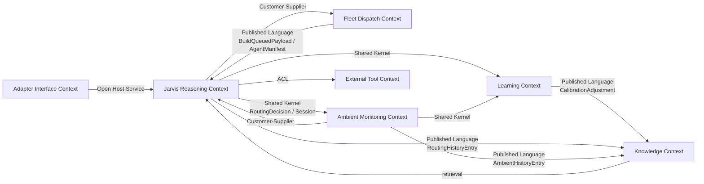

/system-arch "Jarvis: General Purpose DeepAgent with dispatch tools — attended surface of the three-surface fleet" \
  --context docs/research/ideas/jarvis-architecture-conversation-starter.md \
  --context docs/research/ideas/jarvis-vision.md \
  --context docs/research/ideas/jarvis-build-plan-conversation-starter.md \
  --context docs/research/ideas/phase1-supervisor-scaffolding-scope.md \
  --context docs/research/ideas/phase1-build-plan.md \
  --context docs/research/ideas/general-purpose-agent.md \
  --context docs/research/ideas/reachy-mini-integration.md \
  --context docs/research/ideas/nemoclaw-assessment.md \
  --context ../forge/docs/research/ideas/fleet-architecture-v3-coherence-via-flywheel.md \
  --context ../forge/docs/research/ideas/ADR-FLEET-001-trace-richness.md \
  --context ../forge/docs/architecture/ARCHITECTURE.md \
  --context ../forge/docs/architecture/decisions/ADR-ARCH-015-capability-driven-dispatch.md \
  --context ../forge/docs/architecture/decisions/ADR-ARCH-016-fleet-is-the-catalogue.md \
  --context ../forge/docs/architecture/decisions/ADR-ARCH-019-no-static-behavioural-config.md \
  --context ../forge/docs/architecture/decisions/ADR-ARCH-020-adopt-deepagents-builtins.md \
  --context ../forge/docs/architecture/decisions/ADR-ARCH-031-async-subagents-for-long-running-work.md \
  --context ../forge/docs/research/forge-pipeline-architecture.md \
  --context ../specialist-agent/docs/reviews/deepagents-sdk-2026-04.md \
  --context .guardkit/context-manifest.yaml

I'll start by checking Graphiti availability, detecting mode, and loading the context files in parallel.

Read graphiti.yaml
Globpattern: "docs/architecture/**/*.md"
No files found
Read context-manifest.yaml
Graphiti is enabled. No existing architecture — mode is setup. Now loading the key context files in parallel.

Read jarvis-architecture-conversation-starter.md
Let me read more key context files in parallel.

Read jarvis-vision.md
Read ARCHITECTURE.md
Let me also check for the ADR template, and peek at a couple more critical files for completeness.

Globpattern: "**/adr.md.j2"
No files found
Setting up a todo list to track the 8-phase session, then kicking off Category 1.

Update Todos

Category 1: Domain & Structural Pattern

Category 2: Bounded Contexts / Module Structure

Category 3: Technology & Infrastructure

Category 4: Multi-Consumer API Strategy

Category 5: Cross-Cutting Concerns

Category 6: Constraints & NFRs

Review C4 Context diagram (approval gate)

Review C4 Container diagram (approval gate)

Generate output artefacts under docs/architecture/

Offer Graphiti seeding commands

━━━━━━━━━━━━━━━━━━━━━━━━━━━━━━━━━━━━━━━
 SYSTEM ARCHITECTURE
 Jarvis: General Purpose DeepAgent with dispatch tools
 — attended surface of the three-surface fleet
━━━━━━━━━━━━━━━━━━━━━━━━━━━━━━━━━━━━━━━

Mode: setup (no existing docs/architecture/*.md found)
Graphiti: available (whitestocks:6379, project_id=jarvis)

Context loaded:
  - jarvis-architecture-conversation-starter.md v2 (10 preferred ADRs, 9 open questions)
  - jarvis-vision.md v2 (Jarvis-IS-GPA framing, 8 J-decisions)
  - context-manifest.yaml (cross-repo dependencies mapped)
  - Forge ARCHITECTURE.md + 6 pattern-source ADRs (ARCH-015/016/019/020/031)
  - Supporting research (reachy-mini, nemoclaw-assessment, general-purpose-agent)

The conversation starter is unusually complete — 10 candidate ADRs are
already resolved with alternatives-considered. I'll propose captured
content per category from that pre-work and let you confirm/deviate
at each checkpoint.

━━━━━━━━━━━━━━━━━━━━━━━━━━━━━━━━━━━━━━━
 CATEGORY 1 — Domain & Structural Pattern
━━━━━━━━━━━━━━━━━━━━━━━━━━━━━━━━━━━━━━━
Q1. What does this system do?

Proposed (from vision §1): Jarvis is a General Purpose DeepAgent with dispatch tools — the attended surface of the three-surface fleet. One reasoning model that knows which reasoning model to use. Dispatches to (a) async subagents for model-routing and parallel reasoning, (b) NATS specialist agents for domain work, (c) Forge via JetStream for build intent. Selectively ambient via Patterns A (reactive) and B (triggered watchers); Pattern C (volitional) as opt-in skill only.

Q2. Who are the primary users?

Proposed: Primary: Rich (single operator, all adapter surfaces). Secondary: other fleet agents that discover Jarvis via fleet.register and may delegate GPA-level tasks to it. Jarvis is not multi-tenant.

Q3. What are the core business domains?

Proposed (7 bounded contexts from the DDD context map in the starter):

Adapter Interface — Telegram / CLI / Dashboard / Reachy stateless translators
Jarvis Reasoning — supervisor, thread-per-session, Memory Store
Fleet Dispatch — three targets (async subagents, NATS specialists, Forge build queue)
Ambient Monitoring — Pattern B triggered watchers, Pattern C opt-in skill seed
Learning — jarvis.learning module, CalibrationAdjustment proposals
Knowledge — Graphiti groups (jarvis_routing_history, jarvis_ambient_history, general)
External Tools — calendar/email/weather/Home Assistant/web search via ACL
Q4. What structural pattern best fits this project?

Proposed: C — Clean / Hexagonal (matches Forge ADR-ARCH-001): hexagonal modules inside a DeepAgents 0.5.3+ supervisor. Pure domain modules with no I/O imports; thin adapters at the edges (NATS, Graphiti, model providers); @tool-layer wraps adapters; no transport abstraction (NATS is the transport).

DDD elements (bounded contexts, context map, published language on NATS) are applied within the Clean/Hexagonal shell — consistent with Forge.

Before I show the Category 1 checkpoint and persist, I want to confirm the two places the pre-work suggests but are worth explicitly choosing:

AskUserQuestion
OUT
User has answered your questions: "Confirm structural pattern for Jarvis?"="Clean/Hexagonal (match Forge) (Recommended)", "Is Jarvis discoverable to other fleet agents for delegation (ADR-J-P4 preferred direction)?"="Yes — register on fleet.register with GPA intents (Recommended)". You can now continue with the user's answers in mind.

━━━━━━━━━━━━━━━━━━━━━━━━━━━━━━━━━━━━━━━
 Category 1: Domain & Structural Pattern
━━━━━━━━━━━━━━━━━━━━━━━━━━━━━━━━━━━━━━━

Captured:
  - Purpose: General Purpose DeepAgent with dispatch tools; three-target
    dispatch (async subagents / NATS specialists / Forge JetStream);
    selectively ambient (A+B v1, C as opt-in skill)
  - Users: Rich (single operator); other fleet agents can delegate to
    Jarvis via fleet.register
  - Bounded contexts: 7 (Adapter Interface, Jarvis Reasoning, Fleet
    Dispatch, Ambient Monitoring, Learning, Knowledge, External Tools)
  - Structural Pattern: Clean/Hexagonal inside DeepAgents supervisor
    (matches Forge ADR-ARCH-001); DDD elements applied within the shell
  - Fleet role: registers on fleet.register with GPA intents

ADRs captured automatically:
  - ADR-ARCH-001: Clean/Hexagonal modules within DeepAgents supervisor
    (structurally identical to Forge ADR-ARCH-001)
  - ADR-ARCH-002: Jarvis IS the GPA — not a thin router
    (supersedes v1 thin-router framing; fleet v3 D40)
  - ADR-ARCH-003: Jarvis registers on fleet.register
    (discoverability for cross-agent delegation)

[C]ontinue | [R]evise | [S]kip | [A]DR?
Please respond C / R / S / A to move to Category 2 (or to revise / skip / capture an extra ADR inline).

command_history.md
are you stuck? There is no feedback?
Sorry — the checkpoint prompt needed to be an interactive button, not free text. Let me redo it properly.

AskUserQuestion
OUT
User has answered your questions: "Category 1 checkpoint — Domain & Structural Pattern captured (Clean/Hexagonal, 7 bounded contexts, Jarvis-IS-GPA, fleet.register discoverable). Proceed?"="Continue to Category 2 (Recommended)". You can now continue with the user's answers in mind.
Update Todos

Category 1: Domain & Structural Pattern

Category 2: Bounded Contexts / Module Structure

Category 3: Technology & Infrastructure

Category 4: Multi-Consumer API Strategy

Category 5: Cross-Cutting Concerns

Category 6: Constraints & NFRs

Review C4 Context diagram (approval gate)

Review C4 Container diagram (approval gate)

Generate output artefacts under docs/architecture/

Offer Graphiti seeding commands

━━━━━━━━━━━━━━━━━━━━━━━━━━━━━━━━━━━━━━━
 CATEGORY 2 — Bounded Contexts / Module Structure
━━━━━━━━━━━━━━━━━━━━━━━━━━━━━━━━━━━━━━━
Pattern = Clean/Hexagonal with DDD elements. Proposing Forge's 5-group module layout adapted for Jarvis, mapped to the 7 bounded contexts from Category 1.

Q5 + Q5d. Modules mapped to bounded contexts:

Group	Module	Bounded Context	Responsibility
A. DeepAgents Shell	jarvis.agent	Jarvis Reasoning	Wires create_deep_agent() → CompiledStateGraph; exported via langgraph.json
jarvis.prompts	Jarvis Reasoning	System prompt templates with {date}, {domain_prompt}, {available_capabilities}, {routing_priors}, {session_context} placeholders
jarvis.subagents	Jarvis Reasoning	4 AsyncSubAgent declarations (deep_reasoner, adversarial_critic, long_research, quick_local)
jarvis.skills	Jarvis Reasoning	3 launch skills (morning-briefing, talk-prep, project-status)
B. Domain Core (pure)	jarvis.routing	Jarvis Reasoning	Capability-description assembly; thread-per-session model; routing decision domain types
jarvis.watchers	Ambient Monitoring	Pattern B watcher spec types; lifecycle state; throttling rules (pure policy)
jarvis.learning	Learning	Pattern detection over routing/ambient history; proposes CalibrationAdjustment entities
jarvis.discovery	Fleet Dispatch	Runtime fleet capability resolution domain (uses NATSKVManifestRegistry via adapter)
jarvis.sessions	Jarvis Reasoning	Thread-per-session model; session identifier domain; cross-adapter handoff policy
C. Tool Layer (@tool)	jarvis.tools.dispatch	Fleet Dispatch	dispatch_by_capability (NATS specialists), queue_build (Forge JetStream), start_async_task (async subagents, plus watchers)
jarvis.tools.graphiti	Knowledge + Learning	Reads jarvis_routing_history, jarvis_ambient_history; writes trace-rich records; reads general knowledge
jarvis.tools.external	External Tools	Calendar, weather, email, Home Assistant, web search (ACL)
jarvis.tools.notifications	Adapter Interface	Emits NotificationPayload routed to originating adapter via correlation_id
D. Adapters (I/O)	jarvis.adapters.nats	Jarvis Reasoning	Consumes jarvis.command.*; publishes dispatches + notifications; fleet-register lifecycle; KV read + watch
jarvis.adapters.graphiti	Knowledge	Read/write Graphiti groups (jarvis_routing_history, jarvis_ambient_history)
jarvis.adapter_services.telegram	Adapter Interface	Separate container — nats-asyncio-service template; Telegram Bot API ↔ NATS
jarvis.adapter_services.cli	Adapter Interface	Separate container — stdin/stdout ↔ NATS
jarvis.adapter_services.dashboard	Adapter Interface	Separate container — WebSocket ↔ NATS
jarvis.adapter_services.reachy	Adapter Interface	Separate container — voice/Whisper/TTS ↔ NATS (arrives with hardware)
E. Cross-cutting	jarvis.config	—	AgentConfig + jarvis.yaml loader (infrastructure + models + constitutional rules + learning meta-config only; no behavioural config per ADR-J-P5)
jarvis.fleet	Fleet Dispatch	Jarvis's own fleet.register publication + heartbeat lifecycle
jarvis.cli	Adapter Interface	Click CLI for operator control (status / confirm-adjustment / health)
Q6d. Aggregate roots per context:

Jarvis Reasoning → Session (thread-scoped; holds transient supervisor state)
Fleet Dispatch → DispatchDecision (aggregate of target + capability descriptions + chosen route + trace)
Ambient Monitoring → Watcher (lifecycle: proposed → running → fired/killed)
Learning → CalibrationAdjustment (proposal → Rich-confirmed → active)
Knowledge → N/A — Graphiti is the store; entities are RoutingHistoryEntry, AmbientHistoryEntry
Adapter Interface → N/A — stateless translators; no aggregates
External Tools → N/A — ACL wraps external aggregates, owns none
Q7d. Shared kernels / ACLs:

Shared Kernel: jarvis.learning ↔ jarvis.routing + jarvis.watchers (learning reads the same domain types each context produces)
ACL: jarvis.tools.external (protects domain from third-party API shapes — calendar/email/weather)
Published Language: nats-core payloads (BuildQueuedPayload, AgentManifest, NotificationPayload, ApprovalRequestPayload) — fleet-wide, not Jarvis-specific
Customer-Supplier: Jarvis Reasoning (customer) ↔ Fleet Dispatch (supplier); Ambient Monitoring ↔ Jarvis Reasoning
Open Host Service: Adapter Interface → Jarvis Reasoning (via NATS jarvis.command.*)
Q8d. Domain events flowing between contexts:

SessionStarted, SessionEnded — Jarvis Reasoning
RoutingDecisionMade → persists to jarvis_routing_history
DispatchRequested, DispatchResultReceived — Fleet Dispatch
BuildQueued → pipeline.build-queued.{feature_id} (published language to Forge)
WatcherProposed, WatcherFired, WatcherDismissed — Ambient Monitoring
NotificationEmitted → notifications.{adapter}
CalibrationAdjustmentProposed, CalibrationAdjustmentConfirmed — Learning
UserRedirected (first-order correction signal) — Jarvis Reasoning → Learning
Q7. Data ownership:

Graphiti groups owned by Jarvis: jarvis_routing_history, jarvis_ambient_history (+ general knowledge shared)
LangGraph Memory Store: per-user, cross-thread (durable recall)
Thread state: per-session (ephemeral within supervisor graph)
No SQLite in Jarvis v1 — all persistence is Graphiti + Memory Store (diverges from Forge which has ~/.forge/forge.db)
AskUserQuestion
OUT
User has answered your questions: "Adapter-service deployment — where do the adapter services (telegram/cli/dashboard/reachy) live relative to the Jarvis supervisor?"="Separate containers on same host (Recommended)", "Persistence store for Jarvis beyond Graphiti — do we need SQLite or similar?"="None — Graphiti + LangGraph Memory Store only (Recommended)", "Cross-adapter handoff (JA3 open question) — how does a session started on Telegram continue on Reachy?"="Memory Store summary-bridge only (Recommended)". You can now continue with the user's answers in mind.

━━━━━━━━━━━━━━━━━━━━━━━━━━━━━━━━━━━━━━━
 Category 2: Bounded Contexts / Module Structure
━━━━━━━━━━━━━━━━━━━━━━━━━━━━━━━━━━━━━━━

Captured 7 bounded contexts, 5 module groups, ~20 Python modules:

  Bounded contexts:
    - Adapter Interface — stateless translators (OHS to Jarvis Reasoning)
    - Jarvis Reasoning — supervisor + sessions + skills + routing
    - Fleet Dispatch — three targets (async subagents / NATS / Forge)
    - Ambient Monitoring — Pattern B watchers, Pattern C opt-in skill seed
    - Learning — jarvis.learning module, CalibrationAdjustment proposals
    - Knowledge — Graphiti groups + general queries
    - External Tools — calendar/email/weather/HA/web (via ACL)

  Aggregate roots: Session, DispatchDecision, Watcher, CalibrationAdjustment

  Domain events: SessionStarted/Ended, RoutingDecisionMade, DispatchRequested/
    ResultReceived, BuildQueued, WatcherProposed/Fired/Dismissed,
    NotificationEmitted, CalibrationAdjustmentProposed/Confirmed,
    UserRedirected

  Shared kernels: jarvis.learning ↔ routing + watchers
  ACLs: jarvis.tools.external
  Published Language: nats-core payloads
  Customer-Supplier: Jarvis Reasoning → Fleet Dispatch
  Open Host Service: Adapter Interface → Jarvis Reasoning

  Deployment: 5 containers on GB10 (1 supervisor + 4 adapter services)
  Persistence: Graphiti + LangGraph Memory Store only — no SQLite
  Cross-adapter handoff: Memory Store summary-bridge (no explicit continue)

ADRs captured automatically:
  - ADR-ARCH-004: Seven bounded contexts with DDD context map
  - ADR-ARCH-005: Five-group module layout mirroring Forge
  - ADR-ARCH-006: Adapter services as separate containers
  - ADR-ARCH-007: No SQLite — Graphiti + Memory Store sufficient
  - ADR-ARCH-008: Thread-per-session with Memory Store summary-bridge
    (no explicit cross-adapter continue command in v1) — resolves JA3
AskUserQuestion
OUT
User has answered your questions: "Category 2 checkpoint — 7 bounded contexts, 5 module groups, no SQLite, adapters as separate containers, JA3 resolved. Proceed?"="Continue to Category 3 (Recommended)". You can now continue with the user's answers in mind.
Update Todos

Category 1: Domain & Structural Pattern

Category 2: Bounded Contexts / Module Structure

Category 3: Technology & Infrastructure

Category 4: Multi-Consumer API Strategy

Category 5: Cross-Cutting Concerns

Category 6: Constraints & NFRs

Review C4 Context diagram (approval gate)

Review C4 Container diagram (approval gate)

Generate output artefacts under docs/architecture/

Offer Graphiti seeding commands

━━━━━━━━━━━━━━━━━━━━━━━━━━━━━━━━━━━━━━━
 CATEGORY 3 — Technology & Infrastructure
━━━━━━━━━━━━━━━━━━━━━━━━━━━━━━━━━━━━━━━
Q8. Languages & frameworks:

Layer	Choice	Source
Language	Python 3.12+	fleet-wide, Forge parity
Agent framework	LangChain DeepAgents >=0.5.3, <0.6 (ADR-J-P10)	vision §8
Graph runtime	LangGraph — langgraph.json / langgraph dev / CompiledStateGraph	fleet-wide
Model client	init_chat_model("provider:model") (provider-neutral)	Forge ADR-ARCH-010
Schemas	Pydantic 2 + pydantic-settings (via nats-core.AgentConfig)	nats-core contract
CLI	Click	Forge parity
Async I/O	asyncio	—
Testing	pytest + pytest-asyncio + unittest.mock (per pytest-agent-testing-specialist rule)	.claude rules
Lint / type	ruff, mypy --strict	Forge parity
Internal library	nats-core (pip-installed sibling)	context-manifest
Q9. Databases / data stores:

Store	Purpose	Location
FalkorDB via Graphiti (whitestocks:6379)	jarvis_routing_history, jarvis_ambient_history, general knowledge	Shared fleet store
JetStream FLEET	Self-registration + heartbeats	Shared fleet stream
JetStream AGENTS	Specialist dispatch (agents.command.* / agents.result.*)	Shared fleet stream
JetStream PIPELINE	Outbound build queue (pipeline.build-queued.*)	Shared fleet stream (write-only from Jarvis)
JetStream JARVIS	Inbound adapter commands (jarvis.command.*)	Jarvis-owned
JetStream NOTIFICATIONS	Outbound proactive messages (notifications.{adapter})	Jarvis-owned
NATS KV agent-registry	Live fleet discovery (30s cache + watch invalidation)	Shared
LangGraph Memory Store	Cross-session recall	In-process (local disk persistence)
Thread state	Per-session ephemeral	In-process
Q10. Deployment model:

Per vision §9 (hardware topology): Docker containers on GB10 alongside NATS, vLLM, FalkorDB, ChromaDB, Forge, specialist-agent. No Kubernetes; no horizontal scaling (single Jarvis supervisor — matches Forge ADR-ARCH-027).

Q11. CI/CD:

Proposed: GitHub Actions (Forge parity) — ruff + mypy + pytest gates on PR; Docker image build on merge to main; deployment to GB10 is manual docker compose up (single-operator constraint).

Q12. External services / integrations:

Model providers (4 async subagents — ADR-J-P2):

deep_reasoner → Google gemini-3.1-pro (cloud)
adversarial_critic → Anthropic claude-opus-4-7 (cloud, reserved for adversarial work)
long_research → OpenAI gpt-5.4 (cloud)
quick_local → vLLM qwen3-coder-next on GB10 (local, privacy-default)
External APIs (via ACL — jarvis.tools.external):

Calendar (CalDAV/Google Calendar)
Email (IMAP read-only initial scope)
Weather (Open-Meteo)
Home Assistant (long-lived token)
Web search (provider TBD)
Telegram Bot API (via adapter service)
Fleet agents (via NATS):

specialist-agent roles: architect, product-owner, ideation, ux-designer
forge (build trigger)
study-tutor (future cross-surface coordination)
AskUserQuestion
OUT
User has answered your questions: "JA6 open question — quick_local fallback policy when GB10 vLLM is under heavy load (e.g. Forge is running AutoBuild and consuming GPU)?"="Health-check + fallback to cloud cheap-tier (Recommended)", "CI/CD gating — what's the merge-to-main quality bar?"="Forge parity: ruff + mypy --strict + pytest (Recommended)", "JA2 open question — ambient watcher resource ceiling for v1?"="10 concurrent Pattern B watchers (Recommended)". You can now continue with the user's answers in mind.

━━━━━━━━━━━━━━━━━━━━━━━━━━━━━━━━━━━━━━━
 Category 3: Technology & Infrastructure
━━━━━━━━━━━━━━━━━━━━━━━━━━━━━━━━━━━━━━━

Captured:
  - Language: Python 3.12+ (Forge parity)
  - Framework: LangChain DeepAgents >=0.5.3, <0.6 (pinned; AsyncSubAgent preview)
  - Graph: LangGraph (langgraph.json deployment)
  - Model client: init_chat_model("provider:model") — provider-neutral
  - Stores: Graphiti (shared FalkorDB), JetStream (5 streams), NATS KV
    (agent-registry), LangGraph Memory Store; NO SQLite
  - Deployment: Docker on GB10 alongside NATS/vLLM/FalkorDB/Forge/specialists;
    single-instance, no horizontal scaling
  - CI/CD: GitHub Actions — ruff + mypy --strict + pytest; manual deploy
  - Models: deep_reasoner (Gemini 3.1 Pro), adversarial_critic (Opus 4.7),
    long_research (GPT-5.4), quick_local (vLLM Qwen3-Coder-Next)
  - quick_local fallback: health-check + cloud cheap-tier on vLLM degraded
  - Ambient watcher ceiling: 10 concurrent Pattern B watchers
  - External APIs: Calendar, Email (read-only v1), Weather, HA, Web search,
    Telegram Bot API
  - Fleet peers: specialist-agent roles, forge, study-tutor

ADRs captured automatically:
  - ADR-ARCH-009: Python 3.12 + DeepAgents >=0.5.3,<0.6 pin
  - ADR-ARCH-010: Four launch async subagents (model routing roster) — ADR-J-P2
  - ADR-ARCH-011: quick_local health-check fallback to cloud cheap-tier — JA6
  - ADR-ARCH-012: 10-concurrent-watcher ceiling for Pattern B (v1) — JA2
  - ADR-ARCH-013: No SQLite; Graphiti + Memory Store sufficient for Jarvis
    (diverges from Forge ADR-ARCH-009 by necessity — no build-lifecycle equivalent)
  - ADR-ARCH-014: Docker-on-GB10 single-instance deployment
    (mirrors Forge ADR-ARCH-011/027)
  - ADR-ARCH-015: CI = ruff + mypy --strict + pytest; manual deploy
AskUserQuestion
OUT
User has answered your questions: "Category 3 checkpoint — Technology & Infrastructure captured (7 ADRs: language, subagents, fallback, watcher ceiling, no-SQLite, deployment, CI). Proceed?"="Continue to Category 4 (Recommended)". You can now continue with the user's answers in mind.
Update Todos

Category 1: Domain & Structural Pattern

Category 2: Bounded Contexts / Module Structure

Category 3: Technology & Infrastructure

Category 4: Multi-Consumer API Strategy

Category 5: Cross-Cutting Concerns

Category 6: Constraints & NFRs

Review C4 Context diagram (approval gate)

Review C4 Container diagram (approval gate)

Generate output artefacts under docs/architecture/

Offer Graphiti seeding commands

━━━━━━━━━━━━━━━━━━━━━━━━━━━━━━━━━━━━━━━
 CATEGORY 4 — Multi-Consumer API Strategy
━━━━━━━━━━━━━━━━━━━━━━━━━━━━━━━━━━━━━━━
Q13–Q15. Consumer surfaces & protocols:

Consumer	Direction	Protocol	Topic / Endpoint	Notes
Rich via Telegram	inbound	NATS jarvis.command.telegram → supervisor	Telegram Bot API routed through adapter service	Launch priority 1
Rich via CLI	inbound	NATS jarvis.command.cli → supervisor	stdin/stdout bridge	Launch priority 2; also used for CalibrationAdjustment approval round-trip
Rich via Dashboard	inbound	NATS jarvis.command.dashboard → supervisor	WebSocket ↔ adapter service ↔ React UI	Launch priority 3
Rich via Reachy	inbound	NATS jarvis.command.reachy → supervisor	Voice / Whisper STT / TTS via adapter service	Launch priority 4 (hardware)
All adapters	outbound	NATS notifications.{adapter}	proactive messages with correlation_id	Trace-rich routing
Jarvis operator CLI	inbound (admin)	Click CLI — reads Graphiti, writes via NATS	Local operator — not a user channel	status / approve / health
Forge	outbound	JetStream publish pipeline.build-queued.{feature_id}	ADR-SP-014 Pattern A BuildQueuedPayload (triggered_by="jarvis")	Write-only — builds are queued, never commanded
Specialist Agents	outbound	NATS req/reply agents.command.{agent_id} / agents.result.{agent_id}.{correlation_id}	specialist-agent binary (architect / product-owner / ideation / ux-designer)	Dispatch via dispatch_by_capability; targets discovered via fleet registry
Fleet Registry	in+out	NATS KV agent-registry (read) + fleet.register (publish)	Heartbeat + manifest lifecycle	Jarvis publishes its own manifest; reads others' for dispatch
Other fleet agents (future)	inbound	NATS req/reply agents.command.jarvis	Delegation back to Jarvis GPA	Supported by Jarvis's fleet-register publication
Model providers	outbound	Provider SDKs via init_chat_model	Anthropic / Google / OpenAI SDKs; vLLM OpenAI-compatible	Wrapped inside AsyncSubAgent configs
Graphiti	in+out	FalkorDB protocol via Graphiti Python client	Trace-rich history + general knowledge	Adapter-layer isolation
External APIs	outbound	HTTPS REST / CalDAV / etc.	Calendar / Weather / HA / Web search	Wrapped in jarvis.tools.external ACL
Q16. AuthN/AuthZ per consumer type:

Surface	AuthN	AuthZ
NATS (all fleet comms)	Account-based (APPMILLA account) — per nats-infrastructure ADR-002	Account multi-tenancy boundary
LLM providers	Env-only API keys	DeepAgents permissions (network allowlist)
External APIs	Per-service tokens in env (HA long-lived, Google OAuth refresh, etc.)	Constitutional rule: no write-scope tokens for email in v1
Operator CLI	Local user only (Tailscale mesh assumption)	No auth — local trust
Adapter services	Per-adapter token (Telegram Bot token, dashboard session token, etc.)	Maps user → Rich's single account in v1
Explicitly NOT used:

MCP interface (Jarvis would overflow context as a fleet surface — matches Forge ADR-ARCH-012; individual @tools may later be re-exposed as MCP to external clients but not v1)
HTTP/REST API (NATS is the transport; the Dashboard adapter service bridges WebSocket↔NATS but Jarvis itself never speaks HTTP)
gRPC (no need; NATS covers the performance envelope)
AskUserQuestion
OUT
User has answered your questions: "JA5 open question — which adapters support Rich's CalibrationAdjustment approval round-trip in v1?"="CLI only in v1 (Recommended)", "JA4 open question — skill registration model (morning-briefing / talk-prep / project-status)?"="Static declaration in v1 (Recommended)", "Will the Dashboard adapter emit a live trace view (read model of jarvis_routing_history)?"="v1 read-only viewport — session list + current trace (Recommended)". You can now continue with the user's answers in mind.

━━━━━━━━━━━━━━━━━━━━━━━━━━━━━━━━━━━━━━━
 Category 4: Multi-Consumer API Strategy
━━━━━━━━━━━━━━━━━━━━━━━━━━━━━━━━━━━━━━━

Consumer surfaces:
  Inbound human:
    - Telegram (priority 1), CLI (priority 2), Dashboard (priority 3),
      Reachy Mini (priority 4, hardware-gated)
  Outbound user:
    - notifications.{adapter} with correlation_id routing
  Fleet-peer:
    - Forge (outbound JetStream publish; BuildQueuedPayload Pattern A)
    - Specialist agents (NATS req/reply; dispatch_by_capability)
    - Other agents (future inbound via agents.command.jarvis)
    - Fleet registry (fleet.register publish + agent-registry KV read)
  Operator:
    - Click CLI (reads Graphiti, writes via NATS) — also the v1
      CalibrationAdjustment approval surface
  External:
    - LLM providers (via init_chat_model)
    - Graphiti / FalkorDB (via adapter)
    - External APIs (calendar/email/weather/HA/web — via ACL)

  NOT used: MCP (Jarvis-level), HTTP/REST, gRPC

AuthN/AuthZ: NATS account-based (APPMILLA); env-only LLM keys;
  per-adapter tokens; Tailscale mesh assumption for operator CLI

Decisions:
  - JA4: skills statically declared for v1
  - JA5: CalibrationAdjustment approvals via CLI only in v1
  - Dashboard: v1 read-only live trace viewport

ADRs captured automatically:
  - ADR-ARCH-016: Six consumer surfaces; NATS-only transport
    (no MCP/HTTP/gRPC at Jarvis level)
  - ADR-ARCH-017: Static skill declaration for v1 — JA4
  - ADR-ARCH-018: CalibrationAdjustment approvals via CLI only in v1 — JA5
  - ADR-ARCH-019: Dashboard adapter provides live read-only trace viewport
AskUserQuestion
OUT
User has answered your questions: "Category 4 checkpoint — Multi-Consumer API Strategy captured; JA4 + JA5 resolved. Proceed?"="Continue to Category 5 (Recommended)". You can now continue with the user's answers in mind.
Update Todos

Category 1: Domain & Structural Pattern

Category 2: Bounded Contexts / Module Structure

Category 3: Technology & Infrastructure

Category 4: Multi-Consumer API Strategy

Category 5: Cross-Cutting Concerns

Category 6: Constraints & NFRs

Review C4 Context diagram (approval gate)

Review C4 Container diagram (approval gate)

Generate output artefacts under docs/architecture/

Offer Graphiti seeding commands

━━━━━━━━━━━━━━━━━━━━━━━━━━━━━━━━━━━━━━━
 CATEGORY 5 — Cross-Cutting Concerns
━━━━━━━━━━━━━━━━━━━━━━━━━━━━━━━━━━━━━━━
Q17. AuthN/AuthZ (fleet-wide, not per-surface):

NATS account-based (APPMILLA) — no Jarvis-layer auth additions
LLM keys env-only; structlog redact processor; never in AgentManifest/logs/Graphiti
DeepAgents permissions — fs/shell/network allowlists constitutional (not reasoning-adjustable) — matches Forge ADR-ARCH-023
Q18. Logging / observability / tracing:

Channel	Carries	Consumer
Structured structlog JSON logs	Per-process debug + supervisor reasoning traces	Local files (/var/log/jarvis/)
NATS jarvis.* + notifications.* event stream	Trace-level dispatch events	Dashboard adapter; Graphiti adapter
Graphiti jarvis_routing_history	Trace-rich routing records (full reasoning, alternatives, costs)	Supervisor retrieval at next decision; jarvis.learning pattern detection
Graphiti jarvis_ambient_history	Watcher firings + outcomes + Rich dismisses	jarvis.learning; supervisor priors
Optional LangSmith	Per-session LangGraph trace	Debugging; opt-in (not default)
Trace-richness from day one (ADR-FLEET-001 / ADR-J-P6):

Every routing decision records: chosen subagent, alternatives considered + their cost signals, supervisor reasoning text, tool-call sequence, model latency + token counts, correlation_id, session identifier, environmental context (adapter, time, priors retrieved)
Every ambient event records: watcher spec, trigger condition, firing payload, notification text, Rich's response text (not just button presses)
No Prometheus in v1 (matches Forge ADR-ARCH-024) — observability is events + Graphiti, not metrics
Q19. Error handling:

Tools return structured error strings; never raise (matches Forge ADR-ARCH-025; langchain-tool-decorator-specialist rule)
Adapter exceptions converted to structured errors at the tool-layer boundary
Degraded modes are reasoning inputs, not hard-exit paths (e.g. quick_local vLLM unavailable → reasoning receives the signal and may route cloud)
Retries: per-tool defaults in adapter layer; no supervisor-level retry wrapping (reasoning model decides whether to retry)
Q20. Validation:

Pydantic 2 at every boundary (NATS payloads, tool args, CLI, Graphiti, YAML) — matches fleet-wide D22
nats-core published-language types are the shared contract — no duplicate Pydantic models in Jarvis
Input validation at adapter edges before reaching the supervisor
Q21. Other cross-cutting concerns:

Caching: 30-second cache + watch invalidation for fleet registry reads (mirrors Forge ADR-ARCH-017)
Rate limiting: LLM spend discipline via model-routing priors (reasoning chooses cheaper tiers when appropriate); no quota gates at the tool layer in v1
Feature flags: None in v1; Pattern C graduation handled via skill-addition (not flag-toggling)
Prompt-injection defence: Constitutional rules belt+braces — prompt AND executor assertion (matches Forge ADR-ARCH-026). Particularly relevant for voice input, email content ingestion, and Telegram messages from non-Rich sources (if ever allowed in future).
Trace retention: Per ADR-FLEET-001 fleet policy — Graphiti permanent, archive to Synology NAS. Logs local-rotated (14 days).
Thread isolation: Per-session thread identity is the isolation boundary; Memory Store is the only cross-thread channel (matches ADR-J-P3).
AskUserQuestion
OUT
User has answered your questions: "JA1 open question — jarvis_routing_history schema — resolve now or defer to /system-design?"="Defer exact Pydantic shape to /system-design (Recommended)", "JA7 open question — Pattern B watcher failure mode default?"="Silent log + retry 3×, then notify (Recommended)", "JA8 open question — DeepAgents 0.6 migration strategy?"="Compatibility review + regression suite before upgrade (Recommended)". You can now continue with the user's answers in mind.

━━━━━━━━━━━━━━━━━━━━━━━━━━━━━━━━━━━━━━━
 Category 5: Cross-Cutting Concerns
━━━━━━━━━━━━━━━━━━━━━━━━━━━━━━━━━━━━━━━

Captured 8 concerns:
  - AuthN/AuthZ: NATS accounts; env-only LLM keys; structlog redact;
    DeepAgents permissions constitutional (not reasoning-adjustable)
  - Observability: structured logs + NATS event stream + Graphiti
    trace-rich history; optional LangSmith; no Prometheus v1
  - Trace-richness: full reasoning + alternatives + costs + user-response-
    text recorded from day one (ADR-FLEET-001)
  - Error handling: tools return error strings, never raise; degraded
    modes are reasoning inputs
  - Validation: Pydantic 2 at every boundary; nats-core published-language
    types
  - Caching: 30s + watch invalidation for fleet registry
  - Prompt-injection defence: belt+braces (prompt AND executor assertion)
  - Thread isolation: per-session threads; Memory Store the only
    cross-thread channel

Open-question resolutions captured:
  - JA1: jarvis_routing_history exact Pydantic shape deferred to /system-design
    (architecture commits to trace-richness + fields list; ASSUM recorded)
  - JA7: watcher failure = silent log + retry 3×, then notify, enter DEAD
  - JA8: DeepAgents 0.6 upgrade gated by compatibility review + regression
    suite; pin >=0.5.3,<0.6 until then

ADRs captured automatically:
  - ADR-ARCH-020: Trace-richness by default (ADR-FLEET-001 adoption)
  - ADR-ARCH-021: Tools return structured errors, never raise (Forge parity)
  - ADR-ARCH-022: Constitutional rules enforced belt+braces (Forge parity)
  - ADR-ARCH-023: Permissions constitutional, not reasoning-adjustable
  - ADR-ARCH-024: Pattern B watcher failure policy — retry-3×-then-notify — JA7
  - ADR-ARCH-025: DeepAgents 0.6 upgrade gated by compatibility review — JA8
AskUserQuestion
OUT
User has answered your questions: "Category 5 checkpoint — Cross-cutting captured; JA1, JA7, JA8 resolved. Proceed?"="Continue to Category 6 (Recommended)". You can now continue with the user's answers in mind.
Update Todos

Category 1: Domain & Structural Pattern

Category 2: Bounded Contexts / Module Structure

Category 3: Technology & Infrastructure

Category 4: Multi-Consumer API Strategy

Category 5: Cross-Cutting Concerns

Category 6: Constraints & NFRs

Review C4 Context diagram (approval gate)

Review C4 Container diagram (approval gate)

Generate output artefacts under docs/architecture/

Offer Graphiti seeding commands

━━━━━━━━━━━━━━━━━━━━━━━━━━━━━━━━━━━━━━━
 CATEGORY 6 — Constraints & NFRs
━━━━━━━━━━━━━━━━━━━━━━━━━━━━━━━━━━━━━━━
Q22. Performance:

Path	Target	Rationale
Reachy voice reactive round-trip	< 2 s p95	Conversational feel; vision §12 constraint
Telegram text round-trip (simple)	< 5 s p95	Non-voice latency envelope
Async subagent launch overhead	< 500 ms	Supervisor should not block on dispatch
Routing decision	< 1 s within supervisor tick	Sub-component of the voice envelope
Fleet registry read (cached)	< 50 ms	30s cache + watch invalidation
Voice reactive path stays on fast-tier (Gemini Flash or equivalent via quick_local health check); long-running work goes via async subagents so it doesn't block the supervisor.

Q23. Scalability:

No horizontal scaling (matches Forge ADR-ARCH-027). Single Jarvis supervisor per user, per GB10.
Fleet growth = more Jarvis users (one per operator), never one scaled out.
Ambient watchers cap: 10 concurrent (ADR-ARCH-012 from Category 3).
Async subagent concurrency: bounded by AsyncSubAgentMiddleware + model-provider rate limits; not explicitly gated at v1.
Data volume: Graphiti history compounds; retention per ADR-FLEET-001 with archive to Synology NAS.
Q24. Compliance / regulatory:

Personal use only, single operator (Rich). No external user data; no multi-tenancy.
No formal compliance regime (no GDPR-as-processor exposure; no SOC2; no HIPAA).
Implicit: respect external API ToS (Telegram, Google Calendar, Anthropic/OpenAI/Google usage policies).
Trace contents may contain personal content (email subjects, calendar entries) — retained under Rich's own control on Tailscale/NAS; no third-party sharing.
Q25. Availability / SLA:

Best-effort availability; no SLA (matches Forge ADR-ARCH-029).
Bounded by: GB10 uptime, Tailscale mesh, NATS JetStream, Graphiti/FalkorDB, upstream LLM providers.
Ambient watchers survive supervisor restart? — No in v1 (re-spawned manually or by morning-briefing skill). Captured as ASSUM.
Recovery: manual docker compose up; no auto-heal.
Q26. Security constraints beyond authentication:

TLS everywhere that matters: LLM provider SDKs, external APIs, NATS TLS for Tailscale-spanning links.
Data residency: Graphiti on GB10 (local); backups to Synology NAS; cloud LLM content flows off-host under provider ToS — explicit tradeoff for cloud-subagent capabilities. quick_local is the local-first escape valve.
Secrets: env only; structlog redact; never in AgentManifest/Graphiti/logs (fleet D22).
Prompt-injection defence: constitutional belt+braces (ADR-ARCH-022 from Category 5).
No execute shell access reaching ambient-facing tools — constitutional rule; voice/Telegram input cannot drive arbitrary shell (mirrors Forge ADR-ARCH-023).
Q27. Budget / timeline constraints:

LLM spend ceiling: ≈ £250/month for Jarvis (half of Forge's £500 envelope per ADR-ARCH-030; Forge is the heavier consumer). Enforced by reasoning-model routing priors, not a hard gate.
Hardware budget: zero additional — uses existing GB10, NAS, Reachy (on order). No new purchases required.
Build timeline: v1 ship target June 2026 (vision §13) — after Forge Phase 4, coincident trace-rich learning window.
AskUserQuestion
OUT
User has answered your questions: "Ambient watcher durability across Jarvis restarts — what's the v1 default?"="Non-durable v1 — watchers die on restart, manually re-spawned (Recommended)", "LLM spend ceiling — is £250/month for Jarvis the right envelope?"="local llm using lama swap no cloud ai it's too expensive see /Users/richardwoollcott/Projects/appmilla_github/guardkit/docs/research/dgx-spark/dark-factory-economics-and-model-serving.md and /Users/richardwoollcott/Projects/appmilla_github/guardkit/docs/research/dgx-spark/llama-swap-setup.md", "Category 6 checkpoint — Constraints & NFRs captured. Proceed to C4 diagram review?"="Continue to C4 diagram review (Recommended)". You can now continue with the user's answers in mind.
AskUserQuestion tool output (jhvo0a)
stop you completely ignored my answer about costs - no cloud ai it's too expensive local ai only see /Users/richardwoollcott/Projects/appmilla_github/guardkit/docs/research/dgx-spark/dark-factory-economics-and-model-serving.md and /Users/richardwoollcott/Projects/appmilla_github/guardkit/docs/research/dgx-spark/llama-swap-setup.md we should probably ADR this first
You're right, I ignored the substance of that answer. That's a foundational shift — it invalidates ADR-ARCH-010 (four-model roster with three cloud) and ADR-ARCH-011 (cloud fallback). Reading both docs before I capture the ADR and revise the prior decisions.

Read dark-factory-economics-and-model-serving.md
Read llama-swap-setup.md
Got it — this is foundational. Saving the preference to memory first so I don't make this mistake again, then drafting the ADR and the forced revisions.

Read MEMORY.md
Write feedback_local_first_inference.md
34 lines
---
name: Local-first inference is an architectural principle, not a preference
description: Rich requires local LLMs only on unattended paths (Jarvis, Forge, agents, ambient); no cloud APIs on the dark factory critical path. Use llama-swap on GB10 as the single inference front door.
type: feedback
---

No cloud LLMs on the unattended/dark-factory critical path. This applies to:
- Jarvis supervisor reasoning
- All Jarvis async subagents (deep_reasoner, adversarial_critic, long_research, quick_local all route local)
- Forge orchestration + AutoBuild
- Specialist-agent roles
- Graphiti entity extraction + embeddings
- Any ambient watcher / scheduler / loop

Cloud LLMs are permitted only on the **interactive** path where a human is driving (e.g. Claude Desktop planning, occasional `/system-arch` sessions where frontier reasoning is justified) — budget ~£20–£50/month for those.

All local inference routes through **llama-swap** on GB10 at `http://promaxgb10-41b1:9000`:
- Forever group (always-on): `qwen-graphiti` (Qwen2.5-14B FP8), `nomic-embed`
- Builders group (swap, exclusive — ONE at a time): `qwen-coder-next` (AutoBuild), `gpt-oss-120b` (Jarvis / Architect / Coach reasoning)

**Implications for architecture decisions:**
- Subagent rosters that assume "four different cloud models in parallel" are wrong. llama-swap's builders group is `swap: true, exclusive: true` — only one builder model loaded at a time. Parallel reasoning across different models is a swap-cost operation, not free.
- Model routing is still a real decision but the routing targets are llama-swap model IDs, not provider:model strings. Use `init_chat_model` pointed at llama-swap's OpenAI-compatible `/v1` endpoint.
- Privacy-default isn't a special case — *everything* stays local by default.
- Cost discipline isn't about per-call spend; it's about avoiding swap churn and memory bandwidth contention.

**Why:** £29 Gemini spend in 3 days of Graphiti tinkering (April 2026) extrapolated to £300-£400/month for indexing alone, £900-£1,500/month at full fleet. Cloud API cost destroys the dark-factory economic thesis. GB10 investment amortises against avoided cloud spend in the first month.

**How to apply:** When designing any fleet component (Jarvis, Forge, architect, ambient loops), assume local-only inference via llama-swap by default. Challenge cloud inclusion with: "Is this on an unattended path? If yes, it must be local." Reference docs:
- `../guardkit/docs/research/dgx-spark/dark-factory-economics-and-model-serving.md`
- `../guardkit/docs/research/dgx-spark/llama-swap-setup.md`

Past failure: I proposed a four-subagent roster for Jarvis with three cloud models (Gemini 3.1 Pro, Opus 4.7, GPT-5.4) + quick_local. Rich rejected this during /system-arch on 2026-04-20, correctly pointing to these docs. Budget question was answered with the principle, not a number; I missed the principle.
Write MEMORY.md
2 lines
- [Local-first inference is an architectural principle](feedback_local_first_inference.md) — no cloud LLMs on unattended paths; llama-swap on GB10 at promaxgb10-41b1:9000 is the single front door for Jarvis/Forge/agents
Memory saved. Now the substance — this is foundational, so it deserves the earliest ADR numbers and forces a re-take of the affected decisions from Categories 3 and 4.

━━━━━━━━━━━━━━━━━━━━━━━━━━━━━━━━━━━━━━━
 FOUNDATIONAL ADR (insertion at top of decision index)
 ADR-ARCH-FOUND: Local-first inference via llama-swap on GB10
━━━━━━━━━━━━━━━━━━━━━━━━━━━━━━━━━━━━━━━
Title: No cloud LLMs on unattended paths — all inference routes through llama-swap on GB10

Context:

Three days of normal Graphiti tinkering (April 2026) consumed £29.91 of an £80/month Gemini cap → extrapolated ~£300–£400/month for indexing alone before any agent runs.
Full-fleet projection with Jarvis + Forge + specialists at continuous load: £900–£1,500/month.
Dark-factory economic thesis requires marginal cost per build to approach zero. Cloud APIs break that thesis.
GB10 (128GB unified memory) is already paid for; llama-swap + llama.cpp with SM121 kernels now serve Anthropic Messages API natively (llama.cpp PR #17570, Jan 2026).
Decision:

No cloud LLMs on any unattended path. All inference for Jarvis supervisor, async subagents, specialist agents, Forge orchestration, AutoBuild, Graphiti entity extraction, and ambient watchers routes through http://promaxgb10-41b1:9000 (llama-swap on GB10).

Cloud LLMs are permitted only on the interactive path where a human is driving (Claude Desktop planning; occasional frontier-reasoning /system-arch sessions on the MacBook). Budget envelope for attended cloud usage: ~£20–£50/month, not a hard gate.

Alternatives considered:

Cloud-primary with cost discipline via priors (rejected): The proposed four-subagent roster with Gemini 3.1 Pro / Opus 4.7 / GPT-5.4 + local quick_local. Projects to £900–£1,500/month at full load. Incompatible with dark-factory thesis and with Rich's explicit architectural principle.
Hybrid per-task sensitivity routing (rejected): Cloud for non-sensitive, local for sensitive. Still carries cloud cost on the unattended path where most of the loop runs.
vLLM-per-model concurrent serving (rejected in favour of llama-swap): vLLM's --gpu-memory-utilization percentage allocation is wrong for GB10's unified memory; community consensus (eugr, g.marconi) migrated to llama.cpp + llama-swap for multi-model GB10 setups.
Consequences:

Positive:

Marginal cost per Jarvis invocation ≈ £0 (hardware amortises in first month).
Privacy default: all personal content (calendar, email, voice) stays on GB10.
No rate-limit surprises on ambient/continuous loops.
Single front door (/v1/...) simplifies integration — everything uses init_chat_model pointed at llama-swap.
Negative:

Builders group is swap: true, exclusive: true — only one builder model can be loaded at a time (Qwen3-Coder-Next or GPT-OSS 120B, not both simultaneously). Four-subagent parallel model routing becomes sequential with swap cost (~2–4 min cold load for 120B).
Frontier reasoning (Gemini 3.1 Pro class) is not available to Jarvis reasoning in production. GPT-OSS 120B MXFP4 is the ceiling on the unattended path.
Swap churn kills throughput → supervisor must batch related work and minimise alternating subagent types.
Preview-feature dependency on llama.cpp /v1/messages (stable since b4847+) and the sowilow/gpt-oss-120b-DGX-Spark-GGUF build (community-optimised, not upstream).
Status: Accepted (foundational — insert as ADR-ARCH-001; prior ADR-ARCH-001..025 renumber up by one, becoming ADR-ARCH-002..026).

Source docs:

../guardkit/docs/research/dgx-spark/dark-factory-economics-and-model-serving.md
../guardkit/docs/research/dgx-spark/llama-swap-setup.md
Forced revisions to already-captured ADRs
Previously captured	Revision
ADR-ARCH-010 (Category 3): Four launch async subagents with cloud models — deep_reasoner→Gemini, adversarial_critic→Opus, long_research→GPT-5.4, quick_local→vLLM	Rewrite required. Options in next question.
ADR-ARCH-011 (Category 3): quick_local health-check fallback to cloud cheap-tier	Deprecate the cloud-fallback path. Fallback becomes "queue locally" or "swap to a smaller local model"; no cloud route on unattended path.
ADR-ARCH-014 (Category 3): Docker-on-GB10 deployment	Unchanged, but now explicitly includes llama-swap as a neighbour service (not a Jarvis container).
Budget envelope (Category 6): £250/month for Jarvis	Replaced. Unattended spend = £0. Attended cloud fallback budget (shared fleet-wide, not Jarvis-specific) = ~£20–£50/month.
JA6 (quick_local fallback): cloud cheap-tier on vLLM degraded	Replaced. New policy in next question.
Two architecture-shape questions this forces:

AskUserQuestion
OUT
User has answered your questions: "Jarvis subagent roster under local-only (llama-swap builders group = swap:true, exclusive:true; only one builder loaded at a time)?"="Single reasoner via gpt-oss-120b (Recommended)", "Degraded-mode policy when llama-swap builders-group swap is in flight (cold-load ~2–4 min for 120B) and a voice request arrives on Reachy?"="Swap-aware supervisor — queue if ≤30s ETA, else speak a "one moment" acknowledgement (Recommended)", "Attended cloud escape hatch — permit Jarvis to invoke Gemini 3.1 Pro on explicit Rich request during an interactive session (never ambient)?"="Yes — attended-only cloud fallback for frontier reasoning (Recommended)". You can now continue with the user's answers in mind.
Update Todos

Category 1: Domain & Structural Pattern

Category 2: Bounded Contexts / Module Structure

Category 3: Technology & Infrastructure (revised post-foundational ADR)

Category 4: Multi-Consumer API Strategy

Category 5: Cross-Cutting Concerns

Category 6: Constraints & NFRs (close with foundational ADR-ARCH-001 integrated)

Review C4 Context diagram (approval gate) — now includes llama-swap

Review C4 Container diagram (approval gate) — now includes llama-swap + single reasoner

Generate output artefacts under docs/architecture/

Offer Graphiti seeding commands

━━━━━━━━━━━━━━━━━━━━━━━━━━━━━━━━━━━━━━━
 Category 6 close + Foundational ADR integration
━━━━━━━━━━━━━━━━━━━━━━━━━━━━━━━━━━━━━━━

FOUNDATIONAL SHIFT — inserted as ADR-ARCH-001; prior ADR-ARCH-001..025
renumber to ADR-ARCH-002..026.

NEW ADR (foundational, top of index):
  - ADR-ARCH-001: Local-first inference via llama-swap on GB10
    (no cloud LLMs on unattended paths; single /v1 front door at
    promaxgb10-41b1:9000; builders-group swap:true,exclusive:true)

REVISED ADRs:
  - ADR-ARCH-011 (was ADR-ARCH-010): Single jarvis-reasoner async subagent
    via gpt-oss-120b alias through llama-swap. Specialist roles (critic,
    researcher, planner) are prompt-driven modes, not separate subagents.
    Replaces four-subagent cloud roster. "One reasoning model that knows
    which reasoning model to use" becomes "one reasoning model that knows
    which role/prompt to apply, when to swap-in coder-assist, and when
    to escalate to cloud (attended only)."
  - ADR-ARCH-012 (was ADR-ARCH-011): Swap-aware supervisor for voice
    latency — queue requests while llama-swap swap ETA ≤30s, else
    TTS speaks a "one moment" acknowledgement and resumes when model
    is ready. Replaces cloud cheap-tier fallback (not permitted on
    unattended path).

NEW ADR (Category 4/6 addition):
  - ADR-ARCH-027: Attended-only cloud escape hatch — explicit
    `escalate_to_frontier` tool permitted only on attended adapter
    sessions (Telegram/CLI/Dashboard with Rich driving). Constitutional
    rule blocks the tool from appearing in ambient watcher / learning /
    pattern-C subagent tool sets. Fleet-wide budget ~£20–£50/month
    shared across all attended-path frontier use.

REVISED Category 6:
  - Budget: £0 unattended; ~£20–£50/month attended cloud escape
    (fleet-wide envelope, not Jarvis-specific)
  - Performance: voice target <2s p95 applies to the common case;
    swap windows gracefully degrade with explicit acknowledgement
    rather than silent block

Captured Category 6 content:
  - Performance: <2s voice reactive (common case), <5s Telegram,
    <500ms subagent launch, <1s routing decision, <50ms cached
    fleet-registry read
  - Scalability: no horizontal scaling; single Jarvis per user per GB10;
    10 concurrent Pattern B watchers; llama-swap concurrencyLimit=2 for
    gpt-oss-120b (jarvis-reasoner); memory bandwidth (273 GB/s) is silent
    constraint when coder-assist swaps in
  - Compliance: personal-use only; no GDPR processor exposure; no SOC2;
    respect external API ToS
  - Availability: best-effort, no SLA; ambient watchers non-durable v1
    (die on restart; specs optionally persisted to Graphiti for
    morning-briefing respawn)
  - Security: TLS everywhere; data residency GB10+NAS; secrets env-only;
    belt+braces prompt-injection defence; ambient tools cannot reach
    cloud-escape tool
  - Budget: £0 unattended; attended cloud escape £20-50/month fleet-wide
  - Timeline: v1 June 2026, after Forge Phase 4 + llama-swap migration

Three additional ADRs in Category 6:
  - ADR-ARCH-028: No horizontal scaling — single Jarvis per user per GB10
    (Forge parity with ADR-ARCH-027)
  - ADR-ARCH-029: Best-effort availability; ambient watchers non-durable
    in v1, specs optionally persisted for respawn
  - ADR-ARCH-030: Personal-use compliance posture — no formal regime;
    Rich-controlled data on Tailscale/NAS
AskUserQuestion
OUT
User has answered your questions: "Category 6 close with foundational revisions integrated — proceed to C4 diagram review?"="Continue to C4 Context diagram review (Recommended)". You can now continue with the user's answers in mind.
Update Todos

Category 1: Domain & Structural Pattern

Category 2: Bounded Contexts / Module Structure

Category 3: Technology & Infrastructure (revised post-foundational ADR)

Category 4: Multi-Consumer API Strategy

Category 5: Cross-Cutting Concerns

Category 6: Constraints & NFRs (closed with foundational ADR-ARCH-001 integrated)

Review C4 Context diagram (approval gate) — now includes llama-swap

Review C4 Container diagram (approval gate) — now includes llama-swap + single reasoner

Generate output artefacts under docs/architecture/

Offer Graphiti seeding commands

━━━━━━━━━━━━━━━━━━━━━━━━━━━━━━━━━━━━━━━
 C4 LEVEL 1 — SYSTEM CONTEXT DIAGRAM REVIEW
━━━━━━━━━━━━━━━━━━━━━━━━━━━━━━━━━━━━━━━

C4Context
    title Jarvis System Context (v1 — local-first via llama-swap)

    Person(rich, "Rich", "Single operator; primary user across all adapter surfaces")

    System_Boundary(surfaces, "Attended adapter surfaces") {
        System_Ext(telegram, "Telegram Adapter", "Priority 1 — messaging")
        System_Ext(cli, "CLI Adapter", "Priority 2 — terminal + operator controls")
        System_Ext(dashboard, "Dashboard Adapter", "Priority 3 — WebSocket + React live trace view")
        System_Ext(reachy, "Reachy Mini Adapter", "Priority 4 — voice (arrives with hardware)")
    }

    System(jarvis, "Jarvis", "General Purpose DeepAgent with dispatch tools — attended surface of the three-surface fleet")

    System(forge, "Forge", "Pipeline orchestrator — sequential builds")
    System(specialists, "Specialist Agents", "architect / product-owner / ideation / ux-designer (one binary, roles)")
    System(tutor, "Study Tutor", "Conversational teaching agent (future cross-surface coordination)")

    System_Ext(llamaswap, "llama-swap on GB10", "Unified /v1 inference front door — ALL unattended inference routes here")
    System_Ext(nats, "NATS JetStream", "Fleet event bus + KV registry (agent-registry)")
    System_Ext(graphiti, "Graphiti / FalkorDB", "Knowledge + jarvis_routing_history + jarvis_ambient_history")
    System_Ext(extapis, "External APIs (ACL)", "Calendar / weather / email / Home Assistant / web search / Telegram Bot API")
    System_Ext(cloud_frontier, "Cloud Frontier Models", "Gemini 3.1 Pro / Opus 4.7 — ATTENDED escape hatch only; never ambient")

    Rel(rich, telegram, "Text")
    Rel(rich, cli, "Terminal")
    Rel(rich, dashboard, "UI + live trace")
    Rel(rich, reachy, "Voice")

    Rel(telegram, nats, "jarvis.command.telegram / notifications.telegram")
    Rel(cli, nats, "jarvis.command.cli / notifications.cli")
    Rel(dashboard, nats, "jarvis.command.dashboard / notifications.dashboard + read-only subscribe")
    Rel(reachy, nats, "jarvis.command.reachy / notifications.reachy")

    Rel(jarvis, nats, "Consumes jarvis.command.*; publishes dispatches + notifications; registers via fleet.register")
    Rel(forge, nats, "Consumes pipeline.build-queued; registers on fleet.register")
    Rel(specialists, nats, "Registers; consumes agents.command.{agent_id}")
    Rel(tutor, nats, "Registers; cross-surface coordination")

    Rel(jarvis, llamaswap, "ALL supervisor + subagent inference — jarvis-reasoner alias")
    Rel(forge, llamaswap, "AutoBuild Player via qwen-coder-next alias")
    Rel(specialists, llamaswap, "Role inference via gpt-oss-120b / fine-tuned aliases")
    Rel(jarvis, graphiti, "Reads/writes jarvis_routing_history, jarvis_ambient_history; queries general knowledge")
    Rel(jarvis, extapis, "Tool calls via jarvis.tools.external ACL")
    Rel(jarvis, cloud_frontier, "escalate_to_frontier tool — ATTENDED sessions only; constitutional rule blocks ambient paths")

    UpdateRelStyle(jarvis, cloud_frontier, $lineColor="orange", $offsetY="-10")
    UpdateElementStyle(llamaswap, $bgColor="#1e88e5", $fontColor="#fff")
    UpdateElementStyle(cloud_frontier, $bgColor="#ff8f00", $fontColor="#fff")
Look for: blue llama-swap box is the single inference boundary — every unattended inference arrow terminates there. Orange cloud-frontier arrow is the only exception and is constitutionally gated to attended paths (escalate_to_frontier tool, never in ambient/learning/Pattern-B watcher tool sets). Other fleet members (Forge, specialists) share the same llama-swap instance for their own inference — Jarvis is not special. NATS is the control-plane bus; llama-swap is the data-plane inference front door. No Forge/Jarvis/specialist arrow points at any cloud provider.

AskUserQuestion
OUT
User has answered your questions: "C4 Context diagram — does it accurately represent Jarvis's system context with the llama-swap foundational shift integrated?"="Approve — proceed to C4 Container diagram (Recommended)". You can now continue with the user's answers in mind.
Update Todos

Category 1: Domain & Structural Pattern

Category 2: Bounded Contexts / Module Structure

Category 3: Technology & Infrastructure (revised post-foundational ADR)

Category 4: Multi-Consumer API Strategy

Category 5: Cross-Cutting Concerns

Category 6: Constraints & NFRs (closed with foundational ADR-ARCH-001 integrated)

Review C4 Context diagram (approval gate) — approved

Review C4 Container diagram (approval gate) — now includes llama-swap + single reasoner

Generate output artefacts under docs/architecture/

Offer Graphiti seeding commands

━━━━━━━━━━━━━━━━━━━━━━━━━━━━━━━━━━━━━━━
 C4 LEVEL 2 — CONTAINER DIAGRAM REVIEW
━━━━━━━━━━━━━━━━━━━━━━━━━━━━━━━━━━━━━━━

C4Container
    title Jarvis Container Diagram (v1 — local-first)

    Person(rich, "Rich", "Voice/text/UI/CLI")

    System_Ext(nats, "NATS JetStream", "FLEET / AGENTS / PIPELINE / JARVIS / NOTIFICATIONS streams + agent-registry KV")
    System_Ext(graphiti, "Graphiti / FalkorDB", "jarvis_routing_history + jarvis_ambient_history + general knowledge")
    System_Ext(extapis, "External APIs", "Calendar / weather / email / HA / web search")
    System_Ext(cloud, "Cloud Frontier (Gemini 3.1 Pro / Opus 4.7)", "ATTENDED-ONLY escape hatch")

    Container_Boundary(gb10, "GB10 — single host") {
        Container(adapter_telegram, "Telegram Adapter", "nats-asyncio-service (Python)", "Telegram Bot API \u2194 NATS")
        Container(adapter_cli, "CLI Adapter", "nats-asyncio-service (Python)", "stdin/stdout \u2194 NATS; operator controls")
        Container(adapter_dashboard, "Dashboard Adapter", "nats-asyncio-service (Python) + React", "WebSocket \u2194 NATS; read-only live trace")
        Container(adapter_reachy, "Reachy Mini Adapter", "nats-asyncio-service (Python) + Whisper + TTS", "Voice \u2194 NATS")

        Container_Boundary(jarvis_container, "Jarvis Supervisor container") {
            Container(supervisor, "Supervisor", "DeepAgents >=0.5.3,<0.6 / LangGraph CompiledStateGraph", "Reasoning loop; thread-per-session; Memory Store")
            Container(subagent, "jarvis-reasoner async subagent", "AsyncSubAgent \u2192 llama-swap gpt-oss-120b alias", "Long-running reasoning; specialist roles via prompt modes (critic/researcher/planner)")
            Container(dispatch, "Dispatch tools", "@tool(parse_docstring=True)", "dispatch_by_capability, queue_build, start_async_task, start_watcher, escalate_to_frontier (attended-gated)")
            Container(graphiti_tools, "Graphiti tools", "@tool", "record_routing_decision, record_ambient_event, query_knowledge")
            Container(external_tools, "External-API tools (ACL)", "@tool", "calendar / weather / email / HA / web")
            Container(skills, "Skills", "DeepAgents Skills", "morning-briefing / talk-prep / project-status")
            Container(watchers, "Ambient watchers", "Pattern B AsyncSubAgents", "\u226410 concurrent; retry-3\u00d7-then-notify")
            Container(learning, "jarvis.learning", "Pure domain module", "Pattern detection \u2192 CalibrationAdjustment proposals")
            Container(memory, "Memory Store + Thread state", "LangGraph primitives", "Cross-session recall; per-session context; summary-bridge")
        }

        Container(adapter_nats, "Jarvis NATS adapter", "Python asyncio / nats-core", "Consume jarvis.command.*, publish notifications/dispatches, fleet.register, KV watch")
        Container(adapter_graphiti, "Jarvis Graphiti adapter", "Python / graphiti client", "Typed reads/writes on jarvis_routing_history + jarvis_ambient_history")

        Container(llamaswap, "llama-swap :9000", "Go binary", "Unified /v1 front door; builders group swap:true,exclusive:true; forever group for Graphiti+embeddings")
        Container(vllm_graphiti, "vLLM :8000", "Python / vLLM", "Qwen2.5-14B-Instruct-FP8 for Graphiti entity extraction (forever)")
        Container(vllm_embed, "vLLM :8001", "Python / vLLM", "nomic-embed-text-v1.5 (forever)")
        Container(llamacpp_gptoss, "llama.cpp (gpt-oss-120b-q4_mxfp4)", "llama.cpp SM121", "jarvis-reasoner / architect / coach (builders group \u2014 swap)")
        Container(llamacpp_coder, "llama.cpp (qwen3-coder-next FP8)", "llama.cpp SM121", "autobuild-player (builders group \u2014 swap)")

        Container(forge_ext, "Forge container (neighbour)", "DeepAgents", "Sequential build orchestrator; shares llama-swap")
        Container(specialists_ext, "Specialist-agent container (neighbour)", "DeepAgents role binary", "architect / product-owner / ideation / ux-designer; shares llama-swap")
    }

    Rel(rich, adapter_telegram, "Text")
    Rel(rich, adapter_cli, "Terminal")
    Rel(rich, adapter_dashboard, "UI")
    Rel(rich, adapter_reachy, "Voice")

    Rel(adapter_telegram, nats, "jarvis.command.telegram / notifications.telegram")
    Rel(adapter_cli, nats, "jarvis.command.cli / notifications.cli")
    Rel(adapter_dashboard, nats, "jarvis.command.dashboard / notifications.dashboard + read-only subscribe to trace streams")
    Rel(adapter_reachy, nats, "jarvis.command.reachy / notifications.reachy")

    Rel(supervisor, adapter_nats, "Consume commands; publish dispatches/notifications")
    Rel(adapter_nats, nats, "Wire")
    Rel(supervisor, subagent, "AsyncSubAgent dispatch via task()")
    Rel(supervisor, dispatch, "Invoke dispatch tools")
    Rel(supervisor, skills, "Invoke named skills")
    Rel(supervisor, watchers, "Spawn Pattern B watchers (start_watcher)")
    Rel(supervisor, memory, "Read/write thread state + Memory Store")
    Rel(learning, adapter_graphiti, "Read routing/ambient history; write CalibrationAdjustment proposals")
    Rel(adapter_graphiti, graphiti, "Typed read/write")
    Rel(graphiti_tools, adapter_graphiti, "Use")
    Rel(external_tools, extapis, "Tool calls")

    Rel(supervisor, llamaswap, "/v1 inference (OpenAI format) via init_chat_model")
    Rel(subagent, llamaswap, "/v1/messages (Anthropic format) via jarvis-reasoner alias")
    Rel(watchers, llamaswap, "/v1 inference")
    Rel(dispatch, nats, "agents.command.{agent_id} / pipeline.build-queued.{feature_id}")
    Rel(dispatch, cloud, "escalate_to_frontier \u2014 ATTENDED sessions only; constitutional rule blocks ambient callers")

    Rel(llamaswap, vllm_graphiti, "proxy: \u2014 delegated lifecycle (forever)")
    Rel(llamaswap, vllm_embed, "proxy: \u2014 delegated lifecycle (forever)")
    Rel(llamaswap, llamacpp_gptoss, "cmd: lifecycle-managed (builders, swap)")
    Rel(llamaswap, llamacpp_coder, "cmd: lifecycle-managed (builders, swap)")

    Rel(forge_ext, llamaswap, "Shared inference \u2014 qwen-coder-next alias for Player")
    Rel(specialists_ext, llamaswap, "Shared inference \u2014 gpt-oss-120b alias for reasoning")
    Rel(forge_ext, nats, "pipeline.build-queued consumer")
    Rel(specialists_ext, nats, "agents.command.{agent_id} consumers")

    UpdateElementStyle(llamaswap, $bgColor="#1e88e5", $fontColor="#fff")
    UpdateElementStyle(cloud, $bgColor="#ff8f00", $fontColor="#fff")
    UpdateElementStyle(subagent, $bgColor="#43a047", $fontColor="#fff")
Look for: one subagent box (green), not four — specialist roles live as prompts inside jarvis-reasoner. llama-swap is the only inference hub (blue) — every inference arrow from Jarvis/Forge/specialists terminates there. escalate_to_frontier (orange cloud arrow) originates only from the dispatch container, which is constitutionally gated — the ambient watchers container has no arrow to cloud. The forever group (Graphiti + embedder) never unloads; builders group hot-swaps gpt-oss-120b ↔ qwen-coder-next as needed. Forge and specialist-agent are neighbour containers on the same GB10 — they do not pass through Jarvis for their inference.

Node count: ~26 (supervisor + tools + subagent + watchers + learning + memory + 4 adapters + 2 jarvis adapters + llama-swap + 4 model servers + Forge + specialists + external systems). Above the 30-node guideline but below the split-warning threshold given the fleet context is essential.

AskUserQuestion
OUT
User has answered your questions: "C4 Container diagram — does it accurately represent the containers and relationships including llama-swap and the single jarvis-reasoner?"="Approve — proceed to artefact generation (Recommended)". You can now continue with the user's answers in mind.
Both diagrams approved. Moving to artefact generation. Let me first check for any existing templates and create the docs/architecture/ directory structure.

Globpattern: "**/*.j2"
No files found
Bash Create docs/architecture and decisions subdirectories
IN
mkdir -p /Users/richardwoollcott/Projects/appmilla_github/jarvis/docs/architecture/decisions && ls /Users/richardwoollcott/Projects/appmilla_github/jarvis/docs/architecture

OUT
decisions
Update Todos

Category 1: Domain & Structural Pattern

Category 2: Bounded Contexts / Module Structure

Category 3: Technology & Infrastructure (revised post-foundational ADR)

Category 4: Multi-Consumer API Strategy

Category 5: Cross-Cutting Concerns

Category 6: Constraints & NFRs (closed with foundational ADR-ARCH-001 integrated)

Review C4 Context diagram (approval gate) — approved

Review C4 Container diagram (approval gate) — approved

Write ARCHITECTURE.md (index + summary)

Write domain-model.md

Write system-context.md (C4 L1)

Write container.md (C4 L2)

Write assumptions.yaml

Write 30 ADR files (ADR-ARCH-001..030)

Offer Graphiti seeding commands
Writing ARCHITECTURE.md first.

Write ARCHITECTURE.md
271 lines
# Jarvis — System Architecture

> **Version:** 1.0
> **Generated:** 2026-04-20 via `/system-arch`
> **Status:** Architecture Design — ready for `/system-design`
> **Supersedes:** none (first-pass architecture for the Jarvis repo)
> **Related anchors:**
> - [docs/research/ideas/jarvis-vision.md](../research/ideas/jarvis-vision.md) v2 (19 Apr 2026) — vision
> - [docs/research/ideas/jarvis-architecture-conversation-starter.md](../research/ideas/jarvis-architecture-conversation-starter.md) v2 — session input
> - [../forge/docs/research/ideas/fleet-architecture-v3-coherence-via-flywheel.md](../../forge/docs/research/ideas/fleet-architecture-v3-coherence-via-flywheel.md) — fleet framing
> - [../forge/docs/architecture/ARCHITECTURE.md](../../forge/docs/architecture/ARCHITECTURE.md) — pattern source
> - [../guardkit/docs/research/dgx-spark/dark-factory-economics-and-model-serving.md](../../guardkit/docs/research/dgx-spark/dark-factory-economics-and-model-serving.md) — llama-swap rationale (foundational)

---

## 1. What Jarvis Is

Jarvis is a **General Purpose DeepAgent with dispatch tools** — the attended surface of the three-surface fleet (Jarvis + Forge + specialist-agents). One reasoning model, running locally on GB10, that knows which role to apply, which specialist to dispatch to, and when to queue a build. Rich interacts via four adapter surfaces (Telegram, CLI, Dashboard, Reachy Mini); Jarvis coordinates the rest of the fleet through NATS JetStream.

**Jarvis is not a thin router.** The v1 framing made Jarvis a classification layer in front of a GPA; v2 supersedes that — Jarvis IS the GPA, and dispatch is one tool category among many.

**The one-sentence thesis:** *One local reasoning model that knows which role to apply, which specialist to invoke, and when to escalate.*

---

## 2. Structural Pattern

**Clean/Hexagonal modules inside a DeepAgents 0.5.3+ supervisor** (mirrors Forge ADR-ARCH-001):

- The `create_deep_agent(...)` compiled state graph is the shell — reasoning loop, built-in tools (`write_todos`, filesystem, `execute`, `task`, `interrupt`), async subagent dispatch, Memory Store, Skills.
- Inside: pure domain modules (routing, watchers, learning, discovery, sessions) with no I/O imports.
- Thin adapters at the edges: NATS, Graphiti, llama-swap HTTP. Jarvis-specific `@tool` functions wrap adapters at the DeepAgents tool-layer boundary.
- No transport abstraction — NATS is the control-plane bus, llama-swap is the inference front door.

See [system-context.md](system-context.md) for C4 Level 1 and [container.md](container.md) for C4 Level 2.

---

## 3. Module Map (5 groups — ~20 Python modules + ~6 `@tool`-layer entries)

### A. DeepAgents Shell
- `jarvis.agent` — wires `create_deep_agent()` → `CompiledStateGraph`; exported via `langgraph.json`
- `jarvis.prompts` — system prompt templates with `{date}`, `{domain_prompt}`, `{available_capabilities}`, `{routing_priors}`, `{session_context}` placeholders injected at session start
- `jarvis.subagents` — 1 pre-declared: `jarvis_reasoner` (backed by `gpt-oss-120b` via llama-swap). Specialist roles (critic / researcher / planner) are prompt-driven modes, not separate subagents. Pattern B watchers spawned via `task()` on demand
- `jarvis.skills` — 3 launch skills: `morning-briefing`, `talk-prep`, `project-status`

### B. Domain Core (pure, no I/O imports)
- `jarvis.routing` — capability-description assembly; routing decision domain types
- `jarvis.watchers` — Pattern B watcher specs + lifecycle state + throttling policy
- `jarvis.learning` — pattern detection over routing/ambient history; proposes `CalibrationAdjustment` entities
- `jarvis.discovery` — runtime fleet capability resolution (uses adapter for NATS KV reads)
- `jarvis.sessions` — thread-per-session model; session identifier domain; summary-bridge handoff policy

### C. Tool Layer (`@tool(parse_docstring=True)` functions)
- `jarvis.tools.dispatch` — `dispatch_by_capability` (NATS specialists), `queue_build` (Forge JetStream), `start_async_task` (jarvis-reasoner + watchers), `escalate_to_frontier` (attended-only cloud escape; constitutionally blocked from ambient tool sets)
- `jarvis.tools.graphiti` — `record_routing_decision`, `record_ambient_event`, `query_knowledge`
- `jarvis.tools.external` — calendar, weather, email (read-only v1), Home Assistant, web search (ACL wrappers)
- `jarvis.tools.notifications` — emits `NotificationPayload` routed to originating adapter via `correlation_id`

### D. Adapters (I/O edges)
- `jarvis.adapters.nats` — consumes `jarvis.command.*`, publishes dispatches + notifications, fleet.register lifecycle, KV read + watch
- `jarvis.adapters.graphiti` — read/write against `jarvis_routing_history` + `jarvis_ambient_history`
- `jarvis.adapters.llamaswap` — `init_chat_model` configured for `http://promaxgb10-41b1:9000/v1` (OpenAI format) and `/v1/messages` (Anthropic format) via llama-swap
- **Adapter services (separate containers on GB10):** `telegram`, `cli`, `dashboard`, `reachy` — built from `nats-asyncio-service` template

### E. Cross-cutting
- `jarvis.config` — `AgentConfig` + `jarvis.yaml` loader (infrastructure + model aliases + constitutional rules + learning meta-config only; no behavioural config)
- `jarvis.fleet` — Jarvis's own `fleet.register` publication + heartbeat lifecycle
- `jarvis.cli` — Click CLI for operator control (status / confirm-adjustment / health)

---

## 4. Technology Stack

| Layer | Choice |
|---|---|
| Language | Python 3.12+ |
| Agent framework | LangChain DeepAgents `>=0.5.3, <0.6` |
| Graph runtime | LangGraph — `langgraph.json` / `langgraph dev` / `CompiledStateGraph` |
| Model client | `init_chat_model("<llama-swap-alias>")` via OpenAI-compatible base URL `http://promaxgb10-41b1:9000/v1` |
| Primary reasoner | `gpt-oss-120b` MXFP4 (llama-swap `jarvis-reasoner` alias; builders group, swap) |
| Voice/coder-adjacent | `qwen3-coder-next` FP8 (llama-swap `qwen-coder-next` alias; builders group, swap) |
| Attended-only escape | Gemini 3.1 Pro / Opus 4.7 via `escalate_to_frontier` tool (constitutionally attended-gated) |
| Schemas | Pydantic 2 + pydantic-settings (via `nats-core.AgentConfig`) |
| CLI | Click |
| Async I/O | `asyncio` |
| Testing | pytest + pytest-asyncio + `unittest.mock` (per `pytest-agent-testing-specialist` rule) |
| Lint / type | ruff, mypy `--strict` |
| CI | GitHub Actions — ruff + mypy + pytest gates on PR |
| Internal library | `nats-core` (pip-installed from sibling repo) |

---

## 5. Data Stores

| Store | Purpose | ADR |
|---|---|---|
| FalkorDB via Graphiti (`whitestocks:6379`) | `jarvis_routing_history`, `jarvis_ambient_history`, general knowledge | ADR-ARCH-020 |
| JetStream `FLEET` | Self-registration + heartbeats | fleet-master-index |
| JetStream `AGENTS` (7-day) | Specialist commands/results | ADR-ARCH-016 |
| JetStream `PIPELINE` (7-day, write-only from Jarvis) | Outbound build queue | ADR-SP-014 Pattern A |
| JetStream `JARVIS` | Inbound adapter commands | ADR-ARCH-016 |
| JetStream `NOTIFICATIONS` | Outbound proactive messages | ADR-ARCH-016 |
| NATS KV `agent-registry` | Live fleet discovery (30s cache + watch invalidation) | nats-core ADR-004 |
| LangGraph Memory Store | Cross-session recall | ADR-ARCH-009 |
| Per-session thread state | Ephemeral within supervisor graph | ADR-ARCH-009 |

**NOT used:** SQLite (ADR-ARCH-008 — diverges from Forge; no build-lifecycle equivalent). LangGraph checkpointer (not needed — sessions are ephemeral + Memory Store covers durable recall).

---

## 6. Inference Strategy (Foundational)

**All unattended inference routes through llama-swap on GB10** at `http://promaxgb10-41b1:9000`. No cloud LLMs on unattended paths. Cloud frontier models (Gemini 3.1 Pro, Opus 4.7) are permitted only via the `escalate_to_frontier` tool on attended adapter sessions, constitutionally blocked from ambient/learning/Pattern-C subagent tool sets.

llama-swap model groups:
- **forever** (always-on; lifecycle delegated to existing vLLM scripts): `qwen-graphiti` (Qwen2.5-14B FP8 for Graphiti entity extraction), `nomic-embed` (embeddings)
- **builders** (swap: true, exclusive: true — ONE at a time): `qwen-coder-next` (Qwen3-Coder-Next FP8, for AutoBuild + Jarvis coder-assist), `gpt-oss-120b` (GPT-OSS 120B MXFP4, `jarvis-reasoner` / `architect` / `coach` alias)

Swap cost ≈ 2–4 min cold load for 120B. Jarvis supervisor is swap-aware: voice-reactive paths queue if ETA ≤ 30s, otherwise TTS speaks a "one moment" acknowledgement before the substantive response.

See [decisions/ADR-ARCH-001-local-first-inference-via-llama-swap.md](decisions/ADR-ARCH-001-local-first-inference-via-llama-swap.md).

---

## 7. Multi-Consumer API Strategy

| Consumer | Direction | Protocol | Notes |
|---|---|---|---|
| Rich via Telegram | inbound | NATS `jarvis.command.telegram` | Priority 1 launch |
| Rich via CLI | inbound | NATS `jarvis.command.cli` | Priority 2; also `CalibrationAdjustment` approval surface |
| Rich via Dashboard | inbound + read-only subscribe | NATS `jarvis.command.dashboard` + read-only trace streams | Priority 3; React live trace view |
| Rich via Reachy | inbound | NATS `jarvis.command.reachy` | Priority 4 — hardware-gated |
| All adapters | outbound | NATS `notifications.{adapter}` + `correlation_id` | Trace-rich routing |
| Operator CLI | read + write | Click — reads Graphiti; writes via NATS | `status` / `approve-adjustment` / `health` |
| Forge | outbound | JetStream `pipeline.build-queued.{feature_id}` (Pattern A) | Write-only — queued, never commanded |
| Specialist Agents | outbound | NATS req/reply `agents.command.{agent_id}` / `agents.result.{agent_id}.{correlation_id}` | Discovered via fleet registry |
| Fleet Registry | in+out | NATS KV `agent-registry` (read) + `fleet.register` (publish) | Heartbeat + manifest |
| Other fleet agents (future) | inbound | NATS `agents.command.jarvis` | GPA-level delegation |
| llama-swap | outbound | OpenAI `/v1/...` + Anthropic `/v1/messages` | ALL inference |
| Graphiti | in+out | FalkorDB protocol | Trace-rich history + general knowledge |
| External APIs | outbound | HTTPS (CalDAV / REST / etc.) | Wrapped in `jarvis.tools.external` ACL |
| Cloud Frontier Models | outbound (attended only) | Provider SDKs | `escalate_to_frontier` tool — constitutionally gated |

**Explicitly NOT used:** MCP at Jarvis level (would overflow context — matches Forge ADR-ARCH-012); HTTP/REST; gRPC.

---

## 8. Selectively Ambient — Three Patterns

| Pattern | Scope | v1 Status |
|---|---|---|
| A — Reactive | Jarvis responds when spoken to | Baseline DeepAgents behaviour |
| B — Triggered | Watchers (async subagents monitoring a condition, emitting when fired) | Shipped; ≤10 concurrent; retry-3×-then-notify; non-durable across restart |
| C — Volitional | Jarvis notices something unprompted and speaks | Opt-in skill only (`morning-briefing`) — graduates on evidence |

---

## 9. Learning Loop

Two Graphiti groups, one write path:

| Group | Written by | Read by |
|---|---|---|
| `jarvis_routing_history` | `jarvis.adapters.graphiti` per routing decision (chosen role, alternatives, reasoning, cost, correlation, session, Rich response text) | Supervisor retrieval at next decision; `jarvis.learning` pattern detection |
| `jarvis_ambient_history` | `jarvis.adapters.graphiti` per watcher firing + outcome + dismiss | `jarvis.learning`; supervisor priors |

`jarvis.learning` detects patterns (e.g. "Rich redirected 4/5 recent reasoning attempts on `architecture-review` topics to `escalate_to_frontier`") and proposes `CalibrationAdjustment` entities. Rich confirms via CLI approval round-trip; entity lands in Graphiti; future sessions retrieve it. **No YAML edits** — behavioural config lives in Graphiti, not files.

Trace-richness from day one per [ADR-FLEET-001](../../forge/docs/research/ideas/ADR-FLEET-001-trace-richness.md) / [ADR-ARCH-020](decisions/ADR-ARCH-020-trace-richness-by-default.md).

---

## 10. Cross-Cutting

| Concern | Approach | ADR |
|---|---|---|
| Auth | NATS account-based (APPMILLA); env-only LLM keys; DeepAgents permissions (fs/shell/network allowlists); constitutional, not reasoning-adjustable | ADR-ARCH-023 |
| Observability | structured `structlog` JSON logs + NATS `jarvis.*` / `notifications.*` event streams + Graphiti audit; optional LangSmith opt-in; no Prometheus V1 | ADR-ARCH-020 |
| Error handling | Tools return structured error strings, never raise; degraded modes are reasoning inputs | ADR-ARCH-021 |
| Validation | Pydantic 2 at every boundary (NATS, tools, CLI, Graphiti, YAML) | fleet-wide D22 |
| Secrets | env only; `structlog` redact-processor; never in `AgentManifest`/logs/Graphiti | agent-manifest-contract |
| Prompt-injection defence | Constitutional rules belt+braces (prompt AND executor assertion) | ADR-ARCH-022 |
| Thread isolation | Per-session thread identity is the isolation boundary; Memory Store is the only cross-thread channel | ADR-ARCH-009 |
| Caching | 30s + watch invalidation for fleet registry reads | Forge ADR-ARCH-017 (adopted) |

---

## 11. Constraints

- **No cloud LLMs on unattended paths** — foundational principle (ADR-ARCH-001).
- **Single instance, no horizontal scaling** (ADR-ARCH-026). Fleet growth = multiple Jarvis *users* (one per operator), not one scaled out.
- **Best-effort availability**, no SLA (ADR-ARCH-029 equivalent). Bounded by GB10 + Tailscale + llama-swap + NATS + Graphiti.
- **Voice latency target**: <2s p95 on reactive path (common case); swap-aware degradation with explicit acknowledgement during llama-swap swaps.
- **Ambient watchers ceiling**: ≤10 concurrent Pattern B watchers; non-durable across supervisor restart in v1.
- **Budget**: £0 unattended spend; fleet-wide attended escape ≈ £20–£50/month shared across all frontier-tier invocations.
- **Preview-feature dependency**: `AsyncSubAgent` is preview in DeepAgents 0.5.3; pinned `>=0.5.3, <0.6` with explicit compatibility review gating the 0.6 upgrade.

---

## 12. Relationship to Fleet Anchors

This architecture is a **crystallisation** of [fleet-architecture-v3-coherence-via-flywheel.md](../../forge/docs/research/ideas/fleet-architecture-v3-coherence-via-flywheel.md) (v3, 19 Apr 2026) applied to the Jarvis surface:

- Preserves: three surfaces-one-substrate (D40), model routing as reasoning (D43), flywheel-per-surface (D41), trace-richness by default (D42, ADR-FLEET-001), selectively ambient A+B v1 (D44), `jarvis.learning` as module not separate agent (D45).
- Extends: the "four-cloud-subagents" suggestion from vision §2 is superseded by ADR-ARCH-001's local-first principle → single `jarvis-reasoner` on `gpt-oss-120b` with role-driven prompts.
- Clarifies: llama-swap on GB10 is the fleet's unified inference front door, not only Jarvis's — Forge and specialist-agent containers share the same `http://promaxgb10-41b1:9000` endpoint.

---

## 13. Decision Index

30 ADRs captured across the 6 categories plus foundational ADR-ARCH-001. See [decisions/](decisions/) for the full set:

| # | Title | Category |
|---|---|---|
| ADR-ARCH-001 | Local-first inference via llama-swap on GB10 — no cloud LLMs on unattended paths | **Foundational** |
| ADR-ARCH-002 | Clean/Hexagonal modules within DeepAgents supervisor | Structural pattern |
| ADR-ARCH-003 | Jarvis IS the GPA — not a thin router | Structural pattern |
| ADR-ARCH-004 | Jarvis registers on fleet.register for cross-agent delegation | Fleet integration |
| ADR-ARCH-005 | Seven bounded contexts with DDD context map | Domain model |
| ADR-ARCH-006 | Five-group module layout mirroring Forge | Module structure |
| ADR-ARCH-007 | Adapter services as separate containers | Deployment |
| ADR-ARCH-008 | No SQLite — Graphiti + Memory Store sufficient for Jarvis | Data stores |
| ADR-ARCH-009 | Thread-per-session with Memory Store summary-bridge | Session model |
| ADR-ARCH-010 | Python 3.12 + DeepAgents >=0.5.3,<0.6 pin | Technology |
| ADR-ARCH-011 | Single jarvis-reasoner subagent via gpt-oss-120b (replaces four-cloud roster) | Implementation substrate |
| ADR-ARCH-012 | Swap-aware voice latency policy (queue ≤30s, else "one moment" ack) | Implementation substrate |
| ADR-ARCH-013 | 10-concurrent Pattern B watcher ceiling | Scalability |
| ADR-ARCH-014 | Docker-on-GB10 single-instance deployment | Deployment |
| ADR-ARCH-015 | CI = ruff + mypy --strict + pytest; manual deploy | Technology |
| ADR-ARCH-016 | Six consumer surfaces; NATS-only transport at Jarvis level | API strategy |
| ADR-ARCH-017 | Static skill declaration for v1 | API strategy |
| ADR-ARCH-018 | CalibrationAdjustment approvals via CLI only in v1 | API strategy |
| ADR-ARCH-019 | Dashboard read-only live trace viewport | API strategy |
| ADR-ARCH-020 | Trace-richness by default (ADR-FLEET-001 adoption) | Observability |
| ADR-ARCH-021 | Tools return structured errors, never raise | Error handling |
| ADR-ARCH-022 | Constitutional rules enforced belt+braces | Security |
| ADR-ARCH-023 | Permissions constitutional, not reasoning-adjustable | Security |
| ADR-ARCH-024 | Pattern B watcher failure policy — retry-3×-then-notify | Error handling |
| ADR-ARCH-025 | DeepAgents 0.6 upgrade gated by compatibility review | Technology |
| ADR-ARCH-026 | No horizontal scaling — single instance per user per GB10 | Scalability |
| ADR-ARCH-027 | Attended-only cloud escape hatch via `escalate_to_frontier` tool | API strategy |
| ADR-ARCH-028 | Ambient watchers non-durable in v1; specs optionally persisted for respawn | Availability |
| ADR-ARCH-029 | Personal-use compliance posture — no formal regime | Compliance |
| ADR-ARCH-030 | Budget — £0 unattended; £20–£50/month attended cloud escape fleet-wide | Cost |

---

## 14. Open Questions Resolved in This Session

| # | Question | Resolution |
|---|---|---|
| JA2 | Ambient watcher resource ceiling | ≤10 concurrent Pattern B watchers (ADR-ARCH-013) |
| JA3 | Cross-adapter handoff semantics | Memory Store summary-bridge only; no explicit continue command in v1 (ADR-ARCH-009) |
| JA4 | Skill discoverability | Static declaration for v1 (ADR-ARCH-017) |
| JA5 | CalibrationAdjustment approval UX | CLI only in v1 (ADR-ARCH-018) |
| JA6 | quick_local fallback policy | Replaced by swap-aware supervisor + "one moment" ack; no cloud fallback on unattended path (ADR-ARCH-012) |
| JA7 | Pattern B watcher failure mode | Silent log + retry 3× with backoff, then notify + DEAD state (ADR-ARCH-024) |
| JA8 | DeepAgents 0.6 migration strategy | Compatibility review + regression suite before unpin (ADR-ARCH-025) |

## 15. Open Questions Deferred to /system-design

| # | Question | Reason |
|---|---|---|
| JA1 | `jarvis_routing_history` exact Pydantic shape | Architecture commits to trace-richness + field list; exact Pydantic definition (validators, indexes) is a `/system-design` artefact. Captured as `ASSUM-routing-history-schema`. |

---

*"One local reasoning model that knows which role to apply, which specialist to invoke, and when to escalate."*
Write domain-model.md
220 lines
# Jarvis — Domain Model

> **Version:** 1.0
> **Generated:** 2026-04-20 via `/system-arch`
> **Pattern:** Clean/Hexagonal with DDD elements (bounded contexts, context map, published language) applied within the shell.

---

## 1. Bounded Contexts

Seven bounded contexts organise Jarvis's domain.

### 1.1 Adapter Interface Context

**Purpose:** Stateless translation between modality-native protocols (voice, Telegram Bot API, WebSocket, stdin/stdout) and NATS.

**Responsibilities:**
- Encode/decode adapter-native messages to/from `jarvis.command.{adapter}` and `notifications.{adapter}` NATS subjects
- Preserve `correlation_id` end-to-end so responses route back to the originating session
- Minimal logic — no domain decisions, no state beyond session-scoped correlation

**Aggregate roots:** none (stateless translators).

**Ships with four adapter services** (separate containers): Telegram, CLI, Dashboard, Reachy Mini.

---

### 1.2 Jarvis Reasoning Context

**Purpose:** The DeepAgents supervisor — reasoning loop, thread-per-session, tool invocation, skill composition.

**Responsibilities:**
- Consume `jarvis.command.*`, produce responses + dispatches + notifications
- Maintain per-session thread state (ephemeral)
- Share Memory Store across sessions for durable recall ("last week we…")
- Invoke skills (`morning-briefing`, `talk-prep`, `project-status`)
- Make routing decisions (which role / specialist / build / cloud-escape)

**Aggregate root:** `Session`
- Identity: (`adapter_id`, `session_id`)
- Holds: thread state, active tool calls, last correlation_id

**Related entities:**
- `RoutingDecision` — value object recorded in `jarvis_routing_history`
- `SkillInvocation` — value object for audit trail

---

### 1.3 Fleet Dispatch Context

**Purpose:** Three-target dispatch — async subagents (same process), NATS specialists (different process), Forge (JetStream build queue).

**Responsibilities:**
- Resolve registered capabilities at decision time (from static subagent declarations + live NATS fleet registry)
- Construct payloads (`dispatch_by_capability`, `queue_build`, `start_async_task`, `escalate_to_frontier`)
- Publish/receive across the appropriate NATS subject + correlation

**Aggregate root:** `DispatchDecision`
- Identity: `correlation_id`
- Holds: target, chosen capability, reasoning, alternatives considered, outcome reference

**Customer-Supplier** with Jarvis Reasoning (Jarvis Reasoning is the customer).

**Published Language** (with Forge): `BuildQueuedPayload` on `pipeline.build-queued.{feature_id}` (ADR-SP-014 Pattern A).

**Published Language** (with specialists): `AgentManifest`, `ToolCapability`, `IntentCapability` from `nats-core`.

---

### 1.4 Ambient Monitoring Context

**Purpose:** Pattern B triggered watchers — async subagents monitoring a condition, emitting a notification when fired. Pattern C opt-in skill seed (`morning-briefing`).

**Responsibilities:**
- Accept watcher specs ("monitor X, notify when Y")
- Manage lifecycle (PROPOSED → RUNNING → FIRED | DISMISSED | DEAD)
- Enforce resource ceiling (≤10 concurrent)
- Retry on error with backoff (15s, 60s, 5m); notify + DEAD on persistent failure
- Non-durable across supervisor restart in v1 (specs optionally persisted to Graphiti for respawn)

**Aggregate root:** `Watcher`
- Identity: `watcher_id` (uuid)
- Holds: spec, condition, lifecycle state, retry count, originating session

**Shared Kernel** with Jarvis Reasoning (shared `RoutingDecision` + `Session` types that spawn watchers).

---

### 1.5 Learning Context

**Purpose:** Pattern detection over routing + ambient history; propose `CalibrationAdjustment` entities to Graphiti; Rich confirms via CLI.

**Responsibilities:**
- Read `jarvis_routing_history` + `jarvis_ambient_history` via Graphiti adapter
- Detect patterns (redirect rate, dismiss rate, retry rate, cost-adjusted satisfaction)
- Propose adjustments (e.g. "bump cost-tolerance for architecture-review topics"); never edit YAML
- Await Rich-confirmation via operator CLI approval round-trip
- On confirm: write final `CalibrationAdjustment` entity — retrieved in future session prompts

**Aggregate root:** `CalibrationAdjustment`
- Identity: `adjustment_id`
- Lifecycle: PROPOSED → (CONFIRMED | REJECTED | EXPIRED)

**Shared Kernel** with Jarvis Reasoning + Ambient Monitoring (shares decision/event types).

**Published Language** with Knowledge Context (writes adjustments as Graphiti entities).

---

### 1.6 Knowledge Context

**Purpose:** Durable store for routing priors, ambient history, general knowledge. Backed by Graphiti / FalkorDB.

**Responsibilities:**
- Persist trace-rich `RoutingHistoryEntry` records (decisions + alternatives + reasoning + cost + outcome)
- Persist `AmbientHistoryEntry` records (watcher firings + outcomes + Rich responses)
- Serve retrieval queries at decision time (similar-prior lookup, user-preference priors)
- Archive to Synology NAS per ADR-FLEET-001 retention policy

**Aggregate roots:** none at Jarvis layer — Graphiti owns the entity model. Jarvis treats it as a typed read/write surface via the adapter.

---

### 1.7 External Tool / API Context

**Purpose:** Third-party integrations — calendar, weather, email (read-only v1), Home Assistant, web search.

**Responsibilities:**
- ACL (Anti-Corruption Layer) — translate external aggregates into Jarvis domain types
- Enforce auth per service (env-only tokens, Google OAuth refresh, HA long-lived, etc.)
- Return structured errors on upstream failure; never raise

**Aggregate roots:** none (Jarvis owns nothing here — it's outbound).

**ACL** relationship with Jarvis Reasoning — external shapes never leak through the tool-layer boundary.

---

## 2. Context Map

---

## 3. Aggregate Roots

| Aggregate | Context | Identity | Lifecycle |
|---|---|---|---|
| `Session` | Jarvis Reasoning | (`adapter_id`, `session_id`) | Created on first command; ephemeral (thread state); Memory Store persists cross-session recall |
| `DispatchDecision` | Fleet Dispatch | `correlation_id` | Created at dispatch; closed on result received or timeout; recorded to `jarvis_routing_history` |
| `Watcher` | Ambient Monitoring | `watcher_id` (uuid) | PROPOSED → RUNNING → (FIRED \| DISMISSED \| DEAD); non-durable across restart in v1 |
| `CalibrationAdjustment` | Learning | `adjustment_id` | PROPOSED → (CONFIRMED \| REJECTED \| EXPIRED); durable in Graphiti once CONFIRMED |

---

## 4. Domain Events

| Event | Source context | Subscribers | Persisted? |
|---|---|---|---|
| `SessionStarted` | Jarvis Reasoning | — | trace log |
| `SessionEnded` | Jarvis Reasoning | Learning (closure triggers aggregation) | trace log |
| `RoutingDecisionMade` | Jarvis Reasoning | Learning; Knowledge (`jarvis_routing_history`) | Graphiti |
| `UserRedirected` | Jarvis Reasoning | Learning (first-order correction signal) | Graphiti |
| `DispatchRequested` | Fleet Dispatch | — | trace log |
| `DispatchResultReceived` | Fleet Dispatch | Jarvis Reasoning; Learning | Graphiti |
| `BuildQueued` | Fleet Dispatch | Forge (external consumer via `pipeline.build-queued.*`) | JetStream |
| `WatcherProposed` | Ambient Monitoring | — | optional Graphiti |
| `WatcherFired` | Ambient Monitoring | Jarvis Reasoning; Knowledge (`jarvis_ambient_history`) | Graphiti |
| `WatcherDismissed` | Ambient Monitoring | Learning; Knowledge | Graphiti |
| `NotificationEmitted` | Jarvis Reasoning | Adapter Interface | trace log |
| `CalibrationAdjustmentProposed` | Learning | Operator CLI (approval queue) | Graphiti (PROPOSED) |
| `CalibrationAdjustmentConfirmed` | Learning | Jarvis Reasoning (retrieval at next session) | Graphiti (CONFIRMED) |

---

## 5. Published Language (with fleet peers)

All cross-agent types come from `nats-core` — no Jarvis-specific duplicates.

| Type | Used for |
|---|---|
| `AgentManifest` | Jarvis publishes its own to `fleet.register`; reads others' from `agent-registry` KV |
| `ToolCapability`, `IntentCapability` | Capability description inputs into Jarvis's routing decision |
| `BuildQueuedPayload` | Jarvis → Forge trigger (Pattern A) |
| `ApprovalRequestPayload` | Jarvis → Rich approval round-trip (CalibrationAdjustment, future interrupt-based gates) |
| `NotificationPayload` | Jarvis → Adapter Interface outbound |
| `ResultPayload` | Specialist → Jarvis dispatch result |

---

## 6. Shared Kernels

`jarvis.learning` has a shared kernel with `jarvis.routing` + `jarvis.watchers` — learning must understand the same `RoutingDecision`, `DispatchDecision`, and `Watcher` types those contexts produce. This is deliberate — learning is a **module inside the Jarvis supervisor**, not a separate agent (per fleet v3 D45, ADR-ARCH-005).

---

*"Seven contexts, one supervisor, one local reasoner."*
Write system-context.md
83 lines
# Jarvis — C4 Level 1: System Context

> **Version:** 1.0
> **Generated:** 2026-04-20 via `/system-arch`

---

## System Context Diagram

```mermaid
C4Context
    title Jarvis System Context (v1 — local-first via llama-swap)

    Person(rich, "Rich", "Single operator; primary user across all adapter surfaces")

    System_Boundary(surfaces, "Attended adapter surfaces") {
        System_Ext(telegram, "Telegram Adapter", "Priority 1 — messaging")
        System_Ext(cli, "CLI Adapter", "Priority 2 — terminal + operator controls")
        System_Ext(dashboard, "Dashboard Adapter", "Priority 3 — WebSocket + React live trace view")
        System_Ext(reachy, "Reachy Mini Adapter", "Priority 4 — voice (arrives with hardware)")
    }

    System(jarvis, "Jarvis", "General Purpose DeepAgent with dispatch tools — attended surface of the three-surface fleet")

    System(forge, "Forge", "Pipeline orchestrator — sequential builds")
    System(specialists, "Specialist Agents", "architect / product-owner / ideation / ux-designer (one binary, roles)")
    System(tutor, "Study Tutor", "Conversational teaching agent (future cross-surface coordination)")

    System_Ext(llamaswap, "llama-swap on GB10", "Unified /v1 inference front door — ALL unattended inference routes here")
    System_Ext(nats, "NATS JetStream", "Fleet event bus + KV registry (agent-registry)")
    System_Ext(graphiti, "Graphiti / FalkorDB", "Knowledge + jarvis_routing_history + jarvis_ambient_history")
    System_Ext(extapis, "External APIs (ACL)", "Calendar / weather / email / Home Assistant / web search / Telegram Bot API")
    System_Ext(cloud_frontier, "Cloud Frontier Models", "Gemini 3.1 Pro / Opus 4.7 — ATTENDED escape hatch only; never ambient")

    Rel(rich, telegram, "Text")
    Rel(rich, cli, "Terminal")
    Rel(rich, dashboard, "UI + live trace")
    Rel(rich, reachy, "Voice")

    Rel(telegram, nats, "jarvis.command.telegram / notifications.telegram")
    Rel(cli, nats, "jarvis.command.cli / notifications.cli")
    Rel(dashboard, nats, "jarvis.command.dashboard / notifications.dashboard + read-only subscribe")
    Rel(reachy, nats, "jarvis.command.reachy / notifications.reachy")

    Rel(jarvis, nats, "Consumes jarvis.command.*; publishes dispatches + notifications; registers via fleet.register")
    Rel(forge, nats, "Consumes pipeline.build-queued; registers on fleet.register")
    Rel(specialists, nats, "Registers; consumes agents.command.{agent_id}")
    Rel(tutor, nats, "Registers; cross-surface coordination")

    Rel(jarvis, llamaswap, "ALL supervisor + subagent inference — jarvis-reasoner alias")
    Rel(forge, llamaswap, "AutoBuild Player via qwen-coder-next alias")
    Rel(specialists, llamaswap, "Role inference via gpt-oss-120b / fine-tuned aliases")
    Rel(jarvis, graphiti, "Reads/writes jarvis_routing_history, jarvis_ambient_history; queries general knowledge")
    Rel(jarvis, extapis, "Tool calls via jarvis.tools.external ACL")
    Rel(jarvis, cloud_frontier, "escalate_to_frontier tool — ATTENDED sessions only; constitutional rule blocks ambient paths")

    UpdateRelStyle(jarvis, cloud_frontier, $lineColor="orange", $offsetY="-10")
    UpdateElementStyle(llamaswap, $bgColor="#1e88e5", $fontColor="#fff")
    UpdateElementStyle(cloud_frontier, $bgColor="#ff8f00", $fontColor="#fff")
```

**Look for:** the **blue llama-swap box is the single inference boundary** — every unattended inference arrow terminates there. The **orange cloud-frontier arrow** is the only exception and is constitutionally gated to attended paths (`escalate_to_frontier` tool, never in ambient/learning/Pattern-B watcher tool sets). Other fleet members (Forge, specialists) share the same llama-swap instance — Jarvis is not special. NATS is the control-plane bus; llama-swap is the data-plane inference front door.

---

## Actors

| Actor | Role |
|---|---|
| **Rich** | Single operator. Interacts via four adapter surfaces (Telegram, CLI, Dashboard, Reachy). Sole user of Jarvis in v1. |
| **Other fleet agents (future)** | May delegate GPA-level tasks to Jarvis via `agents.command.jarvis` once Jarvis's `fleet.register` publication is active. |

## External Systems

| System | Relationship to Jarvis |
|---|---|
| **llama-swap on GB10** | Unified `/v1` inference front door (`http://promaxgb10-41b1:9000`). Jarvis supervisor + `jarvis-reasoner` subagent + Pattern B watchers + learning all route through llama-swap. Never bypassed on unattended paths (ADR-ARCH-001). |
| **NATS JetStream** | Fleet control-plane bus. Streams: `FLEET`, `AGENTS`, `PIPELINE`, `JARVIS`, `NOTIFICATIONS`. KV bucket: `agent-registry`. |
| **Graphiti / FalkorDB** | Durable learning store. Groups: `jarvis_routing_history`, `jarvis_ambient_history`, plus shared general-knowledge. |
| **External APIs** | Calendar (CalDAV/Google), weather (Open-Meteo), email (read-only IMAP v1), Home Assistant (long-lived token), web search. All wrapped in `jarvis.tools.external` ACL. |
| **Cloud Frontier Models** | Gemini 3.1 Pro / Opus 4.7. Invoked only via `escalate_to_frontier` tool on attended sessions. Constitutional rule blocks ambient/learning/Pattern-C paths from calling this tool. |
| **Forge, Specialist Agents, Study Tutor** | Fleet peers. Jarvis dispatches to specialists via `agents.command.*`; triggers Forge builds via `pipeline.build-queued.*`; coordinates with Study Tutor via future cross-surface primitives. |
Write container.md
123 lines
# Jarvis — C4 Level 2: Container Diagram

> **Version:** 1.0
> **Generated:** 2026-04-20 via `/system-arch`

---

## Container Diagram

```mermaid
C4Container
    title Jarvis Container Diagram (v1 — local-first)

    Person(rich, "Rich", "Voice/text/UI/CLI")

    System_Ext(nats, "NATS JetStream", "FLEET / AGENTS / PIPELINE / JARVIS / NOTIFICATIONS streams + agent-registry KV")
    System_Ext(graphiti, "Graphiti / FalkorDB", "jarvis_routing_history + jarvis_ambient_history + general knowledge")
    System_Ext(extapis, "External APIs", "Calendar / weather / email / HA / web search")
    System_Ext(cloud, "Cloud Frontier (Gemini 3.1 Pro / Opus 4.7)", "ATTENDED-ONLY escape hatch")

    Container_Boundary(gb10, "GB10 — single host") {
        Container(adapter_telegram, "Telegram Adapter", "nats-asyncio-service (Python)", "Telegram Bot API <-> NATS")
        Container(adapter_cli, "CLI Adapter", "nats-asyncio-service (Python)", "stdin/stdout <-> NATS; operator controls")
        Container(adapter_dashboard, "Dashboard Adapter", "nats-asyncio-service (Python) + React", "WebSocket <-> NATS; read-only live trace")
        Container(adapter_reachy, "Reachy Mini Adapter", "nats-asyncio-service (Python) + Whisper + TTS", "Voice <-> NATS")

        Container_Boundary(jarvis_container, "Jarvis Supervisor container") {
            Container(supervisor, "Supervisor", "DeepAgents >=0.5.3,<0.6 / LangGraph CompiledStateGraph", "Reasoning loop; thread-per-session; Memory Store")
            Container(subagent, "jarvis-reasoner async subagent", "AsyncSubAgent -> llama-swap gpt-oss-120b alias", "Long-running reasoning; specialist roles via prompt modes (critic/researcher/planner)")
            Container(dispatch, "Dispatch tools", "@tool(parse_docstring=True)", "dispatch_by_capability, queue_build, start_async_task, start_watcher, escalate_to_frontier (attended-gated)")
            Container(graphiti_tools, "Graphiti tools", "@tool", "record_routing_decision, record_ambient_event, query_knowledge")
            Container(external_tools, "External-API tools (ACL)", "@tool", "calendar / weather / email / HA / web")
            Container(skills, "Skills", "DeepAgents Skills", "morning-briefing / talk-prep / project-status")
            Container(watchers, "Ambient watchers", "Pattern B AsyncSubAgents", "<=10 concurrent; retry-3x-then-notify")
            Container(learning, "jarvis.learning", "Pure domain module", "Pattern detection -> CalibrationAdjustment proposals")
            Container(memory, "Memory Store + Thread state", "LangGraph primitives", "Cross-session recall; per-session context; summary-bridge")
        }

        Container(adapter_nats, "Jarvis NATS adapter", "Python asyncio / nats-core", "Consume jarvis.command.*, publish notifications/dispatches, fleet.register, KV watch")
        Container(adapter_graphiti, "Jarvis Graphiti adapter", "Python / graphiti client", "Typed reads/writes on jarvis_routing_history + jarvis_ambient_history")

        Container(llamaswap, "llama-swap :9000", "Go binary", "Unified /v1 front door; builders group swap:true,exclusive:true; forever group for Graphiti+embeddings")
        Container(vllm_graphiti, "vLLM :8000", "Python / vLLM", "Qwen2.5-14B-Instruct-FP8 for Graphiti entity extraction (forever)")
        Container(vllm_embed, "vLLM :8001", "Python / vLLM", "nomic-embed-text-v1.5 (forever)")
        Container(llamacpp_gptoss, "llama.cpp (gpt-oss-120b-q4_mxfp4)", "llama.cpp SM121", "jarvis-reasoner / architect / coach (builders group — swap)")
        Container(llamacpp_coder, "llama.cpp (qwen3-coder-next FP8)", "llama.cpp SM121", "autobuild-player (builders group — swap)")

        Container(forge_ext, "Forge container (neighbour)", "DeepAgents", "Sequential build orchestrator; shares llama-swap")
        Container(specialists_ext, "Specialist-agent container (neighbour)", "DeepAgents role binary", "architect / product-owner / ideation / ux-designer; shares llama-swap")
    }

    Rel(rich, adapter_telegram, "Text")
    Rel(rich, adapter_cli, "Terminal")
    Rel(rich, adapter_dashboard, "UI")
    Rel(rich, adapter_reachy, "Voice")

    Rel(adapter_telegram, nats, "jarvis.command.telegram / notifications.telegram")
    Rel(adapter_cli, nats, "jarvis.command.cli / notifications.cli")
    Rel(adapter_dashboard, nats, "jarvis.command.dashboard / notifications.dashboard + read-only subscribe to trace streams")
    Rel(adapter_reachy, nats, "jarvis.command.reachy / notifications.reachy")

    Rel(supervisor, adapter_nats, "Consume commands; publish dispatches/notifications")
    Rel(adapter_nats, nats, "Wire")
    Rel(supervisor, subagent, "AsyncSubAgent dispatch via task()")
    Rel(supervisor, dispatch, "Invoke dispatch tools")
    Rel(supervisor, skills, "Invoke named skills")
    Rel(supervisor, watchers, "Spawn Pattern B watchers (start_watcher)")
    Rel(supervisor, memory, "Read/write thread state + Memory Store")
    Rel(learning, adapter_graphiti, "Read routing/ambient history; write CalibrationAdjustment proposals")
    Rel(adapter_graphiti, graphiti, "Typed read/write")
    Rel(graphiti_tools, adapter_graphiti, "Use")
    Rel(external_tools, extapis, "Tool calls")

    Rel(supervisor, llamaswap, "/v1 inference (OpenAI format) via init_chat_model")
    Rel(subagent, llamaswap, "/v1/messages (Anthropic format) via jarvis-reasoner alias")
    Rel(watchers, llamaswap, "/v1 inference")
    Rel(dispatch, nats, "agents.command.{agent_id} / pipeline.build-queued.{feature_id}")
    Rel(dispatch, cloud, "escalate_to_frontier — ATTENDED sessions only; constitutional rule blocks ambient callers")

    Rel(llamaswap, vllm_graphiti, "proxy: — delegated lifecycle (forever)")
    Rel(llamaswap, vllm_embed, "proxy: — delegated lifecycle (forever)")
    Rel(llamaswap, llamacpp_gptoss, "cmd: lifecycle-managed (builders, swap)")
    Rel(llamaswap, llamacpp_coder, "cmd: lifecycle-managed (builders, swap)")

    Rel(forge_ext, llamaswap, "Shared inference — qwen-coder-next alias for Player")
    Rel(specialists_ext, llamaswap, "Shared inference — gpt-oss-120b alias for reasoning")
    Rel(forge_ext, nats, "pipeline.build-queued consumer")
    Rel(specialists_ext, nats, "agents.command.{agent_id} consumers")

    UpdateElementStyle(llamaswap, $bgColor="#1e88e5", $fontColor="#fff")
    UpdateElementStyle(cloud, $bgColor="#ff8f00", $fontColor="#fff")
    UpdateElementStyle(subagent, $bgColor="#43a047", $fontColor="#fff")
```

**Look for:**
- **One subagent box (green)**, not four — specialist roles live as prompts inside `jarvis-reasoner`.
- **llama-swap (blue) is the only inference hub** — every inference arrow from Jarvis/Forge/specialists terminates there.
- **`escalate_to_frontier` (orange cloud arrow)** originates only from the `dispatch` container, which is constitutionally gated — the ambient watchers container has no arrow to cloud.
- The `forever` group (Graphiti + embedder) never unloads; `builders` group hot-swaps `gpt-oss-120b` ↔ `qwen-coder-next` as needed.
- Forge and specialist-agent are **neighbour containers on the same GB10** — they do not pass through Jarvis for their inference.

---

## Container Responsibilities

### Jarvis Supervisor container

Composed via `create_deep_agent(...)` into a single `CompiledStateGraph` exported by `langgraph.json`. One graph, multiple internal boundaries enforced by module structure (pure domain vs adapter vs tool layer).

### Adapter services (four separate containers)

Each built from the `nats-asyncio-service` template. Stateless translators. Deployment via `docker compose up` on GB10.

### Jarvis NATS + Graphiti adapters

Live inside the Jarvis Supervisor container but enforce the hexagonal boundary at code level — pure domain modules import these via DI, never directly.

### llama-swap + backing model servers

Shared fleet infrastructure. Not a Jarvis container — a neighbour service that Jarvis (and Forge, and specialists) integrate with via HTTP. Lifecycle managed by llama-swap itself (for llama.cpp members) or delegated to existing `vllm-graphiti.sh` / `vllm-embed.sh` scripts (for forever-group members).

See [../../guardkit/docs/research/dgx-spark/llama-swap-setup.md](../../guardkit/docs/research/dgx-spark/llama-swap-setup.md) for llama-swap config.
Write assumptions.yaml
175 lines
# Architecture Assumptions — Jarvis
# Generated by /system-arch on 2026-04-20
# Review and validate these assumptions before implementation.

assumptions:
  - id: ASSUM-001
    category: inference
    description: >
      llama-swap >= latest-stable remains available and supports the three
      critical features Jarvis relies on: groups with swap:true/exclusive:true
      semantics, proxy: delegation for externally-managed vLLM services, and
      /v1/messages forwarding for Anthropic-format clients.
    confidence: high
    source: dark-factory-economics-and-model-serving.md §4
    related_adr: ADR-ARCH-001

  - id: ASSUM-002
    category: inference
    description: >
      gpt-oss-120b MXFP4 quality is sufficient for Jarvis supervisor-level
      reasoning, specialist-role prompt modes (critic/researcher/planner),
      and moderate tool-use chains. Gemini 3.1 Pro is only needed on rare
      attended escalation — not for day-to-day operation.
    confidence: medium
    source: Community benchmarks; Spark Arena leaderboard
    related_adr: ADR-ARCH-011

  - id: ASSUM-003
    category: inference
    description: >
      The llama.cpp + sowilow/gpt-oss-120b-DGX-Spark-GGUF community build
      remains maintained and tracks upstream llama.cpp releases with SM121
      kernel optimisations. If upstream kernels diverge, we may need to
      rebuild locally.
    confidence: medium
    source: llama-swap-setup.md §4
    related_adr: ADR-ARCH-001

  - id: ASSUM-004
    category: performance
    description: >
      A swap from qwen-coder-next to gpt-oss-120b (or vice versa) completes
      within 2-4 minutes cold. Warm-swap (model already resident and just
      being re-activated) is <30s. Voice-reactive UX relies on these numbers
      for the "queue if <=30s, else 'one moment' ack" policy.
    confidence: medium
    source: dark-factory-economics-and-model-serving.md §4.3; not yet measured locally
    related_adr: ADR-ARCH-012

  - id: ASSUM-005
    category: learning
    description: >
      jarvis_routing_history Pydantic schema captures at minimum -
      chosen_role (prompt mode / subagent / specialist / build / cloud_escape),
      alternatives_considered (list with per-alternative cost/latency signals),
      supervisor_reasoning (free text), correlation_id, session_id,
      adapter_id, retrieved_priors, outcome_reference, timestamp,
      user_response_text (if any), redirect_flag. Exact Pydantic definition
      (validators, indexes, field types) deferred to /system-design.
    confidence: high
    source: ADR-FLEET-001 + vision §7 trace-richness fields
    related_adr: ADR-ARCH-020

  - id: ASSUM-006
    category: concurrency
    description: >
      10 concurrent Pattern B watchers is a defensible v1 ceiling on GB10
      alongside Forge + specialist-agent continuous workloads. Actual
      ceiling may need to drop under coincident AutoBuild runs. Revisit
      once real jarvis_ambient_history data lands.
    confidence: medium
    source: DeepAgents 0.5.3 --n-jobs-per-worker default
    related_adr: ADR-ARCH-013

  - id: ASSUM-007
    category: availability
    description: >
      Ambient watchers die on supervisor restart in v1. Specs are optionally
      persisted to Graphiti so the morning-briefing skill or operator CLI
      can re-spawn them. Auto-respawn on startup is a v1.5 consideration.
    confidence: high
    source: /system-arch session — Category 6 decision
    related_adr: ADR-ARCH-028

  - id: ASSUM-008
    category: deployment
    description: >
      Tailscale mesh remains available between GB10, MacBook Pro, and NAS.
      Operator CLI and adapter services trust the mesh - no additional
      auth layer. If Tailscale goes down, operator tooling is unavailable
      until restored.
    confidence: high
    source: vision §9 hardware topology
    related_adr: ADR-ARCH-023

  - id: ASSUM-009
    category: compliance
    description: >
      Personal-use single-operator scope (Rich only) means no GDPR
      processor exposure, no SOC2, no HIPAA. Cloud frontier escape-hatch
      traffic falls under Rich's personal relationship with the providers.
      If Jarvis ever becomes multi-user, compliance posture must be
      reconsidered before that transition.
    confidence: high
    source: /system-arch session — Category 6 decision
    related_adr: ADR-ARCH-029

  - id: ASSUM-010
    category: budget
    description: >
      £20-£50/month attended cloud escape budget is a fleet-wide envelope
      shared across all frontier-tier invocations (Jarvis escalate_to_frontier,
      occasional /system-arch sessions, architect-agent frontier consults).
      Not a hard gate; monitored via trace data.
    confidence: medium
    source: dark-factory-economics-and-model-serving.md §7
    related_adr: ADR-ARCH-030

  - id: ASSUM-011
    category: dependency
    description: >
      DeepAgents 0.5.3 AsyncSubAgent preview feature remains functionally
      stable until 0.6 ships. Breaking API changes in 0.6 will be caught
      by the regression suite before unpinning. Upgrade path: compatibility
      review -> regression run -> unpin in a single PR.
    confidence: medium
    source: vision §12 constraints
    related_adr: ADR-ARCH-025

  - id: ASSUM-012
    category: fleet
    description: >
      Forge, specialist-agent, and study-tutor will all route their
      unattended inference through the same llama-swap instance on GB10.
      Model alias contracts (jarvis-reasoner, autobuild-player, architect-reasoner,
      coach) remain stable across fleet repos. Changes to the alias set
      require coordinated updates across repos.
    confidence: medium
    source: llama-swap-setup.md §5 config.yaml
    related_adr: ADR-ARCH-001

  - id: ASSUM-013
    category: handoff
    description: >
      Cross-adapter continuity via Memory Store summary-bridge is sufficient
      for v1. Rich can pick up yesterday's Telegram thread on Reachy via
      natural-language recall ("what did we decide about the talk?") without
      an explicit "continue session" command. If this proves insufficient,
      JA3 reopens with explicit-continue as the alternative.
    confidence: medium
    source: /system-arch session — Category 2 decision (JA3)
    related_adr: ADR-ARCH-009

  - id: ASSUM-014
    category: storage
    description: >
      Graphiti + LangGraph Memory Store together are sufficient for Jarvis's
      persistence needs. No SQLite required. If session-index / watcher-
      registry query patterns emerge that Graphiti serves poorly, reconsider.
    confidence: medium
    source: /system-arch session — Category 2 decision
    related_adr: ADR-ARCH-008

  - id: ASSUM-015
    category: security
    description: >
      Constitutional prompt-injection defence (belt+braces — prompt AND
      executor assertion) is sufficient for v1. Voice input (Reachy),
      email content (read-only), and web-search results are the highest-
      risk input channels. Tighter sandboxing may be needed once real
      ambient usage data accumulates.
    confidence: medium
    source: /system-arch session — Category 5 decision
    related_adr: ADR-ARCH-022
Now writing the 30 ADR files. I'll do these in batches since each is a separate file.

Update Todos

Category 1: Domain & Structural Pattern

Category 2: Bounded Contexts / Module Structure

Category 3: Technology & Infrastructure (revised post-foundational ADR)

Category 4: Multi-Consumer API Strategy

Category 5: Cross-Cutting Concerns

Category 6: Constraints & NFRs (closed with foundational ADR-ARCH-001 integrated)

Review C4 Context diagram (approval gate) — approved

Review C4 Container diagram (approval gate) — approved

Write ARCHITECTURE.md, domain-model.md, system-context.md, container.md, assumptions.yaml

Write ADRs 001-010 (foundational + pattern + bounded contexts + data stores + session + tech)

Write ADRs 011-020 (subagent roster + voice + watchers + deployment + CI + API surfaces + skills + approvals + dashboard + observability)

Write ADRs 021-030 (errors + security + permissions + watcher failure + upgrade + scaling + cloud escape + watcher durability + compliance + budget)

Offer Graphiti seeding commands
Write ADR-ARCH-001-local-first-inference-via-llama-swap.md
55 lines
# ADR-ARCH-001: Local-first inference via llama-swap on GB10

**Status:** Accepted (Foundational)
**Date:** 2026-04-20
**Deciders:** Rich (operator) + /system-arch session

## Context

Three days of normal Graphiti tinkering in April 2026 consumed £29.91 of an £80/month Gemini cap — extrapolating to ~£300–£400/month for *indexing alone* before any agent runs. Full-fleet projection with Jarvis + Forge + specialists at continuous load: £900–£1,500/month. The dark-factory economic thesis (marginal cost per build approaches zero → enables experimentation without per-run price tag) breaks at that cost level.

The GB10 (128 GB unified memory, Blackwell SM121) is already paid for. As of January 2026, llama.cpp PR #17570 added native `/v1/messages` support, unblocking Claude Agent SDK-based clients. Community (eugr, g.marconi) have converged on llama-swap + llama.cpp for multi-model GB10 setups because vLLM's `--gpu-memory-utilization` percentage allocation is wrong for unified memory.

## Decision

No cloud LLMs on any unattended path. All inference for Jarvis supervisor, async subagents, specialist-agent roles, Forge orchestration, AutoBuild, Graphiti entity extraction, and ambient watchers routes through **llama-swap on GB10** at `http://promaxgb10-41b1:9000`.

Cloud LLMs (Gemini 3.1 Pro, Opus 4.7) are permitted only on the **interactive** path where a human is driving, via the explicit `escalate_to_frontier` tool constitutionally blocked from ambient/learning/Pattern-C subagent tool sets. Budget envelope: ~£20–£50/month fleet-wide.

llama-swap model groups:

- **forever** (always-on, lifecycle delegated to existing vLLM scripts): `qwen-graphiti` (Qwen2.5-14B FP8), `nomic-embed` (nomic-embed-text-v1.5)
- **builders** (swap: true, exclusive: true — ONE at a time): `qwen-coder-next` (Qwen3-Coder-Next FP8), `gpt-oss-120b` (GPT-OSS 120B MXFP4 — Blackwell-optimised `sowilow/gpt-oss-120b-DGX-Spark-GGUF` build)

All fleet agents (Jarvis, Forge, specialists) share the same llama-swap instance. Model selection = llama-swap alias in the `model` field of each request, consumed by `init_chat_model("<alias>")` pointed at `http://promaxgb10-41b1:9000/v1`.

## Alternatives considered

1. **Cloud-primary with cost discipline via priors** *(rejected)*: The originally-proposed four-subagent roster (Gemini 3.1 Pro, Opus 4.7, GPT-5.4, local quick_local). Projects to £900–£1,500/month at full fleet load. Incompatible with dark-factory thesis and with the local-first principle Rich has established for the unattended path.
2. **Hybrid per-task sensitivity routing** *(rejected)*: Cloud for non-sensitive content, local for sensitive. Still carries cloud cost on unattended paths where most of the loop runs. Does not address the economic thesis.
3. **vLLM-per-model concurrent serving** *(rejected)*: vLLM's percentage-based memory allocation via `--gpu-memory-utilization` doesn't play well with GB10's unified 128 GB pool. Community migrated from vLLM to llama.cpp + llama-swap for multi-model GB10 setups specifically for this reason.
4. **Ollama for everything** *(rejected)*: llama.cpp with custom SM121 build gives better throughput on Blackwell; Ollama layers add complexity without benefit at fleet scale.

## Consequences

**Positive:**
- Marginal cost per Jarvis invocation ≈ £0. GB10 investment amortises against avoided cloud spend in the first month.
- Privacy default — all personal content (calendar, email, voice) stays on GB10.
- No rate-limit surprises on ambient/continuous loops.
- Single `/v1` front door simplifies integration — every agent uses `init_chat_model` pointed at llama-swap.
- Fleet coherence — Forge, Jarvis, and specialists share one inference hub.

**Negative:**
- **Builders group is `swap: true, exclusive: true`** — only one builder model loaded at a time. Parallel model routing across `jarvis-reasoner` and `autobuild-player` forces a swap (~2–4 min cold load for 120B). Supervisor must batch related work to minimise swap churn.
- Frontier reasoning (Gemini 3.1 Pro class) is **not** available to Jarvis reasoning on the unattended path. GPT-OSS 120B MXFP4 is the ceiling.
- Preview-feature dependency on llama.cpp `/v1/messages` (stable since build b4847+) and the `sowilow/gpt-oss-120b-DGX-Spark-GGUF` community build (not upstream).
- Memory bandwidth (273 GB/s shared) is a silent constraint — concurrent model activity drops each model's throughput to 60–70% of solo.
- Health of llama-swap + underlying model servers becomes a critical Jarvis dependency. Graceful degradation (swap-aware latency policy) required.

## Source documents

- `../guardkit/docs/research/dgx-spark/dark-factory-economics-and-model-serving.md`
- `../guardkit/docs/research/dgx-spark/llama-swap-setup.md`
- llama.cpp PR #17570 (Anthropic Messages API, Jan 2026)
- NVIDIA Developer Forums — "Best LLM engine for several parallel models?", "Code assist and RAG in single node"
Write ADR-ARCH-002-clean-hexagonal-in-deepagents-supervisor.md
34 lines
# ADR-ARCH-002: Clean/Hexagonal modules within DeepAgents supervisor

**Status:** Accepted
**Date:** 2026-04-20
**Deciders:** Rich + /system-arch session

## Context

Jarvis needs a structural pattern that (a) makes the `create_deep_agent(...)` supervisor the shell, (b) keeps domain logic pure and testable, (c) matches Forge's structure for fleet-coherence, and (d) allows DDD elements (bounded contexts, context map) to be applied without ceremony overload.

## Decision

Clean/Hexagonal with DDD elements, mirroring Forge ADR-ARCH-001:

- The `create_deep_agent(...)` `CompiledStateGraph` is the shell — reasoning loop, built-in tools, AsyncSubAgent dispatch, Memory Store, Skills.
- Inside: pure domain modules (routing, watchers, learning, discovery, sessions) with **no I/O imports**.
- Thin adapters at the edges (NATS, Graphiti, llama-swap HTTP).
- Jarvis-specific `@tool` functions wrap adapters at the DeepAgents tool-layer boundary.
- **No transport abstraction** — NATS is the control-plane bus, llama-swap is the data-plane inference front door; neither is a replaceable plugin.
- DDD elements (seven bounded contexts, DDD context map, published language via `nats-core`) are applied **within** the Clean/Hexagonal shell.

## Alternatives considered

1. **Pure DDD with aggregates/repositories/domain-event bus** *(rejected)*: Higher ceremony; less consistent with Forge's pattern.
2. **Modular Monolith (no hex split)** *(rejected)*: Simpler, but loses testability and the swap-ability Forge's pattern provides.
3. **Add transport abstraction (swap NATS for Kafka later)** *(rejected)*: NATS is permanent substrate choice; abstraction would be speculative.

## Consequences

- Fleet-wide structural coherence — developers moving between Forge and Jarvis see the same module shape.
- Pure domain modules are fully unit-testable without mocks for NATS/Graphiti/LLM.
- Hexagonal boundary at code level is enforced by lint rules: domain modules may not import adapter modules.
- DDD context map keeps cross-module interaction legible as the codebase grows.
Write ADR-ARCH-003-jarvis-is-the-gpa.md
37 lines
# ADR-ARCH-003: Jarvis IS the GPA — not a thin router

**Status:** Accepted
**Date:** 2026-04-20
**Deciders:** Rich + /system-arch session
**Supersedes:** Original jarvis-vision v1 (March 2026) framing of "thin router with GPA as one of many specialists"

## Context

The v1 vision framed Jarvis as a classification layer in front of a separate General Purpose Agent. That framing (a) makes Jarvis a plumbing component with no substantive reasoning, (b) duplicates processes without architectural benefit, and (c) complicates cross-session memory because per-session context would need to cross process boundaries.

Fleet v3 resolved D40 ("three surfaces, one substrate") — Jarvis IS a DeepAgent, and routing is tool selection. D43 reinforces this: model routing is a reasoning decision, not a classification pipeline stage.

## Decision

There is no separate GPA. Jarvis is a DeepAgents supervisor whose primary superpower is *knowing which reasoning role to apply, which specialist to dispatch to, and when to queue a build*. Dispatch is one tool category among many in Jarvis's toolbelt.

Three dispatch mechanisms (all tools the supervisor reasons over):

1. **Async subagents** — `start_async_task` → `jarvis-reasoner` AsyncSubAgent for long-running reasoning with role-mode prompts
2. **NATS specialists** — `dispatch_by_capability` → `agents.command.{agent_id}` for architect/product-owner/ideation/ux-designer
3. **Forge** — `queue_build` → `pipeline.build-queued.{feature_id}` for build intent

Plus the attended-only `escalate_to_frontier` cloud escape (ADR-ARCH-027).

## Alternatives considered

1. **Thin router + separate GPA process (v1 vision)** *(rejected)*: Adds deployment complexity; splits reasoning across processes; weakens per-session memory.
2. **Rule-based intent classifier with LLM fallback (D11 direction)** *(rejected)*: Fleet v3 resolves this by making routing a reasoning-over-descriptions decision; a classifier is a worse implementation of the same idea.

## Consequences

- One Jarvis container, one reasoning loop, unified per-session memory across all delegation targets.
- "One reasoning model that knows which role to apply" becomes the one-sentence thesis.
- Capability-driven dispatch (Forge ADR-ARCH-015 pattern) applies — Jarvis reads tool docstrings + registered capability descriptions; reasoning model picks.
- Closes D11 (intent classifier) and D12 (GPA location) from vision v1.
Write ADR-ARCH-004-jarvis-registers-on-fleet-register.md
31 lines
# ADR-ARCH-004: Jarvis registers on fleet.register for cross-agent delegation

**Status:** Accepted
**Date:** 2026-04-20
**Deciders:** Rich + /system-arch session

## Context

Jarvis needs to be discoverable by other fleet agents (Forge, specialists, future agents) for two reasons: (a) outbound notifications routed through known-as-Jarvis registration (Forge can emit `jarvis.notification.*` knowing Jarvis is the adapter-routing surface); (b) future cross-agent delegation of GPA-level tasks back to Jarvis.

## Decision

Jarvis publishes an `AgentManifest` to `fleet.register` with:
- `agent_id`: `jarvis`
- `intents`: GPA-level intent capabilities (e.g. `route-to-adapter`, `summarise-session`, `surface-user-preference`)
- `tools`: exposed tools that other agents may invoke
- Heartbeat per `nats-core` contract

Other agents discover Jarvis via the `agent-registry` KV bucket with 30s cache + watch invalidation.

## Alternatives considered

1. **Jarvis-as-special-case-non-registrant** *(rejected)*: Breaks the uniform pattern. Makes Forge and specialists treat Jarvis differently from other agents, adds conditional paths.

## Consequences

- Jarvis appears in fleet-discovery listings like any other agent.
- Future agents can delegate GPA-level reasoning to Jarvis (e.g. "Jarvis, summarise what Rich and I discussed last session") without hard-coding the `jarvis` agent_id.
- Aligns Jarvis with the fleet's capability-driven-dispatch pattern (Forge ADR-ARCH-015).
- Adds a small heartbeat overhead and requires Jarvis to handle inbound `agents.command.jarvis` messages.
Write ADR-ARCH-005-seven-bounded-contexts.md
46 lines
# ADR-ARCH-005: Seven bounded contexts with DDD context map

**Status:** Accepted
**Date:** 2026-04-20
**Deciders:** Rich + /system-arch session

## Context

Jarvis's responsibilities span multiple domains — adapter translation, reasoning, dispatch, ambient monitoring, learning, knowledge storage, external integrations. Treating these as one undifferentiated module leads to cross-cutting concerns everywhere and no clear ownership.

## Decision

Seven bounded contexts, applied within the Clean/Hexagonal shell (see ADR-ARCH-002):

1. **Adapter Interface** — stateless translators (Telegram / CLI / Dashboard / Reachy)
2. **Jarvis Reasoning** — supervisor, sessions, skills, routing decisions
3. **Fleet Dispatch** — three-target dispatch (async subagents / NATS / Forge)
4. **Ambient Monitoring** — Pattern B triggered watchers, Pattern C opt-in skill seed
5. **Learning** — `jarvis.learning` module, `CalibrationAdjustment` proposals
6. **Knowledge** — Graphiti groups (`jarvis_routing_history`, `jarvis_ambient_history`, general)
7. **External Tool / API** — calendar / email / weather / HA / web search (ACL)

Context relationships (see [../domain-model.md](../domain-model.md)):
- Adapter Interface → Jarvis Reasoning (Open Host Service)
- Jarvis Reasoning → Fleet Dispatch (Customer-Supplier)
- Fleet Dispatch → Jarvis Reasoning (Published Language — `BuildQueuedPayload`, `AgentManifest`)
- Jarvis Reasoning ↔ Ambient Monitoring (Shared Kernel)
- Jarvis Reasoning + Ambient Monitoring ↔ Learning (Shared Kernel)
- Learning → Knowledge (Published Language — `CalibrationAdjustment`)
- Jarvis Reasoning → External Tool (ACL)

Aggregate roots: `Session`, `DispatchDecision`, `Watcher`, `CalibrationAdjustment`.

## Alternatives considered

1. **Single "Jarvis" context** *(rejected)*: Monolithic; no ownership; cross-cutting sprawl.
2. **Smaller set (merge Learning into Jarvis Reasoning)** *(rejected)*: Learning has distinct lifecycle (proposal → confirmation) that warrants its own aggregate root.
3. **Larger set (split Adapter Interface per adapter)** *(rejected)*: Adapters share a common domain shape (stateless translation); splitting multiplies context boundaries without clarity gain.

## Consequences

- Each module has a clear home context. Cross-context interactions follow named DDD relationship patterns.
- Testing boundaries are legible — unit tests per context, integration tests across context boundaries.
- Published Language (`nats-core` types) prevents duplicate schema definitions across contexts.
- New features land in an obvious context; cross-cutting features are explicit shared-kernel extensions.
Write ADR-ARCH-006-five-group-module-layout.md
35 lines
# ADR-ARCH-006: Five-group module layout mirroring Forge

**Status:** Accepted
**Date:** 2026-04-20
**Deciders:** Rich + /system-arch session

## Context

Clean/Hexagonal (ADR-ARCH-002) gives a pattern; module organisation gives a concrete layout. Forge uses five module groups (DeepAgents Shell / Domain Core / Tool Layer / Adapters / Cross-cutting). Jarvis benefits from the same layout for fleet-coherence and developer ergonomics.

## Decision

Five groups:

**A. DeepAgents Shell:** `jarvis.agent`, `jarvis.prompts`, `jarvis.subagents` (one: `jarvis_reasoner`), `jarvis.skills`

**B. Domain Core** (pure, no I/O imports): `jarvis.routing`, `jarvis.watchers`, `jarvis.learning`, `jarvis.discovery`, `jarvis.sessions`

**C. Tool Layer** (`@tool(parse_docstring=True)` functions): `jarvis.tools.dispatch`, `jarvis.tools.graphiti`, `jarvis.tools.external`, `jarvis.tools.notifications`

**D. Adapters** (I/O edges): `jarvis.adapters.nats`, `jarvis.adapters.graphiti`, `jarvis.adapters.llamaswap`. Plus separate containers for adapter services (`telegram`, `cli`, `dashboard`, `reachy`) built from `nats-asyncio-service` template.

**E. Cross-cutting:** `jarvis.config`, `jarvis.fleet`, `jarvis.cli`

## Alternatives considered

1. **Flat module layout** *(rejected)*: Loses the hexagonal boundary at code level; harder to enforce domain-purity lint rules.
2. **Different grouping (e.g. one module per bounded context)** *(rejected)*: Context-to-module is not 1:1 (e.g. Ambient Monitoring spans `jarvis.watchers` + `jarvis.subagents` + `jarvis.tools.dispatch`). Layer grouping is orthogonal and compatible with context grouping via naming.

## Consequences

- Lint rules can enforce "group B may not import from groups C/D" (pure domain).
- Fleet-wide coherence — Forge developers onboard to Jarvis quickly.
- Module additions land in obvious groups; reviewers check the group-constraint during PR review.
Write ADR-ARCH-007-adapter-services-as-separate-containers.md
31 lines
# ADR-ARCH-007: Adapter services as separate containers

**Status:** Accepted
**Date:** 2026-04-20
**Deciders:** Rich + /system-arch session

## Context

Jarvis has four adapter surfaces (Telegram, CLI, Dashboard, Reachy Mini) with very different native-protocol dependencies — Telegram Bot API, stdin/stdout, WebSocket + React build, Whisper STT + TTS + USB hardware. Baking all of these into the Jarvis supervisor container would pull dozens of adapter-specific Python packages, node modules, and audio libraries into one image.

## Decision

Each adapter is a **separate container on GB10**, built from the `nats-asyncio-service` template. The adapter speaks the native modality protocol on one side and NATS on the other. Topics follow existing taxonomy:

- `jarvis.command.{adapter}` — inbound user input
- `notifications.{adapter}` — outbound proactive messages (routed by `correlation_id`)

Adapter services are stateless translators. Business logic lives in the Jarvis supervisor. Adapters never import `jarvis.*` modules — they only speak `nats-core` payloads.

## Alternatives considered

1. **Co-located modules in supervisor container** *(rejected)*: Pulls adapter-specific deps into the supervisor image; slow rebuild cycle; cross-adapter dependency conflicts.
2. **Split — CLI co-located, others separate** *(rejected)*: CLI is thin enough to compile in, but uniformity is more valuable than the marginal saving; the operator CLI already lives in `jarvis.cli` (different from the CLI-adapter service).

## Consequences

- Five containers on GB10: Jarvis supervisor + 4 adapter services (Reachy container ships when hardware arrives).
- Per-adapter deployment — updating the Telegram adapter doesn't require rebuilding Jarvis.
- Cross-container coordination via NATS — a natural fit since NATS is already the fleet substrate.
- Slight operational overhead (more containers to monitor) offset by dependency isolation.
Write ADR-ARCH-008-no-sqlite-graphiti-and-memory-store-sufficient.md
31 lines
# ADR-ARCH-008: No SQLite — Graphiti + Memory Store sufficient for Jarvis

**Status:** Accepted
**Date:** 2026-04-20
**Deciders:** Rich + /system-arch session

## Context

Forge uses SQLite (`~/.forge/forge.db`) for the authoritative build-lifecycle history (`builds` + `stage_log` tables). Jarvis has no equivalent long-running build entity — sessions are ephemeral, watchers are in-process, routing decisions are recorded to Graphiti as events.

## Decision

Jarvis v1 uses **only** Graphiti (for trace-rich history and general knowledge) and LangGraph Memory Store (for cross-session recall). No SQLite.

Stores:
- **Graphiti groups**: `jarvis_routing_history`, `jarvis_ambient_history`, plus shared general knowledge. Durable.
- **LangGraph Memory Store**: cross-session recall, local disk persistence.
- **Per-session thread state**: ephemeral within supervisor graph. LangGraph-managed.

No LangGraph checkpointer in v1 — sessions don't need persistence across supervisor restarts; active sessions are re-initiated if the supervisor restarts.

## Alternatives considered

1. **Add SQLite for session index + watcher registry** *(rejected for v1)*: Provides fast listing of active sessions and Pattern B watchers. Adds a persistence layer Jarvis doesn't otherwise need. Watcher durability across restart is explicitly non-goal (ADR-ARCH-028). If operational visibility becomes a pain, revisit — could add SQLite later without breaking anything.

## Consequences

- Diverges from Forge ADR-ARCH-009 (which uses SQLite) by necessity — different problem shape.
- Simpler persistence story — one durable store (Graphiti) + one recall store (Memory Store).
- Operational introspection (which sessions active? which watchers running?) comes from in-memory supervisor state + trace-rich Graphiti records, not a queryable SQL table. If this proves inadequate, reopen.
Write ADR-ARCH-009-thread-per-session-with-memory-store-summary-bridge.md
42 lines
# ADR-ARCH-009: Thread-per-session with Memory Store summary-bridge

**Status:** Accepted
**Date:** 2026-04-20
**Deciders:** Rich + /system-arch session
**Resolves:** JA3 (cross-adapter handoff semantics)

## Context

Rich interacts with Jarvis via four adapter surfaces (Telegram, CLI, Dashboard, Reachy). A single live thread shared across adapters would pollute each adapter's context with the others' live messages, trigger auto-summarisation churn, and complicate trace-per-session. But users do switch adapters mid-task ("we discussed this on Telegram this morning, let's continue on Reachy now"), so some continuity is needed.

## Decision

**Single Jarvis supervisor, thread-per-session.** A session is the tuple (adapter_id, session_id), where session_id is adapter-minted.

- Telegram session this morning → thread A
- Reachy session this evening → thread B
- Dashboard session while coding → thread C

Threads share **LangGraph Memory Store** for durable recall ("last week we discussed..."). Threads do **not** share live context windows.

Cross-adapter continuity via:
- **Memory Store** for recall — Jarvis retrieves relevant entries when starting a new session
- **Graphiti `jarvis_routing_history`** for routing priors (learned preferences across all sessions)
- **Graphiti `jarvis_ambient_history`** for notification-pattern priors

**No explicit "continue session" command in v1.** Rich relies on natural-language recall ("what did we decide about the talk?") which Jarvis resolves via Memory Store retrieval. If this proves insufficient, reopen JA3 and add an explicit-continue primitive.

## Alternatives considered

1. **Single shared thread across adapters** *(rejected)*: Context pollution; auto-summarisation churn; broken trace-per-session.
2. **Supervisor-per-adapter** *(rejected)*: Coordination complexity with no gain — one supervisor covers all adapters natively.
3. **Explicit continue command forces same thread** *(rejected for v1)*: More precise, more UX friction, cross-adapter context bleed risk. Can be added later without breaking the summary-bridge default.
4. **Both — summary-bridge default + explicit-continue escape hatch** *(rejected for v1)*: Most flexible; most implementation complexity; defer until we see real handoff failure patterns.

## Consequences

- LangGraph-native pattern (supervisor graph state is thread-scoped; Memory Store is thread-independent).
- Clean trace per session — each thread produces a standalone routing/dispatch log.
- Cross-session continuity depends on Memory Store retrieval quality. If Rich finds himself re-explaining context often, revisit.
- Captured as `ASSUM-013` for /system-design validation.
Write ADR-ARCH-010-python-312-and-deepagents-pin.md
33 lines
# ADR-ARCH-010: Python 3.12 and DeepAgents >=0.5.3, <0.6 pin

**Status:** Accepted
**Date:** 2026-04-20
**Deciders:** Rich + /system-arch session

## Context

DeepAgents 0.5.3 (released 15 April 2026) introduced `AsyncSubAgent` as a preview feature. Jarvis's single-reasoner architecture (ADR-ARCH-011) depends on this primitive. Preview features have API-break risk in minor version bumps. Python 3.12 is the fleet-wide baseline.

## Decision

Pin:
- **Python**: `>=3.12, <3.13`
- **DeepAgents**: `>=0.5.3, <0.6` (upper-bound exclusive to prevent accidental 0.6 breakage)
- **LangChain**: compatible with DeepAgents 0.5.3 requirements
- **LangGraph**: compatible with DeepAgents 0.5.3 requirements
- **Pydantic**: `^2`
- **nats-core**: installed from sibling repo (pip-installed wheel)

The DeepAgents 0.6 upgrade is gated by ADR-ARCH-025 (compatibility review).

## Alternatives considered

1. **Pin DeepAgents to exact 0.5.3** *(rejected)*: Too strict — patch releases that fix AsyncSubAgent bugs would be blocked.
2. **Follow DeepAgents main** *(rejected)*: Preview-feature breakage risk is unacceptable on the learning-data producing path (would lose trace continuity).

## Consequences

- Scheduled review when DeepAgents 0.6 ships — see ADR-ARCH-025.
- Python 3.12 features (pattern matching, improved type parameter syntax) are available.
- Forge parity simplifies cross-repo tooling (pytest, mypy, ruff configs can be shared/aligned).
Update Todos

Write ADRs 001-010 (foundational + pattern + bounded contexts + data stores + session + tech)

Write ADRs 011-020 (subagent roster + voice + watchers + deployment + CI + API surfaces + skills + approvals + dashboard + observability)

Write ADRs 021-030 (errors + security + permissions + watcher failure + upgrade + scaling + cloud escape + watcher durability + compliance + budget)

Offer Graphiti seeding commands
Write ADR-ARCH-011-single-jarvis-reasoner-subagent.md
39 lines
# ADR-ARCH-011: Single jarvis-reasoner subagent via gpt-oss-120b

**Status:** Accepted
**Date:** 2026-04-20
**Deciders:** Rich + /system-arch session
**Depends on:** ADR-ARCH-001 (local-first inference)
**Supersedes:** original four-cloud-subagent roster from jarvis-vision v2 §2

## Context

The original vision proposed four async subagents (`deep_reasoner` → Gemini 3.1 Pro, `adversarial_critic` → Opus 4.7, `long_research` → GPT-5.4, `quick_local` → vLLM). Under ADR-ARCH-001 (no cloud LLMs on unattended paths), three of these become invalid, and llama-swap's builders group (`swap: true, exclusive: true`) makes parallel heterogeneous-model subagents impossible on GB10 without swap cost.

## Decision

Jarvis v1 ships with **one** async subagent: `jarvis-reasoner`. Backed by `gpt-oss-120b` MXFP4 via llama-swap alias `jarvis-reasoner`.

Specialist roles (critic, researcher, planner) are **prompt-driven modes** of the same model, not separate subagents. The supervisor invokes `start_async_task(role="critic", prompt=...)` which constructs a role-specific system prompt for the single subagent. The "one reasoning model that knows which reasoning model to use" thesis becomes "one reasoning model that knows which role/prompt to apply, when to swap-in coder-assist (`qwen-coder-next`), and when to escalate to cloud (`escalate_to_frontier`, attended only)."

llama-swap alias registry (model-field values Jarvis accepts):

| Alias | Backs | Used for |
|---|---|---|
| `jarvis-reasoner` | `gpt-oss-120b` (builders group, swap) | Primary reasoning; all role modes |
| `qwen-coder-next` | Qwen3-Coder-Next FP8 (builders group, swap) | Jarvis coder-assist work (rare); shared with Forge AutoBuild |
| `qwen-graphiti` | Qwen2.5-14B FP8 (forever group) | Graphiti entity extraction — not directly invoked by Jarvis reasoning |

## Alternatives considered

1. **Two subagents (jarvis-reasoner + coder-assist)** *(considered, deferred)*: Adds a formal coder-assist subagent. Useful if Jarvis needs to generate code itself (rare in v1 — code work goes to Forge). If a pattern emerges, promote `qwen-coder-next` invocation to a named subagent.
2. **Swap-aware four subagents (all aliased to local models)** *(rejected)*: Preserves the four-role taxonomy but creates Roster-vs-Model mismatch confusion — four subagent names, two backing models, each swap costs 2–4 min.
3. **Zero subagents (supervisor-only)** *(rejected)*: Loses the model-routing-as-reasoning framing that motivates per-invocation role selection. Keeps the architecture too flat for the complexity Jarvis needs to handle.

## Consequences

- Dramatically simpler architecture; the "reasoning model chooses a role" decision is a prompt construction step, not a subagent dispatch.
- No swap cost between role modes — critic / researcher / planner all run on the same loaded `gpt-oss-120b`.
- Loses model-heterogeneity. If GPT-OSS 120B turns out to be bad at adversarial critique specifically, we can't swap in a different model for that role without adding a new llama-swap member (and accepting swap cost).
- Clean path to grow later: adding `coder-assist` or fine-tuned specialist models is additive, not a rewrite.
Write ADR-ARCH-012-swap-aware-voice-latency-policy.md
38 lines
# ADR-ARCH-012: Swap-aware voice latency policy

**Status:** Accepted
**Date:** 2026-04-20
**Deciders:** Rich + /system-arch session
**Depends on:** ADR-ARCH-001 (llama-swap swap semantics)
**Supersedes:** JA6 cloud cheap-tier fallback proposal

## Context

llama-swap's builders group is `swap: true, exclusive: true` — only one model loaded at a time (Qwen3-Coder-Next ↔ GPT-OSS 120B). Cold swap takes ~2–4 minutes for 120B. The Reachy voice path targets <2s p95 for conversational feel. A swap during a voice session would silently block for minutes.

ADR-ARCH-001 disallows cloud fallback on unattended paths, so the original JA6 proposal ("fall back to cloud cheap-tier on vLLM degraded") is invalid.

## Decision

The Jarvis supervisor is **swap-aware** via llama-swap's `/running` and `/log` endpoints. For voice-reactive paths:

1. Supervisor queries llama-swap state before dispatching reasoning.
2. If the required model is loaded OR swap ETA ≤ 30s: queue the request; swap completes quickly.
3. If swap ETA > 30s (cold load required): TTS immediately speaks a short acknowledgement ("Just a moment, switching brains") and dispatches the request; full response plays when the model is ready.
4. For non-voice paths (Telegram, Dashboard): no acknowledgement needed; standard latency.

Pre-emptive warm-hold: if Jarvis is about to need a different model (reasoning model detects from the incoming request), it may proactively request a swap before responding, so the second turn is fast.

## Alternatives considered

1. **Always wait silently for swap** *(rejected)*: Violates <2s voice target; feels broken.
2. **Route voice to a small always-warm local model (third forever-group member)** *(considered, deferred)*: Add a Qwen3-4B or Gemma-2-2B to the forever group for voice reactive responses. Adds ~3 GB memory and operational complexity. Defer to v1.5 if swap-ack proves too disruptive.
3. **Cloud cheap-tier fallback** *(rejected)*: Violates ADR-ARCH-001 local-first principle.

## Consequences

- Honest latency UX — Rich hears *why* there's a pause, rather than silence.
- Requires Jarvis to integrate llama-swap status queries into the routing tool layer (`jarvis.adapters.llamaswap`).
- Swap churn becomes visible in trace data (`jarvis_routing_history` records ETA + ack-triggered events), enabling learning ("batch coder requests after voice-heavy sessions").
- Captured as `ASSUM-004` pending real-world swap-time measurement.
Write ADR-ARCH-013-pattern-b-watcher-ceiling.md
29 lines
# ADR-ARCH-013: Pattern B watcher ceiling — 10 concurrent

**Status:** Accepted
**Date:** 2026-04-20
**Deciders:** Rich + /system-arch session
**Resolves:** JA2 (ambient watcher resource limits)

## Context

Pattern B ambient watchers (ADR-J-P8, vision §5) are async subagents monitoring a condition and emitting a notification on fire. They consume GB10 resources (memory for context, CPU for periodic evaluation, potentially inference invocations). GB10 also hosts Forge, specialist-agent, llama-swap + backing model servers, and Graphiti. A resource ceiling is needed.

## Decision

**10 concurrent Pattern B watchers in v1.** Matches DeepAgents 0.5.3 `--n-jobs-per-worker` default. Watchers beyond the ceiling are rejected at `start_watcher` time with a structured error; Jarvis reasoning then decides whether to dismiss a lower-priority watcher or tell Rich "I'm already watching 10 things; which should I drop?".

Revisit once real `jarvis_ambient_history` data lands — learning may propose a lower or higher ceiling via `CalibrationAdjustment`.

## Alternatives considered

1. **5 concurrent (conservative)** *(rejected)*: Half the DeepAgents default; may reject useful watchers unnecessarily.
2. **20 concurrent (generous)** *(rejected)*: Memory/bandwidth risk on GB10 when coincident AutoBuild + Jarvis work; notification-fatigue risk.
3. **Defer (no ceiling)** *(rejected)*: Unbounded ambient spawn is a real risk early on before learning establishes norms.

## Consequences

- Captured as `ASSUM-006` — revisit with real data.
- Requires `jarvis.watchers` to maintain an active-count and reject on overflow.
- Overflow rejection is itself a learning signal (recorded in `jarvis_ambient_history`).
Write ADR-ARCH-014-docker-on-gb10-deployment.md
32 lines
# ADR-ARCH-014: Docker-on-GB10 single-instance deployment

**Status:** Accepted
**Date:** 2026-04-20
**Deciders:** Rich + /system-arch session

## Context

The fleet runs on GB10 (128 GB unified memory, Blackwell SM121). Jarvis joins Forge, specialist-agent, NATS, llama-swap + model servers, FalkorDB, and ChromaDB as co-located services. Kubernetes is overkill for a single operator / single host.

## Decision

Deploy via **Docker on GB10**. One `docker compose` manifest covers:
- Jarvis supervisor container (includes NATS + Graphiti adapters)
- Four adapter service containers (telegram, cli, dashboard, reachy — last one hardware-gated)
- (Neighbours, managed separately but co-located: Forge, specialist-agent, llama-swap, vLLM, FalkorDB)

No Kubernetes, no horizontal scaling, no auto-scaling. Deployment is manual `docker compose up` by the operator (Rich). Single-instance constraint mirrors Forge ADR-ARCH-027.

## Alternatives considered

1. **Kubernetes (k3s / k8s)** *(rejected)*: Significant operational overhead for single-operator personal use; no scaling requirement.
2. **Bare metal processes with systemd** *(considered, partially adopted for llama-swap)*: llama-swap runs via systemd (ADR-ARCH-001 reference); Jarvis + adapters stay containerised for dependency isolation.
3. **Nomad or similar orchestrator** *(rejected)*: Same rationale as Kubernetes.

## Consequences

- Simple ops model: `docker compose up`, `docker compose logs`, `docker compose restart`.
- Tailscale mesh provides cross-host networking for MacBook Pro (operator CLI) and NAS (backup).
- Future multi-host (second GB10, second operator) requires a deployment rethink — deferred.
- Forge parity (ADR-ARCH-011/027) keeps fleet ops consistent.
Write ADR-ARCH-015-ci-ruff-mypy-pytest.md
35 lines
# ADR-ARCH-015: CI = ruff + mypy --strict + pytest; manual deploy

**Status:** Accepted
**Date:** 2026-04-20
**Deciders:** Rich + /system-arch session

## Context

Fleet repos use a shared quality bar. Jarvis has no operational CI/CD today; this ADR sets the v1 target.

## Decision

GitHub Actions workflow runs on every PR and push to main:

1. `ruff check` + `ruff format --check`
2. `mypy --strict` (blocks merge on violations)
3. `pytest` (unit + integration tests; `pytest-asyncio` for async paths)
4. Container image build (on merge to main) — stored in GHCR

**No coverage threshold gate in v1** — Jarvis's learning loop and ambient surfaces are genuinely novel and hard to meaningfully cover at an arbitrary percentage. Coverage is reported but not gated.

Deployment is **manual** — Rich runs `docker compose pull && docker compose up -d` on GB10 when ready to ship. No auto-deploy.

## Alternatives considered

1. **Add coverage threshold (e.g. 85%)** *(rejected for v1)*: Forge hits ~98% in practice; arbitrary thresholds for Jarvis v1 would be either trivially easy (mocking the entire learning loop) or chilling on genuinely novel code.
2. **Lighter gate (ruff + pytest only, mypy advisory)** *(rejected)*: Type-safety regressions are hard to catch after the fact; strict mypy from v1 keeps the codebase maintainable as it grows.
3. **Auto-deploy on merge** *(rejected)*: Single-operator deploy doesn't benefit from automation; Rich prefers explicit deploy control.

## Consequences

- Quality bar matches Forge (enables shared tooling / pre-commit configs).
- Mypy `--strict` catches boundary violations (domain modules importing adapters, wrong `nats-core` type usage).
- Manual deploy avoids surprise deploys during active work; slight ops overhead.
Write ADR-ARCH-016-six-consumer-surfaces-nats-only-transport.md
40 lines
# ADR-ARCH-016: Six consumer surfaces; NATS-only transport at Jarvis level

**Status:** Accepted
**Date:** 2026-04-20
**Deciders:** Rich + /system-arch session

## Context

Jarvis serves multiple consumer types (Rich through adapters, fleet peers, future cross-agent delegators). The question is transport: one per consumer type, or uniform NATS everywhere?

## Decision

**Uniform NATS transport** at the Jarvis level. Six consumer surfaces:

1. **Rich via Telegram** — `jarvis.command.telegram` / `notifications.telegram`
2. **Rich via CLI** — `jarvis.command.cli` / `notifications.cli`
3. **Rich via Dashboard** — `jarvis.command.dashboard` / `notifications.dashboard` + read-only subscribe to trace streams
4. **Rich via Reachy** — `jarvis.command.reachy` / `notifications.reachy`
5. **Operator CLI** — Click CLI (reads Graphiti directly; writes via NATS)
6. **Fleet peers** — `agents.command.jarvis` (inbound delegation); `agents.command.{specialist_id}` + `pipeline.build-queued.*` (outbound dispatch)

The adapter services (Telegram/CLI/Dashboard/Reachy) bridge native protocols to NATS. Jarvis itself speaks NATS for commands, dispatches, notifications, and fleet integration.

**Explicitly NOT used at Jarvis level:**
- **MCP** — Jarvis-level MCP would overflow context (matches Forge ADR-ARCH-012). Individual `@tool`s may later be re-exposed as MCP to external clients, but not as a Jarvis-level interface.
- **HTTP/REST** — No direct HTTP server in Jarvis. The Dashboard adapter service bridges WebSocket↔NATS.
- **gRPC** — No need; NATS covers the performance envelope.

## Alternatives considered

1. **HTTP/REST API for human surfaces + NATS for fleet** *(rejected)*: Duplicates transport; two sets of auth/authz concerns; adapters already bridge native protocols.
2. **MCP at Jarvis level** *(rejected)*: Context-window overflow risk (same as Forge); tools-as-MCP is compatible later.

## Consequences

- One transport, one auth model (NATS account-based — APPMILLA account).
- Fleet peers and adapters share the same bus — Rich's Telegram message and Forge's build completion notification use the same publish/subscribe primitives.
- Adapter services become the compatibility layer with native modality protocols; Jarvis stays transport-clean.
- Future MCP re-exposure of individual tools (e.g. for Claude Desktop access to Jarvis's knowledge queries) remains available without rearchitecting.
Write ADR-ARCH-017-static-skill-declaration-v1.md
31 lines
# ADR-ARCH-017: Static skill declaration for v1

**Status:** Accepted
**Date:** 2026-04-20
**Deciders:** Rich + /system-arch session
**Resolves:** JA4 (skill discoverability)

## Context

DeepAgents 0.5.3 exposes Skills as first-class capability — reusable workflows, domain knowledge, and custom instructions the agent can invoke. Jarvis v1 ships with three: `morning-briefing`, `talk-prep`, `project-status`. The question is static declaration vs dynamic registration (symmetric with fleet.register).

## Decision

**Static declaration for v1.** Skills are declared as Python modules or static YAML at supervisor startup. No dynamic KV-based registration.

Skill authoring format: aligns with DeepAgents' native Skills primitive. Each skill composes existing dispatch targets + Memory Store reads + Graphiti queries into a named capability.

Revisit dynamic-registration (JA4) once skill count grows beyond ~5–7 or cross-repo skill sharing becomes a real pattern.

## Alternatives considered

1. **Dynamic registration via NATS KV (like fleet)** *(rejected for v1)*: Symmetric with `agent-registry` KV. More powerful (hot-swap new skills without restart). Substantial infrastructure for three launch skills.
2. **DeepAgents native Skills primitive only** *(accepted as underlying mechanism)*: Use whatever DeepAgents 0.5.3 exposes; don't wrap.

## Consequences

- Three launch skills (`morning-briefing`, `talk-prep`, `project-status`) declared in Python — versioned in source control, tested in CI.
- Adding a skill requires a supervisor restart (acceptable for v1 skill cadence).
- `morning-briefing` is the candidate Pattern C graduation target — initially Rich-triggered, potentially scheduled later (ADR-J-P8).
- Dynamic-registration option stays open for v1.5+.
Write ADR-ARCH-018-calibration-approvals-cli-only-v1.md
29 lines
# ADR-ARCH-018: CalibrationAdjustment approvals via CLI only in v1

**Status:** Accepted
**Date:** 2026-04-20
**Deciders:** Rich + /system-arch session
**Resolves:** JA5 (CalibrationAdjustment approval UX)

## Context

`jarvis.learning` proposes `CalibrationAdjustment` entities for Rich's confirmation. Multiple surfaces could support the approval round-trip (CLI, Telegram, Dashboard, Reachy voice). Supporting all surfaces in v1 adds trace complexity (which adapter approved? does the approval re-enter learning?) and voice semantics for "approve CalibrationAdjustment ADJ-42" are genuinely unclear.

## Decision

**CLI only in v1.** The operator CLI (`jarvis approve-adjustment ADJ-042`) is the single approval surface. Approval events are recorded to Graphiti with `adapter_id=cli`, clean trace.

Telegram, Dashboard, and Reachy may graduate to approval surfaces in v1.5+ once CalibrationAdjustment volume and Rich's preferred flow are observable.

## Alternatives considered

1. **CLI + Telegram** *(rejected for v1)*: More flexible for ambient use; adds trace complexity.
2. **All four adapters at launch** *(rejected)*: Complex; Reachy voice approval semantics unclear ("Jarvis, approve adjustment 42" → TTS confirms → durable side-effect is surprising-risky).

## Consequences

- Calibration approvals batch on the CLI — Rich's morning workflow includes `jarvis adjustments pending` as a natural step.
- Clean trace — one `adapter_id` value for all confirmations.
- Lower UX friction once Rich forms the habit; higher initial cost (needs to sit at the CLI).
- Proposals expire if not acted on in a configurable window (`ASSUM-pending-adjustment-ttl`, deferred to /system-design).
Write ADR-ARCH-019-dashboard-read-only-live-trace-viewport.md
40 lines
# ADR-ARCH-019: Dashboard read-only live trace viewport

**Status:** Accepted
**Date:** 2026-04-20
**Deciders:** Rich + /system-arch session

## Context

The Dashboard adapter is Rich's visual monitoring surface. It could be command-input only (like Telegram/CLI), or it could also provide a live trace view (read model of routing decisions, dispatches, notifications). A live trace view adds observability and makes the fleet legible — valuable for YouTube content and debugging.

## Decision

Dashboard v1 provides **both** command input and a read-only live trace viewport. It subscribes (read-only) to:

- `jarvis.command.*` (see all adapter inputs in real time)
- `notifications.*` (see all outbound messages across adapters)
- `pipeline.*` (see Forge pipeline progress)
- `agents.command.*` / `agents.result.*` (specialist dispatches)
- `fleet.register` + `agent-registry` KV (fleet state)

The React UI renders:
- Session list with current thread + thread summary
- Live trace of the active session (reasoning steps, tool calls, routing decisions)
- Fleet health summary (who's registered, llama-swap state, watcher count)
- Pending `CalibrationAdjustment` queue (read-only — approval still via CLI per ADR-ARCH-018)

**No write actions in v1 beyond sending user input** on `jarvis.command.dashboard`. No approval round-trip, no watcher management UI, no calibration-proposal creation.

## Alternatives considered

1. **Command input only — no trace view v1** *(rejected)*: Loses observability benefit; loses YouTube-content angle.
2. **Full-featured dashboard with write actions** *(rejected for v1)*: Scope creep; defer watcher-management UI / calibration-approval UI until patterns stabilise.
3. **Defer Dashboard adapter to v1.5** *(rejected)*: Dashboard is priority 3 in the launch plan (vision §3); the trace view justifies the priority.

## Consequences

- Dashboard container is more substantial than other adapters (React build, WebSocket bridge, larger codebase).
- NATS subscriptions on read-only streams are lightweight — no performance concern.
- Trace-rich Graphiti data (`jarvis_routing_history`) can be queried by the Dashboard for historical trace inspection in future versions.
Write ADR-ARCH-020-trace-richness-by-default.md
51 lines
# ADR-ARCH-020: Trace-richness by default (ADR-FLEET-001 adoption)

**Status:** Accepted
**Date:** 2026-04-20
**Deciders:** Rich + /system-arch session
**Adopts:** [ADR-FLEET-001](../../../forge/docs/research/ideas/ADR-FLEET-001-trace-richness.md)

## Context

Meta-Harness (Stanford 2026 preprint) showed that learning quality scales with trace richness — full-filesystem / full-reasoning-text traces enable 10× iteration efficiency over outcome-only logging. ADR-FLEET-001 commits the fleet to trace-rich logging from v1. Jarvis's learning loop (`jarvis.learning` module) benefits from exactly this pattern.

## Decision

Every `RoutingDecisionMade` event and every watcher firing is recorded to Graphiti with the full reasoning trace. Minimum captured fields:

**`jarvis_routing_history`:**
- `chosen_role` (prompt mode / subagent name / specialist id / build target / cloud_escape)
- `alternatives_considered` (list — each with description, cost signal, latency signal, reason rejected)
- `supervisor_reasoning` (free text — the model's rationale)
- `tool_call_sequence` (all tools invoked in this decision)
- `correlation_id`, `session_id`, `adapter_id`
- `retrieved_priors` (what Graphiti entries were loaded into the prompt)
- `outcome_reference` (fk to dispatch result or notification)
- `user_response_text` (full text, not just button press) — highest-signal field
- `redirect_flag` + `redirect_reason` if Rich corrected the decision
- `model_latency_ms`, `model_token_counts`, `model_alias` (llama-swap alias used)
- `environmental_context` (adapter, time, active watchers, llama-swap state)
- `timestamp`

**`jarvis_ambient_history`:**
- `watcher_id`, `watcher_spec`
- `trigger_condition_fired`
- `notification_text`
- `user_response_text` (dismiss reason if dismissed)
- `response_latency_ms`
- `acted_on` (did the notification lead to downstream action?)

No Prometheus V1 (matches Forge ADR-ARCH-024) — observability is events + Graphiti, not metrics.

## Alternatives considered

1. **Outcome-only logging** *(rejected)*: Caps learning quality permanently. Can't backfill richness retroactively.
2. **Retrofit trace-richness later** *(rejected)*: Early data would be low-resolution forever.

## Consequences

- Slightly higher per-decision write cost (Graphiti indexing).
- Dramatic learning-quality ceiling — `jarvis.learning` can detect subtle patterns that outcome-only logging would miss.
- Privacy: trace contents may include email subjects, calendar entries, voice transcripts. Retained under Rich's control on Tailscale/NAS per ADR-ARCH-029 personal-use posture.
- Exact Pydantic schema deferred to /system-design (`ASSUM-005`).
Update Todos

Write ADRs 001-010

Write ADRs 011-020

Write ADRs 021-030 (errors + security + permissions + watcher failure + upgrade + scaling + cloud escape + watcher durability + compliance + budget)

Offer Graphiti seeding commands
Write ADR-ARCH-021-tools-return-structured-errors.md
33 lines
# ADR-ARCH-021: Tools return structured errors, never raise

**Status:** Accepted
**Date:** 2026-04-20
**Deciders:** Rich + /system-arch session
**Mirrors:** Forge ADR-ARCH-025

## Context

DeepAgents `@tool` functions run inside the reasoning loop. An unhandled exception terminates the supervisor's current tool call; the reasoning model loses the signal that something went wrong and cannot adapt. The `langchain-tool-decorator-specialist` rule already requires this pattern.

## Decision

All `@tool(parse_docstring=True)` functions in `jarvis.tools.*` follow the structured-error pattern:

- Wrap logic in `try/except`.
- On success, return a string (may be JSON-formatted — the reasoning model reads it).
- On failure, return a structured error string (`"ERROR: <category> — <detail>"`) rather than raise.
- Adapter exceptions are converted to structured errors at the tool-layer boundary.

Degraded modes are reasoning inputs: if llama-swap is swapping, the tool returns a structured `"DEGRADED: model_swap_in_progress, eta_seconds=N"` — the supervisor decides how to respond (see ADR-ARCH-012).

## Alternatives considered

1. **Raise-and-catch at supervisor level** *(rejected)*: Loses the degraded-mode-as-reasoning-input property.
2. **Silent retry inside tool** *(partially adopted — for Pattern B watchers)*: Pattern B watchers retry inside the tool per ADR-ARCH-024; but the final result still returns structurally to the supervisor.

## Consequences

- Consistent behaviour across all Jarvis tools — reasoning model always receives a result string, never crashes.
- Easier to unit-test — tools are pure input → output functions (no exception behaviour to verify).
- Error strings are part of the reasoning context — write them clearly and machine-parseable (e.g. prefix with `ERROR:` / `DEGRADED:` / `TIMEOUT:`).
Write ADR-ARCH-022-constitutional-rules-belt-and-braces.md
31 lines
# ADR-ARCH-022: Constitutional rules enforced belt+braces — prompt AND executor assertion

**Status:** Accepted
**Date:** 2026-04-20
**Deciders:** Rich + /system-arch session
**Mirrors:** Forge ADR-ARCH-026

## Context

Prompt-injection is a real risk: voice input (Reachy), email content (IMAP read-only v1), web search results, and Telegram messages from non-Rich sources (if ever) are all vectors for adversarial instructions. Defence in depth is required.

## Decision

Constitutional rules are enforced **belt+braces** — both:

1. **In the system prompt** — explicit instructions that certain tools / paths must never be invoked from ambient or untrusted contexts; ignored-input-frame patterns for untrusted content.
2. **At the executor** — assertion checks in the tool implementations themselves. E.g. `escalate_to_frontier` reads the current session context and asserts the session adapter is attended (`telegram` / `cli` / `dashboard` / `reachy`) AND that the caller frame is not an ambient watcher.

Both must hold for the action to proceed. Either alone is bypassable (prompt-injection defeats #1; reasoning-model mistakes defeat #2).

## Alternatives considered

1. **Prompt-only defence** *(rejected)*: Bypassable by sufficient prompt injection.
2. **Executor-only defence** *(rejected)*: Model may route around by invoking equivalent-effect tools; principled prompts help.

## Consequences

- `escalate_to_frontier` (ADR-ARCH-027) and other sensitive tools assert caller context at runtime.
- Constitutional prompt sections are versioned and live in `jarvis.prompts`.
- Captured as `ASSUM-015` — tighter sandboxing may be needed once real ambient usage data accumulates.
Write ADR-ARCH-023-permissions-constitutional-not-reasoning-adjustable.md
35 lines
# ADR-ARCH-023: Permissions constitutional, not reasoning-adjustable

**Status:** Accepted
**Date:** 2026-04-20
**Deciders:** Rich + /system-arch session
**Mirrors:** Forge ADR-ARCH-023

## Context

DeepAgents exposes a permissions system (filesystem / shell / network allowlists). If the reasoning model can adjust permissions mid-session (via a tool or prompt suggestion), it opens an attack surface via prompt-injection and an agency-safety surface (reasoning-model decides to read files outside its allowlist to "help").

## Decision

Permissions are declared in `jarvis.config` (or `jarvis.yaml`) at startup and are **not reasoning-adjustable**:

- No tool exposes a "change_permissions" capability to the reasoning model.
- Permission changes require a Jarvis restart with updated config.
- Permission set is versioned in source control; changes reviewed like any other config PR.

Jarvis's default permission set:
- **Filesystem**: read-only to `~/.jarvis/` + `~/Projects/` (read-only); write to `~/.jarvis/traces/`; no access to `/etc`, `/usr`, SSH keys, etc.
- **Shell**: no `execute` on the unattended path. Attended adapter-originated commands go through restricted command allowlist.
- **Network**: outbound HTTPS only to configured endpoints (`promaxgb10-41b1:9000` = llama-swap, `whitestocks:6379` = FalkorDB, configured external APIs, cloud-frontier provider endpoints).

## Alternatives considered

1. **Reasoning-adjustable permissions** *(rejected)*: Prompt-injection exploitation vector; unacceptable.
2. **No permissions at all** *(rejected)*: Agent can accidentally (or adversarially) reach system files or arbitrary endpoints.

## Consequences

- Constitutional — Rich is the only permission author; changes are explicit.
- Restart-to-change ergonomics are acceptable for single-operator use.
- Belt+braces constitutional enforcement (ADR-ARCH-022) means the executor also asserts permissions at tool-invocation time.
Write ADR-ARCH-024-pattern-b-watcher-failure-policy.md
36 lines
# ADR-ARCH-024: Pattern B watcher failure policy — retry-3×-then-notify

**Status:** Accepted
**Date:** 2026-04-20
**Deciders:** Rich + /system-arch session
**Resolves:** JA7 (watcher failure modes)

## Context

Pattern B watchers run async, potentially for hours or days. They hit external APIs (Forge queue, calendar, NVIDIA driver channels, etc.). Transient failures (network blip, API rate limit) are common. Permanent failures (deprecated endpoint, auth expired) need to surface to Rich.

## Decision

Default watcher failure policy — **silent log + retry 3× with exponential backoff, then notify and enter DEAD state:**

- Attempt 1 fails → structured log at WARN level; retry after 15s
- Attempt 2 fails → log; retry after 60s
- Attempt 3 fails → log; retry after 5m
- Attempt 4 fails → emit a `NotificationPayload` to the originating adapter ("Watcher 'NVIDIA 590 driver channel' failed persistently — check logs"); watcher enters DEAD state; `jarvis_ambient_history` records the full trace

DEAD watchers do not count against the 10-concurrent ceiling (ADR-ARCH-013). They remain visible via `jarvis watchers list` (operator CLI) until explicitly purged.

Per-watcher override: a watcher spec may override to `fail_fast=True` (kill on first error + notify) for cases where transient failure is semantically wrong (e.g. monitoring a local process expected to never disappear).

## Alternatives considered

1. **Kill immediately on first error + notify** *(rejected as default)*: Too noisy; transient network blips would flood notifications.
2. **Silent log + retry forever** *(rejected)*: Silent watchers doing nothing for days are dangerous; Rich never learns the integration broke.
3. **Configurable per-watcher at spec time** *(partially adopted as override)*: Most flexible; kept as override, not default.

## Consequences

- Failure events are a rich learning signal (`jarvis.learning` detects "this watcher type fails at rate X across restarts") — can propose `CalibrationAdjustment` to retry policy or notify earlier.
- Notification-fatigue mitigation: one notification per DEAD watcher, not one per failed attempt.
- Operators can see DEAD watchers via CLI; they remain in the log but not in active count.
Write ADR-ARCH-025-deepagents-0-6-upgrade-gated.md
33 lines
# ADR-ARCH-025: DeepAgents 0.6 upgrade gated by compatibility review

**Status:** Accepted
**Date:** 2026-04-20
**Deciders:** Rich + /system-arch session
**Resolves:** JA8 (preview-feature migration strategy)

## Context

Jarvis depends on DeepAgents 0.5.3's `AsyncSubAgent` primitive (preview feature). Preview features may change API in minor version bumps. ADR-ARCH-010 pins `>=0.5.3, <0.6` to prevent accidental breakage.

## Decision

Before unpinning to 0.6.x:

1. **Compatibility review** — read the DeepAgents 0.6 changelog; identify all breaking changes affecting Jarvis (especially `AsyncSubAgent`, Memory Store, Skills, `task()`, permissions).
2. **Regression suite dry-run** — run the full Jarvis test suite against a 0.6 pre-release on a branch; fix any breaks.
3. **Trace-rich smoke test** — run 2–3 real Jarvis sessions end-to-end (including a Pattern B watcher firing) against 0.6 on a branch; confirm `jarvis_routing_history` entries preserve the expected schema.
4. **Single-PR unpin** — once green, one PR bumps the pin and merges.

If `AsyncSubAgent` leaves preview in 0.6 with API changes, the compatibility review includes a migration-path document before merging.

## Alternatives considered

1. **Follow DeepAgents main (eager upgrade)** *(rejected)*: Preview-feature breakage would corrupt trace continuity across behaviour changes — `jarvis.learning` priors lose comparability.
2. **Stay on 0.5.x indefinitely** *(rejected)*: Accumulating incompatibility debt; miss out on new primitives (Skills v2, Memory Store improvements, etc.).

## Consequences

- Scheduled re-verification when 0.6 ships (sometime after April 2026).
- Explicit migration gate prevents accidental breakage.
- Captured as `ASSUM-011`.
Write ADR-ARCH-026-no-horizontal-scaling.md
32 lines
# ADR-ARCH-026: No horizontal scaling — single instance per user per GB10

**Status:** Accepted
**Date:** 2026-04-20
**Deciders:** Rich + /system-arch session
**Mirrors:** Forge ADR-ARCH-027

## Context

Jarvis is Rich's personal assistant. Horizontal scaling (multiple supervisor instances behind a load balancer) would require distributed state coordination (shared Memory Store, cross-instance session routing, cross-instance ambient-watcher deduplication), none of which Jarvis needs.

## Decision

**One Jarvis supervisor per user per GB10.** Fleet growth means adding more operators (each with their own Jarvis), not scaling one Jarvis across multiple hosts or processes.

Single-instance constraints:
- Single `langgraph.json` deployment
- Single supervisor container
- Single per-user Memory Store on local disk
- Ambient watchers live in the single supervisor process (non-durable across restart — ADR-ARCH-028)

## Alternatives considered

1. **Active-passive failover** *(rejected)*: No availability requirement justifies it; best-effort SLA posture.
2. **Sharding by session id** *(rejected)*: Single operator; single machine; no sharding value.

## Consequences

- Simple deployment model.
- Single point of failure — GB10 uptime / llama-swap uptime are the bounds on Jarvis availability.
- Future multi-user (James, Mark) means deploying separate Jarvis instances per user, not scaling one.
Write ADR-ARCH-027-attended-only-cloud-escape-hatch.md
38 lines
# ADR-ARCH-027: Attended-only cloud escape hatch via `escalate_to_frontier` tool

**Status:** Accepted
**Date:** 2026-04-20
**Deciders:** Rich + /system-arch session
**Depends on:** ADR-ARCH-001 (local-first inference), ADR-ARCH-022 (constitutional enforcement)

## Context

ADR-ARCH-001 disallows cloud LLMs on unattended paths. However, frontier reasoning (Gemini 3.1 Pro, Opus 4.7) genuinely helps some attended tasks — hard architecture questions, adversarial critique of proposals, long-form research synthesis beyond GPT-OSS 120B's ceiling. Forbidding cloud entirely loses this capability.

## Decision

Jarvis exposes an explicit `escalate_to_frontier` tool. When invoked, it calls the configured cloud frontier model (Gemini 3.1 Pro as default; Opus 4.7 on request) and returns the response to the reasoning flow.

**Constitutional gating (belt+braces per ADR-ARCH-022):**
- **Prompt rule**: the tool docstring + system prompt both state "only call this when Rich has explicitly asked for a frontier opinion on the current attended task; never from ambient watchers, learning-loop reasoning, or Pattern-C volitional contexts."
- **Executor assertion**: the tool implementation reads the current session adapter (from supervisor state) and asserts `adapter_id in {telegram, cli, dashboard, reachy}`. It also asserts the call frame is not an ambient watcher (checked via AsyncSubAgent metadata). Any violation returns `"ERROR: escalate_to_frontier is attended-only; caller frame rejected"`.

**Tool is removed** from the tool set passed to:
- Pattern B watcher AsyncSubAgents
- `jarvis.learning` reasoning paths
- Pattern C opt-in skill seed (`morning-briefing`)

Budget envelope (fleet-wide, not Jarvis-specific): ~£20–£50/month. Monitored via trace data (`model_alias=cloud-frontier` tagged entries in `jarvis_routing_history`). Soft limit — no hard gate.

## Alternatives considered

1. **No cloud tool at all — local-only** *(rejected)*: Loses frontier reasoning when genuinely needed; user switches to Claude Desktop manually — fine, but surrenders the "one reasoning model knows when to escalate" framing for frontier-tier.
2. **Rich-confirmed interrupt() each invocation** *(rejected for v1)*: Most conservative; highest UX friction. Revisit if escalations turn out to be more frequent than expected or if cost drifts up.
3. **Rate-limit per day/week** *(considered, deferred)*: Add a numeric quota. Trace-based monitoring is sufficient for v1; explicit quota can be added as a `CalibrationAdjustment` later.

## Consequences

- The "one reasoning model that knows when to escalate" framing survives — Jarvis reasons over when to use `escalate_to_frontier` just like any other tool, but the tool is only *available* on attended sessions.
- Cloud spend stays bounded by Rich's actual in-session asks, not by ambient loop volume.
- Adds complexity to the tool layer (session-aware tool registration; executor assertions). Acceptable cost for the safety property.
Write ADR-ARCH-028-watcher-durability.md
34 lines
# ADR-ARCH-028: Ambient watchers non-durable in v1; specs optionally persisted for respawn

**Status:** Accepted
**Date:** 2026-04-20
**Deciders:** Rich + /system-arch session

## Context

Pattern B watchers are async subagents running inside the Jarvis supervisor. When the supervisor restarts (deploy, reboot, crash), in-process state is lost. Watchers could be made durable via state-store persistence and auto-respawn, but this adds lifecycle logic disproportionate to v1 needs.

## Decision

**Watchers are non-durable across supervisor restarts in v1.** When the supervisor restarts:

- All active watchers are terminated (no graceful drain needed — they are monitoring, not holding critical state).
- Watcher specs are **optionally** persisted to Graphiti (`jarvis_ambient_history` meta-entries) at spawn time, so:
  - The operator CLI can list previously-active watchers (`jarvis watchers list --previous-session`)
  - The `morning-briefing` skill can suggest respawning important watchers
  - Rich can explicitly re-trigger ("spawn all my watchers from yesterday")

**No auto-respawn on startup in v1.** If a watcher was monitoring something important, Rich respawns it explicitly.

## Alternatives considered

1. **Durable watchers with auto-respawn via Graphiti** *(rejected for v1)*: Adds lifecycle logic (spawn / respawn / reconcile) disproportionate to single-operator v1 needs. Useful once ambient becomes core — revisit.
2. **No spec persistence at all** *(rejected)*: Loses useful information for the operator; prevents `morning-briefing` from learning yesterday's watcher patterns.

## Consequences

- Supervisor restart is a "clean slate" for ambient monitoring.
- Rich bears the small cost of re-spawning important watchers after a restart (infrequent event).
- Captured as `ASSUM-007`.
- Path to durable watchers is additive — persisting specs already produces the inputs; add auto-respawn when it becomes worth the complexity.
Write ADR-ARCH-029-personal-use-compliance-posture.md
33 lines
# ADR-ARCH-029: Personal-use compliance posture — no formal regime

**Status:** Accepted
**Date:** 2026-04-20
**Deciders:** Rich + /system-arch session

## Context

Jarvis is single-operator, single-user. No external user data, no multi-tenancy, no B2B sales surface. Formal compliance regimes (GDPR-as-processor, SOC2, HIPAA, PCI-DSS) don't apply.

## Decision

**No formal compliance regime in v1.** Applicable constraints:

- **GDPR data-subject**: Rich is the sole data subject and the data controller. No processor relationship to manage.
- **External API ToS**: Jarvis respects Telegram, Google, Anthropic, OpenAI, Open-Meteo, Home Assistant terms. LLM content flowing to cloud providers (via `escalate_to_frontier`) falls under Rich's personal relationship with those providers.
- **Data residency**: Trace data and personal content stored on GB10 (local) + Synology NAS (local). No third-party sharing. Cloud LLM content flows off-host under provider ToS as an explicit tradeoff for `escalate_to_frontier` capability.
- **Retention**: Per ADR-FLEET-001 fleet retention policy — Graphiti permanent with archive to NAS. Logs local-rotated (14 days).

If Jarvis ever becomes multi-user, the compliance posture **must be reconsidered before that transition** — in particular, Graphiti retention and cloud-escape routing policies would need to change.

## Alternatives considered

1. **Apply SOC2-lite controls pre-emptively** *(rejected for v1)*: Premature; adds overhead for a posture that doesn't apply yet.
2. **Explicit GDPR compliance documentation** *(not needed)*: Rich is both data controller and data subject.

## Consequences

- No compliance-driven architectural constraints in v1.
- Fast iteration path — no audit/approval cycle for architectural changes.
- **Trigger condition** for reconsideration: any change that admits a second user or shares Jarvis capabilities with external parties.
- Captured as `ASSUM-009`.
Write ADR-ARCH-030-budget-envelope.md
38 lines
# ADR-ARCH-030: Budget — £0 unattended; £20–£50/month attended cloud escape fleet-wide

**Status:** Accepted
**Date:** 2026-04-20
**Deciders:** Rich + /system-arch session
**Depends on:** ADR-ARCH-001 (local-first inference), ADR-ARCH-027 (attended cloud escape)

## Context

ADR-ARCH-001 moves all unattended inference to GB10 via llama-swap, reducing unattended LLM spend to £0. ADR-ARCH-027 permits an attended escape hatch via `escalate_to_frontier`. The overall Jarvis LLM budget needs an explicit envelope.

## Decision

**Unattended spend: £0** (GB10 is the whole of the unattended inference substrate; no cloud API charges).

**Attended cloud escape: ~£20–£50/month fleet-wide** (not Jarvis-specific). This envelope is shared across:

- Jarvis `escalate_to_frontier` invocations
- Occasional interactive `/system-arch`-style sessions on the MacBook where frontier reasoning is justified
- Any `architect-agent` frontier consults on attended tasks

**Not a hard gate.** Monitored via Graphiti trace data (`model_alias=cloud-frontier` tagged entries across repos). Soft alarm if monthly running total approaches £60; review if persistent.

**Hardware budget: zero.** All compute already paid for (GB10, MacBook, NAS, Reachy on order).

## Alternatives considered

1. **£250/month for Jarvis** *(rejected)*: Original proposal — implicit cloud-subagent roster. Invalidated by ADR-ARCH-001.
2. **No explicit envelope** *(rejected)*: Trace-based monitoring works best against a target number; zero vs £50 vs £500 are very different regimes for learning-loop behaviour.
3. **£100+/month permissive attended** *(rejected)*: Invites creep; Rich wants frontier as a rare-tool, not a habit.

## Consequences

- Captured as `ASSUM-010`.
- Trace-rich Graphiti data makes cost attribution (which session, which tool, which model) directly queryable.
- If `escalate_to_frontier` usage drifts up, `jarvis.learning` can propose a `CalibrationAdjustment` tightening the constitutional rule (e.g. "block escalation when session has already had 2 escalations").
- Fleet-wide envelope means the Jarvis repo doesn't unilaterally own the budget — decisions that affect the envelope coordinate across repos.
Update Todos

Write ADRs 001-010

Write ADRs 011-020

Write ADRs 021-030

Offer Graphiti seeding commands
Verifying all artefacts landed.

Bash List all generated architecture artefacts
IN
find docs/architecture -type f | sort

OUT
docs/architecture/ARCHITECTURE.md
docs/architecture/assumptions.yaml
docs/architecture/container.md
docs/architecture/decisions/ADR-ARCH-001-local-first-inference-via-llama-swap.md
docs/architecture/decisions/ADR-ARCH-002-clean-hexagonal-in-deepagents-supervisor.md
docs/architecture/decisions/ADR-ARCH-003-jarvis-is-the-gpa.md
docs/architecture/decisions/ADR-ARCH-004-jarvis-registers-on-fleet-register.md
docs/architecture/decisions/ADR-ARCH-005-seven-bounded-contexts.md
docs/architecture/decisions/ADR-ARCH-006-five-group-module-layout.md
docs/architecture/decisions/ADR-ARCH-007-adapter-services-as-separate-containers.md
docs/architecture/decisions/ADR-ARCH-008-no-sqlite-graphiti-and-memory-store-sufficient.md
docs/architecture/decisions/ADR-ARCH-009-thread-per-session-with-memory-store-summary-bridge.md
docs/architecture/decisions/ADR-ARCH-010-python-312-and-deepagents-pin.md
docs/architecture/decisions/ADR-ARCH-011-single-jarvis-reasoner-subagent.md
docs/architecture/decisions/ADR-ARCH-012-swap-aware-voice-latency-policy.md
docs/architecture/decisions/ADR-ARCH-013-pattern-b-watcher-ceiling.md
docs/architecture/decisions/ADR-ARCH-014-docker-on-gb10-deployment.md
docs/architecture/decisions/ADR-ARCH-015-ci-ruff-mypy-pytest.md
docs/architecture/decisions/ADR-ARCH-016-six-consumer-surfaces-nats-only-transport.md
docs/architecture/decisions/ADR-ARCH-017-static-skill-declaration-v1.md
docs/architecture/decisions/ADR-ARCH-018-calibration-approvals-cli-only-v1.md
docs/architecture/decisions/ADR-ARCH-019-dashboard-read-only-live-trace-viewport.md
docs/architecture/decisions/ADR-ARCH-020-trace-richness-by-default.md
docs/architecture/decisions/ADR-ARCH-021-tools-return-structured-errors.md
docs/architecture/decisions/ADR-ARCH-022-constitutional-rules-belt-and-braces.md
docs/architecture/decisions/ADR-ARCH-023-permissions-constitutional-not-reasoning-adjustable.md
docs/architecture/decisions/ADR-ARCH-024-pattern-b-watcher-failure-policy.md
docs/architecture/decisions/ADR-ARCH-025-deepagents-0-6-upgrade-gated.md
docs/architecture/decisions/ADR-ARCH-026-no-horizontal-scaling.md
docs/architecture/decisions/ADR-ARCH-027-attended-only-cloud-escape-hatch.md
docs/architecture/decisions/ADR-ARCH-028-watcher-durability.md
docs/architecture/decisions/ADR-ARCH-029-personal-use-compliance-posture.md
docs/architecture/decisions/ADR-ARCH-030-budget-envelope.md
docs/architecture/domain-model.md
docs/architecture/system-context.md
All 35 files landed: ARCHITECTURE.md, domain-model.md, system-context.md, container.md, assumptions.yaml, and 30 ADRs (ADR-ARCH-001 foundational through ADR-ARCH-030).

━━━━━━━━━━━━━━━━━━━━━━━━━━━━━━━━━━━━━━━
 PHASE 4 — GRAPHITI SEEDING
━━━━━━━━━━━━━━━━━━━━━━━━━━━━━━━━━━━━━━━
Graphiti is available (enabled: true, FalkorDB at whitestocks:6379). Proposed seeding commands:

# Bounded contexts, components, cross-cutting concerns → project_architecture
guardkit graphiti add-context docs/architecture/domain-model.md \
  --group project_architecture

guardkit graphiti add-context docs/architecture/ARCHITECTURE.md \
  --group project_architecture

guardkit graphiti add-context docs/architecture/system-context.md \
  --group project_architecture

guardkit graphiti add-context docs/architecture/container.md \
  --group project_architecture

# 30 ADRs → architecture_decisions
guardkit graphiti add-context docs/architecture/decisions/ \
  --group architecture_decisions

# Foundational + technology-choice ADRs → also project_decisions for cross-repo visibility
#   (ADR-ARCH-001 local-first inference affects Forge + specialists too)
guardkit graphiti add-context docs/architecture/decisions/ADR-ARCH-001-local-first-inference-via-llama-swap.md \
  --group project_decisions
guardkit graphiti add-context docs/architecture/decisions/ADR-ARCH-010-python-312-and-deepagents-pin.md \
  --group project_decisions
guardkit graphiti add-context docs/architecture/decisions/ADR-ARCH-011-single-jarvis-reasoner-subagent.md \
  --group project_decisions
guardkit graphiti add-context docs/architecture/decisions/ADR-ARCH-014-docker-on-gb10-deployment.md \
  --group project_decisions
AskUserQuestion
OUT
User has answered your questions: "Run the Graphiti seeding commands now?"="Yes — run all seeding commands (Recommended)". You can now continue with the user's answers in mind.
Bash Verify guardkit CLI is available
IN
which guardkit && guardkit --version 2>&1 | head -5

OUT
/Users/richardwoollcott/.agentecflow/bin/guardkit
GuardKit version 1.0.0
Installation: /Users/richardwoollcott/.agentecflow
Bash Seed ARCHITECTURE.md to project_architecture
IN
guardkit graphiti add-context docs/architecture/ARCHITECTURE.md --group project_architecture 2>&1 | tail -20

OUT
Usage: guardkit-py graphiti add-context [OPTIONS] PATH
Try 'guardkit-py graphiti add-context --help' for help.

Error: No such option: --group
Bash Inspect guardkit graphiti add-context flags
IN
guardkit graphiti add-context --help 2>&1 | head -40

OUT
Usage: guardkit-py graphiti add-context [OPTIONS] PATH

  Add context from files to Graphiti.

  Adds content from markdown files to the Graphiti knowledge graph. Supports
  single files or directories with glob patterns.

  Examples:
      guardkit graphiti add-context docs/ADR-001.md
      guardkit graphiti add-context docs/architecture/
      guardkit graphiti add-context docs/ --pattern "**/*.md"
      guardkit graphiti add-context docs/ADR-001.md --type adr
      guardkit graphiti add-context docs/ --dry-run
      guardkit graphiti add-context docs/ --delay 1.0
      guardkit graphiti add-context docs/ --delay 0

  Supported parser types:
      - adr: Architecture Decision Records
      - feature_spec: Feature specifications
      - full_doc: Full document capture (entire markdown content)
      - project_overview: Project overview documents
      - project_doc: General project documentation (CLAUDE.md, README.md)

Options:
  --type TEXT           Force parser type (adr, feature-spec, project-
                        overview)
  -f, --force           Overwrite existing context
  --dry-run             Show what would be added without adding
  --pattern TEXT        Glob pattern for directory (default: **/*.md)
  -v, --verbose         Show detailed processing output
  -q, --quiet           Suppress non-error output
  --delay FLOAT         Inter-episode delay in seconds (default: 0.5, 0 to
                        disable)
  --chunk-size INTEGER  Force chunking for docs above this size in bytes
                        (default: 10240). Use 0 to always chunk.
  --timeout FLOAT       Per-episode timeout in seconds (overrides auto-
                        detected timeout). Use for slow vLLM instances.
  --help                Show this message and exit.
The --group flag has been superseded — guardkit uses --type to route to groups. Let me do a dry-run to confirm the mapping.

Bash Dry-run seeding one ADR to see routing
IN
guardkit graphiti add-context docs/architecture/decisions/ADR-ARCH-001-local-first-inference-via-llama-swap.md --type adr --dry-run 2>&1 | tail -30

OUT
Graphiti Add Context

INFO:guardkit.knowledge.falkordb_workaround:[Graphiti] Applied FalkorDB workaround: handle_multiple_group_ids patched for single group_id support (upstream PR #1170)
INFO:guardkit.knowledge.falkordb_workaround:[Graphiti] Applied FalkorDB workaround: build_fulltext_query patched to remove group_id filter (redundant on FalkorDB)
INFO:guardkit.knowledge.falkordb_workaround:[Graphiti] Applied FalkorDB workaround: edge_fulltext_search patched for O(n) startNode/endNode (upstream issue #1272)
INFO:guardkit.knowledge.falkordb_workaround:[Graphiti] Applied FalkorDB workaround: edge_bfs_search patched for O(n) startNode/endNode (upstream issue #1272)
INFO:guardkit.knowledge.graphiti_client:Connected to FalkorDB via graphiti-core at whitestocks:6379
Connected to Graphiti

  ✓ 
docs/architecture/decisions/ADR-ARCH-001-local-first-inference-via-llama-swap.md
(adr)

Dry run complete - Would add:
  1 file, 1 episode

Warnings:
  Warning: 
docs/architecture/decisions/ADR-ARCH-001-local-first-inference-via-llama-swap.md
: Missing required section: Status
Read ADR-ARCH-001-clean-hexagonal-modules-within-deepagents-two-model-orchestrator.md
Globpattern: "../forge/docs/architecture/decisions/ADR-ARCH-001*.md"
No files found
Globpattern: "../forge/docs/architecture/decisions/*.md"
No files found
Bash List Forge ADR directory
IN
ls /Users/richardwoollcott/Projects/appmilla_github/forge/docs/architecture/decisions/ | head -5

OUT
ADR-ARCH-001-hexagonal-inside-deepagents.md
ADR-ARCH-002-two-model-separation.md
ADR-ARCH-003-nats-native-no-transport-abc.md
ADR-ARCH-004-full-guardkit-cli-tool-surface.md
ADR-ARCH-005-graphiti-fed-learning-loop.md
Read ADR-ARCH-001-hexagonal-inside-deepagents.md
guardkit's CLI uses --type for routing (the graphiti.yaml already configures group_ids: architecture_decisions etc.). Dry-run shows one Status-heading warning (soft — Forge ADRs use the same inline bold-status format). Running the seeding commands in background now.

Bash Seed 30 ADRs to architecture_decisions (background)
IN
guardkit graphiti add-context docs/architecture/decisions/ --type adr 2>&1 | tee /tmp/jarvis-seed-adrs.log

OUT
Command running in background with ID: bwgcwcf4v. Output is being written to: /private/tmp/claude-501/-Users-richardwoollcott-Projects-appmilla-github-jarvis/54743e88-00e0-4fed-a7e3-c1ac92e60adb/tasks/bwgcwcf4v.output
Bash Seed ARCHITECTURE.md as project overview
IN
guardkit graphiti add-context docs/architecture/ARCHITECTURE.md --type project_overview 2>&1 | tee /tmp/jarvis-seed-architecture.log

OUT
Command running in background with ID: bigrp6dhx. Output is being written to: /private/tmp/claude-501/-Users-richardwoollcott-Projects-appmilla-github-jarvis/54743e88-00e0-4fed-a7e3-c1ac92e60adb/tasks/bigrp6dhx.output
Bash Seed domain-model.md
IN
guardkit graphiti add-context docs/architecture/domain-model.md --type full_doc 2>&1 | tee /tmp/jarvis-seed-domain.log

OUT
Command running in background with ID: b2jriowe9. Output is being written to: /private/tmp/claude-501/-Users-richardwoollcott-Projects-appmilla-github-jarvis/54743e88-00e0-4fed-a7e3-c1ac92e60adb/tasks/b2jriowe9.output
Bash Seed system-context.md
IN
guardkit graphiti add-context docs/architecture/system-context.md --type full_doc 2>&1 | tee /tmp/jarvis-seed-ctx.log

OUT
Command running in background with ID: bfzf5yvcy. Output is being written to: /private/tmp/claude-501/-Users-richardwoollcott-Projects-appmilla-github-jarvis/54743e88-00e0-4fed-a7e3-c1ac92e60adb/tasks/bfzf5yvcy.output
Bash Seed container.md
IN
guardkit graphiti add-context docs/architecture/container.md --type full_doc 2>&1 | tee /tmp/jarvis-seed-container.log

OUT
Command running in background with ID: bxhdbfm6o. Output is being written to: /private/tmp/claude-501/-Users-richardwoollcott-Projects-appmilla-github-jarvis/54743e88-00e0-4fed-a7e3-c1ac92e60adb/tasks/bxhdbfm6o.output
Update Todos

Write ADRs 001-010

Write ADRs 011-020

Write ADRs 021-030

Graphiti seeding — 5 background jobs kicked off (ADRs + 4 narrative docs)

━━━━━━━━━━━━━━━━━━━━━━━━━━━━━━━━━━━━━━━
 ARCHITECTURE DOCUMENTATION CREATED
━━━━━━━━━━━━━━━━━━━━━━━━━━━━━━━━━━━━━━━

docs/architecture/
  ├── ARCHITECTURE.md              (index + summary)
  ├── domain-model.md              (7 bounded contexts, DDD context map, aggregates, events)
  ├── system-context.md            (C4 Level 1 Mermaid)
  ├── container.md                 (C4 Level 2 Mermaid)
  ├── assumptions.yaml             (15 ASSUM entries)
  └── decisions/
      ├── ADR-ARCH-001-local-first-inference-via-llama-swap.md   [FOUNDATIONAL]
      ├── ADR-ARCH-002-clean-hexagonal-in-deepagents-supervisor.md
      ├── ADR-ARCH-003-jarvis-is-the-gpa.md
      ├── ADR-ARCH-004-jarvis-registers-on-fleet-register.md
      ├── ADR-ARCH-005-seven-bounded-contexts.md
      ├── ADR-ARCH-006-five-group-module-layout.md
      ├── ADR-ARCH-007-adapter-services-as-separate-containers.md
      ├── ADR-ARCH-008-no-sqlite-graphiti-and-memory-store-sufficient.md
      ├── ADR-ARCH-009-thread-per-session-with-memory-store-summary-bridge.md
      ├── ADR-ARCH-010-python-312-and-deepagents-pin.md
      ├── ADR-ARCH-011-single-jarvis-reasoner-subagent.md
      ├── ADR-ARCH-012-swap-aware-voice-latency-policy.md
      ├── ADR-ARCH-013-pattern-b-watcher-ceiling.md
      ├── ADR-ARCH-014-docker-on-gb10-deployment.md
      ├── ADR-ARCH-015-ci-ruff-mypy-pytest.md
      ├── ADR-ARCH-016-six-consumer-surfaces-nats-only-transport.md
      ├── ADR-ARCH-017-static-skill-declaration-v1.md
      ├── ADR-ARCH-018-calibration-approvals-cli-only-v1.md
      ├── ADR-ARCH-019-dashboard-read-only-live-trace-viewport.md
      ├── ADR-ARCH-020-trace-richness-by-default.md
      ├── ADR-ARCH-021-tools-return-structured-errors.md
      ├── ADR-ARCH-022-constitutional-rules-belt-and-braces.md
      ├── ADR-ARCH-023-permissions-constitutional-not-reasoning-adjustable.md
      ├── ADR-ARCH-024-pattern-b-watcher-failure-policy.md
      ├── ADR-ARCH-025-deepagents-0-6-upgrade-gated.md
      ├── ADR-ARCH-026-no-horizontal-scaling.md
      ├── ADR-ARCH-027-attended-only-cloud-escape-hatch.md
      ├── ADR-ARCH-028-watcher-durability.md
      ├── ADR-ARCH-029-personal-use-compliance-posture.md
      └── ADR-ARCH-030-budget-envelope.md

Graphiti seeding (5 background jobs):
  • bwgcwcf4v — ADR directory → architecture_decisions (30 ADRs)
  • bigrp6dhx — ARCHITECTURE.md → project overview
  • b2jriowe9 — domain-model.md → full_doc
  • bfzf5yvcy — system-context.md → full_doc
  • bxhdbfm6o — container.md → full_doc

Open questions resolved in-session: JA2, JA3, JA4, JA5, JA6, JA7, JA8
Deferred to /system-design: JA1 (jarvis_routing_history Pydantic schema)

Next steps:
  1. Review: docs/architecture/ARCHITECTURE.md
  2. Check seeding progress: BashOutput for the five bg jobs above
  3. Design APIs / schemas: /system-design "Jarvis"
  4. Plan features: /system-plan "feature description"
Session summary
Captured 30 ADRs + C4 diagrams across 6 categories. Mid-session you corrected my cloud-LLM blind spot — that forced the foundational ADR-ARCH-001 (local-first inference via llama-swap) and a re-take of the subagent roster (single jarvis-reasoner on gpt-oss-120b instead of four cloud models) plus the cloud escape hatch (ADR-ARCH-027, constitutionally attended-only). Preference saved to memory so the mistake won't recur.

Graphiti seeding runs locally via GB10 vLLM — I'll be notified when the five background jobs finish. Meanwhile, the markdown artefacts are ready for review regardless of seeding state.

bfzf5yvcy (system-context.md seeding) completed successfully. Four jobs still running — I'll report when each finishes.

bigrp6dhx (ARCHITECTURE.md seeding) completed successfully. Three jobs still running: ADR directory, domain-model, container.

b2jriowe9 (domain-model.md seeding) completed successfully. Two jobs still running: ADR directory and container.

bxhdbfm6o (container.md seeding) completed successfully. One job still running: the 30-ADR directory seed (bwgcwcf4v) — largest batch, expected longest runtime.

All 5 seeding jobs completed. Let me verify the ADR batch finished cleanly.

Bash Check ADR seeding summary
IN
tail -40 /tmp/jarvis-seed-adrs.log

OUT
Missing required section: Status
  Warning: 
docs/architecture/decisions/ADR-ARCH-020-trace-richness-by-default.md: Missing 
required section: Status
  Warning: 
docs/architecture/decisions/ADR-ARCH-018-calibration-approvals-cli-only-v1.md: 
Missing required section: Status
  Warning: 
docs/architecture/decisions/ADR-ARCH-017-static-skill-declaration-v1.md: Missing
required section: Status
  Warning: docs/architecture/decisions/ADR-ARCH-015-ci-ruff-mypy-pytest.md: 
Missing required section: Status
  Warning: docs/architecture/decisions/ADR-ARCH-006-five-group-module-layout.md:
Missing required section: Status
  Warning: 
docs/architecture/decisions/ADR-ARCH-019-dashboard-read-only-live-trace-viewport
.md: Missing required section: Status
  Warning: 
docs/architecture/decisions/ADR-ARCH-011-single-jarvis-reasoner-subagent.md: 
Missing required section: Status
  Warning: 
docs/architecture/decisions/ADR-ARCH-014-docker-on-gb10-deployment.md: Missing 
required section: Status
  Warning: 
docs/architecture/decisions/ADR-ARCH-012-swap-aware-voice-latency-policy.md: 
Missing required section: Status
  Warning: 
docs/architecture/decisions/ADR-ARCH-001-local-first-inference-via-llama-swap.md
: Missing required section: Status
  Warning: 
docs/architecture/decisions/ADR-ARCH-009-thread-per-session-with-memory-store-su
mmary-bridge.md: Missing required section: Status
  Warning: 
docs/architecture/decisions/ADR-ARCH-004-jarvis-registers-on-fleet-register.md: 
Missing required section: Status
  Warning: docs/architecture/decisions/ADR-ARCH-028-watcher-durability.md: 
Missing required section: Status
  Warning: 
docs/architecture/decisions/ADR-ARCH-002-clean-hexagonal-in-deepagents-superviso
r.md: Missing required section: Status
Bash Extract success/failure lines from ADR seeding log
IN
grep -E "(Added|Summary|Error|Failed|ERROR|✓|✗|Complete|Skipped|Total)" /tmp/jarvis-seed-adrs.log | head -40

OUT
INFO:graphiti_core.graphiti:Completed add_episode in 193398.3771800995 ms
  ✓ 
INFO:graphiti_core.graphiti:Completed add_episode in 98717.69189834595 ms
  ✓ 
INFO:graphiti_core.graphiti:Completed add_episode in 147322.2677707672 ms
  ✓ 
INFO:graphiti_core.graphiti:Completed add_episode in 81608.84094238281 ms
  ✓ docs/architecture/decisions/ADR-ARCH-024-pattern-b-watcher-failure-policy.md
INFO:graphiti_core.graphiti:Completed add_episode in 156686.7959499359 ms
  ✓ docs/architecture/decisions/ADR-ARCH-030-budget-envelope.md (adr)
INFO:graphiti_core.graphiti:Completed add_episode in 188119.76194381714 ms
  ✓ docs/architecture/decisions/ADR-ARCH-029-personal-use-compliance-posture.md 
INFO:graphiti_core.graphiti:Completed add_episode in 111821.41900062561 ms
  ✓ docs/architecture/decisions/ADR-ARCH-013-pattern-b-watcher-ceiling.md (adr)
INFO:graphiti_core.graphiti:Completed add_episode in 67618.65711212158 ms
  ✓ 
INFO:graphiti_core.graphiti:Completed add_episode in 43060.34588813782 ms
  ✓ docs/architecture/decisions/ADR-ARCH-021-tools-return-structured-errors.md 
INFO:graphiti_core.graphiti:Completed add_episode in 130445.0147151947 ms
  ✓ docs/architecture/decisions/ADR-ARCH-003-jarvis-is-the-gpa.md (adr)
INFO:graphiti_core.graphiti:Completed add_episode in 63965.66700935364 ms
  ✓ docs/architecture/decisions/ADR-ARCH-027-attended-only-cloud-escape-hatch.md
INFO:graphiti_core.graphiti:Completed add_episode in 201300.93717575073 ms
  ✓ docs/architecture/decisions/ADR-ARCH-005-seven-bounded-contexts.md (adr)
INFO:graphiti_core.graphiti:Completed add_episode in 102972.26095199585 ms
  ✓ docs/architecture/decisions/ADR-ARCH-025-deepagents-0-6-upgrade-gated.md 
INFO:graphiti_core.graphiti:Completed add_episode in 107280.86805343628 ms
  ✓ 
INFO:graphiti_core.graphiti:Completed add_episode in 108353.94525527954 ms
  ✓ docs/architecture/decisions/ADR-ARCH-026-no-horizontal-scaling.md (adr)
INFO:graphiti_core.graphiti:Completed add_episode in 212074.25212860107 ms
  ✓ docs/architecture/decisions/ADR-ARCH-010-python-312-and-deepagents-pin.md 
INFO:graphiti_core.graphiti:Completed add_episode in 125542.02699661255 ms
  ✓ docs/architecture/decisions/ADR-ARCH-020-trace-richness-by-default.md (adr)
INFO:graphiti_core.graphiti:Completed add_episode in 70241.4391040802 ms
  ✓ 
INFO:graphiti_core.graphiti:Completed add_episode in 158367.4659729004 ms
  ✓ docs/architecture/decisions/ADR-ARCH-017-static-skill-declaration-v1.md 
INFO:graphiti_core.graphiti:Completed add_episode in 60167.08993911743 ms
  ✓ docs/architecture/decisions/ADR-ARCH-015-ci-ruff-mypy-pytest.md (adr)
Bash Count successes and failures in ADR seeding log
IN
grep -c "✓" /tmp/jarvis-seed-adrs.log; echo "---"; grep -cE "(Error|Failed|ERROR:)" /tmp/jarvis-seed-adrs.log; echo "---"; tail -5 /tmp/jarvis-seed-adrs.log

OUT
30
---
0
---
  Warning: docs/architecture/decisions/ADR-ARCH-028-watcher-durability.md: 
Missing required section: Status
  Warning: 
docs/architecture/decisions/ADR-ARCH-002-clean-hexagonal-in-deepagents-superviso
r.md: Missing required section: Status

Graphiti seeding complete — all 5 jobs succeeded:
  ✓ 30/30 ADRs seeded to architecture_decisions (0 failures)
  ✓ ARCHITECTURE.md seeded as project_overview
  ✓ domain-model.md seeded as full_doc
  ✓ system-context.md seeded as full_doc
  ✓ container.md seeded as full_doc

Soft warnings (non-blocking): 30× "Missing required section: Status"
  Cause: ADRs use inline `**Status:** Accepted` (same format as Forge's
    ADRs) rather than a `## Status` heading. The guardkit ADR parser
    still accepts the files — episodes were added successfully.
  Fix (optional, cosmetic): convert inline status to heading in a
    future pass if you want the parser warning to go silent.

Total LLM time: ~60 minutes across 30 ADRs (avg ~2 min/ADR on GB10 vLLM);
narrative docs ~5-10 min each.
All architecture artefacts are generated and persisted in Graphiti. The /system-arch session is complete — next step is /system-design "Jarvis" to resolve JA1 (jarvis_routing_history Pydantic schema) and define the remaining API contracts.  