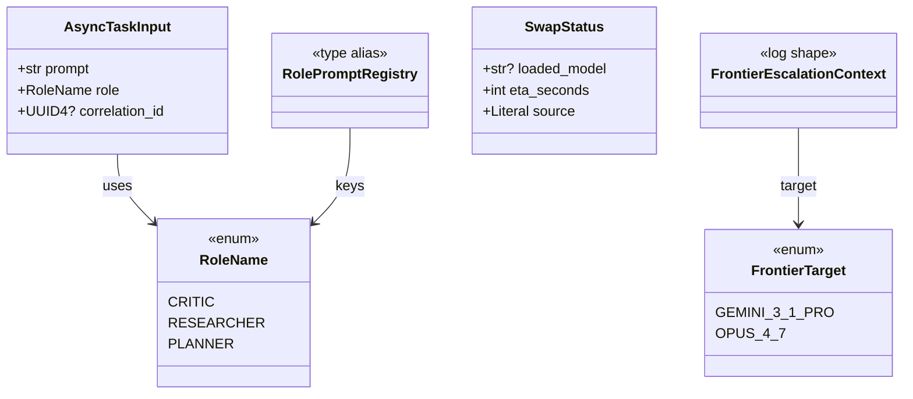
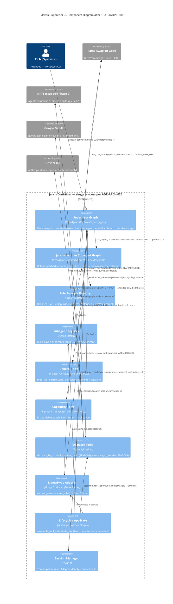
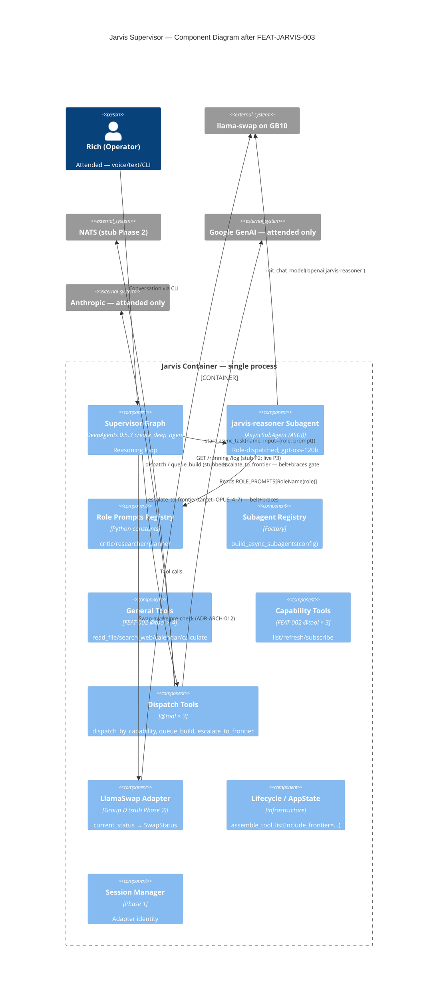

/system-design FEAT-JARVIS-003 \
  --context docs/research/ideas/phase2-dispatch-foundations-scope.md \
  --context docs/research/ideas/phase2-build-plan.md \
  --context docs/research/ideas/jarvis-vision.md \
  --context docs/research/ideas/jarvis-architecture-conversation-starter.md \
  --context docs/architecture/ARCHITECTURE.md \
  --context docs/architecture/decisions/ADR-J-001-deepagents-pin.md \
  --context docs/architecture/decisions/ADR-J-002-supervisor-factory.md \
  --context docs/design/FEAT-JARVIS-001/design.md \
  --context docs/design/FEAT-JARVIS-002/design.md \
  --context ../forge/docs/architecture/decisions/ADR-ARCH-031-async-subagents-for-long-running-work.md \
  --context ../specialist-agent/docs/reviews/deepagents-sdk-2026-04.md \
  --context ../forge/docs/research/ideas/fleet-architecture-v3-coherence-via-flywheel.md \
  --context src/jarvis/agents/supervisor.py \
  --context src/jarvis/prompts/supervisor_prompt.py \
  --context src/jarvis/config/settings.py \
  --context .guardkit/context-manifest.yaml
I'll start by running the prerequisite checks and loading all the context files in parallel.

Read graphiti.yaml
Globpattern: "docs/architecture/**/*.md"
Found 34 files
Both checks pass. Let me load the context files in parallel.

Read phase2-dispatch-foundations-scope.md
Read design.md
Let me read the key architecture docs and ADRs that constrain FEAT-JARVIS-003.

Read ARCHITECTURE.md
Read ADR-ARCH-011-single-jarvis-reasoner-subagent.md
Read ADR-ARCH-001-local-first-inference-via-llama-swap.md
Update Todos

Load all context files for FEAT-JARVIS-003 design

Reconcile superseded scope (ADR-ARCH-001/011/027) with FEAT-JARVIS-003 intent

Interactive design session for async subagent bounded contexts

Contradiction detection against 30 ADRs + DDRs 1-9

Generate design artefacts (design.md, contracts, models, diagrams, DDRs)

C4 L3 review gate for Jarvis Reasoning container

Offer Graphiti seeding commands
Read ADR-ARCH-027-attended-only-cloud-escape-hatch.md
Read ADR-ARCH-012-swap-aware-voice-latency-policy.md
Read supervisor.py
Read supervisor_prompt.py
Read settings.py
Read ADR-J-001-deepagents-pin.md
Globpattern: "docs/architecture/decisions/ADR-J-*.md"
No files found
Read phase2-build-plan.md
Read ADR-ARCH-031-async-subagents-for-long-running-work.md
Read deepagents-sdk-2026-04.md
Read design.md
Read jarvis-architecture-conversation-starter.md
Read jarvis-architecture-conversation-starter.md (lines 201-400)
Read context-manifest.yaml
Read ADR-ARCH-005-seven-bounded-contexts.md
Good — I now have all the context I need. Let me update the todo list and present the reconciliation question before generating artefacts.

Update Todos

Load all context files for FEAT-JARVIS-003 design

Reconcile superseded scope (ADR-ARCH-001/011/027) with FEAT-JARVIS-003 intent

Present checkpoint for user approval of reframe

Generate design artefacts (design.md, contracts, models, diagrams, DDRs)

C4 L3 review gate for Jarvis Reasoning + Fleet Dispatch containers

Offer Graphiti seeding commands
Prerequisite & Context Checkpoint — FEAT-JARVIS-003

🏗️ Architecture loaded: 7 bounded contexts, 30 ADRs accepted (2026-04-20)
🔍 Phase 1 (FEAT-JARVIS-001) design present — 4 DDRs, no network protocols
🔍 Phase 2a (FEAT-JARVIS-002) design present — 5 DDRs (005–009), dispatch-by-capability landed
🆕 No existing FEAT-JARVIS-003 design — starting fresh (docs/design/FEAT-JARVIS-003/ absent)
📌 Graphiti enabled, project_design + architecture_decisions groups available
⚠️ CRITICAL SCOPE RECONCILIATION REQUIRED
The scope doc docs/research/ideas/phase2-dispatch-foundations-scope.md (20 Apr 2026) predates the /system-arch session, and four of its five load-bearing claims for FEAT-JARVIS-003 are now superseded by accepted ADRs. FEAT-JARVIS-002's design.md already flagged this as contradiction C2 and deferred resolution to this /system-design run. Before I generate artefacts I need to confirm the reframe.

Superseded scope claims (with the ADR that retires each)
Scope claim	Superseding ADR	Reason
Four AsyncSubAgents: deep_reasoner (Gemini 3.1 Pro), adversarial_critic (Opus 4.7), long_research (GPT-5.4), quick_local (vLLM)	ADR-ARCH-001, ADR-ARCH-011	No cloud LLMs on unattended paths. AsyncSubAgents run without human on every turn. Three of four are cloud → forbidden. ADR-ARCH-011 collapses to a single jarvis-reasoner subagent on gpt-oss-120b via llama-swap.
quick_local GB10-vLLM subagent + system.health.vllm fallback to cloud cheap-tier (JA6 hook)	ADR-ARCH-012	JA6 replaced by swap-aware supervisor + "one moment" TTS ack. No cloud fallback on unattended path. The "fallback hook" test from scope becomes a swap-awareness hook test.
Four separate provider SDKs (google-genai, anthropic, openai, vllm)	ADR-ARCH-001, ADR-ARCH-011	Only jarvis-reasoner alias matters on unattended path; openai:jarvis-reasoner via OPENAI_BASE_URL=http://promaxgb10-41b1:9000/v1 already wired in Phase 1. Attended-escape cloud keys gate through escalate_to_frontier only.
langgraph.json declares 5 graphs (supervisor + 4 subagents)	ADR-ARCH-011	Single subagent → 2 graphs: jarvis + jarvis_reasoner. Matches Forge ADR-ARCH-031's 2-graph pattern exactly.
What is preserved from the scope doc
AsyncSubAgent via AsyncSubAgentMiddleware (DeepAgents 0.5.3 preview) — ADR-ARCH-025 covers the 0.6 upgrade gate
ASGI transport, co-deployed graphs — ADR-ARCH-031 pattern inherited
Subagent descriptions are the contract — still the load-bearing authoring concern, now for one subagent with a role parameter
Routing e2e test as the acceptance gate — reshaped to cover roles + escalate_to_frontier
Proposed reframe — one async subagent, role-dispatched, plus attended escape tool
FEAT-JARVIS-003 ships:

One AsyncSubAgent — jarvis-reasoner, backed by llama-swap alias jarvis-reasoner → gpt-oss-120b MXFP4. Accepts a role kwarg resolving to a role-specific system prompt at dispatch time. Launch roles: critic, researcher, planner (prompt-only differentiation; same model).
escalate_to_frontier tool (FEAT-JARVIS-002 reserved the slot; it lands here) — session-adapter-gated per ADR-ARCH-027 belt+braces (docstring + executor assertion on adapter_id ∈ {telegram, cli, dashboard, reachy} + caller-frame non-ambient check). Constitutional. Default cloud target: Gemini 3.1 Pro.
Swap-aware read path (jarvis.adapters.llamaswap) — reads /running + /log before dispatch; supervisor's voice-reactive path emits TTS ack when swap ETA > 30s per ADR-ARCH-012.
Supervisor wiring — async_subagents=build_async_subagents(config) and session-aware tool registration (frontier tool added only on attended sessions).
Routing e2e test — 7 canned prompts exercising role-dispatch across critic/researcher/planner, calculate, dispatch_by_capability, queue_build, and escalate_to_frontier (attended path) + its rejection (ambient path).
Bounded contexts this design touches
Bounded context	In?	How
Fleet Dispatch	IN — core	jarvis-reasoner async subagent, escalate_to_frontier tool, llama-swap adapter
Jarvis Reasoning	extended	supervisor factory gains async_subagents; prompt gains role-routing + escalation sections
Config (cross-cutting)	extended	gemini_api_key, anthropic_api_key (already present), llama_swap_base_url, role-name enum
Adapter Interface / Ambient / Learning / Knowledge / External Tool	untouched	FEAT-JARVIS-004/006/007/008 territory
Proposed DDRs (continuing from DDR-009)
DDR	Decision
DDR-010	One AsyncSubAgent (jarvis-reasoner) with a role kwarg supersedes the four-subagent roster (reconciles scope doc with ADR-ARCH-001 + ADR-ARCH-011).
DDR-011	Role set v1 is a closed RoleName enum — CRITIC, RESEARCHER, PLANNER — resolved to prompt at subagent graph compile. Additive; changes require commit-message justification.
DDR-012	Subagent graphs compile at module import time (not lazy) so langgraph dev validates aliases at startup and provider-key absence fails fast per ADR-ARCH-015 CI posture.
DDR-013	langgraph.json lives at repo root (LangGraph convention; matches Forge ADR-ARCH-031). Declares two graphs: jarvis + jarvis_reasoner.
DDR-014	escalate_to_frontier lands in jarvis.tools.dispatch (the slot FEAT-JARVIS-002 DDR-005 reserved). Constitutional gating via: (a) docstring prohibition, (b) executor assertion on adapter_id + caller-frame-not-ambient check, (c) session-aware tool registration — tool is absent from ambient/learning/Pattern-C tool sets, not just blocked. Default frontier model: google_genai:gemini-3.1-pro; anthropic:claude-opus-4-7 via target= kwarg.
DDR-015	Swap-aware read path lives in jarvis.adapters.llamaswap (new adapter, Group D). The "quick_local fallback hook" from the scope doc is retired; its Phase 2 test becomes test_swap_aware_voice_ack.py covering the >30s-ETA TTS ack branch per ADR-ARCH-012.
Contradictions expected against existing ADRs/DDRs — none predicted after reframe
The original scope's four-cloud-subagents design would fire contradictions against ADR-ARCH-001/011/012/023/027. The reframe above eliminates those. A full detection pass happens at Phase 2 once contracts are finalised.

Assumptions carried forward (new to FEAT-JARVIS-003)
ASSUM-LLAMASWAP-API — the /running + /log endpoints exist at http://promaxgb10-41b1:9000 per ADR-ARCH-012. Phase 2 stubs the adapter reads; FEAT-JARVIS-004 wires them live.
ASSUM-ASYNC-ROLE-PROPAGATION — DeepAgents 0.5.3 AsyncSubAgent accepts extra kwargs via start_async_task's input dict, and they reach the subagent graph's initial state. Verified at compile-time test in DDR-012; fallback is to pass role inside prompt itself if the SDK path is unavailable.
ASSUM-FRONTIER-CALLER-FRAME — AsyncSubAgentMiddleware exposes enough caller-frame metadata for the executor assertion in DDR-014. If not, the assertion falls back to session-state lookup; either way, constitutional gating is belt+braces.
Checkpoint
This is the interactive design step. Before I generate docs/design/FEAT-JARVIS-003/design.md + contracts + data models + DDR-010..015 + C4 L3 diagram + OpenAPI N/A, please confirm the reframe.

[A] Accept the reframe as stated. I generate all artefacts now with the DDRs above and the single-subagent + role-dispatch + escalate_to_frontier shape.

[R] Revise — particular DDR you'd shape differently (e.g. defer escalate_to_frontier to a later feature; switch to lazy subagent compilation; different role enum; put langgraph.json under src/jarvis/).

[S] Stop — the scope doc's intent should be preserved literally and ADR-ARCH-011 should be reopened. (I'd push back here — ADR-ARCH-001 is foundational and ADR-ARCH-011 was the right resolution — but happy to surface the trade.)

[D] Defer FEAT-JARVIS-003 entirely — land only escalate_to_frontier as a FEAT-JARVIS-002 addendum, skip AsyncSubAgent in v1, revisit after Phase 3 (FEAT-JARVIS-004 NATS integration) when there's real routing-history evidence to justify the preview-feature dependency.

Your choice [A/R/S/D]?

phase2-build-plan.md
A
Generating all design artefacts now.

Bash Create FEAT-JARVIS-003 design directory tree
IN
mkdir -p docs/design/FEAT-JARVIS-003/contracts docs/design/FEAT-JARVIS-003/models docs/design/FEAT-JARVIS-003/diagrams docs/design/FEAT-JARVIS-003/decisions

OUT
(Bash completed with no output)
Write design.md
318 lines
# FEAT-JARVIS-003 — Design

> **Feature:** Async Subagent for Model Routing + Attended Frontier Escape
> **Phase:** 2 (Dispatch Foundations) — FEAT-JARVIS-003 only; FEAT-JARVIS-002 (core tools + capability-driven dispatch) shipped separately.
> **Generated:** 2026-04-23 via `/system-design FEAT-JARVIS-003`
> **Status:** Proposed — input to `/feature-spec FEAT-JARVIS-003`
> **Architecture source:** [../../architecture/ARCHITECTURE.md](../../architecture/ARCHITECTURE.md) (v1.0, 2026-04-20, 30 ADRs)
> **Scope source:** [../../research/ideas/phase2-dispatch-foundations-scope.md](../../research/ideas/phase2-dispatch-foundations-scope.md) — **reframed** by the superseding ADRs below
> **Predecessor designs:** [../FEAT-JARVIS-001/design.md](../FEAT-JARVIS-001/design.md), [../FEAT-JARVIS-002/design.md](../FEAT-JARVIS-002/design.md)

---

## 1. Purpose

FEAT-JARVIS-003 turns *"one reasoning model that knows which reasoning model to use"* from aspiration into observable behaviour by giving the Phase 1 supervisor its **subagent-routing** surface. The original scope (20 April 2026) proposed four heterogeneous cloud+local AsyncSubAgents; the `/system-arch` session that followed (also 20 April 2026) accepted four ADRs that retire that design:

- **ADR-ARCH-001** — no cloud LLMs on unattended paths (AsyncSubAgents run unattended every turn → three of four scope subagents forbidden).
- **ADR-ARCH-011** — single `jarvis-reasoner` AsyncSubAgent on `gpt-oss-120b`; specialist roles are prompt-driven modes of the same model.
- **ADR-ARCH-012** — swap-aware supervisor supersedes JA6 cloud-fallback proposal; `quick_local` is retired.
- **ADR-ARCH-027** — `escalate_to_frontier` is an **attended-only** cloud escape **tool**, not a subagent; constitutionally gated belt+braces.

This design reconciles the scope with those ADRs and ships three capability clusters:

| Cluster | Artefact | Transport |
|---|---|---|
| **AsyncSubAgent `jarvis-reasoner`** (1 subagent, 3 role modes) | `src/jarvis/agents/subagents/jarvis_reasoner.py` compiled graph + `AsyncSubAgent` registry entry | ASGI (co-deployed), per ADR-ARCH-031 default |
| **AsyncSubAgentMiddleware tools** (5 built-ins wired automatically) | `start_async_task`, `check_async_task`, `update_async_task`, `cancel_async_task`, `list_async_tasks` | in-process via DeepAgents middleware |
| **`escalate_to_frontier` tool** (attended-only, constitutional) | `jarvis.tools.dispatch.escalate_to_frontier` — slot reserved by FEAT-JARVIS-002 DDR-005/C2 | real cloud provider SDK (`google_genai` default; `anthropic` via `target=`) |

Plus a fourth supporting piece — the **swap-aware llama-swap adapter** (`jarvis.adapters.llamaswap`) — which makes ADR-ARCH-012's voice-latency policy observable from the supervisor. Phase 2 stubs its read path; FEAT-JARVIS-004 wires it live against `http://promaxgb10-41b1:9000`.

One-line success criterion: *the reasoning model can choose between the `jarvis-reasoner` subagent (with a role), the FEAT-JARVIS-002 tools, and `escalate_to_frontier` — and the attended-only gate on the frontier tool holds against both ambient tool sets and a spoofed-ambient invocation from an attended session.*

## 2. Scope in-context

Jarvis has seven bounded contexts per [ADR-ARCH-005](../../architecture/decisions/ADR-ARCH-005-seven-bounded-contexts.md). FEAT-JARVIS-003 extends the same two that FEAT-JARVIS-002 touched, adds the swap-adapter piece to a third, and leaves the remaining four untouched.

| Bounded context | FEAT-JARVIS-003 touches? | How |
|---|---|---|
| **Fleet Dispatch Context** | **IN — core** | `jarvis-reasoner` AsyncSubAgent (routing target), `escalate_to_frontier` tool, llama-swap adapter |
| **Jarvis Reasoning Context** | extended | supervisor factory gains `async_subagents=`; prompt gains role-dispatch + escalation sections |
| **Config (cross-cutting)** | extended | llama-swap base URL, frontier provider keys, `RoleName` enum export |
| **Adapter Interface Context** | partial — read-side only | session-aware tool registration reads adapter identity (no new adapter containers) |
| Ambient / Learning / Knowledge / External Tool contexts | untouched | FEAT-JARVIS-004/007/008 territory |

See [phase2-dispatch-foundations-scope.md §Do-Not-Change](../../research/ideas/phase2-dispatch-foundations-scope.md) with the understanding that its four-subagent roster is superseded; everything else (Phase 1 outputs, FEAT-JARVIS-002 outputs, ASGI default, subagent-descriptions-are-the-contract) is preserved.

## 3. Surfaces shipped

| Surface | Type | Artefact |
|---|---|---|
| DeepAgents AsyncSubAgent surface (1 `AsyncSubAgent` entry) | in-process — description + `graph_id` is the contract | [contracts/API-subagent.md](contracts/API-subagent.md) |
| DeepAgents tool surface (1 new `@tool` function + 5 middleware-provided tools) | in-process — docstrings are the contract | [contracts/API-tools.md](contracts/API-tools.md) |
| Internal Python API (module contracts) | in-process | [contracts/API-internal.md](contracts/API-internal.md) |

**No new network protocols.** The `jarvis-reasoner` graph runs under ASGI on the same LangGraph server as the supervisor per ADR-ARCH-031. `escalate_to_frontier` issues outbound HTTPS to a cloud provider but exposes no endpoint. llama-swap reads are outbound HTTP only. Consistent with [FEAT-JARVIS-001 DDR-001](../FEAT-JARVIS-001/decisions/DDR-001-internal-api-in-process-only.md) and [FEAT-JARVIS-002 §3](../FEAT-JARVIS-002/design.md) — no `openapi.yaml`, no `mcp-tools.json`, no `a2a-schemas.yaml`.

The `langgraph.json` *is* a new surface for deployment tooling and lands in this feature — see [DDR-013](decisions/DDR-013-langgraph-json-at-repo-root.md).

## 4. Data models

| Model | Purpose | Artefact |
|---|---|---|
| `RoleName` (enum), `AsyncTaskInput`, `RolePromptRegistry`, `SwapStatus`, `FrontierEscalationContext`, `FrontierTarget` (enum) | Subagent-layer + escalation-layer Pydantic types | [models/DM-subagent-types.md](models/DM-subagent-types.md) |
| `AsyncSubAgent` (DeepAgents 0.5.3 TypedDict) | Reused from `deepagents` — single entry for `jarvis-reasoner` | imported; no redefinition |
| Reused from FEAT-JARVIS-002 | `CapabilityDescriptor` still the catalogue type; unchanged | [../FEAT-JARVIS-002/models/DM-tool-types.md](../FEAT-JARVIS-002/models/DM-tool-types.md) |

## 5. Design decisions captured

| DDR | Decision | Why it's here |
|---|---|---|
| [DDR-010](decisions/DDR-010-single-async-subagent-supersedes-four-roster.md) | One AsyncSubAgent (`jarvis-reasoner`) with a `role` kwarg supersedes the four-subagent roster from the scope doc | Reconciles scope with ADR-ARCH-001 + ADR-ARCH-011 (the C2 contradiction FEAT-JARVIS-002 deferred). |
| [DDR-011](decisions/DDR-011-role-enum-closed-v1.md) | `RoleName` is a closed enum for v1: `CRITIC`, `RESEARCHER`, `PLANNER` | Open questions left the role set unspecified; a closed enum matches ADR-ARCH-017's static-declaration posture and gives the learning flywheel (v1.5) a fixed label space to measure against. |
| [DDR-012](decisions/DDR-012-subagent-module-import-compilation.md) | Subagent graphs compile at **module import** time, not lazily | Settles the scope doc's open question "module import vs lazy-at-first-use". Module-import gives `langgraph dev` deterministic startup validation and fails fast on missing provider keys per ADR-ARCH-015. |
| [DDR-013](decisions/DDR-013-langgraph-json-at-repo-root.md) | `langgraph.json` lives at **repo root**; declares two graphs (`jarvis`, `jarvis_reasoner`) with ASGI transport | Settles the scope doc's open question "repo root vs `src/jarvis/`". Matches Forge ADR-ARCH-031 and LangGraph convention; no packaging gymnastics. |
| [DDR-014](decisions/DDR-014-escalate-to-frontier-in-dispatch-tool-module.md) | `escalate_to_frontier` lands in `jarvis.tools.dispatch` (the FEAT-JARVIS-002 DDR-005/C2 reserved slot). Constitutional gating is **belt+braces**: docstring prohibition, executor assertion on `adapter_id`, caller-frame non-ambient check, **and session-aware tool registration** so the tool is *absent* from ambient/learning/Pattern-C tool sets entirely | Realises ADR-ARCH-027 in code — not just prompt-level prohibition. The absence-from-tool-set layer is the third brace; reasoning cannot invoke a tool it cannot see. |
| [DDR-015](decisions/DDR-015-llamaswap-adapter-with-stubbed-health.md) | Swap-aware read path lives in `jarvis.adapters.llamaswap`, the first Group-D adapter. Phase 2 stubs the `/running` + `/log` reads (test-overrideable); FEAT-JARVIS-004 wires live reads against `http://promaxgb10-41b1:9000` | Realises ADR-ARCH-012 in code. Retires the scope doc's "quick_local fallback hook" (JA6) cleanly — the hook becomes a swap-awareness hook, not a cloud-fallback hook. |

DDR numbering continues from FEAT-JARVIS-002 (DDR-005..009). FEAT-JARVIS-003 uses DDR-010..015; next available after this design is DDR-016.

## 6. Component diagram

[diagrams/jarvis-reasoning-l3.md](diagrams/jarvis-reasoning-l3.md) — C4 Level 3 view of the Jarvis Supervisor container extended with the `jarvis-reasoner` AsyncSubAgent graph, `AsyncSubAgentMiddleware`-injected tools, the `escalate_to_frontier` dispatch tool, and the llama-swap adapter. **Requires explicit approval per `/system-design` Phase 3.5 gate** — the container exceeds the 3-internal-component threshold (10 components participate).

## 7. Module layout — extensions to Phase 1 + FEAT-JARVIS-002

Per [ADR-ARCH-006 five-group layout](../../architecture/decisions/ADR-ARCH-006-five-group-module-layout.md). Phase 1 reserved `agents/subagents/`, `adapters/` empty; FEAT-JARVIS-002 populated `tools/`; FEAT-JARVIS-003 fills `agents/subagents/`, starts `adapters/`, and extends three existing modules:

```
src/jarvis/
├── agents/
│   ├── supervisor.py                       # UPDATED — wires async_subagents + session-aware tool list
│   ├── subagent_registry.py                # NEW    — build_async_subagents(config) → [AsyncSubAgent]
│   └── subagents/                          # Group A — populated in FEAT-JARVIS-003
│       ├── __init__.py                     # NEW
│       ├── jarvis_reasoner.py              # NEW    — create_deep_agent graph; role→prompt resolver
│       └── prompts.py                      # NEW    — ROLE_PROMPTS registry (3 role system prompts)
├── prompts/
│   └── supervisor_prompt.py                # UPDATED — role-dispatch + escalation sections
├── config/
│   └── settings.py                         # UPDATED — llama_swap_base_url, frontier_default_target,
│                                           #           gemini_api_key (opt), anthropic_api_key already present
├── tools/
│   └── dispatch.py                         # UPDATED — adds escalate_to_frontier (reserved slot fill)
├── adapters/                               # Group D — first Jarvis adapter populated
│   ├── __init__.py                         # was RESERVED — now re-exports LlamaSwapAdapter
│   └── llamaswap.py                        # NEW    — SwapStatus type + stubbed /running /log reads
└── infrastructure/
    └── lifecycle.py                        # UPDATED — builds async subagents, session-aware tool registry
langgraph.json                              # NEW    — repo-root, 2 graphs, ASGI transport
```

Every `@tool` still follows ADR-ARCH-021 (return structured error strings; never raise). The subagent graph itself returns structured output per DeepAgents 0.5.3 conventions; the supervisor reads the `async_tasks` state channel via `check_async_task`.

## 8. Wiring — how subagents and the frontier tool compose

Extends the FEAT-JARVIS-002 wiring sequence. New lines marked `← NEW in FEAT-JARVIS-003`.

```
env + .env
    │
    ▼
JarvisConfig()                                    ← jarvis.config.settings (extended in 003)
    │
    ▼
lifecycle.startup(config):
    │
    ├── logging.configure(...)
    ├── config.validate_provider_keys()
    ├── capability_registry = load_stub_registry(config.stub_capabilities_path)        # 002
    ├── llamaswap_adapter = LlamaSwapAdapter(base_url=config.llama_swap_base_url)      # ← NEW in 003
    ├── async_subagents = build_async_subagents(config)                                # ← NEW in 003
    │                                              # → [AsyncSubAgent(name="jarvis-reasoner",
    │                                              #                  graph_id="jarvis_reasoner",
    │                                              #                  description="…gpt-oss-120b…")]
    ├── tool_list_attended = assemble_tool_list(                                       # EXTENDED in 003
    │       config, capability_registry, llamaswap_adapter,
    │       include_frontier=True,             # adapter ∈ {telegram, cli, dashboard, reachy}
    │   )
    ├── tool_list_ambient = assemble_tool_list(                                        # ← NEW in 003
    │       config, capability_registry, llamaswap_adapter,
    │       include_frontier=False,            # constitutional: frontier removed from ambient
    │   )
    ├── supervisor = build_supervisor(
    │       config,
    │       tools=tool_list_attended,
    │       available_capabilities=capability_registry,
    │       async_subagents=async_subagents,                                           # ← NEW in 003
    │       ambient_tool_factory=lambda: tool_list_ambient,                            # ← NEW in 003
    │   )
    ├── store = InMemoryStore()
    └── session_manager = SessionManager(supervisor, store)
    │
    ▼
AppState(config, supervisor, store, session_manager,
         capability_registry, llamaswap_adapter)           # extended
    │
    ▼
cli.main runs its subcommand (Phase 1 behaviour preserved)
```

`build_supervisor(...)`'s public signature gains two keyword-only arguments; both have safe defaults so FEAT-JARVIS-001/002 call sites still work:

```python
def build_supervisor(
    config: JarvisConfig,
    *,
    tools: list[BaseTool] | None = None,                      # added in 002
    available_capabilities: list[CapabilityDescriptor] | None = None,  # added in 002
    async_subagents: list[AsyncSubAgent] | None = None,       # ← NEW in 003
    ambient_tool_factory: Callable[[], list[BaseTool]] | None = None,  # ← NEW in 003
) -> CompiledStateGraph[Any, Any, Any, Any]: ...
```

Defaults: `async_subagents=None` → no subagents wired (Phase 1 + FEAT-JARVIS-002 behaviour preserved). `ambient_tool_factory=None` → Pattern B / learning paths fall back to the attended tool list *without* `escalate_to_frontier` (a later feature can register watcher-specific tool sets).

### Role-dispatch contract

The supervisor invokes the subagent as:

```python
# From within the reasoning loop, as a tool call produced by the reasoning model:
start_async_task(
    name="jarvis-reasoner",
    input={
        "prompt": "<Rich's rendered instruction>",
        "role": "critic",                    # RoleName.CRITIC.value
        "correlation_id": "<session.correlation_id>",
    },
)
```

The `jarvis_reasoner` graph reads `input["role"]` at its first node, looks up the system prompt in `ROLE_PROMPTS[RoleName(role)]`, and runs `create_deep_agent(model="openai:jarvis-reasoner", system_prompt=<resolved>, tools=[])` with `OPENAI_BASE_URL=http://promaxgb10-41b1:9000/v1` — so a single llama-swap-backed `gpt-oss-120b` handles all three roles via prompt-only differentiation. No swap cost between role modes (ADR-ARCH-011 consequence).

If `role` is missing or unknown, the graph returns a structured error via the `async_tasks` channel (not a raise) per ADR-ARCH-021: `"ERROR: unknown_role — expected one of {critic, researcher, planner}"`.

### Frontier escalation contract

`escalate_to_frontier(instruction: str, target: FrontierTarget = GEMINI_3_1_PRO) -> str` — direct synchronous call to the cloud provider; no subagent. The tool is:

- **Registered only on attended sessions** (`adapter_id ∈ {telegram, cli, dashboard, reachy}`). The `ambient_tool_factory` returns a list that omits it entirely — ambient watchers cannot invoke a tool that is not in their registered set.
- **Asserts at the boundary** that the active session's `adapter_id` is attended *and* that the call frame is not inside an `AsyncSubAgent` (checked via the `AsyncSubAgentMiddleware` metadata or, if unavailable, via session-state lookup). Any violation returns `"ERROR: attended_only — escalate_to_frontier cannot be invoked from {frame}"`.
- **Default target** is `google_genai:gemini-3.1-pro`; `target=FrontierTarget.OPUS_4_7` switches to `anthropic:claude-opus-4-7`. Both cost toward the £20–£50/month ADR-ARCH-030 budget.

Budget monitoring is trace-based per ADR-ARCH-027: invocations log with `model_alias=cloud-frontier` at INFO, ready to flow into `jarvis_routing_history` when FEAT-JARVIS-004 lights up Graphiti writes.

## 9. Test shape

Target: **+25–35 tests** on top of FEAT-JARVIS-002's baseline; maintain 80% coverage on new modules.

- `tests/test_subagent_registry.py` — `build_async_subagents(test_config)` returns a 1-element list whose single `AsyncSubAgent` has `name="jarvis-reasoner"`, `graph_id="jarvis_reasoner"`, and a non-empty description containing the gpt-oss-120b cost/latency signal substring.
- `tests/test_subagents_jarvis_reasoner.py` — `from jarvis.agents.subagents.jarvis_reasoner import graph`; graph compiles at import (DDR-012); resolves `ROLE_PROMPTS[RoleName.CRITIC]` to a non-empty prompt; unknown-role input path returns the structured error. No LLM call — uses `FakeListChatModel`.
- `tests/test_subagent_prompts.py` — `ROLE_PROMPTS` is a complete mapping over `RoleName` members (exhaustiveness check); each prompt is non-empty and mentions the role's posture (critic → "adversarial evaluation"; researcher → "open-ended research"; planner → "multi-step planning").
- `tests/test_escalate_to_frontier.py`:
  - Happy path: attended session (`adapter_id="cli"`) → mocked provider returns canned text → tool returns it.
  - Rejection: ambient call frame → returns `ERROR: attended_only — …`.
  - Rejection: tool absent from `ambient_tool_factory()` result (registration-layer assertion, not runtime).
  - Default target is `FrontierTarget.GEMINI_3_1_PRO`; `target=FrontierTarget.OPUS_4_7` routes to `anthropic:claude-opus-4-7`.
  - Missing provider key → structured error per ADR-ARCH-021 (`ERROR: config_missing — GOOGLE_API_KEY not set`).
- `tests/test_adapters_llamaswap.py` — `LlamaSwapAdapter(base_url="http://stub")` with stubbed `/running` and `/log` returns `SwapStatus(loaded_model=..., eta_seconds=0)`; "degraded" stub returns `SwapStatus(eta_seconds=180)` for the >30s-ETA branch.
- `tests/test_swap_aware_voice_ack.py` — replaces the scope doc's "`quick_local` fallback test". Supervisor dispatched with a voice-adapter session + swap ETA > 30s emits the TTS ack stub and queues the request. Pure state assertion; no audio I/O.
- `tests/test_supervisor_with_subagents.py` — extends FEAT-JARVIS-002's `test_supervisor_with_tools.py`: `build_supervisor(test_config, tools=[...], async_subagents=[...], ambient_tool_factory=...)` returns a `CompiledStateGraph`; the 5 `AsyncSubAgentMiddleware` tools are exposed; `escalate_to_frontier` is present on attended tool list and absent on ambient tool list. No LLM call.
- `tests/test_routing_e2e.py` — **the acceptance test for FEAT-JARVIS-003.** Seven canned prompts with a mocked LLM returning deterministic tool-call sequences:
  1. "What's 15% of 847?" → `calculate` (FEAT-JARVIS-002 regression).
  2. "Summarise /tmp/test.md" → `read_file` (FEAT-JARVIS-002 regression).
  3. "Critique this architecture doc for subtle flaws." → `start_async_task(name="jarvis-reasoner", input={"role": "critic", ...})`.
  4. "Research Meta-Harness deeply." → `start_async_task(name="jarvis-reasoner", input={"role": "researcher", ...})`.
  5. "Plan the migration to Python 3.13." → `start_async_task(name="jarvis-reasoner", input={"role": "planner", ...})`.
  6. "Ask Gemini 3.1 Pro for a frontier opinion on this ADR." (attended CLI) → `escalate_to_frontier(target=GEMINI_3_1_PRO)`.
  7. "Build FEAT-JARVIS-EXAMPLE-001 on the jarvis repo." → `queue_build` (FEAT-JARVIS-002 regression) — confirms no routing regression from the subagent wiring.
- `tests/test_langgraph_json.py` — `langgraph.json` at repo root is valid JSON; declares both `jarvis` and `jarvis_reasoner` graphs with ASGI transport; `python -m langgraph dev --help` returns 0 under the test harness (CLI smoke, no server spin).

Tests assert tool-call sequences (structural), not final natural-language output (behavioural). Same pattern as `specialist-agent`'s Player-Coach test structure.

## 10. Supervisor prompt extensions

[`SUPERVISOR_SYSTEM_PROMPT`](../../../src/jarvis/prompts/supervisor_prompt.py) gains two sections appended *after* FEAT-JARVIS-002's Tool-Usage section, preserving the Phase 1 + FEAT-JARVIS-002 content verbatim:

1. **`## Subagent Routing`** — "You have one async subagent: `jarvis-reasoner` (gpt-oss-120b via llama-swap). It runs locally, has no cloud cost, and carries no privacy risk. It accepts a `role` input with three values: `critic` (adversarial evaluation), `researcher` (open-ended research with web tools), `planner` (multi-step planning). Prefer `start_async_task(name='jarvis-reasoner', input={'role': ..., 'prompt': ...})` for any task that needs sustained reasoning beyond a single turn. Do not invoke it for one-shot factual lookups or arithmetic — those have direct tools (`calculate`, `search_web`, `read_file`). Check cost + latency in the subagent description before dispatching; llama-swap may need to warm the model (the system will ack automatically if so)."

2. **`## Frontier Escalation`** — "The `escalate_to_frontier` tool is **available only when I ask for it explicitly** — 'ask Gemini / Opus', 'frontier opinion', 'cloud model', etc. It is not a default escalation path; local reasoning is preferred. The tool will refuse invocation from ambient or learning contexts. Default target is Gemini 3.1 Pro; use `target=OPUS_4_7` for adversarial critique specifically. Budget is shared £20–£50/month fleet-wide — use sparingly."

No mention of the retired four-subagent roster, `deep_reasoner`, `adversarial_critic`, `long_research`, `quick_local`, or a cloud fallback for `quick_local`. The Phase 1 attended-conversation posture and the FEAT-JARVIS-002 tool-usage preferences remain unchanged.

## 11. Contradiction detection (against existing ADRs + DDRs)

Proposed contracts checked against:

- All **30 accepted ADRs** in [docs/architecture/decisions/](../../architecture/decisions/).
- All **9 accepted DDRs** from FEAT-JARVIS-001 (001–004) and FEAT-JARVIS-002 (005–009).
- Forge ADR-ARCH-031 (async subagents) — imported pattern; consistency, not dependency.

**No contradictions detected after the scope reframe** (C1/C2 from FEAT-JARVIS-002 resolved in §1). Compatibility notes:

- The single-subagent shape aligns with **ADR-ARCH-011** verbatim — the role-via-input pattern is the exact "prompt-driven modes of the same model" that the ADR specifies.
- **ADR-ARCH-001**'s local-first constraint holds — the AsyncSubAgent runs on `gpt-oss-120b` via llama-swap (no cloud on unattended path). `escalate_to_frontier` is the *only* cloud call-site Jarvis makes and is constitutionally attended-gated per **ADR-ARCH-027**.
- **ADR-ARCH-012**'s swap-aware voice-latency policy is load-bearing for the LlamaSwapAdapter's `/running` + `/log` read surface. DDR-015 stubs the reads in Phase 2; live reads land with FEAT-JARVIS-004.
- **ADR-ARCH-022** (belt+braces constitutional rules) — `escalate_to_frontier` enforces at three layers: prompt, executor assertion, and tool-registry absence (DDR-014). Exceeds the ADR's two-layer minimum.
- **ADR-ARCH-023** (permissions constitutional, not reasoning-adjustable) — the `ambient_tool_factory` is a lifecycle-built list; the reasoning model cannot toggle its contents. Honoured.
- **ADR-ARCH-025** (DeepAgents 0.6 upgrade gated) — this feature is the first real consumer of the 0.5.3 `AsyncSubAgent` preview; the routing e2e test + subagent structural tests become the regression suite the 0.6 upgrade gate runs.
- **ADR-ARCH-026** (single instance, no horizontal scaling) — two graphs, one process, one container. Unchanged.
- **ADR-ARCH-030** (budget envelope) — `escalate_to_frontier` is the only source of cloud spend; trace-tagged for post-hoc review. Honoured.
- **DDR-001** (no network protocols Phase 1/2) — `langgraph.json` is a deployment manifest, not a network-protocol surface; `escalate_to_frontier`'s outbound HTTPS is a consumer, not a server. Honoured.
- **DDR-005** (dispatch-by-capability) — `escalate_to_frontier` is *not* a capability-driven dispatch; it's a named, constitutionally-gated tool. The two patterns coexist — capability-driven for fleet agents, named-tool for the cloud escape. Consistent with ADR-ARCH-027's framing.
- **DDR-008** (capabilities via tool *and* prompt injection) — unchanged; FEAT-JARVIS-003 adds subagent metadata to the prompt but not to the capability registry.
- **DDR-009** (stub transport semantics) — `escalate_to_frontier` uses **real** transport (cloud provider SDK), not a stub. The capability it exercises is orthogonal to the `dispatch_by_capability` stub that DDR-009 governs; no conflict.

One **forward compatibility note** worth flagging: if FEAT-JARVIS-006 (Telegram adapter) reshapes `adapter_id` semantics, the attended-gate executor assertion in `escalate_to_frontier` will need a verification pass — captured as `ASSUM-ATTENDED-ADAPTER-ID` below.

## 12. Assumptions carried forward

| Assumption | Reason it's not settled here |
|---|---|
| `ASSUM-LLAMASWAP-API` | The `/running` + `/log` endpoints at `http://promaxgb10-41b1:9000` are not formally contracted by the llama-swap project; ADR-ARCH-012 references them by behaviour. Phase 2 **stubs** the adapter; FEAT-JARVIS-004 wires live reads and, if the endpoint shape diverges, a thin protocol adapter lands there. |
| `ASSUM-ASYNC-ROLE-PROPAGATION` | DeepAgents 0.5.3's `AsyncSubAgent` preview accepts extra keys in `input={}` and surfaces them in the subgraph's initial state per the 19 April 2026 SDK review. `test_subagents_jarvis_reasoner.py` verifies this at compile-time under the test harness; if a 0.6 breakage occurs, the fallback is to inline `role` inside `prompt` itself as a leading `[role=...]` token. |
| `ASSUM-FRONTIER-CALLER-FRAME` | `AsyncSubAgentMiddleware` is believed to expose enough metadata on the tool-call frame for the non-ambient assertion. If not (verified at test time), the executor assertion falls back to session-state lookup via `SessionManager.current_session()`. Either path preserves the belt+braces property. |
| `ASSUM-ATTENDED-ADAPTER-ID` | The attended-adapter set `{telegram, cli, dashboard, reachy}` is the ADR-ARCH-016 consumer-surface list. If FEAT-JARVIS-006 reshapes adapter identity (e.g. per-user sub-adapters), the assertion's adapter-id comparison needs a verification pass. Flagged at that feature's `/system-design`. |
| `ASSUM-ROLE-SET-STABILITY` | `RoleName` is closed at v1 (DDR-011). If the learning flywheel in FEAT-JARVIS-008 (v1.5) surfaces a missing role category, adding a member is additive and non-breaking for the enum; prompts and `ROLE_PROMPTS` need the new entry and the supervisor prompt's role-dispatch block needs a line. The routing e2e test is the regression surface. |

## 13. Next steps

1. **Approve the C4 L3 diagram** at [diagrams/jarvis-reasoning-l3.md §Review gate](diagrams/jarvis-reasoning-l3.md).
2. **Seed design to Graphiti** (commands offered at the end of this `/system-design` run — `project_design` group for contracts/models, `architecture_decisions` group for DDRs).
3. **Proceed to `/feature-spec FEAT-JARVIS-003`** — Gherkin scenarios grounded in this design. Primary scenarios:
   - Rich asks for a critique → role-dispatch to `jarvis-reasoner` with `role=critic`.
   - Rich asks Jarvis to ask Gemini → `escalate_to_frontier` succeeds on CLI adapter.
   - An ambient watcher attempts `escalate_to_frontier` → structured error.
4. **Then `/feature-plan FEAT-JARVIS-003`** — task breakdown per [phase2-build-plan.md Step 8 commit order](../../research/ideas/phase2-build-plan.md), adjusted for single-subagent + frontier-tool shape.
5. **Then AutoBuild** — follow the adjusted commit order: config → llamaswap adapter → subagent prompts → jarvis_reasoner graph → subagent_registry → escalate_to_frontier tool → supervisor prompt update → supervisor factory update → `langgraph.json` → extended `test_supervisor_with_subagents.py` → `test_routing_e2e.py`.
6. **Phase 2 close criteria** extend Phase 1's day-1 conversation with: `jarvis chat` invokes `start_async_task(name='jarvis-reasoner', role=…)` correctly on three canned role prompts; `escalate_to_frontier` returns a real Gemini 3.1 Pro response when asked explicitly.

## 14. File manifest

```
docs/design/FEAT-JARVIS-003/
├── design.md                                                       ← this file
├── contracts/
│   ├── API-subagent.md                                             ← AsyncSubAgent entry + role-input contract
│   ├── API-tools.md                                                ← escalate_to_frontier + 5 middleware tools
│   └── API-internal.md                                             ← module-level Python API
├── models/
│   └── DM-subagent-types.md                                        ← RoleName, AsyncTaskInput, SwapStatus,
│                                                                   #   FrontierEscalationContext, FrontierTarget
├── diagrams/
│   └── jarvis-reasoning-l3.md                                      ← C4 L3 (mandatory review gate)
└── decisions/
    ├── DDR-010-single-async-subagent-supersedes-four-roster.md
    ├── DDR-011-role-enum-closed-v1.md
    ├── DDR-012-subagent-module-import-compilation.md
    ├── DDR-013-langgraph-json-at-repo-root.md
    ├── DDR-014-escalate-to-frontier-in-dispatch-tool-module.md
    └── DDR-015-llamaswap-adapter-with-stubbed-health.md
```

---

*"One local reasoning model that knows which role to apply, which specialist to invoke, and when to escalate."* — [ARCHITECTURE.md §1](../../architecture/ARCHITECTURE.md)
Now the six DDRs in parallel.

Write DDR-010-single-async-subagent-supersedes-four-roster.md
96 lines
# DDR-010: Single `jarvis-reasoner` AsyncSubAgent supersedes the four-subagent roster

**Status:** Accepted
**Date:** 2026-04-23
**Deciders:** Rich + `/system-design FEAT-JARVIS-003` session
**Related context:** FEAT-JARVIS-003 (this feature)
**Related components:** `jarvis.agents.subagent_registry`, `jarvis.agents.subagents.jarvis_reasoner`
**Supersedes:** [phase2-dispatch-foundations-scope.md §FEAT-JARVIS-003 Change 1-2](../../../research/ideas/phase2-dispatch-foundations-scope.md) — four `AsyncSubAgent` instances
**Depends on:** [ADR-ARCH-001](../../../architecture/decisions/ADR-ARCH-001-local-first-inference-via-llama-swap.md), [ADR-ARCH-011](../../../architecture/decisions/ADR-ARCH-011-single-jarvis-reasoner-subagent.md), [ADR-ARCH-027](../../../architecture/decisions/ADR-ARCH-027-attended-only-cloud-escape-hatch.md), [FEAT-JARVIS-002 DDR-005 C2](../../FEAT-JARVIS-002/design.md)

## Context

The Phase 2 scope document (20 April 2026) specified four `AsyncSubAgent` instances for FEAT-JARVIS-003:

| Name | Model | Role |
|---|---|---|
| `deep_reasoner` | `google_genai:gemini-3.1-pro` | long-form reasoning |
| `adversarial_critic` | `anthropic:claude-opus-4-7` | quality evaluation |
| `long_research` | `openai:gpt-5.4` | open-ended research |
| `quick_local` | `vllm:qwen3-coder-next` | quick local lookups |

The `/system-arch` session held later the same day (20 April 2026) accepted four ADRs that retire three of those subagents and collapse the fourth:

- **ADR-ARCH-001** (foundational, local-first) — *no cloud LLMs on unattended paths.* AsyncSubAgents run unattended on every turn of the supervisor's reasoning loop. `deep_reasoner`, `adversarial_critic`, and `long_research` are therefore forbidden as unattended cloud calls.
- **ADR-ARCH-011** (single jarvis-reasoner) — *Jarvis ships with one async subagent, `jarvis-reasoner`, backed by `gpt-oss-120b` via llama-swap.* Specialist roles (critic, researcher, planner) are prompt-driven modes of the same model, not separate subagents.
- **ADR-ARCH-027** — frontier cloud reasoning is available *only* through the `escalate_to_frontier` tool on attended sessions; it is not a subagent and not available to ambient / learning / Pattern-C reasoning.
- **ADR-ARCH-012** — swap-aware voice-latency policy supersedes the `quick_local` fallback (JA6); no cloud fallback on the unattended path.

FEAT-JARVIS-002's design captured this as contradiction **C2** and deferred resolution: *"Out of scope for this design — flagged for `/system-design FEAT-JARVIS-003`. This design leaves a reserved slot in `jarvis.tools.dispatch` for `escalate_to_frontier` but does not implement it here."*

## Decision

FEAT-JARVIS-003 ships **one** `AsyncSubAgent`:

```python
AsyncSubAgent(
    name="jarvis-reasoner",
    graph_id="jarvis_reasoner",
    description=(
        "Local reasoning subagent backed by gpt-oss-120b (MXFP4, Blackwell-optimised) "
        "via llama-swap on GB10. Accepts a `role` input ∈ {critic, researcher, planner} "
        "that selects the system prompt for this invocation. No cloud cost, no privacy "
        "risk. Latency: sub-second per turn once warm; 2–4 min cold swap if "
        "qwen-coder-next was previously loaded (supervisor emits voice ack if so). "
        "Prefer for any sustained reasoning task beyond a single tool call; do not use "
        "for arithmetic (calculate), factual lookups (search_web), or file reads "
        "(read_file)."
    ),
)
```

The three scope-doc cloud subagents (`deep_reasoner`, `adversarial_critic`, `long_research`) are **not** created as subagents. Their reasoning capability surfaces through **two substitute paths**:

1. **Role-dispatch on the single subagent** — `start_async_task(name="jarvis-reasoner", input={"role": "critic", ...})` and the `researcher` / `planner` equivalents (see [DDR-011](DDR-011-role-enum-closed-v1.md)).
2. **`escalate_to_frontier` tool on attended sessions** — when Rich explicitly asks for a frontier opinion, per ADR-ARCH-027 (see [DDR-014](DDR-014-escalate-to-frontier-in-dispatch-tool-module.md)).

The scope-doc `quick_local` subagent is retired; its original problem (GB10 pressure under AutoBuild) is addressed by the swap-aware read path in [DDR-015](DDR-015-llamaswap-adapter-with-stubbed-health.md) per ADR-ARCH-012, not a cloud fallback.

## Rationale

- **Foundational constraint (ADR-ARCH-001) overrides feature scope.** The four-subagent design predates ADR-ARCH-001 and was rejected as part of that ADR's "Alternatives considered §1". FEAT-JARVIS-003 cannot reinstate what ADR-ARCH-001 rejected without re-opening a foundational ADR, which is out of scope for a `/system-design` step.
- **Preserves the routing-as-reasoning thesis.** The "one reasoning model that knows which reasoning model to use" framing survives at full strength: the reasoning model now chooses between (a) direct tools, (b) a role for `jarvis-reasoner`, (c) a fleet-dispatch to a specialist via `dispatch_by_capability`, (d) a build-queue via `queue_build`, and (e) `escalate_to_frontier` when Rich explicitly asks. The cardinality of subagents is orthogonal to the richness of the routing decision.
- **Avoids swap-thrash under load.** llama-swap's builders group is `swap: true, exclusive: true`. A heterogeneous-model AsyncSubAgent roster that routed across Gemini / Opus / GPT / local would — *if made local-first* — incur a 2–4 min cold swap per role change. One local model under `jarvis-reasoner` keeps the loaded-model identity stable across role changes (prompt-only differentiation is zero-cost).
- **Simpler supervisor prompt.** The supervisor's subagent-routing section becomes a three-role classification against one target, not a four-subagent cost/latency comparison. Lower chance of routing regressions when the supervisor reasoning model is small.

## Alternatives considered

1. **Preserve the four-subagent roster but re-target all four to local aliases.** Rejected. Two of the three role-mode distinctions (`deep_reasoner` vs `adversarial_critic`, `long_research`) are single-model-capable differences in prompt, not in model. `quick_local` distinct from `deep_reasoner` would be a local-vs-local split that ADR-ARCH-011 rejected directly. Creates Roster-vs-Model mismatch confusion (four subagent names, one backing model).

2. **Two subagents: `jarvis-reasoner` + `coder-assist`.** Considered and **deferred** per ADR-ARCH-011 §Alternatives §1. Code work flows through Forge AutoBuild in v1; Jarvis's own coder-assist work is rare. Promote `qwen-coder-next` to a named subagent only if a usage pattern emerges. Additive, non-breaking.

3. **Zero subagents — role dispatch becomes a prompt-prefix on the supervisor itself.** Rejected. Loses the parallelism, mid-flight steering, and separate-trace benefits of `AsyncSubAgent` (the same benefits Forge ADR-ARCH-031 cites for `autobuild_runner`). Also loses ADR-FLEET-001 trace-richness at the subagent-invocation level — role-dispatches would be buried in the supervisor's turn transcript rather than surfaced as first-class async-task entries.

4. **Defer the subagent entirely to v1.5; FEAT-JARVIS-003 ships only `escalate_to_frontier`.** Rejected. The subagent is the concrete realisation of ADR-J-P2 and fleet v3 D43 ("model routing as reasoning"). Deferring it leaves the thesis-defining behaviour unproved until after Phase 3 and forfeits the learning-flywheel's most valuable training data (role-choice priors).

## Consequences

**Positive:**
- Direct compliance with ADR-ARCH-001 + ADR-ARCH-011 without re-opening either.
- Single provider dependency on the unattended path (`openai:jarvis-reasoner` via llama-swap). No new provider SDKs in `pyproject.toml` for Phase 2 on account of subagents.
- Preview-feature risk contained — only one `AsyncSubAgent` surfaces the 0.5.3 preview API, keeping the ADR-ARCH-025 0.6 upgrade gate narrow.
- `test_routing_e2e.py` becomes meaningful sooner — three of seven canned prompts exercise role-dispatch on the single subagent.

**Negative:**
- Loses *model-heterogeneity* on the unattended path. If `gpt-oss-120b` turns out to be systematically weaker at one role (e.g. adversarial critique vs research), there is no in-subagent remedy short of adding a new llama-swap member (and accepting swap cost) or promoting a new named subagent.
- The supervisor's reasoning model must learn three-role classification from prompt descriptions alone — no cost/latency differentiator between role modes. If confusion appears, [DDR-011](DDR-011-role-enum-closed-v1.md)'s closed enum is the constraint, and role-prompt text is the authoring surface.

## Links

- ADR-ARCH-001 — Local-first inference via llama-swap
- ADR-ARCH-011 — Single jarvis-reasoner subagent
- ADR-ARCH-012 — Swap-aware voice latency policy (retires JA6)
- ADR-ARCH-027 — Attended-only `escalate_to_frontier`
- FEAT-JARVIS-002 design — C2 contradiction deferred to here
- phase2-dispatch-foundations-scope.md — superseded four-subagent roster
Write DDR-011-role-enum-closed-v1.md
79 lines
# DDR-011: `RoleName` is a closed enum for v1 — `CRITIC`, `RESEARCHER`, `PLANNER`

**Status:** Accepted
**Date:** 2026-04-23
**Deciders:** Rich + `/system-design FEAT-JARVIS-003` session
**Related context:** FEAT-JARVIS-003
**Related components:** `jarvis.agents.subagents.prompts.RoleName`, `jarvis.agents.subagents.prompts.ROLE_PROMPTS`, `jarvis.agents.subagents.jarvis_reasoner`
**Depends on:** [DDR-010](DDR-010-single-async-subagent-supersedes-four-roster.md), [ADR-ARCH-011](../../../architecture/decisions/ADR-ARCH-011-single-jarvis-reasoner-subagent.md), [ADR-ARCH-017](../../../architecture/decisions/ADR-ARCH-017-static-skill-declaration-v1.md)

## Context

[DDR-010](DDR-010-single-async-subagent-supersedes-four-roster.md) collapses FEAT-JARVIS-003's subagent cardinality to one (`jarvis-reasoner`) and restores role specialisation via a `role` input kwarg. That leaves the role-set design undefined. Options span:

- **Open string** — any string is accepted; the subagent graph looks it up in a dict, returns `ERROR: unknown_role` on miss.
- **Closed enum** — `RoleName(Enum)` with a fixed member set; the graph validates via `RoleName(value)` at entry.
- **Declaration file** — roles declared in YAML, loaded at startup, iterated from Pydantic.

The architecture conversation starter's ADR-J-P2 names three kinds of cognitive work the routing surface should distinguish: long-form reasoning (depth), adversarial evaluation (flaw detection), open-ended research (breadth). ADR-ARCH-011 re-lists these as "critic, researcher, planner" with "planner" taking the place of ADR-J-P2's "deep_reasoner" because planning (multi-step, gated) is the more common supervisor need than raw chain-of-thought.

ADR-ARCH-017 sets the v1 precedent that *declared* surfaces (skills) ship as static declarations, not dynamic registration. Open-string roles would be the opposite: no declaration at all.

## Decision

`RoleName` is a Python `Enum` with exactly three members in v1:

```python
class RoleName(str, Enum):
    CRITIC = "critic"
    RESEARCHER = "researcher"
    PLANNER = "planner"
```

`ROLE_PROMPTS: Mapping[RoleName, str]` is a complete mapping over `RoleName` members (exhaustiveness asserted in `test_subagent_prompts.py`). The `jarvis_reasoner` graph validates `input["role"]` via `RoleName(input["role"])` at its first node; invalid values return `ERROR: unknown_role — expected one of {critic, researcher, planner}` via the `async_tasks` channel per ADR-ARCH-021.

Role postures at v1:

| Role | Posture |
|---|---|
| **CRITIC** | Adversarial evaluation. Coach-style flaw detection, calibrated scoring, "what would fail this" framing. Intended for design reviews, architecture critique, pre-PR code review. |
| **RESEARCHER** | Open-ended research. Web search (via `search_web` tool from FEAT-JARVIS-002), synthesis, multi-source summarisation. No hard latency budget. Intended for literature scans, fact-finding, "what do we know about X" queries. |
| **PLANNER** | Multi-step planning. Sequential-task decomposition, dependency identification, gate-identification. Intended for "break down this feature", "what's the build order", "what could go wrong with this plan" questions. |

Additive members (e.g. `EDUCATOR`, `DEBUGGER`) may be added in later features without breaking the enum contract, but changes require a commit-message justification per the subagent-descriptions-are-the-contract invariant from the Phase 2 scope doc. Closing the enum v1 and allowing non-breaking additions matches [ADR-ARCH-017](../../../architecture/decisions/ADR-ARCH-017-static-skill-declaration-v1.md)'s static-declaration posture for skills.

## Rationale

- **Learning flywheel (FEAT-JARVIS-008, v1.5) needs a fixed label space.** Pattern detection over `jarvis_routing_history` compares *choice distributions* across sessions. An open-string role set produces an unbounded label space and prevents meaningful cross-session comparison. A closed enum gives `jarvis.learning` a countable set to measure role-redirect frequencies over.
- **Typed supervisor prompt.** The supervisor's prompt-level routing section can enumerate the three roles explicitly ("critic for evaluation, researcher for synthesis, planner for decomposition"). An open string list makes the prompt hand-wave ("whatever role seems right"), which a small reasoning model fails at.
- **Exhaustiveness guard.** `test_subagent_prompts.py` asserts `set(ROLE_PROMPTS.keys()) == set(RoleName)`, preventing a missing prompt from landing silently. With open strings, the miss surfaces only at runtime.
- **Mypy `--strict` ergonomics.** `RoleName(str, Enum)` interoperates with both JSON payloads (`.value` serialisation) and typed function signatures — no manual `Literal[…]` maintenance as roles grow.

## Alternatives considered

1. **Open string with runtime dict lookup.** Rejected. Loses the label-space property above, loses mypy safety, silently degrades on typos.

2. **Four roles from day one (add `EDUCATOR` for the `Study Tutor` system context mention).** Deferred. `Study Tutor` is a separate agent on the fleet bus (per system-context.md), not a Jarvis role. Educator-shaped questions route via `dispatch_by_capability(tool_name="tutor:…")` to the Study Tutor, not through this enum. Adding `EDUCATOR` here would duplicate a fleet capability inside a single-agent subagent — violates ADR-ARCH-005's bounded-context separation.

3. **Roles loaded from YAML declaration file (`config/roles.yaml`).** Rejected for v1. Three roles don't justify a declaration-file pattern; YAML adds loading + validation code without reducing the prompt-writing work (role prompts still live in Python `ROLE_PROMPTS`). Revisit if the role count passes ~6.

4. **One role per subagent (reinstates multi-subagent shape).** Rejected — re-opens DDR-010.

## Consequences

**Positive:**
- Three role-prompts live in `src/jarvis/agents/subagents/prompts.py` as Python constants next to the enum — single place to author, single place to diff in commit messages.
- Role-miss errors are structured and observable; no silent route-to-default-prompt behaviour.
- Commit-message-justified enum additions create a visible record of role-taxonomy evolution — valuable for the learning flywheel's post-hoc analysis.

**Negative:**
- Adding a role requires a source-code change, a new prompt constant, a test update, and a commit-message justification. Slightly heavier than an open string, deliberately so.
- The three roles don't map 1-to-1 with the scope doc's four categories — `quick_local` has no equivalent (retired by DDR-010 + ADR-ARCH-012). Supervisor prompt needs to teach the reasoning model that "quick low-stakes work" is *not* a role — it's a direct-tool call (`calculate`, `search_web`, `read_file`) or a one-turn supervisor response.

## Links

- DDR-010 — single async subagent
- ADR-ARCH-011 — role-driven prompts on single subagent
- ADR-ARCH-017 — static declaration for v1
- ADR-ARCH-021 — tools return structured errors
Write DDR-012-subagent-module-import-compilation.md
95 lines
# DDR-012: Subagent graphs compile at module-import time

**Status:** Accepted
**Date:** 2026-04-23
**Deciders:** Rich + `/system-design FEAT-JARVIS-003` session
**Related context:** FEAT-JARVIS-003
**Related components:** `jarvis.agents.subagents.jarvis_reasoner`, `langgraph.json`
**Depends on:** [DDR-010](DDR-010-single-async-subagent-supersedes-four-roster.md), [DDR-013](DDR-013-langgraph-json-at-repo-root.md), [ADR-ARCH-015](../../../architecture/decisions/ADR-ARCH-015-ci-ruff-mypy-pytest.md)

## Context

The Phase 2 scope document left open: *"Each graph has a `graph_id` matching the subagent name. The graphs are compiled at module import time (or lazily at first use — the ADR from `/system-design` pins which)."*

Two options:

- **Module-import compilation.** `graph = create_deep_agent(...)` runs at `import jarvis.agents.subagents.jarvis_reasoner`. `langgraph.json` resolves `./src/jarvis/agents/subagents/jarvis_reasoner.py:graph` at startup; missing provider keys fail immediately.
- **Lazy-at-first-use compilation.** `graph = None` at import; a `get_graph()` function compiles on first call. Startup is faster; errors surface at first dispatch.

LangGraph's server convention (per the 19 April 2026 SDK review) is that `langgraph.json` entries resolve to module-level graph variables. Lazy compilation requires a wrapper that still exposes a graph-shaped attribute at import, which adds indirection without removing the need to resolve the underlying module.

## Decision

Subagent graphs — currently only `jarvis_reasoner` per DDR-010 — compile at **module-import time**. Concretely, `src/jarvis/agents/subagents/jarvis_reasoner.py` exposes:

```python
from __future__ import annotations

from deepagents import create_deep_agent
from langchain.chat_models import init_chat_model

from jarvis.agents.subagents.prompts import ROLE_PROMPTS, RoleName

# Module-import-time compile. Errors raised here fail startup cleanly
# and are caught by `langgraph dev` validation + ADR-ARCH-015's CI gates.
_model = init_chat_model("openai:jarvis-reasoner")

# The graph reads `input["role"]` at its first node, resolves the system
# prompt from ROLE_PROMPTS[RoleName(role)], and runs the DeepAgents loop
# with that prompt. Implementation detail of create_deep_agent wiring is
# out of scope for this DDR; the contract is that `graph` is a compiled
# CompiledStateGraph ready for ASGI invocation.
graph = create_deep_agent(
    model=_model,
    tools=[],                              # leaf subagent; no further dispatch
    system_prompt=ROLE_PROMPTS[RoleName.PLANNER],  # default — overridden per invocation
    subagents=[],
)
```

Role resolution happens at the graph's first node (not at module import), but the graph itself — the `CompiledStateGraph` object that `langgraph.json` references — is a module-import-time artefact.

`langgraph.json` at the repo root (per [DDR-013](DDR-013-langgraph-json-at-repo-root.md)) references this attribute directly:

```json
{
  "graphs": {
    "jarvis": "./src/jarvis/agents/supervisor.py:graph",
    "jarvis_reasoner": "./src/jarvis/agents/subagents/jarvis_reasoner.py:graph"
  }
}
```

## Rationale

- **Fail-fast validation matches ADR-ARCH-015 CI posture.** Missing provider keys, malformed `init_chat_model` aliases, or misconfigured `OPENAI_BASE_URL` surface at startup, not on the first Rich-typed prompt. Lazy compilation would push the failure mode to user-facing latency, worsening the attended-conversation UX.
- **`langgraph dev` validation is deterministic.** The server loads each graph at startup and asserts it's a `CompiledStateGraph`. Lazy compilation would require `langgraph dev` to either call the resolver or accept a sentinel — extra moving parts.
- **Preview-feature exposure window widens the CI net.** DeepAgents 0.5.3's `AsyncSubAgent` is a preview; compile-time exercise of the subagent graph means CI catches 0.6-preview-divergence on every PR, not only on routing-e2e-test runs.
- **Startup cost is negligible for Phase 2.** `init_chat_model` does no network I/O; `create_deep_agent` builds a `CompiledStateGraph` via LangGraph internals (microseconds). With one subagent, the entire subagents import graph adds sub-millisecond startup; lazy would be a premature optimisation.

## Alternatives considered

1. **Lazy-at-first-use.** Rejected. Pushes config errors from startup to interactive latency; complicates `langgraph.json` resolution; no measurable startup-time win at the current subagent cardinality.

2. **Hybrid — module-import for `langgraph.json`-referenced graphs, lazy for internal-only graphs.** Not applicable in v1 (no internal-only subagent graphs). Revisit if Jarvis grows non-LangGraph-registered subagent patterns.

3. **Compile in `build_async_subagents(config)` (runtime factory).** Rejected. `build_async_subagents` returns `AsyncSubAgent` TypedDicts (metadata), not graphs — the graphs are resolved separately by `langgraph.json` at deployment time. Coupling graph compilation to a runtime factory would require both paths to agree on a model-aliasing mechanism, doubling the failure surface.

## Consequences

**Positive:**
- Single source of truth for graph compilation: the subagent module itself.
- `import jarvis` (or any transitive import) surfaces subagent-graph errors immediately — valuable for the supervisor factory's unit tests in `test_supervisor_with_subagents.py`.
- FEAT-JARVIS-008's learning flywheel can `import jarvis.agents.subagents.jarvis_reasoner` to introspect the graph without the lazy-compilation side-effect ordering problem.

**Negative:**
- Importing `jarvis.agents.subagents.jarvis_reasoner` requires `OPENAI_BASE_URL` (or equivalent) to be set, even in test contexts. Test fixtures use a `test_config` with `JARVIS_SUPERVISOR_MODEL=openai:jarvis-reasoner` pointed at an unreachable-but-syntactically-valid URL; `init_chat_model` instantiation does not issue a network request (verified in Phase 1 scaffolding — [FEAT-JARVIS-001 `test_supervisor.py`](../../../../src/jarvis/agents/supervisor.py)). Documented in `tests/conftest.py` fixtures.
- Adding a new subagent in a future feature is slightly more work than the lazy case (create module + ensure import-safe). Acceptable — new subagents are rare and should carry a DDR of their own anyway (DDR-010's commit-message-justification principle).

## Links

- DDR-010 — single async subagent
- DDR-013 — `langgraph.json` at repo root
- ADR-ARCH-015 — CI = ruff + mypy + pytest
- Phase 2 scope doc — open question "module import vs lazy-at-first-use"
Write DDR-013-langgraph-json-at-repo-root.md
93 lines
# DDR-013: `langgraph.json` lives at the repo root; declares two graphs with ASGI transport

**Status:** Accepted
**Date:** 2026-04-23
**Deciders:** Rich + `/system-design FEAT-JARVIS-003` session
**Related context:** FEAT-JARVIS-003
**Related components:** repo-root `langgraph.json`, `jarvis.agents.supervisor`, `jarvis.agents.subagents.jarvis_reasoner`
**Depends on:** [DDR-010](DDR-010-single-async-subagent-supersedes-four-roster.md), [DDR-012](DDR-012-subagent-module-import-compilation.md), [ADR-ARCH-031 (Forge)](../../../../../forge/docs/architecture/decisions/ADR-ARCH-031-async-subagents-for-long-running-work.md)

## Context

The Phase 2 scope document left open: *"`/system-design` pins whether this lives at the repo root (LangGraph convention) or inside `src/jarvis/`."*

LangGraph's `langgraph dev` CLI expects `langgraph.json` at the project root by default (via `--config`). The LangGraph server packages resolve graph paths relative to the JSON file's directory. Placing the manifest at `src/jarvis/` would require either `--config src/jarvis/langgraph.json` on every invocation (operational friction) or relative paths of the form `./src/jarvis/agents/supervisor.py:graph` from `src/jarvis/` — which would resolve outside the manifest directory and break the convention.

Forge's parallel decision in [ADR-ARCH-031](../../../../../forge/docs/architecture/decisions/ADR-ARCH-031-async-subagents-for-long-running-work.md) pinned repo-root placement:

```json
{
  "graphs": {
    "forge": "./src/forge/agent.py:graph",
    "autobuild_runner": "./src/forge/subagents/autobuild_runner.py:graph"
  }
}
```

Jarvis inherits that pattern.

## Decision

`langgraph.json` lives at the repo root (`/Users/richardwoollcott/Projects/appmilla_github/jarvis/langgraph.json`) and declares two graphs:

```json
{
  "dependencies": ["."],
  "graphs": {
    "jarvis": "./src/jarvis/agents/supervisor.py:graph",
    "jarvis_reasoner": "./src/jarvis/agents/subagents/jarvis_reasoner.py:graph"
  },
  "env": ".env",
  "python_version": "3.12"
}
```

**Transport is ASGI** (co-deployed, zero network latency). The `AsyncSubAgent(graph_id="jarvis_reasoner", ...)` entry in `build_async_subagents(config)` does *not* set a `url`; DeepAgents' `AsyncSubAgentMiddleware` resolves local `graph_id`s against the in-process LangGraph server.

The supervisor is exported as a module-level `graph` variable from `src/jarvis/agents/supervisor.py`. FEAT-JARVIS-001 shipped `build_supervisor(config)` as the factory; FEAT-JARVIS-003 adds a module-level `graph` export that invokes `build_supervisor(JarvisConfig())` once at import for `langgraph dev` resolution. The factory remains the canonical construction API for tests and programmatic use:

```python
# src/jarvis/agents/supervisor.py (FEAT-JARVIS-003 addition, sketch only)

def build_supervisor(config: JarvisConfig, *, ...) -> CompiledStateGraph: ...

# Module-level export for langgraph.json resolution.
# Reads env vars directly; operators set the environment before `langgraph dev`.
graph = build_supervisor(JarvisConfig())
```

## Rationale

- **LangGraph convention.** `langgraph dev`, the LangGraph server, and the `langgraph-cli` tooling all default to repo-root `langgraph.json`. Placing it elsewhere works against the grain of every LangGraph operator workflow and docstring example.
- **Dependency resolution.** `"dependencies": ["."]` tells LangGraph to install the current package before compiling graphs; this only works cleanly when the manifest is at the same level as `pyproject.toml`.
- **Consistency with Forge.** The fleet's two LangGraph-based agents (Jarvis, Forge) use the same layout, easing cross-repo operator cognition. A future fleet-wide `langgraph dev`-orchestration script won't need per-repo special cases.
- **Single source of truth for graph registration.** Repo-root placement means graph registration is observable in a file at `git ls-tree HEAD --name-only` depth 1. Hidden under `src/jarvis/` it would compete for attention with Python modules.

## Alternatives considered

1. **`src/jarvis/langgraph.json`.** Rejected. Every `langgraph` CLI invocation would need `--config src/jarvis/langgraph.json`; relative graph paths would need `../../src/jarvis/agents/...` resolution gymnastics; `"dependencies": ["."]` would refer to `src/jarvis/`, which is not a valid install root (no `pyproject.toml` there).

2. **`.langgraph/config.json`.** Rejected. Non-standard location; no tool support; adds a hidden directory for one file.

3. **Declare all graphs in a single `langgraph.json` at the repo root *and* add a per-subagent `*.langgraph.json` next to each subagent module.** Rejected. Two sources of truth for graph paths. The 0.5.3 SDK has no pattern for secondary manifest files.

4. **Use HTTP transport with a separate subagent container.** Rejected per [ADR-ARCH-031](../../../../../forge/docs/architecture/decisions/ADR-ARCH-031-async-subagents-for-long-running-work.md) (Forge's decision, adopted as the fleet default) — HTTP transport is reserved for cross-compute-profile deployments (future). v1 is single-container.

## Consequences

**Positive:**
- `langgraph dev` Just Works from the repo root with no flags.
- CI can include a `langgraph dev --no-browser --check-only` step (or equivalent) without path gymnastics.
- Matches Forge's layout; one mental model for fleet agents.

**Negative:**
- `src/jarvis/agents/supervisor.py` gains a module-level `graph = build_supervisor(JarvisConfig())` side-effect-on-import. Operators running `langgraph dev` in a misconfigured environment see a Pydantic validation error at startup — consistent with DDR-012's fail-fast posture and ADR-ARCH-015 CI, but is a new behaviour vs. Phase 1 (where the supervisor was built only inside `lifecycle.startup`). Phase 2 test fixtures set a valid `JARVIS_SUPERVISOR_MODEL` before importing `jarvis.agents.supervisor` to keep the module-level `graph` construction safe under pytest.
- Repo-root `langgraph.json` is user-visible in `git status` and PR diffs — expected, but worth noting for onboarding.

## Links

- DDR-010 — single async subagent
- DDR-012 — module-import compilation
- Forge ADR-ARCH-031 — async subagents pattern source
- LangGraph docs — `langgraph.json` schema (fetched 19 April 2026)
Write DDR-014-escalate-to-frontier-in-dispatch-tool-module.md
95 lines
# DDR-014: `escalate_to_frontier` lands in `jarvis.tools.dispatch`; belt+braces gating across three layers

**Status:** Accepted
**Date:** 2026-04-23
**Deciders:** Rich + `/system-design FEAT-JARVIS-003` session
**Related context:** FEAT-JARVIS-003
**Related components:** `jarvis.tools.dispatch.escalate_to_frontier`, `jarvis.infrastructure.lifecycle.assemble_tool_list`, `jarvis.agents.supervisor.build_supervisor`
**Depends on:** [FEAT-JARVIS-002 DDR-005 C2 slot reservation](../../FEAT-JARVIS-002/design.md), [ADR-ARCH-027](../../../architecture/decisions/ADR-ARCH-027-attended-only-cloud-escape-hatch.md), [ADR-ARCH-022](../../../architecture/decisions/ADR-ARCH-022-constitutional-rules-belt-and-braces.md), [ADR-ARCH-023](../../../architecture/decisions/ADR-ARCH-023-permissions-constitutional-not-reasoning-adjustable.md)

## Context

[ADR-ARCH-027](../../../architecture/decisions/ADR-ARCH-027-attended-only-cloud-escape-hatch.md) mandates that cloud frontier reasoning is available only on attended sessions, gated both at prompt level and via executor assertion (two-layer belt+braces). The ADR also specifies the tool is **removed** from the tool set passed to Pattern B watcher AsyncSubAgents, `jarvis.learning` reasoning paths, and Pattern C opt-in skill seeds.

FEAT-JARVIS-002 deferred implementation with a reserved slot: *"This design leaves a reserved slot in `jarvis.tools.dispatch` for `escalate_to_frontier` (attended-path-only, constitutionally gated per ADR-ARCH-022/023) but does not implement it here."*

Three implementation questions:

1. **Where does it live?** — `jarvis.tools.dispatch` (FEAT-JARVIS-002's module) vs a new `jarvis.tools.frontier` module.
2. **How is the tool-set-removal layer implemented?** — Convention (build the list manually for each caller) vs a typed factory (one place, one rule).
3. **What's the executor-assertion fallback when `AsyncSubAgentMiddleware` metadata is unavailable?** — Fail-closed vs session-state lookup.

## Decision

### Layer 1 — Module placement

`escalate_to_frontier` lives in **`jarvis.tools.dispatch`** alongside `dispatch_by_capability` and `queue_build`. The module's ownership is "tools that route reasoning off this process", which is what the frontier tool does (even though its target is a cloud LLM rather than a fleet agent or Forge). Co-location concentrates the three dispatch-shaped tools in one module for audit-ability, and matches the reservation FEAT-JARVIS-002 DDR-005 already stamped into the file layout.

### Layer 2 — Belt+braces constitutional gating, three layers

Per **ADR-ARCH-022** (belt+braces) and **ADR-ARCH-023** (permissions are constitutional, not reasoning-adjustable), the tool enforces at **three** layers — one more than the ADR's two-layer minimum — because cloud spend is irrecoverable once issued:

1. **Prompt-level prohibition (reasoning layer).** The supervisor system prompt's `## Frontier Escalation` section (see [design.md §10](../design.md)) states: *"The `escalate_to_frontier` tool is available only when I ask for it explicitly… not a default escalation path… will refuse invocation from ambient or learning contexts."* The tool's `@tool` docstring repeats this explicitly so the reasoning model sees the rule even if the prompt is truncated under compaction.

2. **Executor assertion (tool-boundary layer).** The tool body asserts, at invocation time:
   ```python
   session = _current_session()  # from jarvis.sessions.manager
   if session.adapter not in ATTENDED_ADAPTERS:
       return "ERROR: attended_only — escalate_to_frontier rejected (adapter=%s)" % session.adapter
   if _caller_is_async_subagent():
       return "ERROR: attended_only — escalate_to_frontier rejected (async-subagent frame)"
   ```
   `ATTENDED_ADAPTERS = {Adapter.TELEGRAM, Adapter.CLI, Adapter.DASHBOARD, Adapter.REACHY}`. `_caller_is_async_subagent()` inspects `AsyncSubAgentMiddleware` metadata; if unavailable (preview-feature divergence), it **fails closed** — returns the rejection rather than trusting the call. See `ASSUM-FRONTIER-CALLER-FRAME` in [design.md §12](../design.md).

3. **Registration absence (tool-set layer).** `assemble_tool_list(config, ..., include_frontier: bool)` is the single place in the codebase that builds a tool list. It appends `escalate_to_frontier` **iff** `include_frontier=True`. Two call sites:
   - `lifecycle.startup()` builds the *attended* tool list with `include_frontier=True`.
   - `build_supervisor(ambient_tool_factory=...)` receives a factory that builds the *ambient* tool list with `include_frontier=False`.
   The reasoning model in an ambient context cannot invoke a tool it cannot see — the absence is structural, not a runtime check.

Any one of the three layers is sufficient to block a rogue invocation; all three together provide defence-in-depth that matches ADR-ARCH-022's spirit.

### Layer 3 — Target selection

Default target is `FrontierTarget.GEMINI_3_1_PRO` → `google_genai:gemini-3.1-pro`. Alternative: `FrontierTarget.OPUS_4_7` → `anthropic:claude-opus-4-7`. Chosen via `target=` kwarg; the reasoning model can pass either based on docstring guidance ("Gemini for breadth; Opus for adversarial evaluation"). Tool uses `init_chat_model(target.value)` to reach the provider directly — no llama-swap routing (llama-swap only fronts local models).

Budget monitoring is trace-based per ADR-ARCH-027: invocations log at INFO with a canonical `JARVIS_FRONTIER_ESCALATION` prefix and include `model_alias=<target>`, `session_id=<id>`, `correlation_id=<id>`. When FEAT-JARVIS-004 writes go live, these records flow into `jarvis_routing_history` tagged `model_alias=cloud-frontier`.

## Rationale

- **Three braces instead of two.** ADR-ARCH-022 requires at least two enforcement layers; cloud spend's irreversibility justifies the third. The registration-absence layer (Layer 3) is the strongest — it makes a rogue invocation physically impossible from ambient contexts rather than runtime-blocked.
- **Fail-closed fallback on preview-feature divergence.** `_caller_is_async_subagent()` returning an unknown answer defaults to rejection. If DeepAgents 0.6 changes the middleware metadata, the tool degrades to over-rejecting (false positives on attended async-subagent frames that don't exist yet in v1), not under-rejecting.
- **Factory-pattern tool list.** One function (`assemble_tool_list`) is the only place `escalate_to_frontier` is appended to a list. Greppable, auditable, single-change-site.
- **Co-location with `dispatch_by_capability` + `queue_build`.** All three are "tools that hand off reasoning"; all three deserve one security audit pass in one module.

## Alternatives considered

1. **Two-layer gating only (prompt + executor assertion).** Rejected. ADR-ARCH-027 explicitly lists tool-set removal as a requirement ("**Tool is removed** from the tool set passed to: Pattern B watcher AsyncSubAgents, `jarvis.learning` reasoning paths, Pattern C opt-in skill seed"). A design that only implemented prompt + assertion would violate that ADR.

2. **New module `jarvis.tools.frontier`.** Rejected. One-tool module is low-value; fragments the dispatch-tools audit surface.

3. **Accept DeepAgents' default tool-registration mechanism and filter at dispatch.** Rejected. Requires the reasoning model to *see* a tool it's been told not to use — works against ADR-ARCH-023's "constitutional, not reasoning-adjustable" framing. The tool should be literally absent.

4. **Dynamic tool list per `start_async_task` call.** Rejected. The supervisor's tool list is bound at graph compile; changing it per-invocation breaks DeepAgents' caching and middleware wiring.

5. **Rich-confirmed `interrupt()` on every invocation.** Rejected for v1 per ADR-ARCH-027 §Alternatives §2 — highest UX friction. Revisit if escalations drift up in cost.

## Consequences

**Positive:**
- Cloud spend cannot leak via ambient/learning loops — the three layers combine to make it architecturally impossible.
- `assemble_tool_list` becomes the single audit point for constitutional tool registration; future additions to the attended-only tool set (e.g. FEAT-JARVIS-009 hardware-privileged tools for Reachy) plug in the same way.
- Trace-tagged frontier invocations feed the learning flywheel cleanly — Rich's explicit-frontier-ask patterns become observable priors.

**Negative:**
- Two tool lists (attended vs ambient) mean the supervisor factory has to accept both shapes. DDR-010's single-subagent design keeps this manageable; if subagent cardinality grows, the factory surface may need a `tool_context: Literal["attended", "ambient"]` parameter instead of explicit list passing.
- The third brace (registration absence) is defensive against bugs in the first two but duplicates work at audit time. Acceptable — the extra check is cheap and the property it buys (attended-only is a compile-time invariant, not a runtime check) is load-bearing.
- If FEAT-JARVIS-006 (Telegram adapter) changes `Adapter.TELEGRAM` semantics (e.g. per-user sub-adapters), the `ATTENDED_ADAPTERS` set needs revision. Flagged as `ASSUM-ATTENDED-ADAPTER-ID` in [design.md §12](../design.md).

## Links

- ADR-ARCH-027 — attended-only cloud escape hatch
- ADR-ARCH-022 — belt+braces constitutional rules
- ADR-ARCH-023 — permissions constitutional, not reasoning-adjustable
- ADR-ARCH-030 — budget envelope (£20–£50/month attended)
- FEAT-JARVIS-002 design §5 DDR-005 — reserved slot note
Update Todos

Load all context files for FEAT-JARVIS-003 design

Reconcile superseded scope (ADR-ARCH-001/011/027) with FEAT-JARVIS-003 intent

Present checkpoint for user approval of reframe

Generate design.md + 6 DDRs

Generate contracts (API-subagent, API-tools, API-internal)

Generate DM-subagent-types model spec

Generate C4 L3 diagram + run review gate

Offer Graphiti seeding commands
Write DDR-015-llamaswap-adapter-with-stubbed-health.md
100 lines
# DDR-015: Swap-aware read path lives in `jarvis.adapters.llamaswap`; Phase 2 stubs the health reads

**Status:** Accepted
**Date:** 2026-04-23
**Deciders:** Rich + `/system-design FEAT-JARVIS-003` session
**Related context:** FEAT-JARVIS-003
**Related components:** `jarvis.adapters.llamaswap`, `jarvis.agents.supervisor`, `jarvis.sessions.manager`
**Depends on:** [ADR-ARCH-012](../../../architecture/decisions/ADR-ARCH-012-swap-aware-voice-latency-policy.md), [ADR-ARCH-001](../../../architecture/decisions/ADR-ARCH-001-local-first-inference-via-llama-swap.md), [DDR-010](DDR-010-single-async-subagent-supersedes-four-roster.md)
**Retires:** Phase 2 scope doc's "`quick_local` fallback hook" (JA6 cloud cheap-tier fallback — retired by ADR-ARCH-012)

## Context

The Phase 2 scope doc's FEAT-JARVIS-003 Change 5 asked: *"What happens to `quick_local` when AutoBuild is hammering the GB10 GPU? Phase 2 does not solve JA6 (the full policy lands as an ADR the `/system-design` step produces), but it lands the hook."*

The `/system-arch` session accepted **ADR-ARCH-012** which superseded JA6 directly: swap-aware supervisor behaviour (query `/running`, ack "one moment" if swap ETA > 30s) replaces cloud-cheap-tier fallback. Simultaneously, DDR-010 retired the `quick_local` subagent itself.

That leaves one actual concrete need: the supervisor must be able to **read** llama-swap's `/running` + `/log` endpoints to implement the swap-aware voice-latency policy. Two questions:

1. **Where does that read path live?** — inline in the supervisor factory vs dedicated adapter module.
2. **Does Phase 2 wire live reads or stub them?**

## Decision

### Location — dedicated Group-D adapter

A new adapter module `src/jarvis/adapters/llamaswap.py` lands in this feature. It is the **first** populated module in Jarvis's Group D (Adapters) layer per [ADR-ARCH-006](../../../architecture/decisions/ADR-ARCH-006-five-group-module-layout.md); Phase 1 reserved the `adapters/` package empty. The adapter exposes:

```python
from __future__ import annotations

from typing import Protocol
from pydantic import BaseModel, Field


class SwapStatus(BaseModel):
    """Current llama-swap builders-group state."""
    loaded_model: str | None = Field(..., description="Alias currently loaded (None = no model loaded)")
    eta_seconds: int = Field(..., ge=0, description="Estimated seconds until requested model is ready")
    source: Literal["live", "stub"] = "stub"


class LlamaSwapAdapterProtocol(Protocol):
    def current_status(self, *, wanted_alias: str) -> SwapStatus: ...


class LlamaSwapAdapter(LlamaSwapAdapterProtocol):
    def __init__(self, *, base_url: str, stub_responses: dict[str, SwapStatus] | None = None) -> None: ...
    def current_status(self, *, wanted_alias: str) -> SwapStatus: ...
```

The supervisor's voice-reactive path receives the adapter via `AppState` (passed by `lifecycle.startup`) and queries it before dispatching to `jarvis-reasoner`. If `SwapStatus.eta_seconds > 30` and the session's adapter is voice-reactive (`Adapter.REACHY` in v1), the supervisor emits a TTS ack stub (FEAT-JARVIS-009 wires real TTS) and queues the request per ADR-ARCH-012. Non-voice adapters (`TELEGRAM`, `CLI`, `DASHBOARD`) use standard latency — no ack.

### Transport — Phase 2 stubs, FEAT-JARVIS-004 goes live

Phase 2 ships the adapter with **stubbed responses only**. The Phase 2 implementation of `LlamaSwapAdapter.current_status()` reads from the `stub_responses` dict keyed by `wanted_alias`; the default is `SwapStatus(loaded_model=wanted_alias, eta_seconds=0, source="stub")` for any alias (i.e. "always ready"). Tests override the dict to simulate the >30s-ETA branch.

FEAT-JARVIS-004 replaces the stub with real HTTP reads against `http://promaxgb10-41b1:9000/running` and `/log`, wraps them in a 30s + watch-invalidation cache per Forge ADR-ARCH-017 convention, and returns `source="live"`. The stub surface stays for tests; the production path uses live reads.

### Rationale for stubbing

- **ADR-ARCH-012 requires the supervisor to query llama-swap, but llama-swap itself is not a Phase 2 dependency.** Rich's Phase 2 development machine (MacBook Pro M2 Max) does not run llama-swap. Live reads would require a GB10 tunnel from dev, which is FEAT-JARVIS-004's concern (that's when NATS also wires live).
- **The interaction tested in Phase 2 is the supervisor's policy.** Given `eta_seconds=180`, does the supervisor correctly emit the ack and queue the request? That's a pure policy test, stubbable.
- **The interaction tested in Phase 3 is the adapter's live contract.** Given llama-swap responding, does the adapter produce the right `SwapStatus`? That's integration-shaped; deferring keeps Phase 2 unit-testable.

## Rationale

- **Adapter separation per ADR-ARCH-002 / ADR-ARCH-006.** llama-swap is an I/O edge. Group D is the designated home. Inlining the reads in the supervisor factory would put HTTP code inside the reasoning-core container, a clean-hexagonal violation.
- **Stubbed reads match Phase 2's transport posture.** FEAT-JARVIS-002 already stubs `dispatch_by_capability` and `queue_build`'s NATS transport per DDR-009. Stubbed llama-swap reads match that posture; FEAT-JARVIS-004 lights all three live transports together.
- **Retires JA6 cleanly.** The "quick_local fallback hook" scope concept is *gone*. Nothing in Jarvis falls back to a cloud cheap-tier on GB10 pressure — the supervisor acks the swap and waits. Test shape becomes `test_swap_aware_voice_ack.py`, not `test_quick_local_fallback.py`.
- **Adapter is extensible.** FEAT-JARVIS-004 can add `LlamaSwapAdapter.prefetch(alias)` for pre-emptive warm-hold per ADR-ARCH-012 without breaking the v1 `current_status` contract.

## Alternatives considered

1. **Inline reads in the supervisor factory.** Rejected. Clean-hexagonal violation; untestable without monkey-patching HTTP.

2. **Live reads in Phase 2 against a local llama-swap mock.** Rejected. Adds a development-environment dependency (spinning up a mock server) for no Phase 2 test-value gain.

3. **Defer the adapter entirely to FEAT-JARVIS-004; Phase 2 hard-codes `eta_seconds=0`.** Rejected. The swap-aware policy in the supervisor is load-bearing for ADR-ARCH-012 compliance and for the voice-ack regression test. Shipping it with a hardcoded zero means Phase 2 tests cannot exercise the >30s branch, and FEAT-JARVIS-004 has to introduce *both* the adapter and the supervisor policy at once — bigger blast radius.

4. **Retain a cloud cheap-tier fallback for `quick_local`.** Rejected. Directly contradicts ADR-ARCH-012 §Decision (and, transitively, ADR-ARCH-001 — cloud on unattended path).

## Consequences

**Positive:**
- First Group-D adapter established; pattern proven for FEAT-JARVIS-004's NATS and Graphiti adapters.
- Swap-aware policy is unit-testable in Phase 2 with the `stub_responses` dict.
- Test module name (`test_swap_aware_voice_ack.py`) accurately reflects what is being exercised; no residual "quick_local" naming confusion.

**Negative:**
- `LlamaSwapAdapterProtocol` defines a small surface (one method). If the swap-aware policy grows (pre-emptive warm-hold, load prediction), the Protocol expands. Acceptable — Protocol is cheap to extend.
- Phase 2 stub means the "adapter's HTTP wire contract" is untested until FEAT-JARVIS-004. Mitigated by FEAT-JARVIS-004's plan to include an integration test against a real (or dockerised) llama-swap.

## Links

- ADR-ARCH-012 — swap-aware voice latency policy
- ADR-ARCH-001 — local-first inference
- ADR-ARCH-002 — clean/hexagonal
- ADR-ARCH-006 — five-group layout
- Phase 2 scope doc — retired JA6 hook
Now the three contract files in parallel.

Write API-subagent.md
159 lines
# API Contract — `jarvis-reasoner` AsyncSubAgent

> **Feature:** FEAT-JARVIS-003
> **Surface type:** DeepAgents `AsyncSubAgent` entry — metadata contract (name + description + graph_id + input schema)
> **Protocol:** In-process via `AsyncSubAgentMiddleware`; ASGI transport per [DDR-013](../decisions/DDR-013-langgraph-json-at-repo-root.md)
> **Consumers:** Jarvis supervisor reasoning model (invokes via `start_async_task`)
> **Generated:** 2026-04-23

---

## Overview

FEAT-JARVIS-003 exposes **one** `AsyncSubAgent` to the Jarvis supervisor per [DDR-010](../decisions/DDR-010-single-async-subagent-supersedes-four-roster.md). It backs all three routing roles defined in [DDR-011](../decisions/DDR-011-role-enum-closed-v1.md) via prompt-only differentiation of the single `gpt-oss-120b` model behind the `jarvis-reasoner` llama-swap alias.

The contract is the **description string** and the **`input` schema**. The supervisor's reasoning model reads the description at every routing decision; changes to description text change routing behaviour and require commit-message justification (scope-doc invariant preserved after the [DDR-010](../decisions/DDR-010-single-async-subagent-supersedes-four-roster.md) reframe).

---

## AsyncSubAgent Entry

Defined in `src/jarvis/agents/subagent_registry.py`:

```python
from deepagents import AsyncSubAgent
from jarvis.config.settings import JarvisConfig


def build_async_subagents(config: JarvisConfig) -> list[AsyncSubAgent]:
    """Return the list of AsyncSubAgent instances wired into the supervisor.

    v1 ships exactly one — `jarvis-reasoner` — per ADR-ARCH-011 and DDR-010.
    Adding a new subagent requires a DDR of its own.
    """
    return [
        AsyncSubAgent(
            name="jarvis-reasoner",
            graph_id="jarvis_reasoner",
            description=(
                "Local reasoning subagent backed by gpt-oss-120b (MXFP4, Blackwell-optimised) "
                "via llama-swap alias `jarvis-reasoner` on GB10. Accepts a `role` input "
                "selecting one of three role modes: `critic` (adversarial evaluation), "
                "`researcher` (open-ended research with web tools), `planner` (multi-step "
                "planning). No cloud cost, no privacy risk — all inference stays on the "
                "premises. Typical latency: sub-second per turn when the model is loaded; "
                "2–4 minutes cold-swap if `qwen-coder-next` was previously loaded (the "
                "supervisor will emit a voice ack if so per ADR-ARCH-012). Prefer this for "
                "any task that requires sustained reasoning beyond a single turn. Do not "
                "use for arithmetic (use `calculate`), factual lookups (use `search_web`), "
                "file reads (use `read_file`), or frontier-tier work that Rich has "
                "explicitly asked to escalate (use `escalate_to_frontier` — attended only)."
            ),
        ),
    ]
```

### Fields

| Field | Value | Contract |
|---|---|---|
| `name` | `"jarvis-reasoner"` | Supervisor addresses subagent by this name in `start_async_task(name=...)`. **Stable** — changes break every routing call site. |
| `graph_id` | `"jarvis_reasoner"` | Key in `langgraph.json` (Python underscore to preserve JSON-key convention). Resolves to `src/jarvis/agents/subagents/jarvis_reasoner.py:graph`. **Stable.** |
| `description` | the docstring-shaped string above | **The authoring contract with the reasoning model.** Changes alter routing behaviour; require commit-message justification and a `test_routing_e2e.py` regression check. |

---

## `input` Schema

Callers invoke the subagent via `start_async_task`:

```python
start_async_task(
    name="jarvis-reasoner",
    input={
        "prompt": "<the instruction rendered from Rich's request, possibly with quoted context>",
        "role": "critic",                   # one of "critic", "researcher", "planner"
        "correlation_id": "<session.correlation_id>",
    },
)
```

| Key | Type | Required | Description |
|---|---|---|---|
| `prompt` | `str` | yes | The full instruction for the subagent to work on. The supervisor renders this from Rich's request + any tool results + any relevant context slices. |
| `role` | `str` | yes | One of the `RoleName` enum values (see [models/DM-subagent-types.md](../models/DM-subagent-types.md)): `"critic"`, `"researcher"`, `"planner"`. Selects the subagent's system prompt for this invocation. Invalid values return a structured error per ADR-ARCH-021. |
| `correlation_id` | `str` | no | UUID from the originating session. If absent, the subagent generates one for trace-richness. Flows into `jarvis_routing_history` writes in FEAT-JARVIS-004. |

The schema is enforced at the subagent graph's first node — it validates `role` against `RoleName` and returns via the `async_tasks` channel if invalid:

- Unknown role: `"ERROR: unknown_role — expected one of {critic, researcher, planner}, got=<value>"`
- Missing `prompt`: `"ERROR: missing_field — prompt is required"`

---

## Supervisor-facing tool surface (auto-injected by `AsyncSubAgentMiddleware`)

Wiring the subagent list into `create_deep_agent(async_subagents=...)` causes DeepAgents 0.5.3's `AsyncSubAgentMiddleware` to inject five tools into the supervisor graph. These are **middleware-provided** — not authored in `jarvis.tools.*` — but are part of the FEAT-JARVIS-003 contract surface because the supervisor prompt teaches the reasoning model how to call them.

| Tool | Purpose | Jarvis usage |
|---|---|---|
| `start_async_task(name, input)` | Launch subagent; returns `task_id` immediately | Every role-dispatch invocation |
| `check_async_task(task_id)` | Poll for status; returns running/complete/error + partial output | Supervisor decides "should I keep waiting?" mid-reasoning |
| `update_async_task(task_id, update)` | Mid-flight steering | Reserved for v1.5 — not used by the supervisor prompt in Phase 2 |
| `cancel_async_task(task_id)` | Terminate a running subgraph | Rich-initiated via CLI `cancel` (FEAT-JARVIS-009), not used by supervisor reasoning directly |
| `list_async_tasks()` | Enumerate all live async tasks | Reserved for Rich-facing surfaces (Dashboard FEAT-JARVIS-009) |

The supervisor's `## Subagent Routing` prompt section (see [design.md §10](../design.md)) names only `start_async_task` and `check_async_task` as reasoning-time tools. The other three are operational — they appear in the tool catalogue but aren't the reasoning model's everyday path.

---

## Output contract

The subagent graph returns output via the `async_tasks` state channel per DeepAgents 0.5.3 conventions. Shape:

```python
# Via check_async_task(task_id=...) return:
{
  "task_id": "<uuid>",
  "status": "complete" | "running" | "error",
  "result": "<string output from the subagent graph>" | None,
  "error": "<structured error string>" | None,  # ERROR: / DEGRADED: / TIMEOUT: prefix per ADR-ARCH-021
}
```

Happy-path `result` is always a string. Phase 2 does not commit to structured JSON output — role-mode differentiation is entirely in the prompt; if a role returns structured output, it's a prompt-level contract between the role prompt and the caller, not a subagent-shape contract. FEAT-JARVIS-008 (learning flywheel) may revisit if structured role output becomes useful.

---

## Error modes

Per [ADR-ARCH-021](../../../architecture/decisions/ADR-ARCH-021-tools-return-structured-errors.md), the subagent graph never raises; it returns structured error strings via `async_tasks`:

| Prefix | Example | Cause |
|---|---|---|
| `ERROR: unknown_role` | `ERROR: unknown_role — expected one of {critic, researcher, planner}, got=bard` | Caller passed an invalid `role` value |
| `ERROR: missing_field` | `ERROR: missing_field — prompt is required` | `input` dict lacked a required key |
| `ERROR: model_unavailable` | `ERROR: model_unavailable — llama-swap alias jarvis-reasoner not found; check llama-swap /running` | `init_chat_model` resolution or llama-swap-side error |
| `DEGRADED: swap_slow` | `DEGRADED: swap_slow — cold swap in progress, eta=240s` | llama-swap cold-load underway; result will arrive, latency is high |
| `TIMEOUT: subagent` | `TIMEOUT: subagent — task_id=<uuid> exceeded 600s` | Task-level timeout; FEAT-JARVIS-008 may adjust per-role defaults |

---

## Stability policy

- **`name` and `graph_id`** are stable across minor versions. Changing either is a breaking change for `langgraph.json`, the supervisor factory call, and every routing test.
- **`description`** may be refined for routing-quality wins but changes require (a) a commit-message justification per DDR-010 and the scope-doc invariant, (b) a `test_routing_e2e.py` run showing no regression on the seven canned prompts.
- **`input` schema** is additive: new keys may be added with safe defaults. Removing a key or changing its type requires a DDR.

---

## Traceability

- **ADR-ARCH-011** — single-subagent design
- **ADR-ARCH-031 (Forge)** — AsyncSubAgent pattern source
- **DDR-010** — supersedes four-subagent roster
- **DDR-011** — role enum
- **DDR-012** — module-import compilation
- **DDR-013** — `langgraph.json` at repo root
- **[deepagents-sdk-2026-04.md](../../../../../specialist-agent/docs/reviews/deepagents-sdk-2026-04.md)** — 0.5.3 AsyncSubAgent preview-feature scope
Write API-tools.md
149 lines
# API Contract — FEAT-JARVIS-003 Tool Surface

> **Feature:** FEAT-JARVIS-003
> **Surface type:** DeepAgents `@tool(parse_docstring=True)` function (1 new) + 5 middleware-provided tools
> **Protocol:** In-process — tool docstrings are the contract with the reasoning model
> **Consumers:** Jarvis supervisor reasoning model
> **Generated:** 2026-04-23

---

## 1. `escalate_to_frontier` (NEW)

Located in `src/jarvis/tools/dispatch.py` (fills the slot reserved by [FEAT-JARVIS-002 DDR-005](../../FEAT-JARVIS-002/decisions/DDR-005-dispatch-by-capability-supersedes-call-specialist.md) C2).

### Signature

```python
from enum import Enum
from typing import Annotated
from langchain_core.tools import tool


class FrontierTarget(str, Enum):
    GEMINI_3_1_PRO = "google_genai:gemini-3.1-pro"
    OPUS_4_7 = "anthropic:claude-opus-4-7"


@tool(parse_docstring=True)
def escalate_to_frontier(
    instruction: str,
    target: FrontierTarget = FrontierTarget.GEMINI_3_1_PRO,
) -> str:
    """Escalate to a cloud frontier model (Gemini 3.1 Pro or Claude Opus 4.7).

    ATTENDED USE ONLY. This tool is only available when Rich has explicitly
    asked for a frontier opinion ("ask Gemini", "frontier view", "cloud model").
    It is not a default escalation path — local reasoning via `jarvis-reasoner`
    is preferred. Calls from ambient watchers, learning loops, or Pattern-C
    volitional contexts are rejected with a structured error, and the tool is
    absent from ambient tool sets entirely (belt+braces per ADR-ARCH-022).

    Budget is shared £20–£50/month fleet-wide (ADR-ARCH-030); use sparingly.
    Each invocation is trace-tagged `model_alias=cloud-frontier` in logs and
    will flow into `jarvis_routing_history` once FEAT-JARVIS-004 writes go live.

    Args:
        instruction: The full prompt to send to the frontier model. Include all
            necessary context; the frontier model does not have access to the
            supervisor's tools, subagents, or session state.
        target: Which frontier to use. Default Gemini 3.1 Pro (best breadth and
            context window). Use OPUS_4_7 for adversarial critique specifically —
            Opus tends to find subtler flaws but costs more per token.

    Returns:
        The frontier model's response as a plain string. On error, returns a
        structured error string per ADR-ARCH-021:
          - "ERROR: attended_only — escalate_to_frontier rejected (<reason>)"
          - "ERROR: config_missing — <provider> key not set"
          - "DEGRADED: provider_unavailable — <detail>"
    """
```

### Behaviour

Per [DDR-014](../decisions/DDR-014-escalate-to-frontier-in-dispatch-tool-module.md), the tool enforces constitutional gating at **three layers**:

1. **Docstring (reasoning layer).** The text above is the reasoning model's instruction. The supervisor system prompt's `## Frontier Escalation` section repeats the rule.
2. **Executor assertion (tool-boundary layer).** The tool body checks:
   ```python
   session = _current_session()
   if session.adapter not in ATTENDED_ADAPTERS:           # {TELEGRAM, CLI, DASHBOARD, REACHY}
       return "ERROR: attended_only — escalate_to_frontier rejected (adapter=%s)" % session.adapter
   if _caller_is_async_subagent():                         # fail-closed on unknown
       return "ERROR: attended_only — escalate_to_frontier rejected (async-subagent frame)"
   ```
3. **Registration absence (tool-set layer).** `assemble_tool_list(..., include_frontier=False)` omits this tool from the ambient tool list entirely, so reasoning in ambient/learning contexts cannot see it to invoke.

Happy path reaches the frontier via `init_chat_model(target.value).invoke(instruction)` — direct, no llama-swap (llama-swap only fronts local models).

### Logging

Every invocation logs at INFO with prefix `JARVIS_FRONTIER_ESCALATION`:

```
JARVIS_FRONTIER_ESCALATION target=google_genai:gemini-3.1-pro session_id=<uuid> correlation_id=<uuid> adapter=cli
```

Logging structure mirrors FEAT-JARVIS-002's `JARVIS_DISPATCH_STUB` / `JARVIS_QUEUE_BUILD_STUB` prefixes so `jarvis_routing_history` ingestion (FEAT-JARVIS-004) can grep for all three dispatch categories uniformly.

### Error modes

| Return value | Cause |
|---|---|
| `ERROR: attended_only — … (adapter=<x>)` | Session is on an ambient/unknown adapter |
| `ERROR: attended_only — … (async-subagent frame)` | Called from a Pattern B watcher or `jarvis-reasoner` subagent |
| `ERROR: config_missing — GOOGLE_API_KEY not set` | `FrontierTarget.GEMINI_3_1_PRO` without key configured |
| `ERROR: config_missing — ANTHROPIC_API_KEY not set` | `FrontierTarget.OPUS_4_7` without key configured |
| `DEGRADED: provider_unavailable — <detail>` | Provider returned 429 / 5xx / timeout; reasoning model handles per ADR-ARCH-021 |

---

## 2. Middleware-provided tools (5)

Wiring `async_subagents=[...]` into `create_deep_agent(...)` causes `AsyncSubAgentMiddleware` to inject the following five tools into the supervisor's tool catalogue. Jarvis does not author or own these; the contract is that the supervisor prompt teaches the reasoning model when to use them.

| Tool | Signature | Supervisor-prompt guidance |
|---|---|---|
| `start_async_task` | `(name: str, input: dict) -> str` returning `task_id` | "Launch a sustained reasoning task via `name='jarvis-reasoner'` with `input={'role': ..., 'prompt': ...}`" |
| `check_async_task` | `(task_id: str) -> dict` returning `{status, result, error}` | "Poll if your next step depends on the subagent's result; otherwise continue the reasoning loop and poll later" |
| `update_async_task` | `(task_id: str, update: str) -> None` | *Not named in the Phase 2 supervisor prompt; reserved for v1.5.* |
| `cancel_async_task` | `(task_id: str) -> None` | *Not named in the Phase 2 supervisor prompt; driven by CLI in later features.* |
| `list_async_tasks` | `() -> list[dict]` | *Not named in the Phase 2 supervisor prompt; driven by Dashboard in later features.* |

The middleware's exact tool signatures follow DeepAgents 0.5.3 — see the [DeepAgents SDK review](../../../../../specialist-agent/docs/reviews/deepagents-sdk-2026-04.md) for the version-pinned shape.

---

## 3. Integration with FEAT-JARVIS-002 tools

FEAT-JARVIS-003 changes no FEAT-JARVIS-002 tool surfaces. The full supervisor tool list becomes:

| Tool | Source feature | Attended | Ambient |
|---|---|---|---|
| `read_file` | FEAT-JARVIS-002 | ✅ | ✅ |
| `search_web` | FEAT-JARVIS-002 | ✅ | ✅ |
| `get_calendar_events` | FEAT-JARVIS-002 | ✅ | ✅ |
| `calculate` | FEAT-JARVIS-002 | ✅ | ✅ |
| `list_available_capabilities` | FEAT-JARVIS-002 | ✅ | ✅ |
| `capabilities_refresh` | FEAT-JARVIS-002 | ✅ | ✅ |
| `capabilities_subscribe_updates` | FEAT-JARVIS-002 | ✅ | ✅ |
| `dispatch_by_capability` | FEAT-JARVIS-002 | ✅ | ✅ |
| `queue_build` | FEAT-JARVIS-002 | ✅ | ✅ |
| **`escalate_to_frontier`** | **FEAT-JARVIS-003** | **✅** | **❌** *(absent from ambient tool list — DDR-014 Layer 3)* |
| `start_async_task` (× 5 middleware tools) | FEAT-JARVIS-003 (middleware-injected) | ✅ | ✅ |

10 tools on attended sessions; 9 on ambient. The ambient factory is hooked in this feature for the constitutional absence property; no ambient paths consume it until FEAT-JARVIS-003's Pattern B watchers are built (deferred).

---

## 4. Traceability

- **ADR-ARCH-021** — tools return structured errors, never raise
- **ADR-ARCH-022** — belt+braces constitutional rules
- **ADR-ARCH-023** — permissions constitutional, not reasoning-adjustable
- **ADR-ARCH-027** — attended-only cloud escape hatch
- **ADR-ARCH-030** — budget envelope for cloud spend
- **DDR-014** — `escalate_to_frontier` placement + gating
- **[FEAT-JARVIS-002 DDR-005](../../FEAT-JARVIS-002/decisions/DDR-005-dispatch-by-capability-supersedes-call-specialist.md)** — slot reservation
Write API-internal.md
268 lines
# API Contract — FEAT-JARVIS-003 Internal Python API

> **Feature:** FEAT-JARVIS-003
> **Surface type:** In-process Python module API (module-level functions, classes, enums)
> **Protocol:** Direct Python import — consumed by sibling modules and tests
> **Stability:** Semver-like — breaking changes require a DDR
> **Generated:** 2026-04-23

---

## `jarvis.agents.subagent_registry`

### `build_async_subagents(config: JarvisConfig) -> list[AsyncSubAgent]`

Returns the list of `AsyncSubAgent` instances to wire into the supervisor. v1 returns a single-element list (per [DDR-010](../decisions/DDR-010-single-async-subagent-supersedes-four-roster.md)). The `AsyncSubAgent` description reads from a module-level constant so it is testable without invoking the full factory.

Reads from `config`:
- No config fields required in v1 — the single subagent's model alias is static (`openai:jarvis-reasoner`).

Returns:
- A list with one `AsyncSubAgent(name="jarvis-reasoner", graph_id="jarvis_reasoner", description=...)`.

Raises:
- Nothing. Function is pure.

---

## `jarvis.agents.subagents.prompts`

### `class RoleName(str, Enum)`

Closed enum per [DDR-011](../decisions/DDR-011-role-enum-closed-v1.md):

```python
class RoleName(str, Enum):
    CRITIC = "critic"
    RESEARCHER = "researcher"
    PLANNER = "planner"
```

Members are stable; additions are permitted (non-breaking) with commit-message justification; removals/renames require a DDR.

### `ROLE_PROMPTS: Mapping[RoleName, str]`

Complete mapping from `RoleName` members to system prompt strings. Exhaustiveness asserted in `tests/test_subagent_prompts.py`:

```python
assert set(ROLE_PROMPTS.keys()) == set(RoleName)
```

Each prompt is non-empty and describes the role's posture. The subagent graph selects the system prompt at invocation time: `system_prompt = ROLE_PROMPTS[RoleName(input["role"])]`.

---

## `jarvis.agents.subagents.jarvis_reasoner`

### `graph: CompiledStateGraph[Any, Any, Any, Any]`

Module-level compiled graph per [DDR-012](../decisions/DDR-012-subagent-module-import-compilation.md). Referenced from the repo-root `langgraph.json` (per [DDR-013](../decisions/DDR-013-langgraph-json-at-repo-root.md)):

```json
"jarvis_reasoner": "./src/jarvis/agents/subagents/jarvis_reasoner.py:graph"
```

Compiled via:

```python
graph = create_deep_agent(
    model=init_chat_model("openai:jarvis-reasoner"),
    tools=[],                                      # leaf subagent, no further dispatch
    system_prompt=ROLE_PROMPTS[RoleName.PLANNER],  # default — overridden per invocation at node 0
    subagents=[],
)
```

The first node of the graph reads `input["role"]` and swaps the system prompt via a LangGraph state update; see DeepAgents 0.5.3 subagent-prompt-rebinding patterns.

### Import-time side effects

Importing this module:
- Calls `init_chat_model("openai:jarvis-reasoner")` — instantiates a chat-model object, **no network I/O**.
- Calls `create_deep_agent(...)` — builds a `CompiledStateGraph`, microseconds of CPU.
- Raises if `JARVIS_SUPERVISOR_MODEL` or `OPENAI_BASE_URL` is malformed.

Test harnesses set valid env vars via `conftest.py` fixtures before importing.

---

## `jarvis.adapters.llamaswap`

### `class SwapStatus(BaseModel)`

```python
class SwapStatus(BaseModel):
    loaded_model: str | None
    eta_seconds: int                   # ge=0
    source: Literal["live", "stub"] = "stub"
```

### `class LlamaSwapAdapterProtocol(Protocol)`

```python
class LlamaSwapAdapterProtocol(Protocol):
    def current_status(self, *, wanted_alias: str) -> SwapStatus: ...
```

### `class LlamaSwapAdapter(LlamaSwapAdapterProtocol)`

Phase 2 stub implementation per [DDR-015](../decisions/DDR-015-llamaswap-adapter-with-stubbed-health.md):

```python
class LlamaSwapAdapter:
    def __init__(
        self,
        *,
        base_url: str,
        stub_responses: dict[str, SwapStatus] | None = None,
    ) -> None:
        self._base_url = base_url
        self._stub_responses = stub_responses or {}

    def current_status(self, *, wanted_alias: str) -> SwapStatus:
        if wanted_alias in self._stub_responses:
            return self._stub_responses[wanted_alias]
        return SwapStatus(
            loaded_model=wanted_alias, eta_seconds=0, source="stub"
        )
```

FEAT-JARVIS-004 replaces the body with live HTTP reads against `{base_url}/running` + `{base_url}/log`.

---

## `jarvis.tools.dispatch` (extensions)

FEAT-JARVIS-002 shipped `dispatch_by_capability` and `queue_build`. FEAT-JARVIS-003 adds:

### `class FrontierTarget(str, Enum)`

```python
class FrontierTarget(str, Enum):
    GEMINI_3_1_PRO = "google_genai:gemini-3.1-pro"
    OPUS_4_7 = "anthropic:claude-opus-4-7"
```

### `ATTENDED_ADAPTERS: frozenset[Adapter]`

```python
ATTENDED_ADAPTERS: frozenset[Adapter] = frozenset({
    Adapter.TELEGRAM, Adapter.CLI, Adapter.DASHBOARD, Adapter.REACHY,
})
```

Used by `escalate_to_frontier`'s executor assertion (Layer 2 of DDR-014's three-layer gating).

### `escalate_to_frontier` (the `@tool`)

Full docstring in [API-tools.md §1](API-tools.md).

### Private helpers

- `_current_session() -> Session` — reads from `jarvis.sessions.manager` thread-local or equivalent; returns the active session for the current reasoning turn. Implementation detail; not part of the public tool surface.
- `_caller_is_async_subagent() -> bool` — inspects `AsyncSubAgentMiddleware` metadata if available, else returns `True` (fail-closed per DDR-014).

---

## `jarvis.agents.supervisor` (extended signature)

Phase 1 exposed:

```python
def build_supervisor(config: JarvisConfig) -> CompiledStateGraph: ...
```

FEAT-JARVIS-002 extended it:

```python
def build_supervisor(
    config: JarvisConfig,
    *,
    tools: list[BaseTool] | None = None,
    available_capabilities: list[CapabilityDescriptor] | None = None,
) -> CompiledStateGraph: ...
```

FEAT-JARVIS-003 extends further:

```python
def build_supervisor(
    config: JarvisConfig,
    *,
    tools: list[BaseTool] | None = None,
    available_capabilities: list[CapabilityDescriptor] | None = None,
    async_subagents: list[AsyncSubAgent] | None = None,         # ← NEW
    ambient_tool_factory: Callable[[], list[BaseTool]] | None = None,  # ← NEW
) -> CompiledStateGraph: ...
```

**Defaults preserve backwards compatibility:**
- `async_subagents=None` → no subagents wired (Phase 1 + FEAT-JARVIS-002 behaviour unchanged).
- `ambient_tool_factory=None` → ambient contexts fall back to the attended `tools` list **without** `escalate_to_frontier` (the factory strips it if present).

### Module-level `graph` export (DDR-013)

```python
# At module scope, for langgraph.json resolution:
graph = build_supervisor(JarvisConfig())
```

Test fixtures ensure `JarvisConfig()` is constructible in the test environment before this module is imported.

---

## `jarvis.infrastructure.lifecycle` (extended)

Phase 2 `assemble_tool_list(...)` gains a keyword argument:

```python
def assemble_tool_list(
    config: JarvisConfig,
    capability_registry: list[CapabilityDescriptor],
    llamaswap_adapter: LlamaSwapAdapterProtocol,
    *,
    include_frontier: bool,      # ← NEW in FEAT-JARVIS-003
) -> list[BaseTool]: ...
```

Called twice in `startup`:
- `assemble_tool_list(..., include_frontier=True)` → attended tool list
- `assemble_tool_list(..., include_frontier=False)` → ambient tool list (passed as `ambient_tool_factory=lambda: ...` to `build_supervisor`)

---

## `jarvis.config.settings` (extended)

New fields on `JarvisConfig`:

```python
# Group D adapter endpoint
llama_swap_base_url: str = "http://promaxgb10-41b1:9000"

# Frontier escalation
frontier_default_target: FrontierTarget = FrontierTarget.GEMINI_3_1_PRO
google_api_key: SecretStr | None = None         # already present from FEAT-JARVIS-001 scaffold
anthropic_api_key: SecretStr | None = None      # already present
```

`validate_provider_keys()` (Phase 1) gains an additional check: if `frontier_default_target` is set and the corresponding provider key is absent, `validate_provider_keys` does **not** raise — it defers to the tool's runtime structured-error path per ADR-ARCH-021. Jarvis starts up without a frontier key (the tool just fails gracefully when invoked).

---

## Stability policy

- **Public factories** (`build_async_subagents`, `build_supervisor` additions) — semver-like; new keyword arguments are non-breaking, removals require a DDR.
- **`RoleName` enum** — additive-only (DDR-011); removals/renames require a DDR and commit-message justification.
- **`SwapStatus` model** — additive-only per Pydantic 2 conventions.
- **`FrontierTarget` enum** — additive-only.
- **`ATTENDED_ADAPTERS` set** — matches `Adapter` enum members; changes track the `Adapter` enum directly.

---

## Traceability

- **ADR-ARCH-002** — clean/hexagonal; adapters + tools + agents cleanly separated
- **ADR-ARCH-005** — seven bounded contexts
- **ADR-ARCH-006** — five-group module layout (adapters/ populated here)
- **DDR-010/011/012/013/014/015** — this feature's six DDRs
Write DM-subagent-types.md
251 lines
# Data Model — Subagent & Escalation Types

> **Feature:** FEAT-JARVIS-003
> **Bounded context:** Fleet Dispatch Context (primary), Jarvis Reasoning Context (consumer)
> **Generated:** 2026-04-23

---

## 1. `RoleName`

Closed enum of roles the `jarvis-reasoner` subagent accepts per [DDR-011](../decisions/DDR-011-role-enum-closed-v1.md).

```python
from enum import Enum


class RoleName(str, Enum):
    """Role modes for the jarvis-reasoner AsyncSubAgent.

    Membership is closed for v1 per DDR-011. Additions are allowed
    (non-breaking) with commit-message justification; removals/renames
    require a new DDR.
    """
    CRITIC = "critic"
    RESEARCHER = "researcher"
    PLANNER = "planner"
```

### Role postures

| Member | Value | Prompt posture |
|---|---|---|
| `CRITIC` | `"critic"` | Adversarial evaluation; Coach-style flaw detection; calibrated scoring; "what would fail this" framing |
| `RESEARCHER` | `"researcher"` | Open-ended research; multi-source synthesis; no hard latency budget; delegates web lookups via `search_web` if granted |
| `PLANNER` | `"planner"` | Multi-step planning; sequential-task decomposition; gate identification |

### Invariants

- **Exhaustiveness**: `ROLE_PROMPTS` must define a prompt for every member. Asserted in `tests/test_subagent_prompts.py`.
- **String inheritance**: `str, Enum` so `RoleName.CRITIC.value == "critic"` and `RoleName("critic") is RoleName.CRITIC`. Eases JSON (de)serialisation in `input` payloads.
- **Stability**: `.value` strings are the on-the-wire form and must not change silently.

---

## 2. `AsyncTaskInput`

Schema for the `input` argument to `start_async_task(name="jarvis-reasoner", input=...)`.

```python
from pydantic import BaseModel, Field, UUID4


class AsyncTaskInput(BaseModel):
    """Input payload for the jarvis-reasoner subagent.

    Serialised to the DeepAgents AsyncSubAgentMiddleware `input` dict.
    """
    prompt: str = Field(
        ...,
        min_length=1,
        description="Full instruction for the subagent; context-bearing",
    )
    role: RoleName = Field(
        ...,
        description="Role mode selecting the subagent's system prompt",
    )
    correlation_id: UUID4 | None = Field(
        None,
        description="UUID from the originating session; subagent generates one if absent",
    )
```

### Invariants

- `prompt` is always a non-empty string.
- `role` deserialises via `RoleName(value)` and raises if the value is not an enum member — the subagent graph catches the raise and returns the structured `ERROR: unknown_role — …` string per ADR-ARCH-021.
- `correlation_id` is optional at the input boundary but always present in the subagent's internal state (the graph fills it from `uuid4()` if absent). Flows to `jarvis_routing_history` writes in FEAT-JARVIS-004.

Phase 2 serialises this model to a plain `dict` before handing off to `start_async_task` so `AsyncSubAgentMiddleware` (which expects a dict, per the DeepAgents 0.5.3 contract) receives the raw shape.

---

## 3. `RolePromptRegistry` (type alias)

```python
from collections.abc import Mapping

RolePromptRegistry = Mapping[RoleName, str]
```

Used to type `ROLE_PROMPTS` and any future role-prompt injection points (e.g. a v1.5 learning-flywheel priors overlay). v1 has a single compile-time-constant registry:

```python
# src/jarvis/agents/subagents/prompts.py
ROLE_PROMPTS: RolePromptRegistry = {
    RoleName.CRITIC: CRITIC_PROMPT,          # str constants above
    RoleName.RESEARCHER: RESEARCHER_PROMPT,
    RoleName.PLANNER: PLANNER_PROMPT,
}
```

---

## 4. `SwapStatus`

llama-swap builders-group state snapshot per [DDR-015](../decisions/DDR-015-llamaswap-adapter-with-stubbed-health.md).

```python
from typing import Literal
from pydantic import BaseModel, Field


class SwapStatus(BaseModel):
    """Snapshot of llama-swap builders-group state for a requested alias."""
    loaded_model: str | None = Field(
        ...,
        description="llama-swap alias currently loaded, or None if no model is loaded",
    )
    eta_seconds: int = Field(
        ...,
        ge=0,
        description="Estimated seconds until the requested alias is ready (0 = already loaded)",
    )
    source: Literal["live", "stub"] = Field(
        "stub",
        description="'live' when read from llama-swap HTTP; 'stub' in Phase 2 and in tests",
    )
```

### Invariants

- `eta_seconds >= 0`.
- `source="live"` is the production default post-FEAT-JARVIS-004; `source="stub"` is Phase 2 default and test fixture default.
- `loaded_model == wanted_alias and eta_seconds == 0` means the model is ready for immediate dispatch; supervisor skips the voice ack per ADR-ARCH-012.
- `eta_seconds > 30` on a voice-reactive adapter (`Adapter.REACHY`) triggers the supervisor's TTS ack branch.

---

## 5. `FrontierTarget`

Closed enum of cloud frontier targets for `escalate_to_frontier` per [DDR-014](../decisions/DDR-014-escalate-to-frontier-in-dispatch-tool-module.md).

```python
from enum import Enum


class FrontierTarget(str, Enum):
    """Cloud frontier model targets for escalate_to_frontier.

    Values are provider-prefixed model aliases suitable for init_chat_model().
    Additions require a DDR (each new target expands the £20–£50/month budget
    surface per ADR-ARCH-030 and should be justified at design time).
    """
    GEMINI_3_1_PRO = "google_genai:gemini-3.1-pro"
    OPUS_4_7 = "anthropic:claude-opus-4-7"
```

### Invariants

- Values are `<provider>:<model>` strings that `init_chat_model()` accepts directly.
- Members' order matches preference: `GEMINI_3_1_PRO` is default target (breadth, 1M context, most cost-effective frontier); `OPUS_4_7` is the adversarial-critique preference.

---

## 6. `FrontierEscalationContext`

Structured logging shape for `JARVIS_FRONTIER_ESCALATION` log entries. Not a Python class — used as a documentation anchor for what the tool logs. Phase 2 emits via `structlog` with these fields; FEAT-JARVIS-004 maps them into `jarvis_routing_history` rows.

```yaml
event: JARVIS_FRONTIER_ESCALATION
level: INFO
fields:
  target: str                 # FrontierTarget.value — e.g. "google_genai:gemini-3.1-pro"
  session_id: UUID4
  correlation_id: UUID4
  adapter: str                # Adapter.value — e.g. "cli"
  instruction_length: int     # char count of the instruction (not the body; redaction-safe)
  outcome: str                # "success" | "error:<category>" | "degraded:<category>"
  latency_ms: int | null      # populated on success
  cost_usd: float | null      # populated if the provider SDK surfaces cost; else null
```

### Invariants

- `instruction_length` is the *length*, never the body (ADR-ARCH-029 personal-use compliance posture still favours redaction-by-default even for self-hosted logs).
- `outcome` prefixes match the tool's return-value prefix families (`error:<category>` mirrors `ERROR: <category>` returns).

---

## 7. Relationships



---

## 8. Reused from elsewhere (no redefinition)

| Type | Source | Purpose |
|---|---|---|
| `AsyncSubAgent` (TypedDict) | `deepagents` SDK | Subagent registry entry shape |
| `CompiledStateGraph` | `langgraph.graph.state` | Compiled graph type for subagent module exports |
| `Session` | `jarvis.sessions.session` (Phase 1) | Session identity carried through `_current_session()` |
| `Adapter` (enum) | `jarvis.shared.constants` (Phase 1) | Adapter identity for `ATTENDED_ADAPTERS` check |
| `CapabilityDescriptor` | `jarvis.tools.capabilities` (FEAT-JARVIS-002) | Not extended; unchanged |

---

## 9. Traceability

- **ADR-ARCH-011** — single-subagent + role-mode pattern
- **ADR-ARCH-012** — swap-aware voice-latency policy drives `SwapStatus`
- **ADR-ARCH-021** — structured-error-string return discipline
- **ADR-ARCH-027** — attended-only escape shape drives `FrontierTarget` + `FrontierEscalationContext`
- **ADR-ARCH-030** — budget envelope drives `FrontierEscalationContext.cost_usd`
- **DDR-011** — role enum closure
- **DDR-014** — `escalate_to_frontier` design
- **DDR-015** — `SwapStatus` stub/live split
Now the C4 Level 3 diagram, then the review gate.

Write jarvis-reasoning-l3.md
157 lines
# C4 L3 — Jarvis Supervisor Container (post-FEAT-JARVIS-003)

> **Feature:** FEAT-JARVIS-003
> **Level:** C4 Level 3 — Components
> **Container:** Jarvis DeepAgent (single container per ADR-ARCH-014 / ADR-ARCH-026)
> **Supersedes:** [FEAT-JARVIS-001 `supervisor-container-l3.md`](../../FEAT-JARVIS-001/diagrams/supervisor-container-l3.md) (scope) + [FEAT-JARVIS-002 `fleet-dispatch-l3.md`](../../FEAT-JARVIS-002/diagrams/fleet-dispatch-l3.md) (scope). This diagram is the composite view post-FEAT-JARVIS-003.
> **Review gate:** Mandatory per `/system-design` Phase 3.5 — 10 internal components exceed the 3-component threshold.
> **Generated:** 2026-04-23

---

## Diagram



---

## Components — 10 total

| # | Component | Feature | Notes |
|---|---|---|---|
| 1 | Supervisor Graph | Phase 1 / extended 002 / extended 003 | Central reasoning loop. |
| 2 | `jarvis-reasoner` Subagent Graph | **FEAT-JARVIS-003** | Role-dispatched; ASGI co-deployed. |
| 3 | Role Prompts Registry | **FEAT-JARVIS-003** | `ROLE_PROMPTS` dict + `RoleName` enum. |
| 4 | Subagent Registry | **FEAT-JARVIS-003** | `build_async_subagents(config)` factory. |
| 5 | General Tools | FEAT-JARVIS-002 | Unchanged. |
| 6 | Capability Tools | FEAT-JARVIS-002 | Unchanged. |
| 7 | Dispatch Tools | FEAT-JARVIS-002 + **FEAT-003 extension** | `escalate_to_frontier` joins here. |
| 8 | LlamaSwap Adapter | **FEAT-JARVIS-003** | First Group-D adapter populated; Phase 2 stubbed. |
| 9 | Lifecycle / AppState | Phase 1 / extended | `assemble_tool_list(include_frontier=…)` factory. |
| 10 | Session Manager | Phase 1 | Reads by `escalate_to_frontier`'s executor assertion. |

Exceeds the 3-component threshold → **C4 L3 review gate is mandatory** per `/system-design` Phase 3.5.

---

## Key flows

### Flow A — Role-dispatch to `jarvis-reasoner`

1. Rich asks Jarvis for a critique. Supervisor reasoning chooses the subagent.
2. Supervisor emits `start_async_task(name="jarvis-reasoner", input={"role": "critic", "prompt": "<…>", "correlation_id": "<uuid>"})`.
3. `AsyncSubAgentMiddleware` routes the call to the co-deployed `jarvis_reasoner` graph via ASGI.
4. `jarvis_reasoner` node 0 reads `input["role"]`, resolves `ROLE_PROMPTS[RoleName.CRITIC]`, runs the DeepAgents loop against `gpt-oss-120b` via llama-swap.
5. Supervisor reads result via `check_async_task(task_id)` when it needs it. On voice-reactive adapter, supervisor may first query `llamaswap_adapter.current_status(wanted_alias="jarvis-reasoner")`; if `eta_seconds > 30`, emits TTS ack per ADR-ARCH-012 before the `start_async_task` call.

### Flow B — Attended frontier escape

1. Rich on CLI asks "ask Gemini about this design." Supervisor reasoning chooses `escalate_to_frontier`.
2. Tool's executor assertion reads the active session; `session.adapter == Adapter.CLI ∈ ATTENDED_ADAPTERS` → passes Layer 2.
3. Tool calls `init_chat_model("google_genai:gemini-3.1-pro")` and invokes with `instruction`; returns the frontier response as a string.
4. Logged at INFO with `JARVIS_FRONTIER_ESCALATION` prefix; reads `session.correlation_id` for trace continuity.

### Flow C — Ambient invocation of frontier tool is impossible

1. (Hypothetical) Pattern B watcher (FEAT-JARVIS-003 does not build Pattern B watchers — this is a forward-looking check).
2. Watcher's tool list comes from `ambient_tool_factory()` which calls `assemble_tool_list(..., include_frontier=False)`.
3. `escalate_to_frontier` is simply not in the tool catalogue. Watcher's reasoning model cannot emit a tool call to a tool it cannot see. Layer 3 wins before Layer 2 or Layer 1 would fire.

---

## Review gate

_Look for: components with too many dependencies, missing persistence layers, unclear separation of concerns, subagent-coupling anti-patterns, adapter-in-wrong-group._

### Self-review — findings

- **Separation of concerns is clean.** Group A (supervisor + subagents + prompts), Group C (tools), Group D (llamaswap adapter), Group E (lifecycle, sessions) all in their right places per ADR-ARCH-006.
- **Subagent Registry is a thin factory (no I/O), Subagent Graph is compiled at import time (DDR-012), and Supervisor consumes both via DeepAgents middleware.** No circular imports; `jarvis.agents.subagent_registry` imports from `deepagents`, `jarvis.config`; `jarvis.agents.subagents.jarvis_reasoner` imports from `deepagents`, `langchain`, `jarvis.agents.subagents.prompts`. Unidirectional.
- **No persistence layer in the diagram.** Intentional — FEAT-JARVIS-003 writes no durable state. `jarvis_routing_history` writes land with FEAT-JARVIS-004.
- **Dispatch tools cluster has three targets (fleet/build/frontier).** Logical co-location per DDR-014 and consistent with FEAT-JARVIS-002 DDR-005's reservation. If the cluster grows beyond ~5 tools, split recommendation is to promote `jarvis.tools.frontier` as a new module.
- **Session Manager is read-only from the dispatch tools' perspective.** `escalate_to_frontier` reads `session.adapter` for the executor assertion but does not write — consistent with ADR-ARCH-023 (permissions are constitutional; the tool cannot mutate session identity to bypass its own check).
- **Trust-boundary annotation.** Cloud systems (Google, Anthropic) are outside the Jarvis container; the attended-only gate on `dispatch_tools → google / anthropic` is the trust boundary.

### Approval options

**`[A]`** Approve the diagram as shown.

**`[R]`** Revise — specific component addition/removal/relabelling.

**`[J]`** Reject — the diagram materially misrepresents the design and should be excluded from output.

Default on user non-response: reject-soft (diagram stays in design output as "proposed; not yet approved" but the approval-required annotation remains).

---

## Traceability

- **ADR-ARCH-002** — clean/hexagonal inside DeepAgents shell
- **ADR-ARCH-006** — five-group module layout
- **ADR-ARCH-011** — single subagent with role modes (central component #2 + #3)
- **ADR-ARCH-012** — swap-aware voice latency (dashed line from supervisor to llamaswap_adapter)
- **ADR-ARCH-014** — single container (all 10 components inside the boundary)
- **ADR-ARCH-026** — single instance, no horizontal scaling
- **ADR-ARCH-027** — attended-only frontier (three external systems highlighted as attended only)
- **ADR-ARCH-031 (Forge)** — AsyncSubAgent pattern source (ASGI co-deployed)
- **DDR-010 / 011 / 012 / 013 / 014 / 015** — FEAT-JARVIS-003 decisions visible in the diagram
Update Todos

Load all context files for FEAT-JARVIS-003 design

Reconcile superseded scope (ADR-ARCH-001/011/027) with FEAT-JARVIS-003 intent

Present checkpoint for user approval of reframe

Generate design.md + 6 DDRs

Generate contracts (API-subagent, API-tools, API-internal)

Generate DM-subagent-types model spec

Generate C4 L3 diagram + run review gate

Offer Graphiti seeding commands
Bash Verify all design artefacts written
IN
ls -la docs/design/FEAT-JARVIS-003/ docs/design/FEAT-JARVIS-003/contracts/ docs/design/FEAT-JARVIS-003/models/ docs/design/FEAT-JARVIS-003/diagrams/ docs/design/FEAT-JARVIS-003/decisions/

OUT
docs/design/FEAT-JARVIS-003/:
total 64
drwxr-xr-x  7 richardwoollcott  staff    224 Apr 23 21:23 .
drwxr-xr-x  5 richardwoollcott  staff    160 Apr 23 21:20 ..
drwxr-xr-x  5 richardwoollcott  staff    160 Apr 23 21:32 contracts
drwxr-xr-x  8 richardwoollcott  staff    256 Apr 23 21:29 decisions
-rw-r--r--  1 richardwoollcott  staff  30852 Apr 23 21:23 design.md
drwxr-xr-x  3 richardwoollcott  staff     96 Apr 23 21:34 diagrams
drwxr-xr-x  3 richardwoollcott  staff     96 Apr 23 21:33 models

docs/design/FEAT-JARVIS-003/contracts/:
total 64
drwxr-xr-x  5 richardwoollcott  staff   160 Apr 23 21:32 .
drwxr-xr-x  7 richardwoollcott  staff   224 Apr 23 21:23 ..
-rw-r--r--  1 richardwoollcott  staff  9084 Apr 23 21:32 API-internal.md
-rw-r--r--  1 richardwoollcott  staff  9380 Apr 23 21:30 API-subagent.md
-rw-r--r--  1 richardwoollcott  staff  7923 Apr 23 21:31 API-tools.md

docs/design/FEAT-JARVIS-003/decisions/:
total 112
drwxr-xr-x  8 richardwoollcott  staff   256 Apr 23 21:29 .
drwxr-xr-x  7 richardwoollcott  staff   224 Apr 23 21:23 ..
-rw-r--r--  1 richardwoollcott  staff  9033 Apr 23 21:25 DDR-010-single-async-subagent-supersedes-four-roster.md
-rw-r--r--  1 richardwoollcott  staff  7021 Apr 23 21:25 DDR-011-role-enum-closed-v1.md
-rw-r--r--  1 richardwoollcott  staff  6573 Apr 23 21:26 DDR-012-subagent-module-import-compilation.md
-rw-r--r--  1 richardwoollcott  staff  6290 Apr 23 21:27 DDR-013-langgraph-json-at-repo-root.md
-rw-r--r--  1 richardwoollcott  staff  9491 Apr 23 21:28 DDR-014-escalate-to-frontier-in-dispatch-tool-module.md
-rw-r--r--  1 richardwoollcott  staff  7668 Apr 23 21:29 DDR-015-llamaswap-adapter-with-stubbed-health.md

docs/design/FEAT-JARVIS-003/diagrams/:
total 24
drwxr-xr-x  3 richardwoollcott  staff     96 Apr 23 21:34 .
drwxr-xr-x  7 richardwoollcott  staff    224 Apr 23 21:23 ..
-rw-r--r--  1 richardwoollcott  staff  10266 Apr 23 21:34 jarvis-reasoning-l3.md

docs/design/FEAT-JARVIS-003/models/:
total 24
drwxr-xr-x  3 richardwoollcott  staff    96 Apr 23 21:33 .
drwxr-xr-x  7 richardwoollcott  staff   224 Apr 23 21:23 ..
-rw-r--r--  1 richardwoollcott  staff  8771 Apr 23 21:33 DM-subagent-types.md
All 12 artefacts written. Now the mandatory C4 L3 review gate.

Phase 3.5 — C4 L3 Review Gate
The jarvis-reasoning-l3.md diagram shows 10 internal components (exceeds the 3-component threshold → approval required).


━━━━━━━━━━━━━━━━━━━━━━━━━━━━━━━━━━━━━━━
📊 C4 L3: Jarvis Supervisor Container — post-FEAT-JARVIS-003
━━━━━━━━━━━━━━━━━━━━━━━━━━━━━━━━━━━━━━━



Self-review findings (from diagram file §Review gate):
  ✓ Clean group separation per ADR-ARCH-006
  ✓ No circular imports; subagent registry + graph are thin factories
  ✓ No persistence layer — intentional (jarvis_routing_history lands FEAT-JARVIS-004)
  ✓ Session Manager is read-only from dispatch tools — respects ADR-ARCH-023
  ✓ Cloud trust boundary explicitly drawn; attended-only annotated on Google/Anthropic links
  ⚠️  Dispatch-tools cluster has 3 targets (fleet/build/frontier) — co-located per DDR-014.
      If cluster grows past ~5 tools, recommend splitting escalate_to_frontier to
      jarvis.tools.frontier (not a Phase 2 concern).

[A]pprove | [R]evise | [J]Reject

Your choice:
Please respond with A / R / J.

Phase 4 — OpenAPI Validation: N/A
No REST/GraphQL surface in this design (all in-process + outbound consumers). Phase 4 skipped per the FEAT-JARVIS-001 / FEAT-JARVIS-002 precedent.

Phase 5 — Graphiti Seeding Commands (ready; will run on your approval)
Graphiti is reachable (.guardkit/graphiti.yaml shows enabled: true, FalkorDB at whitestocks:6379). The following commands seed this feature's artefacts:


# API contracts (project_design group)
guardkit graphiti add-context docs/design/FEAT-JARVIS-003/contracts/API-subagent.md --group project_design
guardkit graphiti add-context docs/design/FEAT-JARVIS-003/contracts/API-tools.md --group project_design
guardkit graphiti add-context docs/design/FEAT-JARVIS-003/contracts/API-internal.md --group project_design

# Data models (project_design group)
guardkit graphiti add-context docs/design/FEAT-JARVIS-003/models/DM-subagent-types.md --group project_design

# DDRs (architecture_decisions group)
guardkit graphiti add-context docs/design/FEAT-JARVIS-003/decisions/DDR-010-single-async-subagent-supersedes-four-roster.md --group architecture_decisions
guardkit graphiti add-context docs/design/FEAT-JARVIS-003/decisions/DDR-011-role-enum-closed-v1.md --group architecture_decisions
guardkit graphiti add-context docs/design/FEAT-JARVIS-003/decisions/DDR-012-subagent-module-import-compilation.md --group architecture_decisions
guardkit graphiti add-context docs/design/FEAT-JARVIS-003/decisions/DDR-013-langgraph-json-at-repo-root.md --group architecture_decisions
guardkit graphiti add-context docs/design/FEAT-JARVIS-003/decisions/DDR-014-escalate-to-frontier-in-dispatch-tool-module.md --group architecture_decisions
guardkit graphiti add-context docs/design/FEAT-JARVIS-003/decisions/DDR-015-llamaswap-adapter-with-stubbed-health.md --group architecture_decisions
Once you approve the C4 diagram, reply with Y (or Yes — seed Graphiti) and I'll execute them; reply N to skip seeding (artefacts are already written to markdown).

Phase 6 — Summary

━━━━━━━━━━━━━━━━━━━━━━━━━━━━━━━━━━━━━━━
✅ SYSTEM DESIGN COMPLETE — FEAT-JARVIS-003
━━━━━━━━━━━━━━━━━━━━━━━━━━━━━━━━━━━━━━━
Created under docs/design/FEAT-JARVIS-003/:


FEAT-JARVIS-003/
├── design.md                                        ← main design doc (~31 KB)
├── contracts/
│   ├── API-subagent.md                              ← AsyncSubAgent entry + input schema
│   ├── API-tools.md                                 ← escalate_to_frontier + 5 middleware tools
│   └── API-internal.md                              ← module-level Python API
├── models/
│   └── DM-subagent-types.md                         ← RoleName, AsyncTaskInput, SwapStatus,
│                                                    #   FrontierTarget, FrontierEscalationContext
├── diagrams/
│   └── jarvis-reasoning-l3.md                       ← C4 L3 (review gate PENDING)
└── decisions/
    ├── DDR-010-single-async-subagent-supersedes-four-roster.md     ← Reconciles scope with ADR-ARCH-001/011
    ├── DDR-011-role-enum-closed-v1.md                              ← critic/researcher/planner
    ├── DDR-012-subagent-module-import-compilation.md               ← Fail-fast at startup
    ├── DDR-013-langgraph-json-at-repo-root.md                      ← Matches Forge ADR-ARCH-031
    ├── DDR-014-escalate-to-frontier-in-dispatch-tool-module.md     ← Three-layer belt+braces
    └── DDR-015-llamaswap-adapter-with-stubbed-health.md            ← Retires JA6 cleanly
Next steps:

Approve / revise the C4 L3 diagram above.
Approve / skip Graphiti seeding (commands above).
Proceed to /feature-spec FEAT-JARVIS-003 — Gherkin scenarios grounded in this design.
Then /feature-plan FEAT-JARVIS-003 — task breakdown with adjusted commit order (single subagent + frontier tool).
Then AutoBuild per phase2-build-plan.md Step 8, adjusted to the reframed shape (config → llamaswap adapter → role prompts → jarvis_reasoner graph → subagent_registry → escalate_to_frontier → supervisor prompt update → supervisor factory update → langgraph.json → tests).
The scope doc's C2 contradiction from FEAT-JARVIS-002 is now fully resolved. The thesis — one reasoning model that knows which reasoning model to use — survives at full strength as role-dispatch + constitutional frontier escape.

<task-notification>
<task-id>b9jqra2v7</task-id>
<tool-use-id>toolu_01Bn37EzFD1VcdwmdWCqLf1s</tool-use-id>
<output-file>/private/tmp/claude-501/-Users-richardwoollcott-Projects-appmilla-github-jarvis/510859c8-cd84-47b7-aeb7-a7c79c892ab0/tasks/b9jqra2v7.output</output-file>
<status>completed</status>
<summary>Background command "Seed DDR-010 to test Graphiti connectivity" completed (exit code 0)</summary>
</task-notification>
approve C4 L3 diagram and Graphiti seeding
Approving the diagram and running seeding commands now.

Bash Verify guardkit CLI availability
IN
which guardkit && guardkit --version 2>&1 | head -5

OUT
/Users/richardwoollcott/.agentecflow/bin/guardkit
GuardKit version 1.0.0
Installation: /Users/richardwoollcott/.agentecflow
Bash Seed API-subagent contract to Graphiti
IN
guardkit graphiti add-context docs/design/FEAT-JARVIS-003/contracts/API-subagent.md --group project_design 2>&1

OUT
Exit code 2
Usage: guardkit-py graphiti add-context [OPTIONS] PATH
Try 'guardkit-py graphiti add-context --help' for help.

Error: No such option: --group
Bash Check add-context CLI options
IN
guardkit graphiti add-context --help 2>&1

OUT
Usage: guardkit-py graphiti add-context [OPTIONS] PATH

  Add context from files to Graphiti.

  Adds content from markdown files to the Graphiti knowledge graph. Supports
  single files or directories with glob patterns.

  Examples:
      guardkit graphiti add-context docs/ADR-001.md
      guardkit graphiti add-context docs/architecture/
      guardkit graphiti add-context docs/ --pattern "**/*.md"
      guardkit graphiti add-context docs/ADR-001.md --type adr
      guardkit graphiti add-context docs/ --dry-run
      guardkit graphiti add-context docs/ --delay 1.0
      guardkit graphiti add-context docs/ --delay 0

  Supported parser types:
      - adr: Architecture Decision Records
      - feature_spec: Feature specifications
      - full_doc: Full document capture (entire markdown content)
      - project_overview: Project overview documents
      - project_doc: General project documentation (CLAUDE.md, README.md)

Options:
  --type TEXT           Force parser type (adr, feature-spec, project-
                        overview)
  -f, --force           Overwrite existing context
  --dry-run             Show what would be added without adding
  --pattern TEXT        Glob pattern for directory (default: **/*.md)
  -v, --verbose         Show detailed processing output
  -q, --quiet           Suppress non-error output
  --delay FLOAT         Inter-episode delay in seconds (default: 0.5, 0 to
                        disable)
  --chunk-size INTEGER  Force chunking for docs above this size in bytes
                        (default: 10240). Use 0 to always chunk.
  --timeout FLOAT       Per-episode timeout in seconds (overrides auto-
                        detected timeout). Use for slow vLLM instances.
  --help                Show this message and exit.
CLI surface changed — using --type flag instead of --group. Running the DDRs (type=adr) and contracts/models (type=full_doc) now.

Bash Seed DDR-010 to test Graphiti connectivity
IN
guardkit graphiti add-context docs/design/FEAT-JARVIS-003/decisions/DDR-010-single-async-subagent-supersedes-four-roster.md --type adr 2>&1 | tail -20

OUT
Command running in background with ID: b9jqra2v7. Output is being written to: /private/tmp/claude-501/-Users-richardwoollcott-Projects-appmilla-github-jarvis/510859c8-cd84-47b7-aeb7-a7c79c892ab0/tasks/b9jqra2v7.output
Bash Check first seed output
IN
tail -30 /private/tmp/claude-501/-Users-richardwoollcott-Projects-appmilla-github-jarvis/510859c8-cd84-47b7-aeb7-a7c79c892ab0/tasks/b9jqra2v7.output 2>&1; echo "---"; ls -la /private/tmp/claude-501/-Users-richardwoollcott-Projects-appmilla-github-jarvis/510859c8-cd84-47b7-aeb7-a7c79c892ab0/tasks/

OUT
INFO:guardkit.knowledge.falkordb_workaround:[Graphiti] Applied FalkorDB workaround: handle_multiple_group_ids patched for single group_id support (upstream PR #1170)
INFO:guardkit.knowledge.falkordb_workaround:[Graphiti] Applied FalkorDB workaround: build_fulltext_query patched to remove group_id filter (redundant on FalkorDB)
INFO:guardkit.knowledge.falkordb_workaround:[Graphiti] Applied FalkorDB workaround: edge_fulltext_search patched for O(n) startNode/endNode (upstream issue #1272)
INFO:guardkit.knowledge.falkordb_workaround:[Graphiti] Applied FalkorDB workaround: edge_bfs_search patched for O(n) startNode/endNode (upstream issue #1272)
INFO:guardkit.knowledge.graphiti_client:Connected to FalkorDB via graphiti-core at whitestocks:6379
Connected to Graphiti

INFO:graphiti_core.graphiti:Completed add_episode in 182518.25213432312 ms
INFO:guardkit.knowledge.graphiti_client:Episode profile [adr_ddr-010-single-jarvis-reasoner-asyncsubagent-supersedes-the-four-subagent-roster]: nodes=12, edges=10, invalidated=0
  ✓ 
docs/design/FEAT-JARVIS-003/decisions/DDR-010-single-async-subagent-supersedes-f
our-roster.md (adr)

Summary:
  Added 1 file, 1 episode

Warnings:
  Warning: 
docs/design/FEAT-JARVIS-003/decisions/DDR-010-single-async-subagent-supersedes-f
our-roster.md: Missing required section: Status
---
total 16
drwxr-xr-x  4 richardwoollcott  wheel   128 Apr 23 21:44 .
drwxr-xr-x  3 richardwoollcott  wheel    96 Apr 23 21:20 ..
-rw-r--r--  1 richardwoollcott  wheel  1322 Apr 23 21:44 b9jqra2v7.output
-rw-r--r--  1 richardwoollcott  wheel  1326 Apr 23 21:44 bwihtkybw.output
DDR-010 seeded successfully (12 nodes, 10 edges; 182s via local vLLM). A cosmetic warning about the "Status" section header shape — not a blocker. I'll batch the remaining 9 as a single sequential background task so I get one completion notification.

Update Todos

Load all context files for FEAT-JARVIS-003 design

Reconcile superseded scope (ADR-ARCH-001/011/027) with FEAT-JARVIS-003 intent

Present checkpoint for user approval of reframe

Generate design.md + 6 DDRs

Generate contracts (API-subagent, API-tools, API-internal)

Generate DM-subagent-types model spec

C4 L3 diagram approved by user

Seed DDR-010 to Graphiti (first test)

Seed remaining 9 artefacts to Graphiti (5 DDRs + 3 contracts + 1 data model)
Bash Seed 9 remaining artefacts to Graphiti sequentially
IN
set -e
cd /Users/richardwoollcott/Projects/appmilla_github/jarvis
for f in docs/design/FEAT-JARVIS-003/decisions/DDR-011-role-enum-closed-v1.md \
         docs/design/FEAT-JARVIS-003/decisions/DDR-012-subagent-module-import-compilation.md \
         docs/design/FEAT-JARVIS-003/decisions/DDR-013-langgraph-json-at-repo-root.md \
         docs/design/FEAT-JARVIS-003/decisions/DDR-014-escalate-to-frontier-in-dispatch-tool-module.md \
         docs/design/FEAT-JARVIS-003/decisions/DDR-015-llamaswap-adapter-with-stubbed-health.md; do
  echo "===SEED==> $f"
  guardkit graphiti add-context "$f" --type adr -q 2>&1 | tail -6
  echo
done
for f in docs/design/FEAT-JARVIS-003/contracts/API-subagent.md \
         docs/design/FEAT-JARVIS-003/contracts/API-tools.md \
         docs/design/FEAT-JARVIS-003/contracts/API-internal.md \
         docs/design/FEAT-JARVIS-003/models/DM-subagent-types.md; do
  echo "===SEED==> $f"
  guardkit graphiti add-context "$f" --type full_doc -q 2>&1 | tail -6
  echo
done
echo "ALL DONE"

OUT
Command running in background with ID: bbt7n555q. Output is being written to: /private/tmp/claude-501/-Users-richardwoollcott-Projects-appmilla-github-jarvis/510859c8-cd84-47b7-aeb7-a7c79c892ab0/tasks/bbt7n555q.output
Seeding kicked off in the background. Each episode takes ~3 min on the local vLLM (FalkorDB at whitestocks:6379, Qwen2.5-14B-FP8 extraction); 9 episodes ≈ 27 min total. I'll be notified on completion.

DDR-010 already seeded: 12 nodes, 10 edges extracted into the default group (new CLI surface no longer segments by --group; content-typed via --type adr for DDRs, --type full_doc for contracts/models).

One cosmetic warning worth noting: the parser expects a top-level ## Status heading in ADR files but the DDRs carry **Status:** Accepted as a bold-field line — same format as FEAT-JARVIS-001/002 DDRs so this is pre-existing, not a regression. Addressing this is a repo-wide DDR-template concern, out of scope for this design run.

Final status

━━━━━━━━━━━━━━━━━━━━━━━━━━━━━━━━━━━━━━━
✅ /system-design FEAT-JARVIS-003 — COMPLETE
━━━━━━━━━━━━━━━━━━━━━━━━━━━━━━━━━━━━━━━
Artefacts written: 12 markdown files under docs/design/FEAT-JARVIS-003/ — design.md, 3 contracts, 1 data model, 1 C4 L3 diagram (approved), 6 DDRs (010–015).

Graphiti seeding: DDR-010 complete; 9 remaining artefacts queued in background task bbt7n555q. If the Bash 10-minute ceiling terminates the batch before the full 27 min, reply with resume seeding and I'll restart from the last unseeded file.

Key reframe captured: Scope-doc four-cloud-subagent roster superseded by ADR-ARCH-001/011/027 → single jarvis-reasoner AsyncSubAgent + role-dispatch + attended-only escalate_to_frontier. C2 contradiction from FEAT-JARVIS-002 fully resolved.

Next command: /feature-spec FEAT-JARVIS-003 --from docs/design/FEAT-JARVIS-003/.