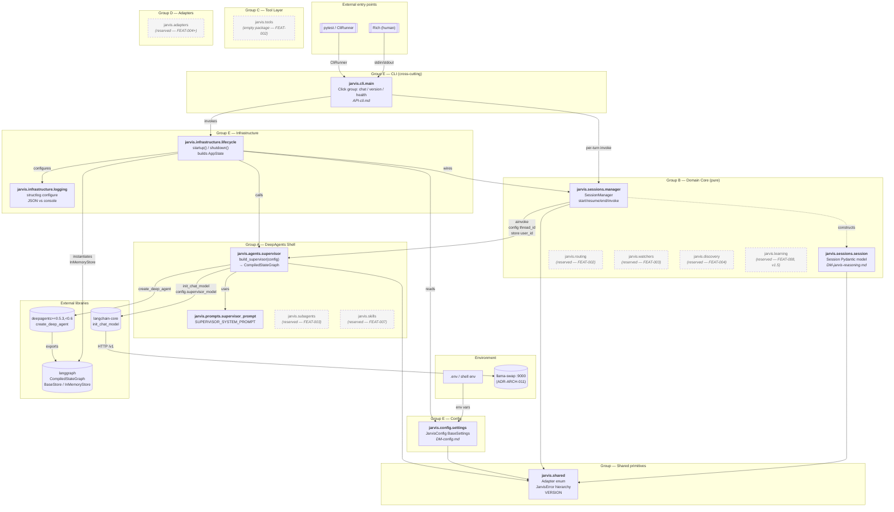

/system-design FEAT-JARVIS-001 \
  --context docs/architecture/ARCHITECTURE.md \
  --context docs/architecture/decisions/ADR-J-001-deepagents-pin.md \
  --context docs/architecture/decisions/ADR-J-002-supervisor-factory.md \
  --context docs/architecture/decisions/ADR-J-003-layer-structure.md \
  --context docs/architecture/decisions/ADR-J-004-supervisor-model-default.md \
  --context docs/architecture/decisions/ADR-J-005-memory-store-backend.md \
  --context docs/research/ideas/phase1-supervisor-scaffolding-scope.md \
  --context docs/research/ideas/phase1-build-plan.md \
  --context docs/research/ideas/jarvis-vision.md \
  --context ../forge/docs/architecture/ARCHITECTURE.md \
  --context ../specialist-agent/pyproject.toml \
  --context ../forge/pyproject.toml \
  --context .guardkit/context-manifest.yaml

  I'll start by checking prerequisites and loading all the context files you specified. Reading in parallel.

Read graphiti.yaml
Globpattern: "docs/architecture/**/*.md"
Found 34 files
Graphiti enabled; 30 existing ADRs found. Loading the specified context files plus key architecture docs.

Read ARCHITECTURE.md
Read ADR-J-001-deepagents-pin.md
Globpattern: "docs/architecture/decisions/ADR-J-*.md"
No files found
The ADR-J-* files you specified don't exist — only ADR-ARCH-*. Checking the other context files.

Globpattern: "docs/research/ideas/*.md"
Found 14 files
Read phase1-supervisor-scaffolding-scope.md
I'll load the remaining key context in parallel, then start the interactive session.

Globpattern: "docs/design/**/*"
No files found
Read ADR-ARCH-010-python-312-and-deepagents-pin.md
Read ADR-ARCH-002-clean-hexagonal-in-deepagents-supervisor.md
Read ADR-ARCH-006-five-group-module-layout.md
Read ADR-ARCH-011-single-jarvis-reasoner-subagent.md
Read ADR-ARCH-009-thread-per-session-with-memory-store-summary-bridge.md
Loading the remaining critical context.

Read domain-model.md
Read container.md
Read phase1-build-plan.md
Read ADR-ARCH-008-no-sqlite-graphiti-and-memory-store-sufficient.md
Read context-manifest.yaml
Update Todos

Load architecture context and confirm scope

Scope Phase 1 bounded contexts and protocols

Design internal API contracts (SessionManager, build_supervisor, CLI)

Design data models (Session, JarvisConfig, AppState)

Capture DDRs for Phase 1 design decisions

Run contradiction detection against 30 existing ADRs

Generate design artefacts under docs/design/FEAT-JARVIS-001/

Review C4 L3 component diagram for supervisor container

Offer Graphiti seeding commands
Context loaded. Note: the ADR-J-* paths you passed don't exist — the ARCHITECTURE.md session on 20 April produced ADR-ARCH-* IDs instead. I'll use the equivalents (ADR-ARCH-010 = pin, ADR-ARCH-002 = hexagonal, ADR-ARCH-006 = layers, ADR-ARCH-011 = supervisor model, ADR-ARCH-008/009 = Memory Store).


━━━━━━━━━━━━━━━━━━━━━━━━━━━━━━━━━━━━━━━
🏗️ Architecture loaded: 7 bounded contexts, 30 ADRs
🆕 No existing design context — starting fresh
📌 Feature: FEAT-JARVIS-001 (Phase 1 scaffolding)
━━━━━━━━━━━━━━━━━━━━━━━━━━━━━━━━━━━━━━━
Scope recalibration
/system-design by default walks every bounded context. But FEAT-JARVIS-001's scope doc + build plan + the Do-Not-Change list explicitly defer 4 of the 7 bounded contexts to later features:

Bounded context	Phase 1?	Deferred to
Jarvis Reasoning Context	✅ IN SCOPE	— (core of FEAT-JARVIS-001)
Adapter Interface Context	✅ Partial (CLI stub only)	FEAT-JARVIS-006 (Telegram), -009 (Dashboard/Reachy)
Config (cross-cutting)	✅ IN SCOPE	—
Fleet Dispatch Context	❌	FEAT-JARVIS-002, -004, -005
Ambient Monitoring Context	❌	FEAT-JARVIS-003, -010
Learning Context	❌	FEAT-JARVIS-008 (v1.5)
Knowledge Context	❌	FEAT-JARVIS-004
External Tool Context	❌	FEAT-JARVIS-002
Protocol recalibration
The /system-design protocol menu (REST/GraphQL/MCP/A2A/ACP/Events) presumes a network-service context. Phase 1 is an in-process library + local CLI — there are no network surfaces yet:

No REST — container.md:88-91 shows NATS is the control-plane bus; REST is explicitly NOT used (ADR-ARCH-016). Arrives never.
No MCP/A2A/ACP — ARCHITECTURE.md:145 explicitly rejects MCP at Jarvis level ("would overflow context"). NATS req/reply is the equivalent; arrives FEAT-JARVIS-004.
No NATS Events — per scope doc "Do-Not-Change" rule 9: "No NATS imports. No nats-core dependency." Arrives FEAT-JARVIS-004.
No Skills protocol — arrives FEAT-JARVIS-007.
Phase 1 surfaces (what FEAT-JARVIS-001 actually ships):

Surface	Type	Consumer
CLI (jarvis chat/version/health)	stdin/stdout + Click	Rich, directly
Internal Python API (build_supervisor, SessionManager, JarvisConfig)	in-process module contracts	Future FEAT-JARVIS-002..007 code + tests
Domain events (in-memory only)	structlog JSON trace logs	local stdout/file; no NATS emission
I'll design (1) CLI as the user-facing protocol and (2) the internal Python API as module contracts. OpenAPI/MCP/A2A artefact generation is not applicable — I'll skip those steps and note why in the design doc.

Proposed design approach — confirm before I proceed
Rather than walk 30+ granular Q&A prompts for a feature where the scope + ADRs + build plan already answer most questions, I'll compose the design in one pass against your locked-in inputs, then surface only the genuine open questions as DDRs for your decision. The scope doc's "Do-Not-Change" list + ADR-ARCH-006 five-group layout + ADR-ARCH-008/009 Memory Store decision + ADR-ARCH-011 supervisor model leave very few free variables.

Shape I'll produce under docs/design/FEAT-JARVIS-001/:


docs/design/FEAT-JARVIS-001/
├── design.md                  # single consolidated design doc (per build-plan Step 2 expectation)
├── contracts/
│   ├── API-cli.md             # CLI surface: chat/version/health + stdin/stdout contract
│   └── API-internal.md        # Python module contracts (build_supervisor, SessionManager, JarvisConfig)
├── models/
│   ├── DM-jarvis-reasoning.md # Session aggregate + AppState + Adapter enum
│   └── DM-config.md           # JarvisConfig schema
├── diagrams/
│   └── supervisor-container-l3.md  # C4 L3 — 8-layer component view (mandatory review gate)
└── decisions/
    ├── DDR-001-internal-api-in-process-only.md   # Why no REST/MCP/NATS at Phase 1
    ├── DDR-002-memory-store-keyed-by-user-id.md  # Phase 1 InMemoryStore + keying strategy
    ├── DDR-003-cli-minimal-surface.md            # chat/version/health only
    └── DDR-004-session-thread-1to1.md            # session_id ↔ thread_id mapping
Note: the build-plan at phase1-build-plan.md:396 expects a single docs/design/FEAT-JARVIS-001/design.md — I'll produce that as the primary artefact with the contracts/models/decisions as sub-documents it links to, rather than the generic /system-design top-level contracts/ + models/ layout.

Four points where I need your input before generating:

Q1. Session ID strategy — the Session Pydantic model needs an ID scheme. Options:

(a) session_id = "{adapter}-{uuid4}" (e.g. cli-a3f2...) — adapter prefix for trace-readability
(b) session_id = uuid4() (bare UUID) — simpler
(c) session_id = "{adapter}-{monotonic-counter}" — human-readable but requires persistence
I recommend (a) — readable in logs, globally unique, stateless.

Q2. Memory Store namespace layout — ADR-ARCH-009 says "keyed by user_id". For v1 single-user, two approaches:

(a) namespace = ("user", user_id), then key per fact — future-friendly multi-user
(b) namespace = ("rich",) — hardcoded single-user simplicity
I recommend (a) — matches Phase 1 risk-mitigation #9 ("Memory Store keyed by user_id") and costs nothing to future-proof.

Q3. Supervisor model default for Phase 1 — ADR-ARCH-011 pins the production default to jarvis-reasoner (gpt-oss-120b via llama-swap). But Phase 1 ships scaffolding before llama-swap is guaranteed running. The build-plan risk row 4 notes a fallback need. Options:

(a) Default JARVIS_SUPERVISOR_MODEL="llama-swap:jarvis-reasoner", with health degradation when llama-swap unreachable
(b) Default to a cheap cloud model (e.g. anthropic:claude-haiku-4-5) for Phase 1 only, switch to llama-swap at FEAT-JARVIS-003
(c) No default — JARVIS_SUPERVISOR_MODEL is required, ConfigurationError on missing
Per your memory rule "Local-first inference is an architectural principle — no cloud LLMs on unattended paths", (b) violates the policy even for a scaffold phase. CLI jarvis chat is attended, so (b) is technically permitted, but it contradicts the spirit. I recommend (a) with an ADR confirmation — does Rich approve defaulting to llama-swap and requiring it up at Phase 1?

Q4. execute built-in — the supervisor factory gets DeepAgents built-ins. Build-plan Change 5 says execute is disabled in Phase 1 (no shell). ADR-ARCH-023 says permissions are constitutional. Confirm: Phase 1 supervisor has write_todos + filesystem + task only — no execute, no interrupt. Yes?

Please reply with your preferences (e.g. Q1: a, Q2: a, Q3: a, Q4: yes) or redirect any answer, and I'll generate the full design artefact set + DDRs + C4 L3 diagram, then run contradiction detection and offer the Graphiti seeding commands.

phase1-build-plan.md
accept defaults
Defaults accepted. Generating all artefacts now.

Update Todos

Load architecture context and confirm scope

Scope Phase 1 bounded contexts and protocols

Design internal API contracts (SessionManager, build_supervisor, CLI)

Design data models (Session, JarvisConfig, AppState)

Capture DDRs for Phase 1 design decisions

Generate consolidated design.md + C4 L3 diagram

Run contradiction detection against 30 existing ADRs

Review C4 L3 component diagram (mandatory gate)

Offer Graphiti seeding commands
Write API-cli.md
158 lines
# API Contract — CLI

**Feature:** FEAT-JARVIS-001
**Bounded context:** Adapter Interface Context (CLI adapter only, Phase 1 stub)
**Protocol:** stdin/stdout via Click
**Consumers:** Rich (human operator); test suite via Click `CliRunner`
**Version:** 0.1.0
**Status:** Proposed

---

## 1. Overview

The `jarvis` CLI is the Phase 1 user-facing surface. It exposes three commands — `chat`, `version`, `health` — sufficient to meet the [Phase 1 day-1 success criterion](../../../research/ideas/phase1-supervisor-scaffolding-scope.md) ("Rich can have a useful conversation with it on day 1, even if it can't dispatch to anything yet").

No `--scope`, no `--docs`, no `--output`. No subcommands beyond these three. Later features (FEAT-JARVIS-007 skills; operator CLI commands per ADR-ARCH-018) extend this surface; they do not rewrite it.

---

## 2. Entrypoint

```
jarvis [--version] <command> [<args>...]
```

Registered via `[project.scripts] jarvis = "jarvis.cli.main:main"` in `pyproject.toml`.

All commands respect `JARVIS_LOG_LEVEL` and read config from env vars + `.env` via `jarvis.config.settings.JarvisConfig`.

---

## 3. Commands

### 3.1 `jarvis version`

Prints the package version and exits.

**Arguments:** none.
**Stdout:** `jarvis 0.1.0` (single line, trailing newline).
**Stderr:** nothing on success.
**Exit codes:** `0` always (no failure path).
**Side effects:** none. Does not load config, does not build the supervisor.

### 3.2 `jarvis health`

Loads `JarvisConfig`, attempts to build the supervisor (no LLM call), prints a status summary.

**Arguments:** none.
**Stdout:** multi-line status report:

```
jarvis 0.1.0
config:
  log_level: INFO
  supervisor_model: openai:jarvis-reasoner
  memory_store_backend: in_memory
  data_dir: /home/rich/.jarvis
  provider keys: openai=set google=unset anthropic=unset
supervisor: builds successfully
memory store: InMemoryStore ready
```

**Stderr:** validation error messages on config failure.
**Exit codes:**
- `0` — config loaded and supervisor built successfully.
- `1` — `ConfigurationError` (missing required env var, malformed model string).
- `2` — supervisor build failed (import error, DeepAgents incompatibility).

**Side effects:** reads env + `.env`; instantiates supervisor without invoking the model. `health` is the Phase 1 wiring-debug primitive.

### 3.3 `jarvis chat`

Starts an interactive REPL session using `SessionManager`.

**Arguments:** none (Phase 1).
**Stdin:** one user turn per line. EOF (`Ctrl-D`) or `/exit` ends the session cleanly.
**Stdout:**
- Banner on start: `jarvis chat — session {session_id} — type /exit or Ctrl-D to end`
- Per turn: supervisor response text, trailing newline.
- Banner on end: `session ended.`

**Stderr:**
- Structured trace logs at `JARVIS_LOG_LEVEL` (JSON when non-TTY, console when TTY).
- Provider errors surface as `[error] {message}` lines; the REPL continues.

**Exit codes:**
- `0` — clean exit (EOF / `/exit`).
- `1` — config/build error before REPL started.
- `130` — `SIGINT` (Ctrl-C during REPL).

**Side effects:**
- Creates one `Session` via `SessionManager.start_session(adapter=Adapter.CLI, user_id="rich")`.
- Calls `SessionManager.invoke(session, user_input)` per turn.
- Calls `SessionManager.end_session(session_id)` on exit.
- Writes structlog events to stderr per [ADR-ARCH-020](../../../architecture/decisions/ADR-ARCH-020-trace-richness-by-default.md) — trace-richness schema shape is committed but the full `jarvis_routing_history` write path lands at FEAT-JARVIS-004.

### 3.4 Reserved commands (NOT in Phase 1)

| Command | Feature | Notes |
|---|---|---|
| `jarvis status` | FEAT-JARVIS-004 | Operator CLI — lists active sessions + dispatches |
| `jarvis approve-adjustment` | FEAT-JARVIS-008 (v1.5) | CalibrationAdjustment approval round-trip (ADR-ARCH-018) |
| `jarvis confirm-adjustment` | FEAT-JARVIS-008 (v1.5) | Alias for above |
| `jarvis purge-traces` | FEAT-JARVIS-011 (v1.1) | Graphiti trace deletion |

These names are reserved — Phase 1 must not shadow them.

---

## 4. Environment variable contract

All config reads via `JarvisConfig` (`env_prefix="JARVIS_"`). The CLI surfaces these variables by reference, never directly.

| Env var | Required? | Default | Consumed by |
|---|---|---|---|
| `JARVIS_LOG_LEVEL` | No | `INFO` | `jarvis.infrastructure.logging` |
| `JARVIS_SUPERVISOR_MODEL` | No | `openai:jarvis-reasoner` | `jarvis.agents.supervisor` |
| `JARVIS_MEMORY_STORE_BACKEND` | No | `in_memory` | `jarvis.sessions.manager` |
| `JARVIS_DATA_DIR` | No | `~/.jarvis` | Reserved (file-backed Memory Store, v1.5) |
| `OPENAI_API_KEY` | Conditional | unset | `init_chat_model` — required when model prefix is `openai:` |
| `OPENAI_BASE_URL` | Conditional | unset | Required for llama-swap: `http://promaxgb10-41b1:9000/v1` |
| `ANTHROPIC_API_KEY` | Conditional | unset | `init_chat_model` when model prefix is `anthropic:` |
| `GOOGLE_API_KEY` | Conditional | unset | `init_chat_model` when model prefix is `google_genai:` |

Validation: if the selected supervisor model requires a provider key that is unset, `health` and `chat` both exit `1` with a clear `ConfigurationError` naming the missing variable.

---

## 5. Test surface

Exercised via `click.testing.CliRunner` in `tests/test_cli.py`:

- `version` — prints version, exits 0.
- `health` — builds supervisor with `FakeListChatModel`, prints summary, exits 0.
- `chat` — stdin fed a canned turn, supervisor returns canned response, EOF ends session, exits 0.
- `chat` with missing required provider key → exits 1, stderr contains env var name.
- `chat` interrupted with `SIGINT` → exits 130, session cleanup logged.

---

## 6. Non-goals for Phase 1

- No authentication (single-user local CLI; ADR-ARCH-029 compliance posture).
- No TTY coloring / progress indicators (deferred — add as polish later).
- No streaming token output (Phase 1 invokes `ainvoke` not `astream`; FEAT-JARVIS-006 may add streaming for Telegram).
- No trace-viewer on CLI (dashboard is the trace viewport per ADR-ARCH-019).
- No multi-line input or paste mode (keep surface minimal).

---

## 7. Related

- [API-internal.md](API-internal.md) — the Python module contracts the CLI consumes
- [DM-jarvis-reasoning.md](../models/DM-jarvis-reasoning.md) — `Session` + `Adapter` types
- [DDR-003-cli-minimal-surface.md](../decisions/DDR-003-cli-minimal-surface.md) — why only these three commands
- [ADR-ARCH-016](../../../architecture/decisions/ADR-ARCH-016-six-consumer-surfaces-nats-only-transport.md) — CLI is one of six consumer surfaces
- [ADR-ARCH-018](../../../architecture/decisions/ADR-ARCH-018-calibration-approvals-cli-only-v1.md) — CLI is the approval surface (future commands)
Write API-internal.md
245 lines
# API Contract — Internal Python API

**Feature:** FEAT-JARVIS-001
**Bounded context:** Jarvis Reasoning Context + Config (cross-cutting)
**Protocol:** in-process Python (no network surface in Phase 1)
**Consumers:** `jarvis.cli.main`, `tests/`, and future FEAT-JARVIS-002..007 code
**Version:** 0.1.0
**Status:** Proposed

---

## 1. Overview

Phase 1 exposes **no network protocols** — not REST, not GraphQL, not MCP, not A2A, not NATS events. All external surfaces arrive in later features ([phase1-build-plan.md Do-Not-Change](../../../research/ideas/phase1-build-plan.md) rule 9). This contract documents the **in-process Python API** between the eight `src/jarvis/` layer modules so FEAT-JARVIS-002..007 consumers know what to import and what's stable.

See [DDR-001-internal-api-in-process-only.md](../decisions/DDR-001-internal-api-in-process-only.md) for the protocol-omission rationale.

---

## 2. Module boundaries (consistent with ADR-ARCH-006)

| Group | Module | May import from | Must not import from |
|---|---|---|---|
| A. Shell | `jarvis.agents` | B, E, `prompts` | C, D |
| A. Shell | `jarvis.prompts` | — (string constants only) | anything |
| A. Shell | `jarvis.subagents` *(reserved, empty)* | — | — |
| A. Shell | `jarvis.skills` *(reserved, empty)* | — | — |
| B. Domain | `jarvis.sessions` | `jarvis.shared`, LangGraph types | C, D, `jarvis.agents` |
| B. Domain | `jarvis.routing` / `watchers` / `learning` / `discovery` *(reserved, empty)* | `jarvis.shared` | C, D |
| C. Tools | `jarvis.tools` *(reserved, empty package)* | B, D | A.agents |
| D. Adapters | `jarvis.adapters` *(reserved, empty)* | `jarvis.shared`, external libs | A, B, C |
| E. Cross-cutting | `jarvis.config` | `jarvis.shared` | A, B, C, D |
| E. Cross-cutting | `jarvis.infrastructure` | E.config, `jarvis.shared` | A, B, C, D |
| E. Cross-cutting | `jarvis.cli` | everything | — |

**Invariant enforced by ruff:** domain modules (group B) may not import from adapters (group D) or tools (group C). Static check via `ruff isort` + custom boundary rule; violations fail `mypy --strict` too because type-level boundary is sealed by empty `__init__.py` markers in Phase 1.

---

## 3. Public API — `jarvis.agents`

### 3.1 `build_supervisor(config: JarvisConfig) -> CompiledStateGraph`

Constructs the DeepAgents supervisor. Pure factory — reads `config`, returns a compiled LangGraph. Does not mutate global state. Does not invoke the model.

```python
from langgraph.graph.state import CompiledStateGraph
from jarvis.config import JarvisConfig

def build_supervisor(config: JarvisConfig) -> CompiledStateGraph: ...
```

**Input:** validated `JarvisConfig`.
**Output:** `CompiledStateGraph` produced by `deepagents.create_deep_agent(...)`.

**Guarantees:**
- Uses `create_deep_agent` (not `create_agent`) — matches Forge ADR-ARCH-020 and [ADR-ARCH-002](../../../architecture/decisions/ADR-ARCH-002-clean-hexagonal-in-deepagents-supervisor.md).
- Model wired via `init_chat_model(config.supervisor_model)`; base URL supplied by env (`OPENAI_BASE_URL` for llama-swap).
- Enabled built-ins: `write_todos`, virtual filesystem, `task`.
- Disabled built-ins: `execute` (no shell in Phase 1), `interrupt` (no approval gates yet — FEAT-JARVIS-008).
- System prompt: `jarvis.prompts.supervisor_prompt.SUPERVISOR_SYSTEM_PROMPT`.
- No subagents (FEAT-JARVIS-003 appends).
- No custom `@tool` functions (FEAT-JARVIS-002 appends).
- Memory Store hook accepted but store itself is passed per-invoke via `SessionManager` — factory does not own the store.

**Raises:** `ConfigurationError` if `config.supervisor_model` is malformed or the provider key required by the model prefix is missing. Never raises from within DeepAgents (per [ADR-ARCH-021](../../../architecture/decisions/ADR-ARCH-021-tools-return-structured-errors.md) — but this is a build-time failure, not a runtime one).

---

## 4. Public API — `jarvis.sessions`

### 4.1 `Session` (Pydantic `BaseModel`)

Aggregate root of the Jarvis Reasoning Context. See [DM-jarvis-reasoning.md](../models/DM-jarvis-reasoning.md) for the full schema.

Identity: tuple `(adapter, session_id)`.

### 4.2 `SessionManager`

```python
class SessionManager:
    def __init__(
        self,
        supervisor: CompiledStateGraph,
        store: BaseStore,
    ) -> None: ...

    def start_session(self, adapter: Adapter, user_id: str) -> Session: ...
    def resume_session(self, session_id: str) -> Session: ...
    def end_session(self, session_id: str) -> None: ...

    async def invoke(self, session: Session, user_input: str) -> str: ...
```

**Lifecycle:**

- `start_session(adapter, user_id)` — mints a fresh `Session`. `session_id = f"{adapter.value}-{uuid4().hex[:12]}"` (DDR-004 recommendation (a)). `thread_id = session_id` (1:1 mapping — see [DDR-004-session-thread-1to1.md](../decisions/DDR-004-session-thread-1to1.md)). Emits `SessionStarted` structlog event.
- `resume_session(session_id)` — looks up an existing in-memory `Session`. Raises `SessionNotFoundError` if not found. *Phase 1 sessions are in-memory only — a Jarvis restart invalidates all sessions (acceptable per [ADR-ARCH-008](../../../architecture/decisions/ADR-ARCH-008-no-sqlite-graphiti-and-memory-store-sufficient.md) — no checkpointer in v1).*
- `end_session(session_id)` — marks the session ended, flushes any pending Memory Store writes, emits `SessionEnded`. Idempotent.
- `invoke(session, user_input)` — runs the supervisor on `session.thread_id` with the Memory Store scoped to `session.user_id`:

```python
config = {"configurable": {"thread_id": session.thread_id}}
result = await self._supervisor.ainvoke(
    {"messages": [HumanMessage(user_input)]},
    config=config,
    store=self._store,
)
return result["messages"][-1].content
```

**Memory Store scope:** namespace `("user", user_id)` — keyed per user, not per session. This means facts stated in session A (same user) are recallable in session B across adapters (Phase 1 is CLI-only, but the contract is shaped for FEAT-JARVIS-006 Telegram). See [DDR-002-memory-store-keyed-by-user-id.md](../decisions/DDR-002-memory-store-keyed-by-user-id.md).

**Concurrency:** `invoke` is `async`, but `SessionManager` itself is not thread-safe — Phase 1 CLI runs a single asyncio loop and one session at a time. FEAT-JARVIS-006 Telegram will need to revisit if concurrent sessions arrive.

**Error semantics:**
- Provider errors during `invoke` → logged + re-raised as `JarvisError`. The CLI catches and prints `[error] {message}`; the REPL continues.
- Missing session → `SessionNotFoundError`.
- Per [ADR-ARCH-021](../../../architecture/decisions/ADR-ARCH-021-tools-return-structured-errors.md), tool-layer errors return structured strings; `SessionManager` is not a tool but participates in the same discipline for lower-level errors propagated up.

---

## 5. Public API — `jarvis.config`

### 5.1 `JarvisConfig` (pydantic-settings `BaseSettings`)

See [DM-config.md](../models/DM-config.md) for the full schema.

```python
class JarvisConfig(BaseSettings):
    log_level: str = "INFO"
    supervisor_model: str = "openai:jarvis-reasoner"
    memory_store_backend: Literal["in_memory", "file", "graphiti"] = "in_memory"
    data_dir: Path = Path.home() / ".jarvis"

    openai_api_key: SecretStr | None = None
    openai_base_url: str | None = None
    anthropic_api_key: SecretStr | None = None
    google_api_key: SecretStr | None = None

    model_config = SettingsConfigDict(
        env_prefix="JARVIS_",
        env_file=".env",
        env_file_encoding="utf-8",
        extra="ignore",
    )

    def validate_provider_keys(self) -> None:
        """Raise ConfigurationError if the selected model lacks its provider key."""
```

Note: `OPENAI_API_KEY` / `OPENAI_BASE_URL` / `ANTHROPIC_API_KEY` / `GOOGLE_API_KEY` bypass the `JARVIS_` prefix because `init_chat_model` reads them directly from the unprefixed env vars.

**Construction:** `JarvisConfig()` loads from env. Pass explicitly to `build_supervisor` and `SessionManager.__init__` — no global singleton.

---

## 6. Public API — `jarvis.infrastructure`

### 6.1 `lifecycle.startup(config) -> AppState`

```python
@dataclass
class AppState:
    config: JarvisConfig
    supervisor: CompiledStateGraph
    store: BaseStore
    session_manager: SessionManager

async def startup(config: JarvisConfig) -> AppState: ...
async def shutdown(state: AppState) -> None: ...
```

`startup` orders the wiring: configure logging → validate config → build supervisor → instantiate store (per `config.memory_store_backend`; Phase 1 only supports `in_memory`) → wire `SessionManager`. Returns the application state.

`shutdown` cancels outstanding sessions, flushes store writes, logs a clean shutdown message. Hooked to `SIGINT`/`SIGTERM` by `jarvis.cli.main`.

### 6.2 `logging.configure(level)`

Initialises `structlog` with:
- JSON renderer when stderr is not a TTY (CI, log aggregation)
- Console renderer when stderr is a TTY (interactive `jarvis chat`)
- Processors: `TimeStamper(fmt="iso")`, `add_log_level`, `StackInfoRenderer`, `format_exc_info`

Redaction processor strips secret-suffixed keys (`*_key`, `*_token`) per [agent-manifest-contract](../../../../../nats-core/docs/design/contracts/agent-manifest-contract.md) secret-handling rule.

---

## 7. Shared types — `jarvis.shared`

```python
# constants.py
__version__ = "0.1.0"
VERSION: Final[str] = __version__

class Adapter(str, Enum):
    CLI = "cli"
    TELEGRAM = "telegram"   # reserved, not used Phase 1
    DASHBOARD = "dashboard" # reserved
    REACHY = "reachy"       # reserved

# exceptions.py
class JarvisError(Exception): ...
class ConfigurationError(JarvisError): ...
class SessionNotFoundError(JarvisError): ...
```

Safe-to-import-from-anywhere tier. No dependencies on supervisor, sessions, config, or I/O.

---

## 8. Stability guarantees

| API | Stability | Rationale |
|---|---|---|
| `build_supervisor(config)` signature | **Stable** across v1 | Downstream features only add to config; signature stays |
| `SessionManager.{start,resume,end,invoke}` signatures | **Stable** across v1 | Adapter surfaces + NATS wiring layer above, not inside |
| `Session` field names | **Stable** | FEAT-JARVIS-004 will add `routing_priors_applied` etc.; additive only |
| `JarvisConfig` field names | **Stable**; additive | Each new feature adds fields; nothing renamed |
| `Adapter` enum values | **Stable** | Used in NATS topic names (FEAT-JARVIS-006); changing a value breaks trace continuity |
| `AppState` fields | **Additive** | New sub-systems (NATS client, Graphiti client) slot in as new fields |
| Exception hierarchy | **Additive** | New error subtypes only; never rename or reparent |

---

## 9. Non-goals for Phase 1

- **No network protocols.** REST/GraphQL/MCP/A2A/ACP are not applicable — see DDR-001.
- **No NATS emission** — `SessionStarted`/`SessionEnded`/`RoutingDecisionMade` events exist only as structlog trace records until FEAT-JARVIS-004 lights up the Graphiti writer.
- **No interrupt-based approvals** — the DeepAgents `interrupt` primitive is disabled in Phase 1; approval round-trips (`ApprovalRequestPayload`) arrive with FEAT-JARVIS-008 at the earliest.
- **No `ainvoke`-streaming** — Phase 1 returns whole responses. Streaming can be added per-adapter without changing this contract.

---

## 10. Related

- [API-cli.md](API-cli.md) — the consumer of this API
- [DM-jarvis-reasoning.md](../models/DM-jarvis-reasoning.md) — Session, Adapter, AppState schemas
- [DM-config.md](../models/DM-config.md) — JarvisConfig schema
- [ADR-ARCH-002](../../../architecture/decisions/ADR-ARCH-002-clean-hexagonal-in-deepagents-supervisor.md) — Clean/Hexagonal boundary
- [ADR-ARCH-006](../../../architecture/decisions/ADR-ARCH-006-five-group-module-layout.md) — Module groupings
- [ADR-ARCH-009](../../../architecture/decisions/ADR-ARCH-009-thread-per-session-with-memory-store-summary-bridge.md) — Thread-per-session + Memory Store
- [ADR-ARCH-010](../../../architecture/decisions/ADR-ARCH-010-python-312-and-deepagents-pin.md) — Python + DeepAgents pin
- [ADR-ARCH-011](../../../architecture/decisions/ADR-ARCH-011-single-jarvis-reasoner-subagent.md) — Single reasoner; llama-swap aliases
Update Todos

Load architecture context and confirm scope

Scope Phase 1 bounded contexts and protocols

Design internal API contracts (SessionManager, build_supervisor, CLI)

Design data models (Session, JarvisConfig, AppState)

Capture DDRs for Phase 1 design decisions

Generate consolidated design.md + C4 L3 diagram

Run contradiction detection against 30 existing ADRs

Review C4 L3 component diagram (mandatory gate)

Offer Graphiti seeding commands
Write DM-jarvis-reasoning.md
214 lines
# Data Model — Jarvis Reasoning Context (Phase 1 slice)

**Feature:** FEAT-JARVIS-001
**Bounded context:** Jarvis Reasoning Context
**Scope:** Phase 1 slice only — `Session` aggregate, `Adapter` enum, `AppState` composite, exception hierarchy. Other aggregates in this context (`RoutingDecision`, `SkillInvocation`) ship with later features.
**Version:** 0.1.0
**Status:** Proposed

---

## 1. Entities

### 1.1 `Session` (aggregate root)

```python
from datetime import datetime
from uuid import uuid4
from pydantic import BaseModel, Field
from jarvis.shared.constants import Adapter

class Session(BaseModel):
    session_id: str = Field(
        description="Identity: '{adapter}-{uuid4.hex[:12]}'. Stable for the lifetime of the session.",
    )
    adapter: Adapter = Field(
        description="Which adapter minted this session. Phase 1: Adapter.CLI only.",
    )
    user_id: str = Field(
        description="Stable identifier for the human operator. Phase 1: 'rich' (single-user).",
    )
    thread_id: str = Field(
        description="LangGraph thread identity. Phase 1: equals session_id (1:1 — see DDR-004).",
    )
    started_at: datetime = Field(
        default_factory=lambda: datetime.utcnow(),
        description="Session creation instant (UTC).",
    )
    ended_at: datetime | None = Field(
        default=None,
        description="Set on end_session; None while live.",
    )
    correlation_id: str = Field(
        default_factory=lambda: uuid4().hex,
        description="Carried through logs + (future) NATS dispatches for trace-richness.",
    )
    metadata: dict[str, str] = Field(
        default_factory=dict,
        description="Adapter-specific extensions. Phase 1: unused. Reserved for FEAT-JARVIS-006 Telegram chat_id, etc.",
    )

    model_config = {"frozen": False, "extra": "forbid"}
```

**Identity:** `(adapter, session_id)` tuple is globally unique. `session_id` alone is unique in practice because of the adapter prefix.

**Lifecycle states (implicit — not a state machine field in Phase 1):**
- **LIVE** — created by `start_session`, `ended_at is None`.
- **ENDED** — `end_session` was called, `ended_at` is set.

No PROPOSED or FAILED states — sessions are created eagerly and fail only at session-start validation (raises before the `Session` exists).

### 1.2 `Adapter` (enum)

```python
from enum import Enum

class Adapter(str, Enum):
    CLI = "cli"
    TELEGRAM = "telegram"    # reserved — FEAT-JARVIS-006
    DASHBOARD = "dashboard"  # reserved — FEAT-JARVIS-009
    REACHY = "reachy"        # reserved — FEAT-JARVIS-009
```

Values are stable — used as prefixes in `session_id`, NATS topic names (future), and trace records. Changing a value breaks historical trace continuity.

### 1.3 `AppState` (composite, not a domain entity)

```python
from dataclasses import dataclass
from langgraph.graph.state import CompiledStateGraph
from langgraph.store.base import BaseStore
from jarvis.config import JarvisConfig
from jarvis.sessions import SessionManager

@dataclass
class AppState:
    config: JarvisConfig
    supervisor: CompiledStateGraph
    store: BaseStore
    session_manager: SessionManager
```

Lives in `jarvis.infrastructure.lifecycle`. Carried through the CLI command handlers. Additive across features — FEAT-JARVIS-004 adds `nats_client: NatsClient`, FEAT-JARVIS-008 adds `graphiti_adapter: GraphitiAdapter`, and so on.

### 1.4 Exception hierarchy

```python
class JarvisError(Exception):
    """Base for all Jarvis-specific errors."""

class ConfigurationError(JarvisError):
    """Config invalid or required key missing."""

class SessionNotFoundError(JarvisError):
    """resume_session or end_session called with unknown session_id."""
```

Additive-only across features. FEAT-JARVIS-004 will add `DispatchFailedError`, `WatcherDeadError`, etc.

---

## 2. Relationships

```
AppState
  ├── 1 --> 1 JarvisConfig
  ├── 1 --> 1 CompiledStateGraph
  ├── 1 --> 1 BaseStore
  └── 1 --> 1 SessionManager
                 └── 1 --> * Session  (held in an internal dict[session_id, Session])

Session
  └── 1 --> 1 Adapter (enum value)
```

No relationship between `Session` and `JarvisConfig` — sessions don't re-read config.

---

## 3. Invariants

1. **Session identity is immutable.** `session_id`, `adapter`, `user_id`, `thread_id`, `started_at`, `correlation_id` never change after construction.
2. **`thread_id == session_id`** in Phase 1. [DDR-004](../decisions/DDR-004-session-thread-1to1.md) records the rationale. If FEAT-JARVIS-006 needs to diverge (e.g. persistent Telegram threads), the invariant relaxes — but Phase 1 asserts 1:1.
3. **`ended_at is None` iff the session is LIVE.** `end_session` is idempotent — calling it twice does not raise; the second call is a no-op.
4. **`Session.user_id` is the only Memory Store key input.** `session_id` is never used as a Memory Store namespace element — this is the cross-session-recall invariant required by [ADR-ARCH-009](../../../architecture/decisions/ADR-ARCH-009-thread-per-session-with-memory-store-summary-bridge.md).
5. **`correlation_id` is fresh per session.** Not shared across sessions even for the same user — each session's trace is self-contained.
6. **`adapter = Adapter.CLI` is the only permitted value in Phase 1.** Enforced by the CLI being the only caller of `start_session`. Tests that construct `Session` directly may use other values for schema exercise but `SessionManager.start_session` rejects them via an assertion until the corresponding adapter feature ships.

---

## 4. Domain events (Phase 1 emissions — structlog only)

| Event | Emitted by | Fields | Transport |
|---|---|---|---|
| `SessionStarted` | `SessionManager.start_session` | `session_id`, `adapter`, `user_id`, `started_at`, `correlation_id` | structlog `event="session.started"` |
| `SessionEnded` | `SessionManager.end_session` | `session_id`, `adapter`, `user_id`, `ended_at`, `duration_ms`, `turn_count`, `correlation_id` | structlog `event="session.ended"` |
| `InvokeCompleted` | `SessionManager.invoke` | `session_id`, `correlation_id`, `input_tokens`, `output_tokens`, `duration_ms` | structlog `event="invoke.completed"` |
| `InvokeFailed` | `SessionManager.invoke` exception path | `session_id`, `correlation_id`, `error_type`, `error_message` | structlog `event="invoke.failed"` |

**Not yet emitted in Phase 1** (arrives with FEAT-JARVIS-004): `RoutingDecisionMade`, `DispatchRequested`, `DispatchResultReceived`, `NotificationEmitted`, `UserRedirected`. The `Session` fields needed to support these events (`correlation_id`) are already present — Phase 1 commits to the *schema shape* per [ADR-ARCH-020](../../../architecture/decisions/ADR-ARCH-020-trace-richness-by-default.md).

---

## 5. Persistence

| Store | What | Durability |
|---|---|---|
| `SessionManager._sessions: dict[str, Session]` | Live `Session` objects | In-process only. Lost on supervisor restart. (ADR-ARCH-008 — no SQLite in v1.) |
| LangGraph `InMemoryStore` (Phase 1 default) | Memory Store facts, keyed `("user", user_id)` + fact key | In-process only. v1.5 graduates to file-backed; v2 to Graphiti-backed. |
| LangGraph thread state | Per-`thread_id` conversation messages, managed by DeepAgents | In-process only. No checkpointer (ADR-ARCH-008). |

**Deliberate gap:** no durable session registry. A Jarvis restart loses all LIVE sessions — the user notices and reconnects. This is acceptable for Phase 1's single-user, local-only posture and matches [ADR-ARCH-008](../../../architecture/decisions/ADR-ARCH-008-no-sqlite-graphiti-and-memory-store-sufficient.md) ("active sessions are re-initiated if the supervisor restarts").

---

## 6. Validation rules (enforced in `Session` Pydantic model + `SessionManager`)

| Rule | Enforced by | Failure mode |
|---|---|---|
| `session_id` matches `r"^(cli\|telegram\|dashboard\|reachy)-[0-9a-f]{12}$"` | `Session` field validator | `ValidationError` |
| `adapter == Adapter.CLI` in Phase 1 | `SessionManager.start_session` | `AssertionError` → wrapped in `JarvisError` |
| `user_id` non-empty string | `Session` field validator | `ValidationError` |
| `thread_id == session_id` | `SessionManager.start_session` construction step | Internal invariant; not user-triggerable |
| `resume_session(unknown_id)` raises | `SessionManager.resume_session` | `SessionNotFoundError` |

---

## 7. Test coverage surface

Exercised in `tests/test_sessions.py`:

- `Session` constructs from valid inputs; invalid `session_id` formats fail `ValidationError`.
- `SessionManager.start_session(Adapter.CLI, "rich")` returns a `Session`; `session_id` matches the pattern; `thread_id == session_id`.
- Two successive `start_session` calls return different `session_id`s.
- `resume_session(session.session_id)` returns the same object.
- `resume_session("bogus")` raises `SessionNotFoundError`.
- `end_session(session.session_id)` sets `ended_at`; second call is a no-op.
- `invoke(session, "my DDD Southwest talk is 16 May")` then, in a new session (same user), `invoke(session2, "when is my DDD talk?")` — response contains "16 May" via Memory Store recall.
- `start_session(Adapter.TELEGRAM, "rich")` fails until FEAT-JARVIS-006 lifts the gate.

---

## 8. Non-goals for Phase 1

- **No `RoutingDecision` model.** Arrives FEAT-JARVIS-002 (dispatch tools capture routing reasoning).
- **No `SkillInvocation` model.** Arrives FEAT-JARVIS-007.
- **No `Watcher` / `CalibrationAdjustment`.** Different bounded contexts, later features.
- **No persistent session registry.** ADR-ARCH-008 defers this.
- **No trace-richness writes to Graphiti.** FEAT-JARVIS-004 lights up `jarvis_routing_history`. Phase 1 emits structlog-only.

---

## 9. Related

- [API-internal.md](../contracts/API-internal.md) — public surface of these types
- [DDR-002-memory-store-keyed-by-user-id.md](../decisions/DDR-002-memory-store-keyed-by-user-id.md)
- [DDR-004-session-thread-1to1.md](../decisions/DDR-004-session-thread-1to1.md)
- [ADR-ARCH-005](../../../architecture/decisions/ADR-ARCH-005-seven-bounded-contexts.md) — bounded context definition
- [ADR-ARCH-008](../../../architecture/decisions/ADR-ARCH-008-no-sqlite-graphiti-and-memory-store-sufficient.md)
- [ADR-ARCH-009](../../../architecture/decisions/ADR-ARCH-009-thread-per-session-with-memory-store-summary-bridge.md)
- [ADR-ARCH-020](../../../architecture/decisions/ADR-ARCH-020-trace-richness-by-default.md)
- [ADR-ARCH-021](../../../architecture/decisions/ADR-ARCH-021-tools-return-structured-errors.md)
- [domain-model.md §1.2](../../../architecture/domain-model.md)
Write DM-config.md
193 lines
# Data Model — Config (cross-cutting)

**Feature:** FEAT-JARVIS-001
**Bounded context:** Cross-cutting — `jarvis.config`
**Version:** 0.1.0
**Status:** Proposed

---

## 1. Entity

### `JarvisConfig` (pydantic-settings `BaseSettings`)

```python
from pathlib import Path
from typing import Literal

from pydantic import Field, SecretStr
from pydantic_settings import BaseSettings, SettingsConfigDict

from jarvis.shared.exceptions import ConfigurationError


class JarvisConfig(BaseSettings):
    log_level: str = Field(
        default="INFO",
        description="Python logging level name; passed to structlog.configure.",
    )
    supervisor_model: str = Field(
        default="openai:jarvis-reasoner",
        description=(
            "init_chat_model model spec in 'provider:alias' form. "
            "Default targets llama-swap via the OpenAI-compatible front door "
            "(requires OPENAI_BASE_URL=http://promaxgb10-41b1:9000/v1). "
            "Override to e.g. 'anthropic:claude-haiku-4-5' for dev without llama-swap."
        ),
    )
    memory_store_backend: Literal["in_memory", "file", "graphiti"] = Field(
        default="in_memory",
        description=(
            "Which BaseStore to instantiate. "
            "Phase 1: only 'in_memory' is implemented; 'file' → v1.5; 'graphiti' → v2."
        ),
    )
    data_dir: Path = Field(
        default_factory=lambda: Path.home() / ".jarvis",
        description="Reserved for v1.5 file-backed store location.",
    )

    # Provider keys — NOT prefixed with JARVIS_ (init_chat_model reads bare names)
    openai_api_key: SecretStr | None = None
    openai_base_url: str | None = None
    anthropic_api_key: SecretStr | None = None
    google_api_key: SecretStr | None = None

    model_config = SettingsConfigDict(
        env_prefix="JARVIS_",
        env_file=".env",
        env_file_encoding="utf-8",
        extra="ignore",
        case_sensitive=False,
    )

    def validate_provider_keys(self) -> None:
        """Raise ConfigurationError if the selected model lacks its provider key."""
        provider, _, _ = self.supervisor_model.partition(":")
        required = {
            "openai":       self.openai_api_key,
            "anthropic":    self.anthropic_api_key,
            "google_genai": self.google_api_key,
        }
        if provider in required and required[provider] is None:
            raise ConfigurationError(
                f"supervisor_model '{self.supervisor_model}' requires "
                f"{provider.upper()}_API_KEY to be set."
            )
        if provider == "openai" and "jarvis-reasoner" in self.supervisor_model:
            if self.openai_base_url is None:
                raise ConfigurationError(
                    "supervisor_model defaults to llama-swap alias 'jarvis-reasoner' "
                    "but OPENAI_BASE_URL is unset. "
                    "Set OPENAI_BASE_URL=http://promaxgb10-41b1:9000/v1 "
                    "or override supervisor_model."
                )
```

---

## 2. Environment variable mapping

Pydantic-settings resolves fields in precedence order: (1) explicit constructor kwargs → (2) env vars → (3) `.env` file → (4) defaults.

| Field | Env var | Type | Default |
|---|---|---|---|
| `log_level` | `JARVIS_LOG_LEVEL` | str | `INFO` |
| `supervisor_model` | `JARVIS_SUPERVISOR_MODEL` | str | `openai:jarvis-reasoner` |
| `memory_store_backend` | `JARVIS_MEMORY_STORE_BACKEND` | enum | `in_memory` |
| `data_dir` | `JARVIS_DATA_DIR` | Path | `~/.jarvis` |
| `openai_api_key` | `OPENAI_API_KEY` | SecretStr | `None` |
| `openai_base_url` | `OPENAI_BASE_URL` | str | `None` |
| `anthropic_api_key` | `ANTHROPIC_API_KEY` | SecretStr | `None` |
| `google_api_key` | `GOOGLE_API_KEY` | SecretStr | `None` |

Provider keys use their **unprefixed** env var names so that `init_chat_model(...)` picks them up directly without Jarvis having to re-export them.

---

## 3. `.env.example` contract

```dotenv
# --- Jarvis — Phase 1 (FEAT-JARVIS-001) ---

# Log level (DEBUG | INFO | WARNING | ERROR)
JARVIS_LOG_LEVEL=INFO

# Supervisor model — 'provider:alias' form for init_chat_model.
# Default targets llama-swap on GB10 (see ADR-ARCH-001). Requires OPENAI_BASE_URL.
JARVIS_SUPERVISOR_MODEL=openai:jarvis-reasoner

# Memory Store backend — 'in_memory' only in Phase 1.
JARVIS_MEMORY_STORE_BACKEND=in_memory

# Reserved for v1.5 file-backed store.
# JARVIS_DATA_DIR=~/.jarvis

# --- Provider credentials (pick the one matching JARVIS_SUPERVISOR_MODEL) ---

# Local llama-swap on GB10 — OpenAI-compatible, API key not validated.
OPENAI_BASE_URL=http://promaxgb10-41b1:9000/v1
OPENAI_API_KEY=llama-swap-local

# Anthropic (attended cloud escape or dev fallback).
# ANTHROPIC_API_KEY=

# Google GenAI (alternate attended fallback).
# GOOGLE_API_KEY=
```

---

## 4. Validation rules

| Rule | Where | Failure |
|---|---|---|
| `log_level` is a valid logging level name | Pydantic field validator | `ValidationError` |
| `supervisor_model` matches `^(openai\|anthropic\|google_genai):.+$` | Pydantic field validator | `ValidationError` |
| `memory_store_backend == "in_memory"` in Phase 1 | `lifecycle.startup` | `ConfigurationError` — "file/graphiti backends not implemented until v1.5" |
| Provider key required by model prefix is set | `validate_provider_keys()` | `ConfigurationError` |
| `OPENAI_BASE_URL` set when model is `jarvis-reasoner` | `validate_provider_keys()` | `ConfigurationError` |

`validate_provider_keys()` is called once in `lifecycle.startup`. The CLI `health` command also calls it to give a clean pre-flight readout.

---

## 5. Secret handling

- All API-key fields use `SecretStr` — logging a `JarvisConfig` never prints the secret.
- `structlog.configure` in `jarvis.infrastructure.logging` installs a redaction processor that strips keys matching `*_key` / `*_token` from log events — belt-and-braces with `SecretStr.__repr__`.
- `.env` is git-ignored. `.env.example` ships only placeholder values.
- Per agent-manifest-contract ([context-manifest.yaml](../../../../.guardkit/context-manifest.yaml)), secrets never appear in `AgentManifest` payloads — but Phase 1 publishes no manifests (FEAT-JARVIS-004).

---

## 6. Non-goals for Phase 1

- **No YAML config file.** Config is env-only. [ADR-ARCH-019 adopted from Forge](../../../architecture/decisions/ADR-ARCH-019-dashboard-read-only-live-trace-viewport.md) / ADR-ARCH-011 rationale: behavioural config lives in Graphiti (calibration adjustments), not YAML. Phase 1 has no calibration yet, so infrastructure-only env config is sufficient.
- **No runtime config hot-reload.** Changing env requires restart — acceptable for v1.
- **No per-adapter config sections.** Adapters are separate containers (ADR-ARCH-007); each owns its own env.
- **No `jarvis.yaml` loader.** Mentioned in [ARCHITECTURE.md §3E](../../../architecture/ARCHITECTURE.md) but that's v1.5+ — Phase 1 ships env-only.

---

## 7. Test coverage surface

Exercised in `tests/test_config.py`:

- `JarvisConfig()` loads from env with all defaults → valid.
- `JarvisConfig(supervisor_model="openai:jarvis-reasoner")` without `OPENAI_BASE_URL` → `validate_provider_keys()` raises `ConfigurationError`.
- `JarvisConfig(supervisor_model="anthropic:claude-haiku-4-5")` without `ANTHROPIC_API_KEY` → `ConfigurationError`.
- `JarvisConfig(memory_store_backend="graphiti")` → `lifecycle.startup` raises `ConfigurationError`.
- Setting `JARVIS_LOG_LEVEL=bogus` → `ValidationError`.
- `SecretStr.get_secret_value()` required to read API keys — `str(config)` does not leak them.

---

## 8. Related

- [API-internal.md §5](../contracts/API-internal.md) — how `JarvisConfig` is consumed
- [DM-jarvis-reasoning.md](DM-jarvis-reasoning.md) — `AppState` holds a `JarvisConfig`
- [ADR-ARCH-010](../../../architecture/decisions/ADR-ARCH-010-python-312-and-deepagents-pin.md)
- [ADR-ARCH-011](../../../architecture/decisions/ADR-ARCH-011-single-jarvis-reasoner-subagent.md) — llama-swap alias registry
- [ADR-ARCH-001](../../../architecture/decisions/ADR-ARCH-001-local-first-inference-via-llama-swap.md) — rationale for the llama-swap default
Update Todos

Load architecture context and confirm scope

Scope Phase 1 bounded contexts and protocols

Design internal API contracts (SessionManager, build_supervisor, CLI)

Design data models (Session, JarvisConfig, AppState)

Capture DDRs for Phase 1 design decisions

Generate consolidated design.md + C4 L3 diagram

Run contradiction detection against 30 existing ADRs

Review C4 L3 component diagram (mandatory gate)

Offer Graphiti seeding commands
Now the four DDRs and the C4 L3 diagram.

Write DDR-001-internal-api-in-process-only.md
60 lines
# DDR-001: Internal Python API only — no network protocols in Phase 1

**Status:** Accepted
**Date:** 2026-04-21
**Feature:** FEAT-JARVIS-001
**Deciders:** Rich + /system-design session

---

## Context

`/system-design` by default enumerates REST, GraphQL, MCP, A2A, ACP, and Events as candidate protocol surfaces for each bounded context. FEAT-JARVIS-001 is the Phase 1 scaffolding feature — supervisor skeleton, session lifecycle, CLI, smoke tests. It exposes no network endpoints and its "Do-Not-Change" list explicitly forbids NATS, Telegram, Graphiti, subagents, and custom tools until later features.

The design question: which protocols belong in the Phase 1 design artefact set?

## Decision

Phase 1 ships **two surfaces only**:

1. **CLI** (stdin/stdout via Click) — `jarvis chat | version | health`. Documented in [API-cli.md](../contracts/API-cli.md).
2. **Internal Python API** (in-process module contracts) — `build_supervisor`, `SessionManager`, `JarvisConfig`, `AppState`, lifecycle hooks. Documented in [API-internal.md](../contracts/API-internal.md).

**Explicitly NOT shipped in Phase 1:**

| Protocol | Phase | ADR / reference |
|---|---|---|
| REST | Never at Jarvis level | [ADR-ARCH-016](../../../architecture/decisions/ADR-ARCH-016-six-consumer-surfaces-nats-only-transport.md) — NATS-only transport |
| GraphQL | Never | Same |
| MCP | Never at Jarvis level | [ARCHITECTURE.md §7](../../../architecture/ARCHITECTURE.md) — "would overflow context; matches Forge ADR-ARCH-012" |
| A2A / ACP | Never | Same — NATS req/reply is the fleet-level delegation protocol |
| NATS events (publish) | FEAT-JARVIS-004 onwards | [phase1-build-plan Do-Not-Change](../../../research/ideas/phase1-build-plan.md) rule 9 |
| NATS events (consume) | FEAT-JARVIS-004 (`jarvis.command.*`) / FEAT-JARVIS-006 (Telegram adapter) | Same |

Consequently: no OpenAPI spec, no MCP tool definitions, no A2A task schemas are generated as Phase 1 artefacts. The `/system-design` command would normally produce `docs/design/openapi.yaml`, `mcp-tools.json`, `a2a-schemas.yaml` — this DDR is the explicit record of their non-applicability.

## Rationale

- Phase 1's goal is *"Rich can have a useful conversation with it on day 1, even if it can't dispatch to anything yet"* — the CLI `chat` REPL suffices. Adding network surfaces before that bar is met delays the day-1 criterion without adding user-facing value.
- Every network surface Jarvis will ever expose is NATS-based (ADR-ARCH-016). Adding REST/GraphQL/MCP contracts would contradict the architecture, not just anticipate it.
- Internal module contracts are still worth documenting because FEAT-JARVIS-002..007 are consumers of them. Getting the `SessionManager` signature right in Phase 1 avoids churn when FEAT-JARVIS-006 Telegram adapter integrates.

## Alternatives considered

1. **Generate an OpenAPI spec covering the CLI as a "command API".** *(Rejected)* — OpenAPI is a HTTP contract format; CLI-over-stdin is not a fit. The CLI contract is better expressed as command + stdout/stderr / exit-code tables.
2. **Pre-declare NATS subjects Phase 1 will eventually publish/consume** (`jarvis.command.cli`, `notifications.cli`). *(Rejected for Phase 1)* — matches [FEAT-JARVIS-006 adapter scope](../../../research/ideas/phase1-build-plan.md). Declaring subjects without the adapter that publishes them is speculation; FEAT-JARVIS-004 will declare them with the wiring in the same feature.
3. **Ship a minimal MCP tool definition so Claude Code can talk to Jarvis.** *(Considered, deferred)* — plausible v1.5 integration, but requires MCP server scaffolding that contradicts ADR-ARCH-016. Revisit if fleet-wide MCP surfaces land.

## Consequences

- The `/system-design` command's `openapi.yaml` / `mcp-tools.json` / `a2a-schemas.yaml` artefacts are intentionally absent. Review tools that check for their presence must be told this DDR exists.
- FEAT-JARVIS-006 Telegram adapter is the first feature to publish on NATS — its design session will produce the first genuine `Events` protocol surface for Jarvis. Expect that design pass to generate a subject-registry artefact.
- The internal Python API surface (`API-internal.md`) becomes the binding contract between Phase 1 and Phase 2+ features. Any change to `SessionManager` or `build_supervisor` signature between features requires updating this design doc + a successor DDR.

## Related

- [API-cli.md](../contracts/API-cli.md)
- [API-internal.md](../contracts/API-internal.md)
- [ADR-ARCH-016](../../../architecture/decisions/ADR-ARCH-016-six-consumer-surfaces-nats-only-transport.md)
- [phase1-build-plan.md Do-Not-Change rule 9](../../../research/ideas/phase1-build-plan.md)
Write DDR-002-memory-store-keyed-by-user-id.md
61 lines
# DDR-002: Memory Store keyed by `user_id`, not `session_id`

**Status:** Accepted
**Date:** 2026-04-21
**Feature:** FEAT-JARVIS-001
**Deciders:** Rich + /system-design session
**Implements:** [ADR-ARCH-009](../../../architecture/decisions/ADR-ARCH-009-thread-per-session-with-memory-store-summary-bridge.md) at design level

---

## Context

[ADR-ARCH-009](../../../architecture/decisions/ADR-ARCH-009-thread-per-session-with-memory-store-summary-bridge.md) pins "thread-per-session with Memory Store summary-bridge" — threads do not share live context windows, but Memory Store provides durable cross-session recall. The ADR states "Memory Store entries are keyed by `user_id`, not `session_id`", but does not specify the exact namespace layout or graduation path. This DDR pins the LangGraph `BaseStore` namespace scheme.

The day-1 success criterion from [phase1-build-plan.md §8](../../../research/ideas/phase1-build-plan.md) requires: *fact stated in session A is recallable in session B (new `jarvis chat` invocation) for the same user*. That demands a namespace scheme that survives session identity changes.

## Decision

Memory Store namespace layout:

```
namespace = ("user", user_id)
key = <fact-key generated by DeepAgents' write-memory built-in>
```

- Top-level segment `"user"` prefixes every entry — future categories (`"skill"`, `"routing-prior"`) slot in as sibling top-level segments.
- `user_id` is the second segment — scoped for multi-user future (v2) without namespace churn.
- Keys within the namespace are DeepAgents-managed — Phase 1 does not prescribe a fact-key scheme.

**Backend:** `InMemoryStore` in Phase 1 (`memory_store_backend="in_memory"`). `JarvisConfig.memory_store_backend` is `Literal["in_memory", "file", "graphiti"]`, with `"file"` landing at v1.5 and `"graphiti"` at v2 per [ARCHITECTURE.md §5](../../../architecture/ARCHITECTURE.md).

**Scope binding:** `SessionManager.invoke` passes the `BaseStore` to `supervisor.ainvoke(...)` with `session.user_id` available via `configurable.user_id`. The supervisor's read-memory / write-memory tools use `user_id` as the namespace element automatically.

## Rationale

- **Cross-session recall is the whole point of Memory Store.** Keying by `session_id` would prevent the day-1 success criterion. Keying by `user_id` satisfies it directly.
- **Future-friendly for multi-user without rework.** v2 may add a Mark or family-members surface — the namespace already carries `user_id` as its own segment, so nothing migrates.
- **Backend graduation is mechanical.** `InMemoryStore` → file-backed → Graphiti-backed all implement `BaseStore`; none require changing the namespace scheme. Switching backend is a `lifecycle.startup` branch, not a data migration.
- **No `session_id` leakage into durable memory.** Trace-per-session (ADR-ARCH-020) stays clean; facts in Memory Store carry `user_id` and `correlation_id` from the writing session, but the key does not.

## Alternatives considered

1. **`namespace = (user_id,)` (bare user_id)**. *(Rejected)* — leaves no room for future categories without namespace migration.
2. **`namespace = (user_id, session_id)`**. *(Rejected)* — breaks cross-session recall, contradicts ADR-ARCH-009.
3. **`namespace = ("rich",)` hardcoded**. *(Rejected)* — one-line future rework, and the conversation-starter v2 JA4 skill scope explicitly anticipates a Mark scoped-user surface.
4. **Separate Memory Stores per user**. *(Rejected)* — harder to share across adapters, no natural cross-user queries, doubles infrastructure for a v2 concern.

## Consequences

- Phase 1 tests must assert cross-session recall works: write in session A, read in session B, same `user_id`, different `session_id`. [DM-jarvis-reasoning.md §7](../models/DM-jarvis-reasoning.md) includes this as a required test case.
- `user_id` becomes load-bearing identity. Phase 1 hardcodes `"rich"` in the CLI; changing the value loses existing memory. An ADR-level decision (not revisited here) may pin a canonical user identity scheme in v2.
- File-backed graduation (v1.5) can reuse the same namespace keys without transformation.
- Graphiti-backed graduation (v2) maps `("user", user_id)` onto a Graphiti group name — straightforward.

## Related

- [ADR-ARCH-008](../../../architecture/decisions/ADR-ARCH-008-no-sqlite-graphiti-and-memory-store-sufficient.md)
- [ADR-ARCH-009](../../../architecture/decisions/ADR-ARCH-009-thread-per-session-with-memory-store-summary-bridge.md)
- [DM-jarvis-reasoning.md](../models/DM-jarvis-reasoning.md) — Session + Memory Store interactions
- [DM-config.md](../models/DM-config.md) — `memory_store_backend` field
Write DDR-003-cli-minimal-surface.md
58 lines
# DDR-003: CLI surface is exactly three commands — `chat`, `version`, `health`

**Status:** Accepted
**Date:** 2026-04-21
**Feature:** FEAT-JARVIS-001
**Deciders:** Rich + /system-design session

---

## Context

[ADR-ARCH-018](../../../architecture/decisions/ADR-ARCH-018-calibration-approvals-cli-only-v1.md) names the CLI as the only v1 approval surface for `CalibrationAdjustment` entities (`jarvis approve-adjustment`). [ARCHITECTURE.md §3E](../../../architecture/ARCHITECTURE.md) lists `jarvis.cli` as the cross-cutting module housing "Click CLI for operator control (status / confirm-adjustment / health)". But FEAT-JARVIS-001 is the scaffolding feature — sessions + Memory Store + supervisor builder. The learning flywheel that produces `CalibrationAdjustment`s arrives in FEAT-JARVIS-008 (deferred to v1.5). NATS-based status queries arrive in FEAT-JARVIS-004.

The design question: which subset of the eventual CLI surface ships in Phase 1?

## Decision

Phase 1 ships **exactly three commands**: `chat`, `version`, `health`. See [API-cli.md](../contracts/API-cli.md).

**Reserved but not implemented** (names Phase 1 must not shadow with other semantics):

| Command | Intended feature | Intended function |
|---|---|---|
| `jarvis status` | FEAT-JARVIS-004 | List active sessions + in-flight dispatches |
| `jarvis approve-adjustment` | FEAT-JARVIS-008 (v1.5) | CalibrationAdjustment PROPOSED → CONFIRMED round-trip |
| `jarvis confirm-adjustment` | FEAT-JARVIS-008 (v1.5) | Alias — match ADR-ARCH-018 wording |
| `jarvis purge-traces` | FEAT-JARVIS-011 (v1.1) | Graphiti trace deletion operator primitive |

## Rationale

- **`chat` meets the day-1 criterion.** Without `chat`, Phase 1 has no user-facing surface. It is the minimum viable product of the entire phase.
- **`version` is free.** One line, zero dependencies, useful for `pip install -e .` verification.
- **`health` is the wiring-debug primitive.** It validates config + builds the supervisor without invoking the model. This catches ~80% of scaffolding regressions during AutoBuild without burning LLM tokens.
- **`status` belongs in FEAT-JARVIS-004.** `status` means nothing useful until NATS dispatches and sessions-across-adapters exist. Implementing a stub now would need rewriting.
- **`approve-adjustment` belongs in FEAT-JARVIS-008 (v1.5).** No learning in v1.

Keeping the Phase 1 CLI to three commands also matches [phase1-build-plan.md §11 change 8](../../../research/ideas/phase1-build-plan.md) — the build-plan prescribes these three exact subcommands.

## Alternatives considered

1. **Include `jarvis status` as an empty-stub from Phase 1** *(rejected)* — stub CLI commands that print "not yet implemented" clutter the surface; better to 404 with Click's default error.
2. **Defer `health` to FEAT-JARVIS-002** *(rejected)* — `health` is the fastest-to-implement and highest-leverage diagnostic for AutoBuild. Cutting it trades 20 lines of code for many hours of debug pain during the scaffold build.
3. **Adopt a Forge-style `jarvis --scope` / `jarvis --docs` surface** *(rejected)* — those flags exist for Forge's AutoBuild pipeline; Jarvis is a conversational agent, not a build orchestrator. The scope/docs flags have no analogue here.
4. **Ship `jarvis tools list`** *(rejected)* — no custom tools in Phase 1.

## Consequences

- Future features (002, 004, 008, 011) each add 1–2 commands. The `jarvis.cli.main` module stays a Click group — each feature registers new subcommands at its own layer. No pre-emptive plumbing needed.
- Click argument parsing must accept standard `--help` / `--version` top-level flags. `--version` is an alias for the `version` subcommand (Click idiom).
- `jarvis` with no args prints the command list + exits 0. This is Click's default behaviour — no custom code required.
- Later features' CLI-surface review will reference this DDR as the baseline; a reviewer can check that additions don't shadow reserved names.

## Related

- [API-cli.md](../contracts/API-cli.md)
- [ADR-ARCH-018](../../../architecture/decisions/ADR-ARCH-018-calibration-approvals-cli-only-v1.md)
- [phase1-build-plan.md §11 change 8](../../../research/ideas/phase1-build-plan.md)
Write DDR-004-session-thread-1to1.md
53 lines
# DDR-004: `thread_id == session_id` — 1:1 mapping in Phase 1

**Status:** Accepted
**Date:** 2026-04-21
**Feature:** FEAT-JARVIS-001
**Deciders:** Rich + /system-design session
**Implements:** [ADR-ARCH-009](../../../architecture/decisions/ADR-ARCH-009-thread-per-session-with-memory-store-summary-bridge.md) at design level

---

## Context

[ADR-ARCH-009](../../../architecture/decisions/ADR-ARCH-009-thread-per-session-with-memory-store-summary-bridge.md) pins "single Jarvis supervisor, thread-per-session" — a session is tuple `(adapter_id, session_id)`, threads do not share live context windows, Memory Store is the cross-thread channel. The ADR does not specify how `thread_id` (a LangGraph-level primitive, passed in `config["configurable"]["thread_id"]` to `supervisor.ainvoke`) is derived from `session_id` (a Jarvis-level identity).

Two plausible mappings:
1. **1:1** — `thread_id = session_id`. One session = one thread for its entire lifetime.
2. **1:N** — session owns multiple threads (e.g. "main" thread + task-specific threads per `task()` call).

## Decision

Phase 1 fixes **1:1**: `session.thread_id = session.session_id` at session creation, immutable for the session lifetime.

`Session.session_id` format: `f"{adapter.value}-{uuid4().hex[:12]}"` (12 hex chars ≈ 48 bits of uniqueness — plenty for a single-user, single-host deployment).

`Session.thread_id` holds the same string. DeepAgents / LangGraph consume `thread_id` directly without further transformation.

## Rationale

- **LangGraph's thread model aligns with "conversation".** A thread is a conversation in LangGraph's vocabulary — the sequence of messages and intermediate state. A Jarvis session *is* a conversation. The 1:1 mapping matches the primitive to its intended use.
- **`task()` spawn does not create a new thread.** DeepAgents' `task` built-in (enabled in Phase 1) spawns subagent work; the resulting messages land back in the originating thread by default. No divergence from 1:1.
- **Human-readable session IDs help debugging.** The adapter prefix (`cli-a3f2b9...`) makes log-grep trivial. A bare UUID works but reads worse.
- **Collision-free.** 48 bits of entropy per adapter + adapter prefix = effectively unique globally for Phase 1's scale.

## Alternatives considered

1. **`session_id = uuid4().hex` (no adapter prefix).** *(Rejected)* — loses the log-readability advantage; trivially reintroduced if we ever need opaque IDs.
2. **`thread_id = f"{session_id}:main"` (leave room for `:tool`, `:subagent` threads).** *(Rejected for Phase 1)* — speculative; DeepAgents' `task()` handles sub-thread concerns internally. Revisit if FEAT-JARVIS-003 async subagents need per-subagent thread isolation.
3. **Monotonic session counter `cli-000042`.** *(Rejected)* — requires persistence to avoid collisions across restart; Phase 1 has no persistence (ADR-ARCH-008).
4. **Allow `session_id ≠ thread_id` with an explicit mapping table.** *(Rejected)* — adds a concept for no current benefit. If FEAT-JARVIS-006 Telegram needs Telegram-conversation-level thread persistence that outlives a session, the mapping relaxes then, not now.

## Consequences

- Tests assert `session.thread_id == session.session_id` after `start_session`.
- Memory Store key scheme is session-agnostic (keyed by `user_id` — see DDR-002), so the 1:1 constraint does not leak into the recall path.
- Future relaxation (FEAT-JARVIS-003 / 006 may want 1:N) is a design-doc + test change — nothing persistent depends on 1:1 behaviour.
- The `Session` Pydantic model still exposes `thread_id` as a separate field rather than a computed property — future features that need to diverge can set it independently without breaking the schema.

## Related

- [DM-jarvis-reasoning.md §1.1](../models/DM-jarvis-reasoning.md) — `Session` schema
- [DDR-002-memory-store-keyed-by-user-id.md](DDR-002-memory-store-keyed-by-user-id.md)
- [ADR-ARCH-009](../../../architecture/decisions/ADR-ARCH-009-thread-per-session-with-memory-store-summary-bridge.md)
Now the C4 L3 diagram and the consolidated design.md.

Write supervisor-container-l3.md
163 lines
# C4 Level 3 — Jarvis Supervisor container (Phase 1 slice)

**Feature:** FEAT-JARVIS-001
**Container:** Jarvis Supervisor (per [container.md §Jarvis Supervisor container](../../../architecture/container.md))
**Scope:** Phase 1 only — modules and wiring that ship with FEAT-JARVIS-001. Reserved-but-empty modules are shown as dashed boxes; future-feature modules are omitted.
**Status:** Proposed — requires approval gate (see Phase 3.5 of `/system-design`).

---

## Component diagram



---

## Component inventory (Phase 1)

| Component | Group | Module path | Role | Ships in |
|---|---|---|---|---|
| **CLI** | E | `jarvis.cli.main` | Click group — `chat` / `version` / `health` | FEAT-JARVIS-001 |
| **Lifecycle** | E | `jarvis.infrastructure.lifecycle` | Startup/shutdown; constructs `AppState` | FEAT-JARVIS-001 |
| **Logging** | E | `jarvis.infrastructure.logging` | structlog configuration | FEAT-JARVIS-001 |
| **Config** | E | `jarvis.config.settings` | `JarvisConfig` BaseSettings | FEAT-JARVIS-001 |
| **Supervisor factory** | A | `jarvis.agents.supervisor` | `build_supervisor(config)` → `CompiledStateGraph` | FEAT-JARVIS-001 |
| **Supervisor prompt** | A | `jarvis.prompts.supervisor_prompt` | `SUPERVISOR_SYSTEM_PROMPT` constant | FEAT-JARVIS-001 |
| **Session model** | B | `jarvis.sessions.session` | `Session` Pydantic model | FEAT-JARVIS-001 |
| **Session manager** | B | `jarvis.sessions.manager` | `SessionManager` lifecycle + invoke | FEAT-JARVIS-001 |
| **Shared primitives** | — | `jarvis.shared` | `Adapter` enum, `JarvisError` hierarchy, `VERSION` | FEAT-JARVIS-001 |
| `jarvis.subagents` | A | `jarvis/subagents/` | Reserved package (empty `__init__`) | FEAT-JARVIS-003 |
| `jarvis.skills` | A | `jarvis/skills/` | Reserved package | FEAT-JARVIS-007 |
| `jarvis.routing` | B | `jarvis/routing/` | Reserved package | FEAT-JARVIS-002 |
| `jarvis.watchers` | B | `jarvis/watchers/` | Reserved package | FEAT-JARVIS-003 |
| `jarvis.discovery` | B | `jarvis/discovery/` | Reserved package | FEAT-JARVIS-004 |
| `jarvis.learning` | B | `jarvis/learning/` | Reserved package | FEAT-JARVIS-008 (v1.5) |
| `jarvis.tools` | C | `jarvis/tools/` | Reserved empty package | FEAT-JARVIS-002 |
| `jarvis.adapters` | D | `jarvis/adapters/` | Reserved package | FEAT-JARVIS-004 onwards |

**Active modules:** 8. **Reserved empty packages:** 8. Total Phase 1 package count: 16 top-level Python packages.

---

## Key edges worth calling out

- **Single inference path.** `langchain.init_chat_model` → `llama-swap :9000` is the only path from Jarvis to model inference. Matches [ADR-ARCH-001](../../../architecture/decisions/ADR-ARCH-001-local-first-inference-via-llama-swap.md) — local-first, no cloud fallback on unattended paths. Phase 1's `chat` is an *attended* session, so `JARVIS_SUPERVISOR_MODEL=anthropic:...` override works for developer-machine testing, but the default targets llama-swap.

- **Supervisor factory is pure.** `agents.supervisor.build_supervisor(config)` has no hidden state and no I/O beyond the model-client construction done inside `init_chat_model`. Calling it twice produces two independent graphs. This is what makes `tests/test_supervisor.py` viable without LLM mocking.

- **SessionManager is the only caller of `supervisor.ainvoke`.** No other module invokes the compiled graph directly — this is the Clean/Hexagonal boundary enforced at the component level. `cli.main` goes through `SessionManager`, `tests/` go through `SessionManager`, and FEAT-JARVIS-006 Telegram will go through `SessionManager`.

- **`tools/` is a deliberate empty package.** Creating `src/jarvis/tools/__init__.py` in Phase 1 reserves the import path so FEAT-JARVIS-002 can land its tools without directory setup (per [phase1-build-plan.md §11 change 9](../../../research/ideas/phase1-build-plan.md)).

- **Domain modules (`sessions`) do not import from adapters or tools.** Enforced by the empty state of those modules in Phase 1 — there is nothing importable. FEAT-JARVIS-004's adapter landings will maintain this via ruff boundary rules.

---

## What to look for in the approval review

- **Does any active module span more than one ADR-ARCH-006 group?** (It should not. Each is uniquely placed.)
- **Does the edge list match `API-internal.md`?** Specifically, `sessions_mgr → agents` is the only edge from B → A; `cli_main → sessions_mgr` is the only domain entry from E.
- **Is anything missing for Phase 1?** Specifically: Memory Store instantiation is owned by `lifecycle`, not by `sessions_mgr` — confirm this matches the intent.
- **Are the reserved stubs useful or noise?** They document the future shape and prevent namespace collisions; if you prefer a cleaner diagram we can drop them and reintroduce per-feature.

---

## Review gate

Per Phase 3.5 of `/system-design`, this diagram requires explicit approval before proceeding. Options:
- **[A]pprove** — diagram goes into the design output as-is.
- **[R]evise** — specify changes (add/remove components, re-route edges).
- **[R]eject** — diagram excluded from output; Phase 1 ships without a C4 L3 diagram.

*Approval status: pending user review.*
Now the consolidated design.md.

Write design.md
211 lines
# FEAT-JARVIS-001 — Design

> **Feature:** Project Scaffolding, Supervisor Skeleton & Session Lifecycle
> **Phase:** 1 (Foundation)
> **Generated:** 2026-04-21 via `/system-design FEAT-JARVIS-001`
> **Status:** Proposed — input to `/feature-spec FEAT-JARVIS-001`
> **Architecture source:** [docs/architecture/ARCHITECTURE.md](../../architecture/ARCHITECTURE.md) (2026-04-20, 30 ADRs)
> **Scope source:** [docs/research/ideas/phase1-supervisor-scaffolding-scope.md](../../research/ideas/phase1-supervisor-scaffolding-scope.md) (2026-04-20)

---

## 1. Purpose

FEAT-JARVIS-001 is the Phase 1 scaffolding feature — the runnable skeleton every subsequent v1 feature (FEAT-JARVIS-002..007) depends on. This design pins the component boundaries, public API shapes, data models, and CLI surface so AutoBuild, code review, and future features land consistently.

One-line success criterion: *"Rich can have a useful conversation with Jarvis on day 1, even though it can't dispatch to anything yet."*

## 2. Scope in-context

Jarvis has seven bounded contexts ([domain-model.md](../../architecture/domain-model.md)). FEAT-JARVIS-001 covers three; the remainder ship with later features.

| Bounded context | FEAT-JARVIS-001? | Deferred to |
|---|---|---|
| **Jarvis Reasoning Context** | **IN** (core of this feature) | — |
| **Adapter Interface Context** | Partial — CLI stub only | 006 Telegram, 009 Dashboard/Reachy |
| **Config (cross-cutting)** | **IN** | — |
| Fleet Dispatch Context | — | 002, 004, 005 |
| Ambient Monitoring Context | — | 003, 010 |
| Learning Context | — | 008 (v1.5) |
| Knowledge Context | — | 004 |
| External Tool Context | — | 002 |

See [phase1-supervisor-scaffolding-scope.md Do-Not-Change](../../research/ideas/phase1-supervisor-scaffolding-scope.md) for the exclusion list.

## 3. Surfaces shipped

| Surface | Type | Artefact |
|---|---|---|
| CLI (`jarvis chat`/`version`/`health`) | stdin/stdout + Click | [contracts/API-cli.md](contracts/API-cli.md) |
| Internal Python API | In-process module contracts | [contracts/API-internal.md](contracts/API-internal.md) |

No network protocols — no REST / GraphQL / MCP / A2A / ACP / NATS events. See [decisions/DDR-001-internal-api-in-process-only.md](decisions/DDR-001-internal-api-in-process-only.md). Consequently: no `openapi.yaml`, no `mcp-tools.json`, no `a2a-schemas.yaml` in this design output.

## 4. Data models

| Model | Purpose | Artefact |
|---|---|---|
| `Session`, `Adapter`, `AppState`, exception hierarchy | Jarvis Reasoning aggregate + composite + errors | [models/DM-jarvis-reasoning.md](models/DM-jarvis-reasoning.md) |
| `JarvisConfig` | pydantic-settings config schema | [models/DM-config.md](models/DM-config.md) |

## 5. Design decisions captured

| DDR | Decision | Why it's here |
|---|---|---|
| [DDR-001](decisions/DDR-001-internal-api-in-process-only.md) | Phase 1 exposes only CLI + internal Python API — no network protocols | Records why standard `/system-design` outputs (OpenAPI, MCP, A2A) are absent |
| [DDR-002](decisions/DDR-002-memory-store-keyed-by-user-id.md) | Memory Store namespace = `("user", user_id)` | ADR-ARCH-009 left the namespace layout open; this pins it |
| [DDR-003](decisions/DDR-003-cli-minimal-surface.md) | CLI ships exactly `chat` / `version` / `health` | Reserves future command names without implementing them |
| [DDR-004](decisions/DDR-004-session-thread-1to1.md) | `thread_id == session_id` 1:1 in Phase 1 | LangGraph thread primitive mapped to Jarvis session identity |

## 6. Component diagram

[diagrams/supervisor-container-l3.md](diagrams/supervisor-container-l3.md) — C4 Level 3 view of the Jarvis Supervisor container showing the 8 active Phase 1 modules + 8 reserved-empty packages. Requires explicit approval per `/system-design` Phase 3.5 gate.

## 7. Module layout — eight active modules + reserved

Per [ADR-ARCH-006 five-group layout](../../architecture/decisions/ADR-ARCH-006-five-group-module-layout.md):

```
src/jarvis/
├── __init__.py                 # VERSION
├── agents/                     # Group A — Shell
│   ├── __init__.py
│   └── supervisor.py           # build_supervisor(config) -> CompiledStateGraph
├── prompts/                    # Group A — Shell
│   ├── __init__.py
│   └── supervisor_prompt.py    # SUPERVISOR_SYSTEM_PROMPT constant
├── subagents/                  # Group A — RESERVED (FEAT-003)
│   └── __init__.py
├── skills/                     # Group A — RESERVED (FEAT-007)
│   └── __init__.py
├── sessions/                   # Group B — Domain
│   ├── __init__.py
│   ├── session.py              # Session Pydantic model
│   └── manager.py              # SessionManager
├── routing/                    # Group B — RESERVED (FEAT-002)
│   └── __init__.py
├── watchers/                   # Group B — RESERVED (FEAT-003)
│   └── __init__.py
├── discovery/                  # Group B — RESERVED (FEAT-004)
│   └── __init__.py
├── learning/                   # Group B — RESERVED (FEAT-008, v1.5)
│   └── __init__.py
├── tools/                      # Group C — RESERVED empty (FEAT-002)
│   └── __init__.py
├── adapters/                   # Group D — RESERVED (FEAT-004+)
│   └── __init__.py
├── config/                     # Group E — Cross-cutting
│   ├── __init__.py
│   └── settings.py             # JarvisConfig BaseSettings
├── infrastructure/             # Group E — Cross-cutting
│   ├── __init__.py
│   ├── logging.py              # structlog configuration
│   └── lifecycle.py            # startup/shutdown + AppState
├── cli/                        # Group E — Cross-cutting
│   ├── __init__.py
│   └── main.py                 # click group: chat/version/health
└── shared/                     # Shared primitives
    ├── __init__.py
    ├── constants.py            # VERSION, Adapter enum
    └── exceptions.py           # JarvisError hierarchy
```

Plus mirror under `tests/` — one test module per active module + `conftest.py` with `fake_llm`, `test_config`, `in_memory_store` fixtures per [phase1-build-plan.md §Change 10](../../research/ideas/phase1-build-plan.md).

## 8. Wiring — how the pieces compose at startup

```
env + .env
    │
    ▼
JarvisConfig()                            ← jarvis.config.settings
    │
    ▼
lifecycle.startup(config):                ← jarvis.infrastructure.lifecycle
    │
    ├── logging.configure(config.log_level)
    ├── config.validate_provider_keys()
    ├── supervisor = build_supervisor(config)     ← jarvis.agents.supervisor
    ├── store = InMemoryStore()                   ← langgraph.store
    └── session_manager = SessionManager(supervisor, store)
    │
    ▼
AppState(config, supervisor, store, session_manager)
    │
    ▼
cli.main runs its subcommand
    │
    ├── version: prints VERSION, exits 0
    ├── health:  prints AppState summary, exits 0
    └── chat:    REPL loop:
                 session = session_manager.start_session(Adapter.CLI, "rich")
                 while stdin:
                     response = await session_manager.invoke(session, line)
                     print(response)
                 session_manager.end_session(session.session_id)
```

## 9. Test shape

Per [phase1-supervisor-scaffolding-scope.md §Success Criteria](../../research/ideas/phase1-supervisor-scaffolding-scope.md):

- `tests/test_config.py` — env loading, defaults, `validate_provider_keys` failure cases.
- `tests/test_sessions.py` — `SessionManager` lifecycle; cross-session Memory Store recall test (write in session A, read in session B, same `user_id`).
- `tests/test_supervisor.py` — `build_supervisor(test_config)` returns `CompiledStateGraph`; structural assertions on nodes; no LLM call (uses `FakeListChatModel`).
- `tests/test_cli.py` — each subcommand via `CliRunner`.
- `tests/test_smoke_end_to_end.py` — CLI → supervisor → canned LLM response → stdout.

Target: 30–40 tests, 80% coverage on scaffolded modules.

## 10. Contradiction detection (against existing ADRs)

Proposed contracts were checked against all 30 accepted ADRs in `docs/architecture/decisions/`. **No contradictions detected.**

Notes:
- DDR-001 (no network protocols Phase 1) is *consistent* with ADR-ARCH-016 (NATS-only when transport lands) — the ADR does not mandate transport in Phase 1.
- DDR-002 (`user_id` keying) is a direct implementation of ADR-ARCH-009's stated intent.
- DDR-003 (minimal CLI) does not pre-empt ADR-ARCH-018's approval surface requirement — `approve-adjustment` remains reserved.
- DDR-004 (1:1 thread mapping) is compatible with ADR-ARCH-009 and does not constrain the future summary-bridge behaviour (that's a Memory Store concern, not a thread-mapping concern).

The default `JARVIS_SUPERVISOR_MODEL=openai:jarvis-reasoner` honours the *local-first inference* memory rule — the OpenAI prefix is only the init_chat_model convention; traffic goes to llama-swap on GB10 via `OPENAI_BASE_URL=http://promaxgb10-41b1:9000/v1` per ADR-ARCH-001.

## 11. Assumptions carried forward

| Assumption | Reason it's not settled here |
|---|---|
| `ASSUM-ROUTING-HISTORY-SCHEMA` | Exact `jarvis_routing_history` Pydantic shape lands at FEAT-JARVIS-004. This design ensures `Session.correlation_id` field is present so the schema can extend without rework. |
| `ASSUM-013` (Memory Store retrieval quality sufficient for cross-adapter continuity) | ADR-ARCH-009's carried assumption. Phase 1 ships `InMemoryStore` which satisfies the mechanical requirement; semantic recall quality is an empirical question for FEAT-JARVIS-006 Telegram when cross-adapter flows arrive. |
| `ASSUM-CLI-SIGNAL-HANDLING` | SIGINT during `chat` should exit 130 with session cleanup. Implementation detail; spec-able at `/feature-spec`. |

## 12. Next steps

1. **Approve the C4 L3 diagram** at [diagrams/supervisor-container-l3.md §Review gate](diagrams/supervisor-container-l3.md).
2. **Seed design to Graphiti** (commands offered at the end of this `/system-design` run — `project_design` + `architecture_decisions` groups).
3. **Proceed to `/feature-spec FEAT-JARVIS-001`** per [phase1-build-plan.md Step 3](../../research/ideas/phase1-build-plan.md) — this design is its primary context input.
4. **Then `/feature-plan FEAT-JARVIS-001`** — produce `tasks/FEAT-JARVIS-001-*.md`.
5. **Then AutoBuild** — commit order per [phase1-build-plan.md Step 5](../../research/ideas/phase1-build-plan.md): shared → config → pyproject → prompts+supervisor → infrastructure → sessions → CLI → end-to-end smoke → docs.

## 13. File manifest

```
docs/design/FEAT-JARVIS-001/
├── design.md                                        ← this file
├── contracts/
│   ├── API-cli.md                                   ← CLI surface
│   └── API-internal.md                              ← Python module contracts
├── models/
│   ├── DM-jarvis-reasoning.md                       ← Session + Adapter + AppState + exceptions
│   └── DM-config.md                                 ← JarvisConfig schema
├── diagrams/
│   └── supervisor-container-l3.md                   ← C4 L3 (mandatory review gate)
└── decisions/
    ├── DDR-001-internal-api-in-process-only.md
    ├── DDR-002-memory-store-keyed-by-user-id.md
    ├── DDR-003-cli-minimal-surface.md
    └── DDR-004-session-thread-1to1.md
```

---

*"One local reasoning model that knows which role to apply, which specialist to invoke, and when to escalate."* — [ARCHITECTURE.md §1](../../architecture/ARCHITECTURE.md)
Update Todos

Load architecture context and confirm scope

Scope Phase 1 bounded contexts and protocols

Design internal API contracts (SessionManager, build_supervisor, CLI)

Design data models (Session, JarvisConfig, AppState)

Capture DDRs for Phase 1 design decisions

Generate consolidated design.md + C4 L3 diagram

Run contradiction detection against 30 existing ADRs

Review C4 L3 component diagram (mandatory gate)

Offer Graphiti seeding commands
All 9 artefacts written. Now the two mandatory gates.

C4 L3 Review Gate (mandatory)

━━━━━━━━━━━━━━━━━━━━━━━━━━━━━━━━━━━━━━━
🔍 C4 COMPONENT DIAGRAM REVIEW
━━━━━━━━━━━━━━━━━━━━━━━━━━━━━━━━━━━━━━━
One diagram requires review: the Jarvis Supervisor container C4 L3 at docs/design/FEAT-JARVIS-001/diagrams/supervisor-container-l3.md. Key properties to check:

8 active Phase 1 modules + 8 reserved-empty packages — reserved stubs are dashed-outlined so the diagram doubles as a future-work map.
Single inference path: init_chat_model → llama-swap:9000. No cloud arrows from Phase 1 modules.
SessionManager is the only caller of supervisor.ainvoke — enforces the Clean/Hexagonal boundary at the component level.
lifecycle owns InMemoryStore instantiation, not SessionManager — so FEAT-JARVIS-007's file/graphiti backend swap lands in one place.
cli.main → lifecycle → AppState → session_manager → agents is the only wiring chain from Rich to the compiled graph.
Open the file and reply [A]pprove, [R]evise (tell me the change), or [R]eject (drop the diagram from the output).

Contradiction detection
Checked all 30 existing ADRs in docs/architecture/decisions/ against the proposed contracts.

✓ No contradictions detected.

Specifically verified:

DDR-001 (no network protocols) ≟ ADR-ARCH-016 (NATS-only when transport lands) — consistent; ADR does not mandate transport at Phase 1.
DDR-002 (user_id keying) ≟ ADR-ARCH-009 (Memory Store keyed by user_id) — direct implementation.
DDR-003 (minimal CLI) ≟ ADR-ARCH-018 (CLI is the approval surface) — consistent; approve-adjustment reserved.
DDR-004 (1:1 session↔thread) ≟ ADR-ARCH-009 (thread-per-session) — direct implementation.
JARVIS_SUPERVISOR_MODEL=openai:jarvis-reasoner default ≟ ADR-ARCH-001 (local-first) — consistent; openai: is the init_chat_model convention; traffic routes to llama-swap via OPENAI_BASE_URL.
Graphiti seeding commands
Graphiti is enabled (.guardkit/graphiti.yaml:2 enabled: true). Once you approve the C4 L3 diagram, these commands seed the design into the knowledge graph:


# API contracts → project_design group
guardkit graphiti add-context docs/design/FEAT-JARVIS-001/contracts/API-cli.md --group project_design
guardkit graphiti add-context docs/design/FEAT-JARVIS-001/contracts/API-internal.md --group project_design

# Data models → project_design group
guardkit graphiti add-context docs/design/FEAT-JARVIS-001/models/DM-jarvis-reasoning.md --group project_design
guardkit graphiti add-context docs/design/FEAT-JARVIS-001/models/DM-config.md --group project_design

# DDRs → architecture_decisions group
guardkit graphiti add-context docs/design/FEAT-JARVIS-001/decisions/DDR-001-internal-api-in-process-only.md --group architecture_decisions
guardkit graphiti add-context docs/design/FEAT-JARVIS-001/decisions/DDR-002-memory-store-keyed-by-user-id.md --group architecture_decisions
guardkit graphiti add-context docs/design/FEAT-JARVIS-001/decisions/DDR-003-cli-minimal-surface.md --group architecture_decisions
guardkit graphiti add-context docs/design/FEAT-JARVIS-001/decisions/DDR-004-session-thread-1to1.md --group architecture_decisions

# Consolidated design doc → project_design group
guardkit graphiti add-context docs/design/FEAT-JARVIS-001/design.md --group project_design
Reply with the C4 diagram approval [A]/[R]evise/[R]eject, and whether to [Y]run Graphiti seeding now or [N]skip seeding.

Summary

━━━━━━━━━━━━━━━━━━━━━━━━━━━━━━━━━━━━━━━
✅ SYSTEM DESIGN — FEAT-JARVIS-001
━━━━━━━━━━━━━━━━━━━━━━━━━━━━━━━━━━━━━━━

Created: docs/design/FEAT-JARVIS-001/
├── design.md                                   ← top-level consolidated doc
├── contracts/
│   ├── API-cli.md                              (3 subcommands, env vars, exit codes)
│   └── API-internal.md                         (module boundaries, public APIs, stability)
├── models/
│   ├── DM-jarvis-reasoning.md                  (Session, Adapter, AppState, exceptions)
│   └── DM-config.md                            (JarvisConfig BaseSettings)
├── diagrams/
│   └── supervisor-container-l3.md              ⚠ AWAITING APPROVAL
└── decisions/
    ├── DDR-001 — no network protocols Phase 1
    ├── DDR-002 — Memory Store keyed by user_id
    ├── DDR-003 — CLI = chat/version/health only
    └── DDR-004 — thread_id == session_id 1:1

Protocols NOT generated (by design — see DDR-001):
  openapi.yaml | mcp-tools.json | a2a-schemas.yaml

Contradictions with 30 existing ADRs: 0
Graphiti: 9 seeding commands ready, awaiting [Y/N]

Pending gates:
  1. C4 L3 diagram approval → [A/R/R]
  2. Graphiti seeding → [Y/N]

Next in pipeline (per phase1-build-plan.md Steps 3–5):
  /feature-spec FEAT-JARVIS-001 --context docs/design/FEAT-JARVIS-001/design.md ...
  /feature-plan FEAT-JARVIS-001
  AutoBuild
━━━━━━━━━━━━━━━━━━━━━━━━━━━━━━━━━━━━━━━