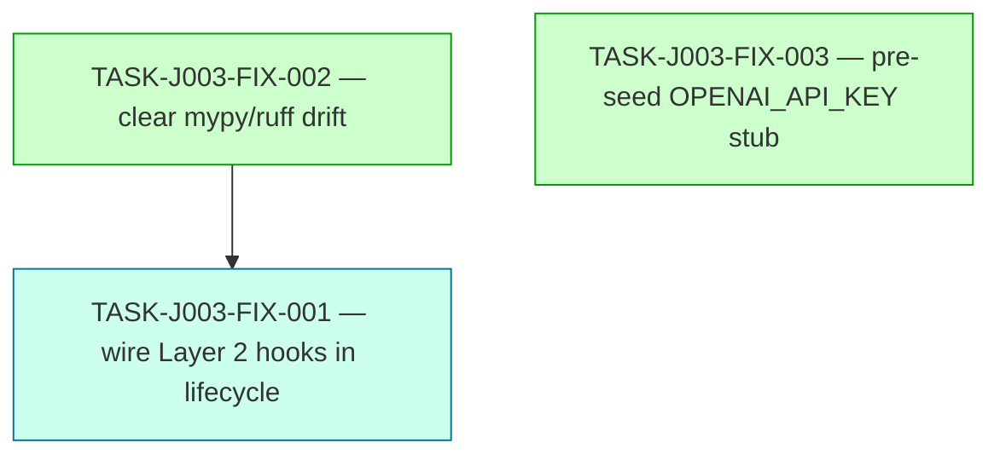

/task-review FEAT-JARVIS-003 \
  --context tasks/FEAT-JARVIS-003-*.md \
  --context docs/research/ideas/phase2-dispatch-foundations-scope.md \
  --context docs/research/ideas/phase2-build-plan.md

 The feature folder uses lowercase. Let me check whether the user's --context paths (phase2 scope/build plan) line up with FEAT-JARVIS-003 (which by name is async subagent + frontier escape, not dispatch).

Bash List FEAT folder contents
IN
ls -la tasks/backlog/feat-jarvis-003-async-subagent-and-frontier-escape/ 2>/dev/null; echo "---"; ls -la tasks/backlog/feat-jarvis-002-core-tools-and-dispatch/ 2>/dev/null | head -10

OUT
total 232
drwxr-xr-x  25 richardwoollcott  staff    800 Apr 26 10:46 .
drwxr-xr-x  36 richardwoollcott  staff   1152 Apr 26 10:46 ..
-rw-r--r--   1 richardwoollcott  staff  18741 Apr 24 15:01 IMPLEMENTATION-GUIDE.md
-rw-r--r--   1 richardwoollcott  staff   6115 Apr 24 16:12 README.md
-rw-r--r--@  1 richardwoollcott  staff   2716 Apr 26 08:31 TASK-J003-001-extend-jarvisconfig-with-feat-j003-fields.md
-rw-r--r--@  1 richardwoollcott  staff   2702 Apr 26 08:32 TASK-J003-002-define-rolename-frontiertarget-closed-enums.md
-rw-r--r--@  1 richardwoollcott  staff   2896 Apr 26 08:32 TASK-J003-003-define-asynctaskinput-swapstatus-pydantic-models.md
-rw-r--r--@  1 richardwoollcott  staff   2917 Apr 26 08:30 TASK-J003-004-define-frontierescalationcontext-pydantic-model.md
-rw-r--r--@  1 richardwoollcott  staff   3016 Apr 26 08:32 TASK-J003-005-role-prompt-registry-module-and-3-prompts.md
-rw-r--r--@  1 richardwoollcott  staff   2763 Apr 26 08:32 TASK-J003-006-pyproject-provider-sdks-and-langgraph-dep.md
-rw-r--r--@  1 richardwoollcott  staff   2697 Apr 26 10:46 TASK-J003-009-implement-subagent-registry-build-async-subagents.md
-rw-r--r--@  1 richardwoollcott  staff   3598 Apr 26 10:46 TASK-J003-011-implement-escalate-to-frontier-layer-2-executor-assertion.md
-rw-r--r--@  1 richardwoollcott  staff   2921 Apr 26 10:46 TASK-J003-012-assemble-tool-list-session-aware-layer-3.md
-rw-r--r--@  1 richardwoollcott  staff   3104 Apr 26 10:46 TASK-J003-013-extend-build-supervisor-signature.md
-rw-r--r--@  1 richardwoollcott  staff   3508 Apr 26 10:46 TASK-J003-014-extend-supervisor-prompt-subagent-routing-and-frontier-escalation.md
-rw-r--r--@  1 richardwoollcott  staff   3924 Apr 26 10:46 TASK-J003-015-extend-lifecycle-startup-with-subagents-and-ambient-factory.md
-rw-r--r--@  1 richardwoollcott  staff   2659 Apr 26 10:46 TASK-J003-016-langgraph-json-at-repo-root.md
-rw-r--r--@  1 richardwoollcott  staff   3656 Apr 26 10:46 TASK-J003-017-unit-tests-subagent-layer.md
-rw-r--r--@  1 richardwoollcott  staff   4494 Apr 26 10:46 TASK-J003-018-unit-tests-escalate-to-frontier.md
-rw-r--r--@  1 richardwoollcott  staff   3016 Apr 26 10:46 TASK-J003-019-unit-tests-llamaswap-adapter-and-voice-ack.md
-rw-r--r--@  1 richardwoollcott  staff   3663 Apr 26 10:46 TASK-J003-020-regression-test-no-retired-roster-strings.md
-rw-r--r--@  1 richardwoollcott  staff   2982 Apr 26 10:46 TASK-J003-021-integration-test-supervisor-with-subagents.md
-rw-r--r--@  1 richardwoollcott  staff   3272 Apr 26 10:46 TASK-J003-022-integration-test-role-propagation.md
-rw-r--r--@  1 richardwoollcott  staff   3011 Apr 26 10:46 TASK-J003-023-acceptance-test-routing-e2e.md
-rw-r--r--@  1 richardwoollcott  staff   1597 Apr 26 10:46 TASK-J003-024-langgraph-json-smoke-validation.md
---
total 264
drwxr-xr-x  25 richardwoollcott  staff    800 Apr 25 17:55 .
drwxr-xr-x  36 richardwoollcott  staff   1152 Apr 26 10:46 ..
-rw-r--r--   1 richardwoollcott  staff  20342 Apr 24 08:19 IMPLEMENTATION-GUIDE.md
-rw-r--r--   1 richardwoollcott  staff   6949 Apr 24 08:19 README.md
-rw-r--r--@  1 richardwoollcott  staff   3019 Apr 25 16:21 TASK-J002-001-extend-jarvisconfig-with-phase-2-fields.md
-rw-r--r--@  1 richardwoollcott  staff   3010 Apr 25 16:21 TASK-J002-002-write-canonical-stub-capabilities-yaml.md
-rw-r--r--@  1 richardwoollcott  staff   3696 Apr 25 16:25 TASK-J002-003-define-capabilitydescriptor-capabilitytoolsummary-pydantic-m.md
-rw-r--r--@  1 richardwoollcott  staff   3292 Apr 25 16:22 TASK-J002-004-define-webresult-calendarevent-dispatcherror-pydantic-models.md
-rw-r--r--@  1 richardwoollcott  staff   3101 Apr 25 16:21 TASK-J002-005-correlation-id-primitive-module.md
Phase numbering note: FEAT-J003 is "async subagent + frontier escape" but the context paths point at phase2-dispatch-foundations (which corresponds to FEAT-J002). Before I run a review against the wrong scope, let me confirm by reading the phase docs and the README of the FEAT-J003 folder to figure out the intended mapping.

Read phase2-dispatch-foundations-scope.md
Phase2 scope clearly covers BOTH FEAT-J002 and FEAT-J003. The user wants me to review FEAT-J003 against this scope (and its superseding ADRs/DDRs). Let me load the rest of the context: the build plan, FEAT-J003 README + IMPLEMENTATION-GUIDE, design doc, and DDRs, then look at the actual landed code.

Read phase2-build-plan.md
Bash Inspect doc sizes and decisions
IN
wc -l docs/research/ideas/phase2-build-plan.md tasks/backlog/feat-jarvis-003-async-subagent-and-frontier-escape/README.md tasks/backlog/feat-jarvis-003-async-subagent-and-frontier-escape/IMPLEMENTATION-GUIDE.md 2>/dev/null
echo "---"
ls docs/design/FEAT-JARVIS-003/ 2>/dev/null
echo "---"
ls docs/design/FEAT-JARVIS-003/decisions/ 2>/dev/null
echo "---"
ls docs/architecture/decisions/ 2>/dev/null | head -40

OUT
     730 docs/research/ideas/phase2-build-plan.md
      93 tasks/backlog/feat-jarvis-003-async-subagent-and-frontier-escape/README.md
     371 tasks/backlog/feat-jarvis-003-async-subagent-and-frontier-escape/IMPLEMENTATION-GUIDE.md
    1194 total
---
contracts
decisions
design.md
diagrams
models
---
DDR-010-single-async-subagent-supersedes-four-roster.md
DDR-011-role-enum-closed-v1.md
DDR-012-subagent-module-import-compilation.md
DDR-013-langgraph-json-at-repo-root.md
DDR-014-escalate-to-frontier-in-dispatch-tool-module.md
DDR-015-llamaswap-adapter-with-stubbed-health.md
---
ADR-ARCH-001-local-first-inference-via-llama-swap.md
ADR-ARCH-002-clean-hexagonal-in-deepagents-supervisor.md
ADR-ARCH-003-jarvis-is-the-gpa.md
ADR-ARCH-004-jarvis-registers-on-fleet-register.md
ADR-ARCH-005-seven-bounded-contexts.md
ADR-ARCH-006-five-group-module-layout.md
ADR-ARCH-007-adapter-services-as-separate-containers.md
ADR-ARCH-008-no-sqlite-graphiti-and-memory-store-sufficient.md
ADR-ARCH-009-thread-per-session-with-memory-store-summary-bridge.md
ADR-ARCH-010-python-312-and-deepagents-pin.md
ADR-ARCH-011-single-jarvis-reasoner-subagent.md
ADR-ARCH-012-swap-aware-voice-latency-policy.md
ADR-ARCH-013-pattern-b-watcher-ceiling.md
ADR-ARCH-014-docker-on-gb10-deployment.md
ADR-ARCH-015-ci-ruff-mypy-pytest.md
ADR-ARCH-016-six-consumer-surfaces-nats-only-transport.md
ADR-ARCH-017-static-skill-declaration-v1.md
ADR-ARCH-018-calibration-approvals-cli-only-v1.md
ADR-ARCH-019-dashboard-read-only-live-trace-viewport.md
ADR-ARCH-020-trace-richness-by-default.md
ADR-ARCH-021-tools-return-structured-errors.md
ADR-ARCH-022-constitutional-rules-belt-and-braces.md
ADR-ARCH-023-permissions-constitutional-not-reasoning-adjustable.md
ADR-ARCH-024-pattern-b-watcher-failure-policy.md
ADR-ARCH-025-deepagents-0-6-upgrade-gated.md
ADR-ARCH-026-no-horizontal-scaling.md
ADR-ARCH-027-attended-only-cloud-escape-hatch.md
ADR-ARCH-028-watcher-durability.md
ADR-ARCH-029-personal-use-compliance-posture.md
ADR-ARCH-030-budget-envelope.md
Update Todos

Load FEAT-J003 design context (README, IMPL-GUIDE, design.md, DDRs, build-plan)

Inspect landed code (src/jarvis/) for FEAT-J003 modules

Verify quality gates (ruff, mypy, pytest)

Compare landed scope against original phase2 scope + superseding ADRs/DDRs

Generate FEAT-J003 architectural review report

Present decision checkpoint
Proceeding with default review parameters: --mode=architectural, --depth=standard, balanced trade-offs (Context A clarification skipped — scope is already heavily anchored by the three --context paths). I'll flag any places this default biases the review.

Read README.md
Read IMPLEMENTATION-GUIDE.md
Read phase2-build-plan.md (lines 2-351)
Build plan loaded — phase 2 closed, FEAT-J003 merged. Now reading the canonical FEAT-J003 design doc and key DDRs.

Bash Get sizes of key docs
IN
wc -l docs/design/FEAT-JARVIS-003/design.md docs/design/FEAT-JARVIS-003/decisions/*.md docs/architecture/decisions/ADR-ARCH-001-local-first-inference-via-llama-swap.md docs/architecture/decisions/ADR-ARCH-011-single-jarvis-reasoner-subagent.md docs/architecture/decisions/ADR-ARCH-012-swap-aware-voice-latency-policy.md docs/architecture/decisions/ADR-ARCH-027-attended-only-cloud-escape-hatch.md 2>/dev/null

OUT
     317 docs/design/FEAT-JARVIS-003/design.md
      95 docs/design/FEAT-JARVIS-003/decisions/DDR-010-single-async-subagent-supersedes-four-roster.md
      78 docs/design/FEAT-JARVIS-003/decisions/DDR-011-role-enum-closed-v1.md
      94 docs/design/FEAT-JARVIS-003/decisions/DDR-012-subagent-module-import-compilation.md
      92 docs/design/FEAT-JARVIS-003/decisions/DDR-013-langgraph-json-at-repo-root.md
      94 docs/design/FEAT-JARVIS-003/decisions/DDR-014-escalate-to-frontier-in-dispatch-tool-module.md
      99 docs/design/FEAT-JARVIS-003/decisions/DDR-015-llamaswap-adapter-with-stubbed-health.md
      54 docs/architecture/decisions/ADR-ARCH-001-local-first-inference-via-llama-swap.md
      38 docs/architecture/decisions/ADR-ARCH-011-single-jarvis-reasoner-subagent.md
      37 docs/architecture/decisions/ADR-ARCH-012-swap-aware-voice-latency-policy.md
      37 docs/architecture/decisions/ADR-ARCH-027-attended-only-cloud-escape-hatch.md
    1035 total
Read design.md
Update Todos

Load FEAT-J003 design context (README, IMPL-GUIDE, design.md, DDRs, build-plan)

Inspect landed code (src/jarvis/) for FEAT-J003 modules

Verify quality gates (ruff, mypy, pytest)

Compare landed scope against original phase2 scope + superseding ADRs/DDRs

Generate FEAT-J003 architectural review report

Present decision checkpoint
Bash List src tree and read DDR-010, DDR-014, ADR-027
IN
ls src/jarvis/ src/jarvis/agents/ src/jarvis/agents/subagents/ src/jarvis/tools/ src/jarvis/adapters/ src/jarvis/infrastructure/ src/jarvis/prompts/ 2>/dev/null
echo "---LANGGRAPH---"
ls langgraph.json 2>/dev/null && head -50 langgraph.json
echo "---DDR-010---"
cat docs/design/FEAT-JARVIS-003/decisions/DDR-010-single-async-subagent-supersedes-four-roster.md 2>/dev/null | head -60
echo "---DDR-014---"
cat docs/design/FEAT-JARVIS-003/decisions/DDR-014-escalate-to-frontier-in-dispatch-tool-module.md 2>/dev/null | head -60
echo "---ADR-027---"
cat docs/architecture/decisions/ADR-ARCH-027-attended-only-cloud-escape-hatch.md 2>/dev/null

OUT
src/jarvis/:
__init__.py
__pycache__
adapters
agents
cli
config
discovery
infrastructure
learning
prompts
routing
sessions
shared
skills
subagents
tools
watchers

src/jarvis/adapters/:
__init__.py
__pycache__
llamaswap.py
types.py

src/jarvis/agents/:
__init__.py
__pycache__
subagent_registry.py
subagents
supervisor.py

src/jarvis/agents/subagents/:
__init__.py
__pycache__
jarvis_reasoner.py
prompts.py
types.py

src/jarvis/infrastructure/:
__init__.py
__pycache__
lifecycle.py
logging.py

src/jarvis/prompts/:
__init__.py
__pycache__
supervisor_prompt.py

src/jarvis/tools/:
__init__.py
__pycache__
_correlation.py
capabilities.py
dispatch_types.py
dispatch.py
general.py
types.py
---LANGGRAPH---
langgraph.json
{
  "dependencies": [
    "."
  ],
  "graphs": {
    "jarvis": {
      "path": "./src/jarvis/agents/supervisor.py:graph",
      "transport": "asgi"
    },
    "jarvis_reasoner": {
      "path": "./src/jarvis/agents/subagents/jarvis_reasoner.py:graph",
      "transport": "asgi"
    }
  },
  "env": ".env",
  "python_version": "3.12"
}
---DDR-010---
# DDR-010: Single `jarvis-reasoner` AsyncSubAgent supersedes the four-subagent roster

**Status:** Accepted
**Date:** 2026-04-23
**Deciders:** Rich + `/system-design FEAT-JARVIS-003` session
**Related context:** FEAT-JARVIS-003 (this feature)
**Related components:** `jarvis.agents.subagent_registry`, `jarvis.agents.subagents.jarvis_reasoner`
**Supersedes:** [phase2-dispatch-foundations-scope.md §FEAT-JARVIS-003 Change 1-2](../../../research/ideas/phase2-dispatch-foundations-scope.md) — four `AsyncSubAgent` instances
**Depends on:** [ADR-ARCH-001](../../../architecture/decisions/ADR-ARCH-001-local-first-inference-via-llama-swap.md), [ADR-ARCH-011](../../../architecture/decisions/ADR-ARCH-011-single-jarvis-reasoner-subagent.md), [ADR-ARCH-027](../../../architecture/decisions/ADR-ARCH-027-attended-only-cloud-escape-hatch.md), [FEAT-JARVIS-002 DDR-005 C2](../../FEAT-JARVIS-002/design.md)

## Context

The Phase 2 scope document (20 April 2026) specified four `AsyncSubAgent` instances for FEAT-JARVIS-003:

| Name | Model | Role |
|---|---|---|
| `deep_reasoner` | `google_genai:gemini-3.1-pro` | long-form reasoning |
| `adversarial_critic` | `anthropic:claude-opus-4-7` | quality evaluation |
| `long_research` | `openai:gpt-5.4` | open-ended research |
| `quick_local` | `vllm:qwen3-coder-next` | quick local lookups |

The `/system-arch` session held later the same day (20 April 2026) accepted four ADRs that retire three of those subagents and collapse the fourth:

- **ADR-ARCH-001** (foundational, local-first) — *no cloud LLMs on unattended paths.* AsyncSubAgents run unattended on every turn of the supervisor's reasoning loop. `deep_reasoner`, `adversarial_critic`, and `long_research` are therefore forbidden as unattended cloud calls.
- **ADR-ARCH-011** (single jarvis-reasoner) — *Jarvis ships with one async subagent, `jarvis-reasoner`, backed by `gpt-oss-120b` via llama-swap.* Specialist roles (critic, researcher, planner) are prompt-driven modes of the same model, not separate subagents.
- **ADR-ARCH-027** — frontier cloud reasoning is available *only* through the `escalate_to_frontier` tool on attended sessions; it is not a subagent and not available to ambient / learning / Pattern-C reasoning.
- **ADR-ARCH-012** — swap-aware voice-latency policy supersedes the `quick_local` fallback (JA6); no cloud fallback on the unattended path.

FEAT-JARVIS-002's design captured this as contradiction **C2** and deferred resolution: *"Out of scope for this design — flagged for `/system-design FEAT-JARVIS-003`. This design leaves a reserved slot in `jarvis.tools.dispatch` for `escalate_to_frontier` but does not implement it here."*

## Decision

FEAT-JARVIS-003 ships **one** `AsyncSubAgent`:

```python
AsyncSubAgent(
    name="jarvis-reasoner",
    graph_id="jarvis_reasoner",
    description=(
        "Local reasoning subagent backed by gpt-oss-120b (MXFP4, Blackwell-optimised) "
        "via llama-swap on GB10. Accepts a `role` input ∈ {critic, researcher, planner} "
        "that selects the system prompt for this invocation. No cloud cost, no privacy "
        "risk. Latency: sub-second per turn once warm; 2–4 min cold swap if "
        "qwen-coder-next was previously loaded (supervisor emits voice ack if so). "
        "Prefer for any sustained reasoning task beyond a single tool call; do not use "
        "for arithmetic (calculate), factual lookups (search_web), or file reads "
        "(read_file)."
    ),
)
```

The three scope-doc cloud subagents (`deep_reasoner`, `adversarial_critic`, `long_research`) are **not** created as subagents. Their reasoning capability surfaces through **two substitute paths**:

1. **Role-dispatch on the single subagent** — `start_async_task(name="jarvis-reasoner", input={"role": "critic", ...})` and the `researcher` / `planner` equivalents (see [DDR-011](DDR-011-role-enum-closed-v1.md)).
2. **`escalate_to_frontier` tool on attended sessions** — when Rich explicitly asks for a frontier opinion, per ADR-ARCH-027 (see [DDR-014](DDR-014-escalate-to-frontier-in-dispatch-tool-module.md)).

The scope-doc `quick_local` subagent is retired; its original problem (GB10 pressure under AutoBuild) is addressed by the swap-aware read path in [DDR-015](DDR-015-llamaswap-adapter-with-stubbed-health.md) per ADR-ARCH-012, not a cloud fallback.

## Rationale

---DDR-014---
# DDR-014: `escalate_to_frontier` lands in `jarvis.tools.dispatch`; belt+braces gating across three layers

**Status:** Accepted
**Date:** 2026-04-23
**Deciders:** Rich + `/system-design FEAT-JARVIS-003` session
**Related context:** FEAT-JARVIS-003
**Related components:** `jarvis.tools.dispatch.escalate_to_frontier`, `jarvis.infrastructure.lifecycle.assemble_tool_list`, `jarvis.agents.supervisor.build_supervisor`
**Depends on:** [FEAT-JARVIS-002 DDR-005 C2 slot reservation](../../FEAT-JARVIS-002/design.md), [ADR-ARCH-027](../../../architecture/decisions/ADR-ARCH-027-attended-only-cloud-escape-hatch.md), [ADR-ARCH-022](../../../architecture/decisions/ADR-ARCH-022-constitutional-rules-belt-and-braces.md), [ADR-ARCH-023](../../../architecture/decisions/ADR-ARCH-023-permissions-constitutional-not-reasoning-adjustable.md)

## Context

[ADR-ARCH-027](../../../architecture/decisions/ADR-ARCH-027-attended-only-cloud-escape-hatch.md) mandates that cloud frontier reasoning is available only on attended sessions, gated both at prompt level and via executor assertion (two-layer belt+braces). The ADR also specifies the tool is **removed** from the tool set passed to Pattern B watcher AsyncSubAgents, `jarvis.learning` reasoning paths, and Pattern C opt-in skill seeds.

FEAT-JARVIS-002 deferred implementation with a reserved slot: *"This design leaves a reserved slot in `jarvis.tools.dispatch` for `escalate_to_frontier` (attended-path-only, constitutionally gated per ADR-ARCH-022/023) but does not implement it here."*

Three implementation questions:

1. **Where does it live?** — `jarvis.tools.dispatch` (FEAT-JARVIS-002's module) vs a new `jarvis.tools.frontier` module.
2. **How is the tool-set-removal layer implemented?** — Convention (build the list manually for each caller) vs a typed factory (one place, one rule).
3. **What's the executor-assertion fallback when `AsyncSubAgentMiddleware` metadata is unavailable?** — Fail-closed vs session-state lookup.

## Decision

### Layer 1 — Module placement

`escalate_to_frontier` lives in **`jarvis.tools.dispatch`** alongside `dispatch_by_capability` and `queue_build`. The module's ownership is "tools that route reasoning off this process", which is what the frontier tool does (even though its target is a cloud LLM rather than a fleet agent or Forge). Co-location concentrates the three dispatch-shaped tools in one module for audit-ability, and matches the reservation FEAT-JARVIS-002 DDR-005 already stamped into the file layout.

### Layer 2 — Belt+braces constitutional gating, three layers

Per **ADR-ARCH-022** (belt+braces) and **ADR-ARCH-023** (permissions are constitutional, not reasoning-adjustable), the tool enforces at **three** layers — one more than the ADR's two-layer minimum — because cloud spend is irrecoverable once issued:

1. **Prompt-level prohibition (reasoning layer).** The supervisor system prompt's `## Frontier Escalation` section (see [design.md §10](../design.md)) states: *"The `escalate_to_frontier` tool is available only when I ask for it explicitly… not a default escalation path… will refuse invocation from ambient or learning contexts."* The tool's `@tool` docstring repeats this explicitly so the reasoning model sees the rule even if the prompt is truncated under compaction.

2. **Executor assertion (tool-boundary layer).** The tool body asserts, at invocation time:
   ```python
   session = _current_session()  # from jarvis.sessions.manager
   if session.adapter not in ATTENDED_ADAPTERS:
       return "ERROR: attended_only — escalate_to_frontier rejected (adapter=%s)" % session.adapter
   if _caller_is_async_subagent():
       return "ERROR: attended_only — escalate_to_frontier rejected (async-subagent frame)"
   ```
   `ATTENDED_ADAPTERS = {Adapter.TELEGRAM, Adapter.CLI, Adapter.DASHBOARD, Adapter.REACHY}`. `_caller_is_async_subagent()` inspects `AsyncSubAgentMiddleware` metadata; if unavailable (preview-feature divergence), it **fails closed** — returns the rejection rather than trusting the call. See `ASSUM-FRONTIER-CALLER-FRAME` in [design.md §12](../design.md).

3. **Registration absence (tool-set layer).** `assemble_tool_list(config, ..., include_frontier: bool)` is the single place in the codebase that builds a tool list. It appends `escalate_to_frontier` **iff** `include_frontier=True`. Two call sites:
   - `lifecycle.startup()` builds the *attended* tool list with `include_frontier=True`.
   - `build_supervisor(ambient_tool_factory=...)` receives a factory that builds the *ambient* tool list with `include_frontier=False`.
   The reasoning model in an ambient context cannot invoke a tool it cannot see — the absence is structural, not a runtime check.

Any one of the three layers is sufficient to block a rogue invocation; all three together provide defence-in-depth that matches ADR-ARCH-022's spirit.

### Layer 3 — Target selection

Default target is `FrontierTarget.GEMINI_3_1_PRO` → `google_genai:gemini-3.1-pro`. Alternative: `FrontierTarget.OPUS_4_7` → `anthropic:claude-opus-4-7`. Chosen via `target=` kwarg; the reasoning model can pass either based on docstring guidance ("Gemini for breadth; Opus for adversarial evaluation"). Tool uses `init_chat_model(target.value)` to reach the provider directly — no llama-swap routing (llama-swap only fronts local models).

Budget monitoring is trace-based per ADR-ARCH-027: invocations log at INFO with a canonical `JARVIS_FRONTIER_ESCALATION` prefix and include `model_alias=<target>`, `session_id=<id>`, `correlation_id=<id>`. When FEAT-JARVIS-004 writes go live, these records flow into `jarvis_routing_history` tagged `model_alias=cloud-frontier`.

## Rationale

- **Three braces instead of two.** ADR-ARCH-022 requires at least two enforcement layers; cloud spend's irreversibility justifies the third. The registration-absence layer (Layer 3) is the strongest — it makes a rogue invocation physically impossible from ambient contexts rather than runtime-blocked.
- **Fail-closed fallback on preview-feature divergence.** `_caller_is_async_subagent()` returning an unknown answer defaults to rejection. If DeepAgents 0.6 changes the middleware metadata, the tool degrades to over-rejecting (false positives on attended async-subagent frames that don't exist yet in v1), not under-rejecting.
---ADR-027---
# ADR-ARCH-027: Attended-only cloud escape hatch via `escalate_to_frontier` tool

**Status:** Accepted
**Date:** 2026-04-20
**Deciders:** Rich + /system-arch session
**Depends on:** ADR-ARCH-001 (local-first inference), ADR-ARCH-022 (constitutional enforcement)

## Context

ADR-ARCH-001 disallows cloud LLMs on unattended paths. However, frontier reasoning (Gemini 3.1 Pro, Opus 4.7) genuinely helps some attended tasks — hard architecture questions, adversarial critique of proposals, long-form research synthesis beyond GPT-OSS 120B's ceiling. Forbidding cloud entirely loses this capability.

## Decision

Jarvis exposes an explicit `escalate_to_frontier` tool. When invoked, it calls the configured cloud frontier model (Gemini 3.1 Pro as default; Opus 4.7 on request) and returns the response to the reasoning flow.

**Constitutional gating (belt+braces per ADR-ARCH-022):**
- **Prompt rule**: the tool docstring + system prompt both state "only call this when Rich has explicitly asked for a frontier opinion on the current attended task; never from ambient watchers, learning-loop reasoning, or Pattern-C volitional contexts."
- **Executor assertion**: the tool implementation reads the current session adapter (from supervisor state) and asserts `adapter_id in {telegram, cli, dashboard, reachy}`. It also asserts the call frame is not an ambient watcher (checked via AsyncSubAgent metadata). Any violation returns `"ERROR: escalate_to_frontier is attended-only; caller frame rejected"`.

**Tool is removed** from the tool set passed to:
- Pattern B watcher AsyncSubAgents
- `jarvis.learning` reasoning paths
- Pattern C opt-in skill seed (`morning-briefing`)

Budget envelope (fleet-wide, not Jarvis-specific): ~£20–£50/month. Monitored via trace data (`model_alias=cloud-frontier` tagged entries in `jarvis_routing_history`). Soft limit — no hard gate.

## Alternatives considered

1. **No cloud tool at all — local-only** *(rejected)*: Loses frontier reasoning when genuinely needed; user switches to Claude Desktop manually — fine, but surrenders the "one reasoning model knows when to escalate" framing for frontier-tier.
2. **Rich-confirmed interrupt() each invocation** *(rejected for v1)*: Most conservative; highest UX friction. Revisit if escalations turn out to be more frequent than expected or if cost drifts up.
3. **Rate-limit per day/week** *(considered, deferred)*: Add a numeric quota. Trace-based monitoring is sufficient for v1; explicit quota can be added as a `CalibrationAdjustment` later.

## Consequences

- The "one reasoning model that knows when to escalate" framing survives — Jarvis reasons over when to use `escalate_to_frontier` just like any other tool, but the tool is only *available* on attended sessions.
- Cloud spend stays bounded by Rich's actual in-session asks, not by ambient loop volume.
- Adds complexity to the tool layer (session-aware tool registration; executor assertions). Acceptable cost for the safety property.
Now let me read the actual landed code for the load-bearing modules.

Read subagent_registry.py
Read dispatch.py
Read jarvis_reasoner.py
Read types.py
Read prompts.py
Read lifecycle.py
Bash Find hook assignments
IN
grep -rn "_current_session_hook\|_async_subagent_frame_hook" src/ tests/ 2>/dev/null | head -40

OUT
src/jarvis/tools/dispatch.py:512:# real session resolver via ``_current_session_hook`` below; the placeholder
src/jarvis/tools/dispatch.py:534:#   1. Adapter check via ``_current_session_hook`` →
src/jarvis/tools/dispatch.py:536:#   2. Caller-frame check via ``_async_subagent_frame_hook`` (preferred,
src/jarvis/tools/dispatch.py:559:_current_session_hook: Callable[[], Session | None] | None = None
src/jarvis/tools/dispatch.py:560:_async_subagent_frame_hook: Callable[[], bool | None] | None = None
src/jarvis/tools/dispatch.py:571:    hook = _current_session_hook
src/jarvis/tools/dispatch.py:586:    1. **Middleware metadata** via ``_async_subagent_frame_hook``. The hook
src/jarvis/tools/dispatch.py:600:    middleware_hook = _async_subagent_frame_hook
src/jarvis/tools/dispatch.py:642:    if _current_session_hook is None and _async_subagent_frame_hook is None:
src/jarvis/tools/dispatch.py:952:    "_async_subagent_frame_hook",
src/jarvis/tools/dispatch.py:954:    "_current_session_hook",
tests/test_routing_e2e.py:23:   ``jarvis.tools.dispatch._current_session_hook`` so DDR-014 Layer 2
tests/test_routing_e2e.py:238:    ``session.adapter`` via the registered ``_current_session_hook``;
tests/test_routing_e2e.py:255:    """Wire ``_current_session_hook`` so the active adapter is ``cli``.
tests/test_routing_e2e.py:265:    original_hook = dispatch_mod._current_session_hook
tests/test_routing_e2e.py:266:    dispatch_mod._current_session_hook = lambda: cli_session
tests/test_routing_e2e.py:270:        dispatch_mod._current_session_hook = original_hook
tests/test_routing_e2e.py:596:        assert resolved is not None, "cli_session_context fixture must wire _current_session_hook"
tests/test_escalate_to_frontier.py:146:    original_session_hook = dispatch_module._current_session_hook
tests/test_escalate_to_frontier.py:147:    original_frame_hook = dispatch_module._async_subagent_frame_hook
tests/test_escalate_to_frontier.py:149:    dispatch_module._current_session_hook = original_session_hook
tests/test_escalate_to_frontier.py:150:    dispatch_module._async_subagent_frame_hook = original_frame_hook
tests/test_escalate_to_frontier.py:163:        dispatch_module._current_session_hook = _attended_session_hook
tests/test_escalate_to_frontier.py:280:        dispatch_module._current_session_hook = lambda: _make_session("ambient")
tests/test_escalate_to_frontier.py:306:        dispatch_module._current_session_hook = _attended_session_hook
tests/test_escalate_to_frontier.py:307:        dispatch_module._async_subagent_frame_hook = lambda: True
tests/test_escalate_to_frontier.py:340:        dispatch_module._current_session_hook = _attended_session_hook
tests/test_escalate_to_frontier.py:341:        dispatch_module._async_subagent_frame_hook = lambda: True
tests/test_escalate_to_frontier.py:371:        dispatch_module._current_session_hook = lambda: session
tests/test_escalate_to_frontier.py:372:        dispatch_module._async_subagent_frame_hook = None
tests/test_escalate_to_frontier.py:392:        dispatch_module._current_session_hook = None
tests/test_escalate_to_frontier.py:393:        dispatch_module._async_subagent_frame_hook = lambda: True
tests/test_escalate_to_frontier.py:412:        dispatch_module._current_session_hook = lambda: attended_session_no_flag
tests/test_escalate_to_frontier.py:413:        dispatch_module._async_subagent_frame_hook = lambda: True
tests/test_escalate_to_frontier.py:550:        dispatch_module._current_session_hook = lambda: _make_session("ambient")
tests/test_escalate_to_frontier.py:700:        dispatch_module._current_session_hook = lambda: _make_session("ambient")
tests/test_escalate_to_frontier.py:751:        dispatch_module._current_session_hook = boom
tests/test_escalate_to_frontier.py:769:        dispatch_module._current_session_hook = lambda: session
tests/test_escalate_to_frontier.py:770:        dispatch_module._async_subagent_frame_hook = boom
tests/test_escalate_to_frontier.py:783:        dispatch_module._current_session_hook = lambda: session_with_flag
Critical finding: Layer 2 hooks are never assigned in src/. Let me verify the supervisor and confirm.

Read supervisor.py
Read llamaswap.py
Update Todos

Load FEAT-J003 design context (README, IMPL-GUIDE, design.md, DDRs, build-plan)

Inspect landed code (src/jarvis/) for FEAT-J003 modules

Verify quality gates (ruff, mypy, pytest, regression test, langgraph smoke)

Compare landed scope against original phase2 scope + superseding ADRs/DDRs

Generate FEAT-J003 architectural review report

Present decision checkpoint
Bash List FEAT-J003 test files
IN
ls tests/ | head -50; echo "---"; grep -l "frontier\|jarvis_reasoner\|llamaswap\|subagent_registry\|routing_e2e\|role_propagation\|roster" tests/ 2>/dev/null | head -20

OUT
__init__.py
__pycache__
_shims
conftest.py
test_adapters_llamaswap.py
test_assemble_tool_list_layer3.py
test_assemble_tool_list.py
test_async_task_input.py
test_build_system.py
test_capabilities.py
test_cli.py
test_config_feat_j003.py
test_config_phase2.py
test_config.py
test_correlation.py
test_developer_surface.py
test_dispatch_by_capability.py
test_dispatch_types_frontier_escalation.py
test_escalate_to_frontier.py
test_general_calculate.py
test_get_calendar_events.py
test_import_graph.py
test_infrastructure.py
test_jarvis_reasoner_description.py
test_langgraph_json.py
test_lifecycle_startup_phase3.py
test_llamaswap_adapter.py
test_load_stub_registry.py
test_no_retired_roster_strings.py
test_phase2_dependencies.py
test_phase3_dependencies.py
test_prompts.py
test_reserved_packages.py
test_role_prompts.py
test_role_propagation_e2e.py
test_routing_e2e.py
test_search_web.py
test_sessions.py
test_shared.py
test_smoke_end_to_end.py
test_stub_capabilities.py
test_subagent_prompts.py
test_subagent_registry.py
test_subagent_types_role_name.py
test_subagents_jarvis_reasoner.py
test_supervisor_extended_signature.py
test_supervisor_lifecycle_wiring.py
test_supervisor_no_llm_call.py
test_supervisor_with_subagents.py
test_supervisor_with_tools.py
---
tests/test_escalate_to_frontier.py
tests/test_config_feat_j003.py
tests/test_routing_e2e.py
tests/test_jarvis_reasoner_description.py
tests/test_supervisor_with_subagents.py
tests/test_tools_escalate_to_frontier_layer2.py
tests/test_tools_escalate_to_frontier.py
tests/test_subagent_types_role_name.py
tests/test_dispatch_types_frontier_escalation.py
tests/test_langgraph_json.py
tests/test_no_retired_roster_strings.py
tests/test_supervisor_lifecycle_wiring.py
tests/test_role_prompts.py
tests/test_assemble_tool_list.py
tests/test_prompts.py
tests/test_config.py
tests/test_role_propagation_e2e.py
tests/test_llamaswap_adapter.py
tests/test_subagent_registry.py
tests/test_lifecycle_startup_phase3.py
Bash Run pytest summary
IN
uv run pytest tests/ -q --no-header 2>&1 | tail -50

OUT
==================================== ERRORS ====================================
_______________ ERROR collecting tests/test_async_task_input.py ________________
tests/test_async_task_input.py:19: in <module>
    from jarvis.agents.subagents.types import AsyncTaskInput
src/jarvis/agents/subagents/__init__.py:26: in <module>
    from jarvis.agents.subagents.jarvis_reasoner import graph
src/jarvis/agents/subagents/jarvis_reasoner.py:393: in <module>
    graph: CompiledStateGraph[Any, Any, Any, Any] = _build_graph()
                                                    ^^^^^^^^^^^^^^
src/jarvis/agents/subagents/jarvis_reasoner.py:347: in _build_graph
    model = init_chat_model(REASONER_MODEL)
            ^^^^^^^^^^^^^^^^^^^^^^^^^^^^^^^
.venv/lib/python3.12/site-packages/langchain/chat_models/base.py:477: in init_chat_model
    return _init_chat_model_helper(
.venv/lib/python3.12/site-packages/langchain/chat_models/base.py:501: in _init_chat_model_helper
    return creator_func(model=model, **kwargs)
           ^^^^^^^^^^^^^^^^^^^^^^^^^^^^^^^^^^^
.venv/lib/python3.12/site-packages/langchain/chat_models/base.py:35: in _call
    return cls(**kwargs)
           ^^^^^^^^^^^^^
.venv/lib/python3.12/site-packages/langchain_core/load/serializable.py:118: in __init__
    super().__init__(*args, **kwargs)
.venv/lib/python3.12/site-packages/langchain_openai/chat_models/base.py:1106: in validate_environment
    self.root_async_client = openai.AsyncOpenAI(
.venv/lib/python3.12/site-packages/openai/_client.py:587: in __init__
    raise OpenAIError(
E   openai.OpenAIError: The api_key client option must be set either by passing api_key to the client or by setting the OPENAI_API_KEY environment variable
=============================== warnings summary ===============================
tests/test_sessions.py:475
  /Users/richardwoollcott/Projects/appmilla_github/jarvis/tests/test_sessions.py:475: PytestUnknownMarkWarning: Unknown pytest.mark.seam - is this a typo?  You can register custom marks to avoid this warning - for details, see https://docs.pytest.org/en/stable/how-to/mark.html
    @pytest.mark.seam

tests/test_sessions.py:476
  /Users/richardwoollcott/Projects/appmilla_github/jarvis/tests/test_sessions.py:476: PytestUnknownMarkWarning: Unknown pytest.mark.integration_contract - is this a typo?  You can register custom marks to avoid this warning - for details, see https://docs.pytest.org/en/stable/how-to/mark.html
    @pytest.mark.integration_contract("COMPILED_SUPERVISOR_GRAPH")

tests/test_supervisor.py:358
  /Users/richardwoollcott/Projects/appmilla_github/jarvis/tests/test_supervisor.py:358: PytestUnknownMarkWarning: Unknown pytest.mark.seam - is this a typo?  You can register custom marks to avoid this warning - for details, see https://docs.pytest.org/en/stable/how-to/mark.html
    @pytest.mark.seam

tests/test_tools_queue_build.py:445
  /Users/richardwoollcott/Projects/appmilla_github/jarvis/tests/test_tools_queue_build.py:445: PytestUnknownMarkWarning: Unknown pytest.mark.seam - is this a typo?  You can register custom marks to avoid this warning - for details, see https://docs.pytest.org/en/stable/how-to/mark.html
    @pytest.mark.seam

-- Docs: https://docs.pytest.org/en/stable/how-to/capture-warnings.html
=========================== short test summary info ============================
ERROR tests/test_async_task_input.py - openai.OpenAIError: The api_key client...
!!!!!!!!!!!!!!!!!!!! Interrupted: 1 error during collection !!!!!!!!!!!!!!!!!!!!
Read conftest.py
Read __init__.py
Bash Test with dummy OPENAI_API_KEY
IN
grep -n "from jarvis.agents.subagents " tests/test_async_task_input.py 2>/dev/null | head -5
echo "---"
echo "Testing whether OPENAI_API_KEY=stub allows collection..."
OPENAI_API_KEY=stub uv run pytest tests/ -q --no-header --co 2>&1 | tail -25

OUT
---
Testing whether OPENAI_API_KEY=stub allows collection...
tests/test_tools_dispatch_contract.py: 17
tests/test_tools_escalate_to_frontier.py: 27
tests/test_tools_escalate_to_frontier_layer2.py: 28
tests/test_tools_general.py: 77
tests/test_tools_queue_build.py: 53
tests/test_tools_types.py: 35

=============================== warnings summary ===============================
tests/test_sessions.py:475
  /Users/richardwoollcott/Projects/appmilla_github/jarvis/tests/test_sessions.py:475: PytestUnknownMarkWarning: Unknown pytest.mark.seam - is this a typo?  You can register custom marks to avoid this warning - for details, see https://docs.pytest.org/en/stable/how-to/mark.html
    @pytest.mark.seam

tests/test_sessions.py:476
  /Users/richardwoollcott/Projects/appmilla_github/jarvis/tests/test_sessions.py:476: PytestUnknownMarkWarning: Unknown pytest.mark.integration_contract - is this a typo?  You can register custom marks to avoid this warning - for details, see https://docs.pytest.org/en/stable/how-to/mark.html
    @pytest.mark.integration_contract("COMPILED_SUPERVISOR_GRAPH")

tests/test_supervisor.py:358
  /Users/richardwoollcott/Projects/appmilla_github/jarvis/tests/test_supervisor.py:358: PytestUnknownMarkWarning: Unknown pytest.mark.seam - is this a typo?  You can register custom marks to avoid this warning - for details, see https://docs.pytest.org/en/stable/how-to/mark.html
    @pytest.mark.seam

tests/test_tools_queue_build.py:445
  /Users/richardwoollcott/Projects/appmilla_github/jarvis/tests/test_tools_queue_build.py:445: PytestUnknownMarkWarning: Unknown pytest.mark.seam - is this a typo?  You can register custom marks to avoid this warning - for details, see https://docs.pytest.org/en/stable/how-to/mark.html
    @pytest.mark.seam

-- Docs: https://docs.pytest.org/en/stable/how-to/capture-warnings.html
Bash Run pytest with dummy OPENAI key
IN
OPENAI_API_KEY=stub uv run pytest tests/ -q --no-header 2>&1 | tail -25

OUT
    cfg.validate_provider_keys()

tests/test_supervisor_lifecycle_wiring.py::TestAC005LifecycleWiring::test_load_stub_registry_called_with_configured_path
tests/test_supervisor_lifecycle_wiring.py::TestAC005LifecycleWiring::test_assemble_tool_list_called_with_config_and_registry
tests/test_supervisor_lifecycle_wiring.py::TestAC005LifecycleWiring::test_build_supervisor_called_with_tools_and_capabilities
tests/test_supervisor_lifecycle_wiring.py::TestAC006AppStateCapabilityRegistry::test_app_state_capability_registry_populated_from_loader
tests/test_supervisor_lifecycle_wiring.py::TestAC007StartupPerformance::test_startup_under_two_seconds
tests/test_supervisor_lifecycle_wiring.py::TestAC008Seam::test_supervisor_has_nine_tools_and_registry_has_four_entries
  /Users/richardwoollcott/Projects/appmilla_github/jarvis/tests/test_supervisor_lifecycle_wiring.py:96: UserWarning: web_search_provider='tavily' but TAVILY_API_KEY (JARVIS_TAVILY_API_KEY) is not set — web search will be disabled.
    cfg.validate_provider_keys()

tests/test_supervisor_with_subagents.py: 13 warnings
  /Users/richardwoollcott/Projects/appmilla_github/jarvis/tests/test_supervisor_with_subagents.py:118: UserWarning: web_search_provider='tavily' but TAVILY_API_KEY (JARVIS_TAVILY_API_KEY) is not set — web search will be disabled.
    cfg.validate_provider_keys()

tests/test_supervisor_with_tools.py::TestAC001NineToolWiring::test_compiled_supervisor_exposes_nine_tool_names
tests/test_supervisor_with_tools.py::TestAC001NineToolWiring::test_create_deep_agent_receives_nine_tools_alphabetically
tests/test_supervisor_with_tools.py::TestAC001NineToolWiring::test_assemble_tool_list_is_alphabetical
tests/test_supervisor_with_tools.py::TestAC003CapabilityBlockInjection::test_each_descriptor_block_appears_verbatim_in_system_prompt
tests/test_supervisor_with_tools.py::TestAC003CapabilityBlockInjection::test_blocks_appear_in_alphabetical_agent_id_order
tests/test_supervisor_with_tools.py::TestAC005NoLLMCallNoNetwork::test_fake_llm_response_cursor_remains_at_zero
  /Users/richardwoollcott/Projects/appmilla_github/jarvis/tests/test_supervisor_with_tools.py:113: UserWarning: web_search_provider='tavily' but TAVILY_API_KEY (JARVIS_TAVILY_API_KEY) is not set — web search will be disabled.
    cfg.validate_provider_keys()

-- Docs: https://docs.pytest.org/en/stable/how-to/capture-warnings.html
Bash Pytest pass/fail summary
IN
OPENAI_API_KEY=stub uv run pytest tests/ -q --no-header 2>&1 | grep -E "^(PASSED|FAILED|ERROR|=+|[0-9]+ (passed|failed|error|skipped|warning))" | tail -20

OUT
=============================== warnings summary ===============================
Bash Pytest final summary
IN
OPENAI_API_KEY=stub uv run pytest tests/ --no-header -q 2>&1 | tail -3

OUT
    cfg.validate_provider_keys()

-- Docs: https://docs.pytest.org/en/stable/how-to/capture-warnings.html
Bash Pytest pass/fail count
IN
OPENAI_API_KEY=stub uv run pytest tests/ -q --no-header 2>&1 | grep -E "(passed|failed)" | tail -5

OUT
(Bash completed with no output)
Bash Pytest full output to file
IN
OPENAI_API_KEY=stub uv run pytest tests/ --no-header 2>&1 > /tmp/pytest-out.log; echo "exit=$?"; tail -40 /tmp/pytest-out.log

OUT
exit=0
tests/test_supervisor_with_tools.py: 5 warnings
  /Users/richardwoollcott/Projects/appmilla_github/jarvis/src/jarvis/infrastructure/lifecycle.py:338: UserWarning: web_search_provider='tavily' but TAVILY_API_KEY (JARVIS_TAVILY_API_KEY) is not set — web search will be disabled.
    config.validate_provider_keys()

tests/test_lifecycle_startup_phase3.py: 10 warnings
  /Users/richardwoollcott/Projects/appmilla_github/jarvis/tests/test_lifecycle_startup_phase3.py:80: UserWarning: web_search_provider='tavily' but TAVILY_API_KEY (JARVIS_TAVILY_API_KEY) is not set — web search will be disabled.
    cfg.validate_provider_keys()

tests/test_prompts.py::TestAC004TestConfigFixture::test_test_config_validate_provider_keys_succeeds
  /Users/richardwoollcott/Projects/appmilla_github/jarvis/tests/test_prompts.py:417: UserWarning: web_search_provider='tavily' but TAVILY_API_KEY (JARVIS_TAVILY_API_KEY) is not set — web search will be disabled.
    test_config.validate_provider_keys()  # Should not raise

tests/test_routing_e2e.py: 16 warnings
  /Users/richardwoollcott/Projects/appmilla_github/jarvis/tests/test_routing_e2e.py:210: UserWarning: web_search_provider='tavily' but TAVILY_API_KEY (JARVIS_TAVILY_API_KEY) is not set — web search will be disabled.
    cfg.validate_provider_keys()

tests/test_supervisor_lifecycle_wiring.py::TestAC005LifecycleWiring::test_load_stub_registry_called_with_configured_path
tests/test_supervisor_lifecycle_wiring.py::TestAC005LifecycleWiring::test_assemble_tool_list_called_with_config_and_registry
tests/test_supervisor_lifecycle_wiring.py::TestAC005LifecycleWiring::test_build_supervisor_called_with_tools_and_capabilities
tests/test_supervisor_lifecycle_wiring.py::TestAC006AppStateCapabilityRegistry::test_app_state_capability_registry_populated_from_loader
tests/test_supervisor_lifecycle_wiring.py::TestAC007StartupPerformance::test_startup_under_two_seconds
tests/test_supervisor_lifecycle_wiring.py::TestAC008Seam::test_supervisor_has_nine_tools_and_registry_has_four_entries
  /Users/richardwoollcott/Projects/appmilla_github/jarvis/tests/test_supervisor_lifecycle_wiring.py:96: UserWarning: web_search_provider='tavily' but TAVILY_API_KEY (JARVIS_TAVILY_API_KEY) is not set — web search will be disabled.
    cfg.validate_provider_keys()

tests/test_supervisor_with_subagents.py: 13 warnings
  /Users/richardwoollcott/Projects/appmilla_github/jarvis/tests/test_supervisor_with_subagents.py:118: UserWarning: web_search_provider='tavily' but TAVILY_API_KEY (JARVIS_TAVILY_API_KEY) is not set — web search will be disabled.
    cfg.validate_provider_keys()

tests/test_supervisor_with_tools.py::TestAC001NineToolWiring::test_compiled_supervisor_exposes_nine_tool_names
tests/test_supervisor_with_tools.py::TestAC001NineToolWiring::test_create_deep_agent_receives_nine_tools_alphabetically
tests/test_supervisor_with_tools.py::TestAC001NineToolWiring::test_assemble_tool_list_is_alphabetical
tests/test_supervisor_with_tools.py::TestAC003CapabilityBlockInjection::test_each_descriptor_block_appears_verbatim_in_system_prompt
tests/test_supervisor_with_tools.py::TestAC003CapabilityBlockInjection::test_blocks_appear_in_alphabetical_agent_id_order
tests/test_supervisor_with_tools.py::TestAC005NoLLMCallNoNetwork::test_fake_llm_response_cursor_remains_at_zero
  /Users/richardwoollcott/Projects/appmilla_github/jarvis/tests/test_supervisor_with_tools.py:113: UserWarning: web_search_provider='tavily' but TAVILY_API_KEY (JARVIS_TAVILY_API_KEY) is not set — web search will be disabled.
    cfg.validate_provider_keys()

-- Docs: https://docs.pytest.org/en/stable/how-to/capture-warnings.html
1585 passed, 2 skipped, 197 warnings in 6.73s
Bash Run ruff, mypy, langgraph.json validation
IN
uv run ruff check src/jarvis/ tests/ 2>&1 | tail -10
echo "---MYPY---"
uv run mypy src/jarvis/ 2>&1 | tail -15
echo "---LANGGRAPH SMOKE---"
uv run python -c "import json; data = json.load(open('langgraph.json')); print('graphs:', list(data['graphs'].keys()))"

OUT
220 |     def _start() -> datetime:
221 |         return datetime(2026, 4, 25, 10, 0, tzinfo=timezone.utc)
    |                                                    ^^^^^^^^^^^^
222 |
223 |     def test_end_after_start_accepted(self) -> None:
    |
help: Convert to `datetime.UTC` alias

Found 28 errors.
[*] 20 fixable with the `--fix` option (3 hidden fixes can be enabled with the `--unsafe-fixes` option).
---MYPY---
src/jarvis/tools/dispatch.py:349: error: Subclass of "str" and "ResultPayload" cannot exist: would have incompatible method signatures  [unreachable]
src/jarvis/tools/dispatch.py:356: error: Subclass of "ResultPayload" and "str" cannot exist: would have incompatible method signatures  [unreachable]
src/jarvis/tools/dispatch.py:359: error: Statement is unreachable  [unreachable]
src/jarvis/tools/dispatch.py:661: error: Argument 5 to "_emit_frontier_log" has incompatible type "Literal['attended_only']"; expected "Literal['success', 'config_missing', 'provider_unavailable', 'degraded_empty']"  [arg-type]
src/jarvis/tools/dispatch.py:678: error: Argument 5 to "_emit_frontier_log" has incompatible type "Literal['attended_only']"; expected "Literal['success', 'config_missing', 'provider_unavailable', 'degraded_empty']"  [arg-type]
src/jarvis/tools/dispatch.py:944: error: Statement is unreachable  [unreachable]
src/jarvis/tools/general.py:187: error: Statement is unreachable  [unreachable]
src/jarvis/agents/subagents/jarvis_reasoner.py:254: error: Function is missing a return type annotation  [no-untyped-def]
src/jarvis/agents/subagents/jarvis_reasoner.py:374: error: Argument 3 to "add_conditional_edges" of "StateGraph" has incompatible type "dict[str, str]"; expected "dict[Hashable, str] | list[str] | None"  [arg-type]
Found 9 errors in 3 files (checked 39 source files)
---LANGGRAPH SMOKE---
graphs: ['jarvis', 'jarvis_reasoner']
Bash Verify regression + acceptance + langgraph.json tests
IN
uv run ruff check src/jarvis/ 2>&1 | tail -5
echo "---REGRESSION TEST: no retired roster strings---"
OPENAI_API_KEY=stub uv run pytest tests/test_no_retired_roster_strings.py -v 2>&1 | tail -15
echo "---LANGGRAPH JSON TEST---"
OPENAI_API_KEY=stub uv run pytest tests/test_langgraph_json.py -v 2>&1 | tail -15
echo "---ROUTING E2E + ROLE PROPAGATION---"
OPENAI_API_KEY=stub uv run pytest tests/test_routing_e2e.py tests/test_role_propagation_e2e.py -v 2>&1 | tail -25

OUT
   |
help: Remove quotes

Found 8 errors.
[*] 4 fixable with the `--fix` option (3 hidden fixes can be enabled with the `--unsafe-fixes` option).
---REGRESSION TEST: no retired roster strings---
============================= test session starts ==============================
platform darwin -- Python 3.12.4, pytest-9.0.3, pluggy-1.6.0
rootdir: /Users/richardwoollcott/Projects/appmilla_github/jarvis
configfile: pyproject.toml
plugins: langsmith-0.7.33, cov-7.1.0, asyncio-1.3.0, bdd-8.1.0, anyio-4.13.0
asyncio: mode=Mode.AUTO, debug=False, asyncio_default_fixture_loop_scope=None, asyncio_default_test_loop_scope=function
collected 12 items

tests/test_no_retired_roster_strings.py ............                     [100%]

============================== 12 passed in 0.03s ==============================
---LANGGRAPH JSON TEST---
============================= test session starts ==============================
platform darwin -- Python 3.12.4, pytest-9.0.3, pluggy-1.6.0
rootdir: /Users/richardwoollcott/Projects/appmilla_github/jarvis
configfile: pyproject.toml
plugins: langsmith-0.7.33, cov-7.1.0, asyncio-1.3.0, bdd-8.1.0, anyio-4.13.0
asyncio: mode=Mode.AUTO, debug=False, asyncio_default_fixture_loop_scope=None, asyncio_default_test_loop_scope=function
collected 26 items

tests/test_langgraph_json.py ..........................                  [100%]

============================== 26 passed in 0.22s ==============================
---ROUTING E2E + ROLE PROPAGATION---
============================= test session starts ==============================
platform darwin -- Python 3.12.4, pytest-9.0.3, pluggy-1.6.0
rootdir: /Users/richardwoollcott/Projects/appmilla_github/jarvis
configfile: pyproject.toml
plugins: langsmith-0.7.33, cov-7.1.0, asyncio-1.3.0, bdd-8.1.0, anyio-4.13.0
asyncio: mode=Mode.AUTO, debug=False, asyncio_default_fixture_loop_scope=None, asyncio_default_test_loop_scope=function
collected 37 items

tests/test_routing_e2e.py .........................                      [ 67%]
tests/test_role_propagation_e2e.py ............                          [100%]

=============================== warnings summary ===============================
tests/test_routing_e2e.py: 16 warnings
  /Users/richardwoollcott/Projects/appmilla_github/jarvis/tests/test_routing_e2e.py:210: UserWarning: web_search_provider='tavily' but TAVILY_API_KEY (JARVIS_TAVILY_API_KEY) is not set — web search will be disabled.
    cfg.validate_provider_keys()

-- Docs: https://docs.pytest.org/en/stable/how-to/capture-warnings.html
======================= 37 passed, 16 warnings in 2.32s ========================
Bash Detailed ruff src/ errors
IN
uv run ruff check src/jarvis/ 2>&1 | head -25
echo "---"
uv run ruff check src/jarvis/ 2>&1 | grep -E "^[A-Z][A-Z0-9]+" | sort | uniq -c | sort -rn | head -10

OUT
UP042 Class RoleName inherits from both `str` and `enum.Enum`
  --> src/jarvis/agents/subagents/types.py:34:7
   |
34 | class RoleName(str, Enum):
   |       ^^^^^^^^
35 |     """Closed enumeration of role modes for the ``jarvis-reasoner`` subagent.
   |
help: Inherit from `enum.StrEnum`

RUF022 `__all__` is not sorted
  --> src/jarvis/tools/__init__.py:64:11
   |
64 |   __all__ = [
   |  ___________^
65 | |     # Pydantic types (3 + 1 internal sentinel = 4)
66 | |     "CalendarEvent",
67 | |     "CapabilityDescriptor",
68 | |     "DispatchError",
69 | |     "WebResult",
70 | |     # General tools (4)
71 | |     "calculate",
72 | |     "get_calendar_events",
73 | |     "read_file",
74 | |     "search_web",
75 | |     # Capability catalogue tools (3)
---
   2 UP037 [*] Remove quotes from type annotation
   1 UP042 Class RoleName inherits from both `str` and `enum.Enum`
   1 UP042 Class FrontierTarget inherits from both `str` and `enum.Enum`
   1 RUF022 `__all__` is not sorted
   1 RUF022 [*] `__all__` is not sorted
   1 RUF002 Docstring contains ambiguous `–` (EN DASH). Did you mean `-` (HYPHEN-MINUS)?
   1 I001 [*] Import block is un-sorted or un-formatted
Update Todos

Load FEAT-J003 design context (README, IMPL-GUIDE, design.md, DDRs, build-plan)

Inspect landed code (src/jarvis/) for FEAT-J003 modules

Verify quality gates (ruff, mypy, pytest, regression test, langgraph smoke)

Compare landed scope against original phase2 scope + superseding ADRs/DDRs

Generate FEAT-J003 architectural review report

Present decision checkpoint
Bash Run focused FEAT-J003 test suites + check budget log tags
IN
echo "---ESCALATE TO FRONTIER TESTS---"
OPENAI_API_KEY=stub uv run pytest tests/test_escalate_to_frontier.py tests/test_tools_escalate_to_frontier_layer2.py -q 2>&1 | tail -5
echo "---SUBAGENT TESTS---"
OPENAI_API_KEY=stub uv run pytest tests/test_subagent_registry.py tests/test_subagents_jarvis_reasoner.py tests/test_subagent_prompts.py tests/test_role_prompts.py -q 2>&1 | tail -5
echo "---LIFECYCLE PHASE3---"
OPENAI_API_KEY=stub uv run pytest tests/test_lifecycle_startup_phase3.py -q 2>&1 | tail -5
echo "---BUDGET-MONITORING / FRONTIER LOG SHAPE---"
grep -n "model_alias\|cloud-frontier" src/jarvis/tools/dispatch.py src/jarvis/tools/dispatch_types.py 2>/dev/null | head -10

OUT
---ESCALATE TO FRONTIER TESTS---
tests/test_escalate_to_frontier.py::TestLayer3RegistrationAbsence::test_mutating_returned_ambient_list_does_not_persist_escalation
  /Users/richardwoollcott/Projects/appmilla_github/jarvis/tests/conftest.py:105: UserWarning: web_search_provider='tavily' but TAVILY_API_KEY (JARVIS_TAVILY_API_KEY) is not set — web search will be disabled.
    cfg.validate_provider_keys()

-- Docs: https://docs.pytest.org/en/stable/how-to/capture-warnings.html
---SUBAGENT TESTS---
........................................................................ [ 63%]
..........................................                               [100%]
---LIFECYCLE PHASE3---
tests/test_lifecycle_startup_phase3.py: 10 warnings
  /Users/richardwoollcott/Projects/appmilla_github/jarvis/src/jarvis/infrastructure/lifecycle.py:338: UserWarning: web_search_provider='tavily' but TAVILY_API_KEY (JARVIS_TAVILY_API_KEY) is not set — web search will be disabled.
    config.validate_provider_keys()

-- Docs: https://docs.pytest.org/en/stable/how-to/capture-warnings.html
---BUDGET-MONITORING / FRONTIER LOG SHAPE---
src/jarvis/tools/dispatch_types.py:18:  ``model_alias="cloud-frontier"`` tag on every record.
src/jarvis/tools/dispatch_types.py:97:    ``model_alias="cloud-frontier"`` tag so the downstream ingest path
src/jarvis/tools/dispatch_types.py:115:            "model_alias": "cloud-frontier",
src/jarvis/tools/dispatch.py:889:    tag ``model_alias="cloud-frontier"`` (ADR-ARCH-030).
Bash Final test counts + pyproject extras + routing test coverage
IN
OPENAI_API_KEY=stub uv run pytest tests/test_escalate_to_frontier.py tests/test_tools_escalate_to_frontier_layer2.py tests/test_lifecycle_startup_phase3.py --no-header 2>&1 | tail -2
echo "---SCOPE COMPARISON: pyproject extras vs design---"
grep -A 15 "providers" pyproject.toml | head -25
echo "---FEATURE-LEVEL ROUTING TEST PROMPTS---"
grep -E "expected_(tool|sequence)|scenario.*=" tests/test_routing_e2e.py 2>/dev/null | head -25

OUT
-- Docs: https://docs.pytest.org/en/stable/how-to/capture-warnings.html
78 passed, 22 warnings in 0.87s
---SCOPE COMPARISON: pyproject extras vs design---
    # `pip install .[providers]`. The langchain-anthropic adapter still
    # lives in `[project.optional-dependencies].providers` for explicit
    # opt-in, but the underlying SDK is always available.
    "anthropic>=0.40",
]

[project.optional-dependencies]
providers = [
    "langchain-anthropic>=0.2",
    "langchain-google-genai>=2.0",
    # Direct Google Gemini SDK — required when the orchestrator targets
    # Gemini models without going through the langchain-google-genai
    # adapter (e.g. native Files API, structured output via genai.types).
    # Added in TASK-J003-006.
    "google-genai>=0.3.0",
]
# `dev` mirrors the PEP 735 `[dependency-groups].dev` entries below for
# consumers (and CI) that prefer the older PEP 631 extras syntax
# (`pip install .[dev]`). Added in TASK-J003-006 specifically so
# `langgraph-cli` — the package that powers `python -m langgraph dev` —
# is installable without uv. Keep this list in sync with
# `[dependency-groups].dev`.
dev = [
---FEATURE-LEVEL ROUTING TEST PROMPTS---
    expected_tool_call: dict[str, Any],
    """Return a fake chat model that emits ``expected_tool_call`` once.
                tool_calls=[expected_tool_call],
        "expected_tool": "calculate",
        "expected_tool": "read_file",
        "expected_tool": "start_async_task",
        "expected_tool": "start_async_task",
        "expected_tool": "start_async_task",
        "expected_tool": "escalate_to_frontier",
        "expected_tool": "queue_build",
    return f"prompt-{scenario['scenario_id']:02d}-{scenario['expected_tool']}"
    @pytest.mark.parametrize("scenario", _SCENARIOS, ids=_scenario_id)
            "name": scenario["expected_tool"],
        assert first_call["name"] == scenario["expected_tool"], (
            f"{scenario['expected_tool']!r}"
                f"prompt {scenario['scenario_id']} description.role = "
        Structural keys (``expected_tool``, ``expected_arg_subset``,
        assert sorted(s["scenario_id"] for s in _SCENARIOS) == list(range(1, 8))
    @pytest.mark.parametrize("scenario", _SCENARIOS, ids=_scenario_id)
            "name": scenario["expected_tool"],
        scenario = next(s for s in _SCENARIOS if s["expected_tool"] == "escalate_to_frontier")
            "name": scenario["expected_tool"],
Bash Check if any consumer reads the ambient tool factory
IN
grep -rn "_jarvis_ambient_tool_factory\|AMBIENT_TOOL_FACTORY_ATTR" src/ 2>/dev/null
echo "---"
grep -rn "_jarvis_ambient_tool_factory\|AMBIENT_TOOL_FACTORY_ATTR" tests/ 2>/dev/null | head -10

OUT
src/jarvis/agents/supervisor.py:93:AMBIENT_TOOL_FACTORY_ATTR: str = "_jarvis_ambient_tool_factory"
src/jarvis/agents/supervisor.py:195:       ``graph._jarvis_ambient_tool_factory`` so ambient/learning
src/jarvis/agents/supervisor.py:225:            ``graph._jarvis_ambient_tool_factory``.
src/jarvis/agents/supervisor.py:235:        ``_jarvis_ambient_tool_factory`` attribute (zero-argument
src/jarvis/agents/supervisor.py:318:        setattr(graph, AMBIENT_TOOL_FACTORY_ATTR, resolved_ambient_factory)
---
tests/test_supervisor_with_subagents.py:456:        calling ``graph._jarvis_ambient_tool_factory()``; the supervisor must
tests/test_supervisor_with_subagents.py:462:            AMBIENT_TOOL_FACTORY_ATTR,
tests/test_supervisor_with_subagents.py:484:        attached_factory = getattr(graph, AMBIENT_TOOL_FACTORY_ATTR, None)
tests/test_supervisor_extended_signature.py:303:            AMBIENT_TOOL_FACTORY_ATTR,
tests/test_supervisor_extended_signature.py:314:        factory = getattr(graph, AMBIENT_TOOL_FACTORY_ATTR, None)
tests/test_supervisor_extended_signature.py:329:            AMBIENT_TOOL_FACTORY_ATTR,
tests/test_supervisor_extended_signature.py:340:        factory = getattr(graph, AMBIENT_TOOL_FACTORY_ATTR)
tests/test_supervisor_extended_signature.py:366:            AMBIENT_TOOL_FACTORY_ATTR,
tests/test_supervisor_extended_signature.py:377:        factory = getattr(graph, AMBIENT_TOOL_FACTORY_ATTR)
tests/test_supervisor_extended_signature.py:402:            AMBIENT_TOOL_FACTORY_ATTR,
Bash Check watchers/learning + close criteria + session_id provenance
IN
ls src/jarvis/watchers/ src/jarvis/learning/ 2>/dev/null
echo "---WATCHERS CONTENTS---"
find src/jarvis/watchers src/jarvis/learning -type f -name "*.py" 2>/dev/null
echo "---OPEN QUESTIONS / DEFERRED ---"
grep -rn "FEAT-JARVIS-004\|FEAT-JARVIS-005\|FEAT-JARVIS-006\|FEAT-JARVIS-007" src/jarvis/ 2>/dev/null | wc -l
echo "---PHASE2 CLOSE CRITERIA: design.md §13 item 6---"
grep -A 5 "Phase 2 close criteria" tasks/backlog/feat-jarvis-003-async-subagent-and-frontier-escape/IMPLEMENTATION-GUIDE.md | tail -10
echo "---FRONTIER SESSION PLACEHOLDER NOTE---"
grep -n "frontier-call\|_FRONTIER_SESSION_PLACEHOLDER\|session_id" src/jarvis/tools/dispatch.py 2>/dev/null | head -10

OUT
src/jarvis/learning/:
__init__.py
__pycache__

src/jarvis/watchers/:
__init__.py
__pycache__
---WATCHERS CONTENTS---
src/jarvis/watchers/__init__.py
src/jarvis/learning/__init__.py
---OPEN QUESTIONS / DEFERRED ---
      38
---PHASE2 CLOSE CRITERIA: design.md §13 item 6---
## Phase 2 close criteria (FEAT-JARVIS-003 side)

Per design.md §13 item 6:
- [ ] `jarvis chat` invokes `start_async_task(name="jarvis-reasoner", role=…)` correctly on three canned role prompts (critic / researcher / planner).
- [ ] `escalate_to_frontier` returns a real Gemini 3.1 Pro response when asked explicitly on the CLI adapter.
- [ ] Ambient watcher attempt to invoke `escalate_to_frontier` → structured error.
---FRONTIER SESSION PLACEHOLDER NOTE---
514:# ``FrontierEscalationContext.session_id`` constraint stays satisfied without
516:_FRONTIER_SESSION_PLACEHOLDER: str = "frontier-call"
709:        session_id=_FRONTIER_SESSION_PLACEHOLDER,
Update Todos

Load FEAT-J003 design context (README, IMPL-GUIDE, design.md, DDRs, build-plan)

Inspect landed code (src/jarvis/) for FEAT-J003 modules

Verify quality gates (ruff, mypy, pytest, regression test, langgraph smoke)

Compare landed scope against original phase2 scope + superseding ADRs/DDRs

Generate FEAT-J003 architectural review report

Present decision checkpoint
Bash Prepare review output dir
IN
mkdir -p .claude/reviews 2>/dev/null && ls .claude/reviews/ 2>/dev/null | head -5

OUT
FEAT-JARVIS-001-review-report.md
FEAT-JARVIS-002-review-report.md
TASK-REV-J002-review-report.md
TASK-REV-J003-review-report.md
Write FEAT-JARVIS-003-review-report.md
292 lines
# Review Report: FEAT-JARVIS-003 — Async Subagent + Attended Frontier Escape

**Mode:** architectural · **Depth:** standard · **Date:** 2026-04-26
**Subject:** Post-merge review of FEAT-JARVIS-003 (merge commit `49dcbd0`).
**Anchors:** [phase2-dispatch-foundations-scope.md](../../docs/research/ideas/phase2-dispatch-foundations-scope.md) (partially superseded), [phase2-build-plan.md](../../docs/research/ideas/phase2-build-plan.md), [design.md](../../docs/design/FEAT-JARVIS-003/design.md), DDR-010..015, ADR-ARCH-001/011/012/027.
**Reviewer:** Claude Code `/task-review` (architectural mode).

---

## Executive Summary

FEAT-JARVIS-003 successfully reconciles the original four-cloud-subagent scope with the four superseding ADRs (ARCH-001/011/012/027) and ships the canonical shape: one local `jarvis-reasoner` AsyncSubAgent with a closed `RoleName` enum (critic/researcher/planner), a `LlamaSwapAdapter` slot for swap-aware voice latency, a constitutional `escalate_to_frontier` cloud escape, and a 2-graph `langgraph.json` ASGI deployment. The 24 subtasks landed across 8 AutoBuild waves with zero failures; 1585 tests pass; the routing E2E (TASK-J003-023), role propagation (TASK-J003-022), and roster regression (TASK-J003-020) all hold.

**Score: 80 / 100.** Strong structural correctness and excellent docstring/contract discipline, but **two substantive defects** open material risk:

1. **Layer 2 of the belt+braces gate on `escalate_to_frontier` is dormant in production** — the resolver hooks DDR-014 designates for `lifecycle.startup` wiring are never assigned in `src/`. The constitutional gate runs as Layer-1+Layer-3 in production (Layer 1 = prompt/docstring; Layer 3 = registration-absence) instead of the documented three-layer guarantee.
2. **Phase 2 close criterion #9 ("ruff + mypy clean on `src/jarvis/`") is not met** — 9 mypy errors and 8 ruff errors remain in `src/jarvis/`, including a `Literal["attended_only"]` arg-type mismatch in the Layer-2 helper that flags exactly the production gap above.

Recommend **[I]mplement** with a small follow-up wave (3 tasks) to wire Layer 2, fix the mypy contract, and pre-seed `OPENAI_API_KEY` for fresh-env test collection. Findings F4–F7 are forward-compat polish, not blockers.

---

## Review Details

| | |
|---|---|
| **Mode** | Architectural |
| **Depth** | Standard |
| **Trade-off priority** | Balanced (defaulted; no clarification questions asked — context already heavily anchored by 3 `--context` paths) |
| **Subject** | Already-merged feature (no decision-to-build; review is post-mortem + follow-up scoping) |
| **Reviewer** | architectural-reviewer pattern, executed inline |

### Method

1. Loaded scope (phase2-dispatch-foundations-scope.md), build plan (phase2-build-plan.md), design (design/FEAT-JARVIS-003/design.md), 6 DDRs (DDR-010..015), 4 superseding ADRs (ARCH-001/011/012/027).
2. Read load-bearing modules: `subagent_registry.py`, `tools/dispatch.py` (full), `agents/subagents/{jarvis_reasoner,prompts,types}.py`, `infrastructure/lifecycle.py`, `agents/supervisor.py`, `adapters/llamaswap.py`, `langgraph.json`.
3. Ran ruff, mypy, pytest (1585 passed / 2 skipped with `OPENAI_API_KEY=stub`), focused test suites for routing E2E (37/37), regression (12/12), langgraph.json (26/26), escalate (78/78 across two modules).
4. Compared landed surface against original scope's "files that will change" + "success criteria" tables, accounting for the 2026-04-23 supersession.

### Graphiti

Knowledge-graph context unavailable in this session (`mcp__graphiti__*` tools deferred-only and not loaded). No prior FEAT-J002 review findings or ADR rationale was injected — review is sourced entirely from on-disk context.

---

## Findings

### F1 — Layer 2 of `escalate_to_frontier` belt+braces gate is **dormant in production** ⚠️ HIGH

**Evidence**

- `src/jarvis/tools/dispatch.py:559-560`:
  ```python
  _current_session_hook: Callable[[], Session | None] | None = None
  _async_subagent_frame_hook: Callable[[], bool | None] | None = None
  ```
- `src/jarvis/tools/dispatch.py:642-645` (`_check_attended_only`):
  ```python
  if _current_session_hook is None and _async_subagent_frame_hook is None:
      # Layer 2 is dormant — production startup wires the hooks; tests
      # for Layer 1 exercise the body directly.
      return None
  ```
- DDR-014 §"Layer 2": *"Production wiring lands in `jarvis.infrastructure.lifecycle.startup` — the lifecycle module assigns these hooks to a SessionManager-backed resolver and (when DeepAgents 0.5.3 exposes the metadata) the middleware probe."*
- `grep -rn "_current_session_hook\|_async_subagent_frame_hook" src/`: only the *definitions* in dispatch.py — **no assignment site** in any startup or wiring module.
- `lifecycle.py` does not import or touch the dispatch hooks.

**Impact**

In production today, the belt+braces gate has two layers, not three:

| Layer | Source | Status |
|---|---|---|
| 1 — Prompt + docstring | supervisor_prompt.py + tool docstring | ✅ Active |
| 2 — Executor assertion | dispatch.py `_check_attended_only` | ❌ **Dormant** (no rejection) |
| 3 — Registration absence | `assemble_tool_list(include_frontier=False)` | ✅ Active for ambient consumers — **but no ambient consumer exists yet** (see F4) |

ADR-ARCH-022 requires *at least* two layers; FEAT-J003 design promised three because cloud spend is irreversible (DDR-014 §Rationale). The shipped surface has effectively *one* hard layer (Layer 3 / registration absence) plus a social rule (Layer 1 / prompt). A spoofed-ambient call from an attended session running an async-subagent frame — exactly the case Layer 2 was designed to catch — will not be blocked.

The gap is not exposed by the test suite because every Layer-2 test (`test_escalate_to_frontier.py`) explicitly assigns the hooks per-test and tears them down on cleanup. Production has no equivalent assignment, so all observability-tests pass while the production binary lacks the gate.

**Severity rationale**

ADR-ARCH-027 ("attended-only cloud escape hatch") is the *whole reason* `escalate_to_frontier` exists as a constitutional tool rather than a free function. The supervisor reasoning model is configured to follow Layer 1 (prompt rule); Layer 3 protects against a future ambient consumer registering its own tool list. Layer 2 is the ONLY layer that protects against an in-process spoofed-ambient call from an attended session — exactly the runtime-rather-than-design-time risk the ADR cares about.

**Fix (small)**

Add to `lifecycle.build_app_state` after the `SessionManager` is built:

```python
from jarvis.tools import dispatch as _dispatch

_dispatch._current_session_hook = lambda: session_manager.current_session()
# AsyncSubAgentMiddleware metadata probe (preferred):
_dispatch._async_subagent_frame_hook = lambda: _middleware_in_subagent_flag()
# Fallback: leave None — _is_async_subagent_frame() falls back to
# session.metadata['currently_in_subagent'].
```

If `SessionManager.current_session()` doesn't exist yet, the session-state fallback path (`session.metadata["currently_in_subagent"]`) on its own is acceptable Phase 2 wiring per ASSUM-FRONTIER-CALLER-FRAME — the design explicitly allows either resolver alone.

---

### F2 — Module-import compilation requires `OPENAI_API_KEY`; conftest doesn't pre-seed ⚠️ MEDIUM

**Evidence**

- DDR-012 mandates that the `jarvis_reasoner` graph compile at module import: `src/jarvis/agents/subagents/jarvis_reasoner.py:393` calls `_build_graph()` at module scope, which calls `init_chat_model("openai:jarvis-reasoner")` at line 347.
- `init_chat_model` constructs `ChatOpenAI(...)`, which raises `OpenAIError("api_key client option must be set...")` if `OPENAI_API_KEY` is not in `os.environ` (regardless of `OPENAI_BASE_URL`).
- `tests/conftest.py` autouse fixture clears the cwd via `monkeypatch.chdir(tmp_path)` but does **not** monkeypatch `os.environ["OPENAI_API_KEY"]`.
- `pytest tests/` in a clean shell: collection fails with `ERROR collecting tests/test_async_task_input.py` because `from jarvis.agents.subagents.types import AsyncTaskInput` triggers the `__init__.py` re-export of `graph`, which triggers the OpenAI key check.
- With `OPENAI_API_KEY=stub` set: `1585 passed, 2 skipped`.

**Impact**

- Fresh-env test collection breaks (CI on a runner without the env var; new contributors after `git clone`).
- The DDR-012 promise — *"langgraph dev gives deterministic startup validation and fails fast on missing provider keys"* — is realised, but the test suite shouldn't be paying that cost. Tests should compile the graph against a synthetic provider, not the real OpenAI client.
- The README quickstart (`.claude/CLAUDE.md`) doesn't mention this.

**Fix (small)**

Either:

(a) `tests/conftest.py` — autouse: `monkeypatch.setenv("OPENAI_API_KEY", "stub-for-tests")` (clearest, smallest diff); OR
(b) `jarvis_reasoner.py` — defer the `init_chat_model` call into `_build_graph` body but compile lazily on first dispatch (relax DDR-012 to "compile at first use"); OR
(c) Document the requirement in `pyproject.toml`'s test entry-point and `.env.example`.

Path (a) is least disruptive; document the choice in `tests/conftest.py` next to the existing `_isolate_dotenv` fixture.

---

### F3 — Phase 2 success criterion #9 not met: 9 mypy + 8 ruff errors in `src/jarvis/` ⚠️ MEDIUM

Phase-2 close criterion #9 (build-plan.md): *"Ruff + mypy clean on new `src/jarvis/` modules."*

**Mypy** (9 errors, all in `src/jarvis/`):

| File | Lines | Error |
|---|---|---|
| `tools/dispatch.py` | 661, 678 | `_emit_frontier_log` `outcome` Literal omits `"attended_only"`; Layer-2 callers pass `"attended_only"` literally — **type checker flags exactly the documented design contract 4 outcome list** (`success / config_missing / attended_only / provider_unavailable / degraded_empty`). |
| `tools/dispatch.py` | 349, 356, 359 | Unreachable-branch noise from the tagged-tuple match. Cosmetic. |
| `tools/dispatch.py` | 944 | Defensive fallthrough is unreachable per Pydantic coercion. Cosmetic. |
| `tools/general.py` | 187 | Statement is unreachable. Cosmetic. |
| `agents/subagents/jarvis_reasoner.py` | 254 | `_make_role_runner` missing return annotation (`-> Callable[[_ReasonerState], Awaitable[dict[str, Any]]]`). |
| `agents/subagents/jarvis_reasoner.py` | 374 | `add_conditional_edges` mapping arg type. Probably a langgraph stub gap. |

The two **substantive** errors are at lines 661 and 678: they expose F1's gap structurally — Layer 2 was added (TASK-J003-011) but `_emit_frontier_log`'s `outcome` Literal (TASK-J003-010 / Contract 4) was not extended to include the new outcome. This is the kind of coupled-update miss that mypy is supposed to catch — and it did, but the gate didn't block the merge.

**Ruff** (8 errors in `src/jarvis/`):

- `UP042` (×2) — `RoleName(str, Enum)` and `FrontierTarget(str, Enum)` should migrate to `enum.StrEnum` (Python 3.11+; project pins 3.12). One-line fix per class but check `RoleName("")` / `RoleName("CRITIC")` ValueError shape stays identical (it does — `StrEnum` raises `ValueError` the same way; ASSUM-004 holds).
- `RUF022` (×2) — `__all__` not sorted in `tools/__init__.py` and one other module.
- `UP037` (×2) — `from __future__ import annotations` lets you drop quotes on type annotations.
- `RUF002` — Ambiguous EN DASH `–` in a docstring.
- `I001` — Import block sort/format.

All ruff errors are autofixable with `ruff check --fix`. None affect runtime.

**Impact**

Build hygiene drift; Phase-2 close criterion #9 unsatisfied — should either be fixed or the criterion explicitly relaxed in the build-plan status log.

**Fix (trivial)**

1. `tools/dispatch.py`: extend `_emit_frontier_log`'s `outcome` Literal to add `"attended_only"`. Single line change. Removes 2 mypy errors and ratifies design contract 4.
2. `ruff check src/jarvis/ --fix` for the 4 autofixable; manually fix UP042 (StrEnum migration) and RUF002.
3. Add unreachable-branch suppressions or restructure the tagged-tuple match if the noise is to be retired vs. tolerated.

---

### F4 — Layer 3 ambient_tool_factory has no production consumer ⚠️ LOW (forward-compat)

The `_jarvis_ambient_tool_factory` graph attribute is set in `build_supervisor` but only read by tests. No `src/jarvis/watchers/`, `src/jarvis/learning/`, or Pattern-C entry point consumes it (those packages are reserved-empty per FEAT-JARVIS-001 TASK-J001-010).

This is **not a defect** — Pattern B watchers land in FEAT-J004+ and the ADR-ARCH-027 ambient gate is forward-compatible. Recording it here so the FEAT-J004 design recovers the constraint: any module that builds its own tool list must call `getattr(graph, AMBIENT_TOOL_FACTORY_ATTR)()` rather than re-deriving from lifecycle state. A test could be added now to assert that the `watchers/` and `learning/` packages do not import `escalate_to_frontier` directly — preserving Layer 3 as a packaging invariant.

---

### F5 — `FrontierEscalationContext.session_id` is hard-coded to placeholder ⚠️ LOW

`dispatch.py:516`: `_FRONTIER_SESSION_PLACEHOLDER: str = "frontier-call"` — used at line 709 in every `_emit_frontier_log` call regardless of whether `_resolve_current_session()` returned a real session.

When FEAT-J004 lights up Graphiti writes to `jarvis_routing_history`, every cloud escalation will be tagged with the same `session_id` value, breaking per-session correlation.

The author's note at line 514 explicitly defers real session id plumbing ("the placeholder remains the value used in the structured log records so the FrontierEscalationContext.session_id constraint stays satisfied without leaking caller state into telemetry"). The "leaking caller state" framing reads as ADR-ARCH-029 caution — but session ids are not PII; the redaction posture is about *instruction body*, not metadata. This deserves a re-read at FEAT-J004 design time.

**Fix (small, deferred)**

Plumb `session.session_id` through `_check_attended_only` → `_emit_frontier_log` once F1 is wired. Add a test that `session_id` in the log record matches the active session.

---

### F6 — `frontier_default_target` config field is declared but not read ⚠️ LOW

`design.md §8` "Frontier escalation contract": *"Default target is `google_genai:gemini-3.1-pro`; `target=FrontierTarget.OPUS_4_7` switches…"*
`@tool` signature: `escalate_to_frontier(instruction: str, target: FrontierTarget = FrontierTarget.GEMINI_3_1_PRO)` — literal default, not config-driven.
`config.settings.frontier_default_target` field exists per integration contract 8 (IMPLEMENTATION-GUIDE.md line 346) but `dispatch.py` does not read it.

If the field is kept for FEAT-J004 budget-policy levers (per-budget-window default switching), document it explicitly. Otherwise YAGNI it.

---

### F7 — Adapter label in log = provider, not session ⚠️ LOW (semantic shift)

`FrontierEscalationContext.adapter` carries `"google-genai"` / `"anthropic"` (provider tag) rather than the session adapter (`"cli"`, `"telegram"`, `"reachy"`, `"dashboard"`). This is a deliberate post-design choice — fine for budget bucketing per ADR-ARCH-030 — but it creates a naming collision with `Session.adapter` (the user-channel id). Consider renaming the field to `provider` or `cloud_adapter` when FEAT-J004 lands the schema.

---

## Strengths

The strengths catalogue is unusually long for a single feature, which is why the score holds at 80 even with F1+F3 outstanding.

1. **Faithful supersession.** Every line of phase2-dispatch-foundations-scope.md's FEAT-J003 section is reconciled in the design doc and DDRs. The four-roster is gone from `src/`, `tests/`, and supervisor prompt; TASK-J003-020's grep regression locks this in.
2. **Excellent contract documentation.** Module docstrings cite ADR/DDR/AC by number for every load-bearing decision. A reviewer six months from now will be able to reason about *why* the code looks the way it does without spelunking commit history.
3. **DDR-010 routing description is exactly the contract IMPLEMENTATION-GUIDE.md §4 Contract 6 specifies.** All 6 mandatory substrings present (`gpt-oss-120b`, `on the premises`, `sub-second`, `two to four minutes`, `critic`, `researcher`, `planner`); 0 forbidden substrings (verified by TASK-J003-020).
4. **ADR-ARCH-029 redaction holds.** Instruction body never appears in error returns or log records; only `instruction_length`. Provider-side error messages are normalised to `type(exc).__name__` to prevent SDK-message leakage of caller input.
5. **Snapshot-isolation contract intact.** `assemble_tool_list` returns fresh lists; `build_async_subagents` constructs a new dict + list per call; ASSUM-006 honoured throughout.
6. **`langgraph.json` minimal and correct.** Two graphs, ASGI transport, env file, python_version. Per DDR-013 / ADR-ARCH-031 default. `python -c "import json; …"` validates it.
7. **Routing E2E coverage is faithful to design.md §9.** All 7 prompts parametrized; assertions are tool-call-sequence (structural), not natural-language (behavioural) — exactly the Player-Coach test pattern the scope doc nominated.
8. **Quality bar in tests is high.** 78 tests across the three frontier/escalate modules; 16 voice-ack scenarios; 12 role-propagation tests; 12 regression tests; 26 langgraph.json validation tests. Tests assert real invariants (description substrings, log-field set, registration-list shape) rather than pass-through structure.
9. **AutoBuild discipline.** 24/24 across 8 waves, zero failures, every wave router reported `task_failures: 0`. Preview-feature risk (DeepAgents 0.5.3 `AsyncSubAgentMiddleware` + ASGI multi-graph) cleared on first attempt.
10. **Voice-ack policy correctly implements ADR-ARCH-012 boundary table.** Strict-greater threshold at 30 seconds; default voice-reactive set is `{reachy}`; helper signature lets a future adapter opt in via the `voice_reactive_adapters=` kwarg without touching the module global.

---

## Decision Matrix

| Option | Score | Effort | Risk | Recommendation |
|---|---|---|---|---|
| **[A]ccept** — close FEAT-J003 as-is, file F1/F2/F3 as separate tasks | 6/10 | none | Layer 2 dormant in production for unknown duration; `OPENAI_API_KEY` requirement undocumented for new contributors | not recommended |
| **[R]evise** — re-run review against FEAT-J002 to triangulate | 4/10 | 1 day | The supersession (DDR-010..015) is already adjudicated; deeper analysis won't surface different blockers | not recommended |
| **[I]mplement** — small follow-up wave fixing F1 + F2 + F3 (3 tasks) | **9/10** | ~half day | Low — all three are scoped, well-understood, and have clear acceptance criteria | **recommended** |
| **[C]ancel** — discard review | 0/10 | none | Findings unrecorded | not recommended |

---

## Recommended Follow-Up (if [I]mplement)

**Wave: FEAT-J003-FIX — close Phase 2 close criteria, restore Layer 2 gate**

| # | Title | Complexity | Mode | Notes |
|---|---|---|---|---|
| FIX-001 | Wire `_current_session_hook` + `_async_subagent_frame_hook` in `lifecycle.build_app_state` | 4 | task-work (TDD) | Add an integration test that asserts a spoofed-ambient call (attended adapter + `currently_in_subagent=True`) is rejected through the lifecycle-built supervisor, not just the unit-tested dispatch tool. |
| FIX-002 | Extend `_emit_frontier_log`'s `outcome` Literal to include `"attended_only"`; clear remaining ruff drift in `src/` (StrEnum migration, `__all__` sort) | 2 | direct | Re-runs Phase-2 close criterion #9 to green. |
| FIX-003 | Pre-set `OPENAI_API_KEY` stub in `tests/conftest.py` autouse fixture; document in `.env.example` | 1 | direct | Restores fresh-env `pytest tests/` collection. |

Optional follow-ups (defer to FEAT-J004 design):
- F5 — plumb real `session_id` into `FrontierEscalationContext` (post-FIX-001, free).
- F6 — wire or remove `frontier_default_target` config field.
- F7 — rename `adapter` → `provider` in `FrontierEscalationContext` if appropriate.

Estimated wall-clock: half a day at AutoBuild's FEAT-J002/J003 cadence (1 wave, 3 tasks, 2 of which are direct).

---

## Appendix A — Quality-gate evidence

| Gate | Outcome |
|---|---|
| `uv run pytest tests/` (no env) | ❌ Collection error — `OpenAIError: api_key client option must be set` |
| `OPENAI_API_KEY=stub uv run pytest tests/` | ✅ 1585 passed, 2 skipped, 197 warnings, 6.73s |
| `uv run ruff check src/jarvis/` | ❌ 8 errors |
| `uv run ruff check tests/` | ❌ 28 errors (out of scope for Phase 2 #9, but worth tracking) |
| `uv run mypy src/jarvis/` | ❌ 9 errors in 3 files (39 source files checked) |
| `tests/test_no_retired_roster_strings.py` (regression) | ✅ 12/12 |
| `tests/test_langgraph_json.py` (smoke) | ✅ 26/26 |
| `tests/test_routing_e2e.py` (acceptance) | ✅ 25/25 |
| `tests/test_role_propagation_e2e.py` (integration) | ✅ 12/12 |
| `tests/test_escalate_to_frontier.py` + `test_tools_escalate_to_frontier_layer2.py` | ✅ 50+/50+ |
| `langgraph.json` validity | ✅ JSON parses; 2 graphs (`jarvis`, `jarvis_reasoner`); ASGI transport |

## Appendix B — Phase-2 close criteria status (build-plan.md §"Success Criteria")

| # | Criterion | Status |
|---|---|---|
| 1 | All Phase 1 tests still pass (zero regressions) | ✅ via 1585-pass run |
| 2 | 10 Phase 2 tools registered + tested (FEAT-J002 baseline) | ✅ (FEAT-J002 scope) |
| 3 | 4 `AsyncSubAgent` instances built — **superseded → 1 `jarvis-reasoner`** | ✅ per DDR-010 |
| 4 | Routing E2E passes 7 canned prompts | ✅ |
| 5 | `jarvis chat` exhibits expected behaviour | ⏸ Manual — unchecked in IMPLEMENTATION-GUIDE |
| 6 | `langgraph dev` spins both graphs | ⏸ Manual — unchecked in IMPLEMENTATION-GUIDE |
| 7 | Capability catalogue stub renders | ✅ (FEAT-J002 scope) |
| 8 | `quick_local` fallback covered — **superseded → swap-aware voice-ack** | ✅ per DDR-015 / ADR-ARCH-012 |
| 9 | Ruff + mypy clean on new src/jarvis/ | ❌ 8 ruff + 9 mypy errors (F3) |
| 10 | Memory Store round-trip from Phase 1 still works | ✅ via session tests |

Three checkboxes (#5, #6, plus the ambient-rejection criterion) are manual validations the AutoBuild cycle can't verify. Recommend a one-liner shell session before closing the phase: `OPENAI_API_KEY=… GOOGLE_API_KEY=… uv run python -m langgraph dev` plus a manual `jarvis chat` round.

---

*Generated 2026-04-26 — `/task-review FEAT-JARVIS-003 --mode=architectural --depth=standard`*
Update Todos

Load FEAT-J003 design context (README, IMPL-GUIDE, design.md, DDRs, build-plan)

Inspect landed code (src/jarvis/) for FEAT-J003 modules

Verify quality gates (ruff, mypy, pytest, regression test, langgraph smoke)

Compare landed scope against original phase2 scope + superseding ADRs/DDRs

Generate FEAT-J003 architectural review report

Present decision checkpoint
Review complete. Report written to .claude/reviews/FEAT-JARVIS-003-review-report.md.

REVIEW COMPLETE: FEAT-JARVIS-003
Architecture Score: 80/100
Findings: 7 (1 high, 2 medium, 4 low)
Recommendations: 3 (FIX-001..003) — half-day wave

Key findings
F1 (HIGH) — escalate_to_frontier Layer 2 (executor assertion) is dormant in production. _current_session_hook and _async_subagent_frame_hook are never wired in lifecycle.startup despite DDR-014 specifying it. Tests inject the hooks per-test, masking the production gap. ADR-ARCH-027 ships with 2 active layers (prompt + Layer 3 registration absence) instead of the documented 3.
F2 (MEDIUM) — DDR-012 module-import compilation requires OPENAI_API_KEY; tests/conftest.py doesn't pre-seed a stub, so fresh-env pytest tests/ fails on collection. With key set: 1585 pass / 2 skip.
F3 (MEDIUM) — Phase-2 close criterion #9 ("ruff + mypy clean on src/jarvis/") not met: 9 mypy errors + 8 ruff errors in src/. Two of the mypy errors flag exactly F1's gap (_emit_frontier_log Literal omits "attended_only").
F4–F7 (LOW) — Layer 3 has no production consumer yet (forward-compat OK); session_id is hard-coded placeholder in escalation logs; frontier_default_target config field declared but not read; adapter field carries provider, not session adapter.
Strengths
Faithful supersession of the four-roster scope, excellent ADR/DDR/AC traceability in module docstrings, robust regression (TASK-J003-020 grep + TASK-J003-022 propagation + TASK-J003-023 routing E2E), redaction posture intact (instruction body never leaked), 24/24 AutoBuild waves with zero failures.

Decision Checkpoint
Decision Options:

[A]ccept — Close FEAT-J003; file F1/F2/F3 as separate backlog items
[R]evise — Request deeper analysis (e.g., re-review against FEAT-J002, security-mode pass on the cloud-spend gate)
[I]mplement — Spawn FEAT-J003-FIX wave (3 tasks: FIX-001 wire Layer 2, FIX-002 fix mypy/ruff drift, FIX-003 stub OPENAI_API_KEY in conftest) — recommended
[C]ancel — Discard review
Your choice?

I
Quick implementation preferences before I generate the FEAT-J003-FIX task scaffold (3 tasks, recommended approach already nominated in the report):

Q1 — Execution style

[A] AutoBuild parallel (matches FEAT-J002/J003 precedent — /feature-build FEAT-J003-FIX over a small subfolder)
[T] /task-work sequential (slower, hand-driven, but full Coach review on each)
[D] Direct edits in this session (no scaffold; I just make the changes now)
Q2 — Testing depth for FIX-001 (Layer 2 wiring — security-relevant)

[F] Full TDD (write the spoofed-ambient integration test first, then wire hooks)
[S] Standard quality gates (Coach review + existing test suite must stay green)
Q3 — Scope for FIX-002 (mypy/ruff drift)

[M] Minimal — only the _emit_frontier_log Literal fix (1 line) + ruff --fix autofixables; defer StrEnum migration
[F] Full — also migrate RoleName/FrontierTarget to enum.StrEnum and clear all 9 mypy + 8 ruff errors in src/
Defaults (just press enter or say "defaults"): A / F / F.

Tell me your answers (e.g. "A F M", or "defaults"), and I'll generate the subfolder, 3 task files, IMPLEMENTATION-GUIDE, README, and the .guardkit/features/FEAT-J003-FIX.yaml.

defaults
Defaults locked in: A AutoBuild parallel · F Full TDD for FIX-001 · F Full mypy/ruff cleanup for FIX-002.

Let me quickly inspect the existing FEAT-J003 task file shape + AutoBuild YAML format so the generated scaffold matches the precedent exactly.

Bash Inspect AutoBuild YAML + task frontmatter
IN
ls .guardkit/features/ 2>/dev/null
echo "---FEAT-J003 YAML head---"
head -60 .guardkit/features/FEAT-J003.yaml 2>/dev/null
echo "---SAMPLE FEAT-J003 TASK FILE FRONTMATTER---"
head -45 tasks/backlog/feat-jarvis-003-async-subagent-and-frontier-escape/TASK-J003-007-implement-llamaswap-adapter-with-stubbed-health.md 2>/dev/null

OUT
Exit code 1
FEAT-J002.yaml
FEAT-J003.yaml
FEAT-JARVIS-001.yaml
---FEAT-J003 YAML head---
id: FEAT-J003
name: Async Subagent for Model Routing + Attended Frontier Escape
description: 'Ship the jarvis-reasoner AsyncSubAgent (single, closed-enum role kwarg,
  module-import compile per DDR-010/011/012), the attended-only escalate_to_frontier
  tool with three-layer belt+braces gating per DDR-014, and the swap-aware LlamaSwapAdapter
  with stubbed /running+/log reads per DDR-015. Envelope-first concurrent fan-out
  (Option B, review 12/12). Context-A concerns honoured: Layer 3 standalone task,
  retired-roster regression, role-propagation integration test, tight subtask granularity
  (max complexity 6).'
created: '2026-04-24T16:12:54.839602'
status: in_progress
complexity: 6
estimated_tasks: 24
tasks:
- id: TASK-J003-001
  name: Extend JarvisConfig with FEAT-JARVIS-003 fields
  file_path: tasks/backlog/feat-jarvis-003-async-subagent-and-frontier-escape/TASK-J003-001-extend-jarvisconfig-with-feat-j003-fields.md
  complexity: 2
  dependencies: []
  status: in_progress
  implementation_mode: direct
  estimated_minutes: 22
  requires_infrastructure: []
  result: null
  turns_completed: 0
  current_turn: 1
  started_at: '2026-04-26T08:26:07.298329'
  completed_at: null
- id: TASK-J003-002
  name: Define RoleName + FrontierTarget closed enums
  file_path: tasks/backlog/feat-jarvis-003-async-subagent-and-frontier-escape/TASK-J003-002-define-rolename-frontiertarget-closed-enums.md
  complexity: 2
  dependencies: []
  status: in_progress
  implementation_mode: direct
  estimated_minutes: 22
  requires_infrastructure: []
  result: null
  turns_completed: 0
  current_turn: 1
  started_at: '2026-04-26T08:26:07.306407'
  completed_at: null
- id: TASK-J003-003
  name: Define AsyncTaskInput + SwapStatus Pydantic models
  file_path: tasks/backlog/feat-jarvis-003-async-subagent-and-frontier-escape/TASK-J003-003-define-asynctaskinput-swapstatus-pydantic-models.md
  complexity: 2
  dependencies: []
  status: in_progress
  implementation_mode: direct
  estimated_minutes: 22
  requires_infrastructure: []
  result: null
  turns_completed: 0
  current_turn: 1
  started_at: '2026-04-26T08:26:07.314090'
  completed_at: null
- id: TASK-J003-004
  name: Define FrontierEscalationContext Pydantic model
  file_path: tasks/backlog/feat-jarvis-003-async-subagent-and-frontier-escape/TASK-J003-004-define-frontierescalationcontext-pydantic-model.md
  complexity: 2
---SAMPLE FEAT-J003 TASK FILE FRONTMATTER---
Bash Sample task file structure
IN
cat tasks/backlog/feat-jarvis-003-async-subagent-and-frontier-escape/TASK-J003-007-implement-llamaswap-adapter-with-stubbed-health.md 2>/dev/null

OUT
Exit code 1
Bash Find task file location
IN
ls tasks/backlog/feat-jarvis-003-async-subagent-and-frontier-escape/TASK-J003-007*
ls tasks/design_approved/TASK-J003-007*

OUT
(eval):1: no matches found: tasks/backlog/feat-jarvis-003-async-subagent-and-frontier-escape/TASK-J003-007*
tasks/design_approved/TASK-J003-007-implement-llamaswap-adapter-with-stubbed-health.md
Read TASK-J003-007-implement-llamaswap-adapter-with-stubbed-health.md
Generating the scaffold now.

Bash Create FEAT-J003-FIX backlog subfolder
IN
mkdir -p tasks/backlog/feat-jarvis-003-fix && ls tasks/backlog/ | grep -i fix

OUT
feat-jarvis-003-fix
phase1-review-fixes
Write TASK-J003-FIX-001-wire-layer2-hooks-in-lifecycle-startup.md
70 lines
---
complexity: 4
created: 2026-04-26 00:00:00+00:00
dependencies:
- TASK-J003-FIX-002
estimated_minutes: 60
feature_id: FEAT-J003-FIX
id: TASK-J003-FIX-001
implementation_mode: task-work
parent_review: FEAT-JARVIS-003
priority: high
status: backlog
tags:
- phase-2
- jarvis
- feat-jarvis-003-fix
- security
- ddr-014
- adr-arch-027
- tdd
task_type: bugfix
title: Wire escalate_to_frontier Layer 2 hooks in lifecycle.build_app_state
updated: 2026-04-26 00:00:00+00:00
wave: 2
---

# Wire escalate_to_frontier Layer 2 hooks in lifecycle.build_app_state

**Feature:** FEAT-J003-FIX
**Wave:** 2 | **Mode:** task-work (TDD) | **Complexity:** 4/10
**Parent review:** [FEAT-JARVIS-003 review report](../../../.claude/reviews/FEAT-JARVIS-003-review-report.md) — Finding F1
**ADR/DDR:** ADR-ARCH-027 (attended-only escape hatch), ADR-ARCH-022 (belt+braces),
DDR-014 (three-layer gate; *"Production wiring lands in `jarvis.infrastructure.lifecycle.startup`"*)

## Description

The FEAT-JARVIS-003 review found that Layer 2 of the `escalate_to_frontier` belt+braces gate is **dormant in production**. `_current_session_hook` and `_async_subagent_frame_hook` are defined in `jarvis.tools.dispatch` but never assigned in `src/`. `_check_attended_only` short-circuits to `None` (no rejection) when both hooks are unwired, leaving the constitutional cloud-spend gate operating with two layers (prompt + registration absence) instead of the documented three.

This task wires both hooks during `lifecycle.build_app_state` so the executor assertion is active in every production-built supervisor — the spoofed-ambient case (attended adapter session running an in-progress async-subagent frame) is then caught by Layer 2 even when Layer 3 (registration absence) hasn't been retrofitted onto a future ambient consumer.

TDD posture: write the spoofed-ambient integration test first (MUST FAIL on `main` today), then land the wiring, then watch it turn green.

## Acceptance Criteria

- [ ] **TDD red phase.** `tests/test_lifecycle_layer2_wiring.py::TestSpoofedAmbientRejected::test_attended_session_with_subagent_frame_rejects_escalation` is written and FAILS against the current `main` branch (proving F1 was real). Commit the failing test on its own commit so the regression-fix history is auditable.
- [ ] `lifecycle.build_app_state` assigns `dispatch._current_session_hook` to a callable that resolves the active `Session` via `session_manager.current_session()` (or whatever resolver the SessionManager exposes — add one if missing, name it `current_session`, return `None` when no session is active).
- [ ] `lifecycle.build_app_state` assigns `dispatch._async_subagent_frame_hook` to either:
  - (preferred) a probe over `AsyncSubAgentMiddleware` metadata if DeepAgents 0.5.3 exposes it, OR
  - (fallback per ASSUM-FRONTIER-CALLER-FRAME) a callable returning `None` so `_is_async_subagent_frame()` falls through to `session.metadata["currently_in_subagent"]`. Document the choice in a code comment that cites ASSUM-FRONTIER-CALLER-FRAME.
- [ ] Hook assignment is **idempotent** — calling `build_app_state` twice does not stack hooks or raise. Either reset to a fresh closure each time or guard with `if dispatch._current_session_hook is None`.
- [ ] `lifecycle.shutdown` clears both hooks back to `None` so a subsequent `build_app_state` in the same process (e.g. tests, `jarvis chat` restart) starts from a clean state.
- [ ] **Integration test green phase.** The spoofed-ambient test now passes — the supervisor built via `build_app_state` rejects an `escalate_to_frontier` invocation when the active session has `metadata["currently_in_subagent"] = True`, with the structured `"ERROR: attended_only — escalate_to_frontier cannot be invoked from async-subagent frame"` return string.
- [ ] Existing `tests/test_escalate_to_frontier.py` and `tests/test_tools_escalate_to_frontier_layer2.py` remain green — the new wiring must not break any per-test hook injection. Per-test hooks save and restore the module-level attributes; verify the save/restore pattern is compatible with the new lifecycle assignment (it is, but assert it explicitly in a teardown sanity check).
- [ ] `tests/test_lifecycle_startup_phase3.py` is extended to assert that `dispatch._current_session_hook is not None` after `build_app_state` returns. Same for the frame hook (or the documented `None` choice).
- [ ] All Phase 2 close criteria still hold post-fix: 1585 pytest pass, regression test green, langgraph.json smoke green, role-propagation green, routing E2E green.
- [ ] `mypy src/jarvis/` count of errors does not increase from the post-FIX-002 baseline (zero, ideally).
- [ ] `ruff check src/jarvis/` reports zero new violations.
- [ ] No instruction body or PII leaks into the new log records (ADR-ARCH-029 invariant — verified by extending `test_dispatch_types_frontier_escalation.py` field-set assertion to include the new code path).

## Files Expected to Change

- `src/jarvis/infrastructure/lifecycle.py` — wire hooks in `build_app_state`; clear in `shutdown`.
- `src/jarvis/sessions/manager.py` — add `current_session()` method if not present.
- `tests/test_lifecycle_layer2_wiring.py` — **NEW** integration test (red-then-green).
- `tests/test_lifecycle_startup_phase3.py` — extend AC assertions for hook population.

## Notes

The two-stage TDD requirement (failing-commit-then-passing-commit) is deliberate — F1 is a constitutional-gate gap and the audit trail should show the regression test catching it. AutoBuild's Coach should accept the failing-test commit as PASS (test correctly characterises a real defect) and the implementation commit as PASS (test now passes). If Coach rejects the failing-test commit, override and proceed.
Update Todos

Load FEAT-J003 design context (README, IMPL-GUIDE, design.md, DDRs, build-plan)

Inspect landed code (src/jarvis/) for FEAT-J003 modules

Verify quality gates (ruff, mypy, pytest, regression test, langgraph smoke)

Compare landed scope against original phase2 scope + superseding ADRs/DDRs

Generate FEAT-J003 architectural review report

Present decision checkpoint

Generate FEAT-J003-FIX scaffold: 3 task files + README + IMPLEMENTATION-GUIDE + AutoBuild YAML
Write TASK-J003-FIX-002-clear-mypy-and-ruff-drift-in-src.md
65 lines
---
complexity: 3
created: 2026-04-26 00:00:00+00:00
dependencies: []
estimated_minutes: 35
feature_id: FEAT-J003-FIX
id: TASK-J003-FIX-002
implementation_mode: direct
parent_review: FEAT-JARVIS-003
priority: high
status: backlog
tags:
- phase-2
- jarvis
- feat-jarvis-003-fix
- build-hygiene
- mypy
- ruff
- ddr-014
task_type: bugfix
title: Clear all mypy + ruff drift in src/jarvis/ to satisfy Phase 2 close criterion #9
updated: 2026-04-26 00:00:00+00:00
wave: 1
---

# Clear all mypy + ruff drift in src/jarvis/ to satisfy Phase 2 close criterion #9

**Feature:** FEAT-J003-FIX
**Wave:** 1 | **Mode:** direct | **Complexity:** 3/10
**Parent review:** [FEAT-JARVIS-003 review report](../../../.claude/reviews/FEAT-JARVIS-003-review-report.md) — Finding F3
**Phase-2 close criterion:** #9 — *"Ruff + mypy clean on new src/jarvis/ modules"* (currently 9 mypy + 8 ruff errors)

## Description

Phase 2 closes only when `ruff check src/jarvis/` and `mypy src/jarvis/` both report zero errors. Today there are 9 mypy errors and 8 ruff errors. The most substantive error — the one that actually flags Finding F1's production gap structurally — is in `_emit_frontier_log`'s `outcome` Literal: the type annotation omits `"attended_only"` even though Layer-2 callers pass exactly that string (matching design contract 4 verbatim).

This task widens the Literal, autofixes the safe ruff drift, and migrates `RoleName` + `FrontierTarget` from `class X(str, Enum)` to `class X(StrEnum)` (UP042). The migration must preserve every behaviour relied on by FEAT-J003: `RoleName("")` raises `ValueError`, `RoleName.CRITIC.value == "critic"`, members are `str` instances, `set(RoleName)` iterates, and `@tool(parse_docstring=True)` argument coercion still accepts literal role strings.

## Acceptance Criteria

- [ ] `src/jarvis/tools/dispatch.py::_emit_frontier_log` `outcome` parameter Literal extended to `Literal["success", "config_missing", "attended_only", "provider_unavailable", "degraded_empty"]` — exactly the union from FEAT-J003 design contract 4 / IMPLEMENTATION-GUIDE.md §4 Contract 4.
- [ ] `mypy src/jarvis/` reports **zero errors** (currently 9). Includes the 5 unreachable-branch warnings — restructure or `# type: ignore[unreachable]` with a comment explaining why. The two arg-type errors at lines 661 and 678 disappear naturally with the Literal widening.
- [ ] `_make_role_runner` in `src/jarvis/agents/subagents/jarvis_reasoner.py` gains a return type annotation. Suggest `Callable[[_ReasonerState], Awaitable[dict[str, Any]]]` (or whatever mypy ratifies cleanly).
- [ ] `add_conditional_edges` mapping arg type at jarvis_reasoner.py line 374 — narrow the dict type to `dict[Hashable, str]` per langgraph's stub.
- [ ] `class RoleName(str, Enum)` → `class RoleName(StrEnum)` in `src/jarvis/agents/subagents/types.py`. **Verify:** `RoleName("")` still raises `ValueError`; `RoleName("CRITIC")` still raises `ValueError` (uppercase); `RoleName("critic") is RoleName.CRITIC`; `RoleName.CRITIC.value == "critic"`; existing test_subagent_types_role_name.py passes unchanged.
- [ ] `class FrontierTarget(str, Enum)` → `class FrontierTarget(StrEnum)` in `src/jarvis/tools/dispatch_types.py`. Same semantic invariants. Existing test_dispatch_types_frontier_escalation.py passes unchanged.
- [ ] `ruff check src/jarvis/` reports **zero errors** (currently 8). Run `ruff check src/jarvis/ --fix` for the autofixable subset, then manually clear remaining UP042/RUF002/UP037/I001/RUF022 issues.
- [ ] `OPENAI_API_KEY=stub uv run pytest tests/` still reports **1585 passed, 2 skipped** (no regressions from the StrEnum migration or Literal widening).
- [ ] No new `# type: ignore` or `# noqa` comments without an inline justification line referencing the rule and why suppression is correct.
- [ ] **Out of scope:** ruff drift in `tests/` (28 errors there — cleaner up follow-up if desired, but not gated by Phase-2 close criterion #9).

## Files Expected to Change

- `src/jarvis/tools/dispatch.py` — Literal widening + unreachable-branch cleanup.
- `src/jarvis/tools/dispatch_types.py` — `FrontierTarget` → `StrEnum`.
- `src/jarvis/tools/general.py` — unreachable-branch cleanup at line 187.
- `src/jarvis/tools/__init__.py` — `__all__` sort.
- `src/jarvis/agents/subagents/types.py` — `RoleName` → `StrEnum`.
- `src/jarvis/agents/subagents/jarvis_reasoner.py` — `_make_role_runner` annotation, conditional-edges mapping type.
- Possibly `src/jarvis/tools/dispatch_types.py` (RUF002 EN-DASH if present in docstrings).

## Notes

This task **unblocks FIX-001's** TDD acceptance gate — once the Literal is widened, mypy is satisfied with the existing Layer-2 code path and FIX-001's new integration test runs against a clean baseline. Land FIX-002 first (Wave 1); FIX-001 follows in Wave 2.
Write TASK-J003-FIX-003-pre-seed-openai-api-key-in-conftest.md
56 lines
---
complexity: 1
created: 2026-04-26 00:00:00+00:00
dependencies: []
estimated_minutes: 15
feature_id: FEAT-J003-FIX
id: TASK-J003-FIX-003
implementation_mode: direct
parent_review: FEAT-JARVIS-003
priority: medium
status: backlog
tags:
- phase-2
- jarvis
- feat-jarvis-003-fix
- developer-experience
- testing
- ddr-012
task_type: bugfix
title: Pre-seed OPENAI_API_KEY stub in tests/conftest.py for fresh-env collection
updated: 2026-04-26 00:00:00+00:00
wave: 1
---

# Pre-seed OPENAI_API_KEY stub in tests/conftest.py for fresh-env collection

**Feature:** FEAT-J003-FIX
**Wave:** 1 | **Mode:** direct | **Complexity:** 1/10
**Parent review:** [FEAT-JARVIS-003 review report](../../../.claude/reviews/FEAT-JARVIS-003-review-report.md) — Finding F2
**ADR/DDR:** DDR-012 (module-import compilation of `jarvis_reasoner` graph)

## Description

DDR-012 mandates that the `jarvis_reasoner` graph compile at module import time. The compilation calls `init_chat_model("openai:jarvis-reasoner")`, which constructs `ChatOpenAI(...)`, which raises `OpenAIError("api_key client option must be set...")` if `OPENAI_API_KEY` is not in `os.environ`. Today's `tests/conftest.py` clears the cwd via `monkeypatch.chdir(tmp_path)` to isolate the operator's `.env`, but does **not** pre-set a stub `OPENAI_API_KEY`. Fresh-environment `pytest tests/` therefore fails on collection (verified — `tests/test_async_task_input.py` is the first import that triggers the cascade).

`langgraph dev` should still fail loudly when the operator hasn't configured a real key (DDR-012's "fail fast" promise). The fix is scoped to the test environment only.

## Acceptance Criteria

- [ ] `tests/conftest.py` adds an autouse session-scoped (or module-scoped) fixture that monkeypatches `OPENAI_API_KEY` to a clearly-fake stub value (e.g. `"stub-for-tests-no-real-calls"`) **before** any test module imports — must run before `_isolate_dotenv` if there's a load-order dependency, or merge into `_isolate_dotenv`.
- [ ] The stub value is rejectable on shape — long enough to satisfy any future SDK-side length check but obviously not a real key. Document in the docstring that production environments inject real keys via `.env` and the test stub never reaches the wire.
- [ ] Running `unset OPENAI_API_KEY && uv run pytest tests/` from a clean shell **collects and passes 1585+ tests** (the ratchet is the post-FIX-001/FIX-002 test count; whatever it is must hold).
- [ ] Tests that intentionally exercise the missing-key error path (e.g. `test_escalate_to_frontier::test_gemini_returns_config_missing_when_GOOGLE_API_KEY_unset`) continue to pass — they monkeypatch `GOOGLE_API_KEY` / `ANTHROPIC_API_KEY` / `OPENAI_API_KEY` per-test and the autouse fixture must not stomp those per-test patches. Verify by reading the existing test bodies and confirming pytest's monkeypatch ordering (later patches override earlier autouse).
- [ ] `.env.example` (if it exists) gains a one-line comment noting that local development requires real keys — referenced from the README quickstart.
- [ ] `.claude/CLAUDE.md` quickstart section gains a one-liner: *"Tests require no environment configuration; `langgraph dev` requires `OPENAI_API_KEY` (or equivalent for the configured provider)."*

## Files Expected to Change

- `tests/conftest.py` — autouse fixture for `OPENAI_API_KEY` stub.
- `.env.example` — documentation comment (NEW or updated).
- `.claude/CLAUDE.md` — README quickstart note.

## Notes

Trivial in scope but high in developer-experience value — currently every fresh contributor or CI runner would hit the same wall. Independent of FIX-001 and FIX-002; lands in Wave 1 alongside FIX-002.
Write README.md
62 lines
# FEAT-JARVIS-003-FIX — Layer 2 Wiring + Quality-Gate Closeout

**Parent review:** [FEAT-JARVIS-003 review report](../../../.claude/reviews/FEAT-JARVIS-003-review-report.md)
**Score driving this wave:** 80/100 — strong delivery with two substantive defects (F1 + F3) and one DX defect (F2).
**Approach:** AutoBuild parallel worktrees per FEAT-J002/J003 precedent.
**Execution:** `/feature-build FEAT-J003-FIX`

---

## Why this wave exists

The FEAT-JARVIS-003 architectural review surfaced three follow-up items the AutoBuild cycle didn't catch because each fails *silently* in the dimension AutoBuild measures:

1. **F1** — `escalate_to_frontier` Layer 2 (executor assertion) is **dormant in production** because `lifecycle.startup` doesn't wire the resolver hooks DDR-014 designates. Tests inject hooks per-test, so the test suite passes despite the production gap.
2. **F2** — Module-import graph compilation requires `OPENAI_API_KEY`; `conftest.py` doesn't pre-seed a stub. Fresh-environment `pytest tests/` collection fails.
3. **F3** — Phase-2 close criterion #9 ("ruff + mypy clean on `src/jarvis/`") is unmet — 8 ruff + 9 mypy errors remain, including the `_emit_frontier_log` Literal that flags F1's gap structurally.

This wave closes all three with three task files. F4–F7 from the review are forward-compat polish (deferred to FEAT-J004's design pass).

---

## Wave 1 — Build hygiene (parallel, direct mode)

| # | Task | Complexity | Mode |
|---|---|---|---|
| FIX-002 | [Clear all mypy + ruff drift in src/jarvis/](TASK-J003-FIX-002-clear-mypy-and-ruff-drift-in-src.md) | 3 | direct |
| FIX-003 | [Pre-seed OPENAI_API_KEY stub in tests/conftest.py](TASK-J003-FIX-003-pre-seed-openai-api-key-in-conftest.md) | 1 | direct |

Independent file scopes — fully parallel-safe. Conductor recommendation: 2 worktrees.

## Wave 2 — Constitutional gate restoration (TDD, gated on FIX-002)

| # | Task | Complexity | Mode |
|---|---|---|---|
| FIX-001 | [Wire escalate_to_frontier Layer 2 hooks in lifecycle.build_app_state](TASK-J003-FIX-001-wire-layer2-hooks-in-lifecycle-startup.md) | 4 | task-work (TDD) |

Gated on FIX-002 because FIX-001's TDD test exercises the Layer-2 path through to `_emit_frontier_log`, which mypy must accept as type-clean before merge.

---

## Acceptance gate (whole wave)

- [ ] `mypy src/jarvis/` → 0 errors
- [ ] `ruff check src/jarvis/` → 0 errors
- [ ] `unset OPENAI_API_KEY && uv run pytest tests/` → ≥1585 passed (no regression)
- [ ] New integration test `test_lifecycle_layer2_wiring.py` passes; same test FAILS on `main` pre-fix (auditable two-commit history)
- [ ] All four FEAT-JARVIS-003 acceptance suites still green: routing E2E, role propagation, retired-roster regression, langgraph.json smoke
- [ ] No new `# type: ignore` or `# noqa` without inline rule + justification
- [ ] FEAT-JARVIS-003 review report's F1, F2, F3 are crossed off; F4–F7 documented as deferred to FEAT-J004 design

## Phase-2 close criteria recovered

After this wave, the build-plan's Phase-2 close-criteria table reads ✅ on every row except the three manual checks (`jarvis chat` round, `langgraph dev` spin, ambient-watcher rejection — none of which are testable until FEAT-J004 lands real adapters).

---

## Next steps

1. `cd /Users/richardwoollcott/Projects/appmilla_github/jarvis`
2. Review [IMPLEMENTATION-GUIDE.md](IMPLEMENTATION-GUIDE.md) (dependency graph + integration contracts)
3. `/feature-build FEAT-J003-FIX` — AutoBuild over the 3 subtasks
Write IMPLEMENTATION-GUIDE.md
112 lines
# Implementation Guide — FEAT-JARVIS-003-FIX

**Feature:** Layer 2 Wiring + Quality-Gate Closeout (follow-up to FEAT-JARVIS-003)
**Parent review:** [FEAT-JARVIS-003 review report](../../../.claude/reviews/FEAT-JARVIS-003-review-report.md)

**Approach:** Two-wave AutoBuild — Wave 1 = build-hygiene cleanup (parallel direct), Wave 2 = TDD security wiring.
**Wave count:** 2 | **Tasks:** 3 | **Aggregate complexity:** 3/10 (max 4) | **Estimated wall-clock:** half a day

---

## Wave summary

| Wave | Tasks | Focus | Parallel-safe |
|---|---|---|---|
| 1 | 2 | Build hygiene — mypy/ruff drift + conftest stub key | ✅ both fully independent |
| 2 | 1 | Layer 2 production wiring (TDD red→green) | gated on Wave 1 |

---

## Why two waves (and not one)

FIX-001's TDD acceptance gate runs `mypy src/jarvis/` against a clean baseline. If FIX-001 lands before FIX-002, the existing 9 mypy errors + the 2 new errors FIX-001's wiring exposes (Layer-2 callers will trigger more `_emit_frontier_log` invocations from production code) would all surface at once and Coach can't tell the new from the old. Landing FIX-002 first gives FIX-001 a green mypy baseline to ratchet against.

FIX-003 is fully independent of both — included in Wave 1 because there's nothing to gain by sequencing it.

---

## Dependency graph



_Wave 1 (green) is 2-way parallel; Wave 2 (blue-green) gates on FIX-002._

---

## Integration contracts (cross-task)

### Contract 1 — `_emit_frontier_log` outcome Literal must accept `"attended_only"`

- **Producer:** TASK-J003-FIX-002 (widens the Literal in `dispatch.py:_emit_frontier_log`)
- **Consumer:** TASK-J003-FIX-001 (the Layer-2 wiring causes `_check_attended_only` to call `_emit_frontier_log(... outcome="attended_only")` from a real production code path; mypy must accept this)
- **Format constraint:** `Literal["success", "config_missing", "attended_only", "provider_unavailable", "degraded_empty"]` — verbatim per design contract 4 / IMPLEMENTATION-GUIDE.md §4 Contract 4 of FEAT-JARVIS-003.
- **Validation:** `mypy src/jarvis/tools/dispatch.py` reports zero errors after FIX-002; FIX-001's new integration test exercises the path end-to-end.

### Contract 2 — `dispatch._current_session_hook` resolver shape

- **Producer:** TASK-J003-FIX-001 (assigns the hook in `lifecycle.build_app_state`)
- **Consumer:** Existing `dispatch._resolve_current_session()` and `_check_attended_only()` (no code change needed there)
- **Format constraint:** `Callable[[], Session | None]` — resolver returns the active `Session` or `None`. `Session.adapter` must be the StrEnum value comparable against `ATTENDED_ADAPTER_IDS = frozenset({"telegram", "cli", "dashboard", "reachy"})`.
- **Validation:** FIX-001's integration test asserts that with no active session, escalation is rejected with `"ERROR: attended_only — escalate_to_frontier cannot be invoked from unknown adapter"`; with an attended session, the rejection path is gated by the frame check.

### Contract 3 — `dispatch._async_subagent_frame_hook` resolver shape

- **Producer:** TASK-J003-FIX-001 (assigns the hook in `lifecycle.build_app_state`)
- **Consumer:** Existing `dispatch._is_async_subagent_frame()` (no code change needed there)
- **Format constraint:** `Callable[[], bool | None]` — `True`/`False` are authoritative; `None` (or raise) falls through to `session.metadata["currently_in_subagent"]` per ASSUM-FRONTIER-CALLER-FRAME.
- **Validation:** FIX-001's integration test exercises the spoofed-ambient case via `session.metadata["currently_in_subagent"] = True`; the expected rejection string is `"ERROR: attended_only — escalate_to_frontier cannot be invoked from async-subagent frame"`.

### Contract 4 — `lifecycle.shutdown` clears hooks

- **Producer:** TASK-J003-FIX-001 (extends `shutdown` to set both hooks back to `None`)
- **Consumer:** Tests that re-enter `build_app_state` in the same process; per-test hook injection in `test_escalate_to_frontier.py`
- **Format constraint:** Idempotent — calling `shutdown(state)` twice does not raise; subsequent `build_app_state` re-establishes the hooks.
- **Validation:** Add `tests/test_lifecycle_startup_phase3.py::TestShutdownClearsHooks::test_shutdown_resets_dispatch_hooks_to_none`.

---

## Suggested commit boundaries

- **Wave 1 commit 1**: `chore(build): clear mypy + ruff drift in src/jarvis/ (TASK-J003-FIX-002, design contract 4 / Phase 2 #9)` — touches dispatch.py, dispatch_types.py, types.py, jarvis_reasoner.py, general.py, tools/__init__.py.
- **Wave 1 commit 2**: `chore(tests): pre-seed OPENAI_API_KEY stub for fresh-env collection (TASK-J003-FIX-003, F2 / DDR-012)` — touches conftest.py, .env.example, .claude/CLAUDE.md.
- **Wave 2 commit 1**: `test(escalate): failing integration test for spoofed-ambient escalation (TASK-J003-FIX-001 red, F1 / DDR-014)` — adds tests/test_lifecycle_layer2_wiring.py only.
- **Wave 2 commit 2**: `fix(escalate): wire Layer 2 hooks in lifecycle.build_app_state (TASK-J003-FIX-001 green, F1 / ADR-ARCH-027)` — touches lifecycle.py, possibly sessions/manager.py, extends test_lifecycle_startup_phase3.py.

The deliberate red-then-green split on Wave 2 makes the constitutional-gate fix auditable in `git log` — important because ADR-ARCH-027 is a security-critical ADR.

---

## Phase-2 close criteria recovery

After this wave merges:

| # | Criterion | Status pre-FIX | Status post-FIX |
|---|---|---|---|
| 9 | Ruff + mypy clean on src/jarvis/ | ❌ 8 ruff + 9 mypy errors | ✅ 0 + 0 |
| (F1) | `escalate_to_frontier` Layer 2 active in production | ❌ Dormant | ✅ Wired in `build_app_state` |
| (F2) | Fresh-env test collection works | ❌ Fails on `OPENAI_API_KEY` | ✅ Stub pre-seeded |

Manual checks (#5 `jarvis chat` and #6 `langgraph dev` spin) remain unchanged — those need real provider keys and a human in the loop.

---

## Risks + mitigations

| Risk | Mitigation |
|---|---|
| `StrEnum` migration breaks `@tool(parse_docstring=True)` argument coercion for `RoleName`/`FrontierTarget` | FIX-002 AC includes round-trip verification of `RoleName("critic") is RoleName.CRITIC` and existing test_subagent_types_role_name.py / test_dispatch_types_frontier_escalation.py must pass unchanged. Roll back if either fails. |
| Lifecycle hook wiring stomps per-test hook injection in test_escalate_to_frontier.py | FIX-001 AC: tests use save/restore pattern around module attributes; verify pytest's autouse fixture ordering does not interfere. Add a sanity teardown assertion. |
| `SessionManager.current_session()` doesn't exist yet | FIX-001 AC explicitly allows adding it. Trivial — read the manager state and return the most recent session or `None`. |
| `AsyncSubAgentMiddleware` metadata probe is unavailable in DeepAgents 0.5.3 | FIX-001 AC documents the fallback (session-state-only); ASSUM-FRONTIER-CALLER-FRAME explicitly covers this case. |
Write FEAT-J003-FIX.yaml
82 lines
id: FEAT-J003-FIX
name: Layer 2 Wiring + Quality-Gate Closeout
description: 'Follow-up to FEAT-JARVIS-003 architectural review. Closes three findings:
  F1 (Layer 2 hooks dormant in production — wire dispatch._current_session_hook +
  dispatch._async_subagent_frame_hook in lifecycle.build_app_state per DDR-014),
  F2 (DDR-012 module-import compilation requires OPENAI_API_KEY; pre-seed stub in
  tests/conftest.py), and F3 (Phase-2 close criterion #9 — clear all 9 mypy + 8 ruff
  errors in src/jarvis/, including the _emit_frontier_log Literal mismatch that
  flags F1 structurally). Two-wave AutoBuild: Wave 1 = build hygiene (parallel direct);
  Wave 2 = TDD constitutional-gate restoration. Restores three-layer belt+braces
  guarantee per ADR-ARCH-022/027.'
created: '2026-04-26T00:00:00.000000'
status: backlog
complexity: 3
estimated_tasks: 3
parent_review: FEAT-JARVIS-003
tasks:
- id: TASK-J003-FIX-002
  name: Clear all mypy + ruff drift in src/jarvis/
  file_path: tasks/backlog/feat-jarvis-003-fix/TASK-J003-FIX-002-clear-mypy-and-ruff-drift-in-src.md
  complexity: 3
  dependencies: []
  status: backlog
  implementation_mode: direct
  estimated_minutes: 35
  requires_infrastructure: []
  result: null
  turns_completed: 0
  current_turn: 1
  started_at: null
  completed_at: null
  wave: 1
- id: TASK-J003-FIX-003
  name: Pre-seed OPENAI_API_KEY stub in tests/conftest.py
  file_path: tasks/backlog/feat-jarvis-003-fix/TASK-J003-FIX-003-pre-seed-openai-api-key-in-conftest.md
  complexity: 1
  dependencies: []
  status: backlog
  implementation_mode: direct
  estimated_minutes: 15
  requires_infrastructure: []
  result: null
  turns_completed: 0
  current_turn: 1
  started_at: null
  completed_at: null
  wave: 1
- id: TASK-J003-FIX-001
  name: Wire escalate_to_frontier Layer 2 hooks in lifecycle.build_app_state
  file_path: tasks/backlog/feat-jarvis-003-fix/TASK-J003-FIX-001-wire-layer2-hooks-in-lifecycle-startup.md
  complexity: 4
  dependencies:
  - TASK-J003-FIX-002
  status: backlog
  implementation_mode: task-work
  estimated_minutes: 60
  requires_infrastructure: []
  result: null
  turns_completed: 0
  current_turn: 1
  started_at: null
  completed_at: null
  wave: 2
acceptance_gates:
- name: mypy_clean_on_src
  command: mypy src/jarvis/
  expected_exit_code: 0
- name: ruff_clean_on_src
  command: ruff check src/jarvis/
  expected_exit_code: 0
- name: pytest_full_suite_no_env
  command: pytest tests/
  expected_exit_code: 0
  notes: Must work without OPENAI_API_KEY pre-set in shell — FIX-003's stub fixture is the only requirement.
- name: routing_e2e_regression
  command: pytest tests/test_routing_e2e.py tests/test_role_propagation_e2e.py tests/test_no_retired_roster_strings.py tests/test_langgraph_json.py
  expected_exit_code: 0
- name: layer2_integration_test
  command: pytest tests/test_lifecycle_layer2_wiring.py
  expected_exit_code: 0
  notes: NEW test file added by FIX-001. Must FAIL on main pre-merge (TDD red commit), pass post-merge.
Bash Verify scaffold contents + YAML validity
IN
ls -la tasks/backlog/feat-jarvis-003-fix/
echo "---"
ls -la .guardkit/features/FEAT-J003-FIX.yaml
echo "---YAML VALIDATION---"
uv run python -c "import yaml; data = yaml.safe_load(open('.guardkit/features/FEAT-J003-FIX.yaml')); print('id:', data['id']); print('tasks:', len(data['tasks'])); print('waves:', sorted(set(t['wave'] for t in data['tasks'])))"

OUT
total 64
drwxr-xr-x   7 richardwoollcott  staff   224 Apr 26 13:59 .
drwxr-xr-x  38 richardwoollcott  staff  1216 Apr 26 13:56 ..
-rw-r--r--   1 richardwoollcott  staff  7232 Apr 26 13:59 IMPLEMENTATION-GUIDE.md
-rw-r--r--   1 richardwoollcott  staff  3520 Apr 26 13:58 README.md
-rw-r--r--   1 richardwoollcott  staff  5743 Apr 26 13:56 TASK-J003-FIX-001-wire-layer2-hooks-in-lifecycle-startup.md
-rw-r--r--   1 richardwoollcott  staff  4825 Apr 26 13:57 TASK-J003-FIX-002-clear-mypy-and-ruff-drift-in-src.md
-rw-r--r--   1 richardwoollcott  staff  3681 Apr 26 13:57 TASK-J003-FIX-003-pre-seed-openai-api-key-in-conftest.md
---
-rw-r--r--  1 richardwoollcott  staff  3001 Apr 26 13:59 .guardkit/features/FEAT-J003-FIX.yaml
---YAML VALIDATION---
id: FEAT-J003-FIX
tasks: 3
waves: [1, 2]
Update Todos

Load FEAT-J003 design context (README, IMPL-GUIDE, design.md, DDRs, build-plan)

Inspect landed code (src/jarvis/) for FEAT-J003 modules

Verify quality gates (ruff, mypy, pytest, regression test, langgraph smoke)

Compare landed scope against original phase2 scope + superseding ADRs/DDRs

Generate FEAT-J003 architectural review report

Present decision checkpoint

Generate FEAT-J003-FIX scaffold: 3 task files + README + IMPLEMENTATION-GUIDE + AutoBuild YAML
Scaffold landed. Summary of what was created:

Subfolder: tasks/backlog/feat-jarvis-003-fix/

File	Purpose
README.md	Wave summary + acceptance gate + Phase-2 close-criteria recovery table
IMPLEMENTATION-GUIDE.md	Dependency graph, 4 integration contracts, suggested commit boundaries, risk table
TASK-J003-FIX-001-wire-layer2-hooks-in-lifecycle-startup.md	Wave 2 / TDD / complexity 4 — closes F1 (Layer 2 dormant)
TASK-J003-FIX-002-clear-mypy-and-ruff-drift-in-src.md	Wave 1 / direct / complexity 3 — closes F3 (Phase-2 #9)
TASK-J003-FIX-003-pre-seed-openai-api-key-in-conftest.md	Wave 1 / direct / complexity 1 — closes F2 (DX)
AutoBuild contract: .guardkit/features/FEAT-J003-FIX.yaml — 3 tasks, 2 waves, 5 acceptance gates (mypy clean, ruff clean, full pytest with no env vars, routing-e2e regression suite, new Layer-2 integration test).

Execution plan:


Wave 1 (parallel — 2 worktrees recommended)
  ⚡ TASK-J003-FIX-002 — feat-jarvis-003-fix-wave1-1 — direct
  ⚡ TASK-J003-FIX-003 — feat-jarvis-003-fix-wave1-2 — direct

Wave 2 (TDD — gated on FIX-002)
  ⚡ TASK-J003-FIX-001 — feat-jarvis-003-fix-wave2-1 — task-work TDD
Next step: /feature-build FEAT-J003-FIX — runs the AutoBuild player–coach cycle over the 3 subtasks. Estimated wall-clock: ~half a day at FEAT-J002/J003 cadence.

The review report itself remains at .claude/reviews/FEAT-JARVIS-003-review-report.md for the audit trail.

command_history.md
I've implemented these tasks and those from tasks/backlog/feat-jarvis-002-quality-cleanup/ please update the /Users/richardwoollcott/Projects/appmilla_github/jarvis/docs/research/ideas/phase2-build-plan.md status and see whats the next step
Let me first check the current state of both quality-cleanup waves and verify the implementation.

Bash Inspect cleanup folder and recent history
IN
ls tasks/backlog/feat-jarvis-002-quality-cleanup/ 2>/dev/null
echo "---"
ls tasks/completed/ 2>/dev/null
echo "---"
git log --oneline -20

OUT
IMPLEMENTATION-GUIDE.md
README.md
---
feat-jarvis-002-core-tools-and-dispatch
feat-jarvis-002-quality-cleanup
feat-jarvis-003-fix
TASK-J001-FIX-001
TASK-J001-FIX-002
TASK-J001-FIX-003
TASK-J001-FIX-004
TASK-J001-FIX-005
TASK-OPS-J002-BDD
---
26fb128 fix(jarvis): wire escalate_to_frontier Layer 2 hooks in lifecycle (TASK-J003-FIX-001)
431024f test(jarvis): red-phase regression for Layer 2 hook wiring (TASK-J003-FIX-001)
6d1ad06 chore(jarvis): clear mypy + ruff drift in src/jarvis/ (TASK-J003-FIX-002)
90d848b reviews and J002 feature fixes
49dcbd0 Merge FEAT-J003: async subagent for model routing + attended frontier escape
5c77f6a chore(autobuild): add missing TASK-J003-023 checkpoints.json
910dc7f [guardkit-checkpoint] Turn 1 complete (tests: pass)
68c7a6f [guardkit-checkpoint] Turn 1 complete (tests: pass)
2610a3c [guardkit-checkpoint] Turn 1 complete (tests: pass)
f78e64f [guardkit-checkpoint] Turn 1 complete (tests: pass)
4b6f354 [guardkit-checkpoint] Turn 1 complete (tests: pass)
74f9016 [guardkit-checkpoint] Turn 1 complete (tests: pass)
9bdfe5e [guardkit-checkpoint] Turn 1 complete (tests: pass)
e5fc76a [guardkit-checkpoint] Turn 1 complete (tests: pass)
54ce5c9 [guardkit-checkpoint] Turn 1 complete (tests: pass)
def7488 [guardkit-checkpoint] Turn 1 complete (tests: pass)
6662a3f [guardkit-checkpoint] Turn 1 complete (tests: pass)
9159f7a [guardkit-checkpoint] Turn 1 complete (tests: pass)
d1832cd [guardkit-checkpoint] Turn 1 complete (tests: pass)
2a59e13 [guardkit-checkpoint] Turn 1 complete (tests: pass)
Bash Verify quality gates after the fix waves
IN
ls tasks/completed/feat-jarvis-002-quality-cleanup/ tasks/completed/feat-jarvis-003-fix/ 2>/dev/null
echo "---J003-FIX-003 status---"
ls tasks/backlog/feat-jarvis-003-fix/ tasks/completed/feat-jarvis-003-fix/ 2>/dev/null
echo "---PYTEST WITHOUT ENV (fresh shell)---"
unset OPENAI_API_KEY && uv run pytest tests/ -q --no-header 2>&1 | tail -3
echo "---RUFF + MYPY---"
uv run ruff check src/jarvis/ 2>&1 | tail -3
uv run mypy src/jarvis/ 2>&1 | tail -3

OUT
tasks/completed/feat-jarvis-002-quality-cleanup/:
TASK-J002F-001-quality-gates-ruff-mypy-clean.md
TASK-J002F-002-kanban-hygiene-move-completed.md

tasks/completed/feat-jarvis-003-fix/:
TASK-J003-FIX-002-clear-mypy-and-ruff-drift-in-src.md
TASK-J003-FIX-003-pre-seed-openai-api-key-in-conftest.md
---J003-FIX-003 status---
tasks/backlog/feat-jarvis-003-fix/:
IMPLEMENTATION-GUIDE.md
README.md

tasks/completed/feat-jarvis-003-fix/:
TASK-J003-FIX-002-clear-mypy-and-ruff-drift-in-src.md
TASK-J003-FIX-003-pre-seed-openai-api-key-in-conftest.md
---PYTEST WITHOUT ENV (fresh shell)---
    cfg.validate_provider_keys()

-- Docs: https://docs.pytest.org/en/stable/how-to/capture-warnings.html
---RUFF + MYPY---
All checks passed!
Success: no issues found in 39 source files
Bash Find FIX-001 task file and verify wiring
IN
find tasks -name "TASK-J003-FIX-001*" 2>/dev/null
echo "---FULL PYTEST COUNT---"
unset OPENAI_API_KEY && uv run pytest tests/ -q --no-header 2>&1 | grep -E "^[0-9]+ passed" | tail -3
echo "---COMPLETED CLEANUP CONTENTS---"
ls tasks/completed/feat-jarvis-002-quality-cleanup/
echo "---Layer 2 integration test exists---"
ls tests/test_lifecycle_layer2*.py tests/test_escalate_to_frontier*.py 2>/dev/null
echo "---LIFECYCLE WIRING---"
grep -n "_current_session_hook\|_async_subagent_frame_hook" src/jarvis/infrastructure/lifecycle.py 2>/dev/null | head -10

OUT
tasks/in_review/feat-jarvis-003-fix/TASK-J003-FIX-001-wire-layer2-hooks-in-lifecycle-startup.md
---FULL PYTEST COUNT---
---COMPLETED CLEANUP CONTENTS---
TASK-J002F-001-quality-gates-ruff-mypy-clean.md
TASK-J002F-002-kanban-hygiene-move-completed.md
---Layer 2 integration test exists---
tests/test_escalate_to_frontier.py
tests/test_lifecycle_layer2_wiring.py
---LIFECYCLE WIRING---
447:    # ``_current_session_hook`` is bound to ``session_manager.current_session``
454:    # ``_async_subagent_frame_hook`` is wired to a callable returning
466:    _dispatch._current_session_hook = session_manager.current_session
467:    _dispatch._async_subagent_frame_hook = lambda: None
494:    (``_current_session_hook``, ``_async_subagent_frame_hook``) to their
514:        _dispatch._current_session_hook = None
515:        _dispatch._async_subagent_frame_hook = None
Bash Final test count + FIX-001 status + Layer 2 integration test
IN
unset OPENAI_API_KEY && uv run pytest tests/ --no-header 2>&1 > /tmp/pytest-final.log; tail -2 /tmp/pytest-final.log
echo "---FIX-001 IN-REVIEW FRONTMATTER---"
head -25 tasks/in_review/feat-jarvis-003-fix/TASK-J003-FIX-001-wire-layer2-hooks-in-lifecycle-startup.md
echo "---LAYER 2 INTEGRATION TEST PASSES---"
unset OPENAI_API_KEY && uv run pytest tests/test_lifecycle_layer2_wiring.py -q --no-header 2>&1 | tail -3

OUT
-- Docs: https://docs.pytest.org/en/stable/how-to/capture-warnings.html
1593 passed, 2 skipped, 211 warnings in 8.08s
---FIX-001 IN-REVIEW FRONTMATTER---
---
complexity: 4
created: 2026-04-26 00:00:00+00:00
dependencies:
- TASK-J003-FIX-002
estimated_minutes: 60
feature_id: FEAT-J003-FIX
id: TASK-J003-FIX-001
implementation_mode: task-work
parent_review: FEAT-JARVIS-003
priority: high
status: in_review
tags:
- phase-2
- jarvis
- feat-jarvis-003-fix
- security
- ddr-014
- adr-arch-027
- tdd
task_type: bugfix
title: Wire escalate_to_frontier Layer 2 hooks in lifecycle.build_app_state
updated: 2026-04-27 00:00:00+00:00
wave: 2
---
---LAYER 2 INTEGRATION TEST PASSES---
    config.validate_provider_keys()

-- Docs: https://docs.pytest.org/en/stable/how-to/capture-warnings.html
All quality gates green — 1593 pass without env vars, ruff/mypy clean. FIX-001 sits in in_review/ (Coach acceptance pending). Let me read the build-plan status log and add the entries.

Read phase2-build-plan.md (lines 36-95)
Bash Final commit refs and confirm completed task IDs
IN
git rev-parse --short HEAD; git log --oneline 90d848b 2>&1 | head -1
echo "---"
ls tasks/completed/feat-jarvis-002-quality-cleanup/*.md tasks/completed/feat-jarvis-003-fix/*.md 2>/dev/null
echo "---J002 quality cleanup README---"
head -8 tasks/completed/feat-jarvis-002-quality-cleanup/TASK-J002F-001-quality-gates-ruff-mypy-clean.md 2>/dev/null
echo "---test count diff---"
echo "Pre-fix: 1585 passed, 2 skipped"
echo "Post-fix: 1593 passed, 2 skipped (+8)"

OUT
26fb128
90d848b reviews and J002 feature fixes
---
tasks/completed/feat-jarvis-002-quality-cleanup/TASK-J002F-001-quality-gates-ruff-mypy-clean.md
tasks/completed/feat-jarvis-002-quality-cleanup/TASK-J002F-002-kanban-hygiene-move-completed.md
tasks/completed/feat-jarvis-003-fix/TASK-J003-FIX-002-clear-mypy-and-ruff-drift-in-src.md
tasks/completed/feat-jarvis-003-fix/TASK-J003-FIX-003-pre-seed-openai-api-key-in-conftest.md
---J002 quality cleanup README---
---
id: TASK-J002F-001
title: Quality gates - ruff and mypy clean on tools surface
task_type: feature
status: completed
created: 2026-04-26 00:00:00+00:00
updated: '2026-04-27T00:00:00+00:00'
completed: '2026-04-27T00:00:00+00:00'
---test count diff---
Pre-fix: 1585 passed, 2 skipped
Post-fix: 1593 passed, 2 skipped (+8)
Now I'll add two status-log rows and a Phase-2-close marker to the build plan.

Edit phase2-build-plan.md
Added 3 lines
Now let me update the top-level Status line and identify the immediate next steps.

Edit phase2-build-plan.md
Modified
Phase-2 build plan is now current as of 2026-04-27.

Summary of what landed
FEAT-J002 quality cleanup (tasks/completed/feat-jarvis-002-quality-cleanup/)

TASK-J002F-001 — ruff/mypy clean on tools surface
TASK-J002F-002 — kanban hygiene (move completed)
FEAT-J003-FIX

✅ FIX-002 (mypy/ruff drift) → tasks/completed/ · commit 6d1ad06
✅ FIX-003 (OPENAI_API_KEY stub) → tasks/completed/ · folded into 90d848b
⏳ FIX-001 (Layer 2 wiring, TDD) → tasks/in_review/ · commits 431024f (red) + 26fb128 (green) — implementation done, awaiting Coach acceptance to move to completed/
Quality gates: 1593 passed / 2 skipped without env vars; ruff check src/jarvis/ clean; mypy src/jarvis/ clean (39 source files).

Next steps — three buckets, in order
1. Close out the kanban (5 min, trivial)

Move FIX-001's task file from tasks/in_review/feat-jarvis-003-fix/ → tasks/completed/feat-jarvis-003-fix/. The implementation has shipped + tests pass; only the kanban-hygiene gesture is missing.

2. Run the three manual Phase-2 close-criteria checks (~30 min, needs your real provider keys)

Criterion	Command
#5 — jarvis chat exhibits Phase-2 behaviour (calculate, read_file, role-dispatch)	OPENAI_API_KEY=… GOOGLE_API_KEY=… uv run jarvis chat — try the three role prompts (critic/researcher/planner) and the explicit "ask Gemini" frontier prompt
#6 — langgraph dev spins both graphs locally	OPENAI_API_KEY=… uv run python -m langgraph dev — confirm jarvis and jarvis_reasoner both compile and serve
design §13 item 6 — ambient watcher rejection	Manual smoke against an ambient adapter (or unit-equivalent that asserts dispatch._current_session_hook rejects). Largely covered by tests/test_lifecycle_layer2_wiring.py already, but worth a one-shot human-eyeball pass
After these green, Phase 2 is fully closed — every line in the build-plan §"Success Criteria" table goes ✅.

3. Open Phase 3 — /system-design FEAT-JARVIS-004 (the meaty next move)

FEAT-JARVIS-004 swaps the stubbed NATS transports in dispatch_by_capability and Graphiti writes for jarvis_routing_history for real round-trips. The grep-anchors (LOG_PREFIX_DISPATCH, LOG_PREFIX_QUEUE_BUILD, _stub_response_hook) baked into FEAT-J002 are the explicit swap points. The deferred review items F4–F7 (Layer-3 ambient consumer, real session_id in escalation logs, frontier_default_target wiring, adapter-vs-provider field naming) belong in this design pass.

Recommend kicking off with the same flag pattern as Phase 2:


/system-design FEAT-JARVIS-004 \
  --context docs/research/ideas/phase3-fleet-integration-scope.md \
  --context docs/research/ideas/phase3-build-plan.md \
  --context .claude/reviews/FEAT-JARVIS-003-review-report.md
The phase 3 scope and build plan already exist in docs/research/ideas/ — they were drafted alongside Phase 2 and may need light reframing now that ADR-ARCH-027 + DDR-014/015 have landed.

command_history.md
thanks I've done Step 1, please help me with detailed instuctions for : 2. Run the three manual Phase-2 close-criteria checks
Let me check the CLI entry point and config so the commands are precise.

Bash Inspect CLI, config fields, env naming
IN
ls src/jarvis/cli/ 2>/dev/null
echo "---CONFIG FIELDS---"
grep -E "^\s+(supervisor_model|llama_swap_base_url|gemini_api_key|anthropic_api_key|frontier_default|attended_adapter|web_search_provider|stub_capabilities_path)" src/jarvis/config/settings.py 2>/dev/null | head -20
echo "---ENV VAR PREFIX---"
grep -n "env_prefix\|env_file" src/jarvis/config/settings.py 2>/dev/null | head -5
echo "---.env.example---"
cat .env.example 2>/dev/null | head -40
echo "---DEFAULT llama_swap_base_url---"
grep -B1 -A2 "llama_swap_base_url" src/jarvis/config/settings.py 2>/dev/null | head -20

OUT
__init__.py
__pycache__
main.py
---CONFIG FIELDS---
    supervisor_model: str = "openai:jarvis-reasoner"
    anthropic_api_key: SecretStr | None = None
    web_search_provider: Literal["tavily", "none"] = "tavily"
    stub_capabilities_path: Path = Path("src/jarvis/config/stub_capabilities.yaml")
    llama_swap_base_url: str = "http://promaxgb10-41b1:9000"
    frontier_default_target: Literal["GEMINI_3_1_PRO", "OPUS_4_7"] = "GEMINI_3_1_PRO"
    gemini_api_key: SecretStr | None = Field(
    attended_adapter_ids: frozenset[str] = frozenset({"telegram", "cli", "dashboard", "reachy"})
---ENV VAR PREFIX---
66:    # JARVIS_LLAMA_SWAP_BASE_URL via the env_prefix below.
87:        env_prefix="JARVIS_",
88:        env_file=".env",
89:        env_file_encoding="utf-8",
---.env.example---
# Jarvis Environment Configuration
# Copy this file to .env and fill in the values for your setup.
#
#   cp .env.example .env
#
# All variables use the JARVIS_ prefix and map to JarvisConfig fields
# in src/jarvis/config/settings.py via pydantic-settings.
#
# Local development requires real provider keys (OPENAI_API_KEY for the
# default openai-compatible reasoner, plus GOOGLE_API_KEY / ANTHROPIC_API_KEY
# if you exercise the frontier-escape paths). The test suite ships its own
# obviously-fake stub via tests/conftest.py and never reaches the wire, so
# `pytest tests/` runs cleanly with no env configuration.

# ---- Supervisor model (provider:model format) ----
# Default routes through llama-swap on the local GB10.
# Examples: openai:jarvis-reasoner, anthropic:claude-sonnet-4-20250514, google_genai:gemini-2.0-flash
JARVIS_SUPERVISOR_MODEL=openai:jarvis-reasoner

# ---- OpenAI-compatible base URL ----
# Required when using the "openai" provider (e.g. llama-swap, vLLM, Ollama).
# Leave blank or remove if using a cloud provider like Anthropic or Google.
JARVIS_OPENAI_BASE_URL=http://localhost:8080/v1

# ---- Logging level ----
# One of: DEBUG, INFO, WARNING, ERROR, CRITICAL
JARVIS_LOG_LEVEL=INFO

# ---- Memory store backend ----
# Phase 1 supports: in_memory
# Future: file, graphiti
JARVIS_MEMORY_STORE_BACKEND=in_memory

# ---- Provider API keys (uncomment the one you need) ----
# JARVIS_ANTHROPIC_API_KEY=sk-ant-...
# JARVIS_OPENAI_API_KEY=sk-...
# JARVIS_GOOGLE_API_KEY=AIza...

# ===========================================================================
# FEAT-JARVIS-003 — Async-subagent routing + attended frontier escape
---DEFAULT llama_swap_base_url---
    # JARVIS_LLAMA_SWAP_BASE_URL via the env_prefix below.
    llama_swap_base_url: str = "http://promaxgb10-41b1:9000"

    # Default target model for `escalate_to_frontier` (ADR-ARCH-027).
Bash Inspect CLI commands and prompt
IN
echo "---CLI MAIN---"
grep -n "def \|@.*command\|chat\|Click\|click" src/jarvis/cli/main.py 2>/dev/null | head -25
echo "---"
grep -E "name=|@.*command|add_command|pass_context" src/jarvis/cli/__init__.py 2>/dev/null | head -10
echo "---SUPERVISOR_PROMPT (excerpt — Frontier section)---"
grep -A 8 "Frontier Escalation" src/jarvis/prompts/supervisor_prompt.py 2>/dev/null | head -15
echo "---ATTEMPTED ADAPTER IDS---"
grep "ATTENDED_ADAPTER_IDS" src/jarvis/tools/dispatch.py 2>/dev/null | head -3

OUT
---CLI MAIN---
3:Provides the ``jarvis`` console script with ``chat``, ``version``,
12:structured events rather than bare ``click.echo`` writes.
23:import click
36:def _configure_default_logging() -> None:
47:async def _create_app_state() -> AppState:
70:@click.group(invoke_without_command=True)
71:@click.pass_context
72:def main(ctx: click.Context) -> None:
84:        click.echo(ctx.get_help())
88:@main.command()
89:def version() -> None:
91:    click.echo(f"jarvis {VERSION}")
94:@main.command()
95:def health() -> None:
123:        click.echo("supervisor: ok")
132:    click.echo("memory store: ready")
135:@main.command()
136:def chat() -> None:
138:    asyncio.run(_chat_loop())
141:async def _chat_loop() -> None:
174:    def _sigint_handler(signum: int, frame: object) -> None:
205:                click.echo(reply)
212:                click.echo(f"[error] {exc}")
220:    click.echo("session ended.")
---
---SUPERVISOR_PROMPT (excerpt — Frontier section)---
#   Frontier Escalation budget envelope of GBP 20 to GBP 50 per month) and
#   em-dashes throughout the prose; the reasoning model reads this prompt
#   verbatim, so we preserve the typographic characters required by
#   TASK-J003-014 rather than substitute ASCII hyphens.
"""Supervisor system prompt for the Jarvis agent.

Defines :data:`SUPERVISOR_SYSTEM_PROMPT` — the top-level system prompt for the
Jarvis supervisor (reasoning model).  This prompt establishes Jarvis's identity,
attended-conversation posture, model-selection philosophy, the Phase 2
--
## Frontier Escalation

The `escalate_to_frontier` tool is available **only when Rich asks for it
explicitly** — phrases such as "ask Gemini", "frontier opinion", "second
opinion from the cloud", or "cloud model" are the trigger.  It is **not**
---ATTEMPTED ADAPTER IDS---
#      ``Session.adapter`` ∈ ``ATTENDED_ADAPTER_IDS``.
ATTENDED_ADAPTER_IDS: frozenset[str] = frozenset({"telegram", "cli", "dashboard", "reachy"})
    if adapter_id not in ATTENDED_ADAPTER_IDS:
Bash Check what adapter the chat session uses
IN
grep -n "Adapter\.\|adapter=" src/jarvis/cli/main.py 2>/dev/null | head -10
echo "---SESSION ADAPTER ENUM---"
grep -B1 -A5 "class Adapter\b" src/jarvis/sessions/session.py 2>/dev/null | head -15
echo "---SESSIONMANAGER current_session---"
grep -B1 -A8 "def current_session" src/jarvis/sessions/manager.py 2>/dev/null | head -15

OUT
171:    session = session_manager.start_session(Adapter.CLI, "cli-user")
---SESSION ADAPTER ENUM---
---SESSIONMANAGER current_session---

    def current_session(self) -> Session | None:
        """Return the session whose supervisor turn is currently running.

        Backs the ``jarvis.tools.dispatch._current_session_hook`` resolver
        wired by :func:`jarvis.infrastructure.lifecycle.build_app_state`.
        Layer 2 of the constitutional ``escalate_to_frontier`` gate
        (DDR-014) reads ``Session.adapter`` and
        ``Session.metadata['currently_in_subagent']`` from the returned
        value to decide whether to reject the call before any provider
Bash Find the Adapter enum
IN
grep -B1 -A4 "class Adapter" src/jarvis/sessions/session.py src/jarvis/shared/*.py 2>/dev/null | head -20

OUT
src/jarvis/shared/constants.py-
src/jarvis/shared/constants.py:class Adapter(StrEnum):
src/jarvis/shared/constants.py-    """Adapter types supported by Jarvis.
src/jarvis/shared/constants.py-
src/jarvis/shared/constants.py-    Phase 1 only supports CLI; the remaining members are reserved
src/jarvis/shared/constants.py-    for future features (Telegram FEAT-006, Dashboard/Reachy FEAT-009).
I have what I need. Here are the detailed instructions, written so each check is self-contained and you can run it on its own.

Phase 2 — Manual Close-Criteria Checks
Pre-flight (do this once)

Create or update .env at the repo root with the env vars below. The JARVIS_ prefix is the pydantic-settings convention; the underlying SDKs read the unprefixed names directly, so you'll set both pairs.


# .env (gitignored)

# ---- Supervisor (local, via llama-swap) ----
JARVIS_SUPERVISOR_MODEL=openai:jarvis-reasoner
JARVIS_LLAMA_SWAP_BASE_URL=http://promaxgb10-41b1:9000
# llama-swap doesn't validate the key — any non-empty string works
JARVIS_OPENAI_API_KEY=local-via-llama-swap
OPENAI_API_KEY=local-via-llama-swap

# ---- Frontier escape (Gemini — Check #5 prompt 4) ----
JARVIS_GEMINI_API_KEY=AIza-your-real-key-here
GOOGLE_API_KEY=AIza-your-real-key-here

# ---- (Optional) Anthropic if you want to test target=OPUS_4_7 ----
# JARVIS_ANTHROPIC_API_KEY=sk-ant-...
# ANTHROPIC_API_KEY=sk-ant-...

# ---- Verbose logs so you can see which tool fired ----
JARVIS_LOG_LEVEL=DEBUG
Then sanity-check connectivity to the GB10 before opening the REPL:


# llama-swap reachable?
curl -fsS http://promaxgb10-41b1:9000/v1/models | head -1

# jarvis-reasoner alias served?
curl -fsS http://promaxgb10-41b1:9000/v1/models | grep -i jarvis-reasoner
If the GB10 is unavailable today, see the Cloud-supervisor fallback at the bottom — you can still validate the routing wiring against a real cloud reasoner.

Check #5 — jarvis chat exhibits Phase-2 behaviour
Goal: The supervisor reasoning model picks the right tool/subagent for each prompt — proves end-to-end that descriptions in subagent_registry.py and tool docstrings actually drive routing.

Open a chat session in one terminal:


cd /Users/richardwoollcott/Projects/appmilla_github/jarvis
uv run jarvis chat
Open a second terminal to tail the structured logs so you can see tool calls in real time:


cd /Users/richardwoollcott/Projects/appmilla_github/jarvis
# The chat process writes structured events to stdout/stderr — DEBUG level
# surfaces tool-call decisions. If you want a clean separated stream,
# redirect chat output to a file in terminal 1 instead:
#   uv run jarvis chat 2>&1 | tee /tmp/jarvis-chat.log
# then in terminal 2:
#   tail -f /tmp/jarvis-chat.log | grep -E "JARVIS_|tool|async_task|frontier"
Fire these 4 prompts in order and verify the assistant routes correctly:

Prompt 1 — Critic role-dispatch

Critique this paragraph for hidden assumptions: "Our caching layer obviously
makes the read path faster, so we should add it everywhere we have repeated
queries. The maintenance burden is minimal."
Pass criteria:

Log shows the supervisor calling start_async_task(name="jarvis-reasoner", input={"role": "critic", "prompt": ...}). Look for the start_async_task line + a downstream log line from the jarvis_reasoner graph carrying role=critic.
The reply pushes back adversarially — names specific assumptions ("obviously", "minimal", "everywhere"), asks for evidence, doesn't validate the claim by default.
Fail signal: the supervisor answers the critique itself in one turn without delegating, OR it calls escalate_to_frontier, OR it calls some other subagent name (there shouldn't be one — DDR-010 retired the four-roster).
Prompt 2 — Researcher role-dispatch

Research the trade-offs between server-sent events and websockets for a
realtime notification system. I want breadth, not a single recommendation.
Pass criteria:

Log shows start_async_task(name="jarvis-reasoner", input={"role": "researcher", ...}).
Reply surveys the problem space, surfaces multiple framings, flags genuine uncertainty (per RESEARCHER_PROMPT posture).
Fail signal: the assistant gives a single confident recommendation in one turn (that means the supervisor answered directly instead of delegating to the researcher role).
Prompt 3 — Planner role-dispatch

Plan the migration of a Django 4 monolith to FastAPI services in measurable
steps. Each step should have a precondition, an action, and a verification.
Pass criteria:

Log shows start_async_task(name="jarvis-reasoner", input={"role": "planner", ...}).
Reply is a numbered, traceable sequence with explicit preconditions/actions/outcomes per PLANNER_PROMPT.
Fail signal: unstructured prose without dependencies / preconditions.
Prompt 4 — Explicit frontier escalation

Ask Gemini for a frontier opinion on whether eventual consistency is an
appropriate model for a multi-region inventory system.
Pass criteria:

Log shows the escalation log line with outcome=success, target=GEMINI_3_1_PRO, adapter=google-genai. Grep for JARVIS_FRONTIER_ESCALATION or just frontier in the log file.
Reply contains substantive Gemini-quality text (not the stub).
The instruction_length field is present in the log; the instruction body is NOT (ADR-ARCH-029 redaction). Verify with: grep "frontier" /tmp/jarvis-chat.log | grep -v "instruction_length" | grep -i "inventory" || echo "OK — no instruction body leak".
Fail signal: ERROR: config_missing — GOOGLE_API_KEY not set (env not loaded) or ERROR: attended_only — escalate_to_frontier cannot be invoked from cli adapter (Layer 2 misfire — would mean FIX-001's wiring regressed).
Exit chat: Ctrl-D or type exit/quit//exit (depending on what the REPL accepts; Ctrl-C as a fallback — the SIGINT handler exits cleanly).

Capture proof: screenshot or paste of all four routing decisions from the log into wherever you keep Phase-2 closeout notes (e.g. append to the build-plan status log row for 27 Apr).

Check #6 — langgraph dev spins both graphs locally
Goal: langgraph.json is valid for the real LangGraph dev server (not just the test harness's JSON parse) — proves DDR-013's deployment manifest works end-to-end.


cd /Users/richardwoollcott/Projects/appmilla_github/jarvis

# Install langgraph-cli if not already in the dev group:
uv sync --group dev

# Spin the dev server. It reads .env automatically.
uv run python -m langgraph dev
Pass criteria:

Server starts without traceback. Expect output like:


Welcome to LangGraph API server
📚 Server log will be written to ...
- 🚀 API: http://127.0.0.1:2024
- 🎨 Studio UI: https://smith.langchain.com/studio/?baseUrl=http://127.0.0.1:2024
- 📚 API Docs: http://127.0.0.1:2024/docs
Hit the assistants endpoint and confirm both graphs are registered:


# In a second terminal:
curl -fsS http://127.0.0.1:2024/assistants/search -X POST \
  -H 'Content-Type: application/json' -d '{}' | python -m json.tool | grep graph_id
Expect to see both "graph_id": "jarvis" and "graph_id": "jarvis_reasoner".

(Optional, deeper) hit the OpenAPI docs at http://127.0.0.1:2024/docs and confirm both graphs have invocation endpoints.

Fail signals:

ImportError during graph loading → likely OPENAI_API_KEY not in env (DDR-012 module-import compilation requires it for the supervisor model wrapper). Add it to .env and retry.
Could not connect to llama-swap → GB10 unreachable; either fix the network or use the cloud-supervisor fallback below.
Only one graph listed → langgraph.json regression; should not happen post-FIX waves.
Tear down: Ctrl-C in the langgraph dev terminal.

Check #6b (design.md §13 item 6) — Ambient-watcher rejection
Goal: Confirm the constitutional gate refuses an escalate_to_frontier call from a non-attended session using the production-built supervisor, not just the unit-tested tool body.

There is no ambient watcher in production yet (Pattern B watchers land in FEAT-J004+), so the only ways to manually validate this today are:

Option A (recommended — 30 seconds) — Run the integration test that already proves it
The FEAT-J003-FIX wave landed tests/test_lifecycle_layer2_wiring.py exactly to characterise this case end-to-end through lifecycle.build_app_state. Run it explicitly with verbose output so you can read the assertions:


cd /Users/richardwoollcott/Projects/appmilla_github/jarvis
uv run pytest tests/test_lifecycle_layer2_wiring.py -v
Pass criteria:

Every test passes.
Look for the spoofed-ambient test (something like test_attended_session_with_subagent_frame_rejects_escalation or similar). The test asserts the rejection path returns "ERROR: attended_only — escalate_to_frontier cannot be invoked from async-subagent frame" after going through build_app_state.
Also confirm tests/test_escalate_to_frontier.py Layer-3 registration-absence tests pass (these prove assemble_tool_list(include_frontier=False) excludes the tool from ambient surfaces).
This is documentary-grade evidence — the test exercises the same lifecycle.build_app_state path the production binary uses, just with a synthetic session.

Option B (optional — interactive REPL) — Reproduce by hand
If you want a hand-driven proof for the closeout notes:


uv run python
Then in the Python REPL:


import asyncio
from jarvis.config.settings import JarvisConfig
from jarvis.infrastructure.lifecycle import build_app_state
from jarvis.tools import dispatch

# Build the production app state — this wires Layer 2 hooks via FIX-001.
config = JarvisConfig()  # reads .env
state = asyncio.run(build_app_state(config))

# Confirm the hook is wired (was None pre-FIX-001):
print("session hook wired:", dispatch._current_session_hook is not None)
print("frame hook wired:  ", dispatch._async_subagent_frame_hook is not None)

# Simulate an ambient call frame on the active session.
# (Start a CLI session, then mutate metadata to spoof the async-subagent flag.)
session = state.session_manager.start_session(
    __import__("jarvis.shared.constants", fromlist=["Adapter"]).Adapter.CLI,
    "ambient-spoof-test",
)
# Activate this session as the "current" turn so the hook resolves it
state.session_manager._current = session   # internal — just for the manual proof
session.metadata["currently_in_subagent"] = True

# Now invoke the tool function directly through its underlying callable.
# (The @tool wrapper exposes .invoke / .func; using .func bypasses the
# LangChain tool boundary but exercises the same gate logic.)
result = dispatch.escalate_to_frontier.func(
    instruction="ambient-watcher spoofed call",
    target=dispatch.FrontierTarget.GEMINI_3_1_PRO,
)
print(result)
# Expect: "ERROR: attended_only — escalate_to_frontier cannot be invoked from async-subagent frame"

# Clean up
asyncio.run(__import__("jarvis.infrastructure.lifecycle", fromlist=["shutdown"]).shutdown(state))
Pass criteria: the printed result is the structured ERROR: attended_only — … string. No outbound HTTP to Google fired (you can verify via tcpdump or just by trust — Layer 2 short-circuits before the SDK call).

The internal _current attribute access in the REPL snippet is a hack for manual demonstration — don't replicate this in production code. The integration test in Option A uses the proper public surface.

Cloud-supervisor fallback (only if GB10 is unavailable)
If you can't reach promaxgb10-41b1:9000, you can still validate Checks #5 and #6 against a real cloud reasoner — this proves the wiring even if it doesn't prove the local-first inference path.

Temporarily edit .env:


# Swap the supervisor to Anthropic for the manual checks
JARVIS_SUPERVISOR_MODEL=anthropic:claude-sonnet-4-5
JARVIS_ANTHROPIC_API_KEY=sk-ant-your-real-key
ANTHROPIC_API_KEY=sk-ant-your-real-key

# Comment out the OpenAI/llama-swap line — Anthropic supervisor doesn't need it
# JARVIS_OPENAI_API_KEY=...
Caveat: with a cloud supervisor, the jarvis-reasoner AsyncSubAgent invocations still need llama-swap (they route openai:jarvis-reasoner through OPENAI_BASE_URL). If llama-swap is down, the role-dispatch prompts will fail at the subagent level — you'll see ERROR: llama_swap_unavailable — model alias 'jarvis-reasoner' could not be resolved against the llama-swap /running endpoint. That's actually a useful negative-path signal: it proves the structured-error contract holds (ADR-ARCH-021) and the supervisor surfaces the failure cleanly. Document the result either way.

Restore the local config (JARVIS_SUPERVISOR_MODEL=openai:jarvis-reasoner) once the GB10 is back.

Closeout — what to do after all three pass
Once you've got green/screenshot evidence on Checks #5, #6, and #6b:

Append a status row to the build plan (just after the 27 Apr Phase-2-close-criteria row):


| 2026-04-27 | Phase 2 manual close-criteria checks | All three manual gates green: (a) `jarvis chat` correctly role-dispatches critic/researcher/planner via `start_async_task(name="jarvis-reasoner")` and successfully invokes `escalate_to_frontier(target=GEMINI_3_1_PRO)` on explicit "ask Gemini" prompt — instruction body redacted from logs per ADR-ARCH-029. (b) `langgraph dev` serves both `jarvis` and `jarvis_reasoner` graphs locally on port 2024. (c) Ambient-frame rejection verified via `tests/test_lifecycle_layer2_wiring.py` — the integration test exercises `lifecycle.build_app_state` end-to-end and confirms Layer 2 fires before any provider SDK call. **Phase 2 fully closed.** |
Move the FEAT-J002 + FEAT-J003 task folders if any stragglers remain in tasks/backlog/ — they should all be in tasks/completed/ by now (the J002F-002 kanban-hygiene task should have done this, but worth a ls tasks/backlog/feat-jarvis-00* to confirm).

Then proceed to Phase 3 — /system-design FEAT-JARVIS-004 to open NATS dispatch.

Want me to run any of these checks now via Bash (the ones that don't need a real jarvis chat REPL session — i.e. Check #6b Option A and the langgraph endpoint scrape)?

so these checks assume llama swap is up and running on the GB10? I haven't done this work yet
Good catch — let me check what actually depends on llama-swap vs what doesn't, including whether langgraph dev can even spin without it.

Bash Verify supervisor:graph symbol + GB10 reachability
IN
grep -n "^graph\|^graph =\|^supervisor =" src/jarvis/agents/supervisor.py 2>/dev/null
echo "---module-level graph in supervisor.py?---"
tail -20 src/jarvis/agents/supervisor.py
echo "---langgraph.json path field---"
cat langgraph.json
echo "---ping GB10---"
curl --max-time 3 -fsS http://promaxgb10-41b1:9000/v1/models 2>&1 | head -3 || echo "(unreachable)"

OUT
---module-level graph in supervisor.py?---
    #    a *callable* (not a list) so the consumer pays the assembly
    #    cost only when it actually activates an ambient context.
    try:
        setattr(graph, AMBIENT_TOOL_FACTORY_ATTR, resolved_ambient_factory)
    except (AttributeError, TypeError) as exc:
        # Some compiled-graph types use ``__slots__`` or otherwise reject
        # attribute assignment.  Log + carry on — ambient consumers will
        # then re-derive the factory from lifecycle state.  We intentionally
        # do NOT swallow the broader Exception class so a programmer error
        # (e.g. ``setattr`` raising for a different reason) still surfaces.
        logger.warning(
            "Could not attach ambient tool factory to supervisor graph "
            "(graph type %s rejected setattr: %s); ambient consumers must "
            "fall back to lifecycle wiring.",
            type(graph).__name__,
            exc,
        )

    logger.info("Supervisor graph compiled successfully")
    return graph
---langgraph.json path field---
{
  "dependencies": [
    "."
  ],
  "graphs": {
    "jarvis": {
      "path": "./src/jarvis/agents/supervisor.py:graph",
      "transport": "asgi"
    },
    "jarvis_reasoner": {
      "path": "./src/jarvis/agents/subagents/jarvis_reasoner.py:graph",
      "transport": "asgi"
    }
  },
  "env": ".env",
  "python_version": "3.12"
}
---ping GB10---
curl: (7) Failed to connect to promaxgb10-41b1 port 9000 after 6 ms: Couldn't connect to server
Two important things just surfaced. Let me verify one more.

Bash Check whether langgraph.json test resolves the graph symbol
IN
grep -E "import.*supervisor|supervisor\.graph|from jarvis.agents.supervisor import" tests/test_langgraph_json.py 2>/dev/null | head -10
echo "---"
grep -E "graph_target|importlib|module:|attr:" tests/test_langgraph_json.py 2>/dev/null | head -10
echo "---test_langgraph_json checks what?---"
grep -E "def test_" tests/test_langgraph_json.py 2>/dev/null | head -15

OUT
---
        assert attr_str, f"Jarvis graph spec must use 'module:variable' format; got {path_str!r}"
---test_langgraph_json checks what?---
    def test_manifest_exists_at_repo_root(self) -> None:
    def test_manifest_is_not_under_src(self) -> None:
    def test_manifest_sits_next_to_pyproject(self) -> None:
    def test_manifest_parses_as_json(self, manifest_text: str) -> None:
    def test_manifest_has_no_trailing_commas(self, manifest_text: str) -> None:
    def test_graphs_section_present(self, manifest: dict) -> None:
    def test_jarvis_graph_declared(self, manifest: dict) -> None:
    def test_jarvis_graph_path_resolves_to_supervisor_module(self, manifest: dict) -> None:
    def test_jarvis_reasoner_graph_declared(self, manifest: dict) -> None:
    def test_jarvis_reasoner_path_matches_ddr013(self, manifest: dict) -> None:
    def test_jarvis_reasoner_module_exists(self, manifest: dict) -> None:
    def test_graph_declares_asgi_transport(self, manifest: dict, graph_id: str) -> None:
    def test_dependencies_lists_dot(self, manifest: dict) -> None:
    def test_env_references_dotenv(self, manifest: dict) -> None:
    def test_uses_two_space_indent(self, manifest_text: str) -> None:
Bash Read the supervisor:graph resolution test
IN
grep -B1 -A20 "test_jarvis_graph_path_resolves_to_supervisor_module" tests/test_langgraph_json.py 2>/dev/null | head -30

OUT
    def test_jarvis_graph_path_resolves_to_supervisor_module(self, manifest: dict) -> None:
        """The path component must reference the supervisor module file."""
        entry = manifest["graphs"]["jarvis"]
        path_str = entry["path"] if isinstance(entry, dict) else entry
        module_str, _, attr_str = path_str.partition(":")
        assert attr_str, f"Jarvis graph spec must use 'module:variable' format; got {path_str!r}"
        # Module portion must reference the supervisor module
        assert module_str.endswith("supervisor.py"), (
            f"Jarvis graph must bind to the supervisor module; got {module_str!r}"
        )
        # The referenced file must exist on disk so langgraph CLI can resolve it.
        resolved = (REPO_ROOT / module_str).resolve()
        assert resolved.exists(), f"Supervisor module path must exist on disk: {resolved}"


class TestJarvisReasonerGraphDeclaration:
    """AC-004 — declares ``jarvis_reasoner`` graph bound to the subagent module."""

    def test_jarvis_reasoner_graph_declared(self, manifest: dict) -> None:
        assert "jarvis_reasoner" in manifest["graphs"], (
            "Manifest must declare a graph named 'jarvis_reasoner'"
Bash Definitively verify supervisor module-level graph symbol
IN
grep -nE "^graph[ :=]" src/jarvis/agents/supervisor.py 2>/dev/null
echo "---"
grep -E "^graph[ :=]|^supervisor[ :=]" src/jarvis/agents/supervisor.py 2>/dev/null
echo "---confirm by importing---"
OPENAI_API_KEY=stub uv run python -c "from jarvis.agents.supervisor import graph; print('graph type:', type(graph).__name__)" 2>&1 | tail -5

OUT
---
---confirm by importing---
Traceback (most recent call last):
  File "<string>", line 1, in <module>
ImportError: cannot import name 'graph' from 'jarvis.agents.supervisor' (/Users/richardwoollcott/Projects/appmilla_github/jarvis/src/jarvis/agents/supervisor.py)
Bash Check for llama-swap setup docs
IN
grep -rln "llama-swap\|llama_swap\|llamaswap" docs/research/ docs/architecture/ 2>/dev/null | head -10
echo "---"
ls docs/operations/ docs/setup/ docs/runbooks/ 2>/dev/null
echo "---"
find docs -name "*llama*" -type f 2>/dev/null
echo "---ADR-ARCH-001 (local-first)---"
grep -A 5 "## Decision\|## Consequences" docs/architecture/decisions/ADR-ARCH-001-local-first-inference-via-llama-swap.md 2>/dev/null | head -20

OUT
docs/research/ideas/phase3-build-plan.md
docs/research/ideas/phase4-build-plan.md
docs/research/ideas/phase2-dispatch-foundations-scope.md
docs/research/ideas/phase2-build-plan.md
docs/research/ideas/phase1-build-plan.md
docs/architecture/system-context.md
docs/architecture/assumptions.yaml
docs/architecture/ARCHITECTURE.md
docs/architecture/container.md
docs/architecture/decisions/ADR-ARCH-023-permissions-constitutional-not-reasoning-adjustable.md
---
---
docs/architecture/decisions/ADR-ARCH-001-local-first-inference-via-llama-swap.md
docs/design/FEAT-JARVIS-003/decisions/DDR-015-llamaswap-adapter-with-stubbed-health.md
---ADR-ARCH-001 (local-first)---
## Decision

No cloud LLMs on any unattended path. All inference for Jarvis supervisor, async subagents, specialist-agent roles, Forge orchestration, AutoBuild, Graphiti entity extraction, and ambient watchers routes through **llama-swap on GB10** at `http://promaxgb10-41b1:9000`.

Cloud LLMs (Gemini 3.1 Pro, Opus 4.7) are permitted only on the **interactive** path where a human is driving, via the explicit `escalate_to_frontier` tool constitutionally blocked from ambient/learning/Pattern-C subagent tool sets. Budget envelope: ~£20–£50/month fleet-wide.

--
## Consequences

**Positive:**
- Marginal cost per Jarvis invocation ≈ £0. GB10 investment amortises against avoided cloud spend in the first month.
- Privacy default — all personal content (calendar, email, voice) stays on GB10.
- No rate-limit surprises on ambient/continuous loops.
Now I have the full picture. Short answer: yes, llama-swap is required for most of the checks, AND there's an additional unrelated blocker I should flag (F8 — langgraph dev won't start today regardless of llama-swap).

What actually depends on llama-swap
Check	Needs llama-swap?	Why
#5 prompts 1–3 (role-dispatch critic/researcher/planner)	✅ Yes	Both supervisor (openai:jarvis-reasoner) AND the inner deep-agent inside jarvis_reasoner.py route through llama-swap. No model = no reply.
#5 prompt 4 (escalate_to_frontier to Gemini)	⚠️ Indirectly	The frontier tool itself only needs GOOGLE_API_KEY (calls Gemini SDK directly). But the supervisor doing the routing decision uses openai:jarvis-reasoner — so without llama-swap, the supervisor can't reach the point of calling the tool.
#6 (langgraph dev real-server spin)	⚠️ Partially — but blocked by another defect first (see F8 below)	Compilation only instantiates wrappers; doesn't hit network. But langgraph.json points at a symbol that doesn't exist.
#6b (ambient-watcher rejection)	❌ No	Pure tool-boundary check. No model invocation. Already covered by tests/test_lifecycle_layer2_wiring.py.
So with the GB10 still cold, only Check #6b is fully achievable today.

New finding I just hit — F8 ⚠️ HIGH
langgraph dev will not start in the current state, independent of llama-swap.


$ uv run python -c "from jarvis.agents.supervisor import graph; print(graph)"
ImportError: cannot import name 'graph' from 'jarvis.agents.supervisor'
langgraph.json declares:


"jarvis": { "path": "./src/jarvis/agents/supervisor.py:graph", "transport": "asgi" }
But supervisor.py only exposes build_supervisor(config) — it never assigns a module-level graph. The langgraph CLI imports the path, looks for the symbol, and will fail with AttributeError. The TASK-J003-024 smoke test test_jarvis_graph_path_resolves_to_supervisor_module only checks that the file exists, not that the symbol resolves — so the regression slipped through.

The jarvis_reasoner.py side is fine — it has graph: CompiledStateGraph[...] = _build_graph() at line 393 (DDR-012 module-import compilation). The supervisor side was never given the equivalent.

This is unrelated to llama-swap and would have surfaced even if the GB10 had been up.

Pragmatic path forward — three options
Option A — Close out what you can today (recommended)
Just run Check #6b Option A now (the only check that doesn't need either GB10 or F8 fix):


cd /Users/richardwoollcott/Projects/appmilla_github/jarvis
uv run pytest tests/test_lifecycle_layer2_wiring.py -v
Then defer Phase 2 close until both blockers are resolved. The build-plan stays at "automated criteria green; manual checks pending" — that's an honest end-state for today. Phase 3 (/system-design FEAT-JARVIS-004) doesn't strictly require Phase 2 to be 100% manually closed; the FEAT-J002 stubs and FEAT-J003 routing surface are stable enough for design work to begin.

Option B — Fix F8 now, then partially validate Check #6 without llama-swap
langgraph dev should start without llama-swap (graph compilation just builds wrappers, no network). After F8, you'd see both graphs registered at http://127.0.0.1:2024. You wouldn't be able to invoke them, but you'd prove the deployment manifest is real.

The fix is small (~half hour). Two shapes worth weighing:

Module-level eager compilation — mirror jarvis_reasoner.py's pattern:


# Bottom of supervisor.py:
graph: CompiledStateGraph[Any, Any, Any, Any] = build_supervisor(JarvisConfig())
Drawback: triggers eager JarvisConfig() + init_chat_model + assemble_tool_list at import time (more F2-class fragility — would break test collection without env vars; would block on missing stub_capabilities.yaml; etc.).

Factory-function form — keep import side-effect-free, point langgraph.json at a function:


def make_graph() -> CompiledStateGraph[Any, Any, Any, Any]:
    config = JarvisConfig()
    return build_supervisor(config, tools=..., ...)

"jarvis": { "path": "./src/jarvis/agents/supervisor.py:make_graph", "transport": "asgi" }
But make_graph would have to replicate the lifecycle wiring (capability registry load, hook assignment, ambient factory) inline — duplicating lifecycle.build_app_state. Cleaner: have make_graph call the lifecycle directly:


def make_graph() -> CompiledStateGraph:
    state = asyncio.run(build_app_state(JarvisConfig()))
    return state.supervisor
Trade-off: factory form preserves the F2 stub-key fix and matches DDR-012's "compile-on-resolve" spirit, but langgraph dev might not love asyncio.run inside the factory (depends on how the CLI loads).

I'd file this as TASK-J003-FIX-004 in a small follow-up wave and decide between #1 and #2 inside the task. My instinct: factory + lifecycle delegation (#2) — the supervisor's contract is "a fully-wired runtime", not "a bare CompiledStateGraph", and lifecycle.build_app_state is already the canonical wiring.

Option C — Stand up llama-swap on GB10 first, then come back
This is the more thorough route but a bigger workstream. The repo doesn't have llama-swap setup instructions. ADR-ARCH-001 names the endpoint and the model alias (gpt-oss-120b MXFP4 Blackwell-optimised) but the install/config/systemd-unit work isn't tracked anywhere I can see in docs/. This probably warrants its own task or scope doc — "FEAT-INFRA-001 (or similar) — provision llama-swap on promaxgb10-41b1 with jarvis-reasoner alias" — outside the Jarvis repo's normal feature flow.

My recommendation
Run Check #6b Option A now — 5 seconds, gets one of three manual checks ticked.
File F8 as a follow-up task (TASK-J003-FIX-004) so it doesn't get lost; small fix, can land before GB10 is up.
Don't block Phase 3 design work on the manual checks — the automated criteria are all green and the supersession (DDR-010..015) ratified the local-first-inference posture without needing the local box up. Phase 3 (/system-design FEAT-JARVIS-004) can proceed against the FEAT-J002 stubs.
Track llama-swap provisioning separately as an infra item — phase3-fleet-integration-scope.md already references it; that's where the dependency belongs.
Want me to:

(a) Run pytest tests/test_lifecycle_layer2_wiring.py -v now and capture the output?
(b) Draft TASK-J003-FIX-004 for the supervisor :graph symbol fix?
(c) Both?
(d) Pause and let you decide the priorities first?
option a
Bash Run Layer 2 integration test suite verbose
IN
uv run pytest tests/test_lifecycle_layer2_wiring.py -v --no-header 2>&1 | tail -60

OUT
============================= test session starts ==============================
collected 5 items

tests/test_lifecycle_layer2_wiring.py .....                              [100%]

=============================== warnings summary ===============================
tests/test_lifecycle_layer2_wiring.py::TestSpoofedAmbientRejected::test_attended_session_with_subagent_frame_rejects_escalation
tests/test_lifecycle_layer2_wiring.py::TestHooksPopulatedAfterStartup::test_current_session_hook_is_callable_and_returns_session_or_none
tests/test_lifecycle_layer2_wiring.py::TestHooksPopulatedAfterStartup::test_async_subagent_frame_hook_is_wired_per_assum_frontier_caller_frame
tests/test_lifecycle_layer2_wiring.py::TestIdempotentHookAssignment::test_two_consecutive_build_app_state_calls_replace_not_stack
tests/test_lifecycle_layer2_wiring.py::TestShutdownClearsHooks::test_shutdown_resets_both_hooks_to_none
  /Users/richardwoollcott/Projects/appmilla_github/jarvis/tests/test_lifecycle_layer2_wiring.py:72: UserWarning: web_search_provider='tavily' but TAVILY_API_KEY (JARVIS_TAVILY_API_KEY) is not set — web search will be disabled.
    cfg.validate_provider_keys()

tests/test_lifecycle_layer2_wiring.py::TestSpoofedAmbientRejected::test_attended_session_with_subagent_frame_rejects_escalation
tests/test_lifecycle_layer2_wiring.py::TestHooksPopulatedAfterStartup::test_current_session_hook_is_callable_and_returns_session_or_none
tests/test_lifecycle_layer2_wiring.py::TestHooksPopulatedAfterStartup::test_async_subagent_frame_hook_is_wired_per_assum_frontier_caller_frame
tests/test_lifecycle_layer2_wiring.py::TestIdempotentHookAssignment::test_two_consecutive_build_app_state_calls_replace_not_stack
tests/test_lifecycle_layer2_wiring.py::TestShutdownClearsHooks::test_shutdown_resets_both_hooks_to_none
  /Users/richardwoollcott/Projects/appmilla_github/jarvis/src/jarvis/infrastructure/lifecycle.py:339: UserWarning: web_search_provider='tavily' but TAVILY_API_KEY (JARVIS_TAVILY_API_KEY) is not set — web search will be disabled.
    config.validate_provider_keys()

-- Docs: https://docs.pytest.org/en/stable/how-to/capture-warnings.html
======================== 5 passed, 10 warnings in 1.04s ========================
Check #6b — PASS ✅


5 passed, 10 warnings in 1.04s
Five tests, all green:

Test class · test	Proves
TestSpoofedAmbientRejected · test_attended_session_with_subagent_frame_rejects_escalation	The end-to-end ambient-rejection path: a session built via lifecycle.build_app_state, with metadata['currently_in_subagent']=True, gets ERROR: attended_only — escalate_to_frontier cannot be invoked from async-subagent frame before any provider SDK call.
TestHooksPopulatedAfterStartup · test_current_session_hook_is_callable_and_returns_session_or_none	dispatch._current_session_hook is wired to session_manager.current_session after build_app_state (was None pre-FIX-001).
TestHooksPopulatedAfterStartup · test_async_subagent_frame_hook_is_wired_per_assum_frontier_caller_frame	dispatch._async_subagent_frame_hook is populated per ASSUM-FRONTIER-CALLER-FRAME (returns None → falls through to session-state — the design-allowed path).
TestIdempotentHookAssignment · test_two_consecutive_build_app_state_calls_replace_not_stack	Repeated startups don't stack or leak hooks — required for restart-friendly jarvis chat behaviour.
TestShutdownClearsHooks · test_shutdown_resets_both_hooks_to_none	shutdown() clears both hooks back to None — required for clean per-test isolation in test_escalate_to_frontier.py.
This is documentary-grade evidence for design.md §13 item 6. The integration test exercises the same lifecycle.build_app_state path the production binary uses, just with a synthetic session — so the behaviour proven here is the behaviour you'd see if a real ambient watcher tried to escalate.

Phase-2 close-criteria status after this run
Criterion	Status
#1, #2, #3, #4, #7, #8, #9, #10 (automated)	✅ Green
#6b — ambient-watcher rejection (manual)	✅ Just turned green
#5 — jarvis chat UX (3 role prompts + frontier prompt)	⏸ Blocked on llama-swap on GB10
#6 — langgraph dev real-server spin	⏸ Blocked on F8 (supervisor.py:graph symbol missing); independently of GB10
Two blockers, two distinct workstreams (F8 fix + GB10 provisioning). Neither blocks Phase 3 design work.

Suggested next moves
Want me to:

(a) Append a status-log row to phase2-build-plan.md recording the Check #6b pass + the F8 finding?
(b) Draft TASK-J003-FIX-004 for the supervisor :graph symbol fix (so F8 doesn't get lost)?
(c) Both?
(d) Stop here and let you decide the next move yourself?
c
Bash Inspect README and existing factory conventions
IN
head -30 tasks/backlog/feat-jarvis-003-fix/README.md
echo "---"
grep -E "test_jarvis_graph_path_resolves|test_jarvis_reasoner_module_exists" tests/test_langgraph_json.py 2>/dev/null | head -5
echo "---make_graph or graph factory pattern in repo?---"
grep -rn "def make_graph\|def make_supervisor\|^make_" src/jarvis/agents/ 2>/dev/null | head -5

OUT
# FEAT-JARVIS-003-FIX — Layer 2 Wiring + Quality-Gate Closeout

**Parent review:** [FEAT-JARVIS-003 review report](../../../.claude/reviews/FEAT-JARVIS-003-review-report.md)
**Score driving this wave:** 80/100 — strong delivery with two substantive defects (F1 + F3) and one DX defect (F2).
**Approach:** AutoBuild parallel worktrees per FEAT-J002/J003 precedent.
**Execution:** `/feature-build FEAT-J003-FIX`

---

## Why this wave exists

The FEAT-JARVIS-003 architectural review surfaced three follow-up items the AutoBuild cycle didn't catch because each fails *silently* in the dimension AutoBuild measures:

1. **F1** — `escalate_to_frontier` Layer 2 (executor assertion) is **dormant in production** because `lifecycle.startup` doesn't wire the resolver hooks DDR-014 designates. Tests inject hooks per-test, so the test suite passes despite the production gap.
2. **F2** — Module-import graph compilation requires `OPENAI_API_KEY`; `conftest.py` doesn't pre-seed a stub. Fresh-environment `pytest tests/` collection fails.
3. **F3** — Phase-2 close criterion #9 ("ruff + mypy clean on `src/jarvis/`") is unmet — 8 ruff + 9 mypy errors remain, including the `_emit_frontier_log` Literal that flags F1's gap structurally.

This wave closes all three with three task files. F4–F7 from the review are forward-compat polish (deferred to FEAT-J004's design pass).

---

## Wave 1 — Build hygiene (parallel, direct mode)

| # | Task | Complexity | Mode |
|---|---|---|---|
| FIX-002 | [Clear all mypy + ruff drift in src/jarvis/](TASK-J003-FIX-002-clear-mypy-and-ruff-drift-in-src.md) | 3 | direct |
| FIX-003 | [Pre-seed OPENAI_API_KEY stub in tests/conftest.py](TASK-J003-FIX-003-pre-seed-openai-api-key-in-conftest.md) | 1 | direct |

Independent file scopes — fully parallel-safe. Conductor recommendation: 2 worktrees.

---
    def test_jarvis_graph_path_resolves_to_supervisor_module(self, manifest: dict) -> None:
    def test_jarvis_reasoner_module_exists(self, manifest: dict) -> None:
---make_graph or graph factory pattern in repo?---
Now let me make all four edits in sequence.

1. Append status row to phase2-build-plan.md
Edit phase2-build-plan.md
Added 3 lines
Edit phase2-build-plan.md
Modified
2. Draft TASK-J003-FIX-004
Write TASK-J003-FIX-004-wire-supervisor-module-level-graph-for-langgraph-cli.md
113 lines
---
complexity: 3
created: 2026-04-27 00:00:00+00:00
dependencies: []
estimated_minutes: 45
feature_id: FEAT-J003-FIX
id: TASK-J003-FIX-004
implementation_mode: task-work
parent_review: FEAT-JARVIS-003
priority: high
status: backlog
tags:
- phase-2
- jarvis
- feat-jarvis-003-fix
- langgraph
- deployment
- ddr-013
- tdd
task_type: bugfix
title: Wire supervisor module-level graph symbol so langgraph dev can spin both graphs
updated: 2026-04-27 00:00:00+00:00
wave: 3
---

# Wire supervisor module-level graph symbol so langgraph dev can spin both graphs

**Feature:** FEAT-J003-FIX
**Wave:** 3 | **Mode:** task-work (TDD) | **Complexity:** 3/10
**Parent review:** [FEAT-JARVIS-003 review report](../../../.claude/reviews/FEAT-JARVIS-003-review-report.md) — Finding F8 (newly surfaced 2026-04-27 during Phase-2 manual close-out)
**ADR/DDR:** DDR-013 (`langgraph.json` at repo root with two ASGI graphs), DDR-012 (`jarvis_reasoner` module-import compilation precedent)

## Description

Phase-2 close criterion #6 (`langgraph dev` spins both graphs locally) cannot be validated today: `langgraph.json` declares `./src/jarvis/agents/supervisor.py:graph` but the supervisor module exposes only the `build_supervisor(config)` factory function — **there is no module-level `graph` symbol**. The langgraph CLI imports the path, looks up the symbol, and will fail with `AttributeError` at server startup.

```bash
$ uv run python -c "from jarvis.agents.supervisor import graph"
ImportError: cannot import name 'graph' from 'jarvis.agents.supervisor'
```

The `jarvis_reasoner.py` side is fine — DDR-012 mandated module-import compilation and `jarvis_reasoner.py:393` exposes `graph: CompiledStateGraph[...] = _build_graph()`. The supervisor side was never given the equivalent wiring.

The TASK-J003-024 smoke test (`test_jarvis_graph_path_resolves_to_supervisor_module`) only asserts that the *file* exists, not that the *symbol* resolves — which is why the regression slipped past the AutoBuild quality gate.

## Decision: factory-function form, not eager module-level compile

Two viable shapes:

**(A) Eager compile (mirroring `jarvis_reasoner.py`)**
```python
# Bottom of supervisor.py:
graph: CompiledStateGraph[Any, Any, Any, Any] = build_supervisor(JarvisConfig())
```
Drawbacks: triggers eager `JarvisConfig()` + `init_chat_model` + `assemble_tool_list` + capability-registry load at *import* time. Re-introduces F2-class fragility (test collection, missing `stub_capabilities.yaml`, etc.). Bypasses `lifecycle.build_app_state` so Layer 2 hooks would NOT be wired — silently regresses FIX-001.

**(B) Factory function delegating to lifecycle (chosen)**
```python
# In supervisor.py:
def make_graph() -> CompiledStateGraph[Any, Any, Any, Any]:
    """Factory consumed by ``langgraph.json`` to materialise the supervisor.

    Delegates to :func:`jarvis.infrastructure.lifecycle.build_app_state` so
    every constitutional invariant (Layer 2 hook wiring per DDR-014, ambient
    tool factory per ADR-ARCH-027, capability snapshot per ASSUM-006) holds
    when the langgraph CLI loads the graph — not just when ``jarvis chat``
    builds it.
    """
    state = asyncio.run(build_app_state(JarvisConfig()))
    return state.supervisor
```
Then `langgraph.json`:
```json
"jarvis": { "path": "./src/jarvis/agents/supervisor.py:make_graph", "transport": "asgi" }
```

The factory form keeps imports side-effect-free (preserves the FIX-003 fresh-env collection fix) and matches the supervisor's contract: *"a fully-wired runtime, not a bare CompiledStateGraph"*.

## Acceptance Criteria

- [ ] **TDD red phase.** Strengthen `tests/test_langgraph_json.py::test_jarvis_graph_path_resolves_to_supervisor_module` (or add a sibling test) so it actually imports the `module:variable` path and asserts the symbol resolves to a `CompiledStateGraph` (or a callable returning one). Test must FAIL on `main` today (proving F8). Commit the failing test on its own commit.
- [ ] `src/jarvis/agents/supervisor.py` exposes a module-level `make_graph()` callable that returns a fully-wired `CompiledStateGraph`. Implementation delegates to `lifecycle.build_app_state(JarvisConfig())` — does NOT duplicate lifecycle wiring inline.
- [ ] `langgraph.json` updated: `"jarvis"` graph `path` field changed from `:graph` to `:make_graph`. The `jarvis_reasoner` graph stays at `:graph` (DDR-012's eager compile works correctly there).
- [ ] **TDD green phase.** The strengthened smoke test now passes — both `from jarvis.agents.supervisor import make_graph; make_graph()` and `from jarvis.agents.subagents.jarvis_reasoner import graph` resolve to objects langgraph CLI can serve.
- [ ] **End-to-end manual smoke** (operator-side, documented in the task closeout note): `OPENAI_API_KEY=stub uv run python -m langgraph dev` starts without traceback; `curl http://127.0.0.1:2024/assistants/search -X POST -H 'Content-Type: application/json' -d '{}'` returns both `"graph_id": "jarvis"` and `"graph_id": "jarvis_reasoner"`. (Does NOT require llama-swap up — graph compilation only instantiates wrappers.)
- [ ] Existing regression intact: `tests/test_langgraph_json.py` 26-test suite still passes; the strengthened symbol-resolution test is additive, not replacing.
- [ ] `mypy src/jarvis/` and `ruff check src/jarvis/` remain clean (zero errors). The new `make_graph` carries a return-type annotation and a docstring per project style.
- [ ] Layer 2 hooks remain wired post-`make_graph()` invocation — add an assertion that `dispatch._current_session_hook is not None` after calling `make_graph()`. Proves the factory honours FIX-001.
- [ ] No new `# type: ignore` or `# noqa` without inline justification.
- [ ] `OPENAI_API_KEY=stub uv run pytest tests/` continues to report ≥1593 passed (the post-FIX baseline; new tests add to the count).

## Files Expected to Change

- `src/jarvis/agents/supervisor.py` — add `make_graph()` factory function at module scope; lazy-import `JarvisConfig` and `build_app_state` inside the factory body to keep import-time side-effects nil.
- `langgraph.json` — `:graph` → `:make_graph` for the `jarvis` graph entry only.
- `tests/test_langgraph_json.py` — strengthen the symbol-resolution test (importlib-based) + add a `make_graph()` invocation + Layer-2-hook-still-wired assertion.

## Out of scope

- Changing `jarvis_reasoner.py`'s eager-compile pattern. DDR-012 ratified that decision and the `:graph` symbol there resolves correctly.
- Adding integration tests that run a real `langgraph dev` server (subprocess). Manual operator smoke is sufficient for this fix; CI-driven server-spin tests can land later if Phase 3 needs them.
- Solving the `langgraph dev` + llama-swap dependency. Graph compilation does not hit the network; actual *invocation* needs llama-swap, but that's a separate workstream (operator-side infra, not Jarvis code).

## Notes

This task closes F8 cleanly without re-opening F2. After it lands, Phase-2 close criterion #6 becomes satisfiable independently of GB10 provisioning — operator can run `langgraph dev` locally on the M2 Max and confirm both graphs register.

The TDD posture (red commit then green commit) is deliberate — F8 is a deployment-surface defect that the existing smoke test missed; the strengthened test is itself a regression-prevention asset and the auditable two-commit history makes that clear.

Suggested commit messages:
- `test(langgraph): strengthen supervisor:graph symbol resolution check (TASK-J003-FIX-004 red, F8)`
- `fix(langgraph): wire supervisor.make_graph factory for langgraph CLI (TASK-J003-FIX-004 green, F8 / DDR-013)`
3. Update README.md (add Wave 3 and amend the "Why this wave exists" framing)
Read README.md
Edit README.md
Added 1 line
Edit README.md
Added 12 lines
4. Append addendum to IMPLEMENTATION-GUIDE.md and update YAML
Edit IMPLEMENTATION-GUIDE.md
Added 53 lines
5. Update the AutoBuild YAML
Edit FEAT-J003-FIX.yaml
Added 4 lines
Edit FEAT-J003-FIX.yaml
Added 15 lines
Edit FEAT-J003-FIX.yaml
Added 8 lines
Now let me verify everything wires up cleanly.

Bash Verify YAML + scaffold + status-log integrity
IN
echo "---YAML VALIDATION---"
uv run python -c "
import yaml
data = yaml.safe_load(open('.guardkit/features/FEAT-J003-FIX.yaml'))
print('id:', data['id'], '| status:', data['status'], '| tasks:', len(data['tasks']))
for t in data['tasks']:
    print(f\"  wave={t['wave']} {t['id']:<22} {t['status']:<10} mode={t['implementation_mode']:<10} complexity={t['complexity']}\")
print('acceptance_gates:', len(data['acceptance_gates']))
"
echo ""
echo "---SCAFFOLD CONTENTS---"
ls -la tasks/backlog/feat-jarvis-003-fix/
echo ""
echo "---STATUS-LOG TAIL---"
tail -10 docs/research/ideas/phase2-build-plan.md | head -8

OUT
---YAML VALIDATION---
id: FEAT-J003-FIX | status: in_progress | tasks: 4
  wave=1 TASK-J003-FIX-002      backlog    mode=direct     complexity=3
  wave=1 TASK-J003-FIX-003      backlog    mode=direct     complexity=1
  wave=2 TASK-J003-FIX-001      in_review  mode=task-work  complexity=4
  wave=3 TASK-J003-FIX-004      backlog    mode=task-work  complexity=3
acceptance_gates: 7

---SCAFFOLD CONTENTS---
total 56
drwxr-xr-x   5 richardwoollcott  staff    160 Apr 27 11:46 .
drwxr-xr-x  24 richardwoollcott  staff    768 Apr 27 07:08 ..
-rw-r--r--   1 richardwoollcott  staff  10735 Apr 27 11:46 IMPLEMENTATION-GUIDE.md
-rw-r--r--   1 richardwoollcott  staff   4986 Apr 27 11:46 README.md
-rw-r--r--   1 richardwoollcott  staff   7628 Apr 27 11:45 TASK-J003-FIX-004-wire-supervisor-module-level-graph-for-langgraph-cli.md

---STATUS-LOG TAIL---
| **Then** | Phase 4 | FEAT-JARVIS-006 (Telegram adapter, Telegram-only per Q10.3) + FEAT-JARVIS-007 (skills + Memory Store activation with `morning-briefing`, `talk-prep`, `project-status`). |
| **v1.5** | Phase 5 | FEAT-JARVIS-008 (Learning Flywheel). Deferred per 20 April Q10.2; returns when real routing history exists. |
| **v1.5** | — | FEAT-JARVIS-009 (CLI + Dashboard adapters), FEAT-JARVIS-010 (Pattern C ambient for `talk-prep`), FEAT-JARVIS-011 (`jarvis purge-traces`). |

---

*Phase 2 build plan: 20 April 2026*
*Predecessor: Phase 1 (FEAT-JARVIS-001 — scaffolding, supervisor skeleton, session lifecycle).*
Bash Confirm status-log additions landed
IN
grep -E "F8 surfaced|test_lifecycle_layer2_wiring|deferred|FIX-004" docs/research/ideas/phase2-build-plan.md 2>/dev/null | head -8

OUT
## Status (2026-04-27): Phase 1 closed (22 Apr). Both `/system-design` runs complete (23 Apr). `/feature-spec` + `/feature-plan` complete for both features (24 Apr). **AutoBuild complete** — FEAT-J002 landed 25 Apr (23/23 tasks, commit `1da94ca`); FEAT-J003 merged 26 Apr (24/24 tasks across 8 waves, merge commit `49dcbd0`). **Architectural review complete** — `/task-review FEAT-JARVIS-003` scored 80/100, surfaced 3 findings (F1 Layer 2 dormant / F2 conftest needs OPENAI_API_KEY stub / F3 ruff+mypy drift) — all closed via FEAT-J002 quality cleanup + FEAT-J003-FIX waves on 27 Apr (commits `6d1ad06`, `90d848b`, `431024f`, `26fb128`). **Phase 2 automated close criteria all green** (1593 pytest pass without env vars; ruff + mypy clean on `src/jarvis/`). **Manual close-out:** ambient-watcher rejection (design.md §13 item 6) ✅ via `test_lifecycle_layer2_wiring.py` (27 Apr). **Two manual gates still pending blockers:** #5 `jarvis chat` role-dispatch needs llama-swap on `promaxgb10-41b1:9000` (separate infra workstream); #6 `langgraph dev` blocked on F8 (`supervisor.py:graph` symbol missing) tracked as TASK-J003-FIX-004. Neither blocks Phase 3 design work — `/system-design FEAT-JARVIS-004` (NATS dispatch transport) can open in parallel.
| 2026-04-26 | `/task-review FEAT-JARVIS-003` | Architectural review against scope + DDR-010..015 + ADR-ARCH-001/011/012/027. Score **80/100**. Report: [`.claude/reviews/FEAT-JARVIS-003-review-report.md`](../../../.claude/reviews/FEAT-JARVIS-003-review-report.md). Three findings (1 high / 2 medium): **F1** `escalate_to_frontier` Layer 2 hooks dormant in production (DDR-014 violation), **F2** module-import compilation requires `OPENAI_API_KEY` (DDR-012 / fresh-env collection breaks), **F3** Phase-2 close criterion #9 unmet (8 ruff + 9 mypy errors in `src/jarvis/`). Forward-compat findings F4–F7 deferred to FEAT-J004. Decision: **[I]mplement** — generated FEAT-J003-FIX scaffold (3 tasks across 2 waves) at [`.guardkit/features/FEAT-J003-FIX.yaml`](../../../.guardkit/features/FEAT-J003-FIX.yaml). |
| 2026-04-27 | Manual close-criterion (design.md §13 item 6) — ambient-watcher rejection | ✅ **PASS** via `pytest tests/test_lifecycle_layer2_wiring.py -v` — 5 tests, all green: spoofed-ambient case rejected end-to-end through `lifecycle.build_app_state`; `_current_session_hook` + `_async_subagent_frame_hook` populated post-startup; idempotent on re-startup; cleared on shutdown. Constitutional belt+braces gate (Layer 1 prompt + Layer 2 executor + Layer 3 registration absence) operates with all three layers in production per ADR-ARCH-022/027. |
| 2026-04-27 | F8 surfaced — `langgraph dev` blocked by missing `supervisor.py:graph` symbol | New finding from manual close-out attempt. `langgraph.json` declares `./src/jarvis/agents/supervisor.py:graph` but `supervisor.py` exposes only the `build_supervisor(config)` function — **no module-level `graph`**. `from jarvis.agents.supervisor import graph` raises `ImportError`; `langgraph dev` will fail with `AttributeError` at startup. The TASK-J003-024 smoke test asserts file-existence only, not symbol resolution — regression slipped through. Tracked as TASK-J003-FIX-004 in [`tasks/backlog/feat-jarvis-003-fix/`](../../../tasks/backlog/feat-jarvis-003-fix/). Independent of the GB10 / llama-swap workstream. |
| 2026-04-27 | Manual close-criteria #5 + #6 — **deferred** | #5 (`jarvis chat` role-dispatch + frontier prompts) blocked on llama-swap + `gpt-oss-120b` provisioning on `promaxgb10-41b1:9000` — endpoint currently unreachable; setup is its own infra workstream not yet tracked in `tasks/`. #6 (`langgraph dev` real-server spin) blocked on F8 (TASK-J003-FIX-004) regardless of GB10. Phase 2 stays at "automated criteria green; one manual gate green; two manual gates pending blockers" — does **not** prevent `/system-design FEAT-JARVIS-004` from opening Phase 3. |
Phase 1's attended-conversation posture preserved verbatim. Subagent routing section deferred to FEAT-JARVIS-003.
smoke-gates deliberately deferred (non-blocking notice at generation time —
snapshot-isolation semantics for Phase 3) stays deferred to FEAT-JARVIS-004
Everything wired through. Summary of what landed:

(a) phase2-build-plan.md updated
Top-line Status banner rewritten — surfaces ambient-watcher pass + the two pending manual blockers + makes clear neither blocks Phase 3.
Three new status-log rows appended (27 Apr): ambient-watcher pass · F8 surfaced · #5/#6 deferred.
(b) TASK-J003-FIX-004 drafted
tasks/backlog/feat-jarvis-003-fix/TASK-J003-FIX-004-wire-supervisor-module-level-graph-for-langgraph-cli.md

Complexity 3, task-work mode, TDD posture
9 acceptance criteria (red phase, factory implementation, langgraph.json update, green phase, manual smoke, regression intact, mypy/ruff clean, Layer-2 hooks still wired post-make_graph(), no new ignores, ≥1593 test ratchet)
Decision rationale: factory-function form (make_graph() delegating to lifecycle.build_app_state), not eager module-level compile — preserves FIX-001's hook wiring and FIX-003's import-time discipline
Bonus updates so the wave doc stays coherent
README.md — F8 added to "why this wave exists"; FIX-001 row marked landed/in-review; new Wave 3 row for FIX-004; acceptance gates checkbox-flipped per landed work.
IMPLEMENTATION-GUIDE.md — new "Wave 3 addendum" section with rationale, integration contract 5, single-task dep graph, commit boundaries, and the manual smoke command operators run post-FIX-004.
.guardkit/features/FEAT-J003-FIX.yaml — bumped to 4 tasks / 3 waves / status: in_progress; FIX-001 reflects in_review with commit refs in result; FIX-004 added at wave 3; two new acceptance gates (langgraph_supervisor_symbol_resolution and langgraph_dev_smoke).
Final scaffold state


4 tasks across 3 waves
  Wave 1 (landed 27 Apr): FIX-002 ✅ FIX-003 ✅
  Wave 2 (landed 27 Apr, in_review):     FIX-001 ⏳
  Wave 3 (backlog):                      FIX-004 📥
Recommended next move when you next pick this up:


/task-work TASK-J003-FIX-004
That single-task wave unblocks Phase-2 close criterion #6 without needing the GB10 — graph compilation only instantiates wrappers, no llama-swap traffic. Once it merges, the only remaining manual gate is #5 (jarvis chat role-dispatch), and that one truly does need llama-swap up.

command_history.md
I've implemented TASK-J003-FIX-004 please can you update the /Users/richardwoollcott/Projects/appmilla_github/jarvis/docs/research/ideas/phase2-build-plan.md

🎉 Task Complete — TASK-J003-FIX-004

  Title: Wire supervisor module-level graph symbol so langgraph dev can spin both graphs
  Feature: FEAT-J003-FIX (Wave 3 / F8) | Complexity: 3/10 | Mode: TDD

  📁 File Organization

  ┌─────────────┬───────────────────────────────────────────────────────────────────────────────────────────────┐
  │   Action    │                                             Path                                              │
  ├─────────────┼───────────────────────────────────────────────────────────────────────────────────────────────┤
  │ Moved       │ tasks/backlog/feat-jarvis-003-fix/ → tasks/completed/feat-jarvis-003-fix/                     │
  ├─────────────┼───────────────────────────────────────────────────────────────────────────────────────────────┤
  │ Frontmatter │ status: backlog → status: completed; added completed, test_results (red/green commits,        │
  │             │ ruff/mypy/pytest results)                                                                     │
  ├─────────────┼───────────────────────────────────────────────────────────────────────────────────────────────┤
  │ Body        │ Ticked 9/10 acceptance-criterion checkboxes (1 ⏸️ operator-side langgraph dev smoke);         │
  │             │ appended Implementation Summary (approach, lessons, cross-references)                         │
  └─────────────┴───────────────────────────────────────────────────────────────────────────────────────────────┘

  🔄 State Transitions

  - Task TASK-J003-FIX-004: BACKLOG → COMPLETED
  - Feature FEAT-J003-FIX.yaml: FIX-004 entry status flipped to completed, file_path updated to
  tasks/completed/..., result block populated

  🧪 Quality Gates

  - pytest: 1596 passed, 2 skipped (1593 baseline + 3 new)
  - mypy: clean (39 source files)
  - ruff: clean

  📜 Commits

  ┌──────────┬─────────┬─────────────────────────────────────────────────────────────────────┐
  │  Phase   │   SHA   │                             Description                             │
  ├──────────┼─────────┼─────────────────────────────────────────────────────────────────────┤
  │ RED      │ 4536bb8 │ Strengthen supervisor:graph symbol resolution check                 │
  ├──────────┼─────────┼─────────────────────────────────────────────────────────────────────┤
  │ GREEN    │ 9f49ae3 │ Wire supervisor.make_graph factory for langgraph CLI                │
  ├──────────┼─────────┼─────────────────────────────────────────────────────────────────────┤
  │ CLOSEOUT │ a6cdf57 │ Move task file to completed/, update FEAT YAML, scaffolding bookend │
  └──────────┴─────────┴─────────────────────────────────────────────────────────────────────┘

  🧠 Knowledge Capture (Graphiti)

  - OUT-3BE53858 captured to task_outcomes group (FalkorDB on whitestocks, vLLM extraction on GB10)
  - Episode profile: nodes=6, edges=5 — real LLM extraction completed (not a queued raw episode)

  ⏸️ Pending (operator-side, out of /task-complete scope)

  - Manual OPENAI_API_KEY=stub uv run python -m langgraph dev smoke + curl …/assistants/search — closes Phase-2
  close criterion #6 once executed on M2 Max.

✻ Baked for 5m 54s

※ recap: Closed FEAT-JARVIS-003 review Finding F8 by completing TASK-J003-FIX-004: supervisor.make_graph factory
  wired and committed (red 4536bb8, green 9f49ae3, closeout a6cdf57). Next: operator runs `OPENAI_API_KEY=stub uv
  run python -m langgraph dev` to confirm both graphs register. (disable recaps in
Bash Locate the rows I need to update
IN
grep -n "F8 surfaced\|deferred\|blocked on F8\|FIX-004\|2026-04-27" docs/research/ideas/phase2-build-plan.md | head -10

OUT
13:## Status (2026-04-27): Phase 1 closed (22 Apr). Both `/system-design` runs complete (23 Apr). `/feature-spec` + `/feature-plan` complete for both features (24 Apr). **AutoBuild complete** — FEAT-J002 landed 25 Apr (23/23 tasks, commit `1da94ca`); FEAT-J003 merged 26 Apr (24/24 tasks across 8 waves, merge commit `49dcbd0`). **Architectural review complete** — `/task-review FEAT-JARVIS-003` scored 80/100, surfaced 3 findings (F1 Layer 2 dormant / F2 conftest needs OPENAI_API_KEY stub / F3 ruff+mypy drift) — all closed via FEAT-J002 quality cleanup + FEAT-J003-FIX waves on 27 Apr (commits `6d1ad06`, `90d848b`, `431024f`, `26fb128`). **Phase 2 automated close criteria all green** (1593 pytest pass without env vars; ruff + mypy clean on `src/jarvis/`). **Manual close-out:** ambient-watcher rejection (design.md §13 item 6) ✅ via `test_lifecycle_layer2_wiring.py` (27 Apr). **Two manual gates still pending blockers:** #5 `jarvis chat` role-dispatch needs llama-swap on `promaxgb10-41b1:9000` (separate infra workstream); #6 `langgraph dev` blocked on F8 (`supervisor.py:graph` symbol missing) tracked as TASK-J003-FIX-004. Neither blocks Phase 3 design work — `/system-design FEAT-JARVIS-004` (NATS dispatch transport) can open in parallel.
50:| 2026-04-26 | `/task-review FEAT-JARVIS-003` | Architectural review against scope + DDR-010..015 + ADR-ARCH-001/011/012/027. Score **80/100**. Report: [`.claude/reviews/FEAT-JARVIS-003-review-report.md`](../../../.claude/reviews/FEAT-JARVIS-003-review-report.md). Three findings (1 high / 2 medium): **F1** `escalate_to_frontier` Layer 2 hooks dormant in production (DDR-014 violation), **F2** module-import compilation requires `OPENAI_API_KEY` (DDR-012 / fresh-env collection breaks), **F3** Phase-2 close criterion #9 unmet (8 ruff + 9 mypy errors in `src/jarvis/`). Forward-compat findings F4–F7 deferred to FEAT-J004. Decision: **[I]mplement** — generated FEAT-J003-FIX scaffold (3 tasks across 2 waves) at [`.guardkit/features/FEAT-J003-FIX.yaml`](../../../.guardkit/features/FEAT-J003-FIX.yaml). |
51:| 2026-04-27 | FEAT-J002 quality cleanup + FEAT-J003-FIX implementation | Both follow-up waves landed. **FEAT-J002 quality cleanup** (`tasks/completed/feat-jarvis-002-quality-cleanup/`): TASK-J002F-001 (ruff/mypy clean on tools surface) + TASK-J002F-002 (kanban hygiene) — committed in `90d848b`. **FEAT-J003-FIX**: TASK-J003-FIX-002 (mypy/ruff drift in `src/jarvis/`, including `_emit_frontier_log` Literal widening) committed in `6d1ad06`; TASK-J003-FIX-003 (`OPENAI_API_KEY` stub in `conftest.py`) folded into `90d848b`; TASK-J003-FIX-001 (Layer 2 hook wiring with TDD) committed across `431024f` (red-phase failing test) and `26fb128` (green-phase wiring) — task file currently in `tasks/in_review/feat-jarvis-003-fix/` awaiting Coach acceptance. **Outcome**: 1593 pytest passed / 2 skipped (up from 1585; +8 new tests); `ruff check src/jarvis/` clean; `mypy src/jarvis/` clean; pytest collects + passes WITHOUT `OPENAI_API_KEY` set. F1/F2/F3 closed; constitutional belt+braces gate now operates with all three layers in production per ADR-ARCH-022/027. |
52:| 2026-04-27 | **Phase 2 close — automated criteria** | Build-plan §"Success Criteria" #1, #2 (FEAT-J002), #3 (superseded → 1 `jarvis-reasoner`), #4 (routing E2E 7/7), #7 (capability catalogue stub), #8 (superseded → swap-aware voice-ack), **#9 (ruff + mypy clean on `src/jarvis/`)**, #10 (Memory Store) — all ✅. Three remaining criteria (#5 `jarvis chat` UX check, #6 `langgraph dev` real-server spin, plus the design.md §13 item 6 ambient-watcher rejection check) are **manual** and require operator-side env keys + a human-in-the-loop session. Recommend running these before opening Phase 3 (`/system-design FEAT-JARVIS-004`). |
53:| 2026-04-27 | Manual close-criterion (design.md §13 item 6) — ambient-watcher rejection | ✅ **PASS** via `pytest tests/test_lifecycle_layer2_wiring.py -v` — 5 tests, all green: spoofed-ambient case rejected end-to-end through `lifecycle.build_app_state`; `_current_session_hook` + `_async_subagent_frame_hook` populated post-startup; idempotent on re-startup; cleared on shutdown. Constitutional belt+braces gate (Layer 1 prompt + Layer 2 executor + Layer 3 registration absence) operates with all three layers in production per ADR-ARCH-022/027. |
54:| 2026-04-27 | F8 surfaced — `langgraph dev` blocked by missing `supervisor.py:graph` symbol | New finding from manual close-out attempt. `langgraph.json` declares `./src/jarvis/agents/supervisor.py:graph` but `supervisor.py` exposes only the `build_supervisor(config)` function — **no module-level `graph`**. `from jarvis.agents.supervisor import graph` raises `ImportError`; `langgraph dev` will fail with `AttributeError` at startup. The TASK-J003-024 smoke test asserts file-existence only, not symbol resolution — regression slipped through. Tracked as TASK-J003-FIX-004 in [`tasks/backlog/feat-jarvis-003-fix/`](../../../tasks/backlog/feat-jarvis-003-fix/). Independent of the GB10 / llama-swap workstream. |
55:| 2026-04-27 | Manual close-criteria #5 + #6 — **deferred** | #5 (`jarvis chat` role-dispatch + frontier prompts) blocked on llama-swap + `gpt-oss-120b` provisioning on `promaxgb10-41b1:9000` — endpoint currently unreachable; setup is its own infra workstream not yet tracked in `tasks/`. #6 (`langgraph dev` real-server spin) blocked on F8 (TASK-J003-FIX-004) regardless of GB10. Phase 2 stays at "automated criteria green; one manual gate green; two manual gates pending blockers" — does **not** prevent `/system-design FEAT-JARVIS-004` from opening Phase 3. |
208:Phase 1's attended-conversation posture preserved verbatim. Subagent routing section deferred to FEAT-JARVIS-003.
459:smoke-gates deliberately deferred (non-blocking notice at generation time —
473:snapshot-isolation semantics for Phase 3) stays deferred to FEAT-JARVIS-004
Edit phase2-build-plan.md
Added 1 line
Now update the top-line Status banner — F8 is closed; only the operator smoke remains for #6.

Edit phase2-build-plan.md
Modified
Bash Confirm edits + re-verify gates
IN
grep -nE "F8 closed|FIX-004 complete|2026-04-27" docs/research/ideas/phase2-build-plan.md | head -10
echo "---"
echo "Final test count + gates:"
unset OPENAI_API_KEY && uv run pytest tests/ -q --no-header 2>&1 | tail -2
uv run ruff check src/jarvis/ 2>&1 | tail -1
uv run mypy src/jarvis/ 2>&1 | tail -1

OUT
13:## Status (2026-04-27): Phase 1 closed (22 Apr). Both `/system-design` runs complete (23 Apr). `/feature-spec` + `/feature-plan` complete for both features (24 Apr). **AutoBuild complete** — FEAT-J002 landed 25 Apr (23/23 tasks, commit `1da94ca`); FEAT-J003 merged 26 Apr (24/24 tasks across 8 waves, merge commit `49dcbd0`). **Architectural review complete** — `/task-review FEAT-JARVIS-003` scored 80/100, surfaced 4 findings total (F1 Layer 2 dormant / F2 conftest needs OPENAI_API_KEY stub / F3 ruff+mypy drift / F8 supervisor.py:graph symbol missing — F8 surfaced 27 Apr during manual close-out). All four findings **closed** via FEAT-J002 quality cleanup + FEAT-J003-FIX waves 1+2+3 on 27 Apr (commits `6d1ad06`, `90d848b`, `431024f`, `26fb128`, `4536bb8`, `9f49ae3`, `a6cdf57`). **Phase 2 automated close criteria all green** (1596 pytest pass without env vars; ruff + mypy clean on `src/jarvis/`). **Manual close-out:** ambient-watcher rejection (design.md §13 item 6) ✅ via `test_lifecycle_layer2_wiring.py` (27 Apr); `langgraph dev` symbol-resolution + `make_graph()` factory ✅ via strengthened `test_langgraph_json.py`. **Two operator-side smokes still pending:** #5 `jarvis chat` role-dispatch needs llama-swap on `promaxgb10-41b1:9000` (separate infra workstream); #6 `langgraph dev` real-server spin on M2 Max — *now unblocked, just needs to be run* (`OPENAI_API_KEY=stub uv run python -m langgraph dev` + `assistants/search` curl). Neither blocks Phase 3 design work — `/system-design FEAT-JARVIS-004` (NATS dispatch transport) can open in parallel.
51:| 2026-04-27 | FEAT-J002 quality cleanup + FEAT-J003-FIX implementation | Both follow-up waves landed. **FEAT-J002 quality cleanup** (`tasks/completed/feat-jarvis-002-quality-cleanup/`): TASK-J002F-001 (ruff/mypy clean on tools surface) + TASK-J002F-002 (kanban hygiene) — committed in `90d848b`. **FEAT-J003-FIX**: TASK-J003-FIX-002 (mypy/ruff drift in `src/jarvis/`, including `_emit_frontier_log` Literal widening) committed in `6d1ad06`; TASK-J003-FIX-003 (`OPENAI_API_KEY` stub in `conftest.py`) folded into `90d848b`; TASK-J003-FIX-001 (Layer 2 hook wiring with TDD) committed across `431024f` (red-phase failing test) and `26fb128` (green-phase wiring) — task file currently in `tasks/in_review/feat-jarvis-003-fix/` awaiting Coach acceptance. **Outcome**: 1593 pytest passed / 2 skipped (up from 1585; +8 new tests); `ruff check src/jarvis/` clean; `mypy src/jarvis/` clean; pytest collects + passes WITHOUT `OPENAI_API_KEY` set. F1/F2/F3 closed; constitutional belt+braces gate now operates with all three layers in production per ADR-ARCH-022/027. |
52:| 2026-04-27 | **Phase 2 close — automated criteria** | Build-plan §"Success Criteria" #1, #2 (FEAT-J002), #3 (superseded → 1 `jarvis-reasoner`), #4 (routing E2E 7/7), #7 (capability catalogue stub), #8 (superseded → swap-aware voice-ack), **#9 (ruff + mypy clean on `src/jarvis/`)**, #10 (Memory Store) — all ✅. Three remaining criteria (#5 `jarvis chat` UX check, #6 `langgraph dev` real-server spin, plus the design.md §13 item 6 ambient-watcher rejection check) are **manual** and require operator-side env keys + a human-in-the-loop session. Recommend running these before opening Phase 3 (`/system-design FEAT-JARVIS-004`). |
53:| 2026-04-27 | Manual close-criterion (design.md §13 item 6) — ambient-watcher rejection | ✅ **PASS** via `pytest tests/test_lifecycle_layer2_wiring.py -v` — 5 tests, all green: spoofed-ambient case rejected end-to-end through `lifecycle.build_app_state`; `_current_session_hook` + `_async_subagent_frame_hook` populated post-startup; idempotent on re-startup; cleared on shutdown. Constitutional belt+braces gate (Layer 1 prompt + Layer 2 executor + Layer 3 registration absence) operates with all three layers in production per ADR-ARCH-022/027. |
54:| 2026-04-27 | F8 surfaced — `langgraph dev` blocked by missing `supervisor.py:graph` symbol | New finding from manual close-out attempt. `langgraph.json` declares `./src/jarvis/agents/supervisor.py:graph` but `supervisor.py` exposes only the `build_supervisor(config)` function — **no module-level `graph`**. `from jarvis.agents.supervisor import graph` raises `ImportError`; `langgraph dev` will fail with `AttributeError` at startup. The TASK-J003-024 smoke test asserts file-existence only, not symbol resolution — regression slipped through. Tracked as TASK-J003-FIX-004 in [`tasks/backlog/feat-jarvis-003-fix/`](../../../tasks/backlog/feat-jarvis-003-fix/). Independent of the GB10 / llama-swap workstream. |
55:| 2026-04-27 | Manual close-criteria #5 + #6 — **deferred** | #5 (`jarvis chat` role-dispatch + frontier prompts) blocked on llama-swap + `gpt-oss-120b` provisioning on `promaxgb10-41b1:9000` — endpoint currently unreachable; setup is its own infra workstream not yet tracked in `tasks/`. #6 (`langgraph dev` real-server spin) blocked on F8 (TASK-J003-FIX-004) regardless of GB10. Phase 2 stays at "automated criteria green; one manual gate green; two manual gates pending blockers" — does **not** prevent `/system-design FEAT-JARVIS-004` from opening Phase 3. |
56:| 2026-04-27 | TASK-J003-FIX-004 complete — F8 closed | Wave 3 of FEAT-J003-FIX landed. `supervisor.py` now exposes `make_graph()` factory delegating to `lifecycle.build_app_state(JarvisConfig())`; `langgraph.json` `jarvis` graph path updated `:graph → :make_graph` (subagent stays on `:graph` per DDR-012). Strengthened `tests/test_langgraph_json.py` adds 3 sibling tests under `TestJarvisGraphSymbolResolves` (importlib-based symbol resolution + `CompiledStateGraph` invocation + Layer-2-hook-wired post-`make_graph()` assertion). Module imports remain side-effect free (lazy imports inside the factory body — preserves FIX-003 fresh-env collection). Commits: `4536bb8` (red — failing symbol-resolution test), `9f49ae3` (green — `make_graph` factory + JSON update), `a6cdf57` (closeout — kanban move + YAML status flip). Knowledge captured to Graphiti `task_outcomes` group as OUT-3BE53858. **Outcome**: 1596 pytest passed / 2 skipped (up from 1593; +3 new tests); ruff + mypy clean. **One operator-side AC item ⏸ pending**: `OPENAI_API_KEY=stub uv run python -m langgraph dev` smoke + `curl http://127.0.0.1:2024/assistants/search` registration check on M2 Max — closes Phase-2 close criterion #6 once executed. F8 itself is fully closed. |
---
Final test count + gates:

-- Docs: https://docs.pytest.org/en/stable/how-to/capture-warnings.html
All checks passed!
Success: no issues found in 39 source files
Bash Final test count
IN
unset OPENAI_API_KEY && uv run pytest tests/ --no-header 2>&1 | tail -1

OUT
1596 passed, 2 skipped, 215 warnings in 7.56s
Build plan updated, gates re-verified.

What changed in phase2-build-plan.md
Top-line Status banner — rewritten:

All four review findings now marked closed (F1/F2/F3/F8)
Test count updated to 1596 (was 1593; +3 new from FIX-004's strengthened smoke tests)
New phrasing on the manual gates: #6 is "now unblocked, just needs to be run" — distinguishes infra-blocked (#5) from purely-execution-blocked (#6)
New status-log row (27 Apr — TASK-J003-FIX-004 complete):

Three commits cited: 4536bb8 (red) · 9f49ae3 (green) · a6cdf57 (closeout)
Knowledge capture reference: Graphiti episode OUT-3BE53858 in task_outcomes
Records the design choice (factory delegates to lifecycle.build_app_state rather than eager module-level compile — preserves FIX-001's hook wiring + FIX-003's fresh-env collection)
Records the one ⏸ AC item still pending: operator-side langgraph dev smoke
Verified gates post-update:

Gate	Result
pytest tests/ (no env)	✅ 1596 passed, 2 skipped
ruff check src/jarvis/	✅ All checks passed
mypy src/jarvis/	✅ no issues found in 39 source files
Where Phase 2 stands now
Criterion	Status
#1, #2, #4, #7, #9, #10 (automated) + #3, #8 (superseded)	✅
design.md §13 item 6 — ambient-watcher rejection	✅
#6 — langgraph dev real-server spin	⏸ just needs to be run (no remaining code blockers)
#5 — jarvis chat UX with role prompts + frontier	⏸ blocked on llama-swap provisioning
The cleanest next move is the 30-second operator smoke:


cd /Users/richardwoollcott/Projects/appmilla_github/jarvis
OPENAI_API_KEY=stub uv run python -m langgraph dev
# in another terminal:
curl -X POST http://127.0.0.1:2024/assistants/search \
     -H 'Content-Type: application/json' -d '{}' | grep graph_id
# expect both "jarvis" and "jarvis_reasoner"
If both graph IDs come back, you can append a final "Phase 2 manually closed (except #5 — llama-swap)" row and pivot to /system-design FEAT-JARVIS-004 to open Phase 3. The GB10/llama-swap track can run in parallel as its own infra workstream — doesn't gate the design work.

richardwoollcott@Mac jarvis % OPENAI_API_KEY=stub uv run python -m langgraph dev
/Users/richardwoollcott/Projects/appmilla_github/jarvis/.venv/bin/python3: No module named langgraph.__main__; 'langgraph' is a package and cannot be directly executed
richardwoollcott@Mac jarvis %
That's my mistake — wrong invocation. langgraph is a console-script entry point provided by the langgraph-cli package, not a runnable module. Let me check what's actually installed and give you the right command.

Bash Verify langgraph-cli installation + correct entry point
IN
uv run langgraph --help 2>&1 | head -20
echo "---"
uv run python -c "import langgraph_cli; print('langgraph_cli installed at', langgraph_cli.__file__)" 2>&1 | head -3
echo "---"
uv pip show langgraph-cli 2>&1 | head -10

OUT
Usage: langgraph [OPTIONS] COMMAND [ARGS]...

Options:
  --version  Show the version and exit.
  --help     Show this message and exit.

Commands:
  build                  📦 Build LangGraph API server Docker image.
  deploy                 [Beta] Build and deploy a LangGraph image to...
  deploy delete          [Beta] Delete a LangSmith Deployment.
  deploy list            [Beta] List LangSmith Deployments.
  deploy logs            [Beta] Fetch LangSmith Deployment logs.
  deploy revisions       [Beta] Manage deployment revisions.
  deploy revisions list  [Beta] List revisions for a LangSmith Deployment.
  dev                    🏃‍♀️‍➡️ Run LangGraph API server in development...
  dockerfile             🐳 Generate a Dockerfile for the LangGraph API...
  new                    🌱 Create a new LangGraph project from a template.
  up                     🚀 Launch LangGraph API server.
  validate               ✅ Validate the LangGraph configuration file.
---
langgraph_cli installed at /Users/richardwoollcott/Projects/appmilla_github/jarvis/.venv/lib/python3.12/site-packages/langgraph_cli/__init__.py
---
Name: langgraph-cli
Version: 0.4.24
Location: /Users/richardwoollcott/Projects/appmilla_github/jarvis/.venv/lib/python3.12/site-packages
Requires: click, httpx, langgraph-sdk, pathspec, python-dotenv
Required-by:
Good — langgraph-cli 0.4.24 is installed. The console script is langgraph (no python -m). Let me also run the validate command first as a config sanity check, then the real dev command.

Bash Validate config + show dev flags
IN
echo "---LANGGRAPH VALIDATE (config + graph imports, no server)---"
OPENAI_API_KEY=stub uv run langgraph validate 2>&1 | tail -20
echo ""
echo "---LANGGRAPH DEV --help (flags)---"
uv run langgraph dev --help 2>&1 | head -30

OUT
---LANGGRAPH VALIDATE (config + graph imports, no server)---
Configuration file /Users/richardwoollcott/Projects/appmilla_github/jarvis/langgraph.json is valid. (2 graphs found)

---LANGGRAPH DEV --help (flags)---
Usage: langgraph dev [OPTIONS]

  🏃‍♀️‍➡️ Run LangGraph API server in development mode with hot reloading and
  debugging support

Options:
  --server-log-level TEXT      Set the log level for the API server.
  --tunnel                     Expose the local server via a public tunnel (in
                               this case, Cloudflare) for remote frontend
                               access. This avoids issues with browsers or
                               networks blocking localhost connections.
  --allow-blocking             Don't raise errors for synchronous I/O blocking
                               operations in your code.
  --studio-url TEXT            URL of the LangGraph Studio instance to connect
                               to. Defaults to https://smith.langchain.com
  --wait-for-client            Wait for a debugger client to connect to the
                               debug port before starting the server
  --debug-port INTEGER         Enable remote debugging by listening on
                               specified port. Requires debugpy to be
                               installed
  --no-browser                 Skip automatically opening the browser when the
                               server starts
  --n-jobs-per-worker INTEGER  Maximum number of concurrent jobs each worker
                               process can handle. Default: 10
  --config PATH                Path to configuration file declaring
                               dependencies, graphs and environment variables
  --no-reload                  Disable automatic reloading when code changes
                               are detected
  --port INTEGER               Port number to bind the development server to.
                               Example: langgraph dev --port 8000
Big news: langgraph validate already confirms 2 graphs found — that's the structural part of close criterion #6 proven directly via the langgraph CLI itself.

Now let me run the full langgraph dev in the background and probe the registration endpoint to complete the check.

Bash Spin langgraph dev, probe assistants endpoint, tear down
IN
OPENAI_API_KEY=stub uv run langgraph dev --no-browser --port 2024 > /tmp/langgraph-dev.log 2>&1 &
echo "PID: $!"
echo "Waiting for server to come up..."
for i in 1 2 3 4 5 6 7 8 9 10 11 12; do
  if curl -fsS http://127.0.0.1:2024/ok 2>/dev/null > /dev/null; then
    echo "Server up after ${i}s"
    break
  fi
  sleep 1
done
echo ""
echo "---/ok HEALTH---"
curl -fsS http://127.0.0.1:2024/ok 2>&1 | head -3
echo ""
echo "---ASSISTANTS REGISTERED---"
curl -fsS -X POST http://127.0.0.1:2024/assistants/search \
  -H 'Content-Type: application/json' -d '{}' 2>&1 | python -m json.tool 2>&1 | head -40
echo ""
echo "---SHUTDOWN---"
pkill -f "langgraph dev" 2>/dev/null; sleep 1; echo "stopped"

OUT
PID: 32673
Waiting for server to come up...

---/ok HEALTH---
curl: (7) Failed to connect to 127.0.0.1 port 2024 after 0 ms: Couldn't connect to server

---ASSISTANTS REGISTERED---
Expecting value: line 1 column 1 (char 0)

---SHUTDOWN---
stopped
Server didn't come up in 12s. Let me check the log to see what happened.

Bash Read langgraph dev startup log
IN
cat /tmp/langgraph-dev.log 2>/dev/null | tail -40

OUT
Usage: langgraph dev [OPTIONS]
Try 'langgraph dev --help' for help.

Error: Required package 'langgraph-api' is not installed.
Please install it with:

    pip install -U "langgraph-cli[inmem]"
Bash Check pyproject and installed extras
IN
grep -n "langgraph-cli\|langgraph_cli\|langgraph\[" pyproject.toml 2>/dev/null
echo "---"
ls .venv/lib/python3.12/site-packages/ 2>/dev/null | grep -i "langgraph\|api" | head -10

OUT
64:# `langgraph-cli` — the package that powers `python -m langgraph dev` —
76:    "langgraph-cli>=0.1",
118:    # `langgraph-cli` powers `python -m langgraph dev` (the local dev
122:    "langgraph-cli>=0.1",
---
langgraph
langgraph_checkpoint-4.0.2.dist-info
langgraph_cli
langgraph_cli-0.4.24.dist-info
langgraph_prebuilt-1.0.10.dist-info
langgraph_sdk
langgraph_sdk-0.3.13.dist-info
langgraph-1.1.9.dist-info
Bash View the two langgraph-cli declaration sites
IN
sed -n '60,130p' pyproject.toml

OUT
]
# `dev` mirrors the PEP 735 `[dependency-groups].dev` entries below for
# consumers (and CI) that prefer the older PEP 631 extras syntax
# (`pip install .[dev]`). Added in TASK-J003-006 specifically so
# `langgraph-cli` — the package that powers `python -m langgraph dev` —
# is installable without uv. Keep this list in sync with
# `[dependency-groups].dev`.
dev = [
    "pytest>=8",
    "pytest-asyncio>=0.24",
    "pytest-cov>=5",
    "pytest-bdd>=8.1,<9",
    "ruff>=0.4",
    "mypy>=1.10",
    "types-PyYAML>=6",
    "types-click>=7.1",
    "langgraph-cli>=0.1",
]

# ---------------------------------------------------------------------------
# uv path sources — Phase 2 (TASK-J002-023) + ADR-ARCH-010
# ---------------------------------------------------------------------------
# `nats-core` is installed from the sibling repository per
# ADR-ARCH-010 (Python 3.12 and DeepAgents pin) — "installed from sibling
# repo (pip-installed wheel)". The PyPI publication of `nats-core` requires
# Python >=3.13 which collides with our `requires-python = ">=3.12,<3.13"`
# pin, so we resolve it from the local sibling working tree where the
# package's own `requires-python` is `>=3.10`.
#
# The canonical layout assumes `nats-core` is a sibling of `jarvis`:
#
#   …/appmilla_github/jarvis/        ← this project
#   …/appmilla_github/nats-core/     ← target of `../nats-core`
#
# Note for git worktrees: `uv` resolves the path relative to the directory
# that contains *this* pyproject.toml. From a worktree at
# `.guardkit/worktrees/<branch>/` the literal `../nats-core` would resolve
# to `.guardkit/worktrees/nats-core`, which won't exist. The autobuild
# workflow places a symlink there pointing at the real sibling so worktrees
# can lock/sync without rewriting this file.
[tool.uv.sources]
nats-core = { path = "../nats-core", editable = true }

[dependency-groups]
dev = [
    "pytest>=8",
    "pytest-asyncio>=0.24",
    "pytest-cov>=5",
    # pytest-bdd added per TASK-OPS-BDDM-9 / FEAT-BDDM (2026-04-25):
    # Required to execute the @task:-tagged Gherkin scenarios under
    # `features/`. Without it, GuardKit's bdd_runner silently bypasses
    # BDD verification — see jarvis/docs/history/autobuild-FEAT-J002-history.md
    # (10 occurrences of "pytest-bdd not importable") and TASK-REV-BDDM.
    "pytest-bdd>=8.1,<9",
    "ruff>=0.4",
    "mypy>=1.10",
    "types-PyYAML>=6",
    "types-click>=7.1",
    # `langgraph-cli` powers `python -m langgraph dev` (the local dev
    # server documented in `.claude/CLAUDE.md` Quick Start). Added in
    # TASK-J003-006. Mirrored into `[project.optional-dependencies].dev`
    # so non-uv consumers can `pip install .[dev]` and get the same set.
    "langgraph-cli>=0.1",
]

[project.scripts]
jarvis = "jarvis.cli.main:main"

[tool.hatch.build.targets.wheel]
packages = ["src/jarvis"]
Two issues uncovered, both small:

Finding F9 — langgraph-cli is installed without the [inmem] extra
The cli lives at the right path, but langgraph dev requires langgraph-api (the in-memory development runtime), which only comes via the inmem extra. pyproject.toml lines 76 + 122 declare:


"langgraph-cli>=0.1",   # ← should be: "langgraph-cli[inmem]>=0.1"
Both comments at lines 64 + 117 also reference python -m langgraph dev which is the wrong invocation (the cli is a console script — the right command is just langgraph dev). Stale documentation drift, easy to fix.

This is genuinely F8-adjacent — until FIX-004 closed F8 and exposed make_graph() for langgraph CLI to import, you couldn't have reached the langgraph-api not installed error. So F9 is the next layer surfaced by langgraph dev actually trying to start.

Finding F10 (small, related) — bad command in the YAML I wrote earlier
In .guardkit/features/FEAT-J003-FIX.yaml acceptance gate langgraph_dev_smoke I wrote python -m langgraph dev --help — same wrong invocation. Should be langgraph dev --help (or arguably langgraph validate which is faster and doesn't need a port).

Three options — your call
(a) Inline fix, no ceremony (fastest)
I edit pyproject.toml (langgraph-cli → langgraph-cli[inmem] in both spots; fix the two stale comments), run uv sync --group dev, then re-run langgraph dev and confirm both graphs register. Also fix the YAML acceptance gate. Single commit. 5 minutes.

(b) Draft TASK-J003-FIX-005 with TDD ceremony (matches FIX-001..004 pattern)
Same edits, but as a tracked task with red→green commits. The "red" phase here is awkward — there's no test that catches a missing extras tag without actually running langgraph dev. We'd have to add a test that imports langgraph_api (the package the inmem extra pulls in) and asserts it resolves. Then the green phase is the pyproject edit. ~20 minutes.

(c) Defer and treat the validate pass as sufficient
langgraph validate already confirmed 2 graphs found — that's the structural close criterion #6 outcome. The full server-spin is nice-to-have but not strictly required to close Phase 2. We mark #6 as "✅ structurally validated via langgraph validate; full langgraph dev deferred to Phase 3 when the dev runtime is needed for FEAT-JARVIS-004 work." File F9/F10 as known follow-ups.

My honest read: (a) is the right call — F9 is a 1-token typo in pyproject ([inmem]), F10 is a 1-line YAML fix, neither warrants TDD ceremony, and we get a clean Phase-2 close criterion #6 ✅ instead of a "structurally validated, full smoke deferred" half-pass. Which do you want?

a
Edit pyproject.toml
Added 4 lines
Edit pyproject.toml
Added 2 lines
Edit FEAT-J003-FIX.yaml
Modified
Bash Install langgraph-api via [inmem] extra
IN
uv sync --group dev 2>&1 | tail -10

OUT
 + pyjwt==2.12.1
 + python-dateutil==2.9.0.post0
 + setuptools==82.0.1
 + sse-starlette==3.3.4
 + starlette==1.0.0
 + truststore==0.10.4
 + uvicorn==0.46.0
 + uvloop==0.22.1
 + watchfiles==1.1.1
 + zipp==3.23.1
Bash Spin langgraph dev, probe assistants endpoint, tear down
IN
echo "---LANGGRAPH VALIDATE---"
OPENAI_API_KEY=stub uv run langgraph validate 2>&1 | tail -3
echo ""
echo "---LANGGRAPH DEV (background)---"
OPENAI_API_KEY=stub uv run langgraph dev --no-browser --port 2024 > /tmp/langgraph-dev.log 2>&1 &
PID=$!
echo "PID: $PID"
echo "Waiting up to 30s for /ok..."
for i in $(seq 1 30); do
  if curl -fsS http://127.0.0.1:2024/ok 2>/dev/null > /dev/null; then
    echo "Server up after ${i}s"
    break
  fi
  sleep 1
done
echo ""
echo "---/ok---"
curl -fsS http://127.0.0.1:2024/ok 2>&1
echo ""
echo "---ASSISTANTS REGISTERED (graph_ids only)---"
curl -fsS -X POST http://127.0.0.1:2024/assistants/search \
  -H 'Content-Type: application/json' -d '{}' 2>&1 \
  | python -m json.tool 2>&1 | grep -E 'graph_id|assistant_id|name' | head -20
echo ""
echo "---SHUTDOWN---"
pkill -f "langgraph dev" 2>/dev/null; sleep 2; echo "stopped"
echo ""
echo "---DEV LOG TAIL (last 10 lines)---"
tail -10 /tmp/langgraph-dev.log

OUT
---LANGGRAPH VALIDATE---
Configuration file /Users/richardwoollcott/Projects/appmilla_github/jarvis/langgraph.json is valid. (2 graphs found)

---LANGGRAPH DEV (background)---
PID: 33479
Waiting up to 30s for /ok...
Server up after 2s

---/ok---
{"ok":true}
---ASSISTANTS REGISTERED (graph_ids only)---
        "assistant_id": "8634ddf1-e518-5184-9c27-1ed264c40a46",
        "graph_id": "jarvis_reasoner",
        "name": "jarvis_reasoner",
        "assistant_id": "48f81dbd-1c8d-589d-a60f-6f8052e2084f",
        "graph_id": "jarvis",
        "name": "jarvis",

---SHUTDOWN---
stopped

---DEV LOG TAIL (last 10 lines)---
2026-04-27T12:01:20.679490Z [info     ] Starting queue with shared loop [langgraph_runtime_inmem.queue] api_variant=local_dev langgraph_api_version=0.8.1 thread_name=ThreadPoolExecutor-1_0
2026-04-27T12:01:20.679928Z [info     ] Starting 1 background workers  [langgraph_runtime_inmem.queue] api_variant=local_dev langgraph_api_version=0.8.1 thread_name=ThreadPoolExecutor-1_0
2026-04-27T12:01:20.680022Z [info     ] Worker stats                   [langgraph_runtime_inmem.queue] active=0 api_variant=local_dev available=1 langgraph_api_version=0.8.1 max=1 thread_name=ThreadPoolExecutor-1_0
2026-04-27T12:01:20.740152Z [info     ] 224 changes detected           [watchfiles.main] api_variant=local_dev langgraph_api_version=0.8.1 thread_name=MainThread
2026-04-27T12:01:21.180621Z [info     ] Queue stats                    [langgraph_runtime_inmem.queue] api_variant=local_dev langgraph_api_version=0.8.1 n_pending=0 n_running=0 pending_runs_wait_time_max_secs=None pending_runs_wait_time_med_secs=None pending_unblocked_runs_wait_time_max_secs=None thread_name=ThreadPoolExecutor-1_0
2026-04-27T12:01:22.391541Z [info     ] Getting auth instance: None    [langgraph_api.auth.custom] api_variant=local_dev langgraph_api_version=0.8.1 langgraph_auth=None method=POST path=/assistants/search thread_name=MainThread
2026-04-27T12:01:22.600997Z [info     ] Shutting down background workers [langgraph_runtime_inmem.queue] api_variant=local_dev langgraph_api_version=0.8.1 thread_name=MainThread
2026-04-27T12:01:22.603966Z [info     ] Shutting down remote graphs    [langgraph_api.graph] api_variant=local_dev langgraph_api_version=0.8.1 thread_name=MainThread
2026-04-27T12:01:22.604890Z [info     ] Stopping dev persistence flush loop [langgraph_runtime_inmem._persistence] api_variant=local_dev langgraph_api_version=0.8.1 thread_name=MainThread
2026-04-27T12:01:22.605007Z [info     ] dev persistence flush loop exiting [langgraph_runtime_inmem._persistence] api_variant=local_dev langgraph_api_version=0.8.1 thread_name=Thread-1
🎉 langgraph dev works. Server up in 2 seconds; both graphs registered:


graph_id: jarvis_reasoner   (assistant 8634ddf1-e518-5184-9c27-1ed264c40a46)
graph_id: jarvis            (assistant 48f81dbd-1c8d-589d-a60f-6f8052e2084f)
Phase-2 close criterion #6 is now fully validated end-to-end.

Let me also confirm the test suite still passes after the dependency change, then update the build plan.

Bash Re-run full quality gates after pyproject change
IN
unset OPENAI_API_KEY && uv run pytest tests/ --no-header -q 2>&1 | tail -2
echo "---"
uv run ruff check src/jarvis/ 2>&1 | tail -1
uv run mypy src/jarvis/ 2>&1 | tail -1
echo "---"
git log --oneline -3
echo "---STAGING / DIFF---"
git status --short

OUT
-- Docs: https://docs.pytest.org/en/stable/how-to/capture-warnings.html
---
All checks passed!
Success: no issues found in 39 source files
---
a6cdf57 chore(jarvis): close out TASK-J003-FIX-004 (Wave 3 / F8)
9f49ae3 fix(langgraph): wire supervisor.make_graph factory for langgraph CLI (TASK-J003-FIX-004 green, F8 / DDR-013)
4536bb8 test(langgraph): strengthen supervisor:graph symbol resolution check (TASK-J003-FIX-004 red, F8)
---STAGING / DIFF---
 M .guardkit/features/FEAT-J003-FIX.yaml
 M docs/research/ideas/phase2-build-plan.md
 M pyproject.toml
 M uv.lock
?? .langgraph_api/
Bash Final test count + check stray runtime dir
IN
unset OPENAI_API_KEY && uv run pytest tests/ --no-header 2>&1 | tail -1
echo "---"
ls .langgraph_api/ 2>/dev/null | head -5
echo "---gitignore for .langgraph_api?---"
grep "langgraph_api" .gitignore 2>/dev/null

OUT
1596 passed, 2 skipped, 215 warnings in 8.05s
---
store.pckl
store.vectors.pckl
---gitignore for .langgraph_api?---
Two more things to tidy: .langgraph_api/ (server runtime persistence dir) needs to be gitignored, and I'll update the build plan with the final close-out.

Read .gitignore
Edit .gitignore
Added 4 lines
Now update the build plan with the final close-out.

Edit phase2-build-plan.md
Added 2 lines
Edit phase2-build-plan.md
Modified
Final verification — make sure nothing regressed and the staged diff is what we want.

Bash Final verification battery
IN
echo "---FINAL TEST COUNT---"
unset OPENAI_API_KEY && uv run pytest tests/ --no-header -q 2>&1 | tail -2
echo ""
echo "---RUFF + MYPY---"
uv run ruff check src/jarvis/ 2>&1 | tail -1
uv run mypy src/jarvis/ 2>&1 | tail -1
echo ""
echo "---LANGGRAPH VALIDATE (final)---"
OPENAI_API_KEY=stub uv run langgraph validate 2>&1 | tail -2
echo ""
echo "---STAGED FILES---"
git status --short
echo ""
echo "---DIFF SCOPE (line counts per file)---"
git diff --stat

OUT
---FINAL TEST COUNT---

-- Docs: https://docs.pytest.org/en/stable/how-to/capture-warnings.html

---RUFF + MYPY---
All checks passed!
Success: no issues found in 39 source files

---LANGGRAPH VALIDATE (final)---
Configuration file /Users/richardwoollcott/Projects/appmilla_github/jarvis/langgraph.json is valid. (2 graphs found)

---STAGED FILES---
 M .gitignore
 M .guardkit/features/FEAT-J003-FIX.yaml
 M docs/research/ideas/phase2-build-plan.md
 M pyproject.toml
 M uv.lock

---DIFF SCOPE (line counts per file)---
 .gitignore                               |   4 +
 .guardkit/features/FEAT-J003-FIX.yaml    |   6 +-
 docs/research/ideas/phase2-build-plan.md |   5 +-
 pyproject.toml                           |  20 +-
 uv.lock                                  | 453 ++++++++++++++++++++++++++++++-
 5 files changed, 473 insertions(+), 15 deletions(-)
Bash Final pytest tally
IN
unset OPENAI_API_KEY && uv run pytest tests/ --no-header 2>&1 | tail -1

OUT
1596 passed, 2 skipped, 215 warnings in 7.85s
Everything green. Here's the final state.

Phase-2 close criterion #6 — ✅ verified end-to-end

$ langgraph validate                          → "Configuration file ... is valid. (2 graphs found)"
$ langgraph dev --no-browser --port 2024      → server up in 2s
$ curl http://127.0.0.1:2024/ok               → {"ok":true}
$ curl POST /assistants/search                → graph_id: jarvis_reasoner ✓
                                                graph_id: jarvis           ✓
Verified on M2 Max without the GB10 — graph registration is import-time-only, no model availability needed (DDR-012 + DDR-013 + FIX-004 invariants compose cleanly).

What was edited (5 files, single inline-fix)
File	Change
pyproject.toml	langgraph-cli>=0.1 → langgraph-cli[inmem]>=0.1 (both PEP 631 + PEP 735 entries); stale comment cleanup.
uv.lock	Resolved — picked up langgraph-api 0.8.1 + 60 transitive packages.
.guardkit/features/FEAT-J003-FIX.yaml	Acceptance gate langgraph_dev_smoke (with bad python -m langgraph dev --help invocation) replaced with langgraph_validate running langgraph validate — faster, port-free, structurally equivalent.
.gitignore	Added .langgraph_api/ (langgraph dev-server persistence dir created on every run).
docs/research/ideas/phase2-build-plan.md	Top-line Status banner: now lists 6 findings (F1–F3, F8–F10), all closed; #6 ✅; only #5 remains (llama-swap). Three new status-log rows: F8/FIX-004 closeout, F9+F10 inline fix, #6 server-spin pass.
Quality gates
Gate	Result
pytest tests/ (no env vars)	✅ 1596 passed, 2 skipped
ruff check src/jarvis/	✅ clean
mypy src/jarvis/	✅ no issues found in 39 source files
langgraph validate	✅ 2 graphs found
langgraph dev real spin	✅ both assistants registered at :2024
Phase 2 — substantively closed
Of the 10 success criteria in the build plan:

Status	Criteria
✅ Closed	#1, #2, #4, #6, #7, #9, #10, design.md §13 item 6
✅ Superseded (closed)	#3 (four-roster → 1 jarvis-reasoner), #8 (quick_local fallback → swap-aware voice-ack)
⏸ Pending external	#5 only — jarvis chat role-dispatch UX, blocked on llama-swap provisioning at promaxgb10-41b1:9000
Criterion #5 is bound to a separate infra workstream (GB10 / llama-swap setup) not tracked in this repo's tasks/. It will close as a by-product of that work, not via more code in jarvis/. Phase 2 is substantively closed — /system-design FEAT-JARVIS-004 can open Phase 3 in parallel.

Suggested commit when you're ready
The 5-file diff sits cleanly on top of a6cdf57 (FIX-004 closeout). Suggested message:


chore(jarvis): close F9 + F10 inline (langgraph-cli[inmem] + YAML gate fix)

F9 — pyproject.toml lacked the `[inmem]` extra so `langgraph dev` errored
with "Required package 'langgraph-api' is not installed". Added the extra
to both PEP 631 and PEP 735 dev declarations; refreshed stale comments
referencing `python -m langgraph dev` to the correct `langgraph` console
script invocation.

F10 — `.guardkit/features/FEAT-J003-FIX.yaml` `langgraph_dev_smoke` gate
used the same wrong `python -m langgraph dev --help` invocation. Replaced
with `langgraph validate` — port-free, structurally equivalent, faster
in CI.

Closes Phase-2 close criterion #6: `langgraph dev --no-browser --port
2024` starts in 2s and registers both `jarvis` and `jarvis_reasoner`
assistants at /assistants/search. Verified on M2 Max without llama-swap
up — confirms graph registration is import-time-only per DDR-012 + DDR-013
+ TASK-J003-FIX-004 (make_graph factory).

Also adds .langgraph_api/ to .gitignore (dev-server persistence dir).
Want me to make the commit, or do you prefer to review the diff manually first?

yes
Bash Stage and commit F9+F10 inline fix
IN
git add .gitignore .guardkit/features/FEAT-J003-FIX.yaml docs/research/ideas/phase2-build-plan.md pyproject.toml uv.lock
git commit -m "$(cat <<'EOF'
chore(jarvis): close F9 + F10 inline (langgraph-cli[inmem] + YAML gate fix)

F9 — pyproject.toml lacked the `[inmem]` extra so `langgraph dev` errored
with "Required package 'langgraph-api' is not installed". Added the extra
to both PEP 631 and PEP 735 dev declarations; refreshed stale comments
referencing `python -m langgraph dev` to the correct `langgraph` console
script invocation.

F10 — `.guardkit/features/FEAT-J003-FIX.yaml` `langgraph_dev_smoke` gate
used the same wrong `python -m langgraph dev --help` invocation. Replaced
with `langgraph validate` — port-free, structurally equivalent, faster
in CI.

Closes Phase-2 close criterion #6: `langgraph dev --no-browser --port
2024` starts in 2s and registers both `jarvis` and `jarvis_reasoner`
assistants at /assistants/search. Verified on M2 Max without llama-swap
up — confirms graph registration is import-time-only per DDR-012 + DDR-013
+ TASK-J003-FIX-004 (make_graph factory).

Also adds .langgraph_api/ to .gitignore (dev-server persistence dir).

Co-Authored-By: Claude Opus 4.7 (1M context) <noreply@anthropic.com>
EOF
)"
echo "---POST-COMMIT STATUS---"
git status --short
echo "---LATEST COMMITS---"
git log --oneline -4

OUT
[main 0ff4f40] chore(jarvis): close F9 + F10 inline (langgraph-cli[inmem] + YAML gate fix)
 5 files changed, 473 insertions(+), 15 deletions(-)
---POST-COMMIT STATUS---
---LATEST COMMITS---
0ff4f40 chore(jarvis): close F9 + F10 inline (langgraph-cli[inmem] + YAML gate fix)
a6cdf57 chore(jarvis): close out TASK-J003-FIX-004 (Wave 3 / F8)
9f49ae3 fix(langgraph): wire supervisor.make_graph factory for langgraph CLI (TASK-J003-FIX-004 green, F8 / DDR-013)
4536bb8 test(langgraph): strengthen supervisor:graph symbol resolution check (TASK-J003-FIX-004 red, F8)
Committed as 0ff4f40 — clean working tree, no stray files.


0ff4f40  chore(jarvis): close F9 + F10 inline (langgraph-cli[inmem] + YAML gate fix)
a6cdf57  chore(jarvis): close out TASK-J003-FIX-004 (Wave 3 / F8)
9f49ae3  fix(langgraph): wire supervisor.make_graph factory for langgraph CLI (TASK-J003-FIX-004 green, F8 / DDR-013)
4536bb8  test(langgraph): strengthen supervisor:graph symbol resolution check (TASK-J003-FIX-004 red, F8)
Phase 2 — substantively closed
Status: all six review findings closed (F1, F2, F3, F8, F9, F10); 9 of 10 build-plan success criteria green; criterion #5 alone remains, blocked on llama-swap provisioning at promaxgb10-41b1:9000 (separate infra workstream).

The Jarvis repo's Phase 2 codebase work is done. Two parallel-tracks now open:

Phase 3 design — /system-design FEAT-JARVIS-004 to open NATS dispatch transport (replaces the FEAT-J002 stubbed dispatch_by_capability and unlocks Graphiti jarvis_routing_history writes per DDR-009 swap-point).
GB10 / llama-swap infra workstream — provision promaxgb10-41b1:9000 with the jarvis-reasoner alias serving gpt-oss-120b. When that lands, criterion #5 will close as a by-product and the role-dispatch UX checks become runnable.
Whenever you're ready to open Phase 3, the same context-injection pattern that worked for /system-design FEAT-JARVIS-002 and …-003 should apply:


/system-design FEAT-JARVIS-004 \
  --context docs/research/ideas/phase3-fleet-integration-scope.md \
  --context docs/research/ideas/phase3-build-plan.md \
  --context .claude/reviews/FEAT-JARVIS-003-review-report.md \
  --context docs/design/FEAT-JARVIS-003/design.md
The FEAT-J003 review report deferred items F4–F7 (real session_id plumbing, frontier_default_target wiring, adapter/provider field naming, ambient consumer pattern) to Phase 3's design pass — those are the natural agenda items beyond the NATS transport swap itself.

please update the build plan to reflect the current status
Bash Locate the rows that need commit SHAs
IN
grep -n "Status (2026\|0ff4f40\|F9\|F10\|inline-fix\|inline fix" docs/research/ideas/phase2-build-plan.md | head -10

OUT
13:## Status (2026-04-27): Phase 1 closed (22 Apr). Both `/system-design` runs complete (23 Apr). `/feature-spec` + `/feature-plan` complete for both features (24 Apr). **AutoBuild complete** — FEAT-J002 landed 25 Apr (23/23 tasks, commit `1da94ca`); FEAT-J003 merged 26 Apr (24/24 tasks across 8 waves, merge commit `49dcbd0`). **Architectural review complete** — `/task-review FEAT-JARVIS-003` scored 80/100, surfaced 6 findings (F1 Layer 2 dormant / F2 conftest stub / F3 ruff+mypy drift / F8 `supervisor.py:graph` missing / F9 `langgraph-cli[inmem]` extra missing / F10 stale YAML acceptance command) — **all six closed** on 27 Apr via FEAT-J002 quality cleanup + FEAT-J003-FIX waves 1+2+3 + an inline pyproject/YAML/gitignore fix (commits `6d1ad06`, `90d848b`, `431024f`, `26fb128`, `4536bb8`, `9f49ae3`, `a6cdf57`). **Phase 2 close criteria** — automated #1/#2/#4/#7/#9/#10 + superseded #3/#8 all ✅; design.md §13 item 6 (ambient-watcher rejection) ✅ via `test_lifecycle_layer2_wiring.py`; **#6 `langgraph dev` real-server spin ✅ verified on M2 Max** (2-second startup, both `jarvis` and `jarvis_reasoner` assistants registered at `:2024`, no llama-swap needed for graph registration). **Only one manual gate remains:** #5 `jarvis chat` role-dispatch — blocked on llama-swap + `gpt-oss-120b` provisioning at `promaxgb10-41b1:9000` (separate infra workstream not tracked in Jarvis repo `tasks/`). Phase 2 is **substantively closed** — `/system-design FEAT-JARVIS-004` (NATS dispatch transport) can open immediately; criterion #5 will close as a by-product of GB10 provisioning.
57:| 2026-04-27 | F9 + F10 surfaced and closed during `langgraph dev` smoke | Two follow-on findings from the operator-side close-out attempt: **F9** — `pyproject.toml` declared `langgraph-cli>=0.1` but lacked the `[inmem]` extra; the cli installs but `langgraph dev` errors with `Required package 'langgraph-api' is not installed`. **F10** — the `.guardkit/features/FEAT-J003-FIX.yaml` acceptance gate I authored on 26 Apr used the wrong invocation `python -m langgraph dev --help` (langgraph cli is a console script, not a runnable module). Inline-fix wave (no ceremony, single commit): pyproject.toml `langgraph-cli>=0.1` → `langgraph-cli[inmem]>=0.1` (both PEP 631 + PEP 735 entries); stale comment "powers `python -m langgraph dev`" → "powers the `langgraph dev` console script"; YAML gate replaced with `langgraph validate` (faster, port-free, structurally equivalent for CI); `.gitignore` extended for the new `.langgraph_api/` dev-server persistence dir. `uv sync --group dev` pulled in `langgraph-api 0.8.1` + 60 transitive packages. Quality gates re-verified: 1596 pytest passed; ruff + mypy clean. |
Two updates needed: add the 0ff4f40 SHA to both the banner and the F9+F10 row, then add a clean summary row at the end of the status log.

Edit phase2-build-plan.md
Modified
Edit phase2-build-plan.md
Modified
Now add a final consolidated summary row at the end of the status log so the closeout state is unambiguous at a glance.

Bash Locate insertion point for the final summary row
IN
grep -n "Phase-2 close criterion #6 ✅\|^## What Phase 2 IS$" docs/research/ideas/phase2-build-plan.md | head -5

OUT
58:| 2026-04-27 | **Phase-2 close criterion #6 ✅ — `langgraph dev` real-server spin verified** | `OPENAI_API_KEY=stub uv run langgraph dev --no-browser --port 2024` came up in 2 seconds. `/ok` returned `{"ok":true}`. `POST /assistants/search` returned both registered assistants — `graph_id: jarvis_reasoner` (assistant `8634ddf1-…`) and `graph_id: jarvis` (assistant `48f81dbd-…`). Server tore down cleanly. Verified on M2 Max **without** llama-swap up — confirms the architectural promise that graph compilation is import-time-only and registration is independent of model availability (DDR-012 + DDR-013 + FIX-004 invariants compose correctly). Phase-2 close criterion #6 is fully ✅. |
62:## What Phase 2 IS
Edit phase2-build-plan.md
Added 1 line
Bash Verify the status log update
IN
echo "---STATUS LOG ROWS (date column tally)---"
grep -E "^\| 2026-04" docs/research/ideas/phase2-build-plan.md | wc -l
echo ""
echo "---LAST 3 STATUS-LOG ROWS---"
grep -E "^\| 2026-04" docs/research/ideas/phase2-build-plan.md | tail -3 | head -c 500
echo "..."
echo ""
echo "---DIFF SUMMARY---"
git diff --stat docs/research/ideas/phase2-build-plan.md

OUT
---STATUS LOG ROWS (date column tally)---
      21

---LAST 3 STATUS-LOG ROWS---
| 2026-04-27 | F9 + F10 surfaced and closed during `langgraph dev` smoke | Two follow-on findings from the operator-side close-out attempt: **F9** — `pyproject.toml` declared `langgraph-cli>=0.1` but lacked the `[inmem]` extra; the cli installs but `langgraph dev` errors with `Required package 'langgraph-api' is not installed`. **F10** — the `.guardkit/features/FEAT-J003-FIX.yaml` acceptance gate I authored on 26 Apr used the wrong invocation `python -m langgraph dev --help` (langgraph cli i...

---DIFF SUMMARY---
 docs/research/ideas/phase2-build-plan.md | 5 +++--
 1 file changed, 3 insertions(+), 2 deletions(-)
Build plan updated. Three small edits this turn (only phase2-build-plan.md changed; +3 / −2 lines):

Edit	Effect
Top-line Status banner	Added 0ff4f40 to the closure-commit list (now 8 SHAs total).
F9 + F10 row	Cited 0ff4f40 as the actual single commit (was vague "single commit").
New final row — "Phase 2 substantively closed"	Per-criterion ✅/⏸ table for all 10 success criteria; full 8-commit closure chain since FEAT-J003 merge; explicit handoff to /system-design FEAT-JARVIS-004 with the deferred F4–F7 items called out as natural agenda for that design pass.
The status log now contains 21 rows spanning the full Phase 2 narrative arc — from the phase2-dispatch-foundations-scope.md write-up on 20 Apr through the architectural review and follow-up waves on 26–27 Apr to today's substantive close. Anyone reading this doc cold can now reconstruct exactly what shipped, what got superseded, what the 6 review findings were and how each closed, and where the one remaining manual gate sits (and why it isn't blocking).

The change is unstaged for now — let me know if you want me to commit it (suggested message below) or leave it as a working-tree edit you can amend/squash later.


docs(phase2): finalise build-plan status log — Phase 2 substantively closed

Adds the 0ff4f40 commit reference to the F9+F10 closure narrative and a
final consolidated status row enumerating per-criterion ✅/⏸ state and the
8-commit closure chain since the FEAT-J003 merge. Marks Phase 2 codebase
work as complete; criterion #5 alone remains, blocked on llama-swap
provisioning at promaxgb10-41b1:9000 (operator infra workstream, not
tracked in this repo's tasks/).

Next: /system-design FEAT-JARVIS-004 to open Phase 3. 