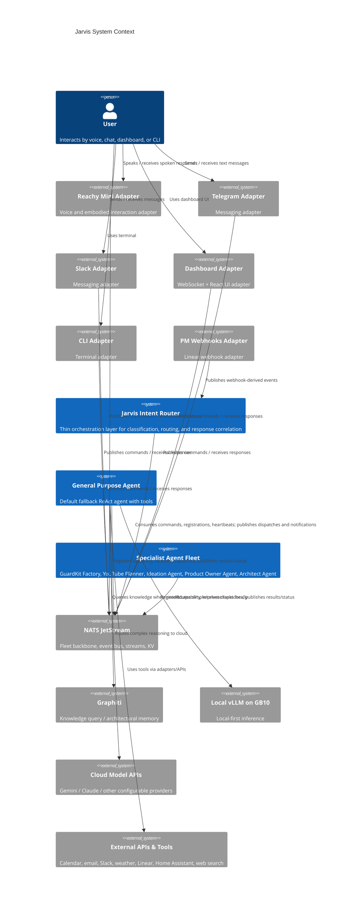

# ideas -- Conversation Starter

## Purpose of this document

Define the architectural conversation for the Jarvis intent router and Ship's Computer orchestration layer: how adapters submit requests, how Jarvis classifies intent, how dynamic agent discovery works via the CAN bus pattern over NATS JetStream, and how the General Purpose Agent acts as the default fallback when no specialist agent is a strong match.

## What is ideas?

Jarvis is described as a thin orchestration layer rather than a monolithic agent. It accepts natural language input from multiple adapters, classifies intent, dispatches to the most appropriate specialist agent, and returns results through the originating adapter (`jarvis-vision.md`). The current documented fleet includes GuardKit Factory, YouTube Planner, Ideation Agent, Product Owner Agent, Architect Agent, and the General Purpose Agent (`jarvis-vision.md`).

The core infrastructure direction is already resolved: NATS JetStream is the backbone (D4), agents are containerised (D14), and dynamic registration via NATS is also resolved (D15) (`jarvis-vision.md`). Agents self-register on startup, advertise intents/signals/confidence/concurrency, heartbeat every 30 seconds, and Jarvis stores the routing table in an `agent-registry` KV bucket that survives router restarts (`jarvis-vision.md`).

The General Purpose Agent is a separate but tightly related concern: it is the default “everything else” bucket, implemented as a single ReAct agent with tool selection and intent-based model routing between local vLLM and cloud APIs (`general-purpose-agent.md`). The adapter pattern is explicit: Reachy Mini, Telegram, Slack, Dashboard, CLI, and PM webhooks are all thin stateless translators between modality-specific protocols and NATS messages (`jarvis-vision.md`, `reachy-mini-integration.md`).

Before proposing changes, the current state suggests the main architectural problem is not “how to build intelligence” but “how to preserve low-latency routing, provider independence, and extensibility while keeping Jarvis thin.” That framing comes directly from the documentation’s repeated emphasis on Jarvis as glue, not as another heavyweight agent (`jarvis-vision.md`).

**Bias note:** Player and Coach may run on the same model. To reduce self-confirmation bias, architectural claims below are traceable to the provided documents and external claims are explicitly flagged where web search was used.

## Key architectural principle

**Jarvis must remain a thin, provider-independent intent router whose routing behaviour is driven by dynamically registered fleet capabilities rather than hard-coded agent knowledge** (`jarvis-vision.md`).

## C4 Level 1: System Context

A context-level diagram



## C4 Level 2: Container Diagram

A container-level diagram

```mermaid
C4Container
    title Jarvis Container Diagram

    Person(user, "User", "Voice/text/dashboard/CLI user")

    System_Ext(nats, "NATS JetStream", "Streams, subjects, KV bucket")
    System_Ext(graphiti, "Graphiti / FalkorDB", "Knowledge query backend")
    System_Ext(localmodels, "Local vLLM", "GB10-hosted local inference")
    System_Ext(cloudmodels, "Cloud Model Providers", "Gemini / Claude / other providers")
    System_Ext(extapis, "External APIs", "Telegram, Slack, Calendar, Email, Weather, Linear, Home Assistant")

    Container(adapter_reachy, "Reachy Mini Adapter", "nats-asyncio-service", "Voice/physical I/O to NATS")
    Container(adapter_telegram, "Telegram Adapter", "nats-asyncio-service", "Telegram Bot API to NATS")
    Container(adapter_slack, "Slack Adapter", "nats-asyncio-service", "Slack Events API to NATS")
    Container(adapter_dashboard, "Dashboard Adapter", "nats-asyncio-service", "WebSocket bridge to NATS")
    Container(adapter_cli, "CLI Adapter", "nats-asyncio-service", "stdin/stdout bridge to NATS")

    Container(router_ingress, "Ingress + Correlation Handler", "Jarvis container", "Normalises inbound requests, assigns correlation/session metadata")
    Container(router_classifier, "Intent Classification Component", "Jarvis container", "Rule-based matching against registry signals with optional LLM fallback")
    Container(router_registry, "Agent Registry Manager", "Jarvis container", "Consumes fleet.register / fleet.deregister / fleet.heartbeat.*, updates routing view from KV")
    Container(router_dispatch, "Dispatch & Response Router", "Jarvis container", "Selects target agent and routes result back to originating adapter")
    Container(router_policy, "Routing Policy Engine", "Jarvis container", "Applies confidence threshold and fallback-to-General-Purpose policy")

    Container(gpa, "General Purpose Agent", "langchain-deepagents", "Fallback ReAct agent with tools and model routing")
    Container(specialists, "Specialist Agent Containers", "langchain-deepagents-weighted-evaluation", "Fleet of specialist agents")

    Rel(user, adapter_reachy, "Voice interaction")
    Rel(user, adapter_telegram, "Text interaction")
    Rel(user, adapter_slack, "Text interaction")
    Rel(user, adapter_dashboard, "UI interaction")
    Rel(user, adapter_cli, "Terminal interaction")

    Rel(adapter_reachy, nats, "Publishes jarvis.command.reachy-*; subscribes notifications/results")
    Rel(adapter_telegram, nats, "Publishes jarvis.command.telegram; subscribes notifications/results")
    Rel(adapter_slack, nats, "Publishes jarvis.command.slack; subscribes notifications/results")
    Rel(adapter_dashboard, nats, "Publishes jarvis.command.dashboard; subscribes notifications/results")
    Rel(adapter_cli, nats, "Publishes jarvis.command.cli; subscribes notifications/results")

    Rel(router_ingress, nats, "Consumes jarvis.command.*")
    Rel(router_ingress, router_classifier, "Passes normalised command")
    Rel(router_classifier, router_registry, "Requests candidate agents/intents")
    Rel(router_classifier, localmodels, "Optional lightweight classification")
    Rel(router_classifier, cloudmodels, "Optional fallback classification")
    Rel(router_registry, nats, "Consumes fleet.* and reads/writes agent-registry KV")
    Rel(router_classifier, router_policy, "Passes classification candidates")
    Rel(router_policy, router_dispatch, "Returns selected target or fallback")
    Rel(router_dispatch, nats, "Publishes jarvis.intent.classified and jarvis.dispatch.{agent}")
    Rel(router_dispatch, nats, "Consumes agents.results.{agent} and notifications.* for response routing")

    Rel(gpa, nats, "Registers, heartbeats, receives dispatches, publishes results/status")
    Rel(gpa, localmodels, "Uses local model for simple/private tasks")
    Rel(gpa, cloudmodels, "Uses cloud model for complex tasks")
    Rel(gpa, graphiti, "Knowledge query tool")
    Rel(gpa, extapis, "Tool calls")

    Rel(specialists, nats, "Register, heartbeat, receive dispatches, publish results/status")
```



## DDD Context Map

The product documents reveal at least four bounded contexts: **Intent Routing**, **Fleet Coordination**, **Adapter Interface**, and **Agent Execution**. These are distinct because they have different responsibilities, language, and change cadence: routing logic, fleet lifecycle, modality translation, and agent runtime behaviour. A separate **Knowledge Context** is also evidenced through Graphiti-backed query/memory (`jarvis-vision.md`, `general-purpose-agent.md`).

```mermaid
flowchart LR
    AdapterCtx[Adapter Interface Context]
    RoutingCtx[Intent Routing Context]
    FleetCtx[Fleet Coordination Context]
    ExecCtx[Agent Execution Context]
    KnowledgeCtx[Knowledge Context]
    ExternalTools[External Tool/API Context]

    AdapterCtx -->|Open Host Service| RoutingCtx
    FleetCtx -->|Published Language| RoutingCtx
    RoutingCtx -->|Customer-Supplier| ExecCtx
    ExecCtx -->|Published Language| KnowledgeCtx
    ExecCtx -->|ACL (Anti-Corruption Layer)| ExternalTools
    AdapterCtx -->|Separate Ways| ExternalTools
```

## Preferred Decisions (challenge only with new evidence)

### ADR-P1-01 -- Keep Jarvis as a single thin router container with internal routing components
- **Decision statement:** Implement Jarvis as one deployable router container containing separable internal components for ingress, classification, registry management, policy, and dispatch.
- **Status:** Preferred Direction
- **Rationale:** The docs repeatedly position Jarvis as a lightweight orchestration layer, not another heavyweight agent (`jarvis-vision.md`). A single deployable keeps latency low for voice flows, simplifies state coordination around the `agent-registry` KV, and preserves a clean boundary between router intelligence and fleet execution. This also follows the altitude-first principle: the current evidence supports a thin control plane, not a decomposed microservice mesh.
- **Alternatives considered:**
  1. **Split Jarvis into separate microservices** -- separate classifier, registry, and dispatcher services communicating over NATS
  2. **Embed routing logic into adapters** -- each adapter performs its own classification and dispatch
- **Consequences:**
  - Positive: Low operational complexity, lower hop count, easier correlation management, cleaner ownership boundary
  - Positive: Router scaling is coarser-grained; hot paths and slow paths share one deployable unless carefully isolated internally
  - Negative: Router scaling is coarser-grained; hot paths and slow paths share one deployable unless carefully isolated internally

### ADR-P1-02 -- Make the routing table fully dynamic via NATS registration plus KV-backed durability
- **Decision statement:** Treat `fleet.register`, `fleet.deregister`, `fleet.heartbeat.*`, and the `agent-registry` KV bucket as the authoritative routing substrate.
- **Status:** Preferred Direction
- **Rationale:** This is already a resolved direction (D15) and should be carried through without reopening (`jarvis-vision.md`). The CAN bus pattern is central to extensibility: adding or scaling agents must not require router code changes. The docs explicitly call out zero router-code modification as the key benefit (`jarvis-vision.md`).
- **Alternatives considered:**
  1. **Static routing configuration file** -- maintain a checked-in agent map
  2. **Service discovery via container orchestrator only** -- infer available agents from Docker/Kubernetes runtime instead of capability announcements
- **Consequences:**
  - Positive: Extensibility, runtime discovery, load-aware selection using heartbeat queue depth, restart resilience through KV
  - Positive: Requires strict schema discipline for registration payloads; bad registrations can poison routing unless validated
  - Negative: Requires strict schema discipline for registration payloads; bad registrations can poison routing unless validated

### ADR-P1-03 -- Prefer rule-based classification against registered signals, with optional LLM fallback for ambiguous requests
- **Decision statement:** Default intent classification should be rules-first using registered signal words and confidence metadata, with lightweight model fallback only when ambiguity remains.
- **Status:** Preferred Direction
- **Rationale:** The docs explicitly raise D11 as an open decision and note that latency matters for voice, especially Reachy Mini (`jarvis-vision.md`, `reachy-mini-integration.md`). The registration payload already includes signals and confidence; using those first exploits existing fleet metadata. This also aligns with the “review-before-fix” principle: no product evidence shows that all requests need model-based classification.
- **Alternatives considered:**
  1. **Always use cloud LLM classification** -- classify every request through a hosted model
  2. **Always use local LLM classification** -- classify every request through a GB10-resident model
- **Consequences:**
  - Positive: Lower latency, lower cost, graceful degradation when cloud is unavailable, strong alignment with dynamic registration metadata
  - Positive: Signal-based matching may miss nuanced phrasing; requires ongoing curation of patterns and fallback thresholds
  - Negative: Signal-based matching may miss nuanced phrasing; requires ongoing curation of patterns and fallback thresholds

### ADR-P1-04 -- Treat the General Purpose Agent as a first-class fleet participant, even if initially co-located in the repo
- **Decision statement:** Architect the General Purpose Agent to register and heartbeat like any other fleet agent, regardless of whether its code is initially co-located with the Jarvis repo.
- **Status:** Preferred Direction
- **Rationale:** The docs leave repo placement open (D12 / open question in `general-purpose-agent.md`), but functionally the General Purpose Agent is still an agent and should follow the fleet contract (`jarvis-vision.md`, `general-purpose-agent.md`). This preserves the extensibility model and avoids creating a special-case in routing logic beyond “default fallback.”
- **Alternatives considered:**
  1. **Embed the General Purpose Agent inside the Jarvis router process** -- fallback handled internally with no NATS dispatch
  2. **Hard-wire General Purpose Agent as a non-registering special service** -- router directly invokes it outside normal fleet protocols
- **Consequences:**
  - Positive: Uniform operations model, independent scaling later, no special routing path, better provider independence and testability
  - Positive: Slightly more infrastructure overhead for the fallback path; initial local development may feel heavier than an in-process implementation
  - Negative: Slightly more infrastructure overhead for the fallback path; initial local development may feel heavier than an in-process implementation

### ADR-P1-05 -- Standardise on a provider-abstracted model client for classification and agent execution
- **Decision statement:** All model usage in Jarvis and the General Purpose Agent should go through provider abstractions that support local vLLM and cloud APIs interchangeably.
- **Status:** Preferred Direction
- **Rationale:** Provider independence is an explicit architectural pattern, and the docs already describe configurable model routing and rejection of NVIDIA lock-in via NemoClaw (`general-purpose-agent.md`, `nemoclaw-assessment.md`, `jarvis-vision.md`). The architecture should therefore preserve interface-level switching rather than embedding vendor-specific calls in router or tools.
- **Alternatives considered:**
  1. **Standardise entirely on one cloud provider** -- simplest implementation, highest lock-in
  2. **Standardise entirely on local-only inference** -- maximum privacy, lower external dependency, but capability constraints
- **Consequences:**
  - Positive: Flexibility, resilience to vendor shifts, privacy routing support, easier experimentation
  - Positive: More adapter code and testing burden across providers; weakest-common-denominator abstractions can hide provider-specific advantages
  - Negative: More adapter code and testing burden across providers; weakest-common-denominator abstractions can hide provider-specific advantages

### ADR-P1-06 -- Use NATS subjects as explicit domain contracts and validate flows through C4 traceability
- **Decision statement:** Define Jarvis message subjects and payload schemas as explicit architectural contracts, not incidental implementation details.
- **Status:** Preferred Direction
- **Rationale:** The product docs are unusually explicit about subject names and lifecycle flows (`jarvis-vision.md`, `reachy-mini-integration.md`). Tracing the documented request flow through the C4 diagrams shows the system depends on consistent subjects for correlation, status, approval checkpoints, and adapter return-path routing. This is also valuable for Graphiti-style extraction because relationships can be expressed machine-readably.
- **Alternatives considered:**
  1. **Loose event naming per agent/team** -- flexible but inconsistent topic taxonomy
  2. **Single generic queue per function class** -- minimal subjects, more payload branching
- **Consequences:**
  - Positive: Better observability, easier fleet-wide tooling, lower ambiguity, stronger graph extractability
  - Positive: Topic taxonomy governance becomes necessary; renaming subjects later is migration work
  - Negative: Topic taxonomy governance becomes necessary; renaming subjects later is migration work

## Open Questions for /system-arch to Resolve

- **D11 — Intent classification model:** Should classification be rules-first with LLM fallback, local-model first, or cloud-model first? The documented latency target pressure comes from Reachy-style conversational use (`reachy-mini-integration.md`), but ambiguous text may still benefit from model inference (`jarvis-vision.md`).
- **D12 — General Purpose Agent location:** Should the General Purpose Agent be only repo-co-located initially, or also deployed as a separate container from day one? Repo co-location helps development speed, but separate deployment better matches the fleet pattern (`general-purpose-agent.md`, `jarvis-vision.md`).
- **D13 — Cross-agent conversation context:** Should Jarvis maintain session context, should each agent stay isolated, or should Graphiti provide shared memory? This decision affects handoff flows like “build that idea we just discussed” (`jarvis-vision.md`).
- **D16 — Reachy Mini adapter topology:** Should the Reachy adapter run with direct USB attachment to the GB10, over network Reachy SDK, or as a hybrid? The docs mention both physical USB connection and future hardware/resource questions (`reachy-mini-integration.md`, `jarvis-vision.md`).
- **D17 — Heartbeat timeout policy:** Is a fixed 90 seconds sufficient for all agents, or should timeout be per-agent/configurable? Heavy agents may look dead while actually busy (`jarvis-vision.md`).
- **Registration schema governance:** Who owns the `AgentRegistrationPayload` schema and compatibility rules across the fleet? Dynamic discovery only works if registration semantics remain stable (`jarvis-vision.md`).
- **Fallback confidence threshold:** The docs propose fallback to General Purpose Agent when no registered agent matches with confidence greater than 0.5 (`jarvis-vision.md`). Is 0.5 the right threshold in practice, and should it vary by adapter or intent family?
- **Response correlation contract:** Should adapters receive replies via a dedicated `notifications.{adapter}` subject only, or should result-routing include per-session/per-correlation reply subjects to simplify concurrent conversations?

## Constraints

- **Resolved architectural constraints must be carried forward:** LangChain DeepAgents SDK (D1), NATS JetStream event bus (D4), two-model separation for orchestration vs implementation where relevant (D5), containerisation in Docker (D14), dynamic agent discovery via NATS (D15) (`jarvis-vision.md`).
- **Jarvis is thin by definition:** it must remain an intent router/orchestration layer rather than becoming a monolithic agent (`jarvis-vision.md`).
- **Adapters are stateless translators:** business logic belongs in the router and agents, not in adapters (`jarvis-vision.md`).
- **General Purpose Agent is default fallback:** if no specialist strongly matches, requests route there (`jarvis-vision.md`, `general-purpose-agent.md`).
- **Local-first/privacy-sensitive routing is required for some tasks:** simple and privacy-sensitive tasks should be able to run locally on GB10 (`general-purpose-agent.md`).
- **Hardware topology matters:** NATS, vLLM, Graphiti, and agent execution are expected on the DGX Spark GB10; MacBook Pro and Reachy Mini play adapter/client roles; Tailscale mesh connectivity is part of the operating context (`jarvis-vision.md`).
- **Voice latency matters:** Reachy Mini interaction should feel conversational; product docs explicitly question the latency budget and mention a sub-2-second target as desirable (`reachy-mini-integration.md`).
- **External validation from web search:**
- NATS JetStream remains the current NATS persistence mechanism and NATS docs recommend `Replicas=3` for production resilience; web search also surfaced a 2026 JetStream restore-permission CVE fixed in `nats-server` 2.11.15 / 2.12.6, so production deployment should avoid older vulnerable versions.
- The docs mention NVIDIA driver 590 as a maturity signal for the DGX Spark ecosystem (`nemoclaw-assessment.md`), but web search found DGX Spark forum evidence that driver 590 is still problematic/bricking systems in March-April 2026 while 580 remains the official path. **Open contradiction:** the doc treats driver 590 shipping as a future maturity indicator, while current community evidence suggests it should not yet be a deployment target.
- Reachy docs mention OpenAI Realtime API as part of the adapter stack (`jarvis-vision.md`, `reachy-mini-integration.md`), but product docs do not require committing to it; external search indicates it exists as a current option, so it should remain behind a provider abstraction rather than becoming a hard dependency.

## Source Documents

| Document | Contribution |
| --- | --- |
| general-purpose-agent.md | Defined the General Purpose Agent as the default fallback, its ReAct pattern, tool roadmap, and model-routing behaviour across local and cloud providers. |
| jarvis-vision.md | Provided the system vision, resolved decisions, NATS subjects, dynamic registration/CAN bus pattern, adapter pattern, hardware topology, and open architectural decisions. |
| nemoclaw-assessment.md | Supplied provider-independence and risk context by documenting why NemoClaw is rejected for now and why the current NATS + DeepAgents path is preferred. |
| reachy-mini-integration.md | Added the embodied adapter context, Reachy-specific input/output flows, latency concerns, and modality-specific constraints for voice interaction. |

## Suggested Research Topics

- Rule-based signal matching effectiveness versus lightweight LLM classification for Jarvis intent routing
- Registration payload schema evolution and backward compatibility strategy across fleet agents
- NATS JetStream stream/consumer design for command, dispatch, result, and heartbeat subjects
- Reply-correlation design for concurrent multi-adapter conversations
- Heartbeat timeout tuning for long-running weighted-evaluation agents versus lightweight agents
- Reachy Mini voice latency budget decomposition across STT, routing, dispatch, execution, and TTS
- General Purpose Agent session-memory strategy: stateless, bounded short-term memory, or Graphiti-backed recall
- Operational security model for broad-tool fallback agents with local filesystem and personal-data access
