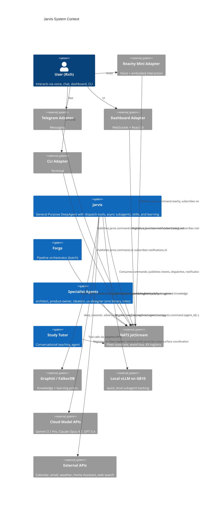
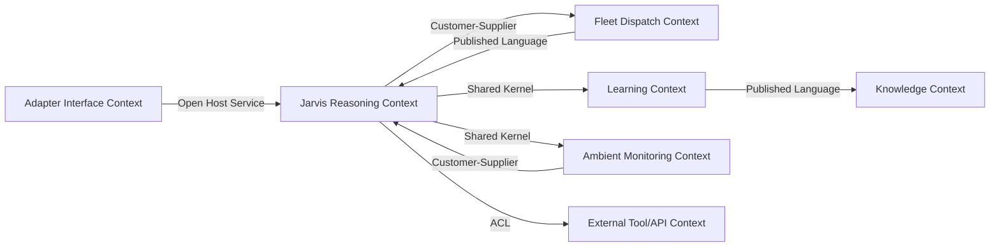

# Jarvis — Conversation Starter for `/system-arch`

> **Version:** 2.0
> **Date:** 19 April 2026
> **Target:** `/system-arch` session on 20 April 2026
> **Supersedes:** v1.0 (March 2026)
> **Primary framing:** fleet-architecture-v3-coherence-via-flywheel.md
> **Primary vision:** jarvis-vision.md v2 (sibling file)

---

## Purpose of This Document

Prepare the `/system-arch` session to produce Jarvis's ARCHITECTURE.md, C4 diagrams, and ADRs. This document:

1. Summarises the current state (what's resolved, what's open)
2. Lists Preferred Directions (challenge only with new evidence) — decisions carried forward from fleet v3 and Forge's architecture
3. Lists Open Questions the session should resolve
4. Notes constraints and source documents

**Bias warning:** Player and Coach may share model weights. The architectural claims below are traceable to fleet v3 and Forge's ADRs; external claims are flagged and web-search-validated.

---

## What Jarvis Is (Core Principle)

**Jarvis is a General Purpose DeepAgent with dispatch tools.** The reasoning model reads registered capability descriptions and decides which brain to apply. Routing is tool selection; there is no separate intent-router process.

One-sentence thesis: *One reasoning model that knows which reasoning model to use.*

---

## Architectural Pattern

**Hexagonal modules inside a DeepAgents 0.5.3+ supervisor.** Structurally identical to Forge (ADR-ARCH-001):

- The `create_deep_agent(...)` compiled state graph is the shell — reasoning loop, built-in tools, async subagents, sub-agent dispatch via `task`.
- Inside: pure domain modules (routing, learning, skills, ambient-watchers) with no I/O imports.
- Thin adapters at the edges: NATS, Graphiti, subprocess (future). Jarvis-specific `@tool` functions wrap adapters at the DeepAgents tool-layer boundary.
- No transport abstraction — NATS is the transport.

---

## C4 Level 1: System Context

## C4 Level 2: Container Diagram

```mermaid
C4Container
    title Jarvis Container Diagram

    Person(user, "User", "Voice/text/dashboard/CLI")

    System_Ext(nats, "NATS JetStream", "Streams, subjects, KV bucket")
    System_Ext(graphiti, "Graphiti / FalkorDB", "Knowledge + learning priors")
    System_Ext(localmodels, "Local vLLM", "quick_local backing")
    System_Ext(cloudmodels, "Cloud Model Providers", "Gemini, Claude, OpenAI")
    System_Ext(extapis, "External APIs", "Calendar, weather, email, Home Assistant")

    Container(adapter_reachy, "Reachy Mini Adapter", "nats-asyncio-service", "Voice I/O")
    Container(adapter_telegram, "Telegram Adapter", "nats-asyncio-service", "Telegram Bot API")
    Container(adapter_dashboard, "Dashboard Adapter", "nats-asyncio-service", "WebSocket bridge")
    Container(adapter_cli, "CLI Adapter", "nats-asyncio-service", "stdin/stdout bridge")

    Container_Boundary(jarvis_container, "Jarvis DeepAgent (single container)") {
        Container(supervisor, "Supervisor", "DeepAgents 0.5.3+", "create_deep_agent state graph; reasoning loop")
        Container(dispatch_tools, "Dispatch Tools", "@tool functions", "start_async_task, dispatch_by_capability, queue_build")
        Container(async_subagents, "Async Subagents", "AsyncSubAgent × 4", "deep_reasoner, adversarial_critic, long_research, quick_local")
        Container(skills, "Skills", "DeepAgents Skills", "morning-briefing, talk-prep, project-status")
        Container(ambient_watchers, "Ambient Watchers", "Pattern B async subagents", "Per-condition monitoring")
        Container(learning, "jarvis.learning", "Module", "Detects routing/ambient patterns, proposes CalibrationAdjustments")
        Container(memory, "Memory Store + Thread State", "LangGraph primitives", "Cross-session recall; per-session context")
    }

    Rel(user, adapter_reachy, "Voice")
    Rel(user, adapter_telegram, "Text")
    Rel(user, adapter_dashboard, "UI")
    Rel(user, adapter_cli, "Terminal")

    Rel(adapter_reachy, nats, "jarvis.command.reachy / notifications.reachy")
    Rel(adapter_telegram, nats, "jarvis.command.telegram / notifications.telegram")
    Rel(adapter_dashboard, nats, "jarvis.command.dashboard / notifications.dashboard")
    Rel(adapter_cli, nats, "jarvis.command.cli / notifications.cli")

    Rel(supervisor, nats, "Consumes jarvis.command.*; registers on fleet.register; publishes notifications.*")
    Rel(supervisor, dispatch_tools, "Invokes")
    Rel(supervisor, async_subagents, "Via AsyncSubAgentMiddleware tools")
    Rel(supervisor, skills, "Invokes named skills")
    Rel(supervisor, ambient_watchers, "Spawns on demand via start_async_task")
    Rel(supervisor, memory, "Reads/writes")

    Rel(async_subagents, localmodels, "quick_local")
    Rel(async_subagents, cloudmodels, "deep_reasoner, adversarial_critic, long_research")

    Rel(dispatch_tools, nats, "agents.command.{specialist_id}, pipeline.build-queued.{feature_id}")

    Rel(learning, graphiti, "Reads jarvis_routing_history, jarvis_ambient_history; writes CalibrationAdjustment proposals")
    Rel(supervisor, graphiti, "Retrieves priors at session start + decision time")
```

## DDD Context Map

---

## Preferred Directions (challenge only with new evidence)

### ADR-J-P1 — Jarvis is a DeepAgent with dispatch tools, not a thin router
- **Rationale:** Fleet v3 D40. Routing is tool selection; DeepAgents handles this natively. Separating router from GPA doubles processes without architectural benefit.
- **Alternatives rejected:** (a) Thin router + separate GPA process (v1 vision); (b) Rule-based classifier with LLM fallback (prior D11 direction).
- **Consequences:** Simpler deployment; unified reasoning; per-session memory works across all delegation targets.

### ADR-J-P2 — Four launch async subagents for model routing
- **Rationale:** Fleet v3 D43. `deep_reasoner` (Gemini 3.1 Pro), `adversarial_critic` (Opus 4.7), `long_research` (GPT-5.4), `quick_local` (vLLM Qwen3-Coder-Next). Descriptions carry cost/latency signals.
- **Alternatives rejected:** (a) Single-model Jarvis — loses capability asymmetry; (b) Dozens of subagents from day one — scope creep, unclear descriptions lead to poor routing.
- **Consequences:** Per-invocation model choice is a reasoning decision. Cost discipline emerges from routing priors. Privacy-sensitive work routes locally by default.

### ADR-J-P3 — Thread-per-session with shared Memory Store
- **Rationale:** Prevents cross-adapter context bleed; preserves cross-session recall. LangGraph-native pattern.
- **Alternatives rejected:** (a) Single shared thread — context pollution; (b) Supervisor-per-adapter — coordination complexity with no gain.
- **Consequences:** Simple session model; Memory Store does the heavy lifting for "last week we..."; trace per session is clean.

### ADR-J-P4 — Jarvis registers on `fleet.register`
- **Rationale:** Fleet discoverability for future cross-agent coordination (e.g., Forge emitting `jarvis.notification.*` through known registration). Also lets other agents discover Jarvis's tools.
- **Alternatives rejected:** Jarvis-as-special-case-non-registrant — breaks the uniform pattern.
- **Consequences:** Jarvis appears in fleet-discovery for the Forge and for any future agent that wants to delegate to Jarvis's GPA-level tools.

### ADR-J-P5 — `jarvis.learning` is a module, not a separate agent
- **Rationale:** Fleet v3 D45. Meta-agent / task-agent split deferred until real-run evidence supports it. Module approach keeps architecture simpler and matches Forge's `forge.learning`.
- **Alternatives rejected:** (a) Separate DeepAgent running Meta-Harness-style self-optimisation — D45 defers this; (b) No learning loop — abandons the flywheel.
- **Consequences:** Learning is pattern-detection + Rich-confirmed priors. Compounds without autonomy risks.

### ADR-J-P6 — Trace-richness from day one per ADR-FLEET-001
- **Rationale:** Cheap now; expensive to retrofit; learning quality scales with trace richness (Meta-Harness evidence).
- **Alternatives rejected:** (a) Outcome-only logging — caps learning quality; (b) Retrofit later — accumulated data remains low-resolution permanently.
- **Consequences:** Slightly higher per-decision write cost; dramatically higher learning ceiling.

### ADR-J-P7 — `AsyncSubAgent` via ASGI transport (co-deployed)
- **Rationale:** Zero network latency; single `langgraph.json`; simplest deployment that exposes async capability. Matches Forge's ADR-ARCH-031 default.
- **Alternatives rejected:** (a) HTTP transport from day one — unnecessary complexity; (b) Sync subagents only — loses parallelism, mid-flight steering, cancellation.
- **Consequences:** One Jarvis container; multiple LangGraph graphs; ASGI-native.

### ADR-J-P8 — Selectively ambient: Patterns A + B for v1, Pattern C as opt-in skill only
- **Rationale:** Fleet v3 D44. Pattern C (volitional) risks being annoying/surveillance-feeling; opt-in-skill-first lets it earn its place.
- **Alternatives rejected:** (a) No ambient — loses the Tony Stark feel; (b) Always-on Pattern C from day one — too risky.
- **Consequences:** Reactive + triggered-watcher behaviours ship. Volitional emerges from graduated skills.

### ADR-J-P9 — Topic convention: singular `agents.command.*` / `agents.result.*`, `jarvis.command.{adapter}`, `notifications.{adapter}`
- **Rationale:** Inherits ADR-SP-016 (singular convention). Jarvis's own namespace follows existing taxonomy.
- **Alternatives rejected:** Plural convention — requires rewriting working code in `nats-core` and `specialist-agent`.

### ADR-J-P10 — Preview feature pin `deepagents>=0.5.3,<0.6`
- **Rationale:** `AsyncSubAgent` is preview in 0.5.3; APIs may change in 0.6.x. Pin prevents unexpected breaks; monitor release notes for 0.6.x.
- **Consequences:** Scheduled re-verification when 0.6 ships.

---

## Open Questions for `/system-arch` to Resolve

### JA1 — `jarvis_routing_history` schema fields
Exact Pydantic shape for routing decision records. Base schema from ADR-FLEET-001 + Jarvis-specific fields (`chosen_subagent_name`, `alternatives_considered`, `supervisor_reasoning`, cost per alternative if available).

### JA2 — Ambient watcher resource limits
How many concurrent Pattern B watchers before throttling? DeepAgents 0.5.3 suggests `--n-jobs-per-worker 10` as a local-dev starting point. Need defensible ceiling for production on GB10 (alongside Forge + specialist-agent concurrent workloads).

### JA3 — Cross-adapter handoff semantics
When Rich starts a task on Telegram and continues on Reachy: (a) force same-thread by explicit "continue" command; (b) automatic summary-bridge via Memory Store; (c) both. Related: how does the supervisor know which Memory Store entry is relevant to the current session?

### JA4 — Skill discoverability
Static declaration (simple; v1 bias) vs. dynamic registration (matches NATS fleet pattern; more complex). Recommend static for v1; revisit if skill count grows.

### JA5 — Rich's confirmation UX for `CalibrationAdjustment` proposals
CLI-based approval round-trip (baseline). Should Telegram also support it? Dashboard? Tradeoffs: multi-adapter confirmation complicates trace, single-adapter simplifies but friction-adds.

### JA6 — `quick_local` fallback under GB10 pressure
When AutoBuild is running (Forge consuming GB10 GPU), vLLM serving `quick_local` may be slow. Options: (a) check `system.health.vllm` and fall back to cloud cheap-tier; (b) queue local requests; (c) accept degraded latency. Needs policy.

### JA7 — Ambient watcher failure modes
What happens when a Pattern B watcher encounters an error condition? (a) Silent log + retry; (b) Notify user of watcher failure; (c) Kill watcher; (d) Escalate via CalibrationAdjustment. Needs default + configurable.

### JA8 — Preview-feature migration strategy
When DeepAgents 0.6 ships and `AsyncSubAgent` leaves preview (or changes API), what's the migration path? Recommend: dedicated compatibility review before upgrading; trace-rich history + regression suite gives migration confidence.

### JA9 — Skill authoring format
Skills are tool compositions. Format options: (a) YAML with declared tool sequence; (b) Python code; (c) markdown with natural-language process + tool hints. DeepAgents' built-in Skills capability has a format — align with it.

---

## Constraints

- **Resolved carry-forward constraints:** NATS JetStream substrate, DeepAgents 0.5.3+ SDK, containerisation in Docker, dynamic fleet registration via NATS, singular topic convention, trace-richness from ADR-FLEET-001, three-surfaces-one-substrate from fleet v3.

- **Jarvis-specific constraints:**
  - Single supervisor per-user, per-GB10 (no horizontal scaling)
  - Sub-2-second voice reactive latency target (Reachy Mini)
  - Cost discipline — prefer local + cheap by default
  - Thread-per-session isolation (no cross-thread context bleed)
  - Memory Store for cross-session continuity only

- **External validation (web search, 19 April 2026):**
  - DeepAgents 0.5.3 released 15 April 2026 — `AsyncSubAgent` preview feature confirmed live
  - Karpathy Loop pattern (Nate video, 19 April 2026) — validates flywheel-via-trace pattern direction
  - Meta-Harness paper (Stanford, 2026 preprint) — validates trace-richness decision (10× iteration efficiency from full-filesystem context)
  - NemoClaw status (D6, March 2026) — still alpha; driver 590 still problematic on DGX Spark (community evidence, April 2026). Carry forward rejection.

---

## Source Documents

| Document | Contribution |
|---|---|
| fleet-architecture-v3-coherence-via-flywheel.md (19 April 2026) | Keystone — three surfaces, Jarvis-IS-GPA framing, flywheel-per-surface, D40-D46 |
| ADR-FLEET-001-trace-richness.md | Fleet-wide trace commitment |
| jarvis-vision.md v2 (sibling) | Full Jarvis vision, resolved decisions, detailed build sequence |
| forge/docs/architecture/ARCHITECTURE.md + 30 ADRs | Pattern source — especially ADR-ARCH-015, ADR-ARCH-016, ADR-ARCH-019, ADR-ARCH-020 |
| forge/docs/architecture/decisions/ADR-ARCH-031-async-subagents-for-long-running-work.md | Parallel async-subagents ADR (Forge's version) |
| forge-pipeline-architecture.md v2.2 | ADR-SP-014 Pattern A (Jarvis→Forge trigger), SP-016 singular topics |
| fleet-master-index.md v2 + D40-D46 addendum | Fleet repo map, resolved decisions |
| DeepAgents 0.5.3 docs (fetched 19 April 2026) | `AsyncSubAgent`, Memory Store, Skills, transport options |
| Original jarvis-vision.md v1 (March 2026) | Carry-forward: adapter pattern, hardware topology. Supersede: thin-router framing |
| Original jarvis-architecture-conversation-starter.md v1 | ADR-P1-01..06 preferred directions (mostly carried forward, some refined) |
| 19 April 2026 conversation (Rich + Claude) | Tony Stark framing, model-routing as reasoning, selectively ambient three-pattern model |

---

## Suggested Research Topics (beyond `/system-arch`)

For `/system-design` or later phases:

- `jarvis_routing_history` entity schema — Pydantic definition, validators, indexing strategy
- Skill plugin interface — static vs dynamic, authoring format, composability rules
- Ambient watcher safety — kill-switch, throttling, notification fatigue mitigation
- Cross-adapter handoff patterns — explicit-continue vs summary-bridge vs both
- Voice latency budget decomposition — STT + routing + supervisor reasoning + async launch + TTS
- `quick_local` vs cloud-cheap fallback policy formalisation
- DeepAgents 0.6.x compatibility surveillance — documented review cadence

---

*19 April 2026 · Prepared for `/system-arch` on 20 April 2026*
*"One reasoning model that knows which reasoning model to use."*
