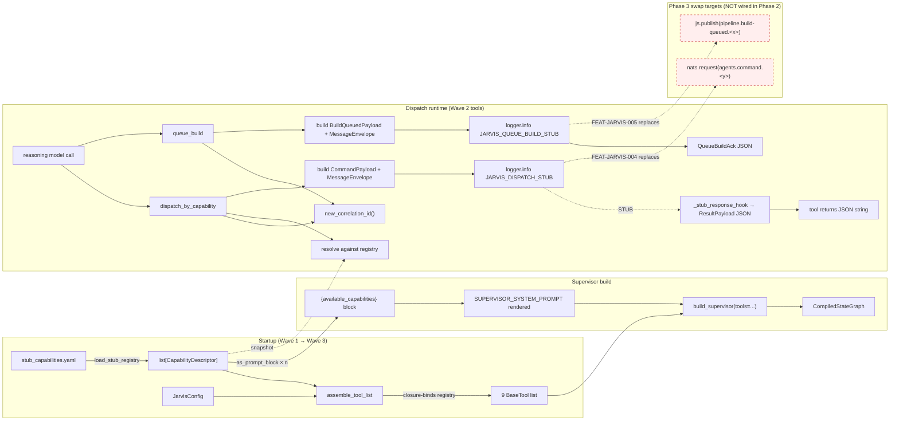
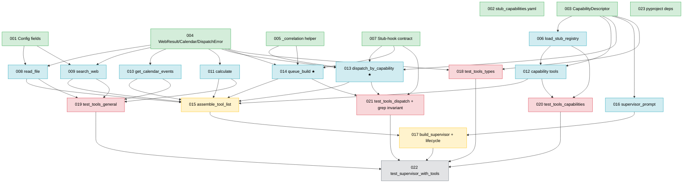

# IMPLEMENTATION-GUIDE.md — FEAT-JARVIS-002

> **Feature:** Core Tools & Capability-Driven Dispatch Tools
> **Approach:** Option B — Envelope-first, concurrent fan-out *(review score 12/12)*
> **Parent review:** [TASK-REV-J002](../../in_review/TASK-REV-J002-plan-core-tools-and-dispatch.md)
> **Review report:** [.claude/reviews/TASK-REV-J002-review-report.md](../../../.claude/reviews/TASK-REV-J002-review-report.md)
> **Spec:** [features/feat-jarvis-002-core-tools-and-dispatch/](../../../features/feat-jarvis-002-core-tools-and-dispatch/)

---

## 1. Problem & approach (1-minute read)

Populate the empty `src/jarvis/tools/` package with **9 LangChain tools** and wire
them into the DeepAgents supervisor:

- **4 general tools** — `read_file`, `search_web`, `get_calendar_events`, `calculate`
- **3 capability-catalogue tools** — `list_available_capabilities`, `capabilities_refresh`, `capabilities_subscribe_updates`
- **2 dispatch tools** — `dispatch_by_capability`, `queue_build`

The dispatch tools construct **real** `nats-core` `CommandPayload` / `BuildQueuedPayload`
envelopes, but instead of publishing they log them. Two grep anchors
(`JARVIS_DISPATCH_STUB`, `JARVIS_QUEUE_BUILD_STUB`) mark the DDR-009 swap points.
FEAT-JARVIS-004/005 will replace the two `logger.info` lines with `nats.request(...)`
and `js.publish(...)` — **tool docstrings and return shapes stay untouched**.

### Why envelope-first + concurrent fan-out?

| Concern (Context A lock-in: maintainability) | How Option B handles it |
|---|---|
| Stub swap-point safety (DDR-009) | Single named seam (`_stub_response_hook` + two `LOG_PREFIX_*` constants). `grep -rn` must return exactly 4 lines after Wave 3. Asserted by test **TASK-J002-021**. |
| Envelope schema evolution (ASSUM-006) | `CapabilityDescriptor` lands in Wave 1 with `ConfigDict(extra="ignore")`. Every consumer closes over the same snapshot. |
| Correlation ID propagation (ASSUM-001) | Single `jarvis.tools._correlation.new_correlation_id()` callsite, no shared state. UUID4 per dispatch by construction. |
| Task ordering | 7-task foundation wave → 9-way parallel tool implementation wave → 2-task wiring → 4-way parallel unit-test wave → 1-task integration test. |

---

## 2. Wave plan

```
Wave 1 — Foundation (7 tasks, intra-wave-independent)
  TASK-J002-001  Config fields                          declarative  direct     30m  c2
  TASK-J002-002  stub_capabilities.yaml                 declarative  direct     20m  c1
  TASK-J002-003  CapabilityDescriptor / ToolSummary     declarative  direct     40m  c2
  TASK-J002-004  WebResult / CalendarEvent / Error      declarative  direct     40m  c2
  TASK-J002-005  _correlation.new_correlation_id        feature      direct     30m  c2
  TASK-J002-007  Stub-response-hook contract            scaffolding  direct     30m  c2
  TASK-J002-023  pyproject + uv lock                    scaffolding  direct     25m  c2

Wave 2 — Tool implementations (9 tasks, parallel-safe)
  TASK-J002-006  load_stub_registry                     feature      direct     45m  c3
  TASK-J002-008  read_file                              feature      task-work  60m  c4
  TASK-J002-009  search_web                             feature      task-work  75m  c5
  TASK-J002-010  get_calendar_events                    feature      direct     40m  c2
  TASK-J002-011  calculate                              feature      task-work  60m  c4
  TASK-J002-012  list/refresh/subscribe capabilities    feature      task-work  50m  c3
  TASK-J002-013  dispatch_by_capability                 feature      task-work 110m  c7  ★ PRIMARY SWAP POINT
  TASK-J002-014  queue_build                            feature      task-work  90m  c6  ★ PRIMARY SWAP POINT
  TASK-J002-016  supervisor_prompt + Tool-Usage         feature      direct     45m  c3

Wave 3 — Wiring (2 tasks)
  TASK-J002-015  assemble_tool_list + tools/__init__    scaffolding  direct     40m  c3
  TASK-J002-017  build_supervisor + lifecycle           feature      task-work  70m  c4

Wave 4 — Unit tests (4 tasks, parallel-safe)
  TASK-J002-018  test_tools_types                       testing      direct     45m  c3
  TASK-J002-019  test_tools_general                     testing      task-work  90m  c5
  TASK-J002-020  test_tools_capabilities                testing      direct     70m  c4
  TASK-J002-021  test_tools_dispatch + grep invariant   testing      task-work 110m  c6

Wave 5 — Integration test (1 task)
  TASK-J002-022  test_supervisor_with_tools             testing      task-work  80m  c5
```

**Totals:** 23 tasks · ~19.5 serial hours · ~12–14 wall-clock hours with Wave 2
parallelism · 40/40 `.feature` scenarios covered.

**Integration-test precondition**: Wave 4 (which assembles unit-test coverage
across all tools) runs **before** Wave 5. Wave 2 contains at least one core tool,
the capability envelope (Wave 1), and the registry stub (TASK-J002-006 in Wave 2)
— the integration-test precondition from the review AC is satisfied.

---

## 3. Data flow — writes & reads

The **mandatory** data-flow diagram. Shows every write path and every read path
for the capability envelope and dispatch pipeline. Dotted red edges are explicit
Phase 3 swap targets (FEAT-JARVIS-004/005); they are deliberately unwired in
Phase 2 per the "stubbed transport ≠ stubbed schema" invariant.



**Disconnection Alert:** None. Every write path in Phase 2 has a read path:
stub-registry → `assemble_tool_list` → bound into tools; `CapabilityDescriptor` →
prompt render + dispatch resolve; correlation IDs → log line + return payload.
The two dotted red edges (`nats.request`, `js.publish`) are **explicit Phase 3
swap targets**, documented here so no reviewer mistakes them for forgotten reads
in Phase 2.

---

## 4. §4 Integration Contracts

Every cross-task data dependency gets a contract block. Consumer tasks carry a
matching `consumer_context` entry in their frontmatter, generated programmatically
from these contracts.

### Contract: `CapabilityDescriptor` schema

- **Producer task:** TASK-J002-003
- **Consumer task(s):** TASK-J002-006, TASK-J002-012, TASK-J002-013, TASK-J002-015, TASK-J002-016, TASK-J002-017, TASK-J002-018, TASK-J002-020, TASK-J002-022, plus every FEAT-JARVIS-004 consumer
- **Artifact type:** Module export — Pydantic v2 `BaseModel` class in `jarvis.tools.capabilities`
- **Format constraint:** `CapabilityDescriptor` has fields `agent_id: str (pattern=^[a-z][a-z0-9-]*$)`, `role: str`, `description: str`, `capability_list: list[CapabilityToolSummary]`, `cost_signal: str`, `latency_signal: str`, `last_heartbeat_at: datetime | None`, `trust_tier: Literal["core","specialist","extension"]`. `ConfigDict(extra="ignore")`. Exposes `as_prompt_block() -> str` with deterministic formatting.
- **Validation method:** TASK-J002-018 asserts byte-equal `as_prompt_block()` output; TASK-J002-020 asserts roundtrip YAML→descriptor→JSON preserves every field; forward-compatibility verified by adding an unknown YAML key and asserting load still succeeds.

### Contract: Correlation-ID helper

- **Producer task:** TASK-J002-005
- **Consumer task(s):** TASK-J002-013, TASK-J002-014 (both call it once per invocation)
- **Artifact type:** Module export — single function `jarvis.tools._correlation.new_correlation_id() -> str`
- **Format constraint:** Returns `str(uuid.uuid4())`; result matches regex `^[0-9a-f]{8}-[0-9a-f]{4}-4[0-9a-f]{3}-[89ab][0-9a-f]{3}-[0-9a-f]{12}$`. No shared state; safe under concurrent invocation (ASSUM-001).
- **Validation method:** TASK-J002-005 concurrent test (100×100 distinct); TASK-J002-021 dispatch concurrency test asserts two parallel dispatches produce distinct correlation_ids embedded in the `JARVIS_DISPATCH_STUB` log lines.

### Contract: Stub transport interface *(PRIMARY DDR-009 swap point)*

- **Producer task:** TASK-J002-007
- **Consumer task(s):** TASK-J002-013, TASK-J002-014 (read `_stub_response_hook`); test fixture `fake_dispatch_stub` writes it; FEAT-JARVIS-004 replaces the hook with a real NATS client
- **Artifact type:** Module attribute + literal constants in `jarvis.tools.dispatch`
- **Format constraint:** `_stub_response_hook: Callable[[CommandPayload], StubResponse] | None = None`. `StubResponse` covers `success | timeout | specialist_error`. Two module-level constants: `LOG_PREFIX_DISPATCH = "JARVIS_DISPATCH_STUB"` and `LOG_PREFIX_QUEUE_BUILD = "JARVIS_QUEUE_BUILD_STUB"`.
- **Swap point:** `grep -rn "JARVIS_DISPATCH_STUB\|JARVIS_QUEUE_BUILD_STUB" src/jarvis/` must return **exactly 4 lines** (2 constants + 2 `logger.info` usages) after Wave 3 lands. FEAT-JARVIS-004/005 replace the `logger.info` lines with real publishes; tool docstrings and return shapes untouched.
- **Validation method:** TASK-J002-021 grep-invariant test runs the grep via `subprocess.run` and asserts result count and file path; TASK-J002-013/014 `logger.info` lines match byte-equal format strings.

### Contract: Tool registration entry-point

- **Producer task:** TASK-J002-015
- **Consumer task(s):** TASK-J002-017, TASK-J002-022, plus FEAT-JARVIS-003 async-subagent wiring
- **Artifact type:** Module export `jarvis.tools.assemble_tool_list(config, capability_registry) -> list[BaseTool]`
- **Format constraint:** Returns the 9 `@tool` functions in stable alphabetical order. Binds `capability_registry` as a closed-over snapshot into the three capability tools + `dispatch_by_capability` (resolution target). Binds `config.tavily_api_key` into `search_web`. Binds `_stub_response_hook` into both dispatch tools.
- **Validation method:** TASK-J002-022 asserts `len(tools) == 9` and tool names match expected alphabetical list byte-for-byte.

### Contract: Capability envelope for prompt rendering

- **Producer task:** TASK-J002-017
- **Consumer task(s):** FEAT-JARVIS-004 (when real registry replaces stub, rendering contract stays identical)
- **Artifact type:** String substitution in `SUPERVISOR_SYSTEM_PROMPT` via `{available_capabilities}` placeholder
- **Format constraint:** Either `"No capabilities currently registered."` (empty case) or a `"\n\n"`-joined sequence of `CapabilityDescriptor.as_prompt_block()` outputs in `agent_id` lexicographic order.
- **Validation method:** TASK-J002-022 asserts the rendered prompt contains each descriptor's prompt-block as a substring and the ordering invariant.

### Contract: `nats-core` payload compatibility

- **Producer task:** TASK-J002-013, TASK-J002-014
- **Consumer task(s):** FEAT-JARVIS-004 (replaces stub log with `nats.request`), FEAT-JARVIS-005 (replaces stub log with `js.publish`)
- **Artifact type:** Real `nats_core.events.{CommandPayload, BuildQueuedPayload, MessageEnvelope}` instances constructed **inside** dispatch tools
- **Format constraint:** Instances pass `.model_validate(instance.model_dump(mode="json"))` roundtrip. No field is ever defaulted to a placeholder that would fail a real NATS consumer's validation.
- **Validation method:** TASK-J002-021 uses `isinstance` + Pydantic roundtrip assertions; no dict-only shortcuts.

---

## 5. Integration contract sequence — dispatch_by_capability

Shows the call sequence for the primary dispatch tool. Note the `par` block at
the bottom: concurrent dispatches produce distinct UUIDs because `new_correlation_id`
has no shared state (ASSUM-001).

```mermaid
sequenceDiagram
    autonumber
    participant RM as Reasoning Model
    participant DP as dispatch_by_capability
    participant CID as new_correlation_id()
    participant REG as CapabilityRegistry snapshot
    participant PAY as CommandPayload + Envelope
    participant HOOK as _stub_response_hook
    participant LOG as structured logger
    participant RM2 as Reasoning Model (continue)

    RM->>DP: tool call (tool_name, payload_json, timeout_seconds)
    DP->>CID: generate UUID4
    CID-->>DP: correlation_id
    DP->>REG: lookup tool_name
    alt exact match
        REG-->>DP: agent_id
    else intent pattern fallback
        REG-->>DP: agent_id (or ERROR: unresolved)
    end
    DP->>PAY: build CommandPayload + MessageEnvelope
    PAY-->>DP: real nats-core models
    DP->>LOG: logger.info("JARVIS_DISPATCH_STUB tool_name=.. agent_id=.. correlation_id=.. topic=.. payload_bytes=..")
    Note over LOG: Grep anchor — FEAT-JARVIS-004 replaces this with `await nats.request(...)`
    DP->>HOOK: _stub_response_hook(command)
    alt hook unset
        HOOK-->>DP: canned ResultPayload(success=True, stub=True)
    else hook=timeout
        HOOK-->>DP: ("timeout",)
    else hook=specialist_error
        HOOK-->>DP: ("specialist_error", reason)
    end
    DP-->>RM2: JSON string (ResultPayload, TIMEOUT, or ERROR)

    par parallel dispatch (concurrency isolation)
        RM->>DP: tool call #2
        DP->>CID: generate UUID4 (distinct)
    end
    Note over DP,CID: ASSUM-001 — no shared correlation state; two parallel calls yield two distinct UUIDs, two distinct log lines
```

No fetched-but-not-propagated data in this sequence. `CommandPayload` is fully
built before the log emit and is ready to hand to `nats.request(...)` in Phase 3
with zero restructuring.

---

## 6. Task dependency graph

Wave-coloured. Green = parallel-safe within the wave.



---

## 7. Risks & mitigations

| # | Risk | Mitigation | Owner |
|---|---|---|---|
| 1 | `JARVIS_DISPATCH_STUB` / `JARVIS_QUEUE_BUILD_STUB` log-line format drifts between rebases, breaking the DDR-009 grep swap-point | `subprocess.run` grep assertion in test; fails CI on drift | **TASK-J002-021** |
| 2 | `CapabilityDescriptor` schema drifts from `nats_core.AgentManifest`, blocking FEAT-JARVIS-004 transport swap | `ConfigDict(extra="ignore")` everywhere; explicit mapping table in DM-tool-types.md; TASK-J002-018 round-trip asserts forward-compat by loading YAML with an unknown field | **TASK-J002-003, TASK-J002-018** |
| 3 | Correlation-id collision under concurrent dispatch breaks traceability (ASSUM-001) | `uuid.uuid4()` only; no shared state in `_correlation`; stress tests | **TASK-J002-005, TASK-J002-021** |
| 4 | `list_available_capabilities` returns a reference (not copy), breaking snapshot isolation (ASSUM-006) when refresh becomes non-no-op in Phase 3 | AC requires serialised JSON copy so source-list mutation cannot leak | **TASK-J002-012, TASK-J002-020** |
| 5 | `asteval` leaks an unsafe primitive (e.g. `os.__dict__`) via an edge case not covered by the unsafe-token table | Whitelist at `Interpreter` construction (`usersyms={}` with only documented funcs); test asserts `__builtins__`, `os`, `sys`, `open` inaccessible | **TASK-J002-011** |
| 6 | `read_file` symlink rejection depends on DeepAgents internals (ASSUM-002) which may differ from AC assumption | Implement symlink check explicitly with `Path.resolve(strict=False)` against `workspace_root.resolve()`; fixture creates real symlink in `tmp_path` | **TASK-J002-008, TASK-J002-019** |
| 7 | Tavily SDK changes or is unreachable at test-time, flaking `search_web` tests | `fake_tavily_response` fixture monkeypatches client entirely; integration smoke is separate/manual | **TASK-J002-009, TASK-J002-019** |

---

## 8. Execution strategy

- **Approach (Context B Q1):** Option B — locked.
- **Execution (Context B Q2):** Parallel — Wave 1 and Wave 2 are intra-wave-independent and should run concurrently via Conductor workspaces (7-way + 9-way).
- **Testing (Context B Q3):** Standard — dedicated test tasks (018/019/020/021/022) plus mandatory lint-compliance AC on every feature/refactor task. No per-task TDD overhead.
- **Constraints (Context B Q4):** None recorded.

### Running waves

```bash
# Wave 1 (foundation, parallel):
/task-work TASK-J002-001
/task-work TASK-J002-002
/task-work TASK-J002-003
/task-work TASK-J002-004
/task-work TASK-J002-005
/task-work TASK-J002-007
/task-work TASK-J002-023

# Wave 2 (tool implementations, parallel — 9 tasks):
/task-work TASK-J002-006
/task-work TASK-J002-008 … /task-work TASK-J002-016  (see wave plan)

# Wave 3 (wiring, sequential):
/task-work TASK-J002-015 && /task-work TASK-J002-017

# Wave 4 (unit tests, parallel):
/task-work TASK-J002-018 … /task-work TASK-J002-021

# Wave 5 (integration):
/task-work TASK-J002-022

# Close out:
/task-complete TASK-REV-J002
```

---

## 9. Open questions

**None blocking.** The six assumptions in
[feat-jarvis-002-core-tools-and-dispatch_assumptions.yaml](../../../features/feat-jarvis-002-core-tools-and-dispatch/feat-jarvis-002-core-tools-and-dispatch_assumptions.yaml)
are all confirmed (`human_response: confirmed`); ASSUM-006 is a forward-looking
invariant for Phase 3, not a blocker here.

Defaults in place unless overridden:
- Web search provider: **Tavily** (DDR-006)
- Calculator library: **asteval** (DDR-007)
- Dispatch timeout default: **60 s** (DDR-009)
