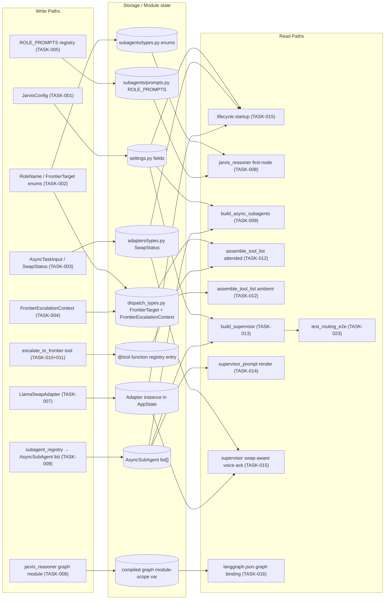
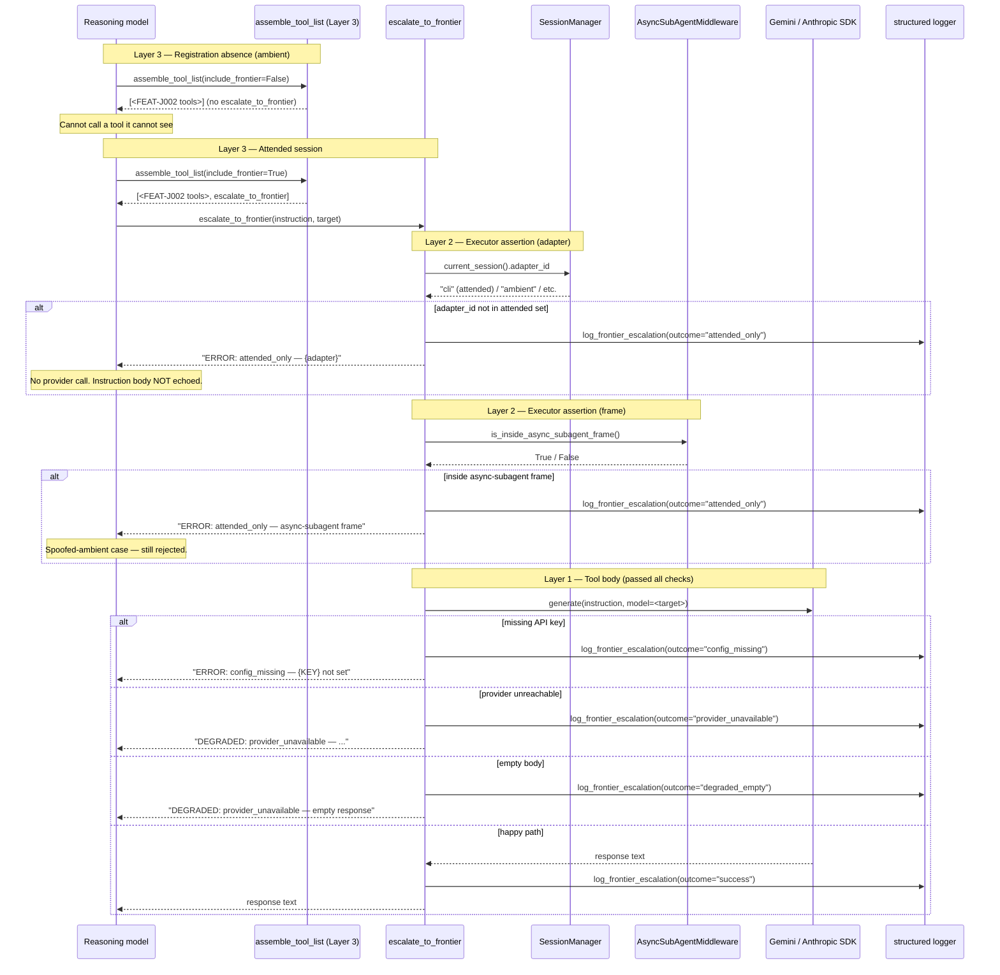
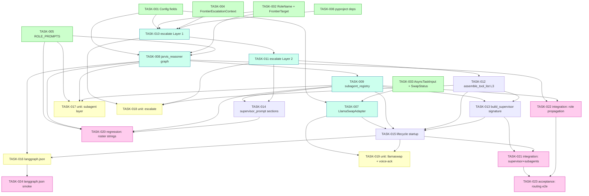

# Implementation Guide — FEAT-JARVIS-003

**Feature:** Async Subagent for Model Routing + Attended Frontier Escape
**Parent review:** [TASK-REV-J003](../../in_review/TASK-REV-J003-plan-async-subagent-and-frontier-escape.md)
**Design:** [docs/design/FEAT-JARVIS-003/design.md](../../../docs/design/FEAT-JARVIS-003/design.md)
**Gherkin spec:** [features/feat-jarvis-003-.../feat-jarvis-003-....feature](../../../features/feat-jarvis-003-async-subagent-and-frontier-escape/feat-jarvis-003-async-subagent-and-frontier-escape.feature) (44 scenarios)

**Approach:** Option B — Envelope-first, concurrent fan-out (review score 12/12).
**Wave count:** 5 | **Tasks:** 24 | **Aggregate complexity:** 7/10
**Execution model:** AutoBuild parallel worktrees (FEAT-J002 precedent)
**Testing posture:** TDD for complexity ≥ 5; standard Coach gates for < 5

---

## Wave summary

| Wave | Tasks | Focus | Parallel-safe |
|---|---|---|---|
| 1 | 6 | Envelope — config, enums, models, role prompts, pyproject | ✅ all independent |
| 2 | 5 | Components — LlamaSwapAdapter, subagent graph, registry, escalate L1, escalate L2 | ✅ within wave (deps chained on Wave 1) |
| 3 | 4 | Wiring — assemble_tool_list (Layer 3), build_supervisor, supervisor prompt, lifecycle | partial (015 gates on 007+009+012+013) |
| 4 | 4 | Deployment + unit tests — langgraph.json, subagent tests, escalate tests, llamaswap+voice-ack tests | ✅ all independent within wave |
| 5 | 5 | Integration + regression + acceptance + smoke | 020/021/022/024 parallel; 023 gates on 021+022 |

---

## Data flow: read/write paths

The mandatory Data Flow diagram (per /feature-plan spec) — every write path and every read path for this feature. Healthy = green, disconnected = red with dotted edges.

_Caption: every write path has at least one read path. The supervisor integration surface (R6) is the single confluence point — it reads subagent list, tool lists, and config before compiling._

**Disconnection check:** ✅ No disconnected write paths. No read paths without callers. R10 (test_routing_e2e) is the acceptance surface — it reads the compiled supervisor state.

---

## Integration contract sequence (complexity ≥ 5 → mandatory)

The three-layer belt+braces gate on `escalate_to_frontier` is the most delicate integration surface. This sequence diagram shows who calls what, in what order, and where rejections happen.

_Caption: Layer 3 (registration absence) is the strongest guarantee — the reasoning model cannot invoke a tool not in its registered set. Layer 2 (adapter_id + frame check) is the belt; Layer 1 (tool body branches) is the braces. Instruction body is never echoed; only adapter/frame labels appear in error strings._

---

## Task dependency graph (≥ 3 tasks → mandatory)

Parallel-safe tasks within a wave are coloured green. Wall-clock shortens roughly linearly with AutoBuild parallel worktree count.

_Caption: Wave 1 (green) is 6-way parallel; Wave 2 (blue-green) is 3-way parallel after Wave 1 clears; Wave 3 (white) is serialised on lifecycle (015); Wave 4 (yellow) is 4-way parallel; Wave 5 (pink) is 4-way parallel except 023 gating on 021+022._

---

## §4: Integration Contracts

Cross-task data dependencies where one task's output is consumed by another task's input. Every consumer task listed here carries a `consumer_context` note in its frontmatter (where it would be load-bearing for Coach validation) OR names the producer in its acceptance criteria.

### Contract 1: RoleName closed enum
- **Producer task:** TASK-J003-002 (Define RoleName + FrontierTarget closed enums)
- **Consumer task(s):** TASK-J003-005 (ROLE_PROMPTS keys), TASK-J003-008 (graph first-node role resolution), TASK-J003-009 (registry description mentions role names), TASK-J003-017 (exhaustiveness test), TASK-J003-020 (regression), TASK-J003-022 (role propagation)
- **Artifact type:** Python enum class in `src/jarvis/agents/subagents/types.py`
- **Format constraint:** closed str-Enum with exactly three members — `CRITIC="critic"`, `RESEARCHER="researcher"`, `PLANNER="planner"`. `RoleName("")` raises `ValueError` (consumed by TASK-008 to route to `unknown_role` branch).
- **Validation method:** TASK-J003-017's `tests/test_subagent_prompts.py` asserts `set(RoleName) == set(ROLE_PROMPTS.keys())` — exhaustiveness; TASK-J003-008 graph-init test exercises each member.

### Contract 2: FrontierTarget closed enum
- **Producer task:** TASK-J003-002
- **Consumer task(s):** TASK-J003-010 (default arg + dispatch), TASK-J003-018 (tests)
- **Artifact type:** Python enum class in `src/jarvis/tools/dispatch_types.py`
- **Format constraint:** closed str-Enum with exactly two members — `GEMINI_3_1_PRO`, `OPUS_4_7`. Must be str-valued so `@tool(parse_docstring=True)` argument coercion accepts literal strings.
- **Validation method:** TASK-J003-018 asserts out-of-enum target rejected at tool-boundary before provider contacted (ASSUM-005).

### Contract 3: SwapStatus model
- **Producer task:** TASK-J003-003
- **Consumer task(s):** TASK-J003-007 (adapter returns it), TASK-J003-015 (lifecycle voice-ack logic), TASK-J003-019 (tests assert shape + boundary)
- **Artifact type:** Pydantic frozen model in `src/jarvis/adapters/types.py`
- **Format constraint:** `{loaded_model: str, eta_seconds: int >= 0, source: Literal["stub","live"] = "stub"}`. Negative `eta_seconds` raises `ValidationError` at construction. Phase 2 always emits `source="stub"`; FEAT-JARVIS-004 switches to `"live"` without schema change — **this is the load-bearing invariant for Context A concern #2**.
- **Validation method:** TASK-J003-019's boundary table (ETA 0 / 30 / 31 / 240 / -1) tests both the model's `ge=0` constraint and the supervisor's voice-ack threshold.

### Contract 4: FrontierEscalationContext log-event shape
- **Producer task:** TASK-J003-004
- **Consumer task(s):** TASK-J003-010 (log emission), TASK-J003-018 (log shape assertion)
- **Artifact type:** Pydantic frozen model + `log_frontier_escalation` helper in `src/jarvis/tools/dispatch_types.py`
- **Format constraint:** exact field set `{target, session_id, correlation_id, adapter, instruction_length, outcome}`. **No `instruction` or `instruction_body` field** — ADR-ARCH-029 redaction posture (ASSUM-006). `outcome` is literal union of `success / config_missing / attended_only / provider_unavailable / degraded_empty`.
- **Validation method:** TASK-J003-018 asserts field set verbatim AND asserts instruction body absent from logged fields (regex scan).

### Contract 5: ROLE_PROMPTS mapping
- **Producer task:** TASK-J003-005
- **Consumer task(s):** TASK-J003-008 (first-node resolution), TASK-J003-017 (exhaustiveness + posture keyword assertions)
- **Artifact type:** `Mapping[RoleName, str]` in `src/jarvis/agents/subagents/prompts.py`
- **Format constraint:** exactly three entries; keys == `set(RoleName)`; each value non-empty ≥ 40 chars; each carries its posture keyword (`adversarial` / `open-ended research` / `multi-step planning`); no `{placeholders}` (final prompts, not templates).
- **Validation method:** TASK-J003-017's `test_subagent_prompts.py` exhaustiveness check.

### Contract 6: jarvis-reasoner AsyncSubAgent description — the routing contract
- **Producer task:** TASK-J003-009
- **Consumer task(s):** TASK-J003-013 (build_supervisor wires it), TASK-J003-015 (lifecycle), TASK-J003-020 (regression — substring invariants), TASK-J003-021 (integration test catalogue assertion)
- **Artifact type:** `AsyncSubAgent["description"]` string
- **Format constraint:** MUST contain all of `gpt-oss-120b`, `on the premises`, `sub-second`, `two to four minutes`, `critic`, `researcher`, `planner`. MUST NOT contain any of `deep_reasoner`, `adversarial_critic`, `long_research`, `quick_local`, or cloud-tier promise language. This is the routing-behaviour contract per DDR-010 — **the reasoning model reads this text and makes dispatch decisions based on it**.
- **Validation method:** TASK-J003-020 grep regression + TASK-J003-021 catalogue assertion.

### Contract 7: ambient_tool_factory output — Layer 3 invariant
- **Producer task:** TASK-J003-012
- **Consumer task(s):** TASK-J003-013 (factory threaded through build_supervisor), TASK-J003-015 (lifecycle calls it with `include_frontier=False`), TASK-J003-018 (registration-absence test), TASK-J003-021 (attended vs ambient catalogue assertion)
- **Artifact type:** `Callable[[], list[BaseTool]]` returning a fresh list each call
- **Format constraint:** when called with the lifecycle's fixed `include_frontier=False`, the returned list **excludes** `escalate_to_frontier` AND **includes** every FEAT-J002 tool. The list is a new object each call (no mutable aliasing); the reasoning model cannot mutate a shared list to add `escalate_to_frontier` back at runtime (ADR-ARCH-023).
- **Validation method:** TASK-J003-018 asserts identity check + mutation-isolation; TASK-J003-021 asserts tool-name set diff.

### Contract 8: JarvisConfig fields consumed by adapter + tool
- **Producer task:** TASK-J003-001
- **Consumer task(s):** TASK-J003-007 (`llama_swap_base_url` → adapter `base_url`), TASK-J003-010 (`gemini_api_key` / `anthropic_api_key` → provider SDK; `frontier_default_target` → default target; `attended_adapter_ids` → Layer 2 assertion set)
- **Artifact type:** Pydantic `JarvisConfig` fields
- **Format constraint:** `llama_swap_base_url: str` (e.g. `http://promaxgb10-41b1:9000` — no trailing slash required; consumer appends `/v1` for OpenAI-compatible base URL); `gemini_api_key: SecretStr | None`; `anthropic_api_key: SecretStr | None`; `frontier_default_target: Literal["GEMINI_3_1_PRO", "OPUS_4_7"]`; `attended_adapter_ids: frozenset[str]` (default `{"telegram","cli","dashboard","reachy"}`).
- **Validation method:** TASK-J003-015's lifecycle smoke (constructing adapter + setting OPENAI_BASE_URL) + TASK-J003-018's attended-only test matrix.

---

## Suggested commit boundaries

One commit per wave (or per contract cluster within a wave) is a reasonable rhythm. Commit messages should reference the task IDs and the relevant DDR:

- Wave 1 commits: `envelope: primitives for FEAT-JARVIS-003 (TASK-J003-001..006)` — touches config, types, models, prompts, pyproject.
- Wave 2 commits: `components: jarvis-reasoner graph + LlamaSwapAdapter (TASK-J003-007..009, DDR-010/012/015)`; then `components: escalate_to_frontier L1+L2 (TASK-J003-010..011, DDR-014)`.
- Wave 3 commits: `wiring: session-aware tool lists + build_supervisor (TASK-J003-012..015, DDR-014 Layer 3)`.
- Wave 4 commits: `deploy: langgraph.json + unit tests (TASK-J003-016..019, DDR-013)`.
- Wave 5 commits: `acceptance: regression + integration + routing e2e (TASK-J003-020..024)`.

---

## Phase 2 close criteria (FEAT-JARVIS-003 side)

Per design.md §13 item 6:
- [ ] `jarvis chat` invokes `start_async_task(name="jarvis-reasoner", role=…)` correctly on three canned role prompts (critic / researcher / planner).
- [ ] `escalate_to_frontier` returns a real Gemini 3.1 Pro response when asked explicitly on the CLI adapter.
- [ ] Ambient watcher attempt to invoke `escalate_to_frontier` → structured error.
- [ ] `langgraph dev` spins both graphs locally without packaging errors (real server, not harness smoke).

These are manual validations AFTER AutoBuild lands the 24 subtasks — not part of the feature's AC.
