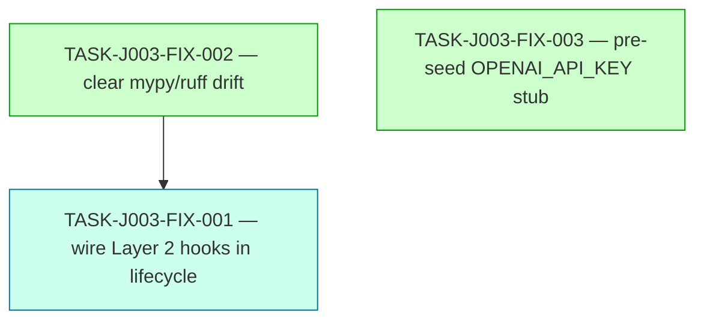
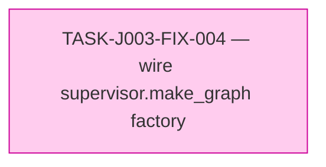

# Implementation Guide — FEAT-JARVIS-003-FIX

**Feature:** Layer 2 Wiring + Quality-Gate Closeout (follow-up to FEAT-JARVIS-003)
**Parent review:** [FEAT-JARVIS-003 review report](../../../.claude/reviews/FEAT-JARVIS-003-review-report.md)

**Approach:** Two-wave AutoBuild — Wave 1 = build-hygiene cleanup (parallel direct), Wave 2 = TDD security wiring.
**Wave count:** 2 | **Tasks:** 3 | **Aggregate complexity:** 3/10 (max 4) | **Estimated wall-clock:** half a day

---

## Wave summary

| Wave | Tasks | Focus | Parallel-safe |
|---|---|---|---|
| 1 | 2 | Build hygiene — mypy/ruff drift + conftest stub key | ✅ both fully independent |
| 2 | 1 | Layer 2 production wiring (TDD red→green) | gated on Wave 1 |

---

## Why two waves (and not one)

FIX-001's TDD acceptance gate runs `mypy src/jarvis/` against a clean baseline. If FIX-001 lands before FIX-002, the existing 9 mypy errors + the 2 new errors FIX-001's wiring exposes (Layer-2 callers will trigger more `_emit_frontier_log` invocations from production code) would all surface at once and Coach can't tell the new from the old. Landing FIX-002 first gives FIX-001 a green mypy baseline to ratchet against.

FIX-003 is fully independent of both — included in Wave 1 because there's nothing to gain by sequencing it.

---

## Dependency graph



_Wave 1 (green) is 2-way parallel; Wave 2 (blue-green) gates on FIX-002._

---

## Integration contracts (cross-task)

### Contract 1 — `_emit_frontier_log` outcome Literal must accept `"attended_only"`

- **Producer:** TASK-J003-FIX-002 (widens the Literal in `dispatch.py:_emit_frontier_log`)
- **Consumer:** TASK-J003-FIX-001 (the Layer-2 wiring causes `_check_attended_only` to call `_emit_frontier_log(... outcome="attended_only")` from a real production code path; mypy must accept this)
- **Format constraint:** `Literal["success", "config_missing", "attended_only", "provider_unavailable", "degraded_empty"]` — verbatim per design contract 4 / IMPLEMENTATION-GUIDE.md §4 Contract 4 of FEAT-JARVIS-003.
- **Validation:** `mypy src/jarvis/tools/dispatch.py` reports zero errors after FIX-002; FIX-001's new integration test exercises the path end-to-end.

### Contract 2 — `dispatch._current_session_hook` resolver shape

- **Producer:** TASK-J003-FIX-001 (assigns the hook in `lifecycle.build_app_state`)
- **Consumer:** Existing `dispatch._resolve_current_session()` and `_check_attended_only()` (no code change needed there)
- **Format constraint:** `Callable[[], Session | None]` — resolver returns the active `Session` or `None`. `Session.adapter` must be the StrEnum value comparable against `ATTENDED_ADAPTER_IDS = frozenset({"telegram", "cli", "dashboard", "reachy"})`.
- **Validation:** FIX-001's integration test asserts that with no active session, escalation is rejected with `"ERROR: attended_only — escalate_to_frontier cannot be invoked from unknown adapter"`; with an attended session, the rejection path is gated by the frame check.

### Contract 3 — `dispatch._async_subagent_frame_hook` resolver shape

- **Producer:** TASK-J003-FIX-001 (assigns the hook in `lifecycle.build_app_state`)
- **Consumer:** Existing `dispatch._is_async_subagent_frame()` (no code change needed there)
- **Format constraint:** `Callable[[], bool | None]` — `True`/`False` are authoritative; `None` (or raise) falls through to `session.metadata["currently_in_subagent"]` per ASSUM-FRONTIER-CALLER-FRAME.
- **Validation:** FIX-001's integration test exercises the spoofed-ambient case via `session.metadata["currently_in_subagent"] = True`; the expected rejection string is `"ERROR: attended_only — escalate_to_frontier cannot be invoked from async-subagent frame"`.

### Contract 4 — `lifecycle.shutdown` clears hooks

- **Producer:** TASK-J003-FIX-001 (extends `shutdown` to set both hooks back to `None`)
- **Consumer:** Tests that re-enter `build_app_state` in the same process; per-test hook injection in `test_escalate_to_frontier.py`
- **Format constraint:** Idempotent — calling `shutdown(state)` twice does not raise; subsequent `build_app_state` re-establishes the hooks.
- **Validation:** Add `tests/test_lifecycle_startup_phase3.py::TestShutdownClearsHooks::test_shutdown_resets_dispatch_hooks_to_none`.

---

## Suggested commit boundaries

- **Wave 1 commit 1**: `chore(build): clear mypy + ruff drift in src/jarvis/ (TASK-J003-FIX-002, design contract 4 / Phase 2 #9)` — touches dispatch.py, dispatch_types.py, types.py, jarvis_reasoner.py, general.py, tools/__init__.py.
- **Wave 1 commit 2**: `chore(tests): pre-seed OPENAI_API_KEY stub for fresh-env collection (TASK-J003-FIX-003, F2 / DDR-012)` — touches conftest.py, .env.example, .claude/CLAUDE.md.
- **Wave 2 commit 1**: `test(escalate): failing integration test for spoofed-ambient escalation (TASK-J003-FIX-001 red, F1 / DDR-014)` — adds tests/test_lifecycle_layer2_wiring.py only.
- **Wave 2 commit 2**: `fix(escalate): wire Layer 2 hooks in lifecycle.build_app_state (TASK-J003-FIX-001 green, F1 / ADR-ARCH-027)` — touches lifecycle.py, possibly sessions/manager.py, extends test_lifecycle_startup_phase3.py.

The deliberate red-then-green split on Wave 2 makes the constitutional-gate fix auditable in `git log` — important because ADR-ARCH-027 is a security-critical ADR.

---

## Phase-2 close criteria recovery

After this wave merges:

| # | Criterion | Status pre-FIX | Status post-FIX |
|---|---|---|---|
| 9 | Ruff + mypy clean on src/jarvis/ | ❌ 8 ruff + 9 mypy errors | ✅ 0 + 0 |
| (F1) | `escalate_to_frontier` Layer 2 active in production | ❌ Dormant | ✅ Wired in `build_app_state` |
| (F2) | Fresh-env test collection works | ❌ Fails on `OPENAI_API_KEY` | ✅ Stub pre-seeded |

Manual checks (#5 `jarvis chat` and #6 `langgraph dev` spin) remain unchanged — those need real provider keys and a human in the loop.

---

## Risks + mitigations

| Risk | Mitigation |
|---|---|
| `StrEnum` migration breaks `@tool(parse_docstring=True)` argument coercion for `RoleName`/`FrontierTarget` | FIX-002 AC includes round-trip verification of `RoleName("critic") is RoleName.CRITIC` and existing test_subagent_types_role_name.py / test_dispatch_types_frontier_escalation.py must pass unchanged. Roll back if either fails. |
| Lifecycle hook wiring stomps per-test hook injection in test_escalate_to_frontier.py | FIX-001 AC: tests use save/restore pattern around module attributes; verify pytest's autouse fixture ordering does not interfere. Add a sanity teardown assertion. |
| `SessionManager.current_session()` doesn't exist yet | FIX-001 AC explicitly allows adding it. Trivial — read the manager state and return the most recent session or `None`. |
| `AsyncSubAgentMiddleware` metadata probe is unavailable in DeepAgents 0.5.3 | FIX-001 AC documents the fallback (session-state-only); ASSUM-FRONTIER-CALLER-FRAME explicitly covers this case. |

---

## Wave 3 addendum — TASK-J003-FIX-004 (added 2026-04-27)

Surfaced during Phase-2 manual close-out: `langgraph.json` declares `./src/jarvis/agents/supervisor.py:graph`, but `supervisor.py` exposes only the `build_supervisor(config)` factory function — there is no module-level `graph` symbol, and `langgraph dev` will fail at startup. Independent of Waves 1–2 and of the GB10/llama-swap infra workstream.

### Why a dedicated wave (not folded into Wave 2)

Waves 1+2 had merged before F8 was discovered. Adding a third wave preserves the audit trail (Wave 1 = F2/F3 closure; Wave 2 = F1 closure with TDD red→green; Wave 3 = F8 closure). It also keeps the FIX-004 commit-history clean — separate red/green commits for the strengthened symbol-resolution smoke test.

### Decision: factory function, not eager module-level compile

FIX-004 chooses the factory-function form (`make_graph()`) over `graph = build_supervisor(JarvisConfig())` at module scope. The factory delegates to `lifecycle.build_app_state` so all FIX-001 invariants (Layer 2 hook wiring, ambient tool factory, capability snapshot) hold when the langgraph CLI loads the graph — not just when `jarvis chat` builds it. See the task file for the full rationale.

### Integration contract — Wave 3

#### Contract 5 — supervisor module exposes a graph factory

- **Producer:** TASK-J003-FIX-004 (adds `make_graph()` to `supervisor.py`)
- **Consumer:** `langgraph.json` (path field `:make_graph`); `langgraph dev` CLI at server load
- **Format constraint:** Zero-argument callable returning a `CompiledStateGraph[Any, Any, Any, Any]` with all FIX-001 hooks wired. Must NOT have import-time side effects — implementation lazy-imports `JarvisConfig` and `build_app_state` inside the factory body.
- **Validation:** Strengthened `tests/test_langgraph_json.py::test_jarvis_graph_path_resolves_to_supervisor_module` performs an `importlib`-based resolution + invocation + Layer-2-hook-wired assertion; FAILS today (proving F8) and PASSES post-fix.

### Wave 3 dependency graph



_Single-task wave; no internal dependencies. Independent of all Wave 1+2 work. Can run before or after llama-swap provisioning — graph compilation does not hit the network._

### Suggested commit boundaries — Wave 3

- **Wave 3 commit 1**: `test(langgraph): strengthen supervisor:graph symbol resolution check (TASK-J003-FIX-004 red, F8)` — adds the importlib-based smoke test; fails on `main` today.
- **Wave 3 commit 2**: `fix(langgraph): wire supervisor.make_graph factory for langgraph CLI (TASK-J003-FIX-004 green, F8 / DDR-013)` — adds `make_graph()` to `supervisor.py`; updates `langgraph.json` path; smoke test now passes.

### Wave 3 close criterion

After FIX-004 lands, Phase-2 close criterion #6 (`langgraph dev` real-server spin) becomes satisfiable **without** llama-swap on the GB10 — operator can run the manual smoke on the M2 Max:

```bash
OPENAI_API_KEY=stub uv run python -m langgraph dev
# Expect: server starts, both graphs registered at http://127.0.0.1:2024
curl -X POST http://127.0.0.1:2024/assistants/search \
     -H 'Content-Type: application/json' -d '{}' | grep graph_id
# Expect: both "jarvis" and "jarvis_reasoner"
```

Actual graph *invocation* still needs llama-swap up — but graph *registration* (which is what criterion #6 measures) is then verifiable independently.
