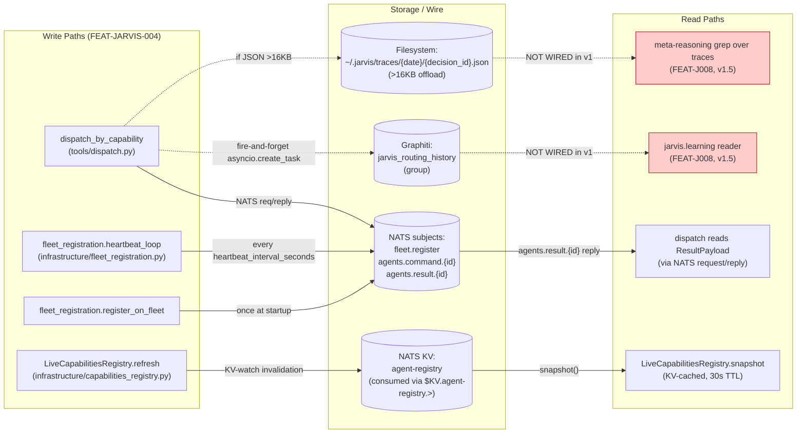
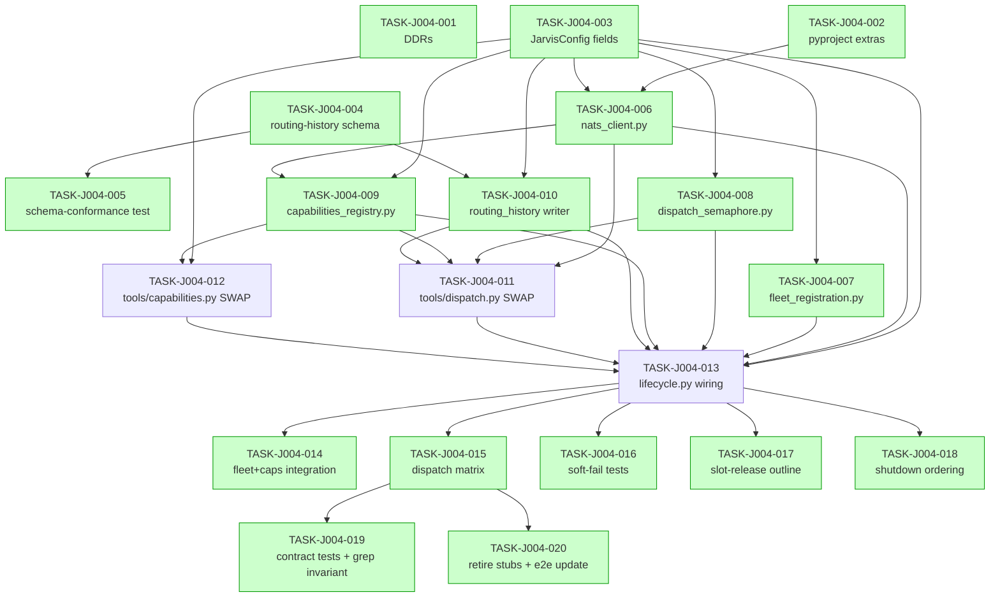

# IMPLEMENTATION-GUIDE — FEAT-JARVIS-004

> **Feature:** NATS Fleet Registration & Specialist Dispatch
> **Generated by:** `/feature-plan` from TASK-REV-22CF
> **Review report:** [.claude/reviews/TASK-REV-22CF-review-report.md](../../../.claude/reviews/TASK-REV-22CF-review-report.md)
> **Design source-of-truth:** [docs/design/FEAT-JARVIS-004/design.md](../../../docs/design/FEAT-JARVIS-004/design.md)
> **Tasks:** 20 across 5 waves
> **Approach:** Wave-based parallel fan-out (Approach 2) — auto-detect Conductor where parallel-safe
> **Testing depth:** Default-by-complexity (TDD ≥6, standard 4–5, minimal ≤3)
> **Constraint:** DDD Southwest demo timeline — favour parallelism + demo robustness

---

## §1. Data flow — read/write paths

The diagram below is the most important review artefact. It shows every
write path lit up by FEAT-JARVIS-004 and every corresponding read path.
Solid arrows are connected; dotted arrows with `NOT WIRED` labels are
deferred reads (FEAT-J008 v1.5 will close them).



**Disconnection alert (informational, acknowledged):** Two write paths
(`Graphiti jarvis_routing_history`, `~/.jarvis/traces/...`) have no
read path in v1. This is **intentional and documented** —
[ADR-FLEET-001](../../../../forge/docs/research/ideas/ADR-FLEET-001-trace-richness.md)
treats trace data as compounding; FEAT-JARVIS-008 (`jarvis.learning`,
v1.5) is the deferred reader. The trace writes must land in v1 so v1.5
has data to read; deferring the read is not the same as deferring the
write. This acknowledgement satisfies the disconnection rule —
proceeding with [I]mplement.

---

## §2. Integration contracts (sequence — complexity ≥ 5)

The dispatch sequence below is where every Wave 2 module's contract
materialises in concert. Any drift between the API-internal.md spec and
a Wave 2 implementation breaks here.

```mermaid
sequenceDiagram
    participant Tool as dispatch_by_capability\n(tools/dispatch.py)
    participant Sem as DispatchSemaphore
    participant Reg as CapabilitiesRegistry
    participant NATS as NATSClient
    participant Spec as Specialist\n(remote)
    participant Writer as RoutingHistoryWriter
    participant FS as Filesystem (~/.jarvis/traces/)

    Note over Tool,Writer: Phase 1 — pre-flight
    Tool->>Sem: try_acquire()
    alt overflow
        Sem-->>Tool: False
        Tool-->>Tool: return DEGRADED: dispatch_overloaded
    else slot acquired
        Sem-->>Tool: True
    end

    Note over Tool,Reg: Phase 2 — resolve
    Tool->>Reg: snapshot() [excluding visited]
    Reg-->>Tool: list[CapabilityDescriptor] (lex order)
    Tool->>Tool: _resolve_agent_id(...)

    Note over Tool,Spec: Phase 3 — round-trip
    Tool->>NATS: request("agents.command.{id}", envelope.encode(), timeout=...)
    NATS->>Spec: command + correlation_id
    alt success
        Spec-->>NATS: agents.result.{id} (ResultPayload, success=True)
        NATS-->>Tool: ResultPayload
    else timeout
        NATS-->>Tool: asyncio.TimeoutError
        Tool->>Tool: append RedirectAttempt; loop if attempt_index < MAX_REDIRECTS
    else specialist error
        Spec-->>NATS: ResultPayload(success=False)
        NATS-->>Tool: ResultPayload
        Tool->>Tool: append RedirectAttempt; loop
    else transport down
        NATS-->>Tool: NATSConnectionError
        Tool-->>Tool: outcome=transport_unavailable; break
    end

    Note over Tool,FS: Phase 4 — fire-and-forget trace write (DDR-019)
    Tool-)Writer: asyncio.create_task(write_specialist_dispatch(entry))
    activate Writer
    Writer->>Writer: apply structlog redact-processor (ADR-ARCH-029)
    Writer->>Writer: JSON-encode supervisor_tool_call_sequence
    alt size > 16KB (DDR-018)
        Writer->>FS: write file (mode 0600); compute SHA-256
        alt file exists (DDR-023)
            Writer-->>Writer: WARN routing_history_write_failed reason=trace_file_exists
            Note over Writer: preserve original; skip Graphiti write
        else
            Writer-->>Writer: substitute TraceRef in entry
        end
    end
    Writer-)+Writer: graphiti.add_episode(...) [fire-and-forget inner task]
    deactivate Writer

    Note over Tool: Phase 5 — release + return
    Tool->>Sem: release()
    Tool-->>Tool: return result_json or DEGRADED/TIMEOUT string
```

**Contract drift hot-spots flagged by this diagram:**

- `NATSClient.request` signature must accept `(subject: str, payload: bytes, *, timeout: float) -> Msg`. If TASK-J004-006 returns anything else, TASK-J004-011 breaks at the `await asyncio.wait_for(...)` line.
- `RoutingHistoryWriter.write_specialist_dispatch(entry)` must be safe to call without awaiting — TASK-J004-010's implementation must not raise; the only failure surface is the WARN log.
- `DispatchSemaphore.try_acquire()` must be **synchronous** (not async). If TASK-J004-008 makes it `async`, TASK-J004-011's overflow path turns into an await and the DDR-020 contract breaks.

---

## §3. Task dependency graph (≥ 3 tasks)



_Tasks shaded green can run in parallel within their wave._

**Wave gating rules:**
- Wave 1 → Wave 2 — start Wave 2 only when all Wave 1 tasks are merged (Wave 2 modules consume `JarvisConfig` and the routing-history schema).
- Wave 2 → Wave 3 — strict; Wave 3 tasks consume Wave 2 module APIs.
- Wave 3 — TASK-J004-013 depends on TASK-J004-011 + TASK-J004-012 (lifecycle wires the swapped tools); 011 and 012 can start in parallel as soon as Wave 2 lands.
- Wave 4 — start when Wave 3 is fully merged.
- Wave 5 — start when Wave 4 is fully merged.

---

## §4. Integration Contracts

The following cross-task data hand-offs are pinned. Each contract names
its producer task, its consumer tasks, the artifact format, and the
validation method. Coach must verify at gate time.

### Contract A: `JARVIS_ROUTING_HISTORY_ENTRY_SCHEMA`

- **Producer task:** TASK-J004-004
- **Consumer task(s):** TASK-J004-005, TASK-J004-010
- **Artifact type:** Pydantic v2 BaseModel (Python in-process import)
- **Format constraint:** `frozen=True`, `extra="ignore"`; full ADR-FLEET-001 §1–§7 base fields + Jarvis extensions per [DM-routing-history.md](../../../docs/design/FEAT-JARVIS-004/models/DM-routing-history.md). Authoritative for v1+ per DDR-018 — additions append-only via ADR-FLEET-00X.
- **Validation method:** TASK-J004-005's schema-conformance gate asserts every field; TASK-J004-010's writer never mutates the entry (consumer-side seam test verifies model_dump pre/post equality).

### Contract B: `NATS_CLIENT_API`

- **Producer task:** TASK-J004-006
- **Consumer task(s):** TASK-J004-009, TASK-J004-011, TASK-J004-013
- **Artifact type:** Python class with classmethod + async methods
- **Format constraint:** `NATSClient.connect(config) -> NATSClient | None` (DDR-021 soft-fail returns None, never raises); `request(subject: str, payload: bytes, *, timeout: float) -> Msg` (raises `asyncio.TimeoutError` on timeout, `NATSConnectionError` on transport failure); `drain(*, timeout: float = 5.0) -> None` (idempotent); `client` and `js` properties for KV / JetStream access.
- **Validation method:** Consumer-side seam tests in TASK-J004-009 + TASK-J004-011 use `inspect.signature` to assert the parameter shape; integration tests in TASK-J004-014 + TASK-J004-015 + TASK-J004-016 exercise the contract end-to-end.

### Contract C: `CAPABILITIES_REGISTRY_PROTOCOL`

- **Producer task:** TASK-J004-009
- **Consumer task(s):** TASK-J004-011, TASK-J004-012, TASK-J004-013
- **Artifact type:** Python `typing.Protocol` with two implementations (Live + Stub)
- **Format constraint:** Protocol surface — `snapshot() -> list[CapabilityDescriptor]` (returns fresh list copy per ASSUM-006), `refresh() -> None` (async, raises `NATSConnectionError` on KV failure), `subscribe_updates(callback) -> None` (idempotent), `close() -> None` (idempotent). Consumers read **only** via the Protocol — never branch on Live vs Stub.
- **Validation method:** Consumer-side seam test in TASK-J004-012 uses `MagicMock(spec=...)` to assert no out-of-Protocol method is called; lifecycle test in TASK-J004-013 verifies StubCapabilitiesRegistry fallback when `nats_client is None`.

### Contract D: `DISPATCH_SEMAPHORE_API`

- **Producer task:** TASK-J004-008
- **Consumer task(s):** TASK-J004-011, TASK-J004-013
- **Artifact type:** Python class wrapping `asyncio.Semaphore`
- **Format constraint:** `try_acquire() -> bool` is **synchronous and non-blocking** (False on overflow, no await); `release() -> None` is idempotent; `in_flight: int` is a property reflecting current acquired slot count. The `try_acquire` synchronicity is load-bearing — the dispatch tool's overflow path returns DEGRADED synchronously per DDR-020.
- **Validation method:** Consumer-side seam test in TASK-J004-011 asserts `try_acquire()` is **not** a coroutine (`assert not asyncio.iscoroutinefunction(sem.try_acquire)`); TASK-J004-017's slot-release Scenario Outline regression covers all 5 outcome paths.

### Contract E: `ROUTING_HISTORY_WRITER_API`

- **Producer task:** TASK-J004-010
- **Consumer task(s):** TASK-J004-011, TASK-J004-013
- **Artifact type:** Python class with async methods
- **Format constraint:** `write_specialist_dispatch(entry) -> None` is awaitable but never raises (failure surface is WARN log); the dispatch tool calls it via `asyncio.create_task(...)` so the await happens off-path. `flush(*, timeout: float = 5.0) -> None` is bounded — abandons after timeout with WARN per DDR-019. Writer accepts the frozen `JarvisRoutingHistoryEntry` and applies redaction at the write boundary, not at construction (ADR-ARCH-029).
- **Validation method:** Consumer-side seam test in TASK-J004-013 asserts `flush(timeout=...)` is called with `timeout <= 5.0`; TASK-J004-016's soft-fail tests assert "WARN once, then silent" ratchet on Graphiti-down.

### Contract F: `NATS_TOPIC_SINGULAR_CONVENTION`

- **Producer task:** external — `nats_core.Topics` formatters
- **Consumer task(s):** TASK-J004-007, TASK-J004-009, TASK-J004-011
- **Artifact type:** subject string formatters
- **Format constraint:** All NATS subjects produced via `nats_core.Topics.*` formatters. Singular convention per ADR-SP-016: `agents.command.*`, `agents.result.*`, `fleet.register`. Plural forms (`agent.commands.*`, `agents.commands.*`) **reject at the `nats_core.Topics` constructor** — protected by the producer.
- **Validation method:** TASK-J004-019 runs a grep invariant over `src/jarvis/` asserting no string literal matches `"agents.command."` / `"agents.result."` / `"fleet.register"` outside the documented allow-list (the `nats_core.Topics` import + module docstrings).

### Contract G: `SOURCE_ID_JARVIS_AUDIT`

- **Producer task:** TASK-J004-011 (every emitted `MessageEnvelope`)
- **Consumer task(s):** TASK-J004-019 (audit invariant test)
- **Artifact type:** `nats_core.MessageEnvelope.source_id` field value
- **Format constraint:** Every `MessageEnvelope` emitted from any module under `src/jarvis/` sets `source_id="jarvis"`. This is the audit-trail invariant per API-events §5 — survives schema drift.
- **Validation method:** TASK-J004-019 parametrises a contract test across every emit site found via grep; asserts `envelope.source_id == "jarvis"` on each.

---

## §5. Wave-level execution strategy (Conductor-friendly)

| Wave | Tasks | Parallel-safe? | Conductor workspaces |
|---|---|---|---|
| **Wave 1** (foundations) | 5 | Yes — file-disjoint | `feat-jarvis-004-wave1-{1..5}` |
| **Wave 2** (infrastructure modules) | 5 | Yes — file-disjoint (5 separate `src/jarvis/infrastructure/*.py` files; one shared file `routing_history.py` is split across T004 + T010 by section, declarations vs writer body) | `feat-jarvis-004-wave2-{1..5}` |
| **Wave 3** (tool surface + lifecycle) | 3 | Partial — T011 + T012 parallel-safe (different `tools/*.py` files); T013 sequential (waits on T011 + T012 because `assemble_tool_list` consumes both swap-points) | `feat-jarvis-004-wave3-{1..3}` |
| **Wave 4** (integration + soft-fail tests) | 5 | Yes — file-disjoint test files | `feat-jarvis-004-wave4-{1..5}` |
| **Wave 5** (contract tests + retire stubs) | 2 | Yes — file-disjoint | `feat-jarvis-004-wave5-{1..2}` |

**Estimated wall-clock under wave fan-out**: 4–5 working days vs 6–8
days fully sequential. The DDD Southwest constraint motivates the
fan-out posture.

---

## §6. Resolutions for the four user-flagged review concerns

| Concern | Owner task | Resolution |
|---|---|---|
| **ASSUM-009** (low — trace-file collision) | TASK-J004-001 | Promoted to **DDR-023**: WARN-and-preserve; pre-existing trace file → log + skip Graphiti write (do not overwrite). Encoded as failure mode in TASK-J004-010. |
| **ASSUM-008** (medium — degraded eligibility) | TASK-J004-001 | Promoted to **DDR-024**: degraded specialists eligible v1; redirect-with-retry (DDR-017) handles failures. FEAT-J008 may suppress later via append-only DDR. Captured by routing-history at decision time. |
| **Contract enforcement** | TASK-J004-019 | 7 contract tests + Topics-formatter grep invariant + parametrised `source_id="jarvis"` audit per API-events §5. Replaces the Phase 2 LOG_PREFIX_DISPATCH grep template. |
| **Test strategy gaps** | TASK-J004-017 + TASK-J004-018 + TASK-J004-010 | Slot-release Scenario Outline 5-row regression (DDR-020 invariant). Strict shutdown-ordering invariant (8-step sequence). Filesystem dir-creation at mode 0700 covered in writer. |

---

## §7. Risk register (post-task-breakdown)

| Risk | Owner task | Mitigation |
|---|---|---|
| Wave 2 module drifts from API-internal.md spec under parallel implementation | All Wave 2 | Each task's seam test consumes the producer's contract via `inspect.signature` / behavioural assertion |
| 16KB offload threshold unsuitable for real workloads | TASK-J004-010 | DDR-018 already considered alternatives; if WARN frequency exceeds 1% over 24h, append-only DDR raises threshold |
| `NATSKVManifestRegistry` callback shape differs from Forge convention | TASK-J004-009 | ASSUM-NATS-KV-WATCH carry-forward; thin adapter inside `LiveCapabilitiesRegistry` isolates divergence |
| Phase 2 stub anchors leak into release | TASK-J004-020 | Test flips invariant from "must contain" to "must NOT contain"; runs against `src/jarvis/` |
| Demo-day NATS hiccup → Jarvis crashes | TASK-J004-016 | Soft-fail tests assert process-still-alive on every soft-fail path; demo robustness gate |
| Redaction missed in offloaded file content | TASK-J004-010 + TASK-J004-005 | Test asserts redacted token never appears in `~/.jarvis/traces/...` file content |

---

## §8. Next steps after `/feature-plan`

1. Inspect this guide + the 20 task files in this directory.
2. Run `/feature-build FEAT-J004-XXXX` for AutoBuild execution (the YAML lands at `.guardkit/features/FEAT-J004-XXXX.yaml`).
3. Or run `/task-work TASK-J004-001` for manual single-task execution.
4. Wave 1 and Wave 2 are the long pole — start there.

---

*Generated 2026-04-27 by `/feature-plan` orchestration. See [.claude/reviews/TASK-REV-22CF-review-report.md](../../../.claude/reviews/TASK-REV-22CF-review-report.md) for the upstream decision-mode review.*
