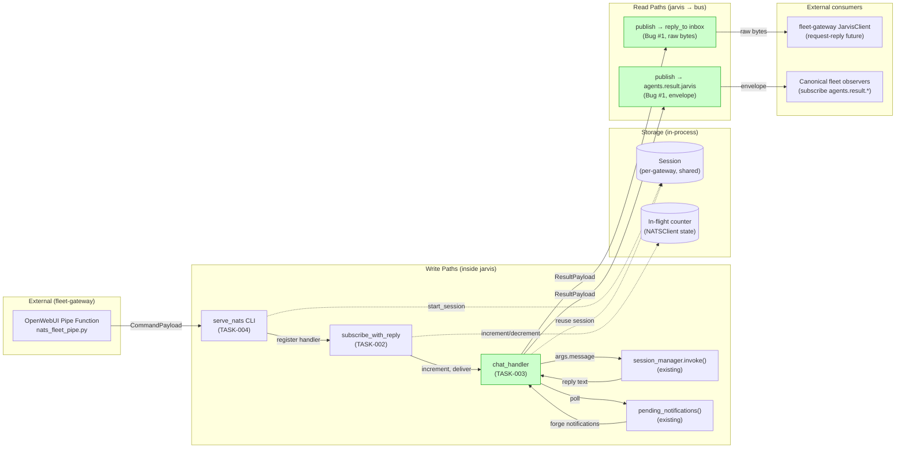
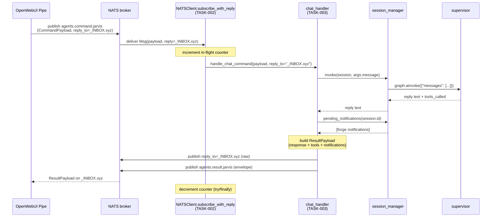
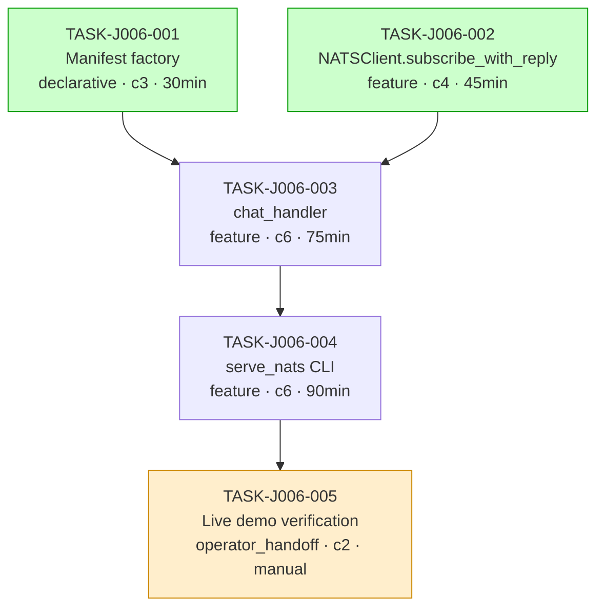

# Implementation Guide — NATS Chat Gateway (FEAT-JARVIS-006)

**Feature**: FEAT-JARVIS-006
**Review task**: [TASK-REV-JV06](../TASK-REV-JV06-plan-nats-chat-gateway.md)
**Approach**: Option 1 — Extend AppState + thin chat handler
**Budget**: 3–4 hours (demo deadline 12 May 2026)

---

## §1. Approach Summary

Add a NATS subscriber on `agents.command.jarvis` that feeds inbound chat
requests into the existing `session_manager.invoke()` pipeline and
dual-publishes the supervisor's reply.

The gateway adds ONLY two things to the existing `AppState.nats_client`:

1. A command subscription via a new `subscribe_with_reply` API on `NATSClient`
2. An in-flight drain counter for graceful shutdown

All other infrastructure (connect, register, heartbeat, deregister, disconnect)
is owned by `build_app_state()` in `infrastructure/lifecycle.py` and reused
verbatim. This resolves **Risk #5** (double-registration) by construction.

---

## §2. Data Flow: Read/Write Paths



**What to look for**: both `R1` (reply inbox) and `R2` (canonical envelope topic)
are wired to `chat_handler` (W3). Missing either is Bug #1 regression. All
read paths have caller — no disconnections.

---

## §3. Integration Contracts: Sequence



**What to look for**: two publishes from `chat_handler` (Bug #1 dual-publish);
notifications drained AFTER `invoke()` and BEFORE publish (Risk #3); counter
increments before handler and decrements after, even on exception.

---

## §4. Integration Contracts

### Contract: NATS connection URL
- **Producer task**: external (operator / env var)
- **Consumer task(s)**: TASK-J006-004 (`serve_nats` CLI)
- **Artifact type**: CLI flag / environment variable (`--nats` or `JARVIS_NATS_URL`)
- **Format constraint**: `nats://host:port` (nats-py URL format; no trailing slash). For the GB10 demo: `nats://<gb10-broker>:4222`.
- **Validation method**: `_create_app_state()` calls `NATSClient.connect(config)`; if it returns `None`, `serve_nats` exits non-zero (broker-as-hard-dependency posture). Coach verifies the exit-code branch via unit test.

### Contract: CommandPayload (inbound wire format)
- **Producer task**: external (fleet-gateway `nats_fleet_pipe.py`, FEAT-FG-001 — already shipped)
- **Consumer task(s)**: TASK-J006-003 (`chat_handler`)
- **Artifact type**: NATS message body (`nats_core.events._agent.CommandPayload`)
- **Format constraint**:
  ```json
  {
    "command": "chat",
    "args": {
      "message": "<string, required, non-empty>",
      "conversation_history": [...],   // optional, IGNORED by jarvis
      "adapter": "openwebui"            // optional
    },
    "correlation_id": "<string>"
  }
  ```
  Inbound `conversation_history` is **deliberately ignored** — the per-gateway session is the canonical history store. Empty/missing `message` yields a structured error reply (not an exception).
- **Validation method**: Coach verifies via unit tests in TASK-J006-003: (a) empty message yields error ResultPayload, (b) `conversation_history` does not mutate session state, (c) handler does not raise.

### Contract: ResultPayload (outbound wire format, dual-published)
- **Producer task**: TASK-J006-003 (`chat_handler`)
- **Consumer task(s)**: external — fleet-gateway `JarvisClient` (request-reply) AND canonical fleet observers (envelope topic)
- **Artifact type**: NATS message body (`nats_core.events._agent.ResultPayload`)
- **Format constraint**:
  ```json
  {
    "result": {
      "response": "<supervisor reply text + appended notifications>",
      "tools_called": ["<tool_name>", ...],
      "correlation_id": "<echoed from inbound>"
    },
    "error": null   // or { "code": "...", "message": "..." } on failure
  }
  ```
  **Published to BOTH** the raw `reply_to` inbox (subject = inbox name from inbound Msg.reply) AND the canonical `agents.result.jarvis` subject (envelope-wrapped). Both subjects are flat (no `*` / `>` wildcards — Bug #4).
- **Validation method**: Coach verifies via seam test in TASK-J006-003 — assert exactly two `client.publish` calls per handler invocation; assert subjects are flat; assert canonical subject equals `agents.result.jarvis` literal.

### Contract: AgentManifest (in-process)
- **Producer task**: TASK-J006-001 (`infrastructure/manifest.py`)
- **Consumer task(s)**: TASK-J006-003, TASK-J006-004 (informational; manifest is published by existing `register_on_fleet` in `infrastructure/lifecycle.py`)
- **Artifact type**: Python object (`nats_core.manifest.AgentManifest`)
- **Format constraint**: exactly one `ToolCapability` (`name="chat"`) with `message` as required string in parameter schema; exactly one `IntentCapability` with non-empty signals (Bug #5 guard from study-tutor template).
- **Validation method**: unit test in TASK-J006-001 asserts shape; integration test in TASK-J006-004 confirms `register_on_fleet` is invoked exactly once (Risk #5).

---

## §5. Task Dependency Graph



_Wave 1: TASK-001 and TASK-002 (green background) can run in parallel — they touch
different files and have no dependencies. Wave 2: TASK-003. Wave 3: TASK-004.
Wave 4: TASK-005 is operator_handoff (orange) — runs manually post-merge._

---

## §6. Wave Execution Plan

| Wave | Tasks | Notes |
|---|---|---|
| 1 | TASK-J006-001, TASK-J006-002 | Parallel-safe; separate files (`manifest.py` is new, `nats_client.py` extension). Conductor workspaces optional. |
| 2 | TASK-J006-003 | Depends on Wave 1. Single task. |
| 3 | TASK-J006-004 | Depends on TASK-003. Single task. Includes the integration test that exercises waves 1–3 together. |
| 4 | TASK-J006-005 | Operator-only. Skipped by AutoBuild. Verified manually on the GB10. |

**Estimated total**: ~3.75 hours of focused work for tasks 001–004; demo verification (005) runs out-of-band on the GB10 before the 16 May demo.

---

## §7. Risk Mitigations Wired into the Plan

| Risk | Mitigation | Verified in |
|---|---|---|
| **#5 Double registration on AppState** | No NATSAdapter class. `serve_nats` reuses `_create_app_state()`. No second `register_on_fleet` call. | TASK-004 integration test asserts exactly one `register_on_fleet` invocation across the full flow. |
| **#3 Forge notification drain** | `chat_handler` calls `session_manager.pending_notifications()` AFTER `invoke()` and BEFORE publish; notifications appended to response text. | TASK-003 unit test with fake notifications fixture. |
| **Bug #1 dual-publish** | `chat_handler` publishes to BOTH raw `reply_to` AND `agents.result.jarvis`. | TASK-003 seam test asserts exactly two publish calls. |
| **Bug #1 reply_to propagation** | `NATSClient.subscribe_with_reply` handler signature receives `reply_to` as second arg (not plain `subscribe`). | TASK-002 unit test asserts handler invocation signature. |
| **Bug #4 flat subjects** | All subjects (`agents.command.jarvis`, `agents.result.jarvis`) are string literals; no wildcards. | TASK-003 boundary test asserts subject equality. |
| **Broker-as-hard-dependency** | `serve_nats` exits non-zero if `NATSClient.connect()` returns `None`. Rejects soft-fail mode used by `chat` REPL. | TASK-004 unit test with mocked failed connect. |
| **Single shared session (Phase 1)** | Documented trade-off; one `Session` created at startup; concurrent requests serialise through `session_manager.invoke()`. | TASK-004 implementation note + scope-doc reference. |
| **Demo latency (supervisor inference)** | Pre-warm `qwen36-workhorse` in llama-swap before demo. | TASK-005 AC-005-01 (operator). |

---

## §8. Files Touched

| File | TASK | Change |
|---|---|---|
| `src/jarvis/infrastructure/manifest.py` | 001 | NEW |
| `src/jarvis/infrastructure/nats_client.py` | 002 | EXTEND (add `subscribe_with_reply`, in-flight counter, drain timeout) |
| `src/jarvis/infrastructure/chat_handler.py` | 003 | NEW |
| `src/jarvis/cli/main.py` | 004 | EXTEND (add `serve_nats` click command, `_serve_adapter` helper) |
| `tests/unit/infrastructure/test_manifest.py` | 001 | NEW |
| `tests/unit/infrastructure/test_nats_client_subscribe.py` | 002 | NEW |
| `tests/unit/infrastructure/test_chat_handler.py` | 003 | NEW |
| `tests/integration/test_serve_nats.py` | 004 | NEW |
| `docs/runbooks/RESULTS-FEAT-JARVIS-006-live-demo-<date>.md` | 005 | NEW (operator-written post-demo) |

---

## §9. Reference: Proven Templates

Per the scope doc, build from these references (do NOT copy wholesale — simplify
for single-command surface):

- `study-tutor/src/study_tutor/adapters/nats_adapter.py` — `_on_command`, `active_tasks` counter, 30 s drain timeout
- `study-tutor/src/study_tutor/adapters/command_router.py` — `_publish_result` dual-publish, `_safe_invoke` exception boundary
- `study-tutor/src/study_tutor/adapters/manifest.py` — `ToolCapability` + `IntentCapability` shapes
- `study-tutor/src/study_tutor/cli/main.py` — `serve_nats` command (~line 338+), `_serve_adapter`, signal handler pattern
- `nats-core/src/nats_core/client.py:177` — `subscribe_with_reply` reference implementation

All four references proven GREEN across runbook executions 8–11 May 2026.

---

## §10. Acknowledgements & Disconnection Audit

Data flow audit (per `/feature-plan` Disconnection Rule): every write path in §2
has a corresponding read path with a real consumer. Both NATS publish paths
(R1 reply inbox, R2 canonical envelope topic) are consumed externally (C1
fleet-gateway `JarvisClient`, C2 fleet observers). **No disconnected paths.**

---

_Drafted from `nats-chat-gateway-scope.md` (7 May, updated 11 May 2026) and
`feat-jarvis-006-nats-chat-gateway_summary.md` (26 BDD scenarios)._
