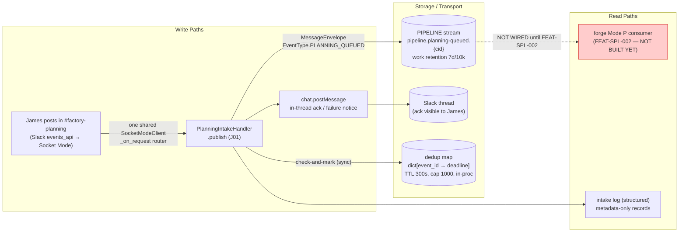
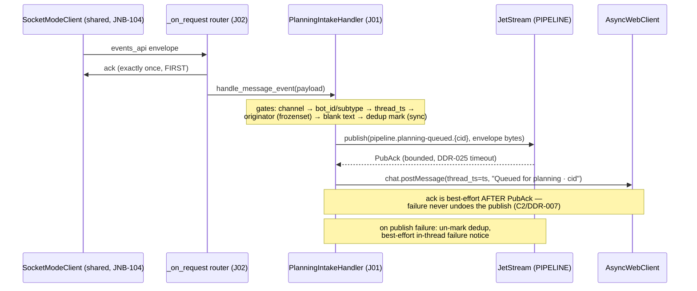
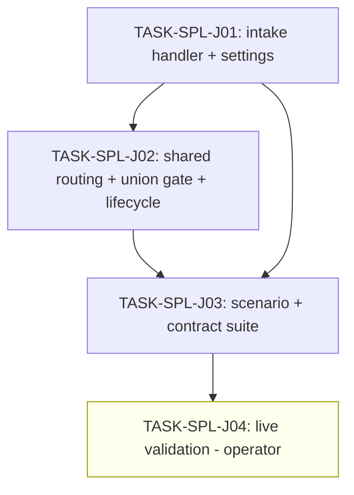

# Implementation Guide — FEAT-SPL-001 Slack Planning Intake

**Parent review**: TASK-REV-3240 (`.claude/reviews/TASK-REV-3240-review-report.md`) —
read it first; its verified findings F1–F12 are binding.
**Spec**: `features/feat-spl-001-slack-planning-intake/` (18 scenarios, 10 assumptions).
**Approach**: Option A — one shared Socket Mode connection, request-type routing inside
the single ack-first listener, union no-op gate, all intake logic in a new module.

## Data Flow: Read/Write Paths

**Disconnection Alert**: the JetStream read path has no consumer until forge FEAT-SPL-002
(Mode P) lands — **deliberate** (Pattern A / ADR-SP-014: jarvis publishes and walks away;
Mode P is ACTION 7's lane). Consequence recorded in J04: queued requests expire at the
stream's 7d/10k work-retention bound until Mode P deploys. Do not add a jarvis-side
consumer to "fix" this.

## Integration Contracts (sequence)

## Task Dependencies

_No parallel-safe waves — each task builds on the previous (single-file contention on
`slack_reply.py`/`lifecycle.py` and test-suite layering). T4 is operator-only._

## §4: Integration Contracts

### Contract: PlanningIntakeHandler seam
- **Producer task:** TASK-SPL-J01
- **Consumer task(s):** TASK-SPL-J02 (router dispatch), TASK-SPL-J03 (scenario drive)
- **Artifact type:** Python class + factory (`create_slack_planning_intake_handler`)
- **Format constraint:** async `handle_message_event(payload: dict) -> None`, never
  raises; factory returns handler-or-None per its own no-op gate (mirrors
  `build_reply_handler`/`create_slack_reply_client` shapes)
- **Validation method:** J02's permutation tests instantiate via the factory; J03 drives
  the real handler through `_on_request`

### Contract: planning-queued wire bytes
- **Producer task:** TASK-SPL-J01 (`NatsPlanningQueuedPublisher`)
- **Consumer task(s):** TASK-SPL-J03 (contract class); forge FEAT-SPL-002 (future)
- **Artifact type:** JetStream message
- **Format constraint:** subject `pipeline.planning-queued.{correlation_id}`; bytes parse
  as `MessageEnvelope` (`event_type=planning_queued`, `source_id="jarvis"`); payload
  validates as `PlanningQueuedPayload` with `originating_adapter="slack"` **explicitly
  present** (wire layer skips the validator on omission — review F4)
- **Validation method:** J03's G2 round-trip through installed nats_core 0.5.0

### Contract: JARVIS_SLACK_PLANNING_* settings
- **Producer task:** TASK-SPL-J01 (settings fields)
- **Consumer task(s):** TASK-SPL-J02 (`.env.example`, lifecycle gate), TASK-SPL-J04 (operator env)
- **Artifact type:** environment variables
- **Format constraint:** `JARVIS_SLACK_PLANNING_CHANNEL_ID` = Slack channel id;
  `JARVIS_SLACK_PLANNING_ORIGINATOR_USER_ID` = comma-separated Slack member id(s),
  v1 single id documented
- **Validation method:** J02 permutation tests; J04 boot-log echo check

## Execution Strategy

Sequential waves (no Conductor parallelism — single-repo, overlapping files):

- **Wave 1**: TASK-SPL-J01 (task-work) — handler module + settings + pin bump
- **Wave 2**: TASK-SPL-J02 (task-work) — router seam + union gate + lifecycle + docs
- **Wave 3**: TASK-SPL-J03 (task-work) — scenario/contract suite
- **Wave 4**: TASK-SPL-J04 (operator) — live validation, bundle with OPS-001

## Standing decisions binding this feature

- No reasoning in jarvis (SPL scope §3/§5) — the DeepAgents graph never sees intake.
- ADR-ARCH-004 statelessness — dedup is process-local and bounded; no durable dedup.
- Thin-surface (scope §8) — no shared publish helper (rule-of-three noted, deferred);
  no rate-limit machinery; Option-C connection refactor deferred until FEAT-SPL-003.
- Log hygiene hard AC — `request_text` never appears in any log record (review F6).
- ASSUM-007 design half resolved by TASK-REV-3240 (shared connection + union gate);
  ASSUM-001 hedged (allow-list-ready parsing, single-id v1); both still listed for
  Rich's assumptions review with the manifest as OPS prerequisite.
