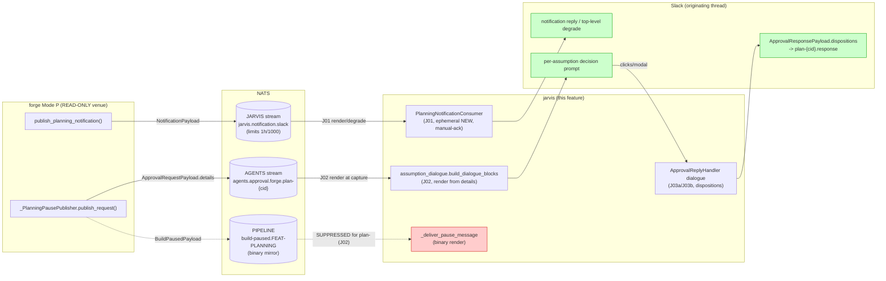
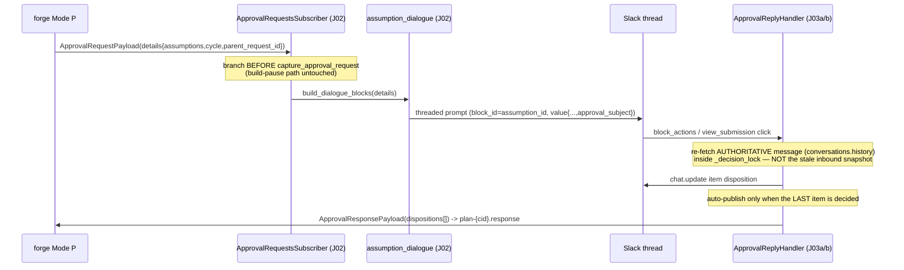
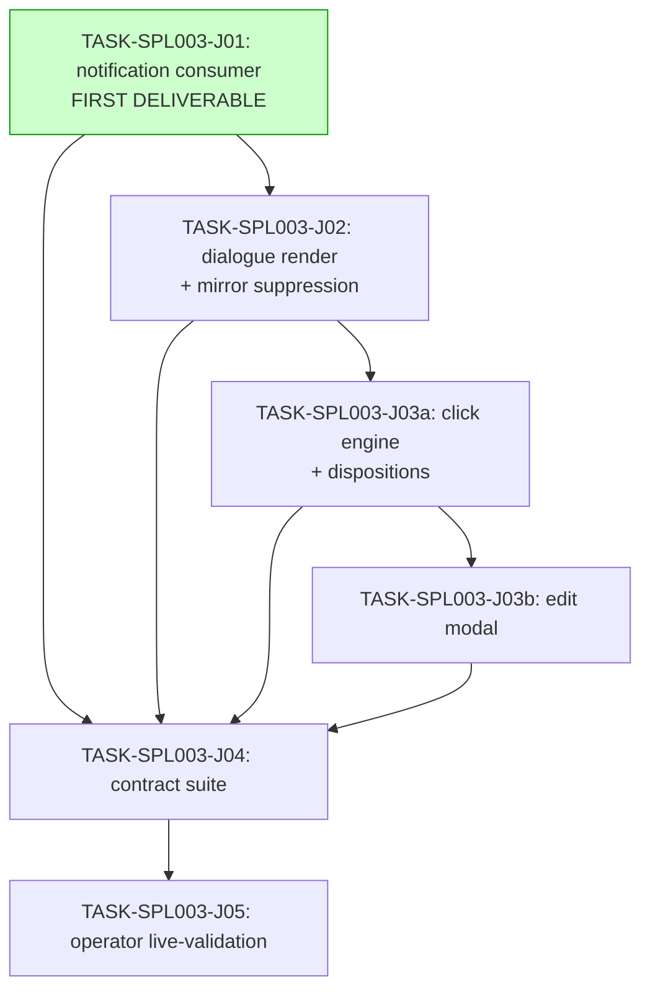

# FEAT-SPL-003 (jarvis half) — Implementation Guide

Assumption Dialogue: the `jarvis.notification.slack` return channel + per-assumption
Block Kit decision prompts. Planned via the house 3-agent decision panel (TASK-REV-A387);
gate = `guardkit feature validate FEAT-SPL-003` (PASS). Build order: **J01 → J02 → J03a →
J03b → J04**, then the operator task J05. **J01 is the first deliverable and is shippable
alone** (WS1 §5).

## Data Flow: Read/Write Paths

**Disconnection Alert (intentional):** the red `_deliver_pause_message` path is
**deliberately suppressed** for `plan-` builds (J02) — the binary Approve/Reject mirror
must NOT render for a planning checkpoint (it would be the approve-all rubber-stamp
scenario 15 forbids). This is a suppression, not a missing wire. All three green read
paths have callers.

**Forge-half dependency (honest):** forge does not yet project `assumptions` /
`parent_request_id` / `cycle` into `details` (ASSUM-014; TASK-SPL003F-001). J02/J03 are
jarvis-fixture-tested against the J04 contract fixture; live E2E is J05 once forge-half
lands. J01 works against **live** forge today via the degrade path.

## Integration Contracts (sequence)

## §4: Integration Contracts

### Contract: ITEM_ACTION_VALUE + dialogue block encoding
- **Producer task:** TASK-SPL003-J02 (`assumption_dialogue.build_dialogue_blocks`)
- **Consumer task(s):** TASK-SPL003-J03a, TASK-SPL003-J03b (`parse_dialogue_blocks`)
- **Artifact type:** Slack Block Kit block + button `value` JSON
- **Format constraint:** each per-item button `value` = compact JSON
  `{"correlation_id","request_id","assumption_id","cycle","approval_subject"}`, `len` <
  `_SLACK_ACTION_VALUE_LIMIT` (2000); `block_id == assumption_id`; per-item disposition +
  `edit_delta` stashed **machine-readably** (not human display text) so J03 re-derives
  state from the rendered message alone (ASSUM-004). Assumption text NEVER in the value.
- **Validation method:** the encode (`build_dialogue_blocks`) and decode
  (`parse_dialogue_blocks`) live in **one shared module** so the contract is a single
  source of truth (no cross-wave prose drift); J04 round-trips a rendered message through
  `parse_dialogue_blocks` and asserts `edit_delta` byte-exactness.

### Contract: forge ApprovalRequestPayload.details (the forge-half obligation)
- **Producer task:** TASK-SPL003F-001 (forge venue — NOT this feature)
- **Consumer task(s):** TASK-SPL003-J02
- **Artifact type:** `ApprovalRequestPayload.details` dict on the wire
- **Format constraint:** `{build_id:"plan-<cid>", feature_id:"FEAT-PLANNING",
  checkpoint_type:"product_docs"|"product_docs_escalated"|..., expected_approver,
  attempt_count, parent_request_id, cycle, summary:{assumptions:[{id,text,confidence,basis}]}}`
- **Validation method:** pinned as `tests/fixtures/spl003_forge_details.json` in J04; J02
  renders it end-to-end. forge-half must satisfy this fixture.

### Contract: ApprovalResponsePayload.dispositions (nats-core 0.6.0)
- **Producer task:** TASK-SPL003-J03a/J03b · **Consumer:** forge revision assembler (READ-ONLY)
- **Format constraint:** `dispositions: list[{assumption_id, disposition, edit_delta?, notes?}]`;
  `disposition` ∈ {`accepted`,`modified`,`deferred`} (approve→accepted, edit→modified,
  defer→deferred; **no per-item `rejected`**); aggregate `decision` per ASSUM-006.
- **Validation method:** J04 round-trips through the installed `nats_core` model; vocabulary
  guard asserts no `confirmed`/`overridden`/per-item `rejected` on the wire.

## Task Dependencies

_J01 (green) is independently shippable — a new module + new AppState block touching none
of the shared build-pause/reply code. It delivers the missing return channel alone._

## Frozen constraints honoured (do not reopen)
- DD-SPL003-1 round-trip (no KV; jarvis holds zero mapping state; restart-survival by
  construction). ASSUM-007 ephemeral NEW consumer. propose-never-elicit. ADR-ARCH-004 no
  session store. identity v2 (decided_by = clicker member id; forge expected_approver
  authoritative). cap-3 → escalate to Rich. Build against nats-core 0.6.0 structured
  dispositions. jarvis venue only; nats-core/forge/fleet-memory READ-ONLY; planning inert.

## Build-time refinements (dated deviations — see the assumptions manifest)
1. Dedup key `envelope.message_id` (not correlation_id+timestamp) — never-drop fidelity (ASSUM-008).
2. Ephemeral-NEW consumer with **manual ack** (ack-after-post; bounded NAK on post failure)
   — closes the silent-loss hole while staying ephemeral/NEW (ASSUM-007).
3. Completeness derived from the **authoritative** re-fetched message (conversations.history),
   not the stale inbound snapshot — fixes the concurrent-final-click stall (ASSUM-004/010).
4. Structured dispositions on the write side only; **no** notes-JSON read/write path (YAGNI;
   jarvis never reads its own responses) (ASSUM-003).
