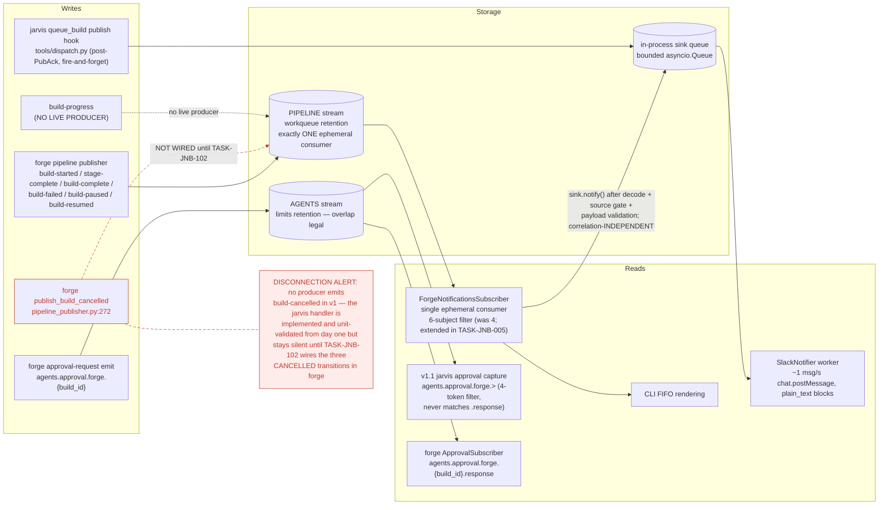
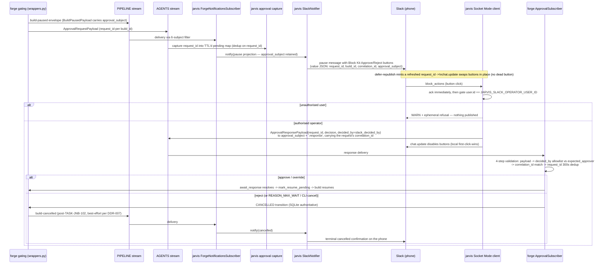
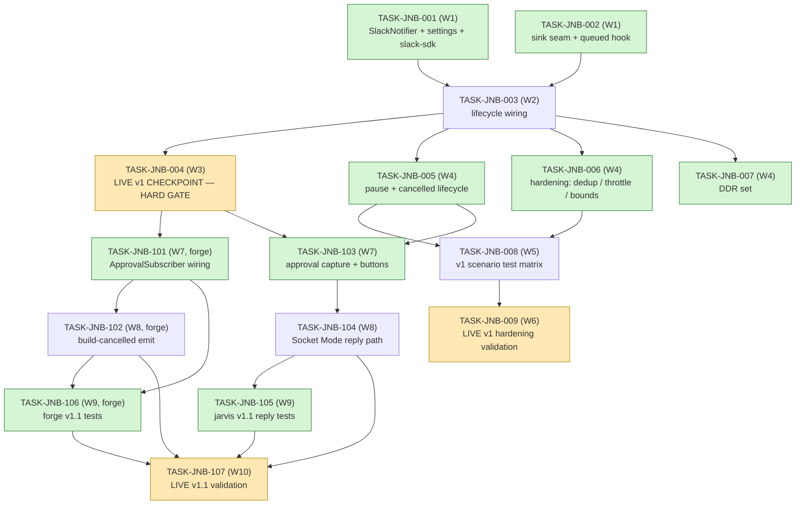

# Jarvis Notification Bridge (FEAT-UBS-003) — Implementation Guide

**Parent review:** TASK-REV-C951 (forge repo: `../../../../forge/.claude/reviews/TASK-REV-C951-review-report.md`)
**Spec:** forge repo, `../../../../forge/features/jarvis-notification-bridge/` (`.feature`, assumptions YAML, summary)
**Scope:** 16 tasks across two sibling repos — jarvis (12) and forge (4). v1 (TASK-JNB-001..009) is jarvis-only push notifications to Slack; v1.1 (TASK-JNB-101..107) adds the phone reply path (approve/reject) across both repos.

This is the canonical guide for the whole feature. Each task file is self-contained (the jarvis-scoped autobuild worktree cannot read the sibling forge repo), but sequencing, contracts, and gates are defined here.

---

## 1. Data Flow

*Caption: all Slack traffic flows through the single existing PIPELINE ephemeral consumer and an in-process sink queue — the queued event bypasses the stream entirely via the `queue_build` publish hook, and only the AGENTS stream (limits retention) ever gains new consumers.*

## 2. Integration Contract — v1.1 Reply Path

*Caption: window/expiry-race enforcement lives exclusively forge-side, so a reply-vs-expiry race resolves in exactly one place to one outcome; the jarvis operator-id gate is a courtesy filter, the forge 4-step chain is the authority.*

## 3. Task Dependency Graph

*Caption: green nodes are parallel-safe within their wave (W1: 001+002, W4: 005+006+007, W7: 101+103, W9: 105+106); amber nodes are the three operator_handoff tasks AutoBuild never attempts.*

## §4 Integration Contracts

Consumers of each contract carry `consumer_context` frontmatter and a `## Seam Tests` section in their task files; producers do not.

### Contract 1 — NOTIFICATION_SINK
| Field | Value |
|---|---|
| Producer | TASK-JNB-001 (`src/jarvis/infrastructure/slack_notifier.py`) |
| Consumers | TASK-JNB-002 (subscriber seam + `queue_build` hook), TASK-JNB-003 (lifecycle binding) |
| Artifact type | Python async protocol, in-process jarvis (`asyncio`) |
| Format constraint | `async notify(ForgeNotification)` must NEVER raise into the caller; failures are WARNING + continue (DDR-007 — the SQLite ledger is authoritative) |
| Validation | `pytest.mark.seam` tests on both consumers: await `notify()` with a Slack client mock raising `SlackApiError` and assert no exception propagates and a WARNING is logged |

### Contract 2 — WIDENED_FORGENOTIFICATION
| Field | Value |
|---|---|
| Producer | TASK-JNB-005 (event_type Literal + optional fields per the frozen-model rule) |
| Consumer | TASK-JNB-103 (button routing) |
| Artifact type | pydantic model (jarvis `ForgeNotification`) |
| Format constraint | pause projection retains `approval_subject`; new fields are optional with `None` defaults so CLI rendering is unaffected |
| Validation | seam test: pause-projected `ForgeNotification` round-trips `approval_subject` and renders with `coach_score` None |

### Contract 3 — BUTTON_METADATA
| Field | Value |
|---|---|
| Producer | TASK-JNB-103 (Block Kit Approve/Reject buttons) |
| Consumer | TASK-JNB-104 (Socket Mode `block_actions` handler) |
| Artifact type | Slack Block Kit interactive buttons over Socket Mode (`slack-sdk` SocketModeClient) |
| Format constraint | button value is JSON `{request_id, build_id, correlation_id, approval_subject}` and must stay within Slack's 2000-char action value limit |
| Validation | seam test: value JSON round-trip including a length assertion < 2000 chars with max-size build/correlation ids |

### Contract 4 — APPROVER_IDENTITY
| Field | Value |
|---|---|
| Producer | TASK-JNB-101 (forge `expected_approver` config) |
| Consumer | TASK-JNB-104 (jarvis `slack_decided_by` config) |
| Artifact type | config string equality: forge `expected_approver` == jarvis `slack_decided_by` (pydantic-settings) |
| Format constraint | exact string match; a mismatch silently refuses every phone approval |
| Validation | seam test: published `ApprovalResponsePayload.decided_by` equals `settings.slack_decided_by` verbatim; named config-alignment AC in both TASK-JNB-101 and TASK-JNB-104; probed live in TASK-JNB-107 |

## 5. Wave-by-Wave Execution Strategy

**Waves 1–6 are v1, entirely in jarvis. Waves 7–10 are v1.1, interleaving jarvis and forge.** Autobuild worktrees are repo-scoped: jarvis tasks are seeded into jarvis `tasks/`, forge tasks into forge's — wave discipline, not worktree scope, is the cross-repo coordination mechanism.

| Wave | Tasks | Notes |
|---|---|---|
| 1 | TASK-JNB-001 ∥ TASK-JNB-002 | Parallel jarvis autobuild. No shared files: 001 owns `slack_notifier.py` + settings; 002 owns the subscriber seam + `tools/dispatch.py` hook. |
| 2 | TASK-JNB-003 | `build_app_state` in `infrastructure/lifecycle.py` constructs the notifier only when `JARVIS_SLACK_BOT_TOKEN` + `JARVIS_SLACK_CHANNEL_ID` are set; logged no-op sink otherwise. |
| 3 | TASK-JNB-004 | **LIVE v1 CHECKPOINT — HARD GATE.** Operator handoff: /invite the bot to #forge-builds, restart jarvis with the JARVIS_SLACK_* env, queue a toy feature from Open WebUI, watch the phone show queued -> running -> terminal exactly once each. **No v1.1 work of any kind starts until this passes.** Checkpoint prerequisites were verified 2026-07-03 but are perishable; this task re-checks them first. Note: dedup lands post-checkpoint (TASK-JNB-006), so one at-least-once double-post during the toy run is cosmetic and expected. |
| 4 | TASK-JNB-005 ∥ TASK-JNB-006 ∥ TASK-JNB-007 | Filter extension 4 -> 6 subjects on the ONE consumer (never a new consumer); hardening; DDR set including the ASSUM-010 v1 acceptance and the correlation-independent fan-out decision (operator sign-off required — config toggle is the rollback lever). |
| 5 | TASK-JNB-008 | v1 scenario test matrix, plain pytest, collect-only count assertion. |
| 6 | TASK-JNB-009 | Operator handoff: live pause-on-phone, burst, restart validation. |
| 7 | TASK-JNB-101 (forge) ∥ TASK-JNB-103 (jarvis) | Different repos, fully parallel. 101 is the highest-uncertainty task (`await_response` has zero production call sites today); slippage delays only v1.1 replies, never the v1 surface. |
| 8 | TASK-JNB-102 (forge) then/∥ TASK-JNB-104 (jarvis) | 102 is serialized after 101 because both edit `gating/wrappers.py`; 104 depends only on 103 and can run alongside 102. |
| 9 | TASK-JNB-105 (jarvis) ∥ TASK-JNB-106 (forge) | Test suites over the production wiring in each repo. |
| 10 | TASK-JNB-107 | Operator handoff: approve and reject from the phone; reject must produce a cancelled confirmation on the phone (ASSUM-010 closed); probes the expected_approver/slack_decided_by alignment live. Requires both repos merged. |

### Feature-YAML gating (operational note)

The v1 feature YAML is generated in jarvis `.guardkit/features` **now**. The v1.1 feature YAMLs (one for jarvis, one for forge) are **deliberately not generated until TASK-JNB-004 passes — that is the gate mechanism.** No YAML, no autobuild dispatch: the hard gate is enforced structurally, not by convention. The v1.1 task frontmatter carries `feature_id: pending-v1.1` for the same reason.

### Step-11 BDD-linking skip (rationale)

The operator chose plain pytest for all test tasks (decision 2026-07-03). Tagging scenarios `@task:` would activate the R2 pytest-bdd oracle with **no `.feature` glue present — the exact known silent-false-green class**. Test classes mirror spec scenario names instead, and each testing task carries an explicit scenario list plus a collect-only count assertion. Run tests via `.venv/bin/python -m pytest` from the task's repo root.

### Standing constraints (apply to every task)

- **One PIPELINE consumer, ever** (workqueue retention; a second consumer fails with err_code 10100). The Slack surface is an in-process sink inside the existing consumer's `_handle_message`; the queued event never touches the stream. TASK-JNB-002/005 carry explicit no-err-10100 startup ACs.
- **DDR-007 never-regress:** notification failures are WARNING + drop; nothing raises into the JetStream callback, `queue_build`, or gating.
- **DDR-027 no-replay:** dedup and pending-approval state are in-process only; a crash inside a 300s window may double-post low-impact noise, which is accepted.
- **Correlation-INDEPENDENT fan-out is deliberate:** the phone is per-operator, not per-session — a jarvis restart (LRU correlation loss) must not blind the overnight surface. DDR-recorded in TASK-JNB-007.

### Operator follow-up tasks: 3

TASK-JNB-004, TASK-JNB-009, TASK-JNB-107 are `task_type: operator_handoff` — AutoBuild will not attempt them; the operator verifies the runtime ACs manually and completes them via /task-complete.
