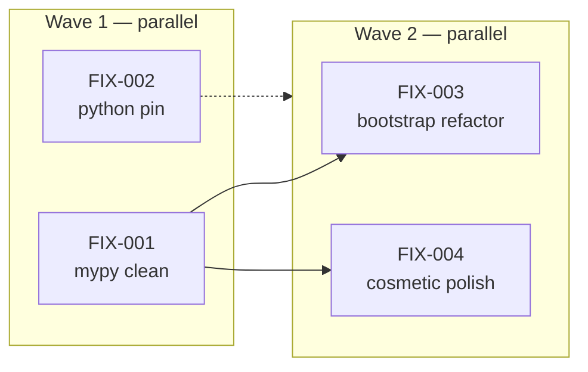

# Implementation Guide — Phase 1 Review Fixes

**Parent review:** [TASK-REV-J001](../../in_review/TASK-REV-J001-plan-project-scaffolding-supervisor-sessions.md)
**Review report:** [FEAT-JARVIS-001-review-report.md](../../../.claude/reviews/FEAT-JARVIS-001-review-report.md)
**Parent feature:** FEAT-JARVIS-001 — Project Scaffolding, Supervisor Skeleton & Session Lifecycle
**Generated by:** `/task-review FEAT-JARVIS-001 → [I]mplement` on 2026-04-22
**Complexity:** 3/10 average · **Tasks:** 4 · **Waves:** 2

---

## §1 Why this exists

FEAT-JARVIS-001 shipped 11 tasks of scaffolding, supervisor, sessions, CLI, and smoke tests. The post-build review ([report §Executive Summary](../../../.claude/reviews/FEAT-JARVIS-001-review-report.md)) found the feature correctly implements every ASSUM-* / DDR-* / invariant, but two findings block Phase 1 Success Criteria as written in [phase1-build-plan.md §Success Criteria](../../../docs/research/ideas/phase1-build-plan.md):

- **Success Criterion #5** ("all Phase 1 smoke tests pass"): 1/341 tests fails — environment-fragile subprocess call.
- **Success Criterion #6** ("ruff + mypy clean on `src/jarvis/`"): ruff clean, mypy has 5 errors.

Two more findings are medium-severity bootstrap cleanups worth doing before downstream features (FEAT-002/003) start extending `AppState` and the CLI entry path. One finding is cosmetic.

None of the fixes require re-scoping. Total estimated effort: **~75 minutes** across 4 atomic tasks.

---

## §2 Task breakdown

| ID | Title | Mode | Complexity | Mins | Wave |
|---|---|---|---|---|---|
| TASK-J001-FIX-001 | Fix mypy type errors in `src/jarvis/` (Success Criterion #6) | direct | 3 | 15 | 1 |
| TASK-J001-FIX-002 | Pin Python 3.12 end-to-end and stabilise the subprocess entry-point test | direct | 2 | 10 | 1 |
| TASK-J001-FIX-003 | Tighten `AppState` typing and move logging configuration to CLI entry | task-work | 5 | 35 | 2 |
| TASK-J001-FIX-004 | Cosmetic polish — `correlation_id`, `HumanMessage` hoist, ruff-fix tests/ | direct | 2 | 15 | 2 |

`direct` = apply the edits straight from the task file. `task-work` = run through the full `/task-work` pipeline (plan → architectural review → implement → test → code review).

---

## §3 Wave map



### Wave 1 — parallel (both direct-mode)

File-level conflict check: zero overlap between FIX-001 and FIX-002.

| Task | Files touched |
|---|---|
| FIX-001 | `src/jarvis/agents/supervisor.py`, `src/jarvis/sessions/manager.py`, `src/jarvis/infrastructure/logging.py` |
| FIX-002 | `.python-version`, `README.md`, `tests/test_build_system.py` |

Recommended Conductor workspaces:

- `phase1-review-fixes-wave1-1` (FIX-001)
- `phase1-review-fixes-wave1-2` (FIX-002)

### Wave 2 — parallel after FIX-001 lands

FIX-003 depends on FIX-001's `CompiledStateGraph` parameterisation so it can inherit the same type parameters when it retypes `AppState.supervisor`.

FIX-004 depends on FIX-001's `sessions/manager.py` changes so the `HumanMessage` hoist does not collide with FIX-001's `CompiledStateGraph` annotation edit.

FIX-003 ↔ FIX-004 file-conflict check: zero overlap (FIX-003 touches `lifecycle.py` + `cli/main.py`; FIX-004 touches `session.py`, `manager.py` non-type lines, and `tests/`).

| Task | Files touched |
|---|---|
| FIX-003 | `src/jarvis/infrastructure/lifecycle.py`, `src/jarvis/cli/main.py`, possibly `tests/test_infrastructure.py` / `tests/test_cli.py` |
| FIX-004 | `src/jarvis/sessions/session.py`, `src/jarvis/sessions/manager.py`, `tests/test_smoke_end_to_end.py`, `tests/test_supervisor_no_llm_call.py`, `tests/test_build_system.py`, `tests/test_import_graph.py` |

Recommended Conductor workspaces:

- `phase1-review-fixes-wave2-1` (FIX-003)
- `phase1-review-fixes-wave2-2` (FIX-004)

---

## §4 Integration contract — each task leaves these green

At the **end of every task** the following must all pass:

```bash
uv run pytest tests/                  # 341 pass (after FIX-002); 340 pass before FIX-002
uv run ruff check src/jarvis/         # clean (always)
uv run ruff check tests/              # clean (after FIX-004 only; allowed to fail until then)
uv run mypy src/jarvis/               # clean (after FIX-001 only; allowed to fail until then)
```

Success Criterion coverage after all 4 tasks land:

- **#5** — FIX-002 stabilises the one failing test; 341 / 341 pass ✓
- **#6** — FIX-001 clears mypy; ruff stays clean; criterion met ✓
- **#1–#4, #7–#10** — already met in FEAT-JARVIS-001; none of the FIX tasks regress them

---

## §5 Ordered execution recipe

```bash
# Wave 1 (parallel — open two Conductor workspaces, or run serially if preferred)
/task-work TASK-J001-FIX-001    # ~15 min
/task-work TASK-J001-FIX-002    # ~10 min

# Regression check between waves
uv run pytest tests/             # expect 341 / 341 pass
uv run mypy src/jarvis/          # expect clean
uv run ruff check src/jarvis/    # expect clean

# Wave 2 (parallel after Wave 1)
/task-work TASK-J001-FIX-003    # ~35 min
/task-work TASK-J001-FIX-004    # ~15 min

# Final regression check
uv run pytest tests/             # expect 341 / 341 pass
uv run mypy src/jarvis/          # expect clean
uv run ruff check src/jarvis/ tests/  # expect clean
uv run jarvis health             # expect: supervisor: ok / memory store: ready / exit 0
```

If any task's coach validation fails, stop and do not proceed to the next wave. Review findings should be fixed without re-opening the scope of the parent feature.

---

## §6 When this feature folder is done

- All 4 FIX tasks move from `backlog` → `completed`.
- The parent review task [TASK-REV-J001](../../in_review/TASK-REV-J001-plan-project-scaffolding-supervisor-sessions.md) can be transitioned from `review_complete` → `completed`.
- The review report [FEAT-JARVIS-001-review-report.md](../../../.claude/reviews/FEAT-JARVIS-001-review-report.md) has no outstanding HIGH or MEDIUM findings.
- Phase 1 Success Criteria 1–10 are all met; FEAT-JARVIS-001 is ready to be declared closed.
