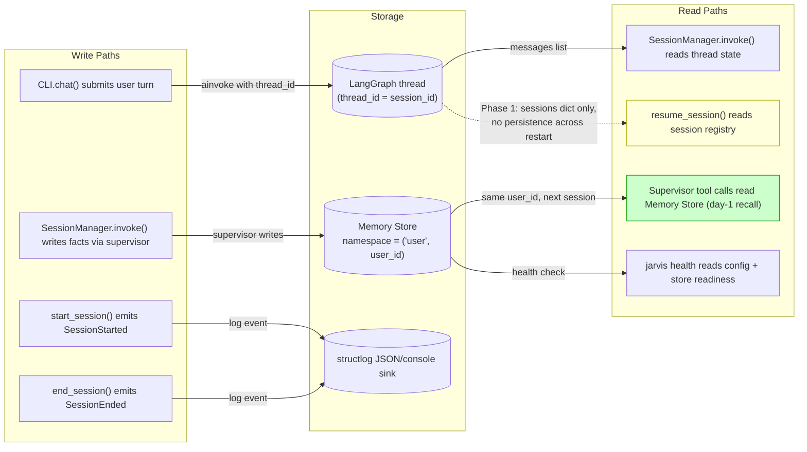
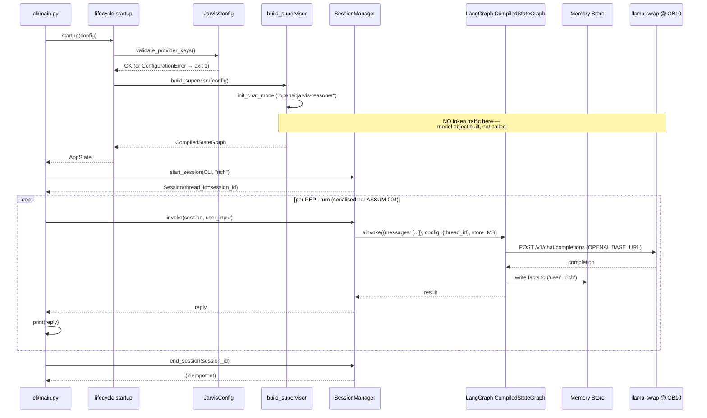
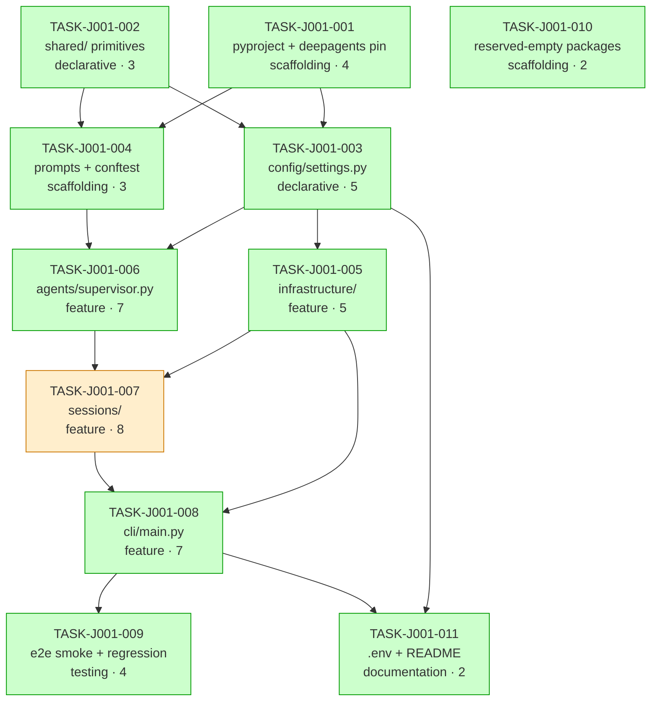

# Implementation Guide — FEAT-JARVIS-001

**Feature:** Project Scaffolding, Supervisor Skeleton & Session Lifecycle
**Review task:** [TASK-REV-J001](../TASK-REV-J001-plan-project-scaffolding-supervisor-sessions.md)
**Generated by:** `/feature-plan` on 2026-04-21
**Complexity:** 7/10 · **Tasks:** 11 · **Waves:** 6

---

## §1 Scope summary

Phase 1 foundation: a runnable Python 3.12 scaffold, a DeepAgents supervisor with built-ins only, a thread-per-session `SessionManager` with user-keyed Memory Store, and a `jarvis` CLI (`chat` / `version` / `health`). Success criterion: Rich holds a useful conversation on the CLI on day 1, and a fact stated in session A is recalled in session B for the same user.

Upstream artefacts (all complete): [`docs/architecture/`](../../../docs/architecture/) (30 ADRs), [`docs/design/FEAT-JARVIS-001/`](../../../docs/design/FEAT-JARVIS-001/) (design + DDRs + contracts + C4 L3), [`features/project-scaffolding-supervisor-sessions/`](../../../features/project-scaffolding-supervisor-sessions/) (35 BDD scenarios, 6 assumptions all confirmed, `review_required: false`).

---

## §2 Data Flow: Read/Write Paths (MANDATORY)

**What to look for:** the green `R2` path is the day-1 cross-session recall criterion. The yellow `R3` path is deliberately non-durable in Phase 1 — Jarvis restart invalidates live sessions (`@edge-case` scenario + ADR-ARCH-008). All write paths have consumers. **No disconnection alert.**

---

## §3 Integration Contract Diagram (MANDATORY — complexity 7)

**What to look for:** `build_supervisor` does NOT issue a warm-up token request (the grey note). The `store=MS` kwarg is load-bearing — without it, cross-session recall silently fails. The REPL `print → read next line` ordering is the ASSUM-004 serialisation contract.

---

## §4 Integration Contracts (MANDATORY — cross-task dependencies exist)

### Contract: `SUPERVISOR_MODEL_ENDPOINT`

- **Producer task:** `TASK-J001-003` (config/settings.py)
- **Consumer task(s):** `TASK-J001-006` (agents/supervisor.py)
- **Artifact type:** environment variable + config field
- **Format constraint:** `supervisor_model` MUST be provider-prefixed — `"openai:<model>"`, `"anthropic:<model>"`, `"google_genai:<model>"`. When the prefix is `openai:`, `OPENAI_BASE_URL` MUST be set (for Phase 1 this routes to llama-swap at `http://promaxgb10-41b1:9000/v1`). The supervisor factory consumes the string verbatim via `init_chat_model(config.supervisor_model)` — it MUST NOT mutate, strip, or re-prefix the string.
- **Validation method:** Coach verifies (a) `TASK-J001-003`'s field_validator rejects bare `"jarvis-reasoner"` with `ValidationError`; (b) `TASK-J001-003`'s `validate_provider_keys()` names `OPENAI_BASE_URL` in the error when `openai:` prefix is used and the base URL is absent; (c) `TASK-J001-006`'s supervisor factory calls `init_chat_model(config.supervisor_model)` with no string manipulation.

### Contract: `COMPILED_SUPERVISOR_GRAPH`

- **Producer task:** `TASK-J001-006` (agents/supervisor.py)
- **Consumer task(s):** `TASK-J001-007` (sessions/manager.py)
- **Artifact type:** in-process Python object (`langgraph.graph.CompiledStateGraph`)
- **Format constraint:** A `CompiledStateGraph` produced by `create_deep_agent(...)` with DeepAgents built-ins (`write_todos`, virtual filesystem, `task`) enabled, `execute` disabled, no subagents, no custom tools. Consumer (`SessionManager.invoke`) MUST pass BOTH `config={"configurable": {"thread_id": session.thread_id}}` AND `store=self._store` to `supervisor.ainvoke(...)` — either missing breaks Memory Store recall.
- **Validation method:** Coach greps `sessions/manager.py` for `ainvoke(` calls and confirms both `config=` and `store=` kwargs present on every call site. Seam test in `TASK-J001-007` asserts `thread_id == session_id` (DDR-004) and that no Memory Store key contains `session_id` (DDR-002).

### Contract: `APP_STATE`

- **Producer task:** `TASK-J001-005` (infrastructure/lifecycle.py)
- **Consumer task(s):** `TASK-J001-008` (cli/main.py)
- **Artifact type:** in-process Python object (`@dataclass(frozen=True) AppState`)
- **Format constraint:** `AppState(config: JarvisConfig, supervisor: CompiledStateGraph, store: BaseStore, session_manager: SessionManager)` — all four fields set at construction. `startup()` configures logging BEFORE `config.validate_provider_keys()` so config-load errors are emitted as structured log events.
- **Validation method:** Coach verifies `startup()`'s first line calls `logging.configure(...)` and the next line (or close to it) calls `config.validate_provider_keys()`. Coach verifies `version` command does NOT construct `AppState` (no config load per feature file); `health` and `chat` both construct `AppState` via `startup()`.

---

## §5 Task Dependency Graph (MANDATORY — 11 tasks)

_Green = wave-peer parallel-safe with other greens in the same wave. Amber `T7` (sessions) is the sole wave-4 occupant — serial by necessity (depends on both supervisor + infrastructure)._

---

## §6 Execution waves

| Wave | Mode | Tasks | Rationale |
|------|------|-------|-----------|
| 1 | parallel | TASK-J001-001, TASK-J001-002, TASK-J001-010 | Disjoint file sets; all leaf-level scaffolding |
| 2 | parallel | TASK-J001-003, TASK-J001-004 | Depend only on wave 1; disjoint dirs (`config/` vs `prompts/` + `tests/conftest.py`) |
| 3 | parallel | TASK-J001-005, TASK-J001-006 | Depend on wave 2; disjoint dirs (`infrastructure/` vs `agents/`) |
| 4 | serial | TASK-J001-007 | Depends on BOTH supervisor (wave 3) and infrastructure (wave 3); sole occupant |
| 5 | serial | TASK-J001-008 | CLI consumes SessionManager + AppState; sole occupant of its wave |
| 6 | parallel | TASK-J001-009, TASK-J001-011 | E2E smoke + docs both depend on CLI (wave 5); disjoint — tests/ vs README.md + .env.example |

**Estimated wall-clock:** 3–4 working days matching [phase1-build-plan.md §Expected Timeline](../../../docs/research/ideas/phase1-build-plan.md).

**Conductor workspaces recommended** for waves 1, 2, 3, 6 (parallel execution).

---

## §7 Per-task commit strategy

Per [phase1-build-plan.md §Success Criteria #10](../../../docs/research/ideas/phase1-build-plan.md), AutoBuild produces **one logical commit per wave-per-task**:

1. `feat(scaffold): pyproject.toml with deepagents>=0.5.3,<0.6 pin` (TASK-J001-001)
2. `feat(shared): constants, Adapter enum, exception hierarchy` (TASK-J001-002)
3. `feat(reserve): empty package namespaces for FEAT-002..008` (TASK-J001-010)
4. `feat(config): JarvisConfig with provider-key validation` (TASK-J001-003)
5. `feat(prompts): supervisor system prompt + test conftest` (TASK-J001-004)
6. `feat(infra): structlog + lifecycle startup/shutdown` (TASK-J001-005)
7. `feat(agents): build_supervisor factory (DeepAgents built-ins, token-free)` (TASK-J001-006)
8. `feat(sessions): Session + SessionManager with user-keyed Memory Store` (TASK-J001-007)
9. `feat(cli): click group chat/version/health + REPL + SIGINT=130` (TASK-J001-008)
10. `test(smoke): end-to-end CLI → supervisor → stdout + import-graph regression` (TASK-J001-009)
11. `docs: .env.example + README Quickstart + .gitignore audit` (TASK-J001-011)

---

## §8 Invariants (do-not-change)

1. `deepagents>=0.5.3,<0.6` pin — never drop the upper bound in Phase 1 (ADR-ARCH-010).
2. `src/jarvis/` layer structure matches ADR-ARCH-006 five-group layout exactly — no new top-level packages in Phase 1.
3. Supervisor is DeepAgents built-ins only — no custom tools (FEAT-002), no subagents (FEAT-003), no skills (FEAT-007).
4. `build_supervisor` is token-free at build time.
5. Memory Store namespace = `("user", user_id)` — no `session_id` segment (DDR-002).
6. `thread_id == session_id` in Phase 1 (DDR-004).
7. CLI has exactly three commands: `chat`, `version`, `health` (DDR-003).
8. Concurrent invoke on the same session is refused, not serialised (ASSUM-003).
9. `/exit` is case-sensitive lowercase with whitespace trimmed (ASSUM-002).
10. Default supervisor model routes through llama-swap — no accidental cloud-LLM calls on unattended paths (local-first user memory).

---

## §9 Risks & watch-points

| Risk | Mitigation |
|------|-----------|
| DeepAgents 0.5.3 API drift | Supervisor tests assert structure (tool inventory), not factory identity. Factory switch costs one edit. |
| `create_deep_agent` doesn't expose an explicit `disable_builtins` for `execute` | Pass `tools=[]`; if `execute` is a built-in enabled by default in 0.5.3, consult the SDK's disable path before implementation. Coach verifies via tool inventory, not via the call signature. |
| llama-swap unreachable during `jarvis health` or `jarvis chat` | Health degrades gracefully (covered by @edge-case @integration scenarios). `build_supervisor` is token-free so health validates structure without the endpoint. |
| `InMemoryStore` semantics subtly differ from LangGraph docs across 0.3.x versions | `tests/test_sessions.py` write-session-A / read-session-B test catches this. File-backed + Graphiti backends are deferred. |
| SIGINT handler race with in-flight ainvoke | SIGINT handler calls `end_session` then `sys.exit(130)`; the in-flight invoke may log a cancelled-task warning — acceptable. Do not attempt graceful cancel in Phase 1. |
| ruff/mypy rules inherited from specialist-agent are too strict for a fresh scaffold | Start with specialist-agent's config; relax per-module with `# noqa` or `[[tool.mypy.overrides]]` on a case-by-case basis. Do not weaken the global config. |

---

## §10 Next actions

1. Review tasks in `tasks/backlog/project-scaffolding-supervisor-sessions/` (11 files).
2. Start AutoBuild on Wave 1: `/feature-build FEAT-JARVIS-001` (or manually `/task-work TASK-J001-001 --implement-only`).
3. After Wave 5 passes: run `/task-review FEAT-JARVIS-001` per [phase1-build-plan.md Step 6](../../../docs/research/ideas/phase1-build-plan.md).
4. Record day-1 conversation evidence per [phase1-build-plan.md Step 8](../../../docs/research/ideas/phase1-build-plan.md).

---

*Plan generated by `/feature-plan` on 2026-04-21. Upstream: `/system-arch` + `/system-design FEAT-JARVIS-001` + `/feature-spec FEAT-JARVIS-001` (all complete).*
