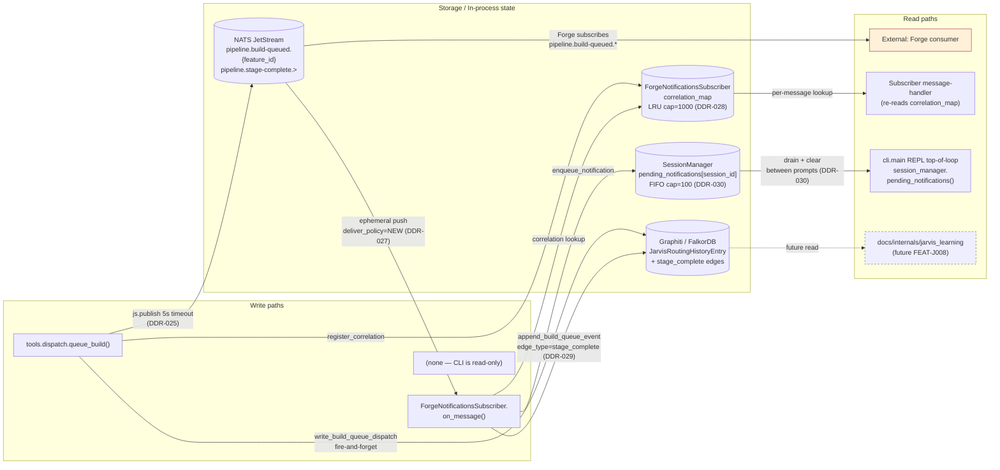
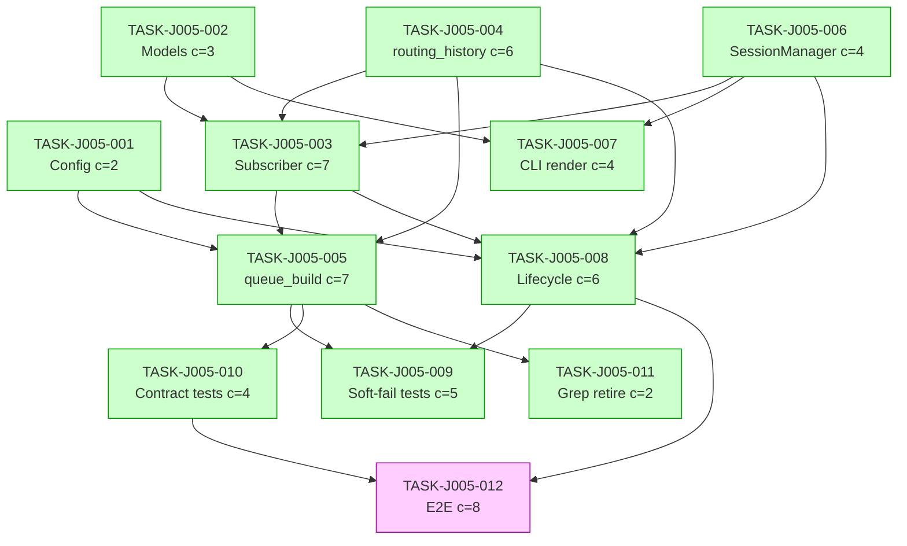

# IMPLEMENTATION-GUIDE.md — FEAT-JARVIS-005: Build Queue Dispatch to Forge

| Item | Value |
|---|---|
| Feature ID | `FEAT-J005-946D` |
| Parent review | `TASK-REV-3B8B` |
| Source design | [docs/design/FEAT-JARVIS-005/design.md](../../../docs/design/FEAT-JARVIS-005/design.md) |
| Source spec | [features/feat-jarvis-005-…/feat-jarvis-005-…_summary.md](../../../features/feat-jarvis-005-build-queue-dispatch-to-forge/feat-jarvis-005-build-queue-dispatch-to-forge_summary.md) |
| Tasks | 12 across 5 waves |
| Aggregate complexity | 7/10 (Medium-high) |
| Approach | design.md §13 7-wave verbatim, auto-collapsed by dependency analysis to 5 waves |
| Testing depth | Standard (Coach-validated quality gates per task) |
| Execution | Auto-detected — Waves 1–4 have parallel-safe slots |

---

## §1: Wave structure

```
Wave 1 (4 parallel)  ─ TASK-J005-001  Config extensions               (declarative, c=2)
                     ─ TASK-J005-002  Notification + Correlation models (declarative, c=3)
                     ─ TASK-J005-004  routing_history.py extensions    (feature, c=6)
                     ─ TASK-J005-006  SessionManager pending queue     (feature, c=4)

Wave 2 (2 parallel)  ─ TASK-J005-003  ForgeNotificationsSubscriber     (feature, c=7)
                     ─ TASK-J005-007  CLI between-prompts render       (feature, c=4)

Wave 3 (2 parallel)  ─ TASK-J005-005  queue_build real publish swap    (feature, c=7)
                     ─ TASK-J005-008  lifecycle.py wiring              (feature, c=6)

Wave 4 (3 parallel)  ─ TASK-J005-009  Soft-fail tests                  (testing, c=5)
                     ─ TASK-J005-010  Contract tests vs nats-core      (testing, c=4)
                     ─ TASK-J005-011  Grep-invariant retire            (testing, c=2)

Wave 5 (1 task, soft-prereq)
                     ─ TASK-J005-012  End-to-end Forge round-trip      (testing, c=8)
```

> **Note on wave count**: design.md §13 suggested 7 waves as a *commit ordering*.
> When mapped to AutoBuild dependency-driven parallelism, the dependency graph
> collapses to 5 waves (more parallel slots, same blast radius). The
> commit-order interpretation is preserved within each wave; the wave boundary
> is now where dependencies require sequencing.

---

## §2: Data flow — read/write paths

This is the most important diagram in the guide. Every write path and every
read path for FEAT-JARVIS-005 is connected. There are no disconnections.



**Caption** — All write paths have a corresponding read. The
`docs/internals/jarvis_learning` consumer is shown dotted because it lands in a
later feature (FEAT-J008) — it does not block FEAT-J005. There is no unwired
read path. **Disconnection alert: none.**

---

## §3: Integration contract — `queue_build` runtime sequence

```mermaid
sequenceDiagram
    autonumber
    participant T as queue_build (tools.dispatch)
    participant SEM as DispatchSemaphore
    participant SESS as Current Session
    participant CFG as JarvisConfig
    participant SUB as ForgeNotificationsSubscriber
    participant JS as NATS JetStream
    participant RHW as RoutingHistoryWriter

    T->>SEM: try_acquire()
    alt saturated (DDR-020)
        SEM-->>T: False
        T-->>T: return DEGRADED dispatch_capacity_saturated
    else acquired
        SEM-->>T: True
        T->>SESS: read Session.adapter (DDR-031)
        SESS-->>T: adapter (or fallback to arg if no session)
        T->>T: build BuildQueuedPayload + MessageEnvelope(source_id="jarvis")
        T->>CFG: pipeline_publish_timeout_seconds
        CFG-->>T: 5
        T->>JS: js.publish(subject, body) wrapped in asyncio.wait_for(timeout=5)
        alt PubAck within 5s
            JS-->>T: PubAck (transport receipt only — DDR-025)
            T->>SUB: register_correlation(correlation_id, session_id, adapter, queued_at, feature_id)
            SUB-->>T: ok (LRU may evict oldest with WARN)
            T->>RHW: write_build_queue_dispatch(entry) [fire-and-forget]
            RHW-->>T: returns immediately
            T-->>T: return {"status": "queued", "correlation_id": ...}
        else timeout
            JS--xT: asyncio.TimeoutError
            T-->>T: return DEGRADED transport_unavailable
        end
    end

    Note over T,JS: PubAck ≠ delivery. Forge consumption is asynchronous;<br/>Jarvis returns "queued" the moment JetStream confirms persistence.
```

**Caption** — This sequence is the test target for TASK-J005-005. Notice the
`Session.adapter` read is **before** envelope construction (DDR-031): the
reasoning model's tool argument cannot influence the `originating_adapter` when
a session is active.

---

## §4: Integration Contracts (cross-task data flow)

This section is the contract surface every consumer must honour. Each contract
below has a `consumer_context` block in the consumer task's frontmatter.

### Contract: ForgeNotification + BuildCorrelation models
- **Producer task:** TASK-J005-002
- **Consumer task(s):** TASK-J005-003, TASK-J005-007
- **Artifact type:** Python module / Pydantic v2 frozen `BaseModel` classes
- **Format constraint:** `frozen=True`, `extra="ignore"`;
  `ForgeNotification.render_line()` emits canonical
  `[HH:MM] Forge {feature_id}: stage {stage_label} ({status})` per
  DM-forge-notification §1
- **Validation method:** Coach verifies importability + `frozen=True` invariant;
  TASK-J005-003 + TASK-J005-007 seam tests verify model_config and render_line
  signature

### Contract: ForgeNotificationsSubscriber.register_correlation
- **Producer task:** TASK-J005-003
- **Consumer task(s):** TASK-J005-005
- **Artifact type:** Python method on subscriber
- **Format constraint:**
  `register_correlation(correlation_id, session_id, adapter, queued_at, feature_id)`
  populates LRU map (DDR-028); cap = `JarvisConfig.forge_correlation_map_cap`;
  oldest evicted with WARN; idempotent on duplicate correlation_id
- **Validation method:** TASK-J005-005 integration test verifies the call shape
  and that the correlation_id returned in the ack matches the entry

### Contract: RoutingHistoryWriter.write_build_queue_dispatch
- **Producer task:** TASK-J005-004
- **Consumer task(s):** TASK-J005-005
- **Artifact type:** async writer method
- **Format constraint:**
  `write_build_queue_dispatch(entry: JarvisRoutingHistoryEntry) -> None`;
  fire-and-forget via `asyncio.create_task`; entry must have
  `subagent_type="forge_build_queue"` and `subagent_task_id=correlation_id`
- **Validation method:** TASK-J005-005 integration test verifies one write per
  successful publish; Graphiti dump verifies entry shape

### Contract: RoutingHistoryWriter.append_build_queue_event (DDR-029)
- **Producer task:** TASK-J005-004
- **Consumer task(s):** TASK-J005-003
- **Artifact type:** async writer method emitting Graphiti edge
- **Format constraint:**
  `append_build_queue_event(correlation_id, payload: StageCompletePayload) -> None`
  emits an edge with `edge_type="stage_complete"` whose body is
  `payload.model_dump_json()`; **frozen=True invariant** on the parent
  `JarvisRoutingHistoryEntry` is preserved (DDR-018) — no field overwrites
- **Validation method:** TASK-J005-003 unit test verifies edge_type, body
  shape, and frozen invariant; TASK-J005-004 unit test verifies multiple
  events for one correlation produce multiple distinct edges

### Contract: SessionManager.enqueue_notification + pending_notifications
- **Producer task:** TASK-J005-006
- **Consumer task(s):** TASK-J005-003 (enqueue), TASK-J005-007 (drain)
- **Artifact type:** SessionManager methods
- **Format constraint:**
  `enqueue_notification(session_id, notification: ForgeNotification) -> None`
  appends to per-session FIFO (cap=100); oldest evicted on overflow with WARN
  `forge_notification_queue_overflow`. `pending_notifications(session_id) ->
  list[ForgeNotification]` drains + clears atomically;
  `end_session(session_id)` clears and discards future enqueues
- **Validation method:** TASK-J005-003 + TASK-J005-007 seam tests assert method
  presence; boundary scenarios (Group B #1–2) verify cap and eviction; Group
  D #1 verifies cross-session isolation

### Contract: NATS JetStream publish — pipeline.build-queued
- **Producer task:** TASK-J005-005 (Jarvis publish)
- **Consumer task(s):** Forge (external; verified locally by TASK-J005-010
  contract tests against `nats-core` types)
- **Artifact type:** NATS JetStream subject + payload bytes
- **Format constraint:**
  - Subject: `nats_core.Topics.Pipeline.BUILD_QUEUED.format(feature_id=...)`
    (no hard-coded subject strings)
  - Payload: `MessageEnvelope(source_id="jarvis", payload=BuildQueuedPayload(...))`
    serialized via `model_dump_json().encode()`
  - `BuildQueuedPayload` from `nats_core.events` — verbatim, no Jarvis
    extensions
  - PubAck = transport receipt only (DDR-025); 5s `asyncio.wait_for` enforced
- **Validation method:** TASK-J005-010 contract tests round-trip the payload
  through the real `nats-core` types; TASK-J005-011 grep-invariant asserts no
  hard-coded subject strings

### Contract: NATS JetStream subscribe — pipeline.stage-complete.>
- **Producer task:** Forge (external)
- **Consumer task(s):** TASK-J005-003
- **Artifact type:** NATS JetStream ephemeral push consumer
- **Format constraint:**
  - Subject pattern: `pipeline.stage-complete.>`
  - Consumer config: ephemeral, `deliver_policy=NEW`, auto-ack (DDR-027)
  - Envelope `source_id` MUST equal `"forge"` — drop with WARN otherwise
    (Group C #1, security attestation)
  - `StageCompletePayload` from `nats_core.events` — verbatim, additional
    unknown fields tolerated (`extra="ignore"`)
  - `stop()` drains within 5s even with unresponsive broker (ASSUM-011)
- **Validation method:** TASK-J005-010 contract tests verify the subscribe-side
  envelope contract; TASK-J005-009 soft-fail tests verify the bounded stop

---

## §5: Task dependency graph



**Caption** — Green nodes are parallel-safe within their wave (4 waves of
parallelism). Wave 5 (TASK-J005-012, magenta) is single-task and soft-prereq
gated.

---

## §6: Verification of cross-cutting concerns

The following invariants are verified across multiple tasks. They are listed
here so a reviewer can quickly confirm the plan honours them:

| Invariant | Source | Tasks verifying |
|---|---|---|
| `frozen=True` on `JarvisRoutingHistoryEntry` preserved across stage-complete events | DDR-018 | TASK-J005-004 (writer), TASK-J005-003 (subscriber tests) |
| Stage-complete events land as **append-only edges**, not field overwrites | DDR-029 | TASK-J005-004, TASK-J005-003 |
| `originating_adapter` from `Session.adapter`, not reasoning-model arg | DDR-031 | TASK-J005-005 (impl + Group D #4 security test) |
| 5s publish timeout → DEGRADED `transport_unavailable` | DDR-025 | TASK-J005-005, TASK-J005-009 |
| Per-session queue cap=100 with WARN on overflow | DDR-030 | TASK-J005-006 (Group B #1–2) |
| Correlation map cap=1000 LRU with WARN on eviction | DDR-028 | TASK-J005-003 (Group B #3–4) |
| `pipeline.stage-complete.>` ephemeral, `deliver_policy=NEW`, auto-ack | DDR-027 | TASK-J005-003 (impl), TASK-J005-010 (contract test) |
| No hard-coded subject strings in `src/jarvis/` | ADR-SP-016 | TASK-J005-005 (impl), TASK-J005-010 + TASK-J005-011 (grep) |
| Graphiti errors WARN-only; never raise | DDR-019 | TASK-J005-004, TASK-J005-009 |
| NATS-down soft-fail; `forge_subscriber=None` | DDR-021 | TASK-J005-008, TASK-J005-009 |
| Cross-repo: `BuildQueuedPayload` / `StageCompletePayload` from `nats-core` verbatim | summary §Forge Cross-Repo Contract | TASK-J005-010 |

---

## §7: Smoke gates between waves

`smoke_gates:` is **not** declared in the generated YAML. With Standard testing
depth (Coach-validated quality gates per task) and the §6 invariants verified by
contract tests in Wave 4, an additional inter-wave smoke oracle is not required
for the merge path. Wave 5 (E2E) is the *evidence* test for Phase 3 close;
that is gated externally on GB10 availability.

> If FEAT-J005 ever runs through `/feature-build` (AutoBuild) end-to-end, add
> `smoke_gates:` with `python -c "import jarvis"` between waves at minimum.

---

## §8: Execution checklist

- [ ] Wave 1 (4 parallel) — declarative scaffolding lands first; no integration
      tests (no integrations to test yet)
- [ ] Wave 2 (2 parallel) — subscriber + CLI render; mocked SessionManager and
      mocked routing-history allow isolated testing
- [ ] Wave 3 (2 parallel) — queue_build swap + lifecycle wiring; integration
      tests against in-process JetStream test server land here
- [ ] Wave 4 (3 parallel) — soft-fail + cross-repo contract + grep retire;
      these are the merge-gating tests
- [ ] **Merge gate** — at this point FEAT-J005 is functionally complete; merge
      is unblocked
- [ ] Wave 5 (1 task, soft-prereq) — End-to-end Forge round-trip; Phase 3
      close evidence; runs against GB10 Forge / NATS / Graphiti

---

## §9: Next steps

1. (optional) Run BDD scenario linker — `Step 11` of `/feature-plan`
   automatically tags the 32 scenarios in
   `features/feat-jarvis-005-build-queue-dispatch-to-forge/feat-jarvis-005-build-queue-dispatch-to-forge.feature`
   with `@task:TASK-J005-NNN` so the R2 task-level BDD oracle fires during
   `/task-work`.
2. Begin Wave 1: `/task-work TASK-J005-001` (config) and `/task-work
   TASK-J005-002` (models) can run in parallel — they touch unrelated files.
3. AutoBuild option: `/feature-build FEAT-J005-946D` runs all waves
   autonomously against the Player/Coach loop.
4. After Wave 4 lands and tests pass, set up the GB10 environment per
   phase3-build-plan §14 and run TASK-J005-012.
