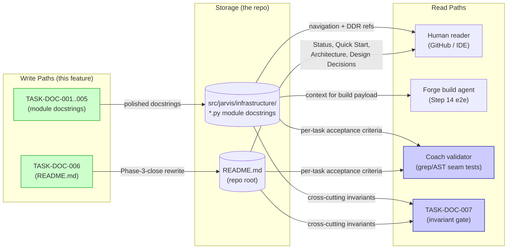
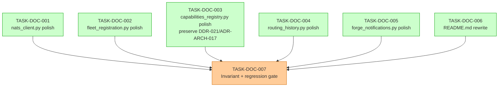

# IMPLEMENTATION-GUIDE.md — FEAT-JARVIS-INTERNAL-001 Documentation Foundation

**Feature ID**: `FEAT-43DE`
**Parent review**: [`TASK-REV-C241`](../../completed/TASK-REV-C241-plan-feat-jarvis-internal-001-documentation-foundation.md) (path resolved at `/feature-complete` time)
**Approach**: Option 1 — Wave-based parallel polish (6 + 1)
**Aggregate complexity**: 18/70 (≈ 2.5/10 per task)
**Estimated wall-clock**: 60–90 min
**Phase 3 alignment**: Step 13 → Step 14 close criterion in
[`docs/research/ideas/phase3-build-plan.md`](../../../docs/research/ideas/phase3-build-plan.md).

## What this feature does

Polishes the five FEAT-J004/J005 infrastructure module docstrings under
`src/jarvis/infrastructure/` and rewrites the repo-root `README.md` to
reflect Phase-3-close state. This is the **documentation payload** for
the end-to-end Forge round-trip in Step 14 — the last work needed before
Phase 3 closes.

**Six in-scope files**:
- `src/jarvis/infrastructure/nats_client.py`
- `src/jarvis/infrastructure/fleet_registration.py`
- `src/jarvis/infrastructure/capabilities_registry.py`
- `src/jarvis/infrastructure/routing_history.py`
- `src/jarvis/infrastructure/forge_notifications.py`
- `README.md`

**Hard out-of-scope (FEAT-J004/J005 invariant)**:
- `src/jarvis/tools/*.py` `@tool`-decorated docstrings — must remain
  byte-identical to `main` HEAD prior to this feature. The reasoning model
  has been routing against these since Phase 2; touching them is a
  behavioural confound during the Step-14 transport validator.

## §1: Wave structure

```
Wave 1 (parallel, 6 tasks, ≈ 30 min):
  ├─ TASK-DOC-001  nats_client.py docstring polish
  ├─ TASK-DOC-002  fleet_registration.py docstring polish
  ├─ TASK-DOC-003  capabilities_registry.py docstring polish
  │                  (preserve DDR-021 / ADR-ARCH-017)
  ├─ TASK-DOC-004  routing_history.py docstring polish
  ├─ TASK-DOC-005  forge_notifications.py docstring polish
  └─ TASK-DOC-006  README.md Phase-3-close rewrite

Wave 2 (sequential, 1 task, ≈ 30 min):
  └─ TASK-DOC-007  FEAT-J004/J005 invariant + full Phase-3 regression gate
```

All wave-1 tasks are **fully independent** — different files, no merge
contention. They can be executed in parallel via Conductor or
sequentially in the same worktree (Context B Q2 left this auto-detect).

## §2: Data flow

The whole feature is documentation, but the docstring/README payload still
has well-defined producers and consumers. The diagram below documents
those flows for the chosen approach (Option 1).



_Caption: every write path has at least three read paths (human,
Coach-per-task, invariant gate). No disconnected paths._

**Disconnection check**: ✅ no orphan write or read paths.

## §3: Task dependency graph



_Caption: green tasks are wave-1 (parallel-safe). Orange task is the
sequential wave-2 gate that depends on all six wave-1 tasks._

## §5: Scenario → task mapping

This mapping is the input to the BDD-linker step (Step 11 of /feature-plan).
Each row of the .feature file's `Examples:` blocks maps to exactly one
task; the cross-cutting `@smoke` invariants land on TASK-DOC-007.

| Group | Scenario | Mapped task |
|---|---|---|
| A.1 | Each module has a Purpose paragraph (5 rows) | DOC-001 / DOC-002 / DOC-003 / DOC-004 / DOC-005 |
| A.2 | Each module references its FEAT-JARVIS origin (5 rows) | DOC-001 / DOC-002 / DOC-003 / DOC-004 / DOC-005 |
| A.3 | Each module cites at least one DDR (5 rows) | DOC-001 / DOC-002 / DOC-003 / DOC-004 / DOC-005 |
| A.4 | Each module links to its design doc (5 rows) | DOC-001 / DOC-002 / DOC-003 / DOC-004 / DOC-005 |
| A.5 | README has H1 with project name (`@smoke`) | DOC-006 |
| A.6 | README declares Phase-3-close status (`@smoke`) | DOC-006 |
| A.7 | README Quick Start matches canonical install/run | DOC-006 |
| A.8 | README links to the architecture document | DOC-006 |
| A.9 | README catalogues the design-decision locations | DOC-006 |
| B.1 | README line count within bounds (4 rows) | DOC-006 |
| B.2 | Module docstring length within bounds (5 rows) | DOC-001 / DOC-002 / DOC-003 / DOC-004 / DOC-005 |
| C.1 | Tool docstrings byte-unchanged (`@smoke`) | **DOC-007** |
| C.2 | No executable code modified | **DOC-007** |
| C.3 | Cited design-doc paths resolve | DOC-001 / DOC-002 / DOC-003 / DOC-004 / DOC-005 |
| C.4 | No TASK-Jxxx in polished (`@smoke`) | DOC-001..005 (per file) + DOC-007 (cross) |
| C.5 | README does not mention Pre-Architecture | DOC-006 |
| D.1 | Modules importable + graphs compile (`@smoke`) | **DOC-007** |
| D.2 | Pytest green + coverage ≥ 92% (`@smoke`) | **DOC-007** |
| D.3 | mypy delta = 0 | **DOC-007** |
| D.4 | README in-repo links are relative paths | DOC-006 |
| D.5 | DDR-021 / ADR-ARCH-017 preserved in capabilities_registry | **DOC-003** |

Smoke set: 7 scenarios (A.1, A.2, A.5, A.6, C.1, C.4, D.1, D.2 — actually
8 by tag count once outline rows expand, but 7 distinct scenario
definitions). All `@smoke` rows are Coach-blocking on the task they map to.

## §6: Risks and mitigations

| Risk | Mitigation | Owner |
|---|---|---|
| Tool-docstring invariant accidentally violated | TASK-DOC-007 runs `ast.get_docstring` diff against `main` HEAD for every `@tool`-decorated function in `src/jarvis/tools/{general,capabilities,dispatch}.py` | DOC-007 |
| DDR-021 / ADR-ARCH-017 dropped during capabilities_registry polish | Explicit AC + grep test on TASK-DOC-003 (R-5 from review) | DOC-003 |
| Module docstring exceeds 250 lines after polish | Wave-1 task's own AC + ASSUM-002 cap; mitigation = prefer pruning historical narrative over removing DDR citations | DOC-001..005 |
| pytest baseline slips below 92% coverage | TASK-DOC-007's Group D.2 gate; impossible in practice for documentation-only changes but verified anyway | DOC-007 |
| Pre-existing mypy error returns | ASSUM-011 delta-test — only **new** errors in modified files block, decoupled from TASK-REV-FFE4 timing | DOC-007 |
| 49 pre-existing ruff cosmetic violations re-flagged | Out of scope per the feature summary; documented but not blocking | (none — separate cleanup) |

## §7: How to run

### Auto-detected execution (Context B Q2 default)

The autobuild engine decides parallel vs sequential based on what's
available at runtime. If GuardKit autobuild detects a Conductor / worktree
backend, wave 1 runs in parallel; otherwise it falls back to sequential
execution within a single worktree.

```bash
# Once .guardkit/features/FEAT-43DE.yaml exists:
guardkit autobuild feature FEAT-43DE --verbose --max-turns 30
```

Wave 2 always runs sequentially after wave 1 completes — this is encoded
in TASK-DOC-007's `dependencies:` frontmatter (depends on all six wave-1
tasks).

### Manual / direct mode (per-task)

Each wave-1 task is `implementation_mode: direct` — the polish is small
enough to run inline:

```bash
/task-work TASK-DOC-001
/task-work TASK-DOC-002
/task-work TASK-DOC-003
/task-work TASK-DOC-004
/task-work TASK-DOC-005
/task-work TASK-DOC-006
# Then, after all six are complete:
/task-work TASK-DOC-007
```

## §8: Acceptance — feature-level

The feature is complete when all of the following hold:

- All six wave-1 tasks: `status: completed`.
- TASK-DOC-007: `status: completed`, all 8 acceptance criteria green.
- The .feature file under
  `features/feat-jarvis-internal-001-documentation-foundation/feat-jarvis-internal-001-documentation-foundation.feature`
  has every scenario tagged with `@task:TASK-DOC-XXX` (this is what the
  Step 11 BDD-linker phase produces).
- `git diff main..HEAD` is restricted to docstring text and `README.md`.
- 2105+ pytest passing / 0 failed @ ≥ 92% coverage; mypy 0-delta;
  langgraph dev boots both graphs.

Then `/feature-complete FEAT-43DE` migrates the seven task files to
`tasks/completed/feat-jarvis-internal-001-documentation-foundation/` and
marks `.guardkit/features/FEAT-43DE.yaml` `status: completed`.
